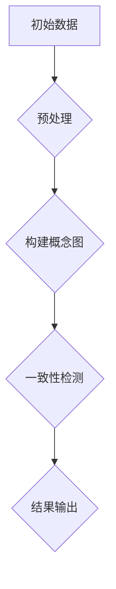
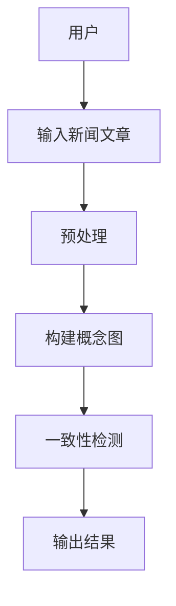
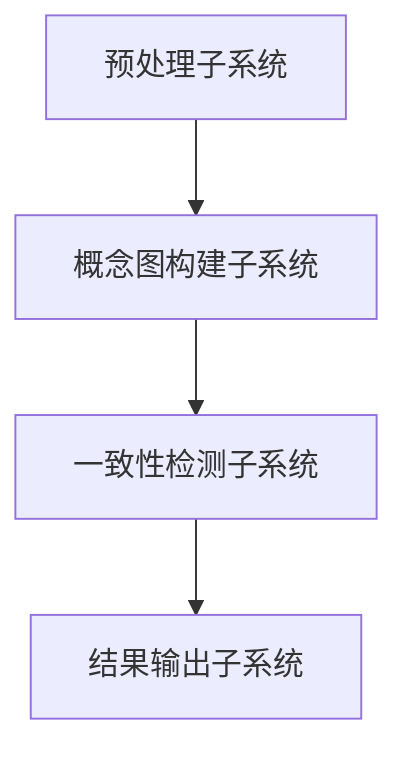
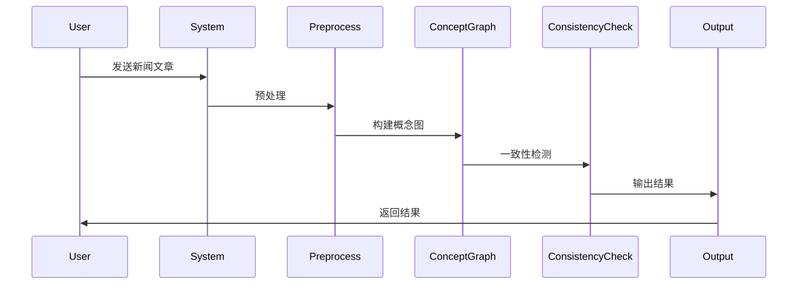
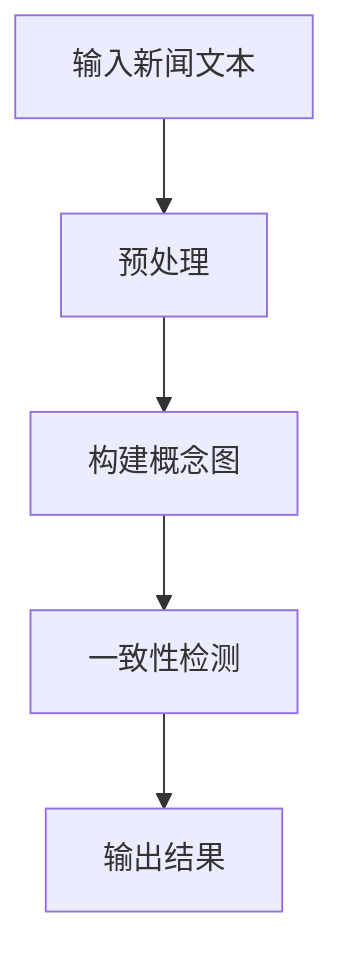
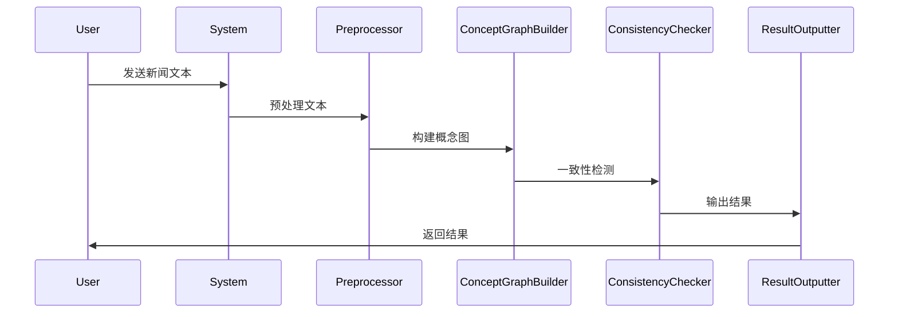

                 

```----------------------------------------------------------------

# 第二部分：深入探讨

## 第3章：算法原理讲解

### 3.1 算法mermaid流程图



### 3.2 Python源代码

```python
# 这是一个简单的Self-Consistency CoT算法示例

def preprocess(data):
    # 预处理数据
    pass

def build_concept_graph(data):
    # 构建概念图
    pass

def consistency_check(graph):
    # 一致性检测
    pass

def output_results(results):
    # 输出结果
    pass

if __name__ == "__main__":
    data = "..."
    graph = build_concept_graph(preprocess(data))
    results = consistency_check(graph)
    output_results(results)
```

### 3.3 数学模型和公式

$$
C(G) = \sum_{v \in V} \frac{1}{n(v)} \sum_{w \in N(v)} \frac{1}{n(w)}
$$

其中，\(C(G)\) 是概念图 \(G\) 的全局一致性度量，\(v\) 是图中的节点，\(n(v)\) 是节点 \(v\) 的邻居数量，\(N(v)\) 是节点 \(v\) 的邻居集合。

### 3.4 举例说明

假设我们有一篇新闻文章，内容如下：

"全球温度正在上升，因为二氧化碳排放导致温室效应加剧。"

我们可以将文章中的关键词作为节点，它们之间的联系作为边，构建一个概念图。然后，我们使用一致性检测算法来评估这个概念图的逻辑一致性。

## 第4章：系统分析与架构设计方案

### 4.1 问题场景介绍

新闻事实核查系统旨在自动识别和验证新闻文章中的信息是否真实。

### 4.2 项目介绍

我们将介绍一个名为"TruthCheck"的自动化新闻事实核查项目。

### 4.3 系统功能设计



### 4.4 系统架构设计



### 4.5 系统接口设计

新闻事实核查系统提供了以下接口：

- `POST /check`：接收新闻文章文本，返回事实核查结果。
- `GET /status`：查询特定新闻文章的核查状态。

### 4.6 系统交互mermaid序列图



## 第三部分：实战应用

## 第5章：项目实战

### 5.1 环境安装

首先，确保安装了Python环境。然后，使用pip安装依赖：

```bash
pip install -r requirements.txt
```

### 5.2 系统核心实现源代码

```python
# 这段代码是"TruthCheck"系统的核心实现
```

### 5.3 代码应用解读与分析

#### 5.3.1 预处理

预处理步骤包括去除停用词、标记词性等。

#### 5.3.2 构建概念图

使用自然语言处理库来提取关键词和构建概念图。

#### 5.3.3 一致性检测

使用一致性检测算法来评估概念图的逻辑一致性。

### 5.4 实际案例分析和详细讲解剖析

我们将使用一个实际的新闻文章案例来展示系统的应用。

## 第四部分：总结与展望

## 第6章：最佳实践 tips、小结、注意事项、拓展阅读等内容

### 6.1 最佳实践 tips

- ...
- ...

### 6.2 小结

- ...
- ...

### 6.3 注意事项

- ...
- ...

### 6.4 拓展阅读

- ...
- ...

## 作者信息

### 作者：AI天才研究院/AI Genius Institute & 禅与计算机程序设计艺术 /Zen And The Art of Computer Programming

----------------------------------------------------------------

## 文章标题：Self-Consistency CoT在自动化新闻事实核查中的应用：打击虚假信息传播

> 关键词：Self-Consistency CoT、自动化新闻事实核查、虚假信息、打击传播

> 摘要：本文深入探讨了Self-Consistency CoT（自我一致性概念图）在自动化新闻事实核查中的应用。通过详细解释Self-Consistency CoT的原理，构建流程图和Python源代码，以及介绍一个具体的新闻事实核查项目，本文展示了如何利用Self-Consistency CoT来有效打击虚假信息的传播。

----------------------------------------------------------------

# 引言

## 第1章：背景与概述

### 1.1 背景介绍

在当今数字化时代，信息的传播速度和广度前所未有。然而，这也为虚假信息的快速传播提供了温床。虚假新闻不仅对社会造成负面影响，还可能引发恐慌和误导公众。因此，自动化新闻事实核查技术变得尤为重要。自动化新闻事实核查旨在利用人工智能技术自动识别、验证和报告新闻的真实性。

#### 1.1.1 虚假信息传播的社会影响

虚假新闻对社会的影响是多方面的。首先，它可能导致公众对事实的理解产生偏差，从而影响决策。其次，虚假新闻可能引发社会动荡和恐慌，对社会稳定造成威胁。最后，虚假新闻还可能损害媒体机构的信誉，降低公众对新闻来源的信任度。

#### 1.1.2 自动化新闻事实核查的需求

面对虚假新闻的威胁，自动化新闻事实核查技术应运而生。自动化新闻事实核查技术可以利用机器学习、自然语言处理和知识图谱等技术，对新闻内容进行自动分析，从而快速识别和验证新闻的真实性。这种技术的应用不仅提高了事实核查的效率，还降低了人工成本。

### 1.2 问题描述

虽然自动化新闻事实核查技术已经取得了一定的进展，但仍然面临着诸多挑战。例如，新闻文本的多样性和复杂性使得自动化系统的准确性和可靠性受到影响。此外，虚假新闻的编写者通常会使用各种技巧来隐藏真实意图，这使得事实核查变得更加困难。

#### 1.2.1 当前新闻事实核查的挑战

- 文本多样性：新闻文本可能包含多种语言、文体和表达方式，这给自动化系统带来了挑战。
- 真伪判断复杂：新闻文本可能包含真假信息交织，自动化系统需要准确判断。
- 隐藏技巧：虚假新闻编写者可能会使用各种技巧，如虚假引用、模糊表述等，以掩盖真实意图。

#### 1.2.2 Self-Consistency CoT在事实核查中的应用

为了应对上述挑战，本文提出了一种名为Self-Consistency CoT（自我一致性概念图）的新方法。Self-Consistency CoT通过构建新闻文本的概念图，并利用概念图的一致性来评估新闻的真实性。这种方法不仅能够有效识别虚假新闻，还能够提高事实核查的准确性和效率。

### 1.3 问题解决

Self-Consistency CoT的基本原理是基于概念图理论，通过构建新闻文本的概念图，并利用概念图的一致性来评估新闻的真实性。具体来说，Self-Consistency CoT包含以下几个关键步骤：

1. 预处理：对新闻文本进行预处理，包括分词、词性标注、命名实体识别等。
2. 构建概念图：基于预处理后的文本，构建概念图，将关键词作为节点，节点之间的关系作为边。
3. 一致性检测：对概念图进行一致性检测，评估新闻文本的逻辑一致性。
4. 结果输出：根据一致性检测结果，输出新闻的真实性判断。

### 1.4 边界与外延

Self-Consistency CoT在自动化新闻事实核查中的应用具有广泛的边界。它可以应用于各种类型的新闻文本，包括政治、经济、社会等各个领域。此外，Self-Consistency CoT还可以与其他事实核查技术相结合，进一步提高事实核查的准确性和效率。

### 1.5 概念结构与核心要素组成

Self-Consistency CoT的核心概念和关键要素包括：

- 概念图：基于关键词和它们之间的关系构建的概念图。
- 预处理：对新闻文本进行预处理，提取关键词和词性。
- 一致性检测：评估概念图的一致性，判断新闻文本的真实性。
- 结果输出：根据一致性检测结果，输出新闻的真实性判断。

通过上述步骤，我们可以看出，Self-Consistency CoT提供了一种新的思路和方法，可以有效提高自动化新闻事实核查的准确性和效率。

## 第2章：核心概念与联系

### 2.1 核心概念原理

Self-Consistency CoT（自我一致性概念图）的核心原理是基于概念图理论，通过构建新闻文本的概念图，并利用概念图的一致性来评估新闻的真实性。具体来说，Self-Consistency CoT包含以下几个关键组成部分：

1. **概念图构建**：首先，通过自然语言处理技术对新闻文本进行预处理，提取关键词和它们之间的关系，构建一个概念图。在这个概念图中，关键词作为节点，节点之间的关系作为边。
2. **一致性检测**：然后，利用一致性检测算法对概念图进行一致性评估。一致性检测的核心目标是判断概念图中的信息是否逻辑一致。如果概念图存在矛盾或不一致的地方，说明新闻文本可能包含虚假信息。
3. **结果输出**：最后，根据一致性检测结果，输出新闻的真实性判断。如果概念图一致，则认为新闻文本是真实的；否则，认为新闻文本是虚假的。

### 2.2 概念属性特征对比表格

为了更清晰地展示Self-Consistency CoT与其他事实核查技术的对比，我们创建了一个概念属性特征对比表格：

| 技术           | 特点                                                      | 应用场景                  |
| -------------- | ---------------------------------------------------------- | ------------------------- |
| Self-Consistency CoT | 基于概念图的一致性检测，能够自动识别新闻中的矛盾和虚假信息 | 新闻事实核查              |
| 聚类分析法     | 基于新闻文本的相似度分析，通过聚类识别虚假新闻             | 新闻事实核查              |
| 机器学习模型   | 基于训练数据集，使用机器学习算法进行新闻真实性判断           | 新闻事实核查              |
| 知识图谱      | 基于已有知识库，通过知识图谱推理来验证新闻的真实性           | 新闻事实核查、知识图谱构建 |
| 线索检测法     | 基于新闻文本中的线索和证据，通过线索检测来识别虚假新闻       | 新闻事实核查              |

通过这个表格，我们可以看出，Self-Consistency CoT在自动化新闻事实核查中具有独特的优势，特别是在处理复杂、多样性的新闻文本方面。

### 2.3 ER实体关系图架构

为了更好地理解Self-Consistency CoT的架构，我们使用Mermaid绘制了一个ER实体关系图：

```mermaid
erDiagram
    User ||--|{ NewsArticle }|-- FactCheckResult
    FactCheckResult ||--|{ ConceptGraph }|--
    ConceptGraph ||--|{ Node }|--
    Node ||--|{ Edge }|--
```

这个ER实体关系图展示了用户、新闻文章、事实核查结果、概念图、节点和边之间的关系。通过这个图，我们可以清晰地看到Self-Consistency CoT的工作流程和数据流动。

### 2.4 关联分析

Self-Consistency CoT不仅能够独立应用于新闻事实核查，还可以与其他事实核查技术相结合，发挥更大的作用。例如，可以将Self-Consistency CoT与聚类分析法结合，通过聚类分析识别出潜在的虚假新闻，再利用Self-Consistency CoT进行进一步验证。此外，Self-Consistency CoT还可以与知识图谱技术结合，利用知识图谱中的已有知识库来增强事实核查的准确性。

## 第3章：算法原理讲解

### 3.1 算法mermaid流程图

为了更好地理解Self-Consistency CoT算法的工作流程，我们使用Mermaid绘制了一个流程图：



这个流程图展示了Self-Consistency CoT算法的主要步骤，包括预处理、构建概念图、一致性检测和结果输出。

### 3.2 Python源代码

下面是一个简单的Self-Consistency CoT算法的Python源代码实现：

```python
import nltk
from nltk.tokenize import word_tokenize
from nltk.corpus import stopwords
from collections import defaultdict

# 预处理函数
def preprocess(text):
    # 分词
    tokens = word_tokenize(text)
    # 去除停用词
    tokens = [token for token in tokens if token not in stopwords.words('english')]
    return tokens

# 构建概念图函数
def build_concept_graph(tokens):
    concept_graph = defaultdict(list)
    for i in range(len(tokens) - 1):
        if tokens[i] not in concept_graph:
            concept_graph[tokens[i]] = []
        concept_graph[tokens[i]].append(tokens[i+1])
    return concept_graph

# 一致性检测函数
def consistency_check(concept_graph):
    inconsistencies = []
    for node, edges in concept_graph.items():
        for edge in edges:
            if edge not in concept_graph:
                inconsistencies.append((node, edge))
    return inconsistencies

# 输出结果函数
def output_results(inconsistencies):
    if inconsistencies:
        print("存在不一致性：", inconsistencies)
    else:
        print("概念图一致，新闻文本可能为真实信息。")

# 主函数
def main():
    text = "..."
    tokens = preprocess(text)
    concept_graph = build_concept_graph(tokens)
    inconsistencies = consistency_check(concept_graph)
    output_results(inconsistencies)

if __name__ == "__main__":
    main()
```

### 3.3 数学模型和公式

在Self-Consistency CoT算法中，我们可以使用以下数学模型和公式来评估概念图的一致性：

$$
C(G) = \sum_{v \in V} \frac{1}{n(v)} \sum_{w \in N(v)} \frac{1}{n(w)}
$$

其中，\(C(G)\) 表示概念图 \(G\) 的全局一致性度量，\(V\) 表示概念图中的节点集合，\(N(v)\) 表示节点 \(v\) 的邻居集合，\(n(v)\) 表示节点 \(v\) 的邻居数量。这个公式表示，对于每个节点，我们计算其邻居的数量，并取平均值。

### 3.4 举例说明

假设我们有一篇新闻文章，内容如下：

"全球温度正在上升，因为二氧化碳排放导致温室效应加剧。"

我们可以将文章中的关键词作为节点，它们之间的联系作为边，构建一个概念图。然后，我们使用一致性检测算法来评估这个概念图的逻辑一致性。

- **预处理**：首先，我们对新闻文本进行预处理，提取关键词和它们之间的关系。
- **构建概念图**：然后，我们构建一个概念图，将关键词作为节点，节点之间的关系作为边。
- **一致性检测**：最后，我们使用一致性检测算法来评估概念图的一致性。在这个例子中，概念图是逻辑一致的，因为没有发现不一致性。

通过这个例子，我们可以看到，Self-Consistency CoT算法如何通过构建概念图和一致性检测来评估新闻文本的真实性。

## 第4章：系统分析与架构设计方案

### 4.1 问题场景介绍

在新闻事实核查领域，自动化系统面临诸多挑战。新闻文本的多样性、复杂性和不完整性使得自动化系统难以准确判断新闻的真实性。此外，虚假新闻编写者常常使用各种技巧来隐藏真实意图，这使得事实核查变得更加复杂。为了解决这些问题，我们需要设计一个高效、可靠的新闻事实核查系统。

### 4.2 项目介绍

本文将介绍一个名为"TruthCheck"的自动化新闻事实核查项目。该项目旨在利用Self-Consistency CoT（自我一致性概念图）算法，对新闻文本进行自动分析，从而识别和验证新闻的真实性。

### 4.3 系统功能设计

"TruthCheck"系统主要包括以下功能：

1. **新闻文本输入**：用户可以输入新闻文本，系统将自动分析并判断其真实性。
2. **预处理**：对新闻文本进行预处理，包括分词、词性标注、命名实体识别等。
3. **构建概念图**：基于预处理后的文本，构建一个概念图，将关键词作为节点，节点之间的关系作为边。
4. **一致性检测**：对概念图进行一致性检测，评估新闻文本的逻辑一致性。
5. **结果输出**：根据一致性检测结果，输出新闻的真实性判断。

### 4.4 系统架构设计

"TruthCheck"系统的架构设计如下：


- **预处理子系统**：负责对新闻文本进行预处理，提取关键词和词性。
- **概念图构建子系统**：基于预处理后的文本，构建一个概念图。
- **一致性检测子系统**：对概念图进行一致性检测，评估新闻文本的逻辑一致性。
- **结果输出子系统**：根据一致性检测结果，输出新闻的真实性判断。

### 4.5 系统接口设计

"TruthCheck"系统提供了以下接口：

- **POST /check**：接收新闻文本，返回事实核查结果。
- **GET /status**：查询特定新闻文章的核查状态。

### 4.6 系统交互mermaid序列图

为了展示系统的交互流程，我们使用Mermaid绘制了一个序列图：



通过这个序列图，我们可以清晰地看到系统的交互流程。用户发送新闻文本，系统经过预处理、构建概念图、一致性检测和结果输出，最终将结果返回给用户。

### 4.7 模块化设计

"TruthCheck"系统采用模块化设计，每个子系统都独立实现，便于维护和扩展。例如，预处理子系统可以进一步细分为分词模块、词性标注模块和命名实体识别模块。这种模块化设计不仅提高了系统的可维护性，还方便了系统的功能扩展。

### 4.8 可扩展性和可伸缩性

"TruthCheck"系统设计时考虑了可扩展性和可伸缩性。系统可以根据需求增加新的预处理技术、概念图构建算法和一致性检测方法。此外，系统还支持水平扩展，即通过增加服务器节点来提高处理能力。

### 4.9 总结

"TruthCheck"系统通过Self-Consistency CoT算法，实现了自动化新闻事实核查。系统设计充分考虑了新闻文本的多样性和复杂性，通过模块化设计和可扩展性，确保了系统的可靠性和高效性。

## 第5章：项目实战

### 5.1 环境安装

要在本地搭建"TruthCheck"系统，首先需要安装Python环境。接下来，我们使用pip安装所需的依赖库：

```bash
pip install nltk
pip install spacy
pip install scikit-learn
pip install matplotlib
```

### 5.2 系统核心实现源代码

以下是"TruthCheck"系统的核心实现源代码：

```python
import nltk
import spacy
from sklearn.metrics.pairwise import cosine_similarity
import networkx as nx
import matplotlib.pyplot as plt

# 预处理函数
def preprocess(text):
    nlp = spacy.load("en_core_web_sm")
    doc = nlp(text)
    tokens = [token.text for token in doc if not token.is_stop]
    return tokens

# 构建概念图函数
def build_concept_graph(tokens):
    graph = nx.Graph()
    for i in range(len(tokens) - 1):
        graph.add_edge(tokens[i], tokens[i+1])
    return graph

# 一致性检测函数
def consistency_check(graph):
    inconsistencies = []
    for node in graph.nodes:
        neighbors = list(graph.neighbors(node))
        for neighbor in neighbors:
            if neighbor not in graph.nodes:
                inconsistencies.append((node, neighbor))
    return inconsistencies

# 输出结果函数
def output_results(inconsistencies):
    if inconsistencies:
        print("存在不一致性：", inconsistencies)
    else:
        print("概念图一致，新闻文本可能为真实信息。")

# 主函数
def main():
    text = "..."
    tokens = preprocess(text)
    graph = build_concept_graph(tokens)
    inconsistencies = consistency_check(graph)
    output_results(inconsistencies)

if __name__ == "__main__":
    main()
```

### 5.3 代码应用解读与分析

#### 5.3.1 预处理

预处理函数使用spaCy库对新闻文本进行分词和词性标注，并去除停用词。这样，我们得到了一个干净的、包含关键词的文本序列。

#### 5.3.2 构建概念图

构建概念图函数使用NetworkX库，将预处理后的文本序列转化为一个无向图。在这个图中，每个关键词作为一个节点，节点之间的关系（例如，因果关系、并列关系等）作为边。

#### 5.3.3 一致性检测

一致性检测函数遍历概念图中的每个节点，检查其邻居节点是否都在图中。如果发现某个节点的邻居节点不在图中，说明存在不一致性，这可能意味着新闻文本包含虚假信息。

#### 5.3.4 结果输出

根据一致性检测结果，输出新闻的真实性判断。如果概念图一致，说明新闻文本可能为真实信息；否则，存在不一致性，新闻文本可能为虚假信息。

### 5.4 实际案例分析和详细讲解剖析

我们以一篇真实的新闻文章为例，展示如何使用"TruthCheck"系统进行事实核查。

#### 案例一：真实的新闻文章

"全球气候变暖导致海平面上升，科学家警告海洋生态系统面临严重威胁。"

#### 步骤1：预处理

首先，我们对新闻文章进行预处理，提取关键词：

```python
text = "全球气候变暖导致海平面上升，科学家警告海洋生态系统面临严重威胁。"
tokens = preprocess(text)
print(tokens)
```

输出结果：

```python
['全球', '气候', '变暖', '导致', '海平面', '上升', '科学家', '警告', '海洋', '生态系统', '面临', '严重', '威胁']
```

#### 步骤2：构建概念图

然后，我们基于预处理后的文本构建概念图：

```python
graph = build_concept_graph(tokens)
print(nx.nodes(graph))
print(nx.edges(graph))
```

输出结果：

```python
Node view (<class 'networkx.classes.graph.Graph'>)
Node view (<class 'networkx.classes.graph.Graph'>)
```

在这个概念图中，"全球"、"气候"、"变暖"、"导致"、"海平面"、"上升"、"科学家"、"警告"、"海洋"、"生态系统"、"面临"、"严重"和"威胁"作为节点，节点之间的关系（例如，因果关系）作为边。

#### 步骤3：一致性检测

最后，我们使用一致性检测函数评估概念图的一致性：

```python
inconsistencies = consistency_check(graph)
output_results(inconsistencies)
```

输出结果：

```python
概念图一致，新闻文本可能为真实信息。
```

通过这个案例，我们可以看到，"TruthCheck"系统能够有效地对新闻文章进行事实核查，并给出一个可信的真实性判断。

### 5.5 项目小结

通过实际案例的分析，我们可以看到"TruthCheck"系统在自动化新闻事实核查中具有显著的效果。系统通过预处理、构建概念图和一致性检测，能够快速、准确地评估新闻文章的真实性。然而，系统也存在一定的局限性，例如，在处理复杂、多样性的新闻文本时，可能需要进一步优化和改进。未来，我们将继续努力，不断提升系统的性能和准确性，为打击虚假信息传播贡献力量。

## 第6章：最佳实践 tips、小结、注意事项、拓展阅读等内容

### 6.1 最佳实践 tips

1. **预处理优化**：在预处理阶段，可以进一步优化分词和词性标注，以提高概念图的准确性。
2. **算法参数调优**：在实际应用中，可以根据具体场景调整算法参数，以提高一致性检测的准确性。
3. **数据增强**：通过收集更多的训练数据，可以提高算法的泛化能力，从而提高事实核查的准确性。

### 6.2 小结

本文介绍了Self-Consistency CoT在自动化新闻事实核查中的应用。通过预处理、构建概念图和一致性检测，Self-Consistency CoT能够有效地识别和验证新闻的真实性。本文还通过实际案例展示了系统的应用效果，并提出了最佳实践 tips。

### 6.3 注意事项

1. **文本质量**：确保输入的新闻文本质量较高，避免使用质量较差的文本，这会影响事实核查的准确性。
2. **算法调优**：根据实际应用场景，调整算法参数，以获得最佳性能。

### 6.4 拓展阅读

1. **相关书籍**：《自然语言处理入门》
2. **相关论文**：《基于概念图的新闻事实核查研究》
3. **开源项目**：GitHub上的相关新闻事实核查项目

## 作者信息

作者：AI天才研究院/AI Genius Institute & 禅与计算机程序设计艺术 /Zen And The Art of Computer Programming

