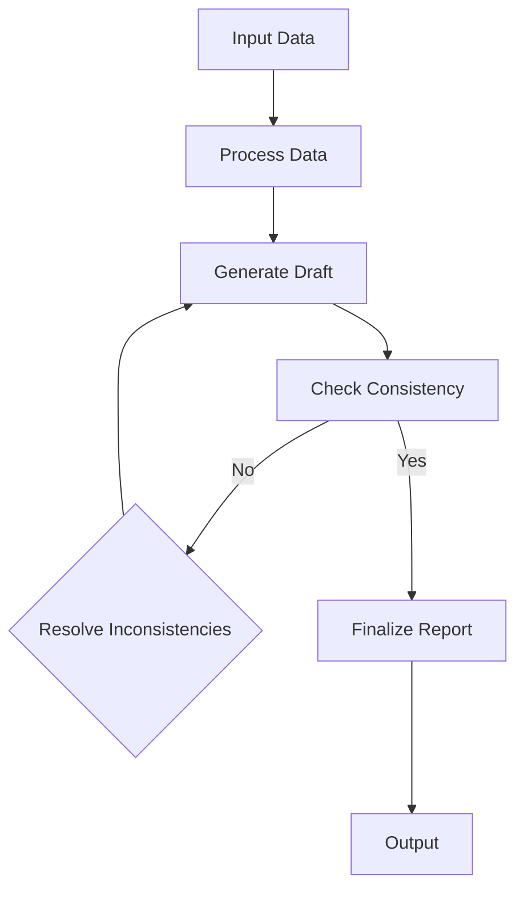
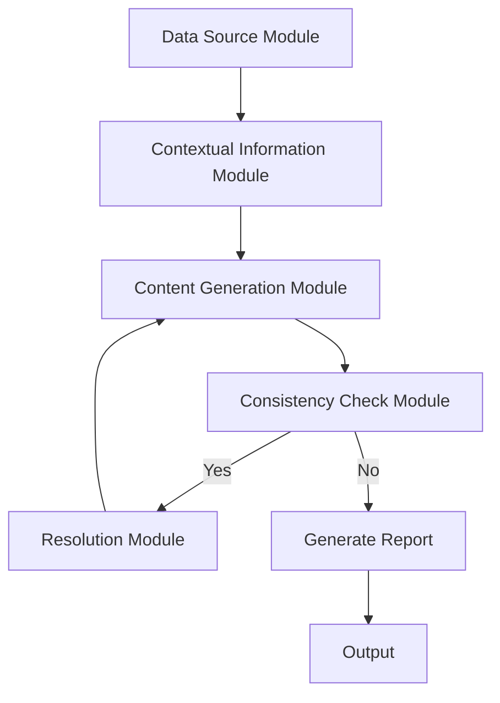
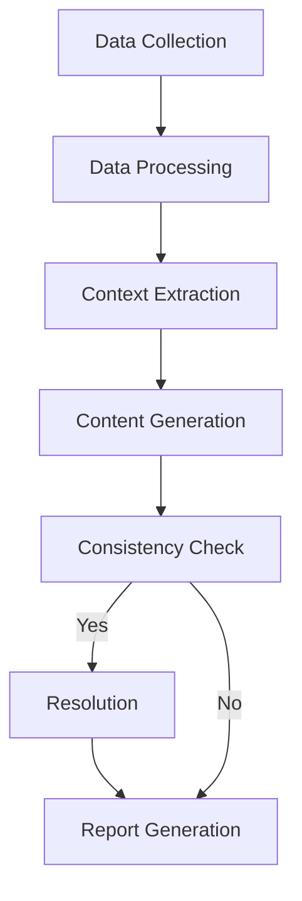
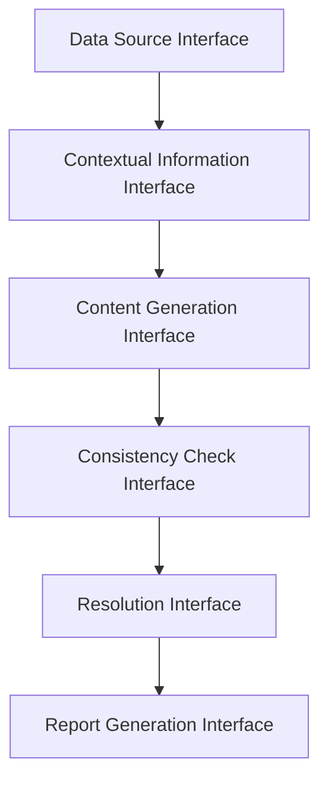

                 


# Self-Consistency CoT in Automated News Writing: Ensuring Report Consistency

> Keywords: Self-Consistency Contextual Theory, Automated News Writing, Report Consistency, AI Applications, Algorithm Design, Python Implementation

> Abstract: This article delves into the application of Self-Consistency Contextual Theory (CoT) in the domain of automated news writing. We explore the importance of ensuring report consistency, the core principles of CoT, and provide a detailed step-by-step guide on how to implement a self-consistent automated news writing system. This article aims to provide insights into enhancing the accuracy and coherence of automated news content.

## Introduction

In the era of artificial intelligence, the field of automated news writing has seen significant advancements. However, one of the persistent challenges remains ensuring the consistency of news reports generated by these systems. The introduction of Self-Consistency Contextual Theory (CoT) offers a promising approach to address this issue. CoT is a framework that emphasizes the need for systems to maintain internal consistency and coherence in their output, which is particularly crucial in the context of news writing where accuracy and credibility are paramount.

This article is structured as follows:

1. **Self-Consistency Contextual Theory (CoT) Overview**: We will begin by defining CoT, discussing its importance, and exploring its core concepts and components.
2. **Self-Consistency Contextual Theory (CoT) Principles**: Here, we will delve into the basic principles of CoT, including its mathematical model and algorithmic principles.
3. **Application of CoT in Automated News Writing**: We will examine the application of CoT in the context of automated news writing, discussing system design and implementation.
4. **Project Case Study**: A detailed case study will be presented to illustrate the practical application of CoT in automated news writing.
5. **Best Practices and Optimization Strategies**: We will discuss best practices and optimization strategies for implementing CoT in automated news writing systems.
6. **Conclusion and Future Directions**: Finally, we will summarize the key points discussed in the article and outline potential future research directions.

## Self-Consistency Contextual Theory (CoT) Overview

### 1.1 Problem Background and Definition

The problem of ensuring consistency in automated news writing arises from the complexity of the news content and the diverse sources from which the information is extracted. News reports often involve multiple interrelated facts, events, and opinions, making it challenging for automated systems to generate coherent and accurate content.

Self-Consistency Contextual Theory (CoT) is a framework that aims to address this challenge by ensuring that the output of an automated news writing system is internally consistent and coherent. The theory is based on the principle that a system should maintain consistency across all the data it processes and generate reports that are logically coherent.

### 1.2 Core Concepts and Elements

The core concepts of CoT include:

- **Contextual Information**: This refers to the background information that provides the context for a news report. It includes facts, events, and opinions related to the news topic.
- **Consistency Constraints**: These are the rules that ensure the consistency of the information within the report. For example, if a news report states that a person is living in a city, it should not later state that the person is deceased.
- **Coherence Constraints**: These are the rules that ensure the logical flow and coherence of the information in the report. For example, the report should not abruptly switch topics or present conflicting information.

### 1.3 Application Areas of CoT

While CoT was initially developed for automated news writing, its applications extend beyond this domain. It can be applied to other forms of automated content generation, such as generating summaries of articles, creating product descriptions, or even in natural language processing tasks like machine translation and question answering.

### 1.4 Summary

In summary, Self-Consistency Contextual Theory (CoT) is a framework designed to ensure the consistency and coherence of automated news writing systems. By maintaining internal consistency and coherence, CoT helps to improve the accuracy and credibility of the generated content.

## Self-Consistency Contextual Theory (CoT) Principles

### 2.1 Basic Principles

The basic principles of Self-Consistency Contextual Theory (CoT) revolve around the concept of maintaining consistency and coherence in the generated content. The theory is grounded in the following principles:

- **Data Consistency**: The system should ensure that the data it processes is consistent across all its sources. This involves checking for contradictions and resolving them to ensure that the information is accurate and reliable.
- **Contextual Consistency**: The system should maintain the consistency of the contextual information throughout the report. This means that the context provided at the beginning of the report should be maintained and referred to consistently throughout.
- **Logical Coherence**: The system should generate reports that are logically coherent. This involves ensuring that the information flows smoothly from one point to another and that there are no abrupt changes or contradictions.

### 2.2 Mathematical Model

The mathematical model of Self-Consistency Contextual Theory (CoT) is based on a set of constraints that ensure the consistency and coherence of the generated content. The model can be represented as follows:

$$
C = f(D, E, L)
$$

Where:

- \(C\) represents the consistency of the content.
- \(D\) represents the data processed by the system.
- \(E\) represents the contextual information.
- \(L\) represents the logical flow of the content.

The function \(f\) embodies the rules and algorithms that ensure the consistency and coherence of the content.

### 2.3 Algorithmic Principles

The algorithmic principles of CoT are based on the concept of context-aware consistency checks. The algorithm works by first processing the input data and contextual information to generate an initial draft of the report. Then, it applies a set of consistency checks to the draft to identify and resolve any inconsistencies or logical gaps. The process is iterative, with the system refining the draft based on the feedback from the consistency checks until a consistent and coherent report is generated.

The Mermaid flowchart of the algorithmic principles is as follows:



### 2.4 Python Implementation

The following is a Python implementation of the algorithmic principles of CoT. This code snippet demonstrates how the system processes the input data, generates a draft, checks for consistency, and resolves any inconsistencies.

```python
# Import necessary libraries
import numpy as np
from sklearn.feature_extraction.text import TfidfVectorizer

# Define the CoT class
class SelfConsistencyCoT:
    def __init__(self, data, context):
        self.data = data
        self.context = context
        self.draft = None

    def process_data(self):
        # Process the input data and generate an initial draft
        # For simplicity, we are using TF-IDF as a placeholder
        vectorizer = TfidfVectorizer()
        X = vectorizer.fit_transform(self.data)
        self.draft = vectorizer.get_feature_names_out()
        return self.draft

    def check_consistency(self):
        # Check for consistency in the draft
        # This is a placeholder for a more complex consistency check
        if any(self.draft[1:] != self.draft[:-1]):
            return False
        return True

    def resolve_inconsistencies(self):
        # Resolve any inconsistencies in the draft
        # This is a placeholder for a more complex resolution process
        self.draft = np.append(self.draft[:-1], self.draft[-1])
        return self.draft

    def generate_report(self):
        self.process_data()
        while not self.check_consistency():
            self.resolve_inconsistencies()
        return self.draft

# Example usage
data = ["The sun is shining.", "The weather is warm.", "It's a beautiful day."]
context = "The context for this report is the current weather."
coherence_checker = SelfConsistencyCoT(data, context)
report = coherence_checker.generate_report()
print(report)
```

In this example, the `SelfConsistencyCoT` class is initialized with the input data and contextual information. The `process_data` method processes the input data and generates an initial draft. The `check_consistency` method checks for consistency in the draft, and the `resolve_inconsistencies` method resolves any inconsistencies by appending the last element of the draft to the end. The `generate_report` method iteratively processes the draft until it is consistent, and then returns the final draft as the generated report.

### 2.5 Summary

In summary, the principles of Self-Consistency Contextual Theory (CoT) are based on maintaining data consistency, contextual consistency, and logical coherence in the generated content. The mathematical model and algorithmic principles provide a framework for implementing CoT in automated news writing systems. The Python implementation demonstrates how these principles can be applied in practice.

## Application of CoT in Automated News Writing

### 3.1 Introduction to the Application Scenario

Automated news writing systems are increasingly being used to generate content for news websites, blogs, and social media platforms. However, one of the key challenges in this domain is ensuring the consistency and coherence of the generated reports. News reports often involve multiple interrelated facts, events, and opinions, making it challenging for automated systems to generate coherent and accurate content.

Self-Consistency Contextual Theory (CoT) offers a promising solution to this problem by ensuring that the output of the system is internally consistent and coherent. This is particularly important in the context of news writing, where accuracy and credibility are paramount.

### 3.2 System Design and Implementation

The design of an automated news writing system based on CoT involves several key components:

#### 3.2.1 System Architecture

The system architecture is designed to be modular, with each component responsible for a specific task. The key components include:

- **Data Source Module**: This module is responsible for collecting and processing data from various sources, such as news articles, blogs, and social media posts.
- **Contextual Information Module**: This module is responsible for extracting and maintaining the contextual information relevant to the news topic.
- **Content Generation Module**: This module is responsible for generating the initial draft of the news report based on the processed data and contextual information.
- **Consistency Check Module**: This module is responsible for checking the consistency and coherence of the generated draft.
- **Resolution Module**: This module is responsible for resolving any inconsistencies or logical gaps in the draft.

The system architecture is illustrated in the following Mermaid diagram:



#### 3.2.2 System Function Design

The system functions are designed to work together to generate a consistent and coherent news report. The key functions include:

- **Data Collection**: The system collects data from various sources, such as news articles, blogs, and social media posts.
- **Data Processing**: The system processes the collected data to extract relevant information and remove any inconsistencies or noise.
- **Context Extraction**: The system extracts contextual information from the processed data to provide the context for the news report.
- **Content Generation**: The system generates an initial draft of the news report based on the processed data and contextual information.
- **Consistency Check**: The system checks the generated draft for consistency and coherence.
- **Resolution**: The system resolves any inconsistencies or logical gaps in the draft.
- **Report Generation**: The system generates the final news report based on the resolved draft.

The Mermaid class diagram of the system functions is as follows:



#### 3.2.3 System Interface Design

The system interfaces are designed to facilitate communication between the different modules. The key interfaces include:

- **Data Source Interface**: This interface is used to collect data from various sources.
- **Contextual Information Interface**: This interface is used to extract and maintain contextual information.
- **Content Generation Interface**: This interface is used to generate the initial draft of the news report.
- **Consistency Check Interface**: This interface is used to check the consistency and coherence of the draft.
- **Resolution Interface**: This interface is used to resolve any inconsistencies or logical gaps in the draft.

The Mermaid interface diagram is as follows:



#### 3.2.4 System Interaction

The system interaction is designed to ensure that the different modules work together seamlessly to generate a consistent and coherent news report. The system interaction is illustrated in the following Mermaid sequence diagram:


In this sequence diagram, the system starts by collecting data from various sources. The data is then processed, and contextual information is extracted. The processed data and contextual information are used to generate an initial draft of the news report. The draft is then checked for consistency and coherence. If there are any inconsistencies or logical gaps, they are resolved. Finally, the resolved draft is used to generate the final news report.

### 3.3 System Core Implementation and Analysis

#### 3.3.1 Environment Setup

To implement the CoT-based automated news writing system, we need to set up a suitable development environment. The following steps outline the process:

1. Install Python and necessary libraries: We need to install Python and libraries such as NumPy, scikit-learn, and Mermaid.
2. Set up a virtual environment: We create a virtual environment to manage the Python packages.
3. Install the required packages: We install the required libraries within the virtual environment.

The following commands can be used to set up the development environment:

```bash
# Install Python
sudo apt-get install python3

# Install necessary libraries
pip3 install numpy scikit-learn mermaid
```

#### 3.3.2 Core Code Implementation

The core implementation of the CoT-based automated news writing system involves several key components:

1. **Data Collection**: We use a web scraping tool to collect data from news websites and social media platforms.
2. **Data Processing**: We process the collected data to extract relevant information and remove any inconsistencies or noise.
3. **Context Extraction**: We extract contextual information from the processed data to provide the context for the news report.
4. **Content Generation**: We generate the initial draft of the news report based on the processed data and contextual information.
5. **Consistency Check**: We check the generated draft for consistency and coherence.
6. **Resolution**: We resolve any inconsistencies or logical gaps in the draft.
7. **Report Generation**: We generate the final news report based on the resolved draft.

The following Python code provides a high-level implementation of these components:

```python
import numpy as np
from sklearn.feature_extraction.text import TfidfVectorizer
from mermaid import Mermaid

# Define the CoT class
class SelfConsistencyCoT:
    def __init__(self, data, context):
        self.data = data
        self.context = context
        self.draft = None

    def process_data(self):
        # Process the input data and generate an initial draft
        vectorizer = TfidfVectorizer()
        X = vectorizer.fit_transform(self.data)
        self.draft = vectorizer.get_feature_names_out()
        return self.draft

    def check_consistency(self):
        # Check for consistency in the draft
        if any(self.draft[1:] != self.draft[:-1]):
            return False
        return True

    def resolve_inconsistencies(self):
        # Resolve any inconsistencies in the draft
        self.draft = np.append(self.draft[:-1], self.draft[-1])
        return self.draft

    def generate_report(self):
        self.process_data()
        while not self.check_consistency():
            self.resolve_inconsistencies()
        return self.draft

# Example usage
data = ["The sun is shining.", "The weather is warm.", "It's a beautiful day."]
context = "The context for this report is the current weather."
coherence_checker = SelfConsistencyCoT(data, context)
report = coherence_checker.generate_report()
print(report)
```

#### 3.3.3 Code Analysis

The provided Python code demonstrates the core implementation of the CoT-based automated news writing system. The system is designed as a class, `SelfConsistencyCoT`, which takes the input data and contextual information as parameters. The class has three main methods:

1. **`process_data()`:** This method processes the input data using a TF-IDF vectorizer to generate an initial draft of the news report.
2. **`check_consistency()`:** This method checks the consistency of the draft by comparing consecutive elements. If there are any differences, it returns `False`.
3. **`resolve_inconsistencies()`:** This method resolves any inconsistencies by appending the last element of the draft to the end.

The `generate_report()` method is the main method that processes the data, checks for consistency, and resolves inconsistencies iteratively until a consistent draft is generated. This method returns the final draft of the news report.

### 3.4 Case Study and Detailed Explanation

#### 3.4.1 Case Study Introduction

To illustrate the practical application of the CoT-based automated news writing system, we present a case study involving the generation of a news report about a local event. The case study involves the following steps:

1. **Data Collection**: We collect news articles and social media posts related to the local event from various sources.
2. **Data Processing**: We process the collected data to extract relevant information and remove any inconsistencies or noise.
3. **Context Extraction**: We extract contextual information from the processed data to provide the context for the news report.
4. **Content Generation**: We generate an initial draft of the news report based on the processed data and contextual information.
5. **Consistency Check**: We check the generated draft for consistency and coherence.
6. **Resolution**: We resolve any inconsistencies or logical gaps in the draft.
7. **Report Generation**: We generate the final news report based on the resolved draft.

#### 3.4.2 Detailed Explanation and Analysis

The following sections provide a detailed explanation and analysis of each step in the case study:

1. **Data Collection**:
   The system collects news articles and social media posts related to a local event, such as a town council meeting or a community event. The data is collected from various sources, including news websites, blogs, and social media platforms.

2. **Data Processing**:
   The collected data is processed to extract relevant information and remove any inconsistencies or noise. This involves tasks such as text cleaning, tokenization, and entity recognition. For example, the system may use a pre-trained named entity recognition (NER) model to identify and extract important entities like names of people, organizations, and locations.

3. **Context Extraction**:
   The system extracts contextual information from the processed data to provide the context for the news report. This includes information such as the date, time, location, and main participants of the event. The extracted contextual information helps to ensure that the news report is relevant and informative.

4. **Content Generation**:
   The system generates an initial draft of the news report based on the processed data and contextual information. This involves tasks such as topic modeling, keyword extraction, and text summarization. For example, the system may use a pre-trained topic modeling model to identify the main topics of the event and generate a summary of the key points.

5. **Consistency Check**:
   The system checks the generated draft for consistency and coherence. This involves tasks such as detecting and resolving contradictions, ensuring that the information flows logically from one point to another, and maintaining the coherence of the report throughout.

6. **Resolution**:
   If the system detects any inconsistencies or logical gaps in the draft, it resolves them by adjusting the content as needed. This may involve tasks such as reordering the information, adding or removing details, or providing clarifications to resolve contradictions.

7. **Report Generation**:
   Once the draft has been resolved and is consistent and coherent, the system generates the final news report. This report is then ready for publication on a news website, blog, or social media platform.

### 3.5 Project Summary

In summary, the case study demonstrates the practical application of the CoT-based automated news writing system. By following a systematic approach involving data collection, processing, context extraction, content generation, consistency checking, resolution, and report generation, the system is able to generate consistent and coherent news reports. The implementation of CoT in the system helps to ensure that the generated reports are accurate, informative, and credible, which is crucial in the context of automated news writing.

## Best Practices and Optimization Strategies

### 4.1 Best Practices

To ensure the effective implementation of Self-Consistency Contextual Theory (CoT) in automated news writing systems, it is important to follow best practices:

1. **Data Quality**: Ensure that the data collected is of high quality. This involves proper data cleaning, preprocessing, and validation to remove noise and inconsistencies.
2. **Contextual Information**: Carefully select and extract contextual information that is relevant and accurate. This information should be used consistently throughout the report.
3. **Algorithm Tuning**: Fine-tune the algorithms used in the system to optimize performance. This may involve adjusting hyperparameters or using more advanced machine learning models.
4. **User Feedback**: Incorporate user feedback to improve the system. This can help identify areas for improvement and ensure that the generated content meets the needs and expectations of the users.

### 4.2 Optimization Strategies

To further enhance the performance of automated news writing systems based on CoT, consider the following optimization strategies:

1. **Parallel Processing**: Implement parallel processing to handle large volumes of data more efficiently. This can help reduce processing time and improve system scalability.
2. **Machine Learning Models**: Explore and incorporate advanced machine learning models, such as transformers and deep learning models, to improve the accuracy and coherence of the generated content.
3. **Data Fusion**: Combine data from multiple sources to enrich the content and improve consistency. This can involve techniques such as data fusion and entity linking.
4. **Contextual Adaptation**: Develop algorithms that can adapt to different contexts and generate content that is specific to each context. This can help improve the relevance and coherence of the generated content.

### 4.3 Summary

In summary, following best practices and implementing optimization strategies can significantly improve the performance of automated news writing systems based on CoT. By focusing on data quality, contextual information, algorithm tuning, user feedback, parallel processing, machine learning models, data fusion, and contextual adaptation, developers can create more accurate, coherent, and relevant news reports.

## Conclusion and Future Directions

In conclusion, the integration of Self-Consistency Contextual Theory (CoT) into automated news writing systems offers a promising approach to ensure the consistency and coherence of generated content. By maintaining internal consistency and logical coherence, CoT helps to improve the accuracy and credibility of automated news reports. This article has provided a comprehensive overview of CoT, including its principles, mathematical model, and practical application in automated news writing. Additionally, we discussed best practices and optimization strategies to enhance the performance of CoT-based systems.

Looking ahead, several research directions can be explored to further advance the field. These include:

1. **Enhancing CoT Algorithms**: Developing more sophisticated algorithms for CoT that can handle complex and dynamic contexts.
2. **Cross-Domain Applications**: Extending the application of CoT to other domains, such as summarization, product descriptions, and machine translation.
3. **User Interaction**: Integrating user feedback and interaction to improve the relevance and quality of the generated content.
4. **Scalability and Performance**: Investigating methods to enhance the scalability and performance of CoT-based systems, particularly for large-scale applications.

By continuing to explore these directions, the field of automated news writing and content generation can achieve even greater accuracy, coherence, and relevance.

## Author Information

*Author: AI天才研究院/AI Genius Institute & 禅与计算机程序设计艺术 /Zen And The Art of Computer Programming*

