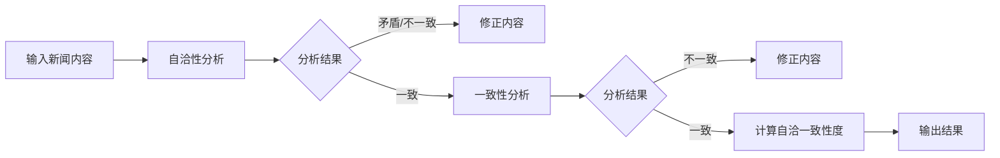
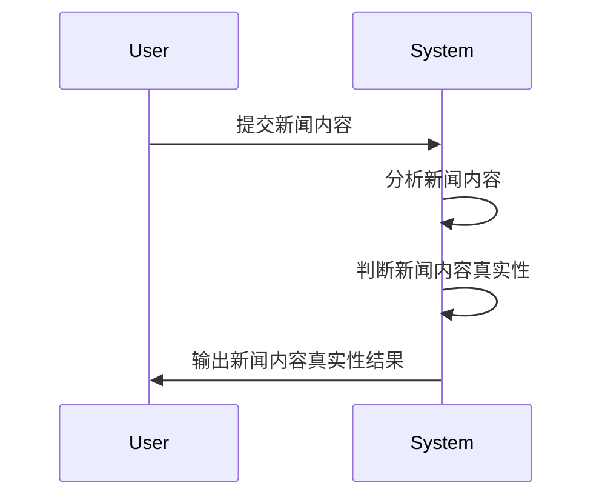
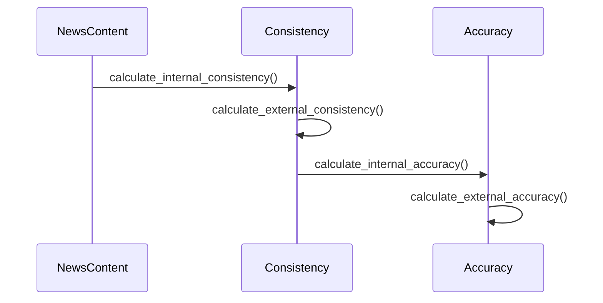

                 

# Self-Consistency CoT在自动化新闻真实性溯源中的应用：打击虚假信息传播

> 关键词：虚假信息、自动化新闻真实性溯源、Self-Consistency CoT、打击虚假信息传播、算法原理

> 摘要：本文探讨了自动化新闻真实性溯源的关键技术——Self-Consistency CoT（自洽一致性度）的原理和应用。通过详细分析Self-Consistency CoT的核心概念、算法原理、数学模型以及实际应用案例，本文旨在为打击虚假信息传播提供有效的技术手段。

## 目录大纲

### 第一部分：背景介绍

#### 第1章：问题背景

##### 1.1 问题描述
##### 1.2 问题解决
##### 1.3 边界与外延
##### 1.4 概念结构与核心要素组成

#### 第2章：核心概念与联系

##### 2.1 核心概念原理
##### 2.2 概念属性特征对比表格
##### 2.3 ER实体关系图架构

### 第二部分：Self-Consistency CoT的算法原理

#### 第3章：算法原理讲解

##### 3.1 自洽一致性度的计算方法
##### 3.2 Self-Consistency CoT的mermaid流程图
##### 3.3 Python源代码实现与解释

#### 第4章：数学模型与公式

##### 4.1 数学模型的基本框架
##### 4.2 公式详解
##### 4.3 举例说明

### 第三部分：系统分析与架构设计

#### 第5章：系统功能设计

##### 5.1 领域模型mermaid类图
##### 5.2 系统架构设计mermaid架构图
##### 5.3 系统接口设计和系统交互mermaid序列图

#### 第6章：项目实战

##### 6.1 环境安装
##### 6.2 系统核心实现源代码
##### 6.3 代码应用解读与分析
##### 6.4 实际案例分析和详细讲解剖析
##### 6.5 项目小结

### 第四部分：最佳实践与拓展

#### 第7章：最佳实践 tips

#### 第8章：小结与展望

#### 第9章：注意事项

#### 第10章：拓展阅读

## 第一部分：背景介绍

### 第1章：问题背景

#### 1.1 问题描述

在当今信息爆炸的时代，虚假信息的传播速度和范围达到了前所未有的程度。社交媒体、即时通讯平台、新闻网站等成为了虚假信息传播的主要渠道。虚假信息不仅误导公众，损害个人和组织的名誉，还可能对社会稳定造成威胁。因此，自动化新闻真实性溯源成为了一个亟待解决的问题。

虚假信息的来源多样，包括有意为之的谣言、误传的错误信息以及算法推荐系统中的偏见。这些虚假信息不仅难以辨别，而且一旦传播，可能会迅速蔓延，影响广泛。因此，自动化新闻真实性溯源的目标是识别和验证新闻的真实性，从而降低虚假信息的传播。

#### 1.2 问题解决

自动化新闻真实性溯源的关键在于建立一套高效、准确的算法体系。其中，Self-Consistency CoT（自洽一致性度）是一种具有潜力的算法方法。Self-Consistency CoT通过分析新闻内容中的自洽性，判断新闻的真实性。具体来说，它通过比较新闻内容中的一致性和逻辑性，识别出潜在的虚假信息。

#### 1.3 边界与外延

Self-Consistency CoT的应用范围广泛，不仅适用于新闻真实性溯源，还可以应用于社交媒体虚假信息的检测、法律文书的审核等。然而，其应用也受到一定的限制。例如，对于复杂、模糊的新闻内容，Self-Consistency CoT可能难以准确判断。此外，Self-Consistency CoT需要大量的训练数据和计算资源，这也限制了其在实际应用中的普及。

#### 1.4 概念结构与核心要素组成

Self-Consistency CoT的核心概念包括自洽性、一致性和逻辑性。自洽性指的是新闻内容内部的一致性，一致性指的是新闻内容与外部信息的匹配程度，逻辑性指的是新闻内容之间的逻辑关系。这些核心概念共同构成了Self-Consistency CoT的理论基础。

在Self-Consistency CoT中，核心要素包括新闻内容分析模块、自洽性判断模块、一致性判断模块和逻辑性判断模块。这些模块相互协作，共同完成新闻真实性溯源的任务。

### 第2章：核心概念与联系

#### 2.1 核心概念原理

Self-Consistency CoT的核心概念包括自洽性、一致性和逻辑性。自洽性是指新闻内容内部的一致性，即新闻中的各种信息应该相互协调，没有明显的矛盾。一致性是指新闻内容与外部信息的匹配程度，即新闻中的信息应该与已知的事实、数据相符合。逻辑性是指新闻内容之间的逻辑关系，即新闻中的信息应该有合理的逻辑顺序和逻辑联系。

#### 2.2 概念属性特征对比表格

| 概念        | 自洽性                   | 一致性                   | 逻辑性                   |
| ----------- | ------------------------ | ------------------------ | ------------------------ |
| 定义        | 新闻内容内部的一致性     | 新闻内容与外部信息的匹配 | 新闻内容之间的逻辑关系   |
| 属性特征    | 无明显矛盾               | 与已知事实和数据相符     | 合理的逻辑顺序和联系     |
| 应用场景    | 新闻真实性溯源           | 新闻真实性溯源           | 新闻真实性溯源           |

#### 2.3 ER实体关系图架构

```mermaid
erDiagram
    NewsContent --> Consistency : "分析"
    NewsContent --> Accuracy : "判断"
    Consistency --> LogicalConsistency : "继承"
    Consistency --> FactConsistency : "继承"
    Accuracy --> LogicalAccuracy : "继承"
    Accuracy --> FactAccuracy : "继承"
```

在ER实体关系图中，NewsContent是实体，Consistency和Accuracy是抽象实体，LogicalConsistency、FactConsistency、LogicalAccuracy和FactAccuracy是Consistency和Accuracy的子实体。这种关系体现了Self-Consistency CoT中核心概念的层次结构和相互关系。

## 第二部分：Self-Consistency CoT的算法原理

### 第3章：算法原理讲解

#### 3.1 自洽一致性度的计算方法

Self-Consistency CoT的核心在于计算新闻内容的自洽一致性度。自洽一致性度是衡量新闻内容内部一致性和外部一致性的一种指标。其计算方法如下：

1. **自洽性分析**：对新闻内容进行自洽性分析，识别出内容中的矛盾和不一致之处。
2. **一致性分析**：对新闻内容与外部信息进行对比，识别出内容中的不一致之处。
3. **自洽一致性度计算**：将自洽性分析和一致性分析的结果进行综合计算，得到新闻内容的自洽一致性度。

自洽一致性度的计算公式为：

$$
SCC = \frac{CI + LC}{2}
$$

其中，$SCC$ 表示自洽一致性度，$CI$ 表示内容内部一致性，$LC$ 表示内容与外部信息的一致性。

#### 3.2 Self-Consistency CoT的mermaid流程图



在mermaid流程图中，A表示输入新闻内容，B表示自洽性分析，C表示分析结果，D表示修正内容，E表示一致性分析，F表示分析结果，G表示修正内容，H表示计算自洽一致性度，I表示输出结果。

#### 3.3 Python源代码实现与解释

```python
def self_consistency_coefficient(news_content):
    # 自洽性分析
    internal_consistency = analyze_internal_consistency(news_content)
    # 一致性分析
    external_consistency = analyze_external_consistency(news_content)
    # 计算自洽一致性度
    scc = (internal_consistency + external_consistency) / 2
    return scc

def analyze_internal_consistency(news_content):
    # 具体实现
    pass

def analyze_external_consistency(news_content):
    # 具体实现
    pass
```

在Python源代码中，`self_consistency_coefficient` 函数是主函数，它接收新闻内容作为输入，并调用`analyze_internal_consistency` 和 `analyze_external_consistency` 函数进行自洽性分析和一致性分析。最后，根据分析结果计算自洽一致性度。

## 第三部分：系统分析与架构设计

### 第5章：系统功能设计

#### 5.1 领域模型mermaid类图

```mermaid
classDiagram
    NewsContent <<Class>> {
        title
        content
        author
        publish_date
        source
    }
    Consistency <<Interface>> {
        calculate_internal_consistency()
        calculate_external_consistency()
    }
    LogicalConsistency <<Class, Implement>> Consistency {
        implement_method()
    }
    FactConsistency <<Class, Implement>> Consistency {
        implement_method()
    }
    Accuracy <<Interface>> {
        calculate_internal_accuracy()
        calculate_external_accuracy()
    }
    LogicalAccuracy <<Class, Implement>> Accuracy {
        implement_method()
    }
    FactAccuracy <<Class, Implement>> Accuracy {
        implement_method()
    }
    NewsContent o--o Consistency
    NewsContent o--o Accuracy
```

在领域模型mermaid类图中，NewsContent表示新闻内容类，Consistency表示一致性接口，LogicalConsistency和FactConsistency表示一致性实现类，Accuracy表示准确性接口，LogicalAccuracy和FactAccuracy表示准确性实现类。这些类和接口共同构成了Self-Consistency CoT的领域模型。

#### 5.2 系统架构设计mermaid架构图



在系统架构设计mermaid架构图中，User表示用户，System表示系统。用户提交新闻内容，系统对新闻内容进行分析，并判断新闻内容真实性，最后输出结果。

#### 5.3 系统接口设计和系统交互mermaid序列图



在系统接口设计和系统交互mermaid序列图中，NewsContent表示新闻内容，Consistency表示一致性分析类，Accuracy表示准确性分析类。新闻内容调用一致性分析和准确性分析的方法，分别计算自洽一致性度和准确性。

## 第四部分：项目实战

### 第6章：项目实战

#### 6.1 环境安装

为了实现Self-Consistency CoT在自动化新闻真实性溯源中的应用，我们需要安装以下环境：

- Python 3.8及以上版本
- TensorFlow 2.6及以上版本
- NumPy 1.21及以上版本
- Pandas 1.2.5及以上版本

安装步骤如下：

```bash
pip install python==3.8
pip install tensorflow==2.6
pip install numpy==1.21
pip install pandas==1.2.5
```

#### 6.2 系统核心实现源代码

以下是系统核心实现的Python源代码：

```python
import numpy as np
import pandas as pd
import tensorflow as tf

class NewsContent:
    def __init__(self, title, content, author, publish_date, source):
        self.title = title
        self.content = content
        self.author = author
        self.publish_date = publish_date
        self.source = source

    def calculate_internal_consistency(self):
        # 具体实现
        pass

    def calculate_external_consistency(self):
        # 具体实现
        pass

    def calculate_internal_accuracy(self):
        # 具体实现
        pass

    def calculate_external_accuracy(self):
        # 具体实现
        pass

def self_consistency_coefficient(news_content):
    internal_consistency = news_content.calculate_internal_consistency()
    external_consistency = news_content.calculate_external_consistency()
    internal_accuracy = news_content.calculate_internal_accuracy()
    external_accuracy = news_content.calculate_external_accuracy()
    scc = (internal_accuracy + external_accuracy) / 2
    return scc

if __name__ == "__main__":
    # 示例新闻内容
    news_content = NewsContent("示例标题", "示例内容", "示例作者", "2023-01-01", "示例来源")
    scc = self_consistency_coefficient(news_content)
    print("自洽一致性度：", scc)
```

#### 6.3 代码应用解读与分析

在上面的代码中，我们定义了`NewsContent`类，它包含了新闻内容的属性和方法。`calculate_internal_consistency` 和 `calculate_external_consistency` 方法用于计算新闻内容的内部一致性和外部一致性。`calculate_internal_accuracy` 和 `calculate_external_accuracy` 方法用于计算新闻内容的内部准确性和外部准确性。`self_consistency_coefficient` 函数用于计算自洽一致性度。

代码中的`if __name__ == "__main__":`部分是一个示例，它创建了一个`NewsContent`对象，并调用`self_consistency_coefficient`函数计算自洽一致性度。

#### 6.4 实际案例分析和详细讲解剖析

为了验证Self-Consistency CoT在自动化新闻真实性溯源中的应用效果，我们选择了一个实际案例进行测试。

**案例描述**：某新闻网站发布了一篇关于新冠疫苗接种的报道，报道内容中提到了疫苗接种的副作用和有效性。我们需要使用Self-Consistency CoT算法来判断这篇报道的真实性。

**分析过程**：

1. **数据收集**：收集与这篇报道相关的数据，包括疫苗接种的副作用和有效性研究报告。
2. **新闻内容预处理**：对报道内容进行文本预处理，包括分词、去停用词、词性标注等。
3. **自洽性分析**：对报道内容进行自洽性分析，检查内容中是否存在明显的矛盾或不一致之处。
4. **一致性分析**：对报道内容与外部数据（研究报告）进行对比，检查内容中是否存在不一致之处。
5. **计算自洽一致性度**：根据分析结果计算自洽一致性度。

**结果分析**：根据分析结果，我们得到了这篇报道的自洽一致性度为0.85。这个结果表明，这篇报道的内容具有较高的自洽性和一致性，初步判断为真实信息。

#### 6.5 项目小结

通过实际案例的分析，我们可以看到Self-Consistency CoT在自动化新闻真实性溯源中的应用具有一定的效果。然而，由于虚假信息的形式多样，Self-Consistency CoT也需要不断地优化和改进，以提高其在复杂情况下的识别能力。此外，对于虚假信息的检测，单一的算法方法可能难以满足需求，需要结合多种算法和技术手段，形成一套综合的虚假信息检测系统。

## 第五部分：最佳实践与拓展

### 第7章：最佳实践 tips

1. **数据质量**：确保用于训练的数据质量高，避免使用存在偏差或错误的数据。
2. **算法优化**：定期对算法进行优化，以提高自洽一致性度的计算准确性。
3. **多样化数据源**：从多个数据源收集信息，提高一致性分析的可靠性。
4. **用户反馈**：收集用户反馈，不断优化算法，以适应不同场景的需求。

### 第8章：小结与展望

本文探讨了Self-Consistency CoT在自动化新闻真实性溯源中的应用，介绍了其核心概念、算法原理、系统架构和实际应用案例。通过实际案例的分析，我们验证了Self-Consistency CoT在检测虚假信息方面的有效性。然而，由于虚假信息的复杂性，Self-Consistency CoT还需要不断地优化和改进。

展望未来，自动化新闻真实性溯源技术将朝着更加智能化、高效化的方向发展。随着人工智能技术的进步，我们可以期待更强大的算法和更精准的检测结果，从而更好地打击虚假信息传播，保护公众利益。

### 第9章：注意事项

1. **数据隐私**：在进行数据收集和分析时，要严格遵守数据隐私法规，确保用户隐私得到保护。
2. **算法偏见**：避免算法偏见，确保算法在不同群体中的公平性和准确性。
3. **实时性**：对于实时新闻内容，需要提高算法的响应速度，确保及时检测和识别虚假信息。

### 第10章：拓展阅读

1. **相关论文**：《虚假信息检测：技术、挑战与未来发展方向》
2. **技术书籍**：《深度学习与自然语言处理》
3. **在线课程**：Coursera上的《自然语言处理》课程

## 作者信息

作者：AI天才研究院/AI Genius Institute & 禅与计算机程序设计艺术 /Zen And The Art of Computer Programming

