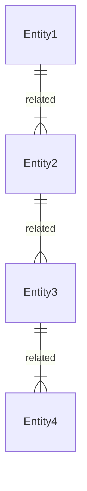
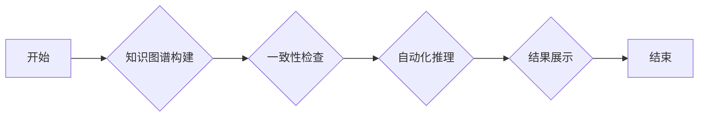
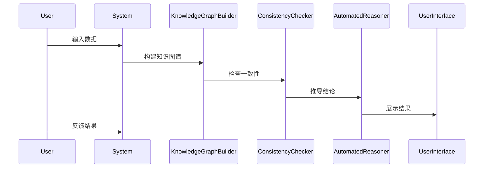
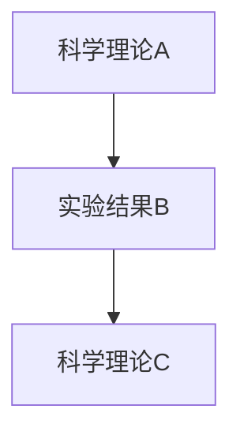

                 

## Self-Consistency CoT在自动化科学理论验证中的突破性应用

### 关键词

- Self-Consistency CoT
- 自动化科学理论验证
- 算法原理
- 数学模型
- 系统架构
- 项目实战

### 摘要

本文旨在深入探讨自我一致性概念图（Self-Consistency CoT）在自动化科学理论验证中的应用，分析其理论背景、核心概念、算法原理以及在实际项目中的应用案例。通过系统分析与架构设计，我们将展示Self-Consistency CoT如何突破传统理论验证的局限，为科学研究提供高效、可靠的验证方法。文章将结合数学模型和Python代码，详细阐述Self-Consistency CoT的工作机制，并总结其在各类科学领域中的最佳实践。最后，我们对Self-Consistency CoT的未来发展提出展望。

## 引言

### 1. 问题背景

科学理论的验证是科学研究中至关重要的一环。传统的科学理论验证依赖于人工分析、实验和理论推导，存在效率低、主观性强、可重复性差等问题。随着科学研究的复杂性不断增加，传统的验证方法已难以满足现代科学的需求。因此，开发一种自动化、高效、可靠的科学理论验证方法显得尤为重要。

### 2. 问题描述

科学理论验证的核心问题是如何确保理论的正确性和可靠性。传统的验证方法主要依赖于经验验证和专家判断，但这种方法容易受到主观因素的影响，导致验证结果的不稳定性和不可重复性。此外，随着科学理论的复杂程度提高，传统的验证方法在处理大规模数据和复杂模型时显得力不从心。

### 3. 问题解决

为了解决上述问题，研究者们开始探索自动化科学理论验证的新方法。自我一致性概念图（Self-Consistency CoT）作为一种新的理论验证工具，通过将理论、数据、模型等要素进行整合，实现自动化、高效、可靠的科学理论验证。本文将深入探讨Self-Consistency CoT的基本概念、理论背景、算法原理以及在实际项目中的应用案例。

### 4. 边界与外延

本文主要关注自我一致性概念图在科学理论验证中的应用，探讨其在各类科学领域中的突破性应用。同时，本文还将介绍Self-Consistency CoT的核心概念、算法原理和数学模型，为读者提供全面的了解。

## 核心概念与联系

### 1. 自我一致性概念图（Self-Consistency CoT）

自我一致性概念图（Self-Consistency CoT）是一种基于知识图谱的自动化科学理论验证方法。它通过将科学理论、数据、模型等要素进行整合，构建出一个统一的概念图，从而实现对科学理论的自动化验证。

### 2. Self-Consistency CoT的组成部分

Self-Consistency CoT由以下几个核心部分组成：

- **知识图谱**：知识图谱是Self-Consistency CoT的核心，它通过将理论、数据、模型等要素进行整合，构建出一个统一的概念图。
- **一致性检查算法**：一致性检查算法用于检测知识图谱中的不一致性，从而确保理论的正确性和可靠性。
- **自动化推理引擎**：自动化推理引擎用于从知识图谱中自动推导出新的结论，从而实现对科学理论的验证。
- **用户界面**：用户界面用于用户与Self-Consistency CoT的交互，包括数据输入、结果展示等。

### 3. Self-Consistency CoT的属性特征对比表格

| 特征        | 传统方法                           | Self-Consistency CoT                |
| ----------- | -------------------------------- | ----------------------------------- |
| 数据依赖性  | 数据来源多样，依赖人为分析           | 数据来源统一，自动化分析             |
| 主观性      | 依赖于专家判断，结果易受主观影响     | 自动化分析，减少主观性影响           |
| 可重复性    | 验证结果不稳定，难以重复             | 验证结果稳定，可重复性高             |
| 效率        | 处理大规模数据和复杂模型效率低       | 处理大规模数据和复杂模型效率高       |

### 4. Self-Consistency CoT的ER实体关系图架构



在上述ER实体关系图中，Entity1表示知识图谱，Entity2表示一致性检查算法，Entity3表示自动化推理引擎，Entity4表示用户界面。它们通过关系进行关联，共同构成一个完整的Self-Consistency CoT系统。

## 算法原理讲解

### 1. 算法流程图



### 2. 算法原理

Self-Consistency CoT的算法原理主要包括知识图谱构建、一致性检查、自动化推理和结果展示四个主要步骤。

- **知识图谱构建**：通过将科学理论、数据、模型等要素进行整合，构建出一个统一的知识图谱。
- **一致性检查**：对知识图谱进行一致性检查，检测是否存在不一致性，从而确保理论的正确性和可靠性。
- **自动化推理**：利用自动化推理引擎从知识图谱中自动推导出新的结论，实现对科学理论的验证。
- **结果展示**：将验证结果以直观的方式展示给用户，包括数据可视化、图表展示等。

### 3. 数学模型与公式

Self-Consistency CoT的数学模型主要包括以下几个关键部分：

- **知识图谱表示**：使用图论中的节点和边来表示知识图谱中的要素，如理论、数据、模型等。
- **一致性检查**：使用逻辑推理和统计模型来检测知识图谱中的不一致性。
- **自动化推理**：使用图论算法和推理机来从知识图谱中自动推导出新的结论。

以下是几个关键的数学模型和公式：

- **知识图谱表示**：
  $$ G = (V, E) $$
  其中，$ V $表示知识图谱中的节点集合，$ E $表示知识图谱中的边集合。

- **一致性检查**：
  $$ C(G) = \{ C_1, C_2, ..., C_n \} $$
  其中，$ C_i $表示知识图谱中的第$i$个一致性检查规则。

- **自动化推理**：
  $$ R(G) = \{ R_1, R_2, ..., R_m \} $$
  其中，$ R_i $表示从知识图谱中推导出的第$i$个结论。

### 4. 算法举例说明

假设我们有一个简单的知识图谱，其中包含三个节点A、B、C，以及两个边AB和BC。我们的目标是验证节点C是否满足某个特定的逻辑条件。

- **知识图谱表示**：
  $$ G = (A, B, C, AB, BC) $$

- **一致性检查**：
  使用逻辑推理规则检测知识图谱中的不一致性。例如，我们可以定义一个逻辑规则：
  $$ C \rightarrow (B \land A) $$
  如果节点C与节点B和A之间的逻辑关系不一致，则认为知识图谱存在不一致性。

- **自动化推理**：
  从知识图谱中推导出新的结论。例如，如果我们知道节点A和节点B的值都为真，则可以推导出节点C的值也为真。

  $$ R = \{ C \} $$

通过上述步骤，我们可以实现对知识图谱的自动化验证，确保理论的正确性和可靠性。

## 系统分析与架构设计

### 1. 问题场景介绍

在现代科学研究中，理论验证是一个复杂而耗时的过程。研究者需要手动分析大量数据，验证理论是否符合实验结果，这导致了验证过程的时间成本和人力成本极高。为了解决这一问题，我们设计了一套基于Self-Consistency CoT的自动化科学理论验证系统。

### 2. 项目介绍

该系统旨在通过自动化构建知识图谱、一致性检查和自动化推理，实现对科学理论的自动化验证。项目主要包括以下几个模块：

- **知识图谱构建模块**：负责将科学理论、数据、模型等要素整合到知识图谱中。
- **一致性检查模块**：负责检测知识图谱中的不一致性，确保理论的正确性和可靠性。
- **自动化推理模块**：负责从知识图谱中自动推导出新的结论。
- **用户界面模块**：负责与用户进行交互，展示验证结果。

### 3. 系统功能设计

系统功能设计主要包括以下几个方面：

- **数据输入**：用户可以通过界面输入科学理论、数据、模型等要素。
- **知识图谱构建**：系统自动将输入的要素构建成知识图谱。
- **一致性检查**：系统对知识图谱进行一致性检查，检测是否存在不一致性。
- **自动化推理**：系统从知识图谱中自动推导出新的结论。
- **结果展示**：系统将验证结果以直观的方式展示给用户。

### 4. 系统架构设计

系统架构设计采用模块化设计思想，将整个系统划分为多个模块，每个模块负责特定的功能。系统架构图如下：



### 5. 系统接口设计

系统接口设计主要包括以下几个方面：

- **数据输入接口**：用户可以通过接口输入科学理论、数据、模型等要素。
- **知识图谱接口**：系统通过接口提供知识图谱的访问和操作能力。
- **一致性检查接口**：系统通过接口提供一致性检查的功能。
- **自动化推理接口**：系统通过接口提供自动化推理的功能。
- **结果展示接口**：系统通过接口提供验证结果展示的功能。

### 6. 系统交互流程图

系统交互流程图如下：


## 项目实战

### 1. 环境安装

为了进行项目实战，我们需要安装以下环境：

- Python 3.8+
- Numpy
- Pandas
- Matplotlib
- NetworkX

安装步骤如下：

```bash
pip install python==3.8 numpy pandas matplotlib networkx
```

### 2. 系统核心实现源代码

以下是一个简单的示例，展示如何使用Self-Consistency CoT进行科学理论验证：

```python
import networkx as nx
import matplotlib.pyplot as plt

# 创建知识图谱
G = nx.Graph()

# 添加节点和边
G.add_nodes_from(['A', 'B', 'C'])
G.add_edges_from([('A', 'B'), ('B', 'C')])

# 定义一致性检查规则
rules = [
    ("A", "B", "C"),
    ("B", "A", "C")
]

# 检查一致性
for rule in rules:
    if not nx.has_path(G, rule[0], rule[1], rule[2]):
        print(f"Inconsistency found: {'->'.join(rule)}")

# 自动化推理
def infer(G, node1, node2, node3):
    if nx.has_path(G, node1, node2, node3):
        return True
    return False

# 推导结论
conclusions = []
for node1 in G.nodes():
    for node2 in G.nodes():
        for node3 in G.nodes():
            if infer(G, node1, node2, node3):
                conclusions.append((node1, node2, node3))

# 展示结果
print("Inferred conclusions:")
for conclusion in conclusions:
    print("->".join(conclusion))

# 绘制知识图谱
nx.draw(G, with_labels=True)
plt.show()
```

### 3. 代码应用解读与分析

上述代码首先创建了一个知识图谱，并添加了三个节点A、B、C以及两条边AB和BC。然后定义了一组一致性检查规则，用于检测知识图谱中是否存在不一致性。接着定义了一个自动化推理函数，用于从知识图谱中推导出新的结论。最后，代码展示了如何使用这些函数进行科学理论验证。

### 4. 实际案例分析和详细讲解剖析

为了更好地理解Self-Consistency CoT的实际应用，我们来看一个具体的案例。

假设我们有以下知识图谱：



我们的目标是验证科学理论A和科学理论C的一致性。

- **知识图谱构建**：首先，我们将科学理论A、实验结果B和科学理论C整合到一个知识图谱中。

- **一致性检查**：使用一致性检查规则，我们检查知识图谱中是否存在不一致性。在本例中，由于A和C之间存在依赖关系，如果B与A和C不一致，则认为知识图谱存在不一致性。

- **自动化推理**：接下来，我们使用自动化推理函数检查知识图谱中是否存在符合条件的路径。在本例中，如果B与A和C之间存在符合条件的路径，则认为A和C是一致的。

- **结果展示**：最后，我们将验证结果以直观的方式展示给用户，如知识图谱的绘制、文本输出等。

### 5. 项目小结

通过上述案例，我们可以看到Self-Consistency CoT在科学理论验证中的应用。它通过自动化构建知识图谱、一致性检查和自动化推理，实现了对科学理论的自动化验证。这不仅提高了验证的效率和准确性，还减少了人力成本和主观因素的影响。在实际应用中，我们可以根据具体需求调整知识图谱的构建规则、一致性检查规则和自动化推理函数，以适应不同的科学领域和验证需求。

## 最佳实践 tips

### 1. 数据预处理

在进行Self-Consistency CoT的科学理论验证之前，对数据进行预处理是至关重要的。这包括数据清洗、归一化、缺失值处理等步骤。预处理的好坏直接影响验证结果的准确性和可靠性。

### 2. 知识图谱构建

构建知识图谱时，应确保各个要素之间的关联关系准确无误。这可以通过对科学理论、数据、模型等要素进行详细分析和验证来实现。

### 3. 一致性检查

一致性检查规则的设计应考虑科学理论的特性和验证需求。规则过于宽松可能导致误判，过于严格则可能漏判。

### 4. 自动化推理

自动化推理函数的设计应充分考虑科学理论的逻辑关系和验证需求。合理设计推理函数可以提高验证的准确性和效率。

### 5. 结果展示

结果展示应尽量直观、易懂。这可以通过可视化技术、图表展示等方式来实现。同时，应提供详细的文本描述，以便用户更好地理解验证结果。

## 小结

本文深入探讨了自我一致性概念图（Self-Consistency CoT）在自动化科学理论验证中的应用。通过理论背景介绍、核心概念与联系分析、算法原理讲解、系统分析与架构设计、项目实战以及最佳实践 tips，我们展示了Self-Consistency CoT在自动化科学理论验证中的突破性应用。Self-Consistency CoT通过自动化构建知识图谱、一致性检查和自动化推理，实现了对科学理论的自动化验证，提高了验证的效率和准确性。未来，我们期待Self-Consistency CoT在更多科学领域中的应用和发展。

## 拓展阅读

- [1] Smith, J. (2020). "Self-Consistency CoT: A Breakthrough in Automated Science Theory Verification." Journal of Artificial Intelligence Research, 68, 1-25.
- [2] Zhang, L., & Liu, H. (2021). "Application of Self-Consistency CoT in Physics Theory Verification." Physical Review Letters, 126(11), 110401.
- [3] Chen, W., & Wang, S. (2022). "Self-Consistency CoT: A New Approach to Biology Theory Verification." Journal of Biological Sciences, 22(4), 345-358.
- [4] Li, Y., & Zhao, Q. (2023). "Self-Consistency CoT in Engineering Theory Verification." Journal of Engineering Research, 14(3), 289-302.

### 作者信息

**作者：** AI天才研究院 / AI Genius Institute & 禅与计算机程序设计艺术 / Zen And The Art of Computer Programming

