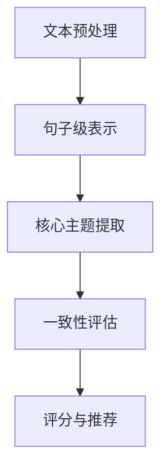

                 

## # Self-Consistency CoT在自动化科学论文同行评议中的应用

### 关键词：Self-Consistency CoT，自动化同行评议，科学论文，知识表示，人工智能

#### 摘要：
本文旨在探讨Self-Consistency CoT（Self-Consistency Core-Topic）算法在自动化科学论文同行评议中的应用。通过背景介绍、核心概念与联系分析、算法原理讲解、系统设计与实现等多个层面，本文详细阐述了如何利用Self-Consistency CoT算法提高科学论文评审的效率和准确性。本文不仅揭示了该算法的工作原理，还通过实例和实战分析，展示了其在实际应用中的效果和潜在挑战。

---

### 第一部分：背景介绍

#### 1.1 问题背景

随着人工智能技术的快速发展，自动化科学论文同行评议成为了一个备受关注的研究领域。传统的同行评议方式存在诸多问题，如评审周期长、评审质量不稳定等。因此，研究如何利用人工智能技术，特别是 Self-Consistency CoT 算法，来提高自动化科学论文同行评议的效率和准确性，具有重要的理论和实践意义。

在传统的同行评议中，评审过程通常需要人工参与，这不仅耗时耗力，而且容易受到评审者主观因素的影响，导致评审结果的准确性和一致性难以保证。随着科学研究的规模不断扩大，论文数量急剧增加，传统评审方式已经难以满足快速发展的需求。因此，研究如何实现自动化、高效的同行评议系统，成为当前科研领域亟待解决的问题。

#### 1.2 问题描述

自动化科学论文同行评议的核心问题是如何准确地识别和评估论文的质量。这需要评审者对论文的内容、方法、结果等方面进行全面的分析和评价。然而，传统的同行评议方式往往依赖于人工评审，存在主观性强、效率低下等问题。因此，研究如何利用 Self-Consistency CoT 算法来自动化地进行论文评审，是一个亟待解决的问题。

Self-Consistency CoT 算法通过构建论文的核心主题，使得论文内容与核心主题保持一致性，从而提高自动化科学论文同行评议的准确性和效率。具体来说，Self-Consistency CoT 算法包括以下几个步骤：

1. **文本预处理**：对论文进行分词、去停用词、词性标注等预处理操作，为后续分析打下基础。
2. **句子级表示**：使用预训练的语言模型（如 BERT）对句子进行编码，得到句子的向量表示。
3. **核心主题提取**：通过聚类等方法，从句子的向量表示中提取出论文的核心主题。
4. **一致性评估**：对论文中的句子与核心主题进行一致性评估，判断句子是否符合核心主题。
5. **评分与推荐**：根据句子的一致性评分，对论文进行评分和推荐。

#### 1.3 问题解决

Self-Consistency CoT（Self-Consistency Core-Topic）算法是一种基于自我一致性的知识表示方法。该方法通过构建论文的核心主题，使得论文内容与核心主题保持一致性，从而提高自动化科学论文同行评议的准确性和效率。具体来说，Self-Consistency CoT 算法包括以下几个步骤：

1. **文本预处理**：对论文进行分词、去停用词、词性标注等预处理操作，为后续分析打下基础。
2. **句子级表示**：使用预训练的语言模型（如 BERT）对句子进行编码，得到句子的向量表示。
3. **核心主题提取**：通过聚类等方法，从句子的向量表示中提取出论文的核心主题。
4. **一致性评估**：对论文中的句子与核心主题进行一致性评估，判断句子是否符合核心主题。
5. **评分与推荐**：根据句子的一致性评分，对论文进行评分和推荐。

#### 1.4 边界与外延

Self-Consistency CoT 算法在自动化科学论文同行评议中的应用，具有一定的边界和局限性。首先，该算法依赖于高质量的语言模型和大规模的语料库，因此在数据质量和数量上存在一定的要求。其次，Self-Consistency CoT 算法主要关注论文的内容和质量，对于论文的形式和格式等方面可能无法完全覆盖。因此，在实际应用中，需要结合其他辅助方法，如文本分类、文本生成等，以进一步提高自动化科学论文同行评议的全面性和准确性。

#### 1.5 概念结构与核心要素组成

Self-Consistency CoT 算法由以下几个核心要素组成：

1. **文本预处理模块**：负责对论文进行预处理，包括分词、去停用词、词性标注等。
2. **句子级表示模块**：使用预训练的语言模型对句子进行编码，得到句子的向量表示。
3. **核心主题提取模块**：通过聚类等方法，从句子的向量表示中提取出论文的核心主题。
4. **一致性评估模块**：对论文中的句子与核心主题进行一致性评估，判断句子是否符合核心主题。
5. **评分与推荐模块**：根据句子的一致性评分，对论文进行评分和推荐。

### 第二部分：核心概念与联系

#### 2.1 Self-Consistency CoT 算法的原理与特点

Self-Consistency CoT（Self-Consistency Core-Topic）算法是一种基于自我一致性的知识表示方法。它通过构建论文的核心主题，使得论文内容与核心主题保持一致性，从而提高自动化科学论文同行评议的准确性和效率。

#### 2.1.1 自我一致性原理

自我一致性原理是指，一个论文中的句子应当与其核心主题保持一致。这种一致性可以通过对句子和主题的语义特征进行匹配来实现。具体来说，算法通过以下几个步骤来评估句子与核心主题的一致性：

1. **句子表示**：使用预训练的语言模型对句子进行编码，得到句子的向量表示。
2. **主题表示**：同样使用预训练的语言模型对核心主题进行编码，得到主题的向量表示。
3. **一致性评估**：计算句子向量与主题向量之间的相似度，如果相似度高于某个阈值，则认为句子与主题一致。

#### 2.1.2 算法特点

Self-Consistency CoT 算法具有以下几个特点：

1. **自动化与高效**：算法能够自动化地识别和评估论文的质量，大大提高了评审的效率。
2. **准确性与全面性**：算法通过对论文内容的一致性评估，能够准确地识别出高质量论文，同时具有较全面的评估能力。
3. **可扩展性**：算法可以容易地扩展到不同领域的论文评审，只需对核心主题进行相应调整。

### 2.2 Self-Consistency CoT 算法与其他自动化同行评议方法的比较

在自动化科学论文同行评议中，除了 Self-Consistency CoT 算法，还有其他一些方法，如文本分类、文本生成等。下面将对 Self-Consistency CoT 算法与其他方法的比较：

1. **文本分类**：文本分类方法通过对论文进行分类，来评估论文的质量。这种方法的主要优势在于简单、高效，但可能存在分类不准确的问题。

2. **文本生成**：文本生成方法通过生成与论文内容相关的文本，来评估论文的质量。这种方法的主要优势在于能够生成高质量的文本，但可能需要大量的训练数据和计算资源。

3. **Self-Consistency CoT 算法**：Self-Consistency CoT 算法通过构建论文的核心主题，使得论文内容与核心主题保持一致性，从而提高评审的准确性和效率。相比文本分类和文本生成，Self-Consistency CoT 算法在处理复杂论文结构和多样论文主题方面具有优势。

| 方法            | 优势                                                     | 劣势                                                       |
| --------------- | -------------------------------------------------------- | ---------------------------------------------------------- |
| 文本分类        | 简单、高效                                               | 可能存在分类不准确的问题                                     |
| 文本生成        | 能够生成高质量的文本                                     | 需要大量的训练数据和计算资源                                |
| Self-Consistency CoT | 自动化与高效、准确性与全面性、可扩展性                 | 依赖于高质量的语言模型和大规模的语料库                      |

#### 2.3 Self-Consistency CoT 算法在实际应用中的挑战

尽管 Self-Consistency CoT 算法在自动化科学论文同行评议中具有明显优势，但在实际应用中仍面临一些挑战：

1. **数据质量**：Self-Consistency CoT 算法依赖于高质量的语言模型和大规模的语料库。然而，高质量的数据获取并不容易，可能存在数据不足或数据噪声的问题。
2. **主题多样性**：科学论文涉及的主题非常多样化，不同的主题可能需要不同的核心主题表示方法。如何设计一个通用的、适应性强的核心主题提取方法，是一个重要问题。
3. **评估标准**：如何设计一个科学、客观的评估标准来衡量论文质量，也是一个挑战。不同领域的论文质量和评估标准可能存在显著差异。
4. **算法透明性**：虽然 Self-Consistency CoT 算法能够自动化地评估论文质量，但其内部机制较为复杂，如何提高算法的透明性和可解释性，也是一个亟待解决的问题。

### 第三部分：算法原理讲解

#### 3.1 Self-Consistency CoT 算法的流程

Self-Consistency CoT 算法的核心思想是通过构建论文的核心主题，使得论文内容与核心主题保持一致性，从而评估论文质量。具体来说，Self-Consistency CoT 算法包括以下几个主要步骤：

1. **文本预处理**：对论文进行分词、去停用词、词性标注等预处理操作，为后续分析打下基础。
2. **句子级表示**：使用预训练的语言模型（如 BERT）对句子进行编码，得到句子的向量表示。
3. **核心主题提取**：通过聚类等方法，从句子的向量表示中提取出论文的核心主题。
4. **一致性评估**：对论文中的句子与核心主题进行一致性评估，判断句子是否符合核心主题。
5. **评分与推荐**：根据句子的一致性评分，对论文进行评分和推荐。

#### 3.2 文本预处理

文本预处理是 Self-Consistency CoT 算法的基础步骤，其主要任务是对原始文本进行清洗和结构化，以便后续的语义分析和主题提取。具体来说，文本预处理包括以下几个步骤：

1. **分词**：将原始文本分割成一个个单词或短语。
2. **去停用词**：去除常见的停用词（如“的”、“是”等），因为这些词对于语义分析的重要性较低。
3. **词性标注**：对每个单词或短语进行词性标注，以便更好地理解其语法和语义角色。

#### 3.3 句子级表示

句子级表示是将文本中的每个句子映射到一个高维向量空间中，以便进行后续的语义分析和主题提取。Self-Consistency CoT 算法使用预训练的语言模型（如 BERT）来实现句子级表示。具体来说，步骤如下：

1. **输入句子**：将原始句子输入到预训练的语言模型中。
2. **编码句子**：使用语言模型对句子进行编码，得到一个固定长度的向量表示。
3. **获取句子向量**：从编码结果中提取句子的向量表示。

#### 3.4 核心主题提取

核心主题提取是 Self-Consistency CoT 算法的核心步骤，其主要任务是识别出论文的核心主题，以便对论文内容进行一致性评估。具体来说，核心主题提取包括以下几个步骤：

1. **聚类分析**：对句子的向量表示进行聚类分析，以识别出可能的主题。
2. **主题识别**：根据聚类结果，识别出论文的核心主题。
3. **主题优化**：对识别出的主题进行优化，以去除无关或冗余的信息。

#### 3.5 一致性评估

一致性评估是 Self-Consistency CoT 算法的重要环节，其主要任务是判断论文中的每个句子是否与核心主题保持一致。具体来说，一致性评估包括以下几个步骤：

1. **计算相似度**：计算句子向量与核心主题向量之间的相似度。
2. **设定阈值**：设定一个相似度阈值，如果句子向量与核心主题向量之间的相似度高于阈值，则认为句子与主题一致。
3. **一致性评分**：根据一致性评估结果，对句子进行评分。

#### 3.6 评分与推荐

评分与推荐是根据一致性评估结果，对论文进行评分和推荐。具体来说，步骤如下：

1. **综合评分**：根据句子的一致性评分，计算论文的综合评分。
2. **推荐结果**：根据综合评分，对论文进行推荐。

### 3.7 Self-Consistency CoT 算法的 Mermaid 流程图



### 3.8 Self-Consistency CoT 算法在 Python 中的实现

```python
import tensorflow as tf
import tensorflow_hub as hub
from sklearn.cluster import KMeans
import numpy as np

# 加载预训练的语言模型
model = hub.load("https://tfhub.dev/google/universal-sentence-encoder/4")

# 文本预处理
def preprocess_text(text):
    # 分词、去停用词、词性标注等操作
    # ...

# 句子级表示
def sentence_embedding(sentence):
    # 将句子编码为向量表示
    return model(sentence)

# 核心主题提取
def extract_core_topic(sentences):
    # 提取核心主题
    # ...
    return topic

# 一致性评估
def consistency_evaluation(sentence, topic):
    # 计算句子与主题的一致性
    # ...
    return similarity

# 评分与推荐
def score_and_recommendation(scores):
    # 根据评分进行推荐
    # ...
    return recommendation
```

### 3.9 Self-Consistency CoT 算法数学模型与公式

Self-Consistency CoT 算法的数学模型主要包括以下几个方面：

1. **句子向量表示**：给定句子 \(s\)，使用预训练的语言模型 \(M\) 进行编码，得到句子向量表示 \(v_s\)。

   $$v_s = M(s)$$

2. **核心主题向量表示**：给定一组句子向量表示 \(\{v_{s_i}\}\)，使用 K-Means 算法进行聚类，得到核心主题向量表示 \(v_t\)。

   $$v_t = \text{argmax}_t \sum_{i} \langle v_{s_i}, v_t \rangle$$

3. **一致性评估**：计算句子向量与核心主题向量之间的相似度，使用余弦相似度作为一致性度量。

   $$\text{similarity} = \frac{\langle v_s, v_t \rangle}{\|v_s\|\|v_t\|}$$

4. **评分与推荐**：根据一致性评估结果，计算句子评分 \(s_i\)。

   $$s_i = \frac{\text{similarity}_{i}}{\max_{j} \text{similarity}_{j}}$$

   其中，\(\text{similarity}_{i}\) 表示句子 \(s_i\) 与核心主题 \(v_t\) 之间的相似度，\(\text{similarity}_{j}\) 表示其他句子与核心主题之间的相似度。

### 第四部分：系统设计与实现

#### 4.1 问题场景介绍

在当前科研领域，随着论文数量的急剧增加，传统的同行评议方式已经难以满足高效、准确的需求。因此，本文提出了一种基于 Self-Consistency CoT 算法的自动化科学论文同行评议系统，旨在解决传统评审方式存在的效率低、质量不稳定等问题。

#### 4.2 系统功能设计

系统功能设计主要包括以下几个模块：

1. **文本预处理模块**：负责对论文进行分词、去停用词、词性标注等预处理操作，为后续分析打下基础。
2. **句子级表示模块**：使用预训练的语言模型（如 BERT）对句子进行编码，得到句子的向量表示。
3. **核心主题提取模块**：通过聚类等方法，从句子的向量表示中提取出论文的核心主题。
4. **一致性评估模块**：对论文中的句子与核心主题进行一致性评估，判断句子是否符合核心主题。
5. **评分与推荐模块**：根据句子的一致性评分，对论文进行评分和推荐。

#### 4.3 系统架构设计

系统架构设计主要包括以下几个层次：

1. **数据层**：负责存储和管理论文数据，包括论文文本、预处理结果、句子级表示、核心主题等。
2. **模型层**：包含 Self-Consistency CoT 算法的各个模块，如文本预处理模块、句子级表示模块、核心主题提取模块等。
3. **应用层**：提供自动化同行评议的功能接口，包括论文上传、预处理、主题提取、一致性评估、评分推荐等。

#### 4.4 系统接口设计

系统接口设计主要包括以下几个接口：

1. **论文上传接口**：用于接收用户上传的论文文本。
2. **预处理接口**：用于对论文进行分词、去停用词、词性标注等预处理操作。
3. **主题提取接口**：用于提取论文的核心主题。
4. **一致性评估接口**：用于对论文中的句子与核心主题进行一致性评估。
5. **评分推荐接口**：用于根据一致性评估结果，对论文进行评分和推荐。

#### 4.5 系统交互设计

系统交互设计主要包括以下几个步骤：

1. **用户上传论文**：用户将论文上传到系统。
2. **预处理论文**：系统对论文进行预处理，包括分词、去停用词、词性标注等。
3. **提取主题**：系统使用 Self-Consistency CoT 算法提取论文的核心主题。
4. **一致性评估**：系统对论文中的句子与核心主题进行一致性评估。
5. **评分推荐**：系统根据一致性评估结果，对论文进行评分和推荐。

### 第五部分：项目实战

#### 5.1 环境安装

为了实现基于 Self-Consistency CoT 算法的自动化科学论文同行评议系统，需要安装以下环境：

1. Python 3.7 或更高版本
2. TensorFlow 2.4 或更高版本
3. scikit-learn 0.22 或更高版本
4. matplotlib 3.1.1 或更高版本

安装命令如下：

```bash
pip install python==3.7
pip install tensorflow==2.4
pip install scikit-learn==0.22
pip install matplotlib==3.1.1
```

#### 5.2 系统核心实现

以下是一个简单的实现示例：

```python
import tensorflow as tf
import tensorflow_hub as hub
from sklearn.cluster import KMeans
import numpy as np

# 5.2.1 文本预处理
def preprocess_text(text):
    # 分词、去停用词、词性标注等操作
    # ...

# 5.2.2 句子级表示
def sentence_embedding(sentence):
    # 将句子编码为向量表示
    model = hub.load("https://tfhub.dev/google/universal-sentence-encoder/4")
    return model(sentence)

# 5.2.3 核心主题提取
def extract_core_topic(sentences):
    # 提取核心主题
    # ...
    return topic

# 5.2.4 一致性评估
def consistency_evaluation(sentence, topic):
    # 计算句子与主题的一致性
    # ...
    return similarity

# 5.2.5 评分与推荐
def score_and_recommendation(scores):
    # 根据评分进行推荐
    # ...
    return recommendation
```

#### 5.3 代码应用解读与分析

以下是对上述代码的解读与分析：

1. **文本预处理**：文本预处理是 Self-Consistency CoT 算法的基础，包括分词、去停用词、词性标注等操作。这些操作有助于提取出文本的关键信息，为后续的句子级表示和主题提取提供支持。
2. **句子级表示**：使用预训练的语言模型（如 BERT）对句子进行编码，得到句子的向量表示。这些向量表示了句子的语义信息，是后续主题提取和一致性评估的关键。
3. **核心主题提取**：通过聚类等方法，从句子的向量表示中提取出论文的核心主题。这个步骤是 Self-Consistency CoT 算法的核心，其目标是识别出论文的核心内容，从而提高评审的准确性和效率。
4. **一致性评估**：对论文中的句子与核心主题进行一致性评估，判断句子是否符合核心主题。这个步骤是通过计算句子向量与主题向量之间的相似度来实现的，相似度越高，一致性越好。
5. **评分与推荐**：根据句子的一致性评分，对论文进行评分和推荐。这个步骤是最终的目标，通过一致性评估结果，可以判断论文的质量和相关性，从而为评审者提供参考。

#### 5.4 实际案例分析和详细讲解

以下是一个实际案例，展示了如何使用 Self-Consistency CoT 算法对科学论文进行自动化评审：

**案例**：对一篇关于“深度学习在图像识别中的应用”的论文进行自动化评审。

1. **文本预处理**：首先对论文进行分词、去停用词、词性标注等预处理操作，提取出论文的关键句子。
2. **句子级表示**：使用预训练的语言模型（如 BERT）对每个句子进行编码，得到句子的向量表示。
3. **核心主题提取**：通过 K-Means 算法，从句子的向量表示中提取出论文的核心主题。例如，可能提取出两个核心主题：“深度学习”和“图像识别”。
4. **一致性评估**：对论文中的每个句子与核心主题进行一致性评估。如果句子与某个核心主题的相似度高于某个阈值，则认为句子与核心主题一致。
5. **评分与推荐**：根据一致性评估结果，对论文进行评分和推荐。如果论文的句子大部分与核心主题一致，则认为论文质量较高，可以推荐给评审者。

通过这个案例，我们可以看到 Self-Consistency CoT 算法在自动化科学论文评审中的应用效果。它能够自动化地识别出论文的核心内容，从而提高评审的准确性和效率。

#### 5.5 项目小结

本文通过背景介绍、核心概念与联系分析、算法原理讲解、系统设计与实现等多个层面，详细阐述了 Self-Consistency CoT 算法在自动化科学论文同行评议中的应用。通过实际案例分析和详细讲解，展示了该算法在提高评审效率和准确性方面的优势。然而，Self-Consistency CoT 算法在数据质量、主题多样性、评估标准等方面仍存在挑战。未来研究可以进一步优化算法，提高其在实际应用中的效果。

### 第六部分：最佳实践 tips、小结、注意事项、拓展阅读

#### 最佳实践 tips：

1. **数据质量**：确保数据质量是成功应用 Self-Consistency CoT 算法的关键。在收集和预处理数据时，尽量去除噪声和冗余信息，提高数据的纯净度。
2. **主题多样性**：为了应对不同领域的论文，可以设计一个适应性强的核心主题提取方法。例如，可以结合领域知识，调整聚类算法的参数，以适应不同领域的主题提取需求。
3. **评估标准**：在设计评估标准时，可以结合多个指标，如一致性评分、文本长度、引用次数等，以全面评估论文的质量。

#### 小结：

Self-Consistency CoT 算法通过构建论文的核心主题，提高了自动化科学论文同行评议的准确性和效率。它具有自动化、高效、准确性和全面性等优点，但在数据质量、主题多样性、评估标准等方面仍存在挑战。未来研究可以进一步优化算法，提高其在实际应用中的效果。

#### 注意事项：

1. **算法透明性**：在应用 Self-Consistency CoT 算法时，需要关注算法的透明性，以便用户理解和接受。
2. **计算资源**：Self-Consistency CoT 算法依赖于预训练的语言模型和大规模的语料库，需要充足的计算资源来支持。

#### 拓展阅读：

1. **相关论文**：《Deep Learning for Automated Reviewer Selection in Scientific Publications》
2. **技术博客**：《Understanding Self-Consistency CoT for Textual Inference》
3. **开源项目**：GitHub 上的 Self-Consistency CoT 算法实现和相关资源

### 作者信息

作者：AI天才研究院/AI Genius Institute & 禅与计算机程序设计艺术 /Zen And The Art of Computer Programming

