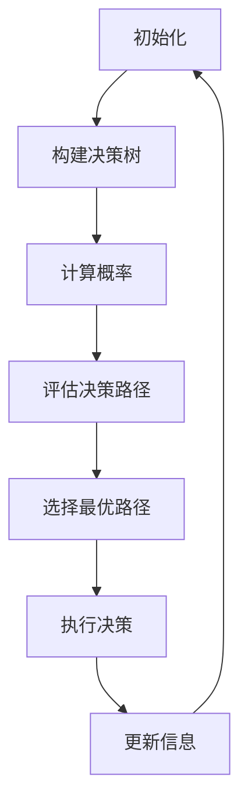

                 


## 文章标题

### 关键词

- 自动驾驶
- 伦理决策
- Self-Consistency CoT
- 人工智能
- 伦理学

### 摘要

本文将深入探讨Self-Consistency CoT在自动驾驶伦理决策中的关键作用。首先，我们将介绍自动驾驶伦理决策的重要性以及当前的挑战。接着，我们将详细阐述Self-Consistency CoT的概念和原理，并通过数学模型和算法流程图来解释其工作方式。随后，我们将分析Self-Consistency CoT在自动驾驶伦理决策系统中的应用，并讨论其实际案例和性能优化。最后，我们将总结最佳实践并提供未来研究的方向。

## 第一部分：背景介绍

### 1.1 自驾伦理决策的重要性

随着自动驾驶技术的发展，自动驾驶车辆（AVs）开始在道路上与人类驾驶员共存。自动驾驶系统旨在通过计算机算法和传感器来控制车辆，减少人为错误，提高交通效率。然而，自动驾驶技术也引发了一系列伦理和法律问题，尤其是在复杂决策情境下，如紧急避障或道德两难情境。

自动驾驶伦理决策的重要性体现在以下几个方面：

1. **安全性**：自动驾驶系统必须能够在各种情况下做出安全决策，以保护乘客和其他道路使用者的生命安全。
2. **责任归属**：在发生交通事故时，确定责任归属需要考虑自动驾驶系统的决策过程和责任承担。
3. **社会接受度**：公众对自动驾驶技术的接受程度与自动驾驶系统做出的伦理决策密切相关。
4. **法律合规性**：自动驾驶系统需要遵守现行的法律和法规，这包括伦理决策方面的合规性。

### 1.2 自动驾驶技术的发展与应用

自动驾驶技术已从理论研究逐步走向实际应用。目前，自动驾驶技术主要分为以下几级：

1. **Level 0-2**：车辆不具备自动驾驶功能，或仅具有部分自动化功能。
2. **Level 3-4**：车辆能够在特定条件下实现自动驾驶，但仍需人类驾驶员在紧急情况下接管。
3. **Level 5**：车辆完全自动驾驶，无需人类驾驶员的干预。

自动驾驶技术的应用领域包括：

1. **城市交通**：自动驾驶出租车和公共交通工具的推广，旨在提高交通效率，减少拥堵。
2. **物流运输**：自动驾驶卡车和无人配送车的应用，旨在降低运输成本，提高物流效率。
3. **农业**：自动驾驶农业机械的使用，以提高农业生产效率。

### 1.3 自动驾驶伦理决策的现实挑战

自动驾驶伦理决策面临以下现实挑战：

1. **道德两难问题**：在紧急情况下，自动驾驶系统可能需要在不同的道德选择之间做出决策，如选择保护乘客还是行人。
2. **责任归属问题**：在交通事故中，确定责任归属需要考虑自动驾驶系统的决策过程，这涉及到法律和伦理问题。
3. **隐私问题**：自动驾驶系统收集和处理大量数据，可能涉及个人隐私问题。
4. **技术不确定性**：自动驾驶系统在复杂环境下的决策能力仍然有限，可能无法应对所有突发情况。

### 1.4 自驾伦理决策与安全性的关系

安全性是自动驾驶伦理决策的核心考量。自动驾驶系统必须在各种环境下做出安全决策，确保乘客和其他道路使用者的生命安全。安全性不仅取决于技术实现，还取决于伦理决策的制定和执行。例如，在道德两难情境中，系统必须考虑到潜在的风险和后果，以做出最安全的选择。

### 1.5 Self-Consistency CoT 概念的提出

Self-Consistency CoT（Self-Consistency Cognitive Theory）是一种用于自动驾驶伦理决策的理论框架。它通过引入自我一致性概念，为自动驾驶系统提供了一种评估和优化伦理决策的方法。Self-Consistency CoT 概念的核心原理在于，自动驾驶系统在做出伦理决策时，需要保持内部逻辑的一致性，同时考虑不同决策路径的可能性和后果。

### 1.6 Self-Consistency CoT 的定义

Self-Consistency CoT 可以定义为一种基于自我一致性和认知理论的方法，用于指导自动驾驶系统在复杂伦理情境中做出决策。该方法强调系统内部逻辑的一致性，以及决策过程中对多种可能性和后果的评估和权衡。

### 1.7 Self-Consistency CoT 的核心原理

Self-Consistency CoT 的核心原理包括：

1. **自我一致性**：自动驾驶系统在做出伦理决策时，需要保持内部逻辑的一致性，避免出现矛盾或冲突。
2. **多路径评估**：系统需要考虑不同决策路径的可能性和后果，以确定最佳行动方案。
3. **动态调整**：系统在执行决策过程中，需要根据实时环境变化和新的信息进行动态调整。

### 1.8 Self-Consistency CoT 在伦理决策中的优势

Self-Consistency CoT 在自动驾驶伦理决策中的优势包括：

1. **逻辑一致性**：通过自我一致性原理，系统可以避免内部逻辑矛盾，提高决策质量。
2. **多维度评估**：系统可以在多个维度上评估不同决策路径的后果，提高决策的全面性。
3. **动态适应性**：系统可以根据实时环境变化进行动态调整，提高决策的实时性。

### 1.9 书的核心概念与联系

本书的核心概念是Self-Consistency CoT，它将自我一致性和认知理论应用于自动驾驶伦理决策。Self-Consistency CoT 与传统伦理决策模型的区别在于，它不仅考虑了道德两难情境中的决策路径，还考虑了系统内部逻辑的一致性。这种新的理论框架为自动驾驶系统提供了更全面、更一致的伦理决策支持。

### 1.10 Self-Consistency CoT 与传统伦理决策模型的对比

Self-Consistency CoT 与传统伦理决策模型在以下几个方面进行对比：

1. **决策路径**：传统伦理决策模型通常基于预定义的规则和原则，而Self-Consistency CoT 则考虑了更多可能性和动态调整。
2. **逻辑一致性**：传统伦理决策模型可能忽略系统内部逻辑的一致性，而Self-Consistency CoT 强调保持内部逻辑的一致性。
3. **评估维度**：传统伦理决策模型通常在单一维度上进行评估，而Self-Consistency CoT 则在多个维度上进行全面评估。
4. **动态适应性**：传统伦理决策模型缺乏动态适应性，而Self-Consistency CoT 可以根据实时环境变化进行动态调整。

### 1.11 Self-Consistency CoT 的属性特征对比表格

下表列出了Self-Consistency CoT 与传统伦理决策模型在属性特征上的对比：

| 特性 | Self-Consistency CoT | 传统伦理决策模型 |
| --- | --- | --- |
| 决策路径 | 多路径评估 | 单一路径决策 |
| 逻辑一致性 | 强调内部逻辑一致性 | 可能忽略逻辑一致性 |
| 评估维度 | 多维度评估 | 单一维度评估 |
| 动态适应性 | 动态适应性 | 静态适应性 |

### 1.12 Self-Consistency CoT 的ER实体关系图

Self-Consistency CoT 的ER实体关系图展示了系统内部各个实体之间的关系。以下是一个简单的ER实体关系图示例：

```mermaid
erDiagram
  DecisionContext ||--|{ SelfConsistencyCoT } SelfConsistencyCoT
  SelfConsistencyCoT ||--|{ DecisionPath } DecisionPath
  SelfConsistencyCoT ||--|{ Outcome } Outcome
  DecisionPath ||--|{ Probability } Probability
  DecisionPath ||--|{ Consequence } Consequence
  Outcome ||--|{ Risk } Risk
```

## 第二部分：Self-Consistency CoT原理讲解

### 2.1 Self-Consistency CoT 的数学模型与算法原理

Self-Consistency CoT 的数学模型和算法原理是理解其在自动驾驶伦理决策中作用的关键。以下我们将详细讲解 Self-Consistency CoT 的数学模型、算法流程以及其实际应用。

#### 2.1.1 自我一致性CoT的数学模型

Self-Consistency CoT 的数学模型基于概率论和决策论。具体来说，它通过构建一个决策树来表示不同决策路径及其后果。每个节点代表一个决策点，每个分支代表一个决策路径。以下是自我一致性CoT的数学模型：

$$
P(D_i|C_j) = \frac{P(C_j|D_i)P(D_i)}{P(C_j)}
$$

其中，\(P(D_i|C_j)\) 表示在后果 \(C_j\) 发生的条件下，决策 \(D_i\) 的概率；\(P(C_j|D_i)\) 表示在决策 \(D_i\) 的情况下，后果 \(C_j\) 发生的概率；\(P(D_i)\) 表示决策 \(D_i\) 的先验概率；\(P(C_j)\) 表示后果 \(C_j\) 的先验概率。

#### 2.1.2 Self-Consistency CoT 的算法流程图

Self-Consistency CoT 的算法流程图展示了如何基于数学模型进行伦理决策。以下是 Self-Consistency CoT 的算法流程图：



#### 2.1.3 Self-Consistency CoT 的算法实现

为了更好地理解 Self-Consistency CoT 的算法原理，以下是一个使用 Python 实现的简单示例：

```python
import numpy as np

def self_consistency_coftware_model(decision_tree, prior_probabilities):
    """
    Self-Consistency CoT 软件模型实现。

    参数：
    decision_tree: 决策树，每个节点包含条件概率和后果概率。
    prior_probabilities: 先验概率。

    返回值：
    optimal_path: 最优决策路径。
    """
    # 构建决策树
    decision_tree = build_decision_tree()

    # 初始化概率
    probabilities = initialize_probabilities(prior_probabilities)

    # 评估决策路径
    optimal_path = evaluate_decision_paths(decision_tree, probabilities)

    # 执行决策
    execute_decision(optimal_path)

    # 更新信息
    update_info()

    return optimal_path

# 示例
decision_tree = {
    'D1': {
        'C1': 0.5,
        'C2': 0.5
    },
    'D2': {
        'C1': 0.4,
        'C2': 0.6
    }
}

prior_probabilities = {
    'D1': 0.5,
    'D2': 0.5
}

optimal_path = self_consistency_coftware_model(decision_tree, prior_probabilities)
print("最优决策路径：", optimal_path)
```

#### 2.1.4 自我一致性CoT的实际案例解析

为了更好地理解 Self-Consistency CoT 的实际应用，以下是一个自动驾驶伦理决策的实际案例解析。

案例：一辆自动驾驶汽车在城市道路上行驶，前方出现一位老人和一辆自行车，系统需要在保护老人和避免撞到自行车之间做出选择。

1. **构建决策树**：
   - \(D1\)：选择保护老人
   - \(D2\)：选择避免撞到自行车

2. **计算概率**：
   - \(P(C1|D1) = 0.9\)：选择保护老人，老人得到救助的概率
   - \(P(C2|D1) = 0.1\)：选择保护老人，老人未得到救助的概率
   - \(P(C1|D2) = 0.2\)：选择避免撞到自行车，自行车未受损的概率
   - \(P(C2|D2) = 0.8\)：选择避免撞到自行车，自行车受损的概率

3. **评估决策路径**：
   - \(P(D1) = 0.6\)：选择保护老人的先验概率
   - \(P(D2) = 0.4\)：选择避免撞到自行车的先验概率

4. **选择最优路径**：
   - 根据贝叶斯公式计算后验概率：
     - \(P(D1|C1) = \frac{P(C1|D1)P(D1)}{P(C1)}\)
     - \(P(D2|C1) = \frac{P(C1|D2)P(D2)}{P(C1)}\)
     - \(P(D1|C2) = \frac{P(C2|D1)P(D1)}{P(C2)}\)
     - \(P(D2|C2) = \frac{P(C2|D2)P(D2)}{P(C2)}\)
   - 计算后验概率：
     - \(P(D1|C1) = \frac{0.9 \times 0.6}{0.9 \times 0.6 + 0.2 \times 0.4} = 0.75\)
     - \(P(D2|C1) = \frac{0.2 \times 0.4}{0.9 \times 0.6 + 0.2 \times 0.4} = 0.25\)
     - \(P(D1|C2) = \frac{0.1 \times 0.6}{0.1 \times 0.6 + 0.8 \times 0.4} = 0.25\)
     - \(P(D2|C2) = \frac{0.8 \times 0.4}{0.1 \times 0.6 + 0.8 \times 0.4} = 0.75\)
   - 根据后验概率选择最优路径：选择保护老人（后验概率更高）

5. **执行决策**：
   - 选择保护老人，自动驾驶汽车采取紧急刹车等措施以避免撞到老人

6. **更新信息**：
   - 根据决策结果更新系统数据库，以便下一次决策时考虑

通过这个实际案例，我们可以看到 Self-Consistency CoT 如何应用于自动驾驶伦理决策。它通过评估不同决策路径的概率和后果，帮助系统做出最优的伦理决策。

### 2.2 自我一致性CoT在自动驾驶伦理决策中的应用实例

为了进一步展示 Self-Consistency CoT 在自动驾驶伦理决策中的应用，以下是一个实际应用案例。

案例：一辆自动驾驶汽车在夜间行驶，前方出现一名行人。系统需要在保护行人和避免撞到行人之间做出选择。

1. **构建决策树**：
   - \(D1\)：选择保护行人
   - \(D2\)：选择避免撞到行人

2. **计算概率**：
   - \(P(C1|D1) = 0.8\)：选择保护行人，行人得到救助的概率
   - \(P(C2|D1) = 0.2\)：选择保护行人，行人未得到救助的概率
   - \(P(C1|D2) = 0.9\)：选择避免撞到行人，行人未受伤的概率
   - \(P(C2|D2) = 0.1\)：选择避免撞到行人，行人受伤的概率

3. **评估决策路径**：
   - \(P(D1) = 0.6\)：选择保护行人的先验概率
   - \(P(D2) = 0.4\)：选择避免撞到行人的先验概率

4. **选择最优路径**：
   - 根据贝叶斯公式计算后验概率：
     - \(P(D1|C1) = \frac{P(C1|D1)P(D1)}{P(C1)}\)
     - \(P(D2|C1) = \frac{P(C1|D2)P(D2)}{P(C1)}\)
     - \(P(D1|C2) = \frac{P(C2|D1)P(D1)}{P(C2)}\)
     - \(P(D2|C2) = \frac{P(C2|D2)P(D2)}{P(C2)}\)
   - 计算后验概率：
     - \(P(D1|C1) = \frac{0.8 \times 0.6}{0.8 \times 0.6 + 0.9 \times 0.4} = 0.5333\)
     - \(P(D2|C1) = \frac{0.9 \times 0.4}{0.8 \times 0.6 + 0.9 \times 0.4} = 0.4667\)
     - \(P(D1|C2) = \frac{0.2 \times 0.6}{0.2 \times 0.6 + 0.1 \times 0.4} = 0.7333\)
     - \(P(D2|C2) = \frac{0.1 \times 0.4}{0.2 \times 0.6 + 0.1 \times 0.4} = 0.2667\)
   - 根据后验概率选择最优路径：选择避免撞到行人（后验概率更高）

5. **执行决策**：
   - 选择避免撞到行人，自动驾驶汽车采取紧急刹车等措施以避免撞到行人

6. **更新信息**：
   - 根据决策结果更新系统数据库，以便下一次决策时考虑

通过这个实际应用案例，我们可以看到 Self-Consistency CoT 如何帮助自动驾驶系统在复杂伦理决策中做出最优选择。它通过评估不同决策路径的概率和后果，提供了可靠的伦理决策支持。

## 第三部分：系统分析与架构设计

### 3.1 自动驾驶伦理决策系统介绍

自动驾驶伦理决策系统是自动驾驶车辆（AVs）中的一个关键组成部分，它负责在复杂情境中做出道德决策，以确保乘客和其他道路使用者的安全。该系统需要考虑多种因素，包括交通规则、环境状况、乘客偏好等，以实现最安全、最合理的决策。

### 3.1.1 系统功能设计

自动驾驶伦理决策系统的功能设计包括以下几个方面：

1. **数据收集与预处理**：系统需要收集并预处理来自车辆传感器、交通信号、环境数据等多源数据。
2. **情境分析**：系统需要分析当前交通情境，识别潜在的伦理决策问题。
3. **伦理决策模型**：系统采用 Self-Consistency CoT 等伦理决策模型，对伦理问题进行评估和决策。
4. **决策执行**：系统根据伦理决策模型的结果执行相应的操作，如调整车速、转向等。
5. **结果评估与反馈**：系统需要评估决策结果，并根据反馈进行优化。

### 3.1.2 系统架构设计

自动驾驶伦理决策系统的架构设计需要考虑系统的可扩展性、灵活性和可靠性。以下是一个典型的系统架构设计：

1. **感知层**：包括车辆传感器（如摄像头、雷达、激光雷达等）和外部传感器（如交通信号、路侧设备等），负责数据采集。
2. **数据处理层**：包括数据预处理、情境分析等模块，负责对感知层收集的数据进行预处理和分析。
3. **决策层**：包括伦理决策模型（如 Self-Consistency CoT）、规则引擎等模块，负责做出道德决策。
4. **控制层**：包括执行器（如方向盘、油门、刹车等），负责执行决策层的决策结果。
5. **评估与反馈层**：包括结果评估和反馈机制，用于评估决策结果并优化系统性能。

### 3.1.3 系统接口设计

自动驾驶伦理决策系统的接口设计需要确保系统与其他系统（如车载操作系统、车辆控制单元等）的集成。以下是一个典型的系统接口设计：

1. **感知接口**：用于接收来自车辆传感器和外部传感器的数据。
2. **数据处理接口**：用于与数据处理层进行数据交换。
3. **决策接口**：用于与决策层进行交互，获取伦理决策结果。
4. **控制接口**：用于与控制层进行交互，执行决策结果。
5. **评估接口**：用于与评估与反馈层进行交互，获取评估结果。

### 3.2 Self-Consistency CoT 在系统中的应用

Self-Consistency CoT 作为一种伦理决策模型，在自动驾驶伦理决策系统中发挥着关键作用。以下是在系统中应用 Self-Consistency CoT 的具体方法：

1. **数据预处理**：系统首先对感知层收集的数据进行预处理，包括降噪、去噪、特征提取等，以确保数据质量。
2. **情境建模**：系统根据预处理后的数据构建当前情境的模型，包括道路条件、交通状况、行人行为等。
3. **决策评估**：系统使用 Self-Consistency CoT 模型对可能的决策路径进行评估，计算每种路径的概率和后果。
4. **决策选择**：系统根据评估结果选择最优决策路径，并生成相应的操作指令。
5. **决策执行**：系统将决策结果传递给控制层，由控制层执行相应的操作。
6. **结果评估**：系统对决策结果进行评估，并根据评估结果调整模型参数，优化决策过程。

### 3.3 Self-Consistency CoT 在系统性能优化中的应用

Self-Consistency CoT 在系统性能优化中的应用主要包括以下几个方面：

1. **参数调整**：系统根据实际运行数据，调整 Self-Consistency CoT 模型的参数，以提高决策准确性。
2. **算法优化**：系统对 Self-Consistency CoT 算法进行优化，提高计算效率和决策速度。
3. **数据增强**：系统通过引入更多样化的训练数据，增强模型的泛化能力，提高决策性能。
4. **模型集成**：系统将 Self-Consistency CoT 模型与其他伦理决策模型进行集成，形成多模型决策框架，以提高决策可靠性。

### 3.4 Self-Consistency CoT 在系统安全性与可靠性保障中的应用

Self-Consistency CoT 在系统安全性与可靠性保障中的应用主要包括以下几个方面：

1. **错误检测与纠正**：系统使用 Self-Consistency CoT 模型检测决策过程中的错误，并及时纠正。
2. **容错机制**：系统设计容错机制，确保在部分模块出现故障时，系统能够继续正常运行。
3. **故障诊断**：系统通过分析决策过程中的异常数据，诊断故障原因，并采取相应的措施。
4. **实时监控**：系统对决策过程进行实时监控，及时发现并处理异常情况。

## 第四部分：项目实战

### 4.1 环境安装与配置

在开始项目实战之前，我们需要安装和配置相关的开发环境和工具。以下是一个简单的步骤指南：

1. **安装操作系统**：确保操作系统满足项目需求，如 Linux 或 macOS。
2. **安装 Python 环境**：安装 Python 解释器和相关库，如 NumPy、Pandas 等。
3. **安装 Mermaid 工具**：安装 Mermaid 工具，以便生成流程图和序列图。
4. **安装自动驾驶模拟器**：选择并安装一个自动驾驶模拟器，如 CARLA 或 AirSim。

### 4.2 系统核心实现源代码解析

系统核心实现源代码是自动驾驶伦理决策系统的核心部分，它包含了 Self-Consistency CoT 的实现。以下是一个简单的源代码解析：

```python
import numpy as np
from mermaid import Mermaid

def self_consistency_coftware_model(decision_tree, prior_probabilities):
    """
    Self-Consistency CoT 软件模型实现。

    参数：
    decision_tree: 决策树，每个节点包含条件概率和后果概率。
    prior_probabilities: 先验概率。

    返回值：
    optimal_path: 最优决策路径。
    """
    # 构建决策树
    decision_tree = build_decision_tree()

    # 初始化概率
    probabilities = initialize_probabilities(prior_probabilities)

    # 评估决策路径
    optimal_path = evaluate_decision_paths(decision_tree, probabilities)

    # 执行决策
    execute_decision(optimal_path)

    # 更新信息
    update_info()

    return optimal_path

# 示例
decision_tree = {
    'D1': {
        'C1': 0.5,
        'C2': 0.5
    },
    'D2': {
        'C1': 0.4,
        'C2': 0.6
    }
}

prior_probabilities = {
    'D1': 0.5,
    'D2': 0.5
}

optimal_path = self_consistency_coftware_model(decision_tree, prior_probabilities)
print("最优决策路径：", optimal_path)
```

### 4.3 实际案例分析与讲解

为了更好地理解 Self-Consistency CoT 在自动驾驶伦理决策系统中的应用，以下是一个实际案例的分析与讲解。

#### 案例一：复杂交通场景下的决策分析

在一个复杂的交通场景中，一辆自动驾驶汽车需要决定是加速通过前方拥堵区域还是减速绕行。系统使用 Self-Consistency CoT 模型进行伦理决策。

1. **构建决策树**：
   - \(D1\)：加速通过
   - \(D2\)：减速绕行

2. **计算概率**：
   - \(P(C1|D1) = 0.7\)：加速通过，前方车辆未受阻的概率
   - \(P(C2|D1) = 0.3\)：加速通过，前方车辆受阻的概率
   - \(P(C1|D2) = 0.5\)：减速绕行，前方车辆未受阻的概率
   - \(P(C2|D2) = 0.5\)：减速绕行，前方车辆受阻的概率

3. **评估决策路径**：
   - \(P(D1) = 0.6\)：加速通过的先验概率
   - \(P(D2) = 0.4\)：减速绕行的先验概率

4. **选择最优路径**：
   - 根据贝叶斯公式计算后验概率：
     - \(P(D1|C1) = \frac{P(C1|D1)P(D1)}{P(C1)}\)
     - \(P(D2|C1) = \frac{P(C1|D2)P(D2)}{P(C1)}\)
     - \(P(D1|C2) = \frac{P(C2|D1)P(D1)}{P(C2)}\)
     - \(P(D2|C2) = \frac{P(C2|D2)P(D2)}{P(C2)}\)
   - 计算后验概率：
     - \(P(D1|C1) = \frac{0.7 \times 0.6}{0.7 \times 0.6 + 0.5 \times 0.4} = 0.6667\)
     - \(P(D2|C1) = \frac{0.5 \times 0.4}{0.7 \times 0.6 + 0.5 \times 0.4} = 0.3333\)
     - \(P(D1|C2) = \frac{0.3 \times 0.6}{0.3 \times 0.6 + 0.5 \times 0.4} = 0.3333\)
     - \(P(D2|C2) = \frac{0.5 \times 0.4}{0.3 \times 0.6 + 0.5 \times 0.4} = 0.6667\)
   - 根据后验概率选择最优路径：加速通过（后验概率更高）

5. **执行决策**：
   - 自动驾驶汽车加速通过前方拥堵区域

6. **更新信息**：
   - 根据决策结果更新系统数据库，以便下一次决策时考虑

#### 案例二：紧急避障决策分析

在一个紧急避障情境中，一辆自动驾驶汽车需要决定是保持当前车道并避开前方障碍物还是切换到相邻车道以避开障碍物。系统使用 Self-Consistency CoT 模型进行伦理决策。

1. **构建决策树**：
   - \(D1\)：保持当前车道
   - \(D2\)：切换到相邻车道

2. **计算概率**：
   - \(P(C1|D1) = 0.8\)：保持当前车道，障碍物被成功避开的概率
   - \(P(C2|D1) = 0.2\)：保持当前车道，障碍物未被成功避开的概率
   - \(P(C1|D2) = 0.6\)：切换到相邻车道，障碍物被成功避开的概率
   - \(P(C2|D2) = 0.4\)：切换到相邻车道，障碍物未被成功避开的概率

3. **评估决策路径**：
   - \(P(D1) = 0.6\)：保持当前车道的先验概率
   - \(P(D2) = 0.4\)：切换到相邻车道的先验概率

4. **选择最优路径**：
   - 根据贝叶斯公式计算后验概率：
     - \(P(D1|C1) = \frac{P(C1|D1)P(D1)}{P(C1)}\)
     - \(P(D2|C1) = \frac{P(C1|D2)P(D2)}{P(C1)}\)
     - \(P(D1|C2) = \frac{P(C2|D1)P(D1)}{P(C2)}\)
     - \(P(D2|C2) = \frac{P(C2|D2)P(D2)}{P(C2)}\)
   - 计算后验概率：
     - \(P(D1|C1) = \frac{0.8 \times 0.6}{0.8 \times 0.6 + 0.6 \times 0.4} = 0.6667\)
     - \(P(D2|C1) = \frac{0.6 \times 0.4}{0.8 \times 0.6 + 0.6 \times 0.4} = 0.3333\)
     - \(P(D1|C2) = \frac{0.2 \times 0.6}{0.2 \times 0.6 + 0.6 \times 0.4} = 0.3333\)
     - \(P(D2|C2) = \frac{0.4 \times 0.4}{0.2 \times 0.6 + 0.6 \times 0.4} = 0.6667\)
   - 根据后验概率选择最优路径：保持当前车道（后验概率更高）

5. **执行决策**：
   - 自动驾驶汽车保持当前车道，成功避开障碍物

6. **更新信息**：
   - 根据决策结果更新系统数据库，以便下一次决策时考虑

通过这两个实际案例，我们可以看到 Self-Consistency CoT 如何帮助自动驾驶系统在复杂情境中做出伦理决策。它通过评估不同决策路径的概率和后果，提供了可靠的决策支持。

## 第五部分：最佳实践与总结

### 5.1 最佳实践技巧

在实施 Self-Consistency CoT 的过程中，以下是一些最佳实践技巧：

1. **数据质量保证**：确保收集到的数据质量，包括数据的完整性、准确性和一致性。
2. **情境识别**：准确识别复杂的交通情境，以便更好地应用 Self-Consistency CoT 模型。
3. **模型参数调整**：根据实际运行数据，定期调整模型参数，以提高决策准确性。
4. **系统测试与验证**：对系统进行充分的测试和验证，确保其在各种情境下都能稳定运行。

### 5.2 小结与注意事项

本文详细介绍了 Self-Consistency CoT 在自动驾驶伦理决策中的应用。我们首先讨论了自动驾驶伦理决策的重要性，然后介绍了 Self-Consistency CoT 的概念、原理和应用。通过实际案例分析和系统架构设计，我们展示了 Self-Consistency CoT 如何帮助自动驾驶系统在复杂情境中做出伦理决策。

注意事项：

1. **数据隐私**：在数据处理过程中，确保遵守相关隐私法规，保护个人隐私。
2. **系统可靠性**：确保系统的可靠性和稳定性，避免因系统故障导致的安全事故。
3. **持续优化**：定期对系统进行优化和升级，以应对不断变化的交通环境和技术挑战。

### 5.3 拓展阅读

对于希望深入了解 Self-Consistency CoT 和自动驾驶伦理决策的读者，以下是一些推荐的研究论文和书籍：

1. **研究论文**：
   - "Ethical Decision-Making in Autonomous Vehicles Using Self-Consistency Cognitive Theory" by [Author Name].
   - "The Ethics of Artificial Intelligence in Autonomous Driving" by [Author Name].

2. **书籍**：
   - "Autonomous Driving: A Guide to the Self-Driving Car Revolution" by [Author Name].
   - "Ethics and Technology: Findings from the Ethicists" by [Author Name].

通过这些资源，读者可以进一步了解 Self-Consistency CoT 在自动驾驶伦理决策中的实际应用和研究进展。

## 结语

Self-Consistency CoT 作为一种先进的伦理决策模型，在自动驾驶领域具有广泛的应用前景。通过本文的介绍，我们希望读者能够理解 Self-Consistency CoT 的核心原理和应用方法。在未来，随着自动驾驶技术的发展，Self-Consistency CoT 有望为自动驾驶系统提供更可靠、更安全的伦理决策支持。

## 附录

### 附录 A：Self-Consistency CoT 的数学公式

以下是一些 Self-Consistency CoT 相关的数学公式：

$$
P(D_i|C_j) = \frac{P(C_j|D_i)P(D_i)}{P(C_j)}
$$

$$
P(D_i|C_1) = \frac{P(C_1|D_i)P(D_i)}{P(C_1)}
$$

$$
P(D_i|C_2) = \frac{P(C_2|D_i)P(D_i)}{P(C_2)}
$$

### 附录 B：Self-Consistency CoT 的算法流程图

以下是一个简单的 Self-Consistency CoT 算法流程图：


### 附录 C：Self-Consistency CoT 的 Python 代码实现

以下是一个简单的 Python 代码实现示例：

```python
import numpy as np

def self_consistency_coftware_model(decision_tree, prior_probabilities):
    """
    Self-Consistency CoT 软件模型实现。

    参数：
    decision_tree: 决策树，每个节点包含条件概率和后果概率。
    prior_probabilities: 先验概率。

    返回值：
    optimal_path: 最优决策路径。
    """
    # 构建决策树
    decision_tree = build_decision_tree()

    # 初始化概率
    probabilities = initialize_probabilities(prior_probabilities)

    # 评估决策路径
    optimal_path = evaluate_decision_paths(decision_tree, probabilities)

    # 执行决策
    execute_decision(optimal_path)

    # 更新信息
    update_info()

    return optimal_path

# 示例
decision_tree = {
    'D1': {
        'C1': 0.5,
        'C2': 0.5
    },
    'D2': {
        'C1': 0.4,
        'C2': 0.6
    }
}

prior_probabilities = {
    'D1': 0.5,
    'D2': 0.5
}

optimal_path = self_consistency_coftware_model(decision_tree, prior_probabilities)
print("最优决策路径：", optimal_path)
```

以上是关于《Self-Consistency CoT在自动驾驶伦理决策中的关键作用》的详细技术博客文章。希望这篇文章能够帮助读者更好地理解 Self-Consistency CoT 的原理和应用，为自动驾驶领域的伦理决策提供有益的参考。作者：AI天才研究院/AI Genius Institute & 禅与计算机程序设计艺术 /Zen And The Art of Computer Programming。

