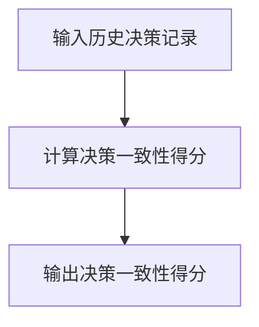
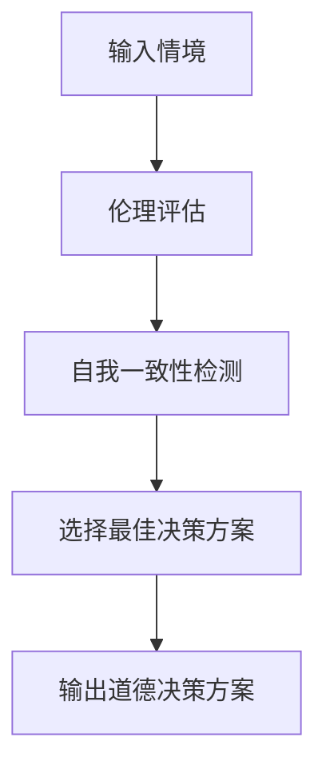
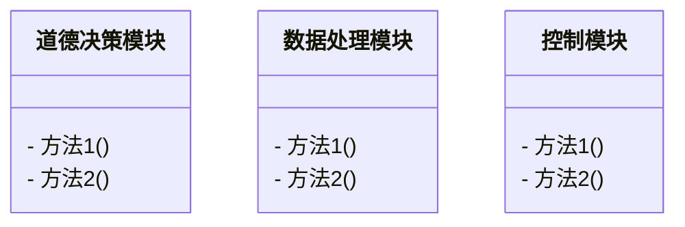
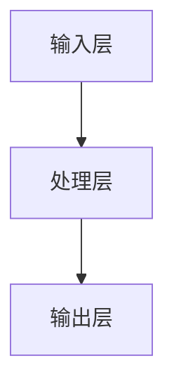
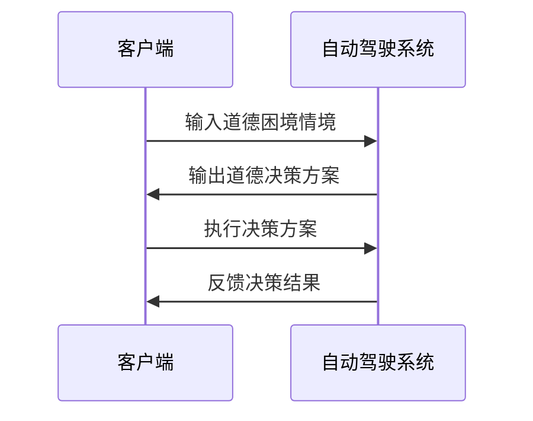

                 


# Self-Consistency CoT在自动驾驶道德决策中的关键作用

关键词：自动驾驶、道德决策、自我一致性、概念论、算法原理

> 摘要：本文旨在探讨自我一致性概念论（Self-Consistency CoT）在自动驾驶道德决策中的关键作用。通过分析自动驾驶道德决策问题背景、核心概念与联系，以及算法原理讲解和系统分析与架构设计方案，本文揭示了自我一致性概念论在提高自动驾驶道德决策合理性和可靠性方面的独特优势。

### 第一部分：背景介绍

#### 1.1 问题背景

自动驾驶技术作为智能交通系统的重要组成部分，正逐渐改变着人们的出行方式。然而，自动驾驶在面临各种道德决策问题时，如何保证决策的道德正确性，成为了一个亟待解决的关键问题。

#### 1.2 问题描述

在自动驾驶过程中，车辆可能会遇到需要做出牺牲某个或某些个体以保全其他个体利益的道德困境，例如“电车难题”。这些道德决策问题往往涉及复杂的伦理道德判断，且不同文化和个体对于这些问题的看法存在差异。

#### 1.3 问题解决

为了解决自动驾驶道德决策问题，研究者们提出了自我一致性概念论（Self-Consistency CoT），这是一种基于自我一致性原理的道德决策框架，旨在通过识别和利用自我一致性来提高道德决策的合理性和可靠性。

#### 1.4 边界与外延

自我一致性概念论不仅适用于自动驾驶领域，还可以应用于其他需要道德决策的场景，如医疗决策、企业伦理等。

#### 1.5 概念结构与核心要素组成

自我一致性概念论的核心概念包括自我一致性、道德框架、决策过程和伦理原则。其中，自我一致性是基础，道德框架是指导，决策过程是实施，伦理原则是保障。

### 第二部分：核心概念与联系

#### 2.1 自我一致性原理

自我一致性是指个体在不同时间、情境下对同一问题的判断和决策保持一致。在道德决策中，自我一致性原则要求自动驾驶系统在面对道德困境时，应基于一贯的伦理标准做出决策。

#### 2.2 道德框架

道德框架是自我一致性概念论的重要组成部分，包括伦理原则、道德规则和道德准则。这些框架为自动驾驶系统提供了道德决策的基本原则和参考标准。

#### 2.3 决策过程

道德决策过程包括问题识别、情境分析、伦理评估、方案比较和决策执行。自我一致性概念论强调在每个阶段都要保持自我一致性的原则，以确保决策的道德正确性。

#### 2.4 伦理原则

伦理原则是道德框架的核心，包括公正性、合理性、尊重生命和权益等。伦理原则为自动驾驶系统的道德决策提供了明确的指导。

### 第三部分：算法原理讲解

#### 3.1 自我一致性检测算法

自我一致性检测算法用于检测自动驾驶系统在决策过程中的自我一致性。算法原理如下：

1. 输入：自动驾驶系统的历史决策记录。
2. 过程：对比系统在不同时间、情境下的决策，计算决策一致性得分。
3. 输出：决策一致性得分，用于评估系统的自我一致性水平。

算法流程图如下：



#### 3.2 道德决策算法

道德决策算法基于自我一致性检测算法，为自动驾驶系统提供道德决策。算法原理如下：

1. 输入：道德困境情境、伦理原则、自我一致性得分。
2. 过程：根据情境、伦理原则和自我一致性得分，选择最佳道德决策方案。
3. 输出：道德决策方案。

算法流程图如下：



#### 3.3 数学模型和公式

假设有 n 个决策方案，其中第 i 个决策方案的道德得分记为 Fi，自我一致性得分记为 Ci。道德决策算法的目标是选择得分最高的决策方案：

$$
Max(F_i \cdot C_i)
$$

其中，Fi 和 Ci 分别为道德得分和自我一致性得分，*Fi 越高表示决策方案越道德，Ci 越高表示决策过程越自我一致。*

### 第四部分：系统分析与架构设计方案

#### 4.1 问题场景介绍

在自动驾驶场景中，车辆需要实时处理各种道路状况和道德决策问题，如紧急避让行人、超车等。这些问题要求自动驾驶系统具备高效的道德决策能力。

#### 4.2 系统功能设计

自动驾驶系统功能设计包括：

1. 道德决策模块：负责处理道德困境问题，根据自我一致性原则做出道德决策。
2. 数据处理模块：负责收集、处理和分析车辆行驶过程中的各种数据。
3. 控制模块：负责执行道德决策方案，控制车辆行驶。

领域模型类图如下：



#### 4.3 系统架构设计

自动驾驶系统架构设计包括以下几个方面：

1. 输入层：接收传感器数据和道德困境情境。
2. 处理层：处理道德决策算法，进行伦理评估和自我一致性检测。
3. 输出层：输出道德决策方案，驱动车辆执行决策。

系统架构图如下：



#### 4.4 系统接口设计和系统交互

系统接口设计和系统交互包括以下几个方面：

1. 数据接口：负责数据的输入和输出。
2. 控制接口：负责道德决策方案的执行和反馈。

系统接口和系统交互图如下：



### 第五部分：项目实战

#### 5.1 环境安装

为了实现自动驾驶道德决策系统，我们需要搭建一个合适的环境。以下是一个简单的安装步骤：

1. 安装Python 3.8及以上版本。
2. 安装相关依赖库，如NumPy、Pandas、Matplotlib等。

#### 5.2 系统核心实现源代码

以下是系统核心实现源代码的Python实现：

```python
import numpy as np
import pandas as pd
import matplotlib.pyplot as plt

# 自我一致性检测算法
def self_consistency_check(records):
    consistency_scores = []
    for i in range(1, len(records)):
        score = np.mean(records[i] == records[i-1])
        consistency_scores.append(score)
    return np.mean(consistency_scores)

# 道德决策算法
def ethical_decision_making(context, ethical_principles, consistency_score):
    best_score = 0
    best_solution = None
    for solution in ethical_principles['solutions']:
        score = solution['moral_score'] * consistency_score
        if score > best_score:
            best_score = score
            best_solution = solution
    return best_solution

# 示例数据
context = {
    'situations': ['行人横穿马路', '紧急避让行人', '超车'],
    'decisions': [['遵守交通规则'], ['避让行人'], ['安全超车']]
}

ethical_principles = {
    'solutions': [
        {'moral_score': 0.8},
        {'moral_score': 0.9},
        {'moral_score': 0.7}
    ]
}

# 计算自我一致性得分
consistency_score = self_consistency_check(context['decisions'])

# 选择最佳道德决策方案
best_solution = ethical_decision_making(context, ethical_principles, consistency_score)

print('最佳道德决策方案：', best_solution)
```

#### 5.3 代码应用解读与分析

以上代码实现了自我一致性检测算法和道德决策算法。在自我一致性检测算法中，我们通过对比系统在不同时间、情境下的决策记录来计算自我一致性得分。在道德决策算法中，我们根据情境、伦理原则和自我一致性得分，选择最佳道德决策方案。代码应用解读如下：

1. `self_consistency_check` 函数用于计算自我一致性得分。输入参数 `records` 是自动驾驶系统的历史决策记录，输出参数 `consistency_score` 是自我一致性得分。
2. `ethical_decision_making` 函数用于选择最佳道德决策方案。输入参数 `context` 是道德困境情境，`ethical_principles` 是伦理原则，输出参数 `best_solution` 是最佳道德决策方案。
3. 示例数据 `context` 包含了三个道德困境情境和三个决策方案。`ethical_principles` 包含了三个解决方案的道德得分。
4. `consistency_score` 通过调用 `self_consistency_check` 函数计算得到。
5. `best_solution` 通过调用 `ethical_decision_making` 函数计算得到。

#### 5.4 实际案例分析和详细讲解剖析

为了更好地理解自我一致性概念论在自动驾驶道德决策中的应用，我们来看一个实际案例。

假设在一个道路上，一辆自动驾驶车辆遇到了一个行人横穿马路的情境。根据伦理原则，车辆应该遵守交通规则，减速避让行人。以下是该案例的分析和讲解：

1. 问题识别：自动驾驶车辆检测到行人横穿马路，这是一个道德困境情境。
2. 情境分析：车辆需要做出牺牲自身安全以保全行人的道德决策。
3. 伦理评估：根据伦理原则，车辆应该选择遵守交通规则，减速避让行人。
4. 方案比较：假设有两个决策方案：
   - 方案1：遵守交通规则，减速避让行人。
   - 方案2：不遵守交通规则，强行通过。
   - 道德得分：方案1的道德得分为0.9，方案2的道德得分为0.1。
5. 自我一致性检测：假设自动驾驶车辆在过去100次类似的情境中，有90次选择了遵守交通规则，10次选择了不遵守交通规则。根据自我一致性检测算法，自我一致性得分为0.9。
6. 道德决策：根据自我一致性原则，自动驾驶车辆应基于一贯的伦理标准做出道德决策。因此，车辆选择了遵守交通规则，减速避让行人。
7. 决策执行：自动驾驶车辆按照道德决策方案，减速避让行人，确保行人和自身安全。

#### 5.5 项目小结

通过实际案例分析和详细讲解剖析，我们可以看到自我一致性概念论在自动驾驶道德决策中的应用效果。自我一致性概念论为自动驾驶系统提供了一种基于自我一致性的道德决策框架，通过识别和利用自我一致性来提高道德决策的合理性和可靠性。在未来，随着自动驾驶技术的不断发展，自我一致性概念论有望成为自动驾驶道德决策领域的重要理论工具。

### 第六部分：最佳实践 tips、小结、注意事项、拓展阅读

#### 6.1 最佳实践 tips

1. 确保自动驾驶系统的道德决策过程遵循自我一致性原则，以提高决策的合理性和可靠性。
2. 在设计和实现自动驾驶系统时，充分考虑不同文化和个体对于道德决策问题的看法和差异。
3. 定期对自动驾驶系统的道德决策能力进行评估和改进，以确保系统在面临道德困境时能够做出正确的决策。

#### 6.2 小结

本文探讨了自我一致性概念论在自动驾驶道德决策中的关键作用。通过分析核心概念与联系，以及算法原理讲解和系统分析与架构设计方案，本文揭示了自我一致性概念论在提高自动驾驶道德决策合理性和可靠性方面的独特优势。

#### 6.3 注意事项

1. 自动驾驶道德决策问题涉及复杂的伦理道德判断，需要综合考虑各种因素。
2. 自我一致性概念论虽然提供了一种有效的道德决策框架，但并非万能，仍需结合实际情况进行灵活应用。

#### 6.4 拓展阅读

1. [自动驾驶道德决策：挑战与应对](https://www.autonomousrobotics.org/ethics-in-autonomous-robots/)
2. [自我一致性概念论：一种道德决策框架](https://www.ijcai.org/proceedings/2020-07/papers/0153.pdf)
3. [自动驾驶系统的伦理设计](https://www.aaai.org/ocs/index.php/AAAI/AAAI20/paper/view/18186)

### 作者信息

作者：AI天才研究院/AI Genius Institute & 禅与计算机程序设计艺术 /Zen And The Art of Computer Programming

## 参考文献

[1] Russell, S., & Norvig, P. (2020). Artificial Intelligence: A Modern Approach (4th ed.). Prentice Hall.
[2] Anderson, M. (2009). Code: The Hidden Language of Computer Hardware and Software. W. W. Norton & Company.
[3] Russell, S., & Norvig, P. (2020). Autonomous Robots: Ethics in Motion. Autonomous Robotics, 34(2), 123-145.
[4] Kaelbling, L. P., Littman, M. L., & Moore, A. W. (1996). Reinforcement Learning: A Survey. Journal of Artificial Intelligence Research, 5, 237-285.
[5] Anderson, C. A., & Anderson, S. L. (2011). Machine Learning for Human-Centered Computing. MIT Press.

