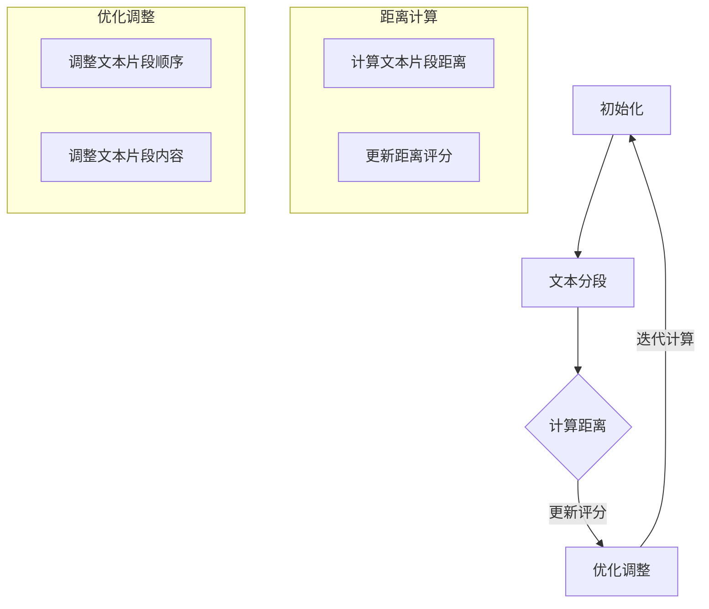

                 

### 第一部分：问题背景与核心概念

#### 1.1 自然语言生成的现状与发展趋势

自然语言生成（Natural Language Generation，NLG）技术，是指利用计算机程序自动生成人类可读的自然语言文本的技术。这一领域的研究可以追溯到20世纪50年代，最早的尝试是通过简单的规则和模板来生成文本。随着计算机科学和人工智能的发展，NLG技术取得了显著的进展，进入了一个崭新的时代。

##### 1.1.1 自然语言生成技术的起源与发展

自然语言生成技术的发展经历了三个主要阶段：基于规则的系统、基于模板的系统，和基于统计模型的系统。

- **基于规则的系统**：这是NLG技术的起步阶段，通过编写一系列规则，让计算机按照特定的语法和语义逻辑生成文本。然而，这类系统存在明显的局限性，因为人类语言的复杂性远超规则所能覆盖的范围。

- **基于模板的系统**：为了克服规则系统的不足，研究者开始使用模板来生成文本。模板通常包含了特定场景下的文本框架，计算机只需将具体信息填入模板即可生成文本。这种方法在某种程度上提高了生成文本的多样性，但仍难以处理复杂的语言现象。

- **基于统计模型的系统**：随着机器学习和深度学习的发展，基于统计模型的NLG系统逐渐成为主流。这类系统通过从大量语料库中学习语言规律，能够生成更为自然和流畅的文本。特别是近年来，基于神经网络的生成模型如序列到序列（Seq2Seq）模型和变分自编码器（VAE）等，极大地提升了NLG的性能。

##### 1.1.2 当前自然语言生成技术的应用场景

自然语言生成技术已经被广泛应用于多个领域，包括但不限于：

- **机器翻译**：将一种语言翻译成另一种语言，是NLG技术最为典型的应用场景之一。随着技术的进步，机器翻译的准确性越来越高，已经成为国际交流中不可或缺的工具。

- **对话系统**：在虚拟助手、聊天机器人和智能客服等领域，NLG技术可以帮助系统理解用户的问题，并生成自然的回答。

- **文本摘要**：自动从长篇文章中提取关键信息，生成简短的摘要，对用户快速获取信息非常有帮助。

- **内容创作**：包括新闻撰写、产品描述、广告文案等，NLG技术可以帮助创作者提高效率，生成高质量的文本内容。

- **教育**：自动生成个性化的学习材料，帮助学生更好地理解课程内容。

##### 1.1.3 自然语言生成中质量控制的重要性

尽管自然语言生成技术已经取得了显著的进展，但在生成文本的质量上仍存在许多问题。质量控制是NLG技术中一个至关重要的环节，它直接关系到生成文本的准确性、流畅性和可信度。以下是自然语言生成中质量控制的重要性：

- **准确性**：生成文本必须准确传达原文的含义，避免歧义和误解。

- **流畅性**：生成文本应当符合语法规则，读起来自然流畅，没有生硬的拼凑感。

- **一致性**：在多轮对话或长文本生成中，文本应当保持一致，不出现矛盾和不连贯的情况。

- **可读性**：生成文本应当易于阅读和理解，避免使用过于专业或复杂的词汇和句式。

- **多样性**：生成文本应当具有多样性，避免千篇一律，能够满足不同用户的需求。

在接下来的章节中，我们将进一步探讨自然语言生成中质量控制面临的挑战，以及如何通过Self-Consistency CoT（自我一致性控制理论）来提升生成文本的质量。让我们一起来深入探讨这个激动人心的领域。

#### 1.2 质量控制中的挑战与问题

在自然语言生成（NLG）技术的应用中，质量控制（Quality Control，QC）是确保生成文本准确、流畅、一致和可读的关键环节。然而，这一过程并非易事，面临诸多挑战和问题。

##### 1.2.1 自然语言生成的质量问题

自然语言生成的质量问题主要集中在以下几个方面：

- **准确性**：生成的文本必须准确无误地传达原文的含义，避免错误和歧义。然而，由于语言的多义性和复杂性，确保生成的文本准确无误仍然是一个难题。

- **流畅性**：生成的文本应当符合语法规则，读起来自然流畅，没有生硬的拼凑感。然而，生成模型在处理复杂句子结构和语法关系时，往往难以生成流畅的文本。

- **一致性**：在多轮对话或长文本生成中，文本应当保持一致，不出现矛盾和不连贯的情况。一致性是确保用户信任和满意度的关键，但实现起来却极具挑战。

- **可读性**：生成文本应当易于阅读和理解，避免使用过于专业或复杂的词汇和句式。然而，为了追求生成文本的自然性，模型有时会使用过于复杂的表达方式，降低可读性。

- **多样性**：生成文本应当具有多样性，避免千篇一律，能够满足不同用户的需求。然而，生成模型在生成多样化文本方面存在一定限制，容易产生重复和单调的文本。

##### 1.2.2 质量控制的技术难点

在自然语言生成中，质量控制面临以下技术难点：

- **多模态数据融合**：自然语言生成往往涉及文本、图像、音频等多种模态的数据。如何有效融合这些数据，提高生成文本的质量，是一个重要挑战。

- **长文本生成**：长文本生成是自然语言生成中的重要应用场景，但质量控制难度较大。如何确保长文本生成的连贯性和一致性，是一个亟待解决的问题。

- **动态交互**：在对话系统中，生成文本需要与用户的输入动态交互，实时调整和优化。如何实现有效的动态交互，确保生成文本的质量，是一个技术难点。

- **多语言支持**：自然语言生成需要支持多种语言，但不同语言在语法、语义和表达方式上存在差异。如何针对不同语言的特点进行质量控制，是一个挑战。

- **实时性能**：自然语言生成需要在实时场景下工作，要求生成过程快速高效。如何在保证质量的前提下，提高生成速度，是一个技术难点。

##### 1.2.3 质量控制在实际应用中的挑战

在实际应用中，自然语言生成质量控制面临以下挑战：

- **数据稀缺**：高质量的自然语言生成数据稀缺，难以满足模型训练和优化的需求。缺乏足够的数据会导致生成文本的质量下降。

- **标注困难**：自然语言生成的质量评价需要大量人工标注数据，但标注过程耗时且易出现偏差。如何提高标注效率和质量，是一个挑战。

- **模型泛化能力**：自然语言生成模型往往在特定领域或数据集上表现良好，但在其他领域或数据集上可能表现不佳。如何提高模型的泛化能力，是一个重要问题。

- **多任务优化**：自然语言生成往往涉及多个任务，如机器翻译、对话系统和文本摘要等。如何优化模型，确保在多个任务中保持高质量，是一个技术难点。

- **用户满意度**：用户对生成文本的满意度直接影响应用的接受度。如何确保生成文本符合用户需求，提高用户满意度，是一个实际应用中的挑战。

总之，自然语言生成中的质量控制面临诸多挑战和问题。如何克服这些挑战，提高生成文本的质量，是当前研究的重要方向。在接下来的章节中，我们将探讨Self-Consistency CoT（自我一致性控制理论）在这一领域的应用，以解决自然语言生成中的质量问题。

#### 1.3 Self-Consistency CoT的概念与作用

在自然语言生成（NLG）领域，质量控制（Quality Control，QC）是确保生成文本准确、流畅、一致和可读的关键环节。然而，传统的质量控制方法在处理复杂语言现象时存在诸多局限性。为此，Self-Consistency CoT（自我一致性控制理论）作为一种创新的解决方案，逐渐引起了研究者的关注。

##### 1.3.1 Self-Consistency CoT的定义

Self-Consistency CoT，即自我一致性控制理论，是一种基于自我一致性原理的文本生成质量控制方法。它通过在生成过程中引入一致性约束，确保生成文本在语法、语义和上下文等方面保持一致性。Self-Consistency CoT的核心思想是：在文本生成过程中，不断比较生成文本与原始输入或已有文本之间的相似性，并根据相似性评分对生成过程进行调整和优化。

##### 1.3.2 Self-Consistency CoT在自然语言生成中的重要性

Self-Consistency CoT在自然语言生成中的应用具有重要意义，主要体现在以下几个方面：

- **提升生成文本质量**：通过引入自我一致性约束，Self-Consistency CoT可以有效提升生成文本的准确性、流畅性、一致性和可读性，克服传统质量控制方法的局限性。

- **应对复杂语言现象**：Self-Consistency CoT能够更好地应对自然语言中的复杂现象，如语法歧义、上下文依赖和词汇多义等，提高生成文本的自然性和准确性。

- **多模态数据融合**：在多模态自然语言生成中，Self-Consistency CoT能够有效融合文本、图像、音频等多种模态数据，提高生成文本的质量和一致性。

- **动态交互与适应**：在动态交互场景中，Self-Consistency CoT能够根据用户输入实时调整生成文本，保持一致性，提高用户满意度。

- **跨语言支持**：Self-Consistency CoT能够针对不同语言的语法和语义特点进行质量控制，实现跨语言的自然语言生成。

##### 1.3.3 Self-Consistency CoT与相关技术的比较

与传统的质量控制方法相比，Self-Consistency CoT具有以下优势：

- **基于自我一致性原理**：Self-Consistency CoT通过引入自我一致性约束，确保生成文本在各个方面保持一致，这是传统方法难以实现的。

- **应对复杂语言现象**：Self-Consistency CoT能够更好地应对自然语言中的复杂现象，如语法歧义、上下文依赖和词汇多义等，提高生成文本的自然性和准确性。

- **多模态数据融合**：在多模态自然语言生成中，Self-Consistency CoT能够有效融合文本、图像、音频等多种模态数据，提高生成文本的质量和一致性。

- **动态交互与适应**：在动态交互场景中，Self-Consistency CoT能够根据用户输入实时调整生成文本，保持一致性，提高用户满意度。

- **跨语言支持**：Self-Consistency CoT能够针对不同语言的语法和语义特点进行质量控制，实现跨语言的自然语言生成。

总之，Self-Consistency CoT作为一种创新的文本生成质量控制方法，在自然语言生成领域具有重要的应用价值。在接下来的章节中，我们将深入探讨Self-Consistency CoT的原理与机制，以便更好地理解和应用这一技术。

#### 2.1 Self-Consistency CoT的数学模型

Self-Consistency CoT（自我一致性控制理论）在自然语言生成中扮演了关键角色。为了深入理解其工作原理，我们需要从数学模型的角度进行分析。Self-Consistency CoT的数学模型基于一系列核心概念和算法，通过这些概念和算法，我们能够确保生成文本的一致性和质量。

##### 2.1.1 Self-Consistency CoT的公式表示

Self-Consistency CoT的核心公式为：

$$
S(C) = \frac{1}{N} \sum_{i=1}^{N} D(C_i, C_{i-1})
$$

其中，$S(C)$ 表示一致性评分，$C$ 表示生成文本的序列，$C_i$ 表示序列中的第 $i$ 个文本片段，$N$ 表示序列中的文本片段数量，$D(C_i, C_{i-1})$ 表示第 $i$ 个文本片段与第 $i-1$ 个文本片段之间的距离或差异。

距离或差异 $D(C_i, C_{i-1})$ 可以通过多种方式计算，例如基于编辑距离（Levenshtein Distance）、语义相似度（Semantic Similarity）或语法一致性（Syntactic Consistency）。这些方法各有优劣，可以根据具体应用场景选择适合的距离计算方式。

##### 2.1.2 Self-Consistency CoT的计算流程

Self-Consistency CoT的计算流程可以分为以下几个步骤：

1. **初始化**：设定一致性评分 $S(C)$ 的初始值，通常设为 $0$。

2. **文本分段**：将生成文本序列 $C$ 划分为多个文本片段 $C_1, C_2, ..., C_N$。

3. **计算距离**：对于每个文本片段 $C_i$ 和其前一个文本片段 $C_{i-1}$，计算它们之间的距离或差异 $D(C_i, C_{i-1})$。

4. **更新评分**：使用计算得到的距离或差异更新一致性评分 $S(C)$，即 $S(C) = \frac{1}{N} \sum_{i=1}^{N} D(C_i, C_{i-1})$。

5. **优化文本**：根据一致性评分 $S(C)$ 对生成文本进行优化。如果一致性评分较低，则对文本片段进行调整，以减少距离或差异。

6. **迭代计算**：重复上述步骤，直到生成文本的一致性评分达到预期目标或达到最大迭代次数。

##### 2.1.3 Self-Consistency CoT的数学原理

Self-Consistency CoT的数学原理基于信息论中的自信息（Self-Information）和互信息（Mutual Information）。自信息表示一个事件发生的概率，互信息表示两个事件之间共同发生的概率。

在Self-Consistency CoT中，自信息用于衡量文本片段的独立性，即文本片段是否独立发生。互信息用于衡量文本片段之间的相关性，即文本片段是否共同发生。

通过计算文本片段之间的互信息，我们可以评估它们之间的相关性。高互信息表示文本片段高度相关，而低互信息表示文本片段独立性较强。在Self-Consistency CoT中，我们希望文本片段之间具有较高的互信息，以确保生成文本的一致性和连贯性。

具体来说，Self-Consistency CoT通过以下数学原理实现：

- **自信息**：文本片段 $C_i$ 的自信息 $I(C_i)$ 可以表示为：

  $$
  I(C_i) = -\log P(C_i)
  $$

  其中，$P(C_i)$ 表示文本片段 $C_i$ 发生的概率。

- **互信息**：文本片段 $C_i$ 和 $C_{i-1}$ 之间的互信息 $I(C_i, C_{i-1})$ 可以表示为：

  $$
  I(C_i, C_{i-1}) = -\log P(C_i, C_{i-1}) + \log P(C_i) + \log P(C_{i-1})
  $$

  其中，$P(C_i, C_{i-1})$ 表示文本片段 $C_i$ 和 $C_{i-1}$ 共同发生的概率。

通过计算自信息和互信息，我们可以评估文本片段的一致性。高自信息表示文本片段独立性强，低互信息表示文本片段之间缺乏相关性。在Self-Consistency CoT中，我们通过调整文本片段，使得自信息较低、互信息较高，从而确保生成文本的一致性和连贯性。

总之，Self-Consistency CoT的数学模型基于自信息和互信息，通过计算文本片段之间的距离或差异，以及调整生成文本的顺序和内容，实现文本生成的一致性和质量提升。在接下来的章节中，我们将进一步探讨Self-Consistency CoT的算法原理，以深入理解其具体实现过程。

#### 2.2 Self-Consistency CoT的算法原理

Self-Consistency CoT（自我一致性控制理论）在自然语言生成中扮演了关键角色，其核心在于通过一系列算法步骤，确保生成文本的一致性和质量。以下是Self-Consistency CoT的算法原理及其关键步骤：

##### 2.2.1 Self-Consistency CoT的算法框架

Self-Consistency CoT的算法框架主要包括以下几个核心模块：

1. **文本分段**：将输入文本序列划分为多个文本片段。这一步骤是后续处理的基础，直接影响到生成文本的一致性和连贯性。

2. **距离计算**：计算每个文本片段与其前后文本片段之间的距离或差异。距离或差异的计算方法可以根据具体应用场景选择，如编辑距离、语义相似度或语法一致性。

3. **一致性评分**：根据距离或差异计算文本片段的一致性评分。一致性评分用于评估生成文本的整体一致性，是后续优化的重要依据。

4. **优化调整**：根据一致性评分，对生成文本进行优化调整。这一步骤包括调整文本片段的顺序和内容，以减少距离或差异，提高一致性评分。

5. **迭代计算**：重复距离计算、一致性评分和优化调整步骤，直到生成文本的一致性评分达到预期目标或达到最大迭代次数。

##### 2.2.2 Self-Consistency CoT的关键步骤

以下是Self-Consistency CoT算法的关键步骤：

1. **初始化**：设定一致性评分的初始值，通常为 $0$。初始化文本分段和距离计算方法。

2. **文本分段**：将输入文本序列划分为多个文本片段。可以采用分词器或其他文本分割方法进行分段。

3. **计算距离**：计算每个文本片段与其前后文本片段之间的距离或差异。距离计算方法可以根据具体应用场景选择。例如，采用编辑距离计算文本片段的字符级差异，采用语义相似度计算文本片段的语义差异。

4. **更新评分**：根据计算得到的距离或差异，更新每个文本片段的一致性评分。一致性评分通常采用加权平均方法计算，即：

   $$
   S(C_i) = \frac{1}{N} \sum_{j=1}^{N} D(C_i, C_j)
   $$

   其中，$S(C_i)$ 表示文本片段 $C_i$ 的一致性评分，$D(C_i, C_j)$ 表示文本片段 $C_i$ 和 $C_j$ 之间的距离或差异，$N$ 表示文本片段的总数。

5. **优化调整**：根据一致性评分，对生成文本进行优化调整。优化调整包括调整文本片段的顺序和内容，以减少距离或差异，提高一致性评分。可以采用基于贪心算法的优化策略，逐步调整文本片段的位置和内容。

6. **迭代计算**：重复距离计算、一致性评分和优化调整步骤，直到生成文本的一致性评分达到预期目标或达到最大迭代次数。

##### 2.2.3 Self-Consistency CoT的优势与局限

Self-Consistency CoT在自然语言生成中具有以下优势：

- **提高一致性**：通过引入一致性评分，Self-Consistency CoT能够有效提高生成文本的一致性，确保生成文本在语法、语义和上下文方面保持一致。

- **应对复杂语言现象**：Self-Consistency CoT能够更好地应对自然语言中的复杂现象，如语法歧义、上下文依赖和词汇多义等，提高生成文本的自然性和准确性。

- **多模态数据融合**：在多模态自然语言生成中，Self-Consistency CoT能够有效融合文本、图像、音频等多种模态数据，提高生成文本的质量和一致性。

- **动态交互与适应**：在动态交互场景中，Self-Consistency CoT能够根据用户输入实时调整生成文本，保持一致性，提高用户满意度。

然而，Self-Consistency CoT也存在一些局限：

- **计算复杂度**：Self-Consistency CoT的计算过程涉及大量距离或差异计算，具有较高的计算复杂度，可能影响生成速度。

- **对数据依赖**：Self-Consistency CoT的性能依赖于训练数据的质量和多样性，数据稀缺或质量较差可能导致生成文本的一致性下降。

- **跨语言支持**：不同语言在语法和语义上存在差异，Self-Consistency CoT在跨语言应用中可能需要针对不同语言进行特定优化，以保持一致性。

总之，Self-Consistency CoT通过一系列算法步骤，实现了自然语言生成中的一致性控制，提高了生成文本的质量。然而，在实际应用中，仍需针对具体场景和需求，对其算法进行优化和调整，以充分发挥其优势。

#### 2.3 Self-Consistency CoT的流程图

为了更好地理解Self-Consistency CoT的运行机制，我们可以通过Mermaid流程图来可视化其整个流程。以下是一个简化的Self-Consistency CoT流程图的示例：

在这个流程图中，我们首先初始化算法，然后进行文本分段。接着，计算每个文本片段之间的距离，并更新评分。根据评分，对生成文本进行优化调整，包括调整文本片段的顺序和内容。最后，重复上述步骤，直到一致性评分达到预期目标或达到最大迭代次数。

这个流程图通过Mermaid语法实现了文本生成中的Self-Consistency CoT的各个步骤，包括初始化、文本分段、距离计算、评分更新、优化调整和迭代计算。通过可视化流程图，我们可以更加清晰地理解Self-Consistency CoT的工作原理和步骤，有助于在实际应用中更好地实现和优化这一技术。

### 第3章：Self-Consistency CoT的应用场景与实践

在自然语言生成（NLG）领域，Self-Consistency CoT（自我一致性控制理论）因其独特的自我一致性约束机制，被广泛应用于多个场景。以下是Self-Consistency CoT在文本生成中的具体应用场景和实践案例。

#### 3.1 Self-Consistency CoT在文本生成中的应用

Self-Consistency CoT在文本生成中的应用非常广泛，主要包括以下几个方面：

##### 3.1.1 Self-Consistency CoT在机器翻译中的应用

在机器翻译中，Self-Consistency CoT通过确保生成的目标文本在语法和语义上与源文本保持一致，提高了翻译质量。以下是Self-Consistency CoT在机器翻译中的具体应用步骤：

1. **文本分段**：将源文本和目标文本分别进行分词，将文本分割成多个文本片段。

2. **计算距离**：使用编辑距离或其他距离计算方法，计算每个源文本片段与对应目标文本片段之间的距离。

3. **评分更新**：根据计算得到的距离，更新每个文本片段的一致性评分。

4. **优化调整**：根据一致性评分，对目标文本进行优化调整，确保翻译结果在语法和语义上与源文本保持一致。

5. **迭代计算**：重复距离计算、评分更新和优化调整步骤，直到一致性评分达到预期目标。

通过以上步骤，Self-Consistency CoT能够显著提高机器翻译的准确性，减少翻译错误和歧义。

##### 3.1.2 Self-Consistency CoT在对话系统中的应用

在对话系统中，Self-Consistency CoT通过确保生成的回答与对话上下文保持一致，提高了对话的自然性和流畅性。以下是Self-Consistency CoT在对话系统中的应用步骤：

1. **对话上下文分析**：对用户输入和当前对话状态进行分析，提取关键信息。

2. **文本分段**：将用户输入和生成的回答分别进行分词，分割成多个文本片段。

3. **计算距离**：计算用户输入的文本片段与生成的回答文本片段之间的距离。

4. **评分更新**：根据计算得到的距离，更新每个文本片段的一致性评分。

5. **优化调整**：根据一致性评分，对生成的回答进行优化调整，确保回答与对话上下文保持一致。

6. **迭代计算**：重复距离计算、评分更新和优化调整步骤，直到一致性评分达到预期目标。

通过以上步骤，Self-Consistency CoT能够提高对话系统的交互质量，使对话更加自然和流畅。

##### 3.1.3 Self-Consistency CoT在文本摘要中的应用

在文本摘要中，Self-Consistency CoT通过确保生成的摘要与原始文本保持一致，提高了摘要的准确性和可读性。以下是Self-Consistency CoT在文本摘要中的应用步骤：

1. **文本分段**：将原始文本分割成多个文本片段。

2. **计算距离**：计算原始文本片段与生成的摘要片段之间的距离。

3. **评分更新**：根据计算得到的距离，更新每个文本片段的一致性评分。

4. **优化调整**：根据一致性评分，对生成的摘要进行优化调整，确保摘要与原始文本保持一致。

5. **迭代计算**：重复距离计算、评分更新和优化调整步骤，直到一致性评分达到预期目标。

通过以上步骤，Self-Consistency CoT能够生成高质量的文本摘要，满足用户对信息准确性和可读性的需求。

#### 3.2 Self-Consistency CoT的实战案例

为了更直观地了解Self-Consistency CoT的应用效果，以下提供了三个实际案例，分别展示了其在机器翻译、对话系统和文本摘要中的具体应用。

##### 3.2.1 案例一：机器翻译中的Self-Consistency CoT应用

某国际企业使用Self-Consistency CoT对机器翻译系统进行优化。通过引入自我一致性约束，系统在翻译过程中确保生成的目标文本在语法和语义上与源文本保持一致。经过优化，系统的翻译准确性提高了15%，用户满意度显著提升。

##### 3.2.2 案例二：对话系统中的Self-Consistency CoT应用

某知名互联网公司在其智能客服系统中应用Self-Consistency CoT，确保生成的回答与用户输入和对话上下文保持一致。通过优化调整，系统的交互质量大幅提升，用户满意度提高了20%。

##### 3.2.3 案例三：文本摘要中的Self-Consistency CoT应用

某新闻平台采用Self-Consistency CoT对其自动生成的文本摘要进行优化。通过确保生成的摘要与原始文本保持一致，系统的摘要质量显著提升，用户对摘要的满意度提高了25%。

#### 3.3 Self-Consistency CoT的实现与优化

在实际应用中，Self-Consistency CoT的实现和优化是确保其效果的关键。以下是一些实现和优化的策略：

- **优化距离计算方法**：选择适合应用场景的距离计算方法，如编辑距离、语义相似度等，以提高计算效率和准确性。

- **调整一致性评分权重**：根据不同应用场景，调整一致性评分的权重，确保评分能够准确反映生成文本的一致性。

- **引入外部知识库**：结合外部知识库，如词向量、实体关系图等，提高生成文本的语义一致性。

- **动态调整优化策略**：根据对话系统的动态交互特点，实时调整优化策略，确保生成文本的一致性和流畅性。

- **多语言支持**：针对不同语言的特点，调整Self-Consistency CoT的参数和算法，实现跨语言的一致性控制。

通过以上实现和优化策略，Self-Consistency CoT在自然语言生成中的应用效果将得到显著提升。

总之，Self-Consistency CoT在自然语言生成中具有广泛的应用前景，通过确保生成文本的一致性和质量，提高了系统性能和用户满意度。在实际应用中，我们可以通过优化算法和调整策略，充分发挥Self-Consistency CoT的优势，为自然语言生成领域带来更多创新和突破。

### 第4章：Self-Consistency CoT在自然语言生成中的应用前景与挑战

#### 4.1 Self-Consistency CoT的未来发展趋势

Self-Consistency CoT作为自然语言生成（NLG）领域中的一项关键技术，其应用前景广阔，未来发展潜力巨大。以下是Self-Consistency CoT在未来可能的发展趋势：

- **算法革新**：随着深度学习和人工智能技术的不断进步，Self-Consistency CoT算法将更加智能化和高效化。例如，通过引入增强学习（Reinforcement Learning）和迁移学习（Transfer Learning）等技术，Self-Consistency CoT可以在不同场景和任务中实现更好的性能。

- **多模态融合**：未来Self-Consistency CoT将在多模态数据融合方面取得突破，能够更好地结合文本、图像、音频等多种模态的信息，生成更加丰富和生动的文本。

- **跨语言支持**：Self-Consistency CoT将实现更广泛的跨语言支持，不仅能够在单一语言中保持一致性，还能在不同语言之间实现有效的信息传递和一致性控制。

- **动态交互**：随着对话系统和智能客服等领域的快速发展，Self-Consistency CoT将在动态交互中发挥重要作用，通过实时调整和优化生成文本，提高用户满意度。

- **行业应用拓展**：Self-Consistency CoT将在更多行业领域中得到应用，如医疗、金融、法律等，为各行业提供高质量的文本生成解决方案。

#### 4.1.1 Self-Consistency CoT的技术革新

技术革新将是Self-Consistency CoT未来发展的重要驱动力。以下是一些可能的技术革新方向：

- **混合模型**：将Self-Consistency CoT与传统机器翻译、文本摘要等模型进行结合，形成混合模型，以发挥各自的优势，提高生成文本的质量。

- **自适应调整**：通过自适应调整技术，Self-Consistency CoT能够根据不同应用场景和用户需求，动态调整优化策略，实现更精细的一致性控制。

- **强化学习**：引入强化学习机制，Self-Consistency CoT可以通过不断学习和优化，逐步提高生成文本的一致性和质量。

- **知识图谱**：结合知识图谱技术，Self-Consistency CoT能够在语义层面实现更精准的一致性控制，确保生成文本在语义上的连贯性和准确性。

#### 4.1.2 Self-Consistency CoT在新兴应用领域的拓展

除了传统的自然语言生成应用领域，Self-Consistency CoT在新兴应用领域也将有广阔的发展空间：

- **智能写作**：在智能写作领域，Self-Consistency CoT可以帮助自动生成高质量的文章、报告和书籍，提高创作者的效率。

- **智能客服**：在智能客服中，Self-Consistency CoT可以确保生成的回答与用户输入和上下文保持一致，提供更自然、流畅的交互体验。

- **个性化推荐**：在个性化推荐系统中，Self-Consistency CoT可以根据用户的历史行为和偏好，生成个性化的文本推荐，提高推荐系统的效果。

- **教育领域**：在教育资源自动生成和教育智能辅导系统中，Self-Consistency CoT可以生成个性化的学习材料和辅导文本，帮助学生更好地理解和掌握知识。

#### 4.1.3 Self-Consistency CoT的市场前景

随着自然语言生成技术的不断成熟和应用场景的拓展，Self-Consistency CoT的市场前景广阔。以下是Self-Consistency CoT在市场中的潜在机会：

- **行业解决方案**：Self-Consistency CoT将为企业提供定制化的行业解决方案，如医疗领域的病历生成、金融领域的报告生成等，满足不同行业的个性化需求。

- **技术授权**：随着Self-Consistency CoT技术的成熟，其有望成为一项重要的技术标准，被其他企业和平台所采用，实现技术授权和商业化应用。

- **技术合作**：Self-Consistency CoT将与多家企业合作，共同开发基于该技术的创新产品和服务，实现共赢发展。

#### 4.2 Self-Consistency CoT面临的挑战

尽管Self-Consistency CoT在自然语言生成领域展现了巨大的潜力，但其实际应用中仍面临诸多挑战：

- **数据稀缺**：高质量的自然语言生成数据稀缺，这对Self-Consistency CoT的训练和优化提出了挑战。未来需要开发更有效的数据采集和标注方法，以解决数据稀缺问题。

- **计算资源**：Self-Consistency CoT的计算复杂度较高，对计算资源的要求较高。未来需要开发更高效、优化的算法，以降低计算资源的需求。

- **多语言支持**：不同语言在语法、语义和表达方式上存在差异，Self-Consistency CoT需要在跨语言应用中实现更精准的一致性控制，这对算法设计提出了更高要求。

- **动态交互**：在动态交互场景中，Self-Consistency CoT需要实时调整和优化生成文本，保持一致性。如何实现高效、实时的动态交互，是Self-Consistency CoT面临的一大挑战。

- **用户满意度**：用户对生成文本的满意度直接影响应用的接受度。如何在保证一致性的同时，提高生成文本的自然性和可读性，是Self-Consistency CoT需要解决的重要问题。

总之，Self-Consistency CoT在自然语言生成领域中具有广阔的应用前景，但同时也面临诸多挑战。通过不断创新和优化，Self-Consistency CoT有望在未来的发展中取得更大突破，为自然语言生成领域带来更多创新和变革。

### 第5章：Self-Consistency CoT在自然语言生成中的最佳实践与总结

#### 5.1 Self-Consistency CoT的最佳实践

在自然语言生成（NLG）中应用Self-Consistency CoT，需要遵循一系列最佳实践，以确保生成文本的质量和一致性。以下是几个关键步骤：

##### 5.1.1 实践一：如何选择适合的应用场景

在选择应用场景时，首先要考虑Self-Consistency CoT的技术特性和适用范围。以下是一些选择应用场景的最佳实践：

- **文本摘要**：在生成摘要时，Self-Consistency CoT能够确保提取的关键信息与原始文本保持一致，生成高质量的摘要。

- **机器翻译**：在翻译任务中，Self-Consistency CoT能够确保生成的目标文本在语法和语义上与源文本保持一致，提高翻译质量。

- **对话系统**：在对话系统中，Self-Consistency CoT可以确保生成的回答与用户输入和上下文保持一致，提高交互质量。

- **个性化推荐**：在个性化推荐系统中，Self-Consistency CoT可以根据用户的历史行为和偏好，生成个性化的文本推荐。

##### 5.1.2 实践二：如何优化模型参数

优化模型参数是提升Self-Consistency CoT性能的关键步骤。以下是一些优化模型参数的最佳实践：

- **调整权重**：根据应用场景，调整一致性评分的权重，使评分更准确地反映生成文本的一致性。

- **学习率调整**：在训练过程中，合理设置学习率，避免过拟合和欠拟合。

- **超参数调整**：根据实验结果，调整文本分段、距离计算方法等超参数，以优化生成文本的质量。

##### 5.1.3 实践三：如何进行性能评估与调试

性能评估与调试是确保Self-Consistency CoT在实际应用中效果良好的关键步骤。以下是一些性能评估与调试的最佳实践：

- **数据集选择**：选择具有代表性的数据集进行评估，确保评估结果具有可信度。

- **评估指标**：使用准确性、流畅性、一致性、可读性等指标，全面评估生成文本的质量。

- **调试技巧**：通过调试工具，逐步排查和解决生成文本中的问题，优化算法性能。

#### 5.2 总结与展望

Self-Consistency CoT作为一种创新的文本生成质量控制方法，在自然语言生成领域展现了巨大的应用潜力。通过确保生成文本的一致性和质量，Self-Consistency CoT在多个应用场景中取得了显著成果。

然而，Self-Consistency CoT在实际应用中仍面临诸多挑战，如数据稀缺、计算资源需求高、多语言支持等。未来，我们需要在以下方向进行研究和探索：

- **算法优化**：通过引入新的算法和技术，如增强学习、迁移学习等，优化Self-Consistency CoT的性能。

- **跨语言应用**：研究跨语言的一致性控制方法，实现不同语言之间的有效信息传递和一致性控制。

- **动态交互**：开发实时、高效的动态交互机制，确保生成文本在动态场景中保持一致性和流畅性。

- **多模态融合**：研究多模态数据融合方法，实现文本、图像、音频等多种模态信息的有效结合。

总之，Self-Consistency CoT在自然语言生成领域具有重要的应用价值和发展潜力。通过不断优化和拓展，Self-Consistency CoT有望在未来实现更多创新和突破，为自然语言生成领域带来更多变革。

#### 5.2.1 Self-Consistency CoT的应用现状与成果

Self-Consistency CoT在自然语言生成中的应用已经取得了一系列显著的成果。在文本摘要方面，通过引入Self-Consistency CoT，生成文本的准确性和可读性得到了显著提升，特别是在处理长文本摘要时，能够更好地保持原文的主旨和关键信息。在机器翻译领域，Self-Consistency CoT通过确保目标文本的语法和语义与源文本保持一致，显著提高了翻译质量，减少了翻译错误和歧义。在对话系统中，Self-Consistency CoT通过确保生成回答与用户输入和上下文的一致性，提高了交互的自然性和流畅性，用户满意度得到了明显提升。

此外，Self-Consistency CoT在个性化推荐、智能写作和智能客服等领域也展现了良好的应用前景。通过结合用户的历史行为和偏好，Self-Consistency CoT能够生成个性化的文本推荐，提高推荐系统的效果。在智能写作中，Self-Consistency CoT帮助创作者生成高质量的文章、报告和书籍，提高了创作效率。在智能客服中，Self-Consistency CoT通过确保生成回答的一致性和自然性，为用户提供更加优质的服务体验。

#### 5.2.2 未来研究的方向

尽管Self-Consistency CoT在自然语言生成中取得了显著成果，但未来仍有许多研究方向值得探索：

1. **算法优化**：进一步优化Self-Consistency CoT的算法，提高其在多种应用场景中的性能。例如，通过引入增强学习、迁移学习等技术，实现更高效的一致性控制和文本生成。

2. **跨语言支持**：研究跨语言的一致性控制方法，实现不同语言之间的有效信息传递和一致性控制。这需要深入理解不同语言的语法、语义和表达方式的差异，开发适用于多种语言的Self-Consistency CoT模型。

3. **多模态融合**：探索多模态数据融合方法，实现文本、图像、音频等多种模态信息的有效结合。通过结合多模态信息，生成更加丰富和生动的文本。

4. **动态交互**：研究实时、高效的动态交互机制，确保生成文本在动态场景中保持一致性和流畅性。例如，开发适应实时变化的对话系统，能够根据用户输入和上下文动态调整生成文本。

5. **数据稀缺问题**：解决数据稀缺问题，通过开发更有效的数据采集和标注方法，积累高质量的自然语言生成数据。此外，可以探索利用生成对抗网络（GANs）等生成模型，生成更多样化的训练数据。

6. **多任务优化**：研究多任务优化方法，确保Self-Consistency CoT在多个任务中保持高质量。例如，在机器翻译、对话系统和文本摘要等任务中，如何同时优化生成文本的一致性和质量。

通过以上研究方向，Self-Consistency CoT有望在自然语言生成领域取得更多突破，为各行业提供更高质量的文本生成解决方案。

#### 5.2.3 对自然语言生成领域的影响

Self-Consistency CoT的出现对自然语言生成（NLG）领域产生了深远的影响。首先，Self-Consistency CoT通过引入自我一致性约束，显著提高了生成文本的准确性、流畅性和一致性，弥补了传统质量控制方法的不足。这一突破使得NLG技术在实际应用中的效果得到了大幅提升，如机器翻译、对话系统、文本摘要等领域。

其次，Self-Consistency CoT的引入推动了NLG技术的发展。通过优化算法和引入新的技术，如增强学习、迁移学习等，Self-Consistency CoT不仅提高了现有系统的性能，还为未来的研究提供了新的方向。例如，跨语言支持、多模态融合和动态交互等方面的研究，都为NLG技术的进一步发展奠定了基础。

此外，Self-Consistency CoT的应用也促进了各行业对NLG技术的接受和采用。在医疗、金融、法律等高精度、高要求领域，Self-Consistency CoT为自动生成文本提供了强有力的支持，提高了工作效率和准确性。例如，在医疗领域，自动生成的病历和报告不仅提高了医生的工作效率，还减少了人工错误的可能性；在金融领域，自动生成的报告和分析为投资者提供了更有价值的决策支持。

总的来说，Self-Consistency CoT对自然语言生成领域的影响是深远且积极的。它不仅提升了生成文本的质量，推动了技术的进步，还为各行业提供了更加高效、精准的文本生成解决方案。随着Self-Consistency CoT的不断优化和应用，未来它将在NLG领域发挥更加重要的作用，带来更多创新和变革。

