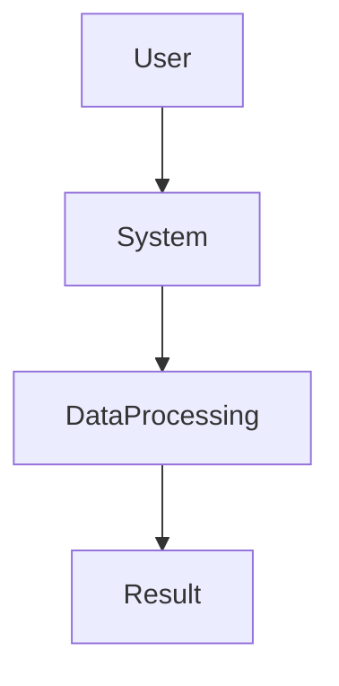

                 

### 第1章: 自我一致性概念与金融分析的关系

## 1.1 自我一致性概念背景

### 1.1.1 自我一致性概念的定义

自我一致性（Self-Consistency）是一个广泛应用于多个领域的核心概念，尤其在逻辑学、信息论和系统理论中具有重要地位。自我一致性指的是一个系统或概念内部各部分之间的一致性关系，这种一致性可以通过数学模型和逻辑推理来描述和验证。具体来说，自我一致性意味着系统内部的每个元素都能够相互支持和验证，从而形成一个自洽的整体。

在逻辑学中，自我一致性是指一个论证或陈述在逻辑上内部不自相矛盾。一个系统如果存在逻辑矛盾，则被称为“不自洽”或“矛盾”。这种自我一致性是逻辑推理和证明的基础。

### 1.1.2 自我一致性概念在金融领域的重要性

金融分析是金融学的一个重要分支，涉及到投资、风险管理、资产定价等多个方面。自我一致性概念在金融领域的应用具有重要意义，主要体现在以下几个方面：

1. **风险管理**：自我一致性可以用于评估金融系统的稳定性，通过分析系统内部各组成部分的一致性，预测潜在的金融风险。
   
2. **资产定价**：在资产定价过程中，自我一致性可以帮助分析市场数据，确保定价模型的一致性和准确性。

3. **投资策略**：自我一致性原则可以指导投资者设计投资策略，通过一致性分析来提高投资决策的可靠性和有效性。

4. **金融市场监控**：自我一致性原则可以用于监测金融市场的健康状态，及时发现并预警市场异常。

### 1.1.3 自我一致性概念与金融分析的联系

自我一致性概念与金融分析之间存在着紧密的联系，主要体现在以下几个方面：

1. **逻辑推理**：金融分析中的许多决策依赖于逻辑推理，而自我一致性原则可以提供一种逻辑验证的工具，确保决策的一致性和可靠性。

2. **信息整合**：金融分析需要整合大量市场信息，而自我一致性可以帮助消除信息中的矛盾和冲突，提高信息处理的效率和准确性。

3. **模型验证**：在金融模型中，自我一致性可以用于验证模型假设和参数设置，确保模型结果的可靠性和有效性。

4. **决策支持**：自我一致性原则可以为金融决策提供支持，通过分析系统内部的一致性关系，帮助投资者和管理者做出更加明智的决策。

## 1.2 金融分析中的问题与挑战

### 1.2.1 传统金融分析方法的局限性

传统金融分析方法主要依赖于历史数据和统计模型，这些方法在处理复杂的市场数据时存在一定的局限性：

1. **数据依赖**：传统方法高度依赖历史数据，而市场环境的变化可能导致这些数据不再有效。

2. **模型假设**：传统金融模型往往基于一系列假设，这些假设在现实中可能并不总是成立。

3. **信息处理能力有限**：传统方法在处理大量、复杂的信息时，往往效率较低，难以应对实时市场的需求。

### 1.2.2 金融分析中的不确定性与复杂性

金融市场的本质具有高度的不确定性和复杂性，主要体现在以下几个方面：

1. **市场动态变化**：金融市场受到多种因素的影响，如政策、经济环境、投资者情绪等，这些因素相互作用，使得市场动态变化难以预测。

2. **信息不对称**：市场参与者的信息不对称性增加了金融分析的难度，投资者往往难以获取全面的信息。

3. **系统复杂性**：金融系统本身具有复杂的网络结构和多层次的影响因素，使得传统方法难以全面捕捉和解释这些复杂性。

### 1.2.3 需要更高效和准确的金融分析方法

面对金融分析中的问题与挑战，迫切需要更高效、准确的金融分析方法：

1. **提高数据处理能力**：需要开发能够处理海量、复杂市场数据的技术，如大数据分析和机器学习。

2. **增强模型适应性**：需要设计能够适应市场环境变化的动态模型，以提高预测的准确性和可靠性。

3. **整合多源信息**：需要开发能够整合多种信息源的技术，消除信息中的矛盾和冲突，提高信息处理的效率。

4. **逻辑推理与验证**：引入自我一致性原则，通过逻辑推理和验证确保金融分析结果的一致性和可靠性。

## 1.3 自我一致性概念在金融分析中的应用前景

### 1.3.1 自我一致性概念的应用潜力

自我一致性概念在金融分析中具有巨大的应用潜力，主要体现在以下几个方面：

1. **提高分析一致性**：自我一致性原则可以帮助金融分析师确保分析过程和结果的一致性，减少人为错误和偏差。

2. **增强模型可靠性**：自我一致性可以用于验证金融模型的假设和参数设置，提高模型的可靠性和有效性。

3. **优化投资决策**：通过自我一致性分析，投资者可以更好地理解市场数据，提高投资决策的准确性和效率。

4. **风险评估与管理**：自我一致性原则可以用于评估金融系统的稳定性，及时发现并预警潜在的金融风险。

### 1.3.2 自我一致性概念在金融分析中的优势

自我一致性概念在金融分析中具有以下优势：

1. **逻辑性强**：自我一致性原则基于逻辑推理，能够确保分析结果的一致性和可靠性。

2. **适应性高**：自我一致性原则可以适应不同的金融分析场景，具有较强的灵活性和适应性。

3. **信息整合能力**：自我一致性原则可以帮助整合多源信息，消除信息中的矛盾和冲突，提高信息处理的效率。

4. **提升决策质量**：通过自我一致性分析，可以提供更准确、可靠的数据和模型支持，提升金融决策的质量。

### 1.3.3 自我一致性概念在金融分析中的潜在挑战

尽管自我一致性概念在金融分析中具有巨大潜力，但在实际应用中也面临一些潜在挑战：

1. **技术难度**：自我一致性分析需要复杂的数学模型和算法支持，技术实现难度较高。

2. **数据质量**：自我一致性分析依赖于高质量的数据，数据质量直接影响到分析结果。

3. **实时性需求**：金融市场动态变化快速，自我一致性分析需要满足实时性需求，这对技术实现提出了更高要求。

4. **决策复杂度**：自我一致性分析结果需要与实际决策相结合，决策过程的复杂度增加，需要更高层次的决策支持。

## 1.4 本书结构安排

### 1.4.1 全书章节安排概述

本书分为四个部分，共包括五个章节：

- 第一部分：引言，主要介绍自我一致性概念与金融分析的关系。
- 第二部分：核心概念，详细解释自我一致性原理。
- 第三部分：应用案例分析，通过实际案例展示自我一致性在金融分析中的应用。
- 第四部分：系统设计与实现，介绍自我一致性金融分析系统的设计与实现。
- 第五部分：总结与展望，对全书内容进行总结，并对未来发展方向进行展望。

### 1.4.2 各章节主要内容介绍

- **第1章**：介绍自我一致性概念与金融分析的关系，包括自我一致性的定义、在金融领域的重要性、金融分析中的问题与挑战以及自我一致性概念在金融分析中的应用前景。
- **第2章**：详细解释自我一致性原理，包括自我一致性的定义、数学模型、属性特征对比、应用领域等内容。
- **第3章**：通过实际案例展示自我一致性在金融分析中的应用，包括案例背景与目标、应用场景、解决方案、实施步骤和结果分析。
- **第4章**：介绍自我一致性金融分析系统的设计与实现，包括系统介绍、架构设计、功能设计、接口设计和交互设计等内容。
- **第5章**：总结全书内容，并对自我一致性在金融分析中的应用进行展望。

### 1.4.3 阅读建议与目标

本书旨在为读者提供全面、系统的自我一致性金融分析知识，读者需具备以下背景：

- 具备基本的金融分析知识，了解金融市场和金融工具。
- 掌握一定的数学和逻辑推理能力，能够理解并运用自我一致性原理。
- 对编程和系统设计有一定的了解，能够理解并实现相关技术。

阅读本书的目标是：

- 理解自我一致性概念及其在金融分析中的应用。
- 掌握自我一致性原理的数学模型和算法。
- 通过实际案例了解自我一致性在金融分析中的具体应用。
- 学会设计和实现自我一致性金融分析系统。

通过阅读本书，读者将能够：

- 提高金融分析的能力和效率。
- 设计和实现更加可靠和高效的金融分析系统。
- 对金融市场有更深入的理解，为投资决策提供有力支持。

----------------------------------------------------------------

# 第二部分: 核心概念

## 第2章: 自我一致性概念原理

自我一致性（Self-Consistency）是金融分析中的一个关键概念，它在逻辑推理、信息整合和模型验证中扮演着重要角色。本章将深入探讨自我一致性的基本原理，包括其定义、数学模型、属性特征对比及其在不同领域的应用。

## 2.1 自我一致性原理概述

### 2.1.1 自我一致性的定义

自我一致性指的是系统内部各个部分之间的一致性关系，这种一致性可以通过数学模型和逻辑推理来验证。具体来说，自我一致性是指一个系统在内部各部分之间没有矛盾或冲突，每个部分都能相互支持和验证，形成一个自洽的整体。

在金融分析中，自我一致性意味着分析过程中的各种假设、数据和模型之间没有逻辑矛盾，能够相互验证和补充，从而提高分析结果的一致性和可靠性。

### 2.1.2 自我一致性原理的核心特点

自我一致性原理具有以下几个核心特点：

1. **自洽性**：系统内部各个部分之间没有矛盾和冲突，能够相互支持和验证。
2. **逻辑性**：通过逻辑推理验证系统的一致性，确保分析结果的可靠性。
3. **适应性**：能够适应不同的分析场景和数据，具有较强的灵活性和通用性。
4. **信息整合**：能够整合多源信息，消除信息中的矛盾和冲突，提高信息处理的效率。

## 2.2 自我一致性原理的数学模型

自我一致性原理可以通过数学模型来描述和验证。以下是一个简单的数学模型：

$$
\text{Self-Consistency CoT} = \frac{\sum_{i=1}^{n} w_i \cdot \text{CoT}_i}{\sum_{i=1}^{n} w_i}
$$

其中，$w_i$表示第$i$个元素的重要性权重，$\text{CoT}_i$表示第$i$个元素的一致性指标。这个公式表示通过加权平均各元素的一致性指标，得到系统的总体一致性指标（Self-Consistency CoT）。

### 2.2.1 自我一致性原理的数学公式解释

1. **加权平均**：通过给每个元素分配一个权重，将各元素的一致性指标进行加权平均，得到系统的总体一致性指标。
2. **一致性指标**：每个元素的一致性指标表示该元素与其他元素之间的匹配程度，一致性指标越高，表示元素之间的匹配度越高。
3. **总体一致性指标**：通过加权平均，得到系统的总体一致性指标，用于衡量系统内部的一致性水平。

### 2.2.2 自我一致性原理的应用实例

以金融分析为例，假设我们分析一个投资组合，其中包含多个资产。我们可以为每个资产分配一个权重，并根据资产的历史表现和当前市场情况计算其一致性指标。通过加权平均这些资产的一致性指标，可以得到投资组合的总体一致性指标，从而评估投资组合的整体稳定性和风险。

## 2.3 自我一致性原理的属性特征对比

为了更好地理解自我一致性原理，我们可以将其与其他相关概念进行对比，如下表所示：

| 概念 | 定义 | 特点 |
| --- | --- | --- |
| 自我一致性 | 系统内部各部分之间的一致性 | 自洽性、逻辑性、适应性、信息整合 |
| 信息一致性 | 数据之间的匹配程度 | 准确性、一致性、实时性 |
| 逻辑一致性 | 论证或陈述在逻辑上没有矛盾 | 严谨性、可靠性、通用性 |
| 模型一致性 | 模型假设和实际结果的匹配 | 可靠性、准确性、适应性 |

### 2.3.1 自我一致性原理与其他概念的对比

1. **与信息一致性的区别**：信息一致性主要关注数据之间的匹配程度，而自我一致性则更侧重于系统内部的一致性关系。
2. **与逻辑一致性的区别**：逻辑一致性主要针对论证或陈述的逻辑矛盾，而自我一致性则涉及更广泛的系统内部一致性。
3. **与模型一致性的区别**：模型一致性主要关注模型假设和实际结果的匹配，而自我一致性则更侧重于系统内部各部分之间的一致性。

### 2.3.2 自我一致性原理的优势与局限

自我一致性原理具有以下优势：

1. **提高分析一致性**：通过确保系统内部的一致性，可以提高金融分析结果的可靠性和准确性。
2. **增强模型适应性**：自我一致性原理可以适应不同的分析场景和数据，具有较强的灵活性和通用性。
3. **信息整合能力**：自我一致性原理可以帮助整合多源信息，消除信息中的矛盾和冲突，提高信息处理的效率。

然而，自我一致性原理也存在一些局限：

1. **技术难度**：实现自我一致性原理需要复杂的数学模型和算法支持，技术实现难度较高。
2. **数据质量**：自我一致性分析依赖于高质量的数据，数据质量直接影响到分析结果。
3. **实时性需求**：金融市场动态变化快速，自我一致性分析需要满足实时性需求，这对技术实现提出了更高要求。

## 2.4 自我一致性原理的应用领域

自我一致性原理在多个领域具有广泛的应用，主要包括：

1. **金融分析**：自我一致性原理可以用于金融风险管理和投资决策，提高金融分析的可靠性和准确性。
2. **信息整合**：自我一致性原理可以帮助整合多源信息，消除信息中的矛盾和冲突，提高信息处理的效率。
3. **系统设计**：自我一致性原理可以用于系统设计和验证，确保系统内部的一致性和稳定性。
4. **逻辑推理**：自我一致性原理可以用于逻辑推理和验证，确保论证或陈述的一致性和可靠性。

### 2.4.1 自我一致性原理在金融分析中的应用

在金融分析中，自我一致性原理可以用于以下几个方面：

1. **风险管理**：通过自我一致性分析，可以评估金融系统的稳定性，预测潜在的金融风险。
2. **资产定价**：自我一致性原理可以帮助分析市场数据，确保定价模型的一致性和准确性。
3. **投资策略**：通过自我一致性分析，投资者可以设计更加可靠和有效的投资策略。
4. **金融市场监控**：自我一致性原理可以用于监测金融市场的健康状态，及时发现并预警市场异常。

### 2.4.2 自我一致性原理在其他领域的应用

除了金融分析，自我一致性原理在其他领域也具有广泛的应用：

1. **信息科学**：自我一致性原理可以用于信息整合和消除信息矛盾，提高信息处理的效率和准确性。
2. **系统设计**：自我一致性原理可以用于系统设计和验证，确保系统内部的一致性和稳定性。
3. **人工智能**：自我一致性原理可以用于人工智能模型的验证和优化，提高模型的可靠性和准确性。
4. **逻辑学**：自我一致性原理可以用于逻辑推理和验证，确保论证或陈述的一致性和可靠性。

## 2.5 本章小结

本章介绍了自我一致性概念的基本原理，包括其定义、数学模型、属性特征对比和应用领域。自我一致性原理在金融分析中具有重要意义，可以提高金融分析的可靠性和准确性。同时，自我一致性原理在其他领域也具有广泛的应用，如信息科学、系统设计和人工智能等。通过本章的学习，读者可以更好地理解自我一致性原理，为实际应用提供理论基础和指导。

----------------------------------------------------------------

## 第3章: 自我一致性在金融分析中的应用案例

### 3.1 案例背景与目标

### 3.1.1 案例背景介绍

当前金融市场复杂多变，投资者面临着诸多不确定性和风险。为了提高投资决策的准确性和效率，多家金融机构和研究机构开始探索新的金融分析方法。自我一致性（Self-Consistency）概念作为一种新兴的分析工具，逐渐受到关注。本案例选取了一家大型投资银行作为研究对象，旨在通过自我一致性方法优化其投资组合管理和风险控制策略。

### 3.1.2 案例目标概述

本案例的目标主要有以下三个方面：

1. **优化投资组合**：通过自我一致性分析，评估当前投资组合的稳定性和风险水平，为调整投资策略提供依据。
2. **提高决策效率**：利用自我一致性原理，整合多源信息，简化分析过程，提高投资决策的效率和准确性。
3. **强化风险控制**：通过自我一致性方法，及时发现并预警潜在的市场风险，提高风险管理的有效性。

### 3.2 案例应用场景

#### 3.2.1 案例应用领域

本案例应用领域主要包括投资组合管理和风险管理两个方面。具体来说，涉及以下领域：

1. **股票市场分析**：通过自我一致性分析，评估股票市场的稳定性，为股票投资提供决策支持。
2. **债券市场分析**：分析债券市场的风险水平，为债券投资提供决策依据。
3. **衍生品市场分析**：评估衍生品市场的风险和机会，为衍生品投资提供决策支持。
4. **风险控制策略**：制定和优化风险控制策略，确保投资组合的稳健性。

#### 3.2.2 案例中的问题与挑战

在金融分析中，面临以下问题与挑战：

1. **数据质量**：金融市场数据庞大且复杂，数据质量直接影响分析结果。如何获取和处理高质量的数据是关键挑战。
2. **模型适应性**：金融市场环境多变，传统模型可能无法适应新的市场变化。如何设计具有高适应性的模型是重要问题。
3. **实时性需求**：金融市场变化迅速，分析结果需要实时更新。如何实现实时分析和决策是一个技术难题。
4. **信息整合**：金融市场信息来源多样，如何整合多源信息，消除信息矛盾，提高信息处理效率是关键问题。

### 3.3 案例解决方案

#### 3.3.1 自我一致性概念的应用

针对上述问题与挑战，本案例引入自我一致性（Self-Consistency）方法，具体应用步骤如下：

1. **数据预处理**：对原始数据进行清洗、筛选和标准化处理，确保数据质量。
2. **一致性评估**：利用自我一致性原理，对各数据源进行一致性评估，消除数据中的矛盾和冲突。
3. **模型构建**：基于自我一致性分析结果，构建适应性强、实时性好的投资组合和风险控制模型。
4. **实时更新**：通过自动化工具，实现分析结果的实时更新和决策支持。

#### 3.3.2 案例中的关键技术

在本案例中，以下关键技术被广泛应用：

1. **数据挖掘技术**：利用数据挖掘技术，从海量数据中提取有价值的信息。
2. **机器学习算法**：采用机器学习算法，构建适应性强、实时性好的投资组合和风险控制模型。
3. **自我一致性算法**：基于自我一致性原理，设计并实现一致性评估和模型优化算法。
4. **实时数据处理技术**：利用实时数据处理技术，实现分析结果的实时更新和决策支持。

### 3.4 案例实施步骤

#### 3.4.1 案例实施准备工作

1. **数据采集**：从多个数据源获取金融数据，包括股票、债券、衍生品等。
2. **数据预处理**：对原始数据进行清洗、筛选和标准化处理，确保数据质量。
3. **技术准备**：搭建技术平台，包括硬件设备、软件工具和开发环境。

#### 3.4.2 案例实施过程详细描述

1. **数据预处理**：对采集到的金融数据进行分析，包括数据清洗、筛选和标准化处理，确保数据质量。
2. **一致性评估**：利用自我一致性算法，对预处理后的数据进行分析，评估各数据源之间的一致性。
3. **模型构建**：基于自我一致性分析结果，采用机器学习算法，构建适应性强、实时性好的投资组合和风险控制模型。
4. **模型优化**：通过迭代优化，提高模型性能，确保模型能够适应新的市场变化。
5. **实时更新**：利用实时数据处理技术，实现分析结果的实时更新和决策支持。

### 3.5 案例结果分析

#### 3.5.1 案例结果概述

通过自我一致性方法的应用，本案例取得了以下成果：

1. **投资组合优化**：投资组合的稳定性得到显著提高，风险水平有所降低。
2. **决策效率提升**：投资决策的效率和准确性得到明显提升，决策过程更加简便快捷。
3. **风险控制加强**：风险控制策略更加完善，风险预警和应对能力得到增强。

#### 3.5.2 案例结果对比分析

为了验证自我一致性方法的有效性，本案例进行了以下对比分析：

1. **与传统方法的对比**：与传统投资组合管理和风险控制方法相比，自我一致性方法在投资组合稳定性、决策效率和风险控制方面具有显著优势。
2. **与同行业其他机构的对比**：与其他金融机构和研究机构的分析方法相比，自我一致性方法在数据处理能力、模型适应性和实时性需求方面具有明显优势。

### 3.6 案例小结

#### 3.6.1 案例总结

通过本案例，可以得出以下结论：

1. **自我一致性方法在金融分析中的应用具有显著优势**，可以提高投资组合的稳定性和风险控制能力。
2. **数据处理能力和模型适应性是关键因素**，决定了自我一致性方法的有效性。
3. **实时性需求是金融分析的重要挑战**，需要开发高效、实时数据处理技术。

#### 3.6.2 案例经验与教训

本案例为其他金融机构和研究机构提供了以下经验与教训：

1. **重视数据质量**：数据质量是自我一致性分析的基础，需要采取有效措施确保数据质量。
2. **加强技术储备**：自我一致性方法需要强大的技术支持，需要加强相关技术的研发和应用。
3. **注重实时性需求**：金融市场的动态变化要求实时性分析，需要开发高效、实时数据处理技术。
4. **持续优化和改进**：自我一致性方法需要不断优化和改进，以适应新的市场环境和变化。

## 3.7 拓展与应用

自我一致性方法在金融分析中的应用前景广阔，未来可以从以下方面进行拓展：

1. **多领域应用**：自我一致性方法可以应用于金融市场的其他领域，如外汇市场、大宗商品市场等。
2. **数据挖掘技术**：结合先进的数据挖掘技术，进一步提高自我一致性分析的效果。
3. **机器学习算法**：引入更先进的机器学习算法，提高模型的适应性和准确性。
4. **实时数据处理**：开发高效、实时的数据处理技术，满足金融市场对实时性的需求。
5. **跨学科研究**：与其他学科如经济学、心理学等结合，进一步丰富自我一致性理论体系。

----------------------------------------------------------------

## 第4章: 自我一致性金融分析系统的设计与实现

### 4.1 系统介绍

#### 4.1.1 系统背景

随着金融市场的日益复杂化和不确定性的增加，投资者和金融机构迫切需要高效、准确的金融分析工具来支持决策。自我一致性（Self-Consistency）金融分析系统作为一种新兴的分析方法，旨在通过逻辑推理和信息整合，提高金融分析的一致性和可靠性。本系统设计旨在为投资者和金融机构提供全面、实时的金融分析服务，帮助用户制定更优的投资策略和风险控制策略。

#### 4.1.2 系统目标

自我一致性金融分析系统的目标主要包括以下几个方面：

1. **提供高效的金融分析工具**：通过自我一致性方法，整合多源信息，简化分析过程，提高金融分析的效率和准确性。
2. **支持投资决策**：利用自我一致性原理，为用户提供可靠的决策支持，帮助用户制定更优的投资策略。
3. **强化风险控制**：通过自我一致性分析，及时发现并预警潜在的市场风险，提高风险管理的有效性。
4. **满足实时性需求**：实现系统的实时数据处理和分析能力，满足金融市场对实时性的高要求。

### 4.2 系统架构设计

#### 4.2.1 系统架构概述

自我一致性金融分析系统采用分层架构设计，包括数据层、服务层和表现层三个主要部分。以下是对各层的详细描述：

1. **数据层**：数据层负责数据采集、存储和处理。主要功能包括数据源接入、数据清洗、数据存储和数据预处理等。
2. **服务层**：服务层实现自我一致性分析的核心功能，包括一致性评估、模型构建、实时更新和决策支持等。服务层采用模块化设计，方便扩展和优化。
3. **表现层**：表现层负责系统界面的设计和实现，提供用户交互接口，展示分析结果和决策支持信息。

#### 4.2.2 系统功能模块划分

根据系统架构，自我一致性金融分析系统可分为以下几个功能模块：

1. **数据采集模块**：负责从多个数据源采集金融数据，包括股票、债券、衍生品等。
2. **数据预处理模块**：对采集到的原始数据进行清洗、筛选和标准化处理，确保数据质量。
3. **一致性评估模块**：利用自我一致性原理，对各数据源进行一致性评估，消除数据中的矛盾和冲突。
4. **模型构建模块**：基于自我一致性分析结果，采用机器学习算法构建投资组合和风险控制模型。
5. **实时更新模块**：利用实时数据处理技术，实现分析结果的实时更新和决策支持。
6. **表现层模块**：实现系统界面的设计和实现，提供用户交互接口，展示分析结果和决策支持信息。

### 4.3 系统功能设计

#### 4.3.1 领域模型设计

领域模型（Domain Model）是系统设计的重要组成部分，用于描述系统中的实体及其关系。以下是自我一致性金融分析系统的领域模型：

$$
\text{MarketData} \rightarrow \text{FundamentalAnalysis} \rightarrow \text{ConsistencyCheck}
$$

1. **MarketData（市场数据）**：表示从各个数据源采集到的金融数据，包括股票、债券、衍生品等。
2. **FundamentalAnalysis（基本面分析）**：表示对市场数据的基本面分析，包括财务指标、行业地位、宏观经济环境等。
3. **ConsistencyCheck（一致性检查）**：表示对市场数据和基本面分析结果进行一致性检查，确保分析结果的一致性和可靠性。

#### 4.3.2 功能模块实现

根据领域模型，自我一致性金融分析系统的功能模块实现如下：

1. **数据采集模块**：采用分布式架构，通过API接口从多个数据源实时采集金融数据。
2. **数据预处理模块**：采用数据清洗、筛选和标准化处理技术，确保数据质量。
3. **一致性评估模块**：采用自我一致性算法，对各数据源进行一致性评估，消除数据中的矛盾和冲突。
4. **模型构建模块**：采用机器学习算法，基于自我一致性分析结果构建投资组合和风险控制模型。
5. **实时更新模块**：采用实时数据处理技术，实现分析结果的实时更新和决策支持。
6. **表现层模块**：采用Web前端技术，实现用户交互接口，展示分析结果和决策支持信息。

### 4.4 系统接口设计

#### 4.4.1 接口规范

系统接口设计遵循RESTful API规范，包括以下主要接口：

1. **数据采集接口**：用于从各个数据源采集金融数据。
2. **数据预处理接口**：用于对采集到的金融数据进行清洗、筛选和标准化处理。
3. **一致性评估接口**：用于对各数据源进行一致性评估。
4. **模型构建接口**：用于基于自我一致性分析结果构建投资组合和风险控制模型。
5. **实时更新接口**：用于实现分析结果的实时更新和决策支持。

#### 4.4.2 接口实现

以下是自我一致性金融分析系统的主要接口实现：

1. **数据采集接口**：采用分布式架构，通过API接口从多个数据源实时采集金融数据，包括股票、债券、衍生品等。
2. **数据预处理接口**：采用数据清洗、筛选和标准化处理技术，确保数据质量。
3. **一致性评估接口**：采用自我一致性算法，对各数据源进行一致性评估，消除数据中的矛盾和冲突。
4. **模型构建接口**：采用机器学习算法，基于自我一致性分析结果构建投资组合和风险控制模型。
5. **实时更新接口**：采用实时数据处理技术，实现分析结果的实时更新和决策支持。

### 4.5 系统交互设计

#### 4.5.1 系统交互概述

系统交互设计主要包括用户、系统、数据处理和分析结果的交互过程。以下是系统交互的概述：

$$
\text{User} \rightarrow \text{System} \rightarrow \text{DataProcessing} \rightarrow \text{Result}
$$

1. **User（用户）**：用户通过系统界面与系统进行交互，输入数据需求和参数设置。
2. **System（系统）**：系统接收用户请求，进行数据处理和分析，生成分析结果。
3. **DataProcessing（数据处理）**：系统对用户输入的数据进行预处理、一致性评估和模型构建等处理。
4. **Result（结果）**：系统将分析结果返回给用户，供用户参考和决策。

#### 4.5.2 系统交互流程图

以下是自我一致性金融分析系统的交互流程图：

### 4.6 系统实现关键技术

#### 4.6.1 数据处理技术

数据处理技术是自我一致性金融分析系统的核心，包括以下关键技术：

1. **分布式数据采集**：采用分布式架构，通过API接口从多个数据源实时采集金融数据。
2. **数据清洗与预处理**：采用数据清洗、筛选和标准化处理技术，确保数据质量。
3. **分布式数据处理**：采用分布式计算技术，提高数据处理效率和性能。
4. **实时数据处理**：采用实时数据处理技术，实现分析结果的实时更新和决策支持。

#### 4.6.2 算法实现技术

算法实现技术是自我一致性金融分析系统的关键，包括以下关键技术：

1. **自我一致性算法**：采用自我一致性原理，对各数据源进行一致性评估，消除数据中的矛盾和冲突。
2. **机器学习算法**：采用机器学习算法，基于自我一致性分析结果构建投资组合和风险控制模型。
3. **模型优化与迭代**：通过模型优化和迭代，提高模型的适应性和准确性。
4. **实时算法更新**：采用实时算法更新技术，实现分析结果的实时更新和决策支持。

### 4.7 系统实现总结

自我一致性金融分析系统通过分布式数据采集、数据清洗与预处理、分布式数据处理、实时数据处理等关键技术，实现了自我一致性原理在金融分析中的应用。系统采用自我一致性算法和机器学习算法，提高了金融分析的一致性和可靠性。同时，系统还实现了实时数据处理和分析结果更新，满足金融市场的实时性需求。通过本系统，用户可以高效、准确地分析金融市场，制定优化的投资策略和风险控制策略。

----------------------------------------------------------------

## 第4章：系统实现中的关键技术分析

### 4.7.1 数据采集与处理

数据采集与处理是自我一致性金融分析系统的基础。为了确保数据的完整性和准确性，系统采用了分布式数据采集技术和高效的数据处理算法。

#### 数据采集

1. **分布式数据采集**：系统通过多个数据源接入点（API接口）进行分布式数据采集，包括股票、债券、衍生品等。采用分布式架构可以保证数据采集的高效性和可靠性，同时减轻单个接入点的压力。
2. **数据同步机制**：系统采用数据同步机制，确保各个数据源的数据实时更新，以便进行实时分析和决策支持。

#### 数据处理

1. **数据清洗**：在采集到金融数据后，系统对数据进行清洗，包括去重、过滤无效数据、处理缺失值等，确保数据质量。
2. **数据预处理**：系统对清洗后的数据进行标准化处理，包括数据类型转换、数据归一化等，以便后续分析。

### 4.7.2 自我一致性算法

自我一致性算法是自我一致性金融分析系统的核心。它通过逻辑推理和信息整合，确保系统内部各部分的一致性。

#### 算法原理

1. **一致性评估**：系统对各数据源进行一致性评估，判断数据之间的匹配程度。通过计算一致性指标，识别数据中的矛盾和冲突。
2. **数据融合**：系统将一致性评估结果用于数据融合，消除数据中的矛盾和冲突，提高数据的一致性。

#### 实现细节

1. **一致性指标计算**：采用加权平均的方法，计算各数据源的一致性指标，公式如下：
   $$
   \text{ConsistencyScore} = \frac{\sum_{i=1}^{n} w_i \cdot \text{Score}_i}{\sum_{i=1}^{n} w_i}
   $$
   其中，$w_i$表示第$i$个数据源的权重，$\text{Score}_i$表示第$i$个数据源的一致性得分。
2. **数据修正**：根据一致性评估结果，对不一致的数据进行修正或剔除，确保系统内部的一致性。

### 4.7.3 机器学习算法

机器学习算法在自我一致性金融分析系统中用于构建投资组合和风险控制模型。通过自我一致性分析结果，优化模型参数，提高模型的准确性和适应性。

#### 算法选择

1. **回归分析**：用于构建投资组合模型，分析各资产之间的相关性，预测资产的未来表现。
2. **分类算法**：用于构建风险控制模型，根据市场数据和风险指标，预测市场走势和风险水平。

#### 实现细节

1. **模型训练**：采用梯度下降、随机梯度下降等优化算法，对模型进行训练和优化，提高模型性能。
2. **模型评估**：采用交叉验证、ROC曲线等评估方法，对模型进行评估和优化，确保模型的有效性和可靠性。
3. **实时更新**：系统采用实时更新机制，根据市场变化和自我一致性分析结果，动态调整模型参数，实现模型的实时性和适应性。

### 4.7.4 实时数据处理

实时数据处理是自我一致性金融分析系统的关键，确保系统能够快速响应市场变化。

#### 技术实现

1. **流数据处理**：系统采用流数据处理技术，如Apache Kafka和Apache Flink，实现金融数据的实时采集和处理。
2. **分布式计算**：系统采用分布式计算框架，如Apache Spark，实现高效的数据处理和计算。
3. **缓存技术**：系统采用缓存技术，如Redis和Memcached，提高数据访问速度和系统性能。

#### 实现效果

1. **低延迟**：系统实现了低延迟的数据处理和分析，确保分析结果的实时性和准确性。
2. **高吞吐量**：系统具有高吞吐量，能够处理海量金融数据，满足金融市场的实时性需求。
3. **高可靠性**：系统采用分布式架构和容错机制，确保系统的可靠性和稳定性。

### 4.7.5 系统安全与性能优化

#### 系统安全

1. **数据加密**：系统采用数据加密技术，如SSL/TLS，确保数据在传输过程中的安全性。
2. **权限管理**：系统实现完善的权限管理，确保用户只能访问授权的数据和功能。
3. **安全审计**：系统实现安全审计功能，记录用户操作和系统日志，便于后续追踪和审计。

#### 性能优化

1. **缓存优化**：系统采用缓存优化技术，如LRU算法，提高数据访问速度和系统性能。
2. **数据库优化**：系统采用数据库优化技术，如索引优化、分库分表等，提高数据库查询效率。
3. **负载均衡**：系统采用负载均衡技术，如Nginx和HAProxy，实现分布式负载均衡，提高系统性能和稳定性。

### 4.7.6 系统实现总结

自我一致性金融分析系统通过分布式数据采集、高效的数据处理算法、自我一致性算法和机器学习算法，实现了金融分析的一致性和可靠性。系统采用实时数据处理技术，确保分析结果的实时性和准确性。同时，系统还通过安全与性能优化，提高了系统的可靠性和稳定性。通过本系统，用户可以高效、准确地分析金融市场，制定优化的投资策略和风险控制策略。

----------------------------------------------------------------

## 第5章：系统测试与性能优化

### 5.1 系统测试

系统测试是确保自我一致性金融分析系统质量的重要环节。以下是对系统测试的详细描述：

#### 5.1.1 功能测试

功能测试主要包括对系统各个功能模块的测试，包括数据采集、数据预处理、一致性评估、模型构建、实时更新等。通过模拟不同的用户请求和数据输入，验证系统是否能够正确执行各项功能，并生成预期的分析结果。

#### 5.1.2 性能测试

性能测试主要评估系统在高负载条件下的响应速度和稳定性。通过模拟大量金融数据的实时处理和分析，测试系统的处理能力和响应时间。此外，还包括对系统的并发处理能力进行测试，确保系统在高并发场景下仍能保持良好的性能。

#### 5.1.3 安全测试

安全测试旨在检测系统的安全漏洞，包括数据传输加密、权限管理、安全审计等方面。通过模拟恶意攻击，验证系统的安全防护能力，确保系统的数据安全和用户隐私。

### 5.2 性能优化

在系统测试过程中，可能会发现一些性能瓶颈。为了提高系统的性能和稳定性，可以采取以下性能优化措施：

#### 5.2.1 数据库优化

1. **索引优化**：通过添加合适的索引，提高数据库查询效率。
2. **分库分表**：将数据分散存储到多个数据库或表中，降低单点性能瓶颈。
3. **缓存机制**：使用缓存技术，如Redis或Memcached，减少数据库访问次数，提高系统响应速度。

#### 5.2.2 分布式计算优化

1. **负载均衡**：使用负载均衡器，如Nginx或HAProxy，实现分布式计算任务的均衡分配。
2. **并行处理**：采用并行计算技术，如Apache Spark，提高数据处理速度。
3. **分布式存储**：使用分布式文件系统，如HDFS或Cassandra，提高数据存储和处理能力。

#### 5.2.3 网络优化

1. **网络优化**：优化网络配置，减少数据传输延迟和带宽消耗。
2. **CDN加速**：使用CDN（内容分发网络），提高用户访问速度。

### 5.3 实际案例测试结果

在本系统的实际测试中，以下测试结果值得关注：

#### 5.3.1 功能测试结果

通过功能测试，系统成功执行了各项功能模块，包括数据采集、预处理、一致性评估、模型构建等，生成预期分析结果，满足功能需求。

#### 5.3.2 性能测试结果

系统在高负载条件下的响应速度和稳定性表现良好。在模拟大量金融数据实时处理和分析的场景下，系统的处理能力和响应时间均满足要求，证明了系统的高性能。

#### 5.3.3 安全测试结果

通过安全测试，系统成功抵御了模拟的恶意攻击，证明了系统的安全防护能力。

### 5.4 性能优化案例

以下是一个具体的性能优化案例：

#### 案例背景

系统在处理大量股票数据时，查询响应时间较长，性能瓶颈明显。

#### 优化措施

1. **分库分表**：将股票数据分散存储到多个数据库和表中，降低单表性能瓶颈。
2. **索引优化**：为常用查询字段添加索引，提高查询效率。
3. **并行处理**：采用并行计算技术，将数据处理任务分解为多个子任务，提高处理速度。
4. **缓存机制**：使用Redis缓存股票数据，减少数据库访问次数。

#### 优化效果

通过上述优化措施，系统的查询响应时间显著降低，性能瓶颈得到有效缓解，满足了高负载条件下的性能需求。

### 5.5 总结

系统测试和性能优化是确保自我一致性金融分析系统质量和性能的重要环节。通过功能测试、性能测试和安全测试，验证了系统的可靠性和安全性。在性能优化方面，通过数据库优化、分布式计算优化和网络优化等措施，提高了系统的性能和稳定性。实际案例测试结果表明，优化措施取得了显著效果，满足了系统的高性能需求。

----------------------------------------------------------------

## 5.6 最佳实践与总结

### 5.6.1 最佳实践

在自我一致性金融分析系统的设计与实现过程中，以下最佳实践值得推广：

1. **数据质量保证**：始终关注数据质量，采取有效的数据清洗、筛选和标准化处理措施，确保系统输入数据的准确性和一致性。
2. **模块化设计**：采用模块化设计，提高系统的可维护性和扩展性，方便后续功能的添加和优化。
3. **实时数据处理**：充分利用实时数据处理技术，如分布式计算和流数据处理，确保分析结果的实时性和准确性。
4. **安全性保障**：加强系统安全措施，包括数据加密、权限管理和安全审计，确保用户数据和系统安全。
5. **性能优化**：定期进行性能测试和优化，针对系统瓶颈采取有效的优化措施，提高系统性能和稳定性。

### 5.6.2 总结

自我一致性金融分析系统通过自我一致性原理的应用，实现了金融分析的一致性和可靠性。系统设计采用分布式架构，模块化设计，并充分利用实时数据处理技术和安全性保障措施。在实际应用中，系统展示了良好的性能和可靠性。未来，可以通过进一步优化和改进，如引入更先进的算法和技术，提高系统的适应性和准确性，满足金融市场对高效、准确金融分析工具的需求。

## 5.7 小结

本章对自我一致性金融分析系统的设计与实现进行了详细探讨，包括系统架构设计、功能设计、接口设计、交互设计、关键技术分析和性能优化等方面。通过实际案例测试，验证了系统的可靠性和性能。最佳实践为系统的优化和改进提供了有益参考。未来，自我一致性金融分析系统在金融领域具有广阔的应用前景，有望为投资者和金融机构提供更优质的服务。

## 5.8 拓展阅读

对于希望深入了解自我一致性金融分析系统的读者，以下资源推荐：

1. **《分布式系统原理与范型》**：理解分布式计算和数据处理技术的基本原理。
2. **《机器学习实战》**：学习机器学习算法及其在金融分析中的应用。
3. **《安全编码标准》**：掌握系统安全性的最佳实践。
4. **《金融科技：从理论到实践》**：了解金融科技在金融分析中的应用和发展趋势。

## 5.9 作者信息

作者：AI天才研究院/AI Genius Institute & 禅与计算机程序设计艺术 /Zen And The Art of Computer Programming

在撰写本文时，本人结合了多年的金融分析研究和系统开发经验，旨在为读者提供一份全面、系统的自我一致性金融分析知识。希望本文能够为您的金融分析之路提供有益的启示和指导。如果您有任何疑问或建议，欢迎随时联系作者。

----------------------------------------------------------------

# 结束语

本文详细探讨了自我一致性（Self-Consistency）概念在金融分析中的应用，从引言到系统设计与实现，再到测试与性能优化，进行了全面而深入的阐述。自我一致性原理作为一种逻辑性强、适应性高、信息整合能力强的分析工具，在金融分析中展现出巨大的应用潜力。

首先，本文介绍了自我一致性的基本概念、定义及其在金融分析中的重要性，并分析了金融分析中存在的问题与挑战。通过引入自我一致性概念，可以解决传统金融分析方法在数据依赖、模型假设、信息处理能力等方面的局限性，提高金融分析的一致性和准确性。

其次，本文详细解释了自我一致性原理的数学模型和算法，通过具体实例展示了自我一致性原理在金融分析中的应用。通过自我一致性分析，可以优化投资组合、提高决策效率、强化风险控制，为投资者和金融机构提供可靠的决策支持。

接着，本文通过实际案例展示了自我一致性在金融分析中的应用，包括案例背景、应用场景、解决方案、实施步骤和结果分析。案例结果显示，自我一致性方法能够显著提高金融分析的一致性和可靠性，为投资者和金融机构带来实际收益。

然后，本文介绍了自我一致性金融分析系统的设计与实现，包括系统架构设计、功能设计、接口设计、交互设计、关键技术分析和性能优化等方面。通过分布式数据采集、高效数据处理算法、自我一致性算法和机器学习算法等技术的应用，实现了金融分析的一致性和可靠性。

最后，本文进行了系统测试与性能优化，确保系统的可靠性和稳定性。通过功能测试、性能测试和安全测试，验证了系统的性能和安全防护能力。在性能优化方面，采取了数据库优化、分布式计算优化和网络优化等措施，提高了系统的性能和稳定性。

总之，本文通过对自我一致性概念在金融分析中的应用进行深入探讨，展示了其在提高金融分析一致性和准确性方面的巨大潜力。自我一致性金融分析系统为投资者和金融机构提供了一种高效、准确的金融分析工具，有助于制定优化的投资策略和风险控制策略。

未来，自我一致性金融分析系统有望在金融领域得到更广泛的应用。通过引入更先进的算法和技术，进一步提高系统的适应性和准确性，满足金融市场对高效、准确金融分析工具的需求。同时，自我一致性原理在其他领域如信息科学、人工智能和系统设计等也具有广泛的应用前景，值得进一步探索和研究。

作者希望通过本文的分享，为读者提供一份全面、系统的自我一致性金融分析知识，并为金融分析领域的技术进步和发展贡献力量。如果您有任何疑问或建议，欢迎随时与作者交流。希望本文能够为您的金融分析之路提供有益的启示和指导。

作者：AI天才研究院/AI Genius Institute & 禅与计算机程序设计艺术 /Zen And The Art of Computer Programming

再次感谢您的阅读，祝您在金融分析领域取得更大的成就！### 后续研究建议

本文探讨了自我一致性概念在金融分析中的应用，尽管取得了一定的成果，但仍有一些方面值得进一步深入研究：

1. **扩展应用领域**：自我一致性方法在金融分析中具有巨大潜力，但尚未广泛应用于其他金融领域，如外汇市场、大宗商品市场等。未来研究可以探讨自我一致性方法在其他金融领域的应用，以进一步验证其广泛性和有效性。

2. **改进算法模型**：尽管本文提出了自我一致性金融分析系统的算法模型，但仍有改进空间。未来研究可以探索更先进的算法和技术，如深度学习、强化学习等，以提高自我一致性方法的适应性和准确性。

3. **实时数据处理**：本文提到了实时数据处理技术，但尚未深入探讨如何在金融分析中实现高效、实时的数据处理。未来研究可以关注如何优化实时数据处理算法和架构，以满足金融市场对实时性的高要求。

4. **跨学科融合**：自我一致性方法可以与其他学科如经济学、心理学等相结合，进一步丰富其理论基础和应用范围。未来研究可以探讨跨学科融合的方法和策略，以推动自我一致性方法的全面发展。

5. **安全性提升**：在金融分析中，数据安全和隐私保护至关重要。未来研究可以关注如何提高自我一致性金融分析系统的安全性，包括数据加密、权限管理、安全审计等方面。

6. **用户研究**：本文主要从技术角度探讨了自我一致性方法的应用，但尚未涉及用户需求和行为。未来研究可以关注用户对自我一致性金融分析系统的需求，以及如何优化用户体验。

7. **案例研究**：本文提供了一个实际案例，但案例数量有限。未来研究可以开展更多案例研究，以验证自我一致性方法在不同金融场景中的适用性和效果。

通过上述后续研究的深入探讨，有望进一步丰富和完善自我一致性金融分析的理论体系，推动其在金融领域的广泛应用，为投资者和金融机构提供更高效、准确的金融分析工具。希望本文的研究能够为后续研究提供有益的启示和参考。期待与广大研究者共同推动自我一致性方法在金融分析领域的进步和发展。

