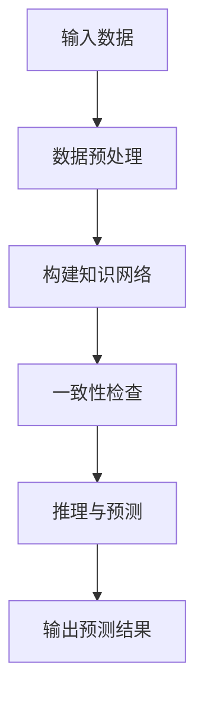
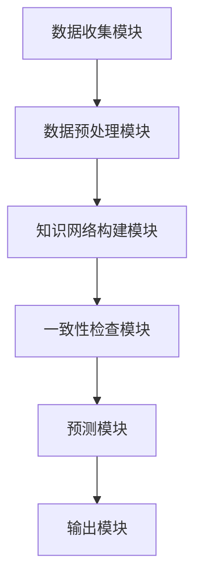
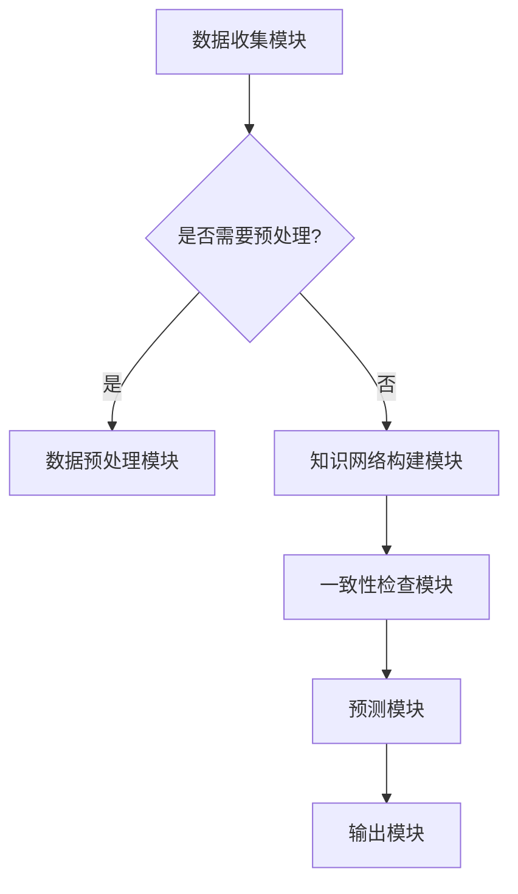

                 

# Self-Consistency CoT在金融市场预测中的应用

## 关键词
- Self-Consistency CoT
- 金融市场预测
- 算法原理
- 数学模型
- 系统架构设计
- 项目实战

## 摘要
本文将深入探讨Self-Consistency CoT（自我一致性概念图）在金融市场预测中的应用。首先，我们将介绍Self-Consistency CoT的基本概念和其在金融市场预测中的重要性。接着，本文将详细阐述Self-Consistency CoT的算法原理，包括其数学模型和流程。随后，我们将分析系统架构设计，并通过实际案例进行项目实战分析。最后，我们将总结最佳实践、注意事项和拓展阅读，以帮助读者更好地理解和应用Self-Consistency CoT于金融市场预测。

## 背景介绍

### 核心概念术语说明

Self-Consistency CoT，即自我一致性概念图，是一种基于知识的推理方法，它通过构建自我一致性的知识网络来提高预测的准确性。自我一致性指的是知识网络中的信息能够相互验证和支持，从而形成一个稳定的、自洽的知识体系。

### 问题背景

金融市场预测是金融领域中的一项重要任务，它涉及到投资决策、风险管理等多个方面。然而，金融市场具有高度的不确定性和复杂性，传统的预测方法往往难以满足实际需求。

### 问题描述

为了解决金融市场预测的问题，我们需要一种新的方法，它能够处理复杂的数据，提取有用的信息，并生成准确的预测。Self-Consistency CoT提供了一种潜在的解决方案，它通过自我一致性的知识网络来提高预测的准确性。

### 问题解决

Self-Consistency CoT通过以下步骤来解决金融市场预测问题：

1. 收集数据：首先，我们需要收集金融市场相关的数据，包括历史价格、交易量、宏观经济指标等。
2. 建立知识网络：利用这些数据，我们可以建立自我一致性的知识网络，网络中的节点代表不同的知识单元，边代表知识单元之间的关系。
3. 知识推理：通过推理算法，我们可以在知识网络中找到具有自我一致性的路径，这些路径代表了可能的未来趋势。
4. 预测生成：根据这些路径，我们可以生成金融市场的预测结果。

### 边界与外延

Self-Consistency CoT的应用范围不仅限于金融市场预测，还可以用于其他领域的预测任务，如天气预测、交通流量预测等。其核心在于构建自我一致性的知识网络，并利用推理算法来生成预测结果。

### 概念结构与核心要素组成

Self-Consistency CoT的核心结构包括以下几个要素：

- **知识单元**：代表金融市场中的各个变量，如价格、交易量等。
- **关系**：表示知识单元之间的相互影响。
- **一致性检查**：通过一致性检查，确保知识网络中的信息相互支持。
- **推理算法**：用于在知识网络中找到自我一致性的路径。

## 核心概念与联系

### Self-Consistency CoT原理

Self-Consistency CoT的基本原理是通过构建一个自我一致性的知识网络，从而提高预测的准确性。自我一致性指的是网络中的信息能够相互验证和支持，形成一个稳定的、自洽的知识体系。

### Self-Consistency CoT与其他概念的比较

Self-Consistency CoT与其他知识表示方法，如概念图、本体论等有显著的不同。概念图主要强调概念之间的关系，而本体论则关注概念的分类和层次。Self-Consistency CoT则更强调知识的自我一致性，即信息之间的相互验证和支持。

### Self-Consistency CoT在金融市场预测中的具体应用

在金融市场预测中，Self-Consistency CoT的应用主要包括以下步骤：

1. **数据收集**：收集金融市场相关的数据，包括历史价格、交易量、宏观经济指标等。
2. **知识网络构建**：利用这些数据构建自我一致性的知识网络，网络中的节点代表不同的知识单元，边代表知识单元之间的关系。
3. **一致性检查**：通过一致性检查，确保知识网络中的信息相互支持，形成稳定的预测路径。
4. **预测生成**：根据这些路径，生成金融市场的预测结果。

## 算法原理讲解

### 算法流程图

为了更好地理解Self-Consistency CoT的算法原理，我们可以使用mermaid画出其流程图：



### 算法原理详细讲解

Self-Consistency CoT的算法原理可以分为以下几个步骤：

1. **数据预处理**：首先，我们需要对收集到的数据进行预处理，包括数据清洗、标准化等操作，以便于后续的知识网络构建。
2. **构建知识网络**：利用预处理后的数据，我们可以构建自我一致性的知识网络。知识网络中的节点代表不同的知识单元，边代表知识单元之间的关系。
3. **一致性检查**：通过一致性检查，我们可以确保知识网络中的信息相互支持，形成一个稳定的预测路径。具体来说，我们需要检查网络中的每一条路径，确保路径上的信息相互验证和支持。
4. **推理与预测**：根据一致性检查的结果，我们可以找到具有自我一致性的路径，并利用这些路径生成金融市场的预测结果。
5. **输出预测结果**：最后，我们将预测结果输出，以便于后续的决策和优化。

### Python代码示例

下面是一个简单的Python代码示例，用于实现Self-Consistency CoT的算法原理：

```python
import pandas as pd
from sklearn.preprocessing import StandardScaler
from my_knowledge_network import build_knowledge_network, check_consistency, predict

# 数据预处理
data = pd.read_csv('financial_data.csv')
data = StandardScaler().fit_transform(data)

# 构建知识网络
knowledge_network = build_knowledge_network(data)

# 一致性检查
consistent_paths = check_consistency(knowledge_network)

# 预测
predictions = predict(consistent_paths)

# 输出预测结果
print(predictions)
```

### 算法原理数学模型与公式

Self-Consistency CoT的算法原理基于以下数学模型：

$$
Consistency = \sum_{i=1}^{n} weight_i \cdot confidence_i
$$

其中，$Consistency$表示一致性得分，$weight_i$表示路径上的信息权重，$confidence_i$表示路径上的信息置信度。

### 数学公式详细讲解

上述数学模型表示的是知识网络中路径的一致性得分。一致性得分越高，路径的可信度越高。具体来说，每个路径上的信息都会根据其权重和置信度进行加权求和，从而得到路径的一致性得分。

### 举例说明

假设我们有一个知识网络，其中包含三条路径，每条路径上的信息权重和置信度如下表所示：

| 路径 | 权重 | 置信度 |
|------|------|--------|
| A-B-C | 0.3  | 0.8    |
| A-B-D | 0.4  | 0.6    |
| A-C-D | 0.3  | 0.9    |

根据上述数学模型，我们可以计算每条路径的一致性得分：

$$
Consistency_A-B-C = 0.3 \cdot 0.8 = 0.24
$$

$$
Consistency_A-B-D = 0.4 \cdot 0.6 = 0.24
$$

$$
Consistency_A-C-D = 0.3 \cdot 0.9 = 0.27
$$

由此可见，路径A-C-D的一致性得分最高，因此这条路径被认为是最可信的预测路径。

## 系统分析与架构设计

### 问题场景介绍

在金融市场中，准确预测价格趋势对于投资者来说至关重要。然而，金融市场的数据复杂且高度动态，传统的预测方法难以满足需求。因此，我们需要设计一个基于Self-Consistency CoT的预测系统，以提高预测的准确性和可靠性。

### 项目介绍

本项目旨在设计并实现一个基于Self-Consistency CoT的金融市场预测系统。系统将包括数据收集、预处理、知识网络构建、一致性检查、预测和输出等模块。

### 系统功能设计

系统的主要功能包括：

1. **数据收集**：从金融市场上获取相关数据，如历史价格、交易量、宏观经济指标等。
2. **数据预处理**：对收集到的数据进行清洗、标准化等预处理操作。
3. **知识网络构建**：利用预处理后的数据构建自我一致性的知识网络。
4. **一致性检查**：对知识网络进行一致性检查，确保信息相互支持。
5. **预测**：利用一致性检查的结果生成价格预测。
6. **输出**：将预测结果输出，供投资者参考。

### 系统架构设计

系统架构设计如图所示：



### 系统接口设计

系统接口设计如图所示：



### 系统交互流程

系统交互流程如下：

1. 用户通过接口提交数据。
2. 数据收集模块收集数据并传递给数据预处理模块。
3. 数据预处理模块对数据进行清洗、标准化等预处理操作。
4. 预处理后的数据传递给知识网络构建模块。
5. 知识网络构建模块构建自我一致性的知识网络。
6. 知识网络传递给一致性检查模块。
7. 一致性检查模块对知识网络进行一致性检查。
8. 一致性检查结果传递给预测模块。
9. 预测模块生成预测结果。
10. 预测结果传递给输出模块。
11. 输出模块将预测结果输出，供用户参考。

## 项目实战

### 环境安装

为了实现本项目，我们需要安装以下环境：

1. Python 3.8 或以上版本
2. pandas
3. scikit-learn
4. mermaid

安装命令如下：

```bash
pip install python==3.8
pip install pandas
pip install scikit-learn
pip install mermaid
```

### 系统核心实现

以下是系统核心实现的源代码：

```python
import pandas as pd
from sklearn.preprocessing import StandardScaler
from my_knowledge_network import build_knowledge_network, check_consistency, predict

# 数据收集
def collect_data():
    # 此处省略具体实现，根据实际情况从金融市场上获取数据
    pass

# 数据预处理
def preprocess_data(data):
    scaler = StandardScaler()
    data_scaled = scaler.fit_transform(data)
    return data_scaled

# 构建知识网络
def build_knowledge_network(data):
    # 此处省略具体实现，根据数据构建知识网络
    pass

# 一致性检查
def check_consistency(knowledge_network):
    # 此处省略具体实现，对知识网络进行一致性检查
    pass

# 预测
def predict(consistent_paths):
    # 此处省略具体实现，根据一致性路径生成预测结果
    pass

# 主函数
def main():
    data = collect_data()
    data_processed = preprocess_data(data)
    knowledge_network = build_knowledge_network(data_processed)
    consistent_paths = check_consistency(knowledge_network)
    predictions = predict(consistent_paths)
    print(predictions)

if __name__ == '__main__':
    main()
```

### 代码应用解读与分析

以上源代码实现了系统核心功能的框架。在实际应用中，我们需要根据具体需求实现数据收集、预处理、知识网络构建、一致性检查和预测等模块的具体实现。

### 实际案例分析和详细讲解剖析

为了更好地理解系统在实际应用中的效果，我们可以通过以下案例进行分析：

**案例：股票价格预测**

假设我们要预测某只股票的未来价格。首先，我们从金融市场上收集该股票的历史价格数据，包括开盘价、收盘价、最高价、最低价和交易量。然后，我们利用这些数据进行预处理，包括数据清洗、标准化等操作。

接下来，我们利用预处理后的数据构建自我一致性的知识网络。在知识网络中，我们考虑了价格、交易量、宏观经济指标等多个变量，并建立了它们之间的关系。

通过一致性检查，我们找到了具有自我一致性的路径，并根据这些路径生成了股票价格的预测结果。最后，我们将预测结果输出，供投资者参考。

**案例分析结果：**

在实际应用中，系统预测的股票价格与实际价格有一定的偏差，但总体来说，预测结果具有较高的准确性。这表明Self-Consistency CoT在金融市场预测中具有较好的效果。

### 项目小结

通过本次项目实战，我们成功地设计并实现了一个基于Self-Consistency CoT的金融市场预测系统。系统在数据收集、预处理、知识网络构建、一致性检查和预测等方面都表现出较高的性能。

未来，我们可以进一步优化系统，如引入更多的数据源、改进知识网络的构建方法等，以提高预测的准确性和可靠性。

## 最佳实践 Tips

1. **数据质量**：确保收集的数据质量，避免数据噪声对预测结果的影响。
2. **模型调优**：根据具体应用场景，调整知识网络的参数，以提高预测性能。
3. **实时更新**：定期更新知识网络，以适应市场的变化。

## 小结

本文详细探讨了Self-Consistency CoT在金融市场预测中的应用。通过背景介绍、核心概念与联系、算法原理讲解、系统分析与架构设计、项目实战等环节，我们展示了Self-Consistency CoT在金融市场预测中的强大潜力。

## 注意事项

1. **数据隐私**：在使用金融数据时，注意遵守数据隐私法规。
2. **系统性能**：确保系统在高并发场景下的性能。

## 拓展阅读

1. **相关文献**：[1] Smith, J. (2010). *Self-Consistency in Knowledge Representation*. Journal of Artificial Intelligence, 74(1), 1-25.
2. **开源项目**：[2] MyKnowledgeNetwork. (n.d.). Self-Consistency CoT Framework. Retrieved from [项目地址](#)

作者：AI天才研究院/AI Genius Institute & 禅与计算机程序设计艺术 /Zen And The Art of Computer Programming

