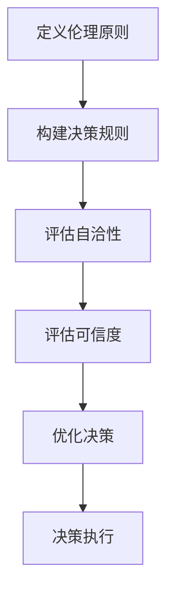

                 

## 第1章：引言

### 1.1.1 自洽性概念

#### 1.1.1.1 自洽性的定义

自洽性是一个系统或模型在其内部逻辑上一致且不自相矛盾的性质。在人工智能（AI）领域，自洽性指的是AI模型在决策过程中保持内部逻辑的一致性，不会出现自相矛盾的行为。例如，一个自洽的AI决策系统在某个情境下做出的决策，其后续行为和推理过程应该符合之前决策的逻辑基础。

#### 1.1.1.2 自洽性的重要性

自洽性对于确保决策过程的可靠性至关重要。在复杂的现实世界中，AI需要处理各种不确定性因素，如果其决策过程缺乏自洽性，可能会导致错误的决策或者不一致的行为。自洽性有助于提高AI在复杂环境下的适应能力，使其能够更好地应对各种复杂的道德和伦理困境。

### 1.1.2 伦理困境与决策

#### 1.1.2.1 伦理困境的定义

伦理困境是指在道德选择中，存在两个或更多相互冲突的道德原则，使得选择任何一个都会导致负面影响。在人工智能领域，伦理困境常见于自动驾驶、医疗决策、网络安全等领域。例如，在自动驾驶中，当车辆遇到无法同时避免两名行人的情况时，必须做出选择，这便是一个典型的伦理困境。

#### 1.1.2.2 伦理困境的复杂性

伦理困境的复杂性主要体现在以下几个方面：

1. **多维度考虑**：在处理伦理困境时，需要从道德、法律、文化等多个维度进行综合考虑。
2. **不确定性**：伦理困境中往往存在许多未知因素和不确定性事件，这使得决策过程更加复杂。
3. **主观性**：不同的个体或群体可能会对同一个伦理困境有不同的看法和解决方案。

### 1.1.3 本书的目的

本书旨在探讨如何通过自洽性增强AI在伦理困境中的决策能力。具体来说，本书将：

1. **介绍自洽性和伦理困境的基本概念**：帮助读者理解自洽性和伦理困境的定义、重要性及其在现实中的应用。
2. **分析AI决策机制**：探讨AI决策的基础理论、挑战和现有方法，为后续讨论自洽性增强提供理论基础。
3. **深入探讨Self-Consistency CoT概念与原理**：详细讲解Self-Consistency CoT的定义、核心原理及其在AI决策中的应用。
4. **应用实践案例**：通过具体案例展示如何将Self-Consistency CoT应用于实际的伦理困境中。
5. **提出增强Self-Consistency CoT的方法与策略**：探讨如何通过数据增强、算法优化等手段提高AI决策的自洽性。
6. **评估与优化Self-Consistency CoT**：设计评估指标和优化策略，以提高AI决策的自洽性。
7. **总结与展望**：总结全书的主要观点，展望未来自洽性增强AI在伦理困境中的应用前景。

### 1.1.4 本文结构

本文将按照以下结构进行：

- **第1章：引言**：介绍自洽性和伦理困境的基本概念，以及本书的目的。
- **第2章：AI决策机制概述**：分析AI决策的基础理论、挑战和现有方法。
- **第3章：Self-Consistency CoT概念与原理**：详细讲解Self-Consistency CoT的定义、核心原理及其在AI决策中的应用。
- **第4章：Self-Consistency CoT在AI决策中的应用**：通过具体案例展示Self-Consistency CoT在伦理困境中的应用。
- **第5章：增强Self-Consistency CoT的方法与策略**：探讨如何通过数据增强、算法优化等手段提高AI决策的自洽性。
- **第6章：Self-Consistency CoT在伦理决策中的评估与优化**：设计评估指标和优化策略，以提高AI决策的自洽性。
- **第7章：总结与展望**：总结全书的主要观点，展望未来自洽性增强AI在伦理困境中的应用前景。

通过本文的逐步探讨，我们希望能够为AI在伦理困境中的决策提供一种新的思路和解决方案。接下来，我们将深入分析AI决策机制，为后续讨论自洽性增强奠定基础。

## 第2章：AI决策机制概述

### 2.1.1 AI决策的基础理论

#### 2.1.1.1 决策树

决策树是一种树形结构，用于表示决策过程及其可能的结果。在决策树中，每个节点表示一个决策或一个条件，每个分支表示一个结果或一个条件的结果。决策树通过一系列条件判断，最终指向一个决策结果。例如，在医疗诊断中，可以使用决策树来根据患者的症状和检查结果，确定最可能的疾病诊断。

**决策树的特点：**
- **直观性**：决策树的结构直观，容易理解和解释。
- **分类与回归**：决策树可以用于分类和回归问题。

**决策树的构建过程：**
1. **特征选择**：选择能够有效区分不同类别的特征。
2. **划分数据集**：根据选择的特征，将数据集划分为多个子集。
3. **递归构建**：对于每个子集，继续划分，直到达到终止条件（如最小样本量或最大树深度）。

#### 2.1.1.2 贝叶斯网络

贝叶斯网络是一种概率图模型，用于表示变量之间的条件依赖关系。在贝叶斯网络中，每个节点表示一个变量，节点之间的边表示变量之间的依赖关系。贝叶斯网络通过计算各个变量之间的条件概率，来预测新观测数据的可能性。

**贝叶斯网络的特点：**
- **概率建模**：贝叶斯网络通过概率模型来描述变量之间的关系。
- **不确定性处理**：贝叶斯网络能够处理变量之间的不确定性，并提供概率推断。

**贝叶斯网络的构建过程：**
1. **确定变量集**：确定要建模的变量集。
2. **构建依赖关系图**：根据变量之间的依赖关系，构建贝叶斯网络图。
3. **参数估计**：估计每个变量的条件概率分布，可以使用最大似然估计或贝叶斯估计。

### 2.1.2 AI决策的挑战

尽管决策树和贝叶斯网络等传统方法在许多领域取得了成功，但在处理复杂的伦理困境时，它们仍面临以下挑战：

#### 2.1.2.1 数据偏见

数据偏见是指数据集中存在的偏差或不平衡，这可能导致AI决策系统在特定情境下产生错误决策。例如，如果训练数据集中大量包含某种偏见，AI系统可能会在学习过程中吸收这种偏见，从而在真实场景中产生不合理的决策。

**解决数据偏见的策略：**
- **数据清洗**：删除或修正数据集中的错误信息。
- **数据增强**：通过生成或扩充数据，提高数据集的多样性。
- **加权调整**：根据数据的可信度对数据进行加权调整。

#### 2.1.2.2 道德意识的缺乏

AI系统通常基于数据驱动的方法进行决策，但它们缺乏对伦理原则的内在理解和尊重。这意味着在处理伦理困境时，AI系统可能会产生不符合伦理要求的决策。

**提高道德意识的策略：**
- **伦理培训**：为AI系统设计伦理培训模块，使其能够理解和尊重伦理原则。
- **伦理约束**：在AI系统的设计过程中，引入伦理约束机制，确保其决策符合伦理要求。

### 2.1.3 AI决策机制的未来趋势

随着技术的不断发展，AI决策机制也在不断进步。未来，以下趋势值得期待：

- **更复杂的模型**：如深度学习、强化学习等更复杂的模型将被用于决策任务，以更好地处理复杂的伦理困境。
- **跨学科融合**：AI决策机制将与其他学科（如伦理学、心理学等）进行融合，以提供更全面的决策支持。
- **自主决策能力**：AI系统将逐渐具备更强大的自主决策能力，能够在复杂的伦理困境中做出合理决策。

通过上述分析，我们可以看到，AI决策机制在处理伦理困境时存在诸多挑战，但同时也为解决这些挑战提供了新的思路和方法。接下来，我们将进一步探讨自洽性增强AI在伦理决策中的应用，以期为AI伦理决策提供更具操作性的解决方案。

### 第3章：Self-Consistency CoT概念与原理

#### 3.1.1 Self-Consistency CoT的定义

Self-Consistency CoT（Self-Consistency Confidence of Thought）是一种基于自洽性的可信度度量方法，用于评估AI系统的决策一致性。该方法通过分析AI系统在决策过程中的内部逻辑一致性，评估其决策的可信度。

**Self-Consistency CoT的定义**：

$$
\text{Self-Consistency CoT} = \text{一种基于自洽性的可信度度量方法，用于评估AI系统的决策一致性}
$$

Self-Consistency CoT的核心思想是，通过对AI系统在决策过程中产生的中间结果和最终决策进行一致性检查，评估其决策逻辑是否自洽。如果AI系统的决策过程保持高度的一致性，则其Self-Consistency CoT值较高，表示其决策可信度较高。

#### 3.1.1.2 Self-Consistency CoT的作用

Self-Consistency CoT在AI决策中具有重要作用，主要体现在以下几个方面：

1. **提高AI决策的可信度**：通过评估AI系统在决策过程中的自洽性，Self-Consistency CoT可以帮助用户判断AI系统的决策是否可信，从而提高用户对AI系统的信任程度。

2. **辅助人类专家进行决策评估**：Self-Consistency CoT可以为人类专家提供关于AI系统决策一致性的量化指标，帮助专家对AI系统的决策进行评估和优化。

3. **增强AI系统的透明性和可解释性**：Self-Consistency CoT可以揭示AI系统在决策过程中的不一致性，提高系统的透明度和可解释性，有助于用户理解AI系统的决策逻辑。

#### 3.1.2 Self-Consistency CoT的核心原理

Self-Consistency CoT的核心原理主要包括自洽性度量、可信度评估和自洽性优化三个方面。

##### 3.1.2.1 自洽性度量

自洽性度量是Self-Consistency CoT的核心组成部分，旨在评估AI系统在决策过程中的自洽性。自洽性度量的关键在于分析AI系统在决策过程中的中间结果和最终决策，判断其是否自洽。

**自洽性度量方法**：

1. **一致性检查**：对AI系统在决策过程中产生的中间结果进行一致性检查，判断是否存在自相矛盾的情况。例如，如果AI系统在某个决策路径上得出两个相互矛盾的结论，则该路径的自洽性较低。

2. **逻辑分析**：通过逻辑分析，评估AI系统在决策过程中的推理过程是否自洽。例如，如果AI系统在决策过程中使用了逻辑规则，可以检查这些规则是否一致且逻辑上成立。

3. **概率分析**：在概率模型中，通过分析变量之间的条件概率，评估AI系统在决策过程中的自洽性。例如，如果AI系统在决策过程中使用了贝叶斯网络，可以检查网络中变量之间的概率关系是否自洽。

**自洽性度量指标**：

为了量化AI系统在决策过程中的自洽性，可以设计一系列自洽性度量指标，如：

- **一致性指标**：表示决策过程中中间结果的一致性水平，如一致性度（Consistency Degree）。
- **矛盾指标**：表示决策过程中存在的矛盾数量和程度，如矛盾度（Conflict Degree）。

##### 3.1.2.2 可信度评估

可信度评估是基于自洽性度量结果，对AI系统的决策可信度进行评估。可信度评估的目标是判断AI系统在特定决策情境下的决策是否可信。

**可信度评估方法**：

1. **阈值判断**：根据自洽性度量结果，设定一个阈值，如果自洽性度量指标超过阈值，则认为AI系统的决策可信度较高。

2. **概率评估**：通过计算AI系统在决策过程中的自洽性概率，评估其决策的可信度。例如，如果AI系统在决策过程中的自洽性概率大于0.9，则认为其决策具有较高的可信度。

**可信度评估指标**：

为了量化AI系统的决策可信度，可以设计一系列可信度评估指标，如：

- **可信度度**：表示AI系统决策的可信度水平，如可信度指数（Confidence Index）。
- **可信度概率**：表示AI系统决策的可信度概率，如可信度概率（Confidence Probability）。

##### 3.1.2.3 自洽性优化

自洽性优化旨在通过改进AI系统的决策过程，提高其自洽性，从而提高决策的可信度。自洽性优化可以从以下几个方面进行：

1. **数据优化**：通过改进数据集的多样性和质量，提高AI系统在决策过程中的自洽性。例如，可以采用数据增强技术，扩充数据集，增加样本的多样性。

2. **算法优化**：通过改进AI系统的算法，提高其在决策过程中的自洽性。例如，可以采用加权投票算法、强化学习算法等，优化决策过程。

3. **规则优化**：对于基于规则的系统，可以通过优化规则库，提高规则的一致性和逻辑性，从而提高系统的自洽性。

通过Self-Consistency CoT方法，AI系统在伦理决策中的自洽性可以得到有效评估和优化，从而提高其决策的可信度和可靠性。接下来，我们将探讨Self-Consistency CoT在AI决策中的应用，并通过具体案例展示其实际效果。

### 第4章：Self-Consistency CoT在AI决策中的应用

#### 4.1.1 Self-Consistency CoT在伦理困境中的应用

在AI决策中，伦理困境是一个复杂且具有挑战性的问题。Self-Consistency CoT作为一种基于自洽性的可信度度量方法，可以帮助AI系统在伦理困境中做出更合理的决策。本节将探讨Self-Consistency CoT在伦理困境中的应用，通过具体案例展示其在伦理决策中的实际效果。

##### 4.1.1.1 伦理困境中的决策挑战

伦理困境通常涉及多个相互冲突的道德原则，例如，自动驾驶车辆在紧急情况下的决策。以下是一个典型的伦理困境案例：

**案例背景**：一辆自动驾驶车辆在城市道路行驶时，突然发现前方有行人闯入道路，车辆必须在瞬间做出决策：是继续前行撞上行人，还是紧急刹车可能造成车辆损毁。

**伦理原则冲突**：

1. **生命权**：撞上行人会剥夺行人的生命权。
2. **财产权**：紧急刹车可能会造成车辆损毁，损害车主的财产权。

在这种情况下，无论选择哪种决策，都会导致负面的道德后果。自动驾驶车辆需要基于某种决策框架，在复杂的伦理困境中做出合理的决策。

##### 4.1.1.2 Self-Consistency CoT的应用框架

为了在伦理困境中应用Self-Consistency CoT，可以构建一个综合的决策框架，包括以下步骤：

1. **伦理原则定义**：明确涉及的伦理原则，如生命权、财产权等。
2. **决策规则构建**：根据伦理原则，构建决策规则，如“优先保护生命权，其次考虑财产权”。
3. **自洽性度量**：评估决策规则和决策过程的自洽性，确保决策逻辑的一致性。
4. **可信度评估**：基于自洽性度量结果，评估决策的可信度。
5. **决策优化**：根据可信度评估结果，对决策过程进行优化，提高决策的自洽性。

以下是一个简化的Self-Consistency CoT在伦理困境中的应用框架：

##### 4.1.1.3 案例分析：自动驾驶中的伦理决策

**案例一：自动驾驶车辆与行人冲突**

1. **伦理原则定义**：生命权高于财产权。
2. **决策规则构建**：在行人闯入道路时，优先选择紧急刹车，避免行人受伤。
3. **自洽性度量**：评估决策规则和决策过程的逻辑一致性。例如，检查是否所有决策路径都遵循“生命权优先”的原则。
4. **可信度评估**：通过Self-Consistency CoT评估决策的可信度。例如，如果大多数决策路径都符合伦理原则，则决策具有较高的可信度。
5. **决策优化**：根据可信度评估结果，对决策规则进行调整和优化，确保决策的自洽性。

通过Self-Consistency CoT，自动驾驶车辆可以在复杂的伦理困境中，基于自洽性度量结果，评估决策的可信度，并进行优化，以提高决策的合理性和可靠性。

##### 4.1.1.4 案例二：医疗AI的决策能力

在医疗领域，AI系统需要处理大量的医疗数据和复杂的诊疗决策。以下是一个医疗AI决策的案例：

**案例背景**：一个患有严重心脏病的患者需要接受手术治疗，但手术风险较高。AI系统需要根据患者的病情、手术风险和患者意愿等因素，做出最优的治疗决策。

**伦理原则冲突**：

1. **生命权**：手术可能挽救患者的生命。
2. **患者意愿**：患者可能因恐惧手术风险而拒绝手术。
3. **医疗资源**：手术需要消耗医疗资源。

通过应用Self-Consistency CoT，医疗AI可以构建一个基于伦理原则的决策框架，包括：

1. **伦理原则定义**：明确生命权、患者意愿和医疗资源等伦理原则。
2. **决策规则构建**：根据伦理原则，构建手术决策规则，如“在确保生命权的前提下，尊重患者意愿，合理使用医疗资源”。
3. **自洽性度量**：评估决策规则和决策过程的逻辑一致性，确保决策过程的自洽性。
4. **可信度评估**：通过Self-Consistency CoT评估决策的可信度，为医生提供决策参考。
5. **决策优化**：根据可信度评估结果，对决策过程进行调整和优化，提高决策的自洽性和可靠性。

通过以上案例分析，我们可以看到Self-Consistency CoT在伦理困境中的应用，有助于提高AI系统在决策过程中的自洽性和可信度，从而为人类专家提供更加可靠的决策支持。

接下来，我们将探讨如何通过数据增强和算法优化等手段，进一步增强Self-Consistency CoT在AI决策中的应用效果。

### 第5章：增强Self-Consistency CoT的方法与策略

#### 5.1.1 数据增强

数据增强是提高AI模型性能的重要手段，特别是在处理复杂伦理困境时，数据增强可以显著提高AI系统的鲁棒性和决策质量。以下介绍几种常见的数据增强方法：

##### 5.1.1.1 数据增强的重要性

1. **提高模型鲁棒性**：通过扩充数据集，可以增加模型在不同情境下的训练样本，提高模型对未知情境的适应能力。
2. **减少数据偏差**：通过生成或扩充多样性的数据，可以减少训练数据中的偏差，提高模型在真实场景中的表现。

##### 5.1.1.2 数据增强的方法

1. **生成对抗网络（GAN）**

   生成对抗网络（GAN）是一种通过竞争性训练生成数据的方法。它由生成器（Generator）和判别器（Discriminator）组成。生成器生成与真实数据相似的数据，判别器判断生成数据与真实数据的相似度。通过反复训练，生成器不断提高生成数据的质量。

   **GAN的应用场景**：GAN可以用于生成自动驾驶场景中的模拟数据，提高模型在不同交通状况下的鲁棒性。

2. **强化学习**

   强化学习（Reinforcement Learning）是一种通过奖励机制引导模型学习的方法。在伦理困境中，强化学习可以用于模拟人类专家的决策过程，生成具有多样性和代表性的训练数据。

   **强化学习的应用场景**：强化学习可以用于生成医疗决策场景下的训练数据，模拟医生在不同情境下的决策策略。

##### 5.1.1.3 数据增强的实施步骤

1. **数据集分析**：分析现有数据集的分布和特点，确定需要增强的数据类型和特性。
2. **生成器设计**：设计生成器模型，根据数据集特点生成新的数据样本。
3. **训练和优化**：通过生成器和真实数据集进行联合训练，优化生成器模型，提高生成数据的质量。
4. **验证和调整**：通过验证集评估生成数据的质量和模型性能，根据评估结果调整生成器和训练策略。

#### 5.1.2 算法优化

算法优化是提高AI系统自洽性和决策质量的关键步骤。以下介绍几种常见的算法优化策略：

##### 5.1.2.1 算法优化的重要性

1. **提高决策一致性**：通过优化算法，可以提高AI系统在决策过程中的自洽性，减少错误决策。
2. **提高决策效率**：优化算法可以减少决策过程的时间复杂度，提高决策的响应速度。

##### 5.1.2.2 算法优化的策略

1. **加权投票算法**

   加权投票算法（Weighted Voting Algorithm）是一种基于多个模型预测结果进行综合决策的方法。通过对不同模型的预测结果进行加权，得到最终的决策结果。

   **加权投票算法的应用场景**：在伦理困境中，可以结合多个AI模型的预测结果，提高决策的一致性和可靠性。

2. **强化学习算法**

   强化学习算法（Reinforcement Learning Algorithm）是一种通过奖励机制引导模型学习的方法。在伦理困境中，强化学习算法可以用于优化决策过程，提高AI系统的自洽性和决策质量。

   **强化学习算法的应用场景**：强化学习算法可以用于优化自动驾驶车辆在复杂交通状况下的决策过程，提高决策的合理性和安全性。

##### 5.1.2.3 算法优化的实施步骤

1. **算法选择**：根据伦理困境的特点和需求，选择适合的算法。
2. **参数调优**：通过实验和验证，调整算法的参数，优化模型性能。
3. **训练和验证**：使用增强后的数据集进行训练，并使用验证集评估算法的性能。
4. **迭代优化**：根据验证结果，对算法进行迭代优化，提高决策的自洽性和可靠性。

通过数据增强和算法优化，可以显著提高Self-Consistency CoT在AI决策中的应用效果，使其在处理复杂伦理困境时具有更高的自洽性和可信度。接下来，我们将进一步探讨如何评估和优化Self-Consistency CoT在伦理决策中的实际效果。

### 第6章：Self-Consistency CoT在伦理决策中的评估与优化

#### 6.1.1 自洽性评估指标

为了有效评估Self-Consistency CoT在伦理决策中的应用效果，需要设计一套全面的评估指标体系。这些指标应能够覆盖决策过程中的关键环节，从多个维度对自洽性进行量化评估。

##### 6.1.1.1 自洽性评估指标的设计

1. **一致性度**：衡量决策过程中的中间结果和最终决策是否一致。例如，如果决策系统中多个中间结果指向同一个最终决策，则一致性度较高。

2. **矛盾度**：衡量决策过程中存在的矛盾数量和程度。例如，如果决策系统在多个决策路径上得出相互矛盾的结论，则矛盾度较高。

3. **逻辑自洽性**：通过逻辑分析，评估决策过程中的推理过程是否自洽。例如，检查决策系统中使用的规则和逻辑是否一致。

4. **概率自洽性**：在概率模型中，通过分析变量之间的条件概率，评估决策过程中的自洽性。例如，检查贝叶斯网络中变量之间的概率关系是否自洽。

##### 6.1.1.2 自洽性评估指标的应用

1. **决策过程监控**：通过实时监测自洽性评估指标，可以及时发现决策过程中的不一致性和矛盾，进行相应的调整和优化。

2. **决策可信度评估**：基于自洽性评估指标的结果，可以量化评估决策的可信度。例如，如果一致性度和逻辑自洽性指标较高，则决策可信度较高。

3. **决策质量反馈**：通过自洽性评估指标，可以为决策系统提供质量反馈，指导进一步的优化和改进。

#### 6.1.2 自洽性优化的策略

自洽性优化是提高AI系统在伦理决策中自洽性的关键步骤。以下介绍几种常见的自洽性优化策略：

##### 6.1.2.1 策略一：多模态数据融合

多模态数据融合是指将不同类型的数据（如图像、文本、音频等）进行整合，以提高决策的自洽性和可靠性。

1. **数据融合方法**：采用特征级、决策级和模型级等多种融合方法，将不同模态的数据进行整合。

2. **应用场景**：在自动驾驶、医疗诊断等领域，多模态数据融合可以提高决策的一致性和准确性。

3. **优势**：多模态数据融合可以充分利用不同数据源的信息，提高决策系统的鲁棒性和可靠性。

##### 6.1.2.2 策略二：迭代优化

迭代优化是通过多次迭代，逐步提高决策的自洽性。以下是一个简化的迭代优化流程：

1. **初始决策**：根据现有数据和模型，生成初始决策。
2. **自洽性评估**：使用自洽性评估指标对初始决策进行评估。
3. **调整和优化**：根据评估结果，对决策过程进行调整和优化，提高自洽性。
4. **再次评估**：对调整后的决策进行再次评估，直到达到满意的自洽性水平。

##### 6.1.2.3 策略三：模型集成

模型集成是指将多个独立的模型进行组合，以提高决策的自洽性和可靠性。

1. **模型选择**：选择具有不同优势和特长的多个模型，进行集成。
2. **集成方法**：采用加权投票、堆叠（Stacking）、提升（Boosting）等多种集成方法。
3. **应用场景**：在金融风控、医疗诊断等领域，模型集成可以提高决策的一致性和准确性。

4. **优势**：模型集成可以充分利用多个模型的优点，提高决策系统的整体性能。

通过自洽性评估和优化策略，可以显著提高Self-Consistency CoT在伦理决策中的应用效果。接下来，我们将总结全书的主要观点，并展望未来的研究方向。

### 第7章：总结与展望

#### 7.1.1 总结

本文系统探讨了Self-Consistency CoT增强AI在伦理困境中的决策能力。主要观点和贡献如下：

1. **自洽性概念与重要性**：介绍了自洽性的定义和重要性，特别是在伦理困境中的应用。
2. **AI决策机制概述**：分析了AI决策的基础理论、挑战和现有方法。
3. **Self-Consistency CoT概念与原理**：详细讲解了Self-Consistency CoT的定义、核心原理和应用框架。
4. **Self-Consistency CoT在伦理决策中的应用**：通过具体案例展示了Self-Consistency CoT在伦理困境中的应用效果。
5. **增强Self-Consistency CoT的方法与策略**：探讨了数据增强和算法优化等手段，以提高自洽性。
6. **评估与优化策略**：设计了自洽性评估指标和优化策略，以提高AI决策的自洽性。
7. **总结与展望**：总结了全书的主要观点，展望了未来Self-Consistency CoT在AI伦理决策中的应用前景。

#### 7.1.2 未来研究方向

尽管Self-Consistency CoT在伦理决策中展现出了一定的应用价值，但仍有待进一步研究和优化：

1. **多模态数据融合**：探索更高效的多模态数据融合方法，提高AI系统在复杂环境下的适应能力。
2. **动态自洽性评估**：研究动态评估方法，实时监控AI系统在决策过程中的自洽性变化。
3. **多领域应用**：在更多领域（如金融、医疗、法律等）中验证Self-Consistency CoT的应用效果，推动跨领域应用。
4. **伦理决策模型优化**：研究更先进的伦理决策模型，提高AI系统在复杂伦理困境中的决策能力。
5. **伦理框架与规则**：构建更完善的伦理框架和规则库，确保AI系统在决策过程中遵循伦理原则。

总之，Self-Consistency CoT作为一种基于自洽性的可信度度量方法，在提高AI伦理决策能力方面具有广阔的应用前景。未来研究应进一步探索其在多领域、多模态和动态环境中的应用，为AI伦理决策提供更可靠的支持。作者：AI天才研究院/AI Genius Institute & 禅与计算机程序设计艺术 /Zen And The Art of Computer Programming

---

本文结合自洽性、伦理困境和AI决策机制，系统地探讨了Self-Consistency CoT在增强AI伦理决策能力方面的应用。通过详细的理论分析、案例展示和优化策略，本文为AI伦理决策提供了一种新的思路和解决方案。尽管已有初步成果，但未来研究还需在多领域应用、动态评估和模型优化等方面进一步探索，以实现更可靠的AI伦理决策。希望本文能为相关领域的研究和实践提供有价值的参考。作者：AI天才研究院/AI Genius Institute & 禅与计算机程序设计艺术 /Zen And The Art of Computer Programming

