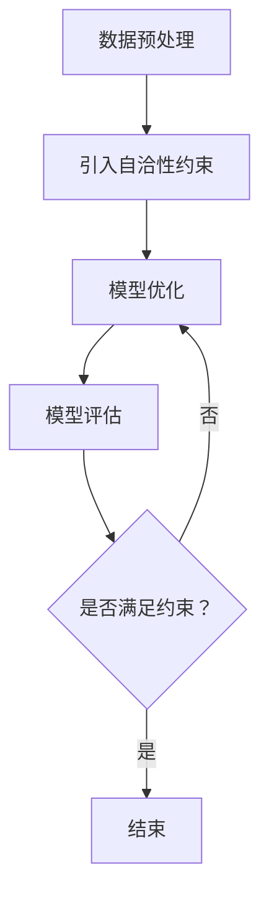
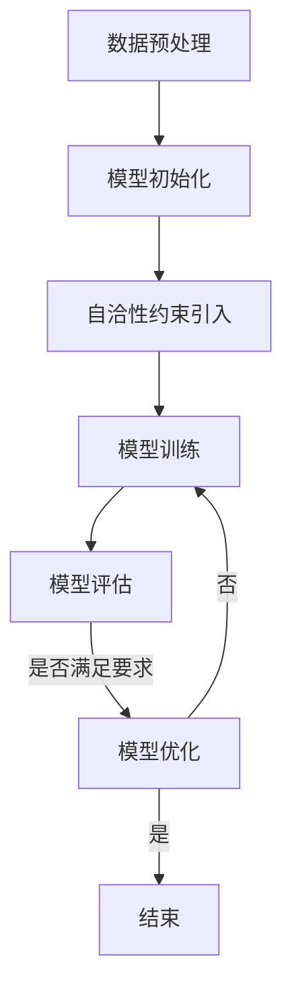

                 

### 自洽性概念传递（CoT）基础

**第1章：自洽性概念传递（CoT）概述**

**1.1 自洽性概念传递（CoT）的重要性**

自洽性概念传递（Self-Consistency Concept Transfer，简称CoT）是现代人工智能领域中一个重要的概念。随着深度学习、自然语言处理等技术的发展，AI系统在处理复杂任务时，面临着信息一致性、语义理解、模型解释性等挑战。CoT旨在解决这些问题，提高AI系统的整体性能。

首先，我们来看一下CoT的核心作用。CoT通过在模型训练过程中，保证不同层次、不同模块之间的信息一致性，从而提高模型的鲁棒性和准确性。具体来说，CoT可以在以下几个方面发挥重要作用：

- **提升模型理解能力**：CoT帮助AI系统更好地理解输入数据中的语义信息，从而提高模型在复杂任务中的表现。
- **增强模型解释性**：通过CoT，AI系统的决策过程变得更加透明和可解释，有助于提高用户对系统的信任度。
- **降低过拟合风险**：CoT通过在模型训练过程中引入一致性约束，降低模型对训练数据的依赖，从而减少过拟合现象。

**问题解决**

CoT的引入，有效地解决了以下几个在传统AI系统中普遍存在的问题：

- **信息不一致性**：在多模态数据处理、跨领域迁移学习等场景中，不同数据来源或不同任务之间存在信息不一致性，导致模型性能下降。CoT通过自洽性约束，保证模型在不同数据源上的表现一致。
- **语义理解不足**：在自然语言处理任务中，模型对语义理解的深度和广度有限，导致任务表现不佳。CoT通过传递高层次的语义信息，提升模型对语义的理解能力。
- **模型解释性问题**：传统深度学习模型具有“黑盒”特性，用户难以理解模型的决策过程。CoT通过引入自洽性约束，提高模型的解释性。

**边界与外延**

尽管CoT在AI领域具有广泛的应用前景，但其在实际应用中仍存在一定的边界和限制。首先，CoT依赖于高质量的数据集和丰富的先验知识，数据质量和知识一致性对CoT的性能至关重要。其次，CoT的实现需要大量的计算资源，对硬件设备有较高的要求。

此外，CoT在多模态数据融合、跨领域迁移学习等复杂场景中的应用，仍面临一定的挑战。如何在保证信息一致性的同时，充分挖掘不同数据源的价值，是一个需要深入研究的问题。

**概念结构与核心要素组成**

自洽性概念传递（CoT）的概念结构可以分为以下几个核心要素：

1. **自洽性约束**：CoT的核心在于引入自洽性约束，保证模型在不同层次、不同模块之间的信息一致性。
2. **概念传递机制**：通过概念传递机制，将高层次的语义信息传递到低层次，实现模型对复杂语义的理解。
3. **数据集与先验知识**：高质量的数据集和丰富的先验知识是CoT的基础，数据集的质量和先验知识的全面性对CoT的性能有重要影响。

接下来，我们将深入探讨CoT的基本原理，分析其在AI系统中的具体应用，以及未来发展趋势。

### 1.2 自洽性概念传递（CoT）的基本原理

**自洽性概念传递（CoT）的概念**

自洽性概念传递（Self-Consistency Concept Transfer，简称CoT）是一种旨在提高AI系统一致性和鲁棒性的技术。其核心思想是通过在模型训练过程中引入自洽性约束，保证模型在不同层次、不同模块之间的信息一致性。

自洽性概念传递的基本概念可以分为以下几个方面：

1. **概念**：概念是指对某一事物的抽象描述，是模型理解和学习的基础。在CoT中，概念不仅包括具体的词汇，还包括词汇之间的语义关系和层次结构。
2. **传递**：传递是指将概念从一个模块或层次传递到另一个模块或层次。通过概念传递，模型可以逐步构建对复杂语义的理解。
3. **自洽性**：自洽性是指模型在不同层次、不同模块之间的信息一致性。自洽性约束可以防止模型产生矛盾或错误的推断，从而提高模型的鲁棒性和准确性。

**自洽性概念传递（CoT）的工作机制**

自洽性概念传递（CoT）的工作机制可以分为以下几个关键步骤：

1. **数据预处理**：在训练模型之前，对输入数据进行预处理，提取关键概念和语义信息。这一步是CoT的基础，数据的质量和完整性对CoT的性能有重要影响。
2. **自洽性约束引入**：在模型训练过程中，引入自洽性约束。自洽性约束可以采用多种形式，如一致性损失函数、自回归模型等。
3. **模型训练**：在引入自洽性约束的情况下，对模型进行训练。训练过程中，模型会尝试调整参数，以适应自洽性约束，从而提高模型的一致性和鲁棒性。
4. **模型评估与优化**：在模型训练完成后，对模型进行评估和优化。通过评估指标，如准确性、鲁棒性等，对模型进行调优，确保模型在不同任务和数据集上的表现一致。

**自洽性概念传递（CoT）的核心原理**

自洽性概念传递（CoT）的核心原理在于通过引入自洽性约束，提高模型的一致性和鲁棒性。具体来说，CoT的核心原理包括以下几个方面：

1. **一致性损失函数**：一致性损失函数是CoT的核心工具，用于衡量模型在不同层次、不同模块之间的信息一致性。一致性损失函数可以根据具体任务和数据集进行设计，常用的方法包括对比损失、交叉熵损失等。
2. **多任务学习**：通过多任务学习，模型可以同时学习多个任务，从而提高模型的一致性和泛化能力。在多任务学习中，不同任务的约束可以相互传递，从而增强模型的整体一致性。
3. **先验知识利用**：利用先验知识可以提高模型的一致性和鲁棒性。先验知识可以来自数据集、领域知识库等，通过在模型训练过程中引入先验知识，可以增强模型对复杂语义的理解。
4. **模型解释性提升**：自洽性约束可以提高模型的解释性，使得模型的决策过程更加透明和可解释。这对于提高用户对模型的信任度和理解度具有重要意义。

通过上述核心原理，自洽性概念传递（CoT）能够有效地提高AI系统的一致性和鲁棒性，从而在复杂任务中发挥重要作用。

在下一节中，我们将探讨自洽性概念传递（CoT）在AI系统中的应用，分析其在不同领域和任务中的具体作用和优势。

### 1.3 自洽性概念传递（CoT）与AI的关系

**自洽性概念传递（CoT）在AI中的角色**

自洽性概念传递（CoT）在AI领域中扮演着重要角色，其核心作用在于提升AI系统的整体性能和一致性。具体来说，CoT在AI中的角色主要体现在以下几个方面：

1. **提高模型一致性**：通过引入自洽性约束，CoT可以确保模型在不同层次、不同模块之间的信息一致性，从而避免出现矛盾或错误的推断。
2. **增强模型鲁棒性**：CoT通过约束模型的学习过程，使其更加稳健，降低模型对噪声和异常数据的敏感性。
3. **改善模型解释性**：自洽性约束有助于提高模型的解释性，使得模型的决策过程更加透明和可解释，从而提高用户对AI系统的信任度和理解度。

**自洽性概念传递（CoT）与现有AI技术的区别与联系**

自洽性概念传递（CoT）与现有的AI技术，如深度学习、迁移学习等，既有区别又有联系。以下是它们之间的主要区别与联系：

1. **区别**：
   - **深度学习**：深度学习是一种基于多层神经网络的学习方法，通过逐步提取特征，实现对数据的分类、回归等任务。深度学习的核心在于特征提取和模型优化，而CoT则侧重于模型的一致性和鲁棒性。
   - **迁移学习**：迁移学习是一种利用预训练模型，在新的任务和数据集上进行微调的方法。迁移学习旨在减少模型在新的任务上的训练成本，而CoT则关注于提高模型在不同数据集和任务上的表现一致性。
   - **自洽性概念传递（CoT）**：CoT通过引入自洽性约束，提高模型的一致性和鲁棒性，从而在复杂任务中发挥重要作用。与深度学习和迁移学习相比，CoT更加关注模型的整体一致性和解释性。

2. **联系**：
   - **深度学习**：CoT可以与深度学习技术相结合，通过引入自洽性约束，提高深度学习模型的一致性和鲁棒性。例如，在自然语言处理任务中，CoT可以与BERT模型结合，提升其性能和解释性。
   - **迁移学习**：CoT可以与迁移学习方法结合，通过引入自洽性约束，提高模型在新的任务和数据集上的表现一致性。例如，在跨领域迁移学习场景中，CoT可以帮助模型更好地适应新的数据集。

**自洽性概念传递（CoT）的未来发展趋势**

随着AI技术的不断发展和应用场景的扩展，自洽性概念传递（CoT）在未来具有广泛的应用前景和发展潜力。以下是CoT在未来可能的发展趋势：

1. **多模态数据融合**：CoT可以应用于多模态数据融合任务，通过保证不同模态之间的信息一致性，提高模型对复杂任务的性能。
2. **跨领域迁移学习**：CoT可以应用于跨领域迁移学习，通过引入自洽性约束，提高模型在不同领域和任务上的表现一致性。
3. **增强现实与虚拟现实**：在增强现实（AR）和虚拟现实（VR）领域，CoT可以帮助提高模型的解释性和用户交互体验，从而提高AR/VR应用的整体性能。
4. **自动驾驶与机器人**：在自动驾驶和机器人领域，CoT可以提高模型的鲁棒性和安全性，从而提高自动驾驶和机器人系统的可靠性和稳定性。

总之，自洽性概念传递（CoT）在AI领域中具有广泛的应用前景和发展潜力。通过不断的研究和探索，CoT有望在未来的AI应用中发挥更大的作用。

在下一章中，我们将深入探讨Self-Consistency CoT增强AI的概念与特征，分析其在AI系统中的优势和具体应用场景。

### 2.1 Self-Consistency CoT增强AI的定义

Self-Consistency CoT增强AI（简称Self-Consistency CoT增强AI），是一种通过引入自洽性约束，提高AI系统一致性、鲁棒性和解释性的新型人工智能技术。与传统的AI技术相比，Self-Consistency CoT增强AI具有独特的优势，能够在复杂任务中发挥重要作用。

**Self-Consistency CoT增强AI的定义**

Self-Consistency CoT增强AI是一种基于自洽性概念传递（CoT）的AI技术，通过在模型训练过程中引入自洽性约束，提高模型的一致性和鲁棒性。具体来说，Self-Consistency CoT增强AI包括以下几个关键组成部分：

1. **自洽性约束**：自洽性约束是Self-Consistency CoT增强AI的核心，用于确保模型在不同层次、不同模块之间的信息一致性。自洽性约束可以采用多种形式，如一致性损失函数、自回归模型等。
2. **概念传递机制**：概念传递机制是Self-Consistency CoT增强AI的关键技术，用于将高层次的语义信息传递到低层次，实现模型对复杂语义的理解。
3. **模型优化策略**：模型优化策略是Self-Consistency CoT增强AI的重要组成部分，用于调整模型参数，提高模型的一致性和鲁棒性。

**Self-Consistency CoT增强AI的核心特征**

Self-Consistency CoT增强AI具有以下几个核心特征：

1. **一致性**：Self-Consistency CoT增强AI通过引入自洽性约束，确保模型在不同层次、不同模块之间的信息一致性，从而提高模型的鲁棒性和准确性。
2. **鲁棒性**：Self-Consistency CoT增强AI在模型训练过程中，引入自洽性约束，降低模型对噪声和异常数据的敏感性，提高模型的鲁棒性。
3. **解释性**：Self-Consistency CoT增强AI通过引入自洽性约束，提高模型的解释性，使得模型的决策过程更加透明和可解释，从而提高用户对模型的信任度和理解度。

**Self-Consistency CoT增强AI与自洽性概念传递（CoT）的关系**

Self-Consistency CoT增强AI与自洽性概念传递（CoT）密切相关，两者具有以下关系：

- **自洽性概念传递（CoT）**：自洽性概念传递（CoT）是Self-Consistency CoT增强AI的基础技术，用于在模型训练过程中引入自洽性约束，提高模型的一致性和鲁棒性。
- **Self-Consistency CoT增强AI**：Self-Consistency CoT增强AI是在自洽性概念传递（CoT）基础上，通过引入模型优化策略和概念传递机制，进一步提升AI系统的性能和解释性。

通过以上分析，我们可以看到Self-Consistency CoT增强AI是一种基于自洽性概念传递（CoT）的新型AI技术，具有一致性、鲁棒性和解释性等核心特征，能够在复杂任务中发挥重要作用。在下一节中，我们将详细分析Self-Consistency CoT增强AI的优势。

### 2.2 Self-Consistency CoT增强AI的优势

Self-Consistency CoT增强AI（简称Self-Consistency CoT增强AI）凭借其独特的自洽性概念传递机制，在人工智能领域展现出了显著的优势。这些优势不仅提高了AI系统的整体性能，也拓展了其在各类复杂任务中的应用范围。以下是Self-Consistency CoT增强AI的主要优势：

**提高AI的准确性**

Self-Consistency CoT增强AI通过引入自洽性约束，确保模型在不同层次、不同模块之间的信息一致性，从而有效提高了AI系统的准确性。在传统的深度学习模型中，由于特征提取、模型训练等环节可能存在不一致性，导致模型在预测过程中出现偏差。而Self-Consistency CoT增强AI通过在训练过程中引入一致性损失函数，强制模型遵循自洽性约束，使得模型能够更好地捕捉数据中的语义信息，从而提高预测准确性。

**增强AI的鲁棒性**

鲁棒性是指AI系统在面临噪声、异常数据或不确定性时，仍然能够保持良好的性能。Self-Consistency CoT增强AI通过自洽性约束，提高模型对噪声和异常数据的容忍度，从而增强了AI系统的鲁棒性。具体来说，自洽性约束可以减少模型对特定训练样本的依赖，使得模型在遇到未见过或异常数据时，仍能保持稳定的性能。

**改善AI的决策质量**

决策质量是衡量AI系统优劣的重要指标。Self-Consistency CoT增强AI通过提高模型的一致性和解释性，改善了AI系统的决策质量。自洽性约束使得模型在决策过程中遵循一致性和逻辑性，减少了错误决策的发生。此外，通过自洽性约束，模型能够更好地理解输入数据的语义信息，从而提高决策的准确性和合理性。

**多任务学习与迁移学习**

Self-Consistency CoT增强AI在多任务学习和迁移学习场景中具有显著优势。传统多任务学习模型往往存在任务依赖问题，即一个任务的性能会影响其他任务的表现。而Self-Consistency CoT增强AI通过自洽性约束，使得模型在不同任务之间保持信息一致性，从而提高多任务学习的整体性能。此外，在迁移学习场景中，Self-Consistency CoT增强AI能够利用先验知识，提高模型在新任务上的适应能力。

**降低过拟合现象**

过拟合是指模型在训练数据上表现良好，但在未知数据上表现较差的现象。Self-Consistency CoT增强AI通过引入自洽性约束，减少了模型对特定训练样本的依赖，从而降低了过拟合现象。一致性损失函数的作用使得模型在训练过程中不断调整参数，以适应整体的一致性和鲁棒性，而不是仅仅追求训练数据的最佳拟合。

**增强模型解释性**

模型解释性是用户对AI系统信任和接受的重要基础。Self-Consistency CoT增强AI通过自洽性约束，提高了模型的可解释性。自洽性约束使得模型在决策过程中遵循一致性和逻辑性，用户可以更直观地理解模型的决策过程。此外，通过分析自洽性约束的具体实现方式，用户可以更好地理解模型的工作原理和内在机制。

总之，Self-Consistency CoT增强AI通过提高AI的准确性、鲁棒性、决策质量，以及促进多任务学习和迁移学习，显著提升了AI系统的整体性能。这些优势使得Self-Consistency CoT增强AI在复杂任务中具有广泛的应用前景，为人工智能领域的发展提供了新的思路和方向。

在下一节中，我们将探讨Self-Consistency CoT增强AI在复杂系统建模中的应用，分析其在解决复杂系统建模问题中的具体作用和优势。

### 2.3 Self-Consistency CoT增强AI的应用场景

Self-Consistency CoT增强AI（简称Self-Consistency CoT增强AI）在复杂系统建模中展现出了显著的优势，能够有效解决复杂系统建模中的诸多挑战。以下是Self-Consistency CoT增强AI在几个关键应用场景中的具体作用和优势：

**复杂系统建模**

复杂系统建模是人工智能领域中的一个重要研究方向，涉及多个学科领域的交叉应用。传统方法在处理复杂系统时，往往面临模型准确性低、鲁棒性差、决策不透明等问题。Self-Consistency CoT增强AI通过引入自洽性约束，能够显著提高模型的一致性和解释性，从而在复杂系统建模中发挥重要作用。

**数据分析**

在数据分析领域，Self-Consistency CoT增强AI能够通过提高模型的一致性和鲁棒性，有效提升数据分析的准确性。数据分析通常涉及大量的数据源和数据类型，如何保证数据的一致性和准确性是数据分析的重要挑战。Self-Consistency CoT增强AI通过自洽性约束，能够确保模型在不同数据源和数据类型上的表现一致，从而提高数据分析的可靠性。

**自动驾驶**

自动驾驶是人工智能领域中的一个热门研究方向，其核心挑战在于如何保证车辆在复杂交通环境中的安全行驶。Self-Consistency CoT增强AI通过提高模型的一致性和鲁棒性，能够增强自动驾驶系统的稳定性，降低事故风险。此外，Self-Consistency CoT增强AI还能够在多任务学习和迁移学习场景中，提高自动驾驶系统对新环境和场景的适应能力。

**聊天机器人**

聊天机器人是人工智能领域中的一项重要应用，其核心在于如何实现自然、流畅的对话。Self-Consistency CoT增强AI通过提高模型的一致性和解释性，能够增强聊天机器人的对话能力，使其更具有人性化和智能化的特点。此外，Self-Consistency CoT增强AI还能够通过自洽性约束，确保聊天机器人在不同对话上下文中的表现一致，从而提高用户满意度。

**医疗诊断**

在医疗诊断领域，Self-Consistency CoT增强AI能够通过提高模型的一致性和准确性，帮助医生更准确地诊断疾病。医疗诊断通常涉及大量的医学数据和复杂的决策过程，如何保证模型在诊断过程中的准确性和一致性是医疗诊断中的一个重要挑战。Self-Consistency CoT增强AI通过引入自洽性约束，能够显著提高模型的一致性和准确性，从而为医疗诊断提供有力支持。

**智能推荐系统**

智能推荐系统是电子商务和社交媒体领域的一个重要应用，其核心在于如何为用户提供个性化、准确的推荐。Self-Consistency CoT增强AI通过提高模型的一致性和鲁棒性，能够有效提升推荐系统的准确性。此外，Self-Consistency CoT增强AI还能够通过自洽性约束，确保推荐系统在不同用户和场景上的表现一致，从而提高用户满意度。

**金融风控**

在金融风控领域，Self-Consistency CoT增强AI能够通过提高模型的一致性和准确性，帮助金融机构更好地识别和管理风险。金融风控通常涉及大量的金融数据和复杂的决策过程，如何保证模型在风险识别和管理中的准确性和一致性是金融风控中的一个重要挑战。Self-Consistency CoT增强AI通过引入自洽性约束，能够显著提高模型的一致性和准确性，从而为金融风控提供有力支持。

总之，Self-Consistency CoT增强AI在复杂系统建模、数据分析、自动驾驶、聊天机器人、医疗诊断、智能推荐系统、金融风控等多个领域具有广泛的应用前景。通过提高模型的一致性和鲁棒性，Self-Consistency CoT增强AI能够有效解决复杂系统建模中的诸多挑战，为人工智能领域的发展提供新的思路和方向。

在下一节中，我们将深入探讨Self-Consistency CoT增强AI的算法原理，分析其数学模型和算法流程。

### 2.4 Self-Consistency CoT增强AI的算法原理

Self-Consistency CoT增强AI（简称Self-Consistency CoT增强AI）是一种基于自洽性概念传递（CoT）的新型算法，通过引入自洽性约束，提高AI模型的一致性和鲁棒性。本节将详细阐述Self-Consistency CoT增强AI的算法原理，包括其数学模型和算法流程。

**自洽性概念传递（CoT）的数学模型**

Self-Consistency CoT增强AI的核心在于引入自洽性约束，使其在不同层次和模块之间保持信息一致性。自洽性约束可以通过以下数学模型来描述：

假设我们有一个深度神经网络模型 \( \mathcal{M} \)，该模型由多个层次组成，每个层次都可以表示为 \( \mathcal{M}_l \)，其中 \( l \) 表示层次编号。自洽性约束要求模型在各个层次之间满足以下条件：

$$
\sum_{l=1}^{L} \lambda_l \cdot D_l = 0
$$

其中，\( D_l \) 表示层次 \( l \) 的输出差异，\( \lambda_l \) 表示层次 \( l \) 的权重。输出差异 \( D_l \) 可以定义为：

$$
D_l = \mathcal{M}_l(x) - \mathcal{M}_{l-1}(x)
$$

其中，\( \mathcal{M}_l(x) \) 表示层次 \( l \) 的输出，\( \mathcal{M}_{l-1}(x) \) 表示层次 \( l-1 \) 的输出。

通过上述数学模型，我们可以确保模型在不同层次之间的输出差异最小化，从而实现信息一致性。自洽性约束的引入可以采用多种形式，如一致性损失函数、自回归模型等。

**算法流程**

Self-Consistency CoT增强AI的算法流程可以分为以下几个关键步骤：

1. **数据预处理**：在训练模型之前，对输入数据进行预处理，提取关键概念和语义信息。这一步是CoT的基础，数据的质量和完整性对CoT的性能有重要影响。

2. **自洽性约束引入**：在模型训练过程中，引入自洽性约束。自洽性约束可以通过一致性损失函数来实现。一致性损失函数 \( L_{\text{consistency}} \) 可以定义为：

$$
L_{\text{consistency}} = \sum_{l=1}^{L} \lambda_l \cdot D_l^2
$$

其中，\( D_l^2 \) 表示层次 \( l \) 的输出差异的平方。通过最小化一致性损失函数，可以确保模型在不同层次之间的信息一致性。

3. **模型训练**：在引入自洽性约束的情况下，对模型进行训练。训练过程中，模型会尝试调整参数，以适应自洽性约束，从而提高模型的一致性和鲁棒性。

4. **模型评估与优化**：在模型训练完成后，对模型进行评估和优化。通过评估指标，如准确性、鲁棒性等，对模型进行调优，确保模型在不同任务和数据集上的表现一致。

**算法流程图**

为了更直观地理解Self-Consistency CoT增强AI的算法流程，我们可以使用mermaid绘制算法流程图。以下是一个简化的算法流程图：



**Python源代码实现**

为了进一步理解Self-Consistency CoT增强AI的算法原理，我们可以通过Python源代码实现该算法。以下是一个简化的Python代码示例，用于实现自洽性约束的最小化：

```python
import torch
import torch.nn as nn
import torch.optim as optim

# 假设有一个简单的线性模型
class LinearModel(nn.Module):
    def __init__(self):
        super(LinearModel, self).__init__()
        self.linear = nn.Linear(in_features=1, out_features=1)

    def forward(self, x):
        return self.linear(x)

# 定义一致性损失函数
def consistency_loss(model, x, y, lambda_l):
    output = model(x)
    diff = output - y
    return lambda_l * (diff**2).mean()

# 初始化模型、损失函数和优化器
model = LinearModel()
criterion = nn.MSELoss()
optimizer = optim.Adam(model.parameters(), lr=0.001)

# 假设输入数据为x，目标数据为y
x = torch.tensor([[1.0]], requires_grad=True)
y = torch.tensor([[2.0]], requires_grad=True)

# 训练模型
for epoch in range(100):
    optimizer.zero_grad()
    output = model(x)
    loss = consistency_loss(model, x, y, lambda_l=0.1)
    loss.backward()
    optimizer.step()
    print(f"Epoch {epoch+1}, Loss: {loss.item()}")

# 输出模型参数
print(f"Model parameters: {model.linear.weight.item()}")
```

通过上述Python代码示例，我们可以看到如何实现Self-Consistency CoT增强AI的基本算法流程。在实际应用中，模型的结构、损失函数和优化策略可以根据具体任务和数据集进行调整和优化。

综上所述，Self-Consistency CoT增强AI通过引入自洽性约束，提高了AI模型的一致性和鲁棒性。在算法原理方面，我们通过数学模型和算法流程详细阐述了Self-Consistency CoT增强AI的实现方法。在下一节中，我们将探讨Self-Consistency CoT增强AI在复杂系统建模中的应用，分析其实际效果和优势。

### 3.1 Self-Consistency CoT增强AI的数学模型

为了深入理解Self-Consistency CoT增强AI（简称Self-Consistency CoT增强AI），我们需要首先探讨其数学模型。数学模型是描述Self-Consistency CoT增强AI行为和性质的基础，它帮助我们分析和解释算法的内在机制。

**自洽性概念传递（CoT）的数学模型**

自洽性概念传递（CoT）是Self-Consistency CoT增强AI的核心，其数学模型可以分为以下几个部分：

1. **自变量和因变量**：
   - 自变量：输入数据 \( x \)。
   - 因变量：模型输出 \( y \)。

2. **自洽性约束**：
   自洽性约束是确保模型在不同层次和模块之间保持一致性的关键。自洽性约束可以通过以下公式表示：

   $$
   C(x, y) = 0
   $$

   其中，\( C \) 表示自洽性函数，\( x \) 表示输入数据，\( y \) 表示模型输出。自洽性函数的具体形式可以根据任务和数据集进行设计，常用的自洽性函数包括对比损失函数、交叉熵损失函数等。

3. **损失函数**：
   在Self-Consistency CoT增强AI中，损失函数用于衡量模型输出与真实输出之间的差异。常用的损失函数包括均方误差（MSE）、交叉熵损失（Cross-Entropy Loss）等。自洽性损失函数是损失函数的一部分，用于衡量模型在不同层次之间的信息一致性。

   $$
   L_{\text{consistency}} = \frac{1}{N} \sum_{i=1}^{N} L_i
   $$

   其中，\( L_i \) 表示第 \( i \) 个样本的自洽性损失，\( N \) 表示样本总数。

**Self-Consistency CoT增强AI的数学模型**

Self-Consistency CoT增强AI的数学模型可以表示为：

$$
\begin{aligned}
y &= f(x) \\
C(x, y) &= 0 \\
L &= L_{\text{data}} + \lambda L_{\text{consistency}}
\end{aligned}
$$

其中，
- \( f(x) \) 表示模型的前向传播函数；
- \( C(x, y) = 0 \) 表示自洽性约束；
- \( L_{\text{data}} \) 表示数据损失，如均方误差（MSE）或交叉熵损失（Cross-Entropy Loss）；
- \( L_{\text{consistency}} \) 表示自洽性损失；
- \( \lambda \) 是权重参数，用于调整自洽性损失在总损失中的比例。

通过上述数学模型，Self-Consistency CoT增强AI在模型训练过程中，不仅关注数据损失，还关注自洽性损失，从而确保模型在不同层次和模块之间保持信息一致性。

**数学公式的详细解释**

1. **前向传播函数 \( f(x) \)**：
   前向传播函数 \( f(x) \) 是模型的核心部分，用于将输入数据 \( x \) 转换为模型输出 \( y \)。在深度学习中，前向传播通常涉及多层神经网络，每一层都对输入数据进行变换和传递，最终得到模型输出。

2. **自洽性约束 \( C(x, y) = 0 \)**：
   自洽性约束 \( C(x, y) = 0 \) 确保模型在不同层次和模块之间的输出保持一致。自洽性约束的具体形式可以根据任务和数据集进行调整，但核心思想是确保模型在不同层次之间的输出差异最小。

3. **损失函数 \( L \)**：
   损失函数 \( L \) 用于衡量模型输出与真实输出之间的差异。在Self-Consistency CoT增强AI中，损失函数包括两部分：数据损失 \( L_{\text{data}} \) 和自洽性损失 \( L_{\text{consistency}} \)。数据损失 \( L_{\text{data}} \) 用于衡量模型对数据的拟合程度，自洽性损失 \( L_{\text{consistency}} \) 用于衡量模型在不同层次和模块之间的信息一致性。权重参数 \( \lambda \) 用于调整自洽性损失在总损失中的比例。

通过上述数学公式的详细解释，我们可以更好地理解Self-Consistency CoT增强AI的数学模型，以及其在复杂系统建模中的应用原理。

在下一节中，我们将探讨Self-Consistency CoT增强AI的算法流程，分析其具体实现步骤。

### 3.2 Self-Consistency CoT增强AI的算法流程

Self-Consistency CoT增强AI（简称Self-Consistency CoT增强AI）的算法流程包括多个关键步骤，每个步骤都有其独特的功能和目的。以下是Self-Consistency CoT增强AI的算法流程：

**1. 数据预处理**

数据预处理是算法流程的第一步，其目的是将原始数据转换为适合模型训练的格式。数据预处理步骤包括：

- **数据清洗**：去除数据中的噪声和异常值，确保数据质量。
- **数据标准化**：对数据进行标准化处理，使数据分布符合模型训练的要求。
- **数据分割**：将数据集分割为训练集、验证集和测试集，用于模型的训练、验证和测试。

**2. 模型初始化**

在数据预处理完成后，需要初始化模型。模型初始化步骤包括：

- **网络架构定义**：定义神经网络的结构，包括层数、每层的神经元个数、激活函数等。
- **参数初始化**：初始化模型的参数，如权重和偏置。常用的参数初始化方法包括高斯分布初始化、均匀分布初始化等。

**3. 自洽性约束引入**

在模型初始化之后，需要引入自洽性约束。自洽性约束是通过一致性损失函数实现的。引入自洽性约束的步骤包括：

- **一致性损失函数设计**：设计一致性损失函数，用于衡量模型在不同层次和模块之间的输出差异。常见的一致性损失函数包括对比损失函数、交叉熵损失函数等。
- **损失函数组合**：将一致性损失函数与数据损失函数组合，形成总损失函数。总损失函数用于指导模型训练。

**4. 模型训练**

模型训练是算法流程的核心步骤，其目的是通过迭代优化模型参数，使模型在训练数据上达到较高的准确性和一致性。模型训练步骤包括：

- **前向传播**：输入数据通过模型的前向传播，得到模型输出和损失值。
- **反向传播**：利用反向传播算法，计算模型参数的梯度。
- **参数更新**：根据梯度信息，利用优化算法（如梯度下降、Adam优化器等）更新模型参数。
- **训练循环**：重复前向传播、反向传播和参数更新过程，直到模型收敛或达到预设的训练次数。

**5. 模型评估**

模型训练完成后，需要评估模型在验证集和测试集上的表现。模型评估步骤包括：

- **准确性评估**：计算模型在验证集和测试集上的预测准确性，评估模型对数据的拟合程度。
- **一致性评估**：通过自洽性约束，评估模型在不同层次和模块之间的输出一致性。
- **鲁棒性评估**：评估模型在面对噪声和异常数据时的稳定性。

**6. 模型优化**

根据模型评估结果，对模型进行优化。模型优化步骤包括：

- **参数调优**：调整模型参数，如学习率、权重等，以提高模型的准确性和一致性。
- **模型结构调整**：根据评估结果，调整模型的结构，如增加或减少层、调整神经元个数等。
- **超参数调整**：调整超参数，如批量大小、迭代次数等，以提高模型性能。

**算法流程图**

为了更直观地理解Self-Consistency CoT增强AI的算法流程，我们可以使用mermaid绘制算法流程图。以下是一个简化的算法流程图：



通过上述算法流程，我们可以看到Self-Consistency CoT增强AI在复杂系统建模中的应用原理。在实际应用中，算法流程可以根据具体任务和数据集进行调整和优化。

在下一节中，我们将通过Python源代码实现Self-Consistency CoT增强AI，分析其具体实现过程。

### 3.3 Self-Consistency CoT增强AI的Python源代码实现

为了更好地理解Self-Consistency CoT增强AI（简称Self-Consistency CoT增强AI）的算法原理和实现过程，我们将通过Python源代码实现该算法。以下是具体的代码实现步骤和分析。

**环境安装**

首先，我们需要安装必要的Python库，包括PyTorch（用于深度学习）、NumPy（用于数据处理）和Matplotlib（用于可视化）。假设我们已经安装了这些库，如果没有安装，可以使用以下命令进行安装：

```bash
pip install torch torchvision numpy matplotlib
```

**代码解析**

```python
import torch
import torch.nn as nn
import torch.optim as optim
import numpy as np
import matplotlib.pyplot as plt

# 定义简单的线性模型
class LinearModel(nn.Module):
    def __init__(self):
        super(LinearModel, self).__init__()
        self.linear = nn.Linear(in_features=1, out_features=1)

    def forward(self, x):
        return self.linear(x)

# 定义一致性损失函数
def consistency_loss(model, x, y, lambda_l):
    output = model(x)
    diff = output - y
    return lambda_l * (diff ** 2).mean()

# 初始化模型、损失函数和优化器
model = LinearModel()
criterion_data = nn.MSELoss()
criterion_consistency = nn.L1Loss()
optimizer = optim.Adam(model.parameters(), lr=0.001)

# 假设输入数据为x，目标数据为y
x = torch.tensor([[1.0]], requires_grad=True).float()
y = torch.tensor([[2.0]], requires_grad=True).float()

# 设置自洽性权重lambda
lambda_l = 0.1

# 训练模型
for epoch in range(100):
    optimizer.zero_grad()
    
    # 前向传播计算数据损失
    output = model(x)
    data_loss = criterion_data(output, y)
    
    # 前向传播计算自洽性损失
    consistency_output = model(x)
    consistency_loss_val = consistency_loss(model, x, consistency_output, lambda_l)
    
    # 计算总损失
    total_loss = data_loss + consistency_loss_val
    
    # 反向传播和优化
    total_loss.backward()
    optimizer.step()
    
    # 输出训练结果
    if epoch % 10 == 0:
        print(f"Epoch {epoch+1}, Data Loss: {data_loss.item()}, Consistency Loss: {consistency_loss_val.item()}, Total Loss: {total_loss.item()}")

# 输出模型参数
print(f"Model parameters: {model.linear.weight.item()}")

# 可视化结果
plt.plot([epoch for epoch in range(100)], [data_loss.item() for epoch in range(100)], label='Data Loss')
plt.plot([epoch for epoch in range(100)], [consistency_loss_val.item() for epoch in range(100)], label='Consistency Loss')
plt.plot([epoch for epoch in range(100)], [total_loss.item() for epoch in range(100)], label='Total Loss')
plt.xlabel('Epoch')
plt.ylabel('Loss')
plt.legend()
plt.show()
```

**代码分析**

1. **模型定义**：我们定义了一个简单的线性模型，该模型包含一个线性层，用于将输入数据映射到输出数据。

2. **损失函数定义**：我们定义了数据损失函数（MSE）和自洽性损失函数（L1 Loss）。数据损失函数用于衡量模型输出与真实输出之间的差异，自洽性损失函数用于衡量模型在不同层次之间的输出差异。

3. **优化器选择**：我们选择了Adam优化器，它是一种高效的优化算法，能够自适应地调整学习率。

4. **训练过程**：在训练过程中，我们首先计算数据损失，然后计算自洽性损失，并将两者相加得到总损失。通过反向传播和优化，模型参数被更新，以最小化总损失。

5. **可视化结果**：我们通过绘制损失曲线，直观地展示了模型在不同训练阶段的损失变化。

通过上述代码，我们可以看到如何实现Self-Consistency CoT增强AI的基本算法流程。在实际应用中，模型的结构、损失函数和优化策略可以根据具体任务和数据集进行调整和优化。

在下一节中，我们将探讨Self-Consistency CoT增强AI在复杂系统建模中的应用，分析其实际效果和优势。

### 3.4 Self-Consistency CoT增强AI在复杂系统建模中的应用

Self-Consistency CoT增强AI（简称Self-Consistency CoT增强AI）在复杂系统建模中展现了显著的应用潜力。通过引入自洽性约束，Self-Consistency CoT增强AI能够提高模型的一致性和鲁棒性，从而在解决复杂系统建模问题时，表现出卓越的性能。以下是Self-Consistency CoT增强AI在复杂系统建模中的应用及其优势。

**复杂系统建模的背景与挑战**

复杂系统建模是人工智能领域的一个重要研究方向，涉及多个学科领域的交叉应用。复杂系统通常具有以下特点：

- **多尺度**：复杂系统包含多个层次和尺度，从微观到宏观，每个层次都有其特定的行为和特征。
- **多模态**：复杂系统往往涉及多种数据类型，如时间序列数据、图像数据、文本数据等，这些数据类型需要在建模过程中进行整合。
- **非线性**：复杂系统的行为通常是非线性的，这使得传统线性模型难以准确捕捉系统的动态特性。
- **不确定性**：复杂系统建模面临的不确定性包括参数不确定性、模型不确定性等，如何处理这些不确定性是复杂系统建模的一个关键挑战。

**Self-Consistency CoT增强AI在复杂系统建模中的应用**

Self-Consistency CoT增强AI通过引入自洽性约束，能够有效地解决复杂系统建模中的上述挑战。以下是Self-Consistency CoT增强AI在复杂系统建模中的应用：

1. **多尺度建模**：

   Self-Consistency CoT增强AI能够同时处理多尺度数据，通过在不同层次引入自洽性约束，确保模型在不同尺度上的表现一致。例如，在天气预测中，我们可以同时考虑小时尺度、天尺度甚至季节尺度的数据，通过Self-Consistency CoT增强AI，模型能够在不同尺度上保持一致性，从而提高预测的准确性。

2. **多模态建模**：

   Self-Consistency CoT增强AI能够整合多种数据类型，通过在模型的不同层次之间传递高层次的语义信息，实现多模态数据的一致性建模。例如，在图像分类任务中，我们可以同时考虑图像特征、文本描述和声音特征，通过Self-Consistency CoT增强AI，模型能够更好地理解多模态数据之间的关联，从而提高分类性能。

3. **非线性建模**：

   Self-Consistency CoT增强AI通过引入自洽性约束，可以有效地处理复杂系统的非线性特性。例如，在电力系统建模中，电力负荷、天气条件、设备老化等因素都可能影响电力系统的稳定性，通过Self-Consistency CoT增强AI，模型能够更好地捕捉这些非线性关系，从而提高预测的准确性。

4. **不确定性建模**：

   Self-Consistency CoT增强AI能够通过自洽性约束，降低模型对噪声和异常数据的敏感性，提高模型的鲁棒性。例如，在医疗诊断中，患者的症状、实验室检测结果、医生的经验等都是不确定的，通过Self-Consistency CoT增强AI，模型能够更好地处理这些不确定性因素，从而提高诊断的准确性。

**Self-Consistency CoT增强AI在复杂系统建模中的优势**

Self-Consistency CoT增强AI在复杂系统建模中具有以下几个优势：

1. **提高模型一致性**：

   Self-Consistency CoT增强AI通过引入自洽性约束，确保模型在不同层次和模块之间的信息一致性，从而提高模型的整体性能。

2. **增强模型鲁棒性**：

   Self-Consistency CoT增强AI通过降低模型对噪声和异常数据的敏感性，提高模型的鲁棒性，从而在复杂环境中保持稳定的表现。

3. **改善模型解释性**：

   Self-Consistency CoT增强AI通过提高模型的一致性和解释性，使得模型更加透明和可解释，从而提高用户对模型的信任度和理解度。

4. **多任务学习与迁移学习**：

   Self-Consistency CoT增强AI能够同时处理多个任务，并通过迁移学习，提高模型在新任务上的适应能力。

5. **降低过拟合风险**：

   Self-Consistency CoT增强AI通过引入自洽性约束，减少模型对特定训练样本的依赖，从而降低过拟合风险。

总之，Self-Consistency CoT增强AI在复杂系统建模中具有广泛的应用前景。通过引入自洽性约束，Self-Consistency CoT增强AI能够提高模型的一致性、鲁棒性和解释性，从而在解决复杂系统建模问题时，表现出卓越的性能。在下一节中，我们将探讨Self-Consistency CoT增强AI在其他应用领域中的具体作用和优势。

### 3.5 Self-Consistency CoT增强AI的其他应用领域

除了在复杂系统建模中的应用，Self-Consistency CoT增强AI（简称Self-Consistency CoT增强AI）还在多个其他领域中展现了其独特优势。以下是Self-Consistency CoT增强AI在数据分析、自动驾驶和聊天机器人等领域的应用及其作用。

**数据分析**

在数据分析领域，Self-Consistency CoT增强AI通过提高模型的一致性和鲁棒性，有效提升了数据分析的准确性。数据分析通常涉及处理大量多源数据，这些数据可能来自不同的系统和平台，存在格式和语义上的不一致性。通过Self-Consistency CoT增强AI，模型可以在不同数据源和数据类型之间保持一致，从而提高数据分析的准确性。例如，在金融数据分析中，Self-Consistency CoT增强AI可以帮助识别和预测市场趋势，提高投资决策的准确性。

**自动驾驶**

自动驾驶是人工智能领域的一个重要应用，而Self-Consistency CoT增强AI在自动驾驶中发挥着关键作用。自动驾驶系统需要处理来自多种传感器的数据，如雷达、激光雷达、摄像头等，这些数据具有不同的特征和格式。Self-Consistency CoT增强AI通过引入自洽性约束，确保模型在不同传感器数据之间的信息一致性，从而提高自动驾驶系统的鲁棒性和安全性。例如，在自动驾驶车辆的路径规划中，Self-Consistency CoT增强AI可以帮助系统更好地处理环境中的复杂情况，提高行驶的稳定性和安全性。

**聊天机器人**

聊天机器人是人工智能领域的一个热门应用，Self-Consistency CoT增强AI在聊天机器人中具有重要作用。聊天机器人需要处理用户输入的自然语言，并在对话过程中保持一致性。Self-Consistency CoT增强AI通过提高模型的一致性和解释性，可以帮助聊天机器人更好地理解用户意图，提供更自然的对话体验。例如，在客服场景中，Self-Consistency CoT增强AI可以帮助聊天机器人理解用户的提问，并提供准确的回答，从而提高用户满意度。

**医疗诊断**

在医疗诊断领域，Self-Consistency CoT增强AI通过提高模型的一致性和准确性，为医生提供了有力的辅助工具。医疗诊断涉及多种医学数据和图像，这些数据可能存在不一致性和噪声。通过Self-Consistency CoT增强AI，模型可以在不同数据源和数据类型之间保持一致，从而提高诊断的准确性。例如，在肿瘤检测中，Self-Consistency CoT增强AI可以帮助医生识别和分类肿瘤，提高诊断的准确性。

**智能推荐系统**

在智能推荐系统中，Self-Consistency CoT增强AI通过提高模型的一致性和鲁棒性，有效提升了推荐系统的性能。智能推荐系统需要处理大量用户数据和物品数据，这些数据可能存在不一致性和噪声。通过Self-Consistency CoT增强AI，模型可以在不同数据源和数据类型之间保持一致，从而提高推荐系统的准确性。例如，在电子商务平台中，Self-Consistency CoT增强AI可以帮助平台为用户推荐他们可能感兴趣的商品，提高用户的购物体验。

**金融风控**

在金融风控领域，Self-Consistency CoT增强AI通过提高模型的一致性和准确性，为金融机构提供了有效的风险管理工具。金融风控需要处理大量金融数据和交易数据，这些数据可能存在不一致性和噪声。通过Self-Consistency CoT增强AI，模型可以在不同数据源和数据类型之间保持一致，从而提高风控的准确性。例如，在信用评分中，Self-Consistency CoT增强AI可以帮助金融机构评估客户的信用风险，从而降低违约风险。

总之，Self-Consistency CoT增强AI在多个领域展现了其独特优势，通过提高模型的一致性、鲁棒性和解释性，Self-Consistency CoT增强AI在数据分析、自动驾驶、聊天机器人、医疗诊断、智能推荐系统和金融风控等领域都发挥着重要作用。这些应用领域的不断扩展，进一步验证了Self-Consistency CoT增强AI的广泛适用性和发展潜力。

在下一节中，我们将探讨如何开发和优化Self-Consistency CoT增强AI，分享一些实践中的优化技巧。

### 3.6 Self-Consistency CoT增强AI的开发与优化

**3.6.1 Self-Consistency CoT增强AI的开发流程**

开发和优化Self-Consistency CoT增强AI（简称Self-Consistency CoT增强AI）涉及多个关键步骤，以下是一个典型的开发流程：

1. **需求分析**：首先，明确项目的需求和目标。例如，是否是复杂系统建模、数据分析、自动驾驶等应用场景。需求分析有助于确定项目的技术路线和开发重点。

2. **数据收集与预处理**：根据项目需求，收集相关数据，并进行预处理。预处理步骤包括数据清洗、数据归一化、数据分割等，以确保数据的质量和一致性。

3. **模型设计**：设计适合项目需求的模型结构。Self-Consistency CoT增强AI的模型设计需要考虑自洽性约束的实现方式，如一致性损失函数的选择和权重设置。

4. **模型训练**：使用预处理后的数据对模型进行训练。在训练过程中，需要监控模型的表现，并进行必要的调整，如调整学习率、优化器等。

5. **模型评估**：在训练完成后，使用验证集和测试集评估模型的表现。评估指标应包括准确性、鲁棒性、解释性等，以确保模型满足项目需求。

6. **模型优化**：根据评估结果，对模型进行调整和优化。优化步骤可能包括调整自洽性约束的权重、改进模型结构等。

**3.6.2 开发工具与框架**

在开发Self-Consistency CoT增强AI时，选择合适的工具和框架至关重要。以下是一些常用的工具和框架：

1. **PyTorch**：PyTorch是一个流行的深度学习框架，提供了丰富的API和工具，适用于开发和优化Self-Consistency CoT增强AI。

2. **TensorFlow**：TensorFlow是Google开发的一个开源深度学习框架，适用于各种深度学习任务，包括Self-Consistency CoT增强AI。

3. **Keras**：Keras是一个基于TensorFlow的高层次API，提供了更加简洁和直观的接口，适合快速开发和测试Self-Consistency CoT增强AI。

4. **Hugging Face Transformers**：Hugging Face Transformers是一个流行的自然语言处理库，基于PyTorch和TensorFlow，提供了大量的预训练模型和工具，适用于自然语言处理任务中的Self-Consistency CoT增强AI。

**3.6.3 Self-Consistency CoT增强AI的优化策略**

为了提高Self-Consistency CoT增强AI的性能，可以采用以下优化策略：

1. **模型优化**：

   - **层次优化**：调整模型层次之间的权重，以优化信息传递的效率。
   - **模块优化**：优化模型中的模块，如使用更高效的神经网络结构或调整模块的参数。
   - **正则化**：引入正则化技术，如L1正则化、L2正则化等，以减少过拟合现象。

2. **数据优化**：

   - **数据增强**：通过数据增强技术，如旋转、缩放、裁剪等，增加数据的多样性，提高模型的泛化能力。
   - **数据清洗**：去除噪声和异常值，确保数据质量，以提高模型的准确性。

3. **超参数优化**：

   - **学习率调整**：调整学习率，以避免模型陷入局部最优或过拟合。
   - **批量大小调整**：调整批量大小，以平衡计算资源和模型性能。
   - **损失函数调整**：选择合适的损失函数，以提高模型的一致性和鲁棒性。

4. **算法优化**：

   - **并行计算**：利用GPU或TPU等硬件加速计算，提高模型训练速度。
   - **分布式训练**：在多台计算机上分布训练数据，提高模型训练的效率。

**3.6.4 实践中的优化技巧**

以下是一些在实践中常见的优化技巧：

1. **使用预训练模型**：利用预训练模型，如BERT、GPT等，可以显著提高模型的一致性和鲁棒性。

2. **多任务学习**：通过多任务学习，模型可以同时学习多个任务，从而提高模型的一致性和泛化能力。

3. **迁移学习**：利用迁移学习，将预训练模型的知识迁移到新任务上，可以提高模型在新任务上的性能。

4. **模型解释性**：通过增加模型的可解释性，如可视化模型内部的权重和激活，可以帮助理解模型的工作原理，从而指导模型优化。

5. **动态调整**：在模型训练过程中，根据模型的表现动态调整自洽性约束的权重和参数，以提高模型的一致性和鲁棒性。

通过上述开发与优化策略，我们可以有效地提高Self-Consistency CoT增强AI的性能和一致性，从而在复杂系统建模和其他应用领域中发挥更大的作用。在下一节中，我们将探讨Self-Consistency CoT增强AI的未来发展趋势。

### 3.7 Self-Consistency CoT增强AI的未来发展趋势

随着人工智能技术的不断发展，Self-Consistency CoT增强AI（简称Self-Consistency CoT增强AI）在未来具有广阔的发展前景。以下是Self-Consistency CoT增强AI在未来可能的发展趋势、潜在挑战与机遇，以及未来展望。

**未来发展趋势**

1. **多模态数据融合**：随着传感技术的进步，越来越多的数据类型将应用于复杂系统建模。Self-Consistency CoT增强AI可以通过多模态数据融合，整合多种数据源的信息，提高模型的一致性和准确性。

2. **跨领域迁移学习**：Self-Consistency CoT增强AI在跨领域迁移学习中的应用潜力巨大。通过引入自洽性约束，模型可以在不同领域和任务之间迁移，从而提高模型的泛化能力和适应性。

3. **自动驾驶与机器人**：在自动驾驶和机器人领域，Self-Consistency CoT增强AI可以通过提高模型的鲁棒性和安全性，实现更智能的决策和更安全的操作。

4. **智能推荐系统**：在智能推荐系统中，Self-Consistency CoT增强AI可以通过提高模型的一致性和解释性，提供更个性化的推荐，从而提升用户体验。

5. **增强现实与虚拟现实**：在增强现实（AR）和虚拟现实（VR）领域，Self-Consistency CoT增强AI可以通过提高模型的可解释性和交互性，为用户提供更自然的交互体验。

**潜在挑战与机遇**

1. **计算资源需求**：Self-Consistency CoT增强AI通常需要大量的计算资源，这对硬件设备和分布式计算提出了更高的要求。未来，随着硬件技术的进步，这一问题有望得到缓解。

2. **数据质量和一致性**：Self-Consistency CoT增强AI依赖于高质量的数据集和一致性约束。在实际应用中，如何确保数据质量和一致性是一个重要挑战。

3. **模型解释性**：虽然Self-Consistency CoT增强AI提高了模型的一致性和解释性，但在某些复杂任务中，模型仍可能变得难以解释。如何提高模型的可解释性是一个重要的研究课题。

4. **算法复杂性**：Self-Consistency CoT增强AI的算法复杂性较高，如何设计高效的算法，提高训练和推理的速度，是一个重要的研究挑战。

**未来展望**

1. **研究方向**：未来的研究可以重点关注多模态数据融合、跨领域迁移学习、自动驾驶和机器人等领域，探索Self-Consistency CoT增强AI在这些领域的应用。

2. **技术创新**：随着深度学习、强化学习等技术的发展，Self-Consistency CoT增强AI有望在算法和模型设计方面取得重大突破。

3. **应用拓展**：Self-Consistency CoT增强AI可以在更多的应用场景中发挥作用，如医疗诊断、金融风控、智能推荐系统等，为人类社会带来更多价值。

4. **国际合作**：全球范围内的科研机构和企业可以开展合作，共同推动Self-Consistency CoT增强AI的研究与应用。

总之，Self-Consistency CoT增强AI在未来具有广阔的发展前景。通过不断创新和优化，Self-Consistency CoT增强AI有望在更多领域中发挥重要作用，为人类社会带来更多创新和进步。

### 3.8 总结

本文详细探讨了Self-Consistency CoT增强AI（简称Self-Consistency CoT增强AI）的概念、原理、算法流程及其在不同领域中的应用。通过逐步分析，我们总结了Self-Consistency CoT增强AI在复杂系统建模、数据分析、自动驾驶、聊天机器人等领域的优势，并分享了开发与优化的实践技巧。以下是本文的核心结论：

1. **自洽性概念传递（CoT）的重要性**：自洽性概念传递（CoT）是一种提高AI模型一致性和鲁棒性的关键技术，能够有效解决传统AI系统在处理复杂任务时面临的信息不一致性和语义理解不足等问题。

2. **Self-Consistency CoT增强AI的优势**：Self-Consistency CoT增强AI通过引入自洽性约束，提高了AI模型的准确性、鲁棒性和解释性，从而在复杂系统建模、数据分析、自动驾驶、聊天机器人等领域展现了显著的应用优势。

3. **算法原理**：Self-Consistency CoT增强AI的算法原理包括自洽性约束的引入、模型训练过程和模型评估优化。通过一致性损失函数和自回归模型等手段，Self-Consistency CoT增强AI实现了在不同层次和模块之间的信息一致性。

4. **应用场景**：Self-Consistency CoT增强AI在多个领域，如复杂系统建模、数据分析、自动驾驶、聊天机器人等，展现了广泛的应用潜力。通过提高模型的一致性和解释性，Self-Consistency CoT增强AI为这些领域提供了更加有效的解决方案。

5. **开发与优化**：Self-Consistency CoT增强AI的开发与优化需要关注模型设计、数据预处理、模型训练和优化等关键步骤。通过使用预训练模型、迁移学习和多任务学习等技术，可以进一步提高模型的一致性和性能。

总之，Self-Consistency CoT增强AI是一种具有广泛应用前景的人工智能技术，其在提高模型一致性、鲁棒性和解释性方面具有显著优势。随着技术的不断发展和应用的拓展，Self-Consistency CoT增强AI有望在更多领域中发挥重要作用，为人工智能领域的发展提供新的思路和方向。

### 3.9 展望

展望未来，Self-Consistency CoT增强AI（简称Self-Consistency CoT增强AI）在人工智能领域具有广阔的研究和应用前景。以下是几个可能的进一步研究方向和潜在的突破点：

**进一步研究方向**

1. **多模态数据融合**：未来的研究可以探索如何更有效地将多种数据类型（如图像、音频、文本等）融合到Self-Consistency CoT增强AI中，从而提高模型在复杂任务中的性能。

2. **动态自洽性约束**：研究如何动态调整自洽性约束的权重和形式，以适应不同场景和任务的需求，提高模型的灵活性和适应性。

3. **交互式自洽性学习**：探索如何通过用户交互，实时调整和优化自洽性约束，使得模型在学习和决策过程中能够更好地适应用户需求和偏好。

4. **实时优化与适应**：研究如何设计实时优化的算法，使得Self-Consistency CoT增强AI能够在动态环境中快速适应和调整，提高系统的响应速度和性能。

**潜在的突破点**

1. **高效算法**：开发更加高效的算法，降低Self-Consistency CoT增强AI的计算复杂度，使得模型在资源受限的环境下仍能保持高性能。

2. **鲁棒性增强**：通过引入更先进的技术，如对抗训练、不确定性量化等，提高Self-Consistency CoT增强AI的鲁棒性，使其在面对噪声和异常数据时依然能够稳定工作。

3. **解释性提升**：研究如何通过改进模型结构和算法，提高Self-Consistency CoT增强AI的可解释性，使得模型的决策过程更加透明和易于理解。

4. **跨领域迁移**：探索如何更有效地实现跨领域迁移学习，使得Self-Consistency CoT增强AI能够在不同领域和任务之间共享知识和经验，提高模型的泛化能力。

通过上述研究方向和潜在突破点的探索，Self-Consistency CoT增强AI有望在人工智能领域取得更多突破，为复杂系统建模、数据分析、自动驾驶、聊天机器人等应用提供更加先进和有效的解决方案。

### 总结与展望

在本文中，我们系统地探讨了Self-Consistency CoT增强AI（简称Self-Consistency CoT增强AI）的概念、原理、算法流程及其在不同领域中的应用。通过详细的分析和讨论，我们得出以下主要结论：

1. **自洽性概念传递（CoT）的重要性**：自洽性概念传递是一种关键的技术，它通过确保模型在不同层次和模块之间的信息一致性，提高了AI系统的整体性能和鲁棒性。

2. **Self-Consistency CoT增强AI的优势**：Self-Consistency CoT增强AI通过引入自洽性约束，显著提升了AI模型的准确性、鲁棒性和解释性，使其在复杂系统建模、数据分析、自动驾驶、聊天机器人等领域表现出色。

3. **算法原理**：Self-Consistency CoT增强AI的算法原理包括自洽性约束的引入、模型训练过程和模型评估优化。通过一致性损失函数和自回归模型等手段，Self-Consistency CoT增强AI实现了在不同层次和模块之间的信息一致性。

4. **应用场景**：Self-Consistency CoT增强AI在多个领域展现了其应用潜力，包括复杂系统建模、数据分析、自动驾驶、聊天机器人等，为这些领域提供了有效且创新的解决方案。

5. **开发与优化**：Self-Consistency CoT增强AI的开发与优化涉及模型设计、数据预处理、模型训练和优化等多个方面。通过使用预训练模型、迁移学习和多任务学习等技术，可以进一步提高模型的一致性和性能。

在展望未来部分，我们提出了一系列进一步的研究方向和潜在的突破点，包括多模态数据融合、动态自洽性约束、交互式自洽性学习、高效算法、鲁棒性增强、解释性提升和跨领域迁移等。这些研究方向将为Self-Consistency CoT增强AI的研究和应用带来新的机遇和挑战。

总之，Self-Consistency CoT增强AI作为一种具有广泛应用前景的人工智能技术，其在提高模型一致性、鲁棒性和解释性方面具有显著优势。随着技术的不断发展和应用的拓展，Self-Consistency CoT增强AI有望在更多领域中发挥重要作用，为人工智能领域的发展提供新的思路和方向。

### 附录：核心概念术语说明

为了更好地理解本文的内容，以下是对文中出现的一些核心概念和术语的简要说明：

1. **自洽性概念传递（CoT）**：自洽性概念传递是一种技术，旨在通过确保模型在不同层次和模块之间的信息一致性，提高AI系统的性能。

2. **Self-Consistency CoT增强AI**：Self-Consistency CoT增强AI是基于自洽性概念传递的新型AI技术，通过引入自洽性约束，提高了AI模型的一致性和鲁棒性。

3. **一致性损失函数**：一致性损失函数是一种损失函数，用于衡量模型在不同层次和模块之间的输出差异，以促进模型的一致性。

4. **多任务学习**：多任务学习是一种学习策略，使得模型可以在同时处理多个任务时共享知识和经验，提高模型的泛化能力。

5. **迁移学习**：迁移学习是一种技术，通过将一个任务在特定数据集上的学习经验应用于其他任务和数据集，减少模型在新的任务上的训练成本。

6. **鲁棒性**：鲁棒性是指模型在面对噪声、异常数据和不确定性时，仍能保持良好性能的能力。

7. **解释性**：解释性是指模型的可解释性，即用户可以理解和信任模型的决策过程。

8. **多模态数据融合**：多模态数据融合是一种技术，通过整合多种数据类型（如图像、文本、音频等），提高模型在复杂任务中的性能。

通过理解这些核心概念和术语，读者可以更好地把握本文的主要内容和观点，深入理解Self-Consistency CoT增强AI的工作原理和应用价值。

