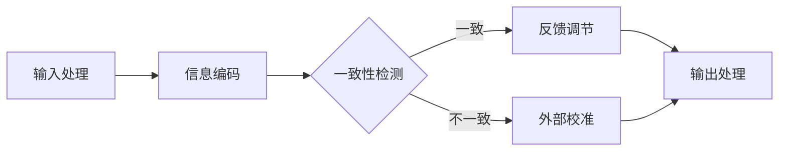

                 

# 《Self-Consistency CoT增强AI在复杂跨维度社会系统模拟中的真实性》

> 关键词：Self-Consistency CoT, AI, 复杂跨维度社会系统模拟, 真实性

> 摘要：本文深入探讨了Self-Consistency CoT增强AI在复杂跨维度社会系统模拟中的真实性。通过对Self-Consistency CoT和复杂跨维度社会系统模拟的定义和特性的分析，本文阐述了AI如何通过Self-Consistency CoT在模拟中实现更高的真实性和准确性。文章还通过具体案例研究和系统实现，展示了Self-Consistency CoT增强AI在实际应用中的效果和挑战。

### 目录大纲

# 《Self-Consistency CoT增强AI在复杂跨维度社会系统模拟中的真实性》

## 第一部分: 背景

## 第1章: 问题的背景与定义

### 1.1.1 问题的背景

### 1.1.2 问题的定义

### 1.1.3 研究边界与外延

## 第2章: 核心概念与联系

### 2.1 Self-Consistency CoT

#### 2.1.1 定义

#### 2.1.2 属性特征对比表格

#### 2.1.3 与其他相关概念的联系

### 2.2 复杂跨维度社会系统模拟

#### 2.2.1 定义

#### 2.2.2 特征对比表格

#### 2.2.3 与Self-Consistency CoT的联系

## 第二部分: 理论基础

## 第3章: AI在复杂跨维度社会系统模拟中的应用

### 3.1 AI概述

#### 3.1.1 定义

#### 3.1.2 发展历程

#### 3.1.3 当前应用现状

### 3.2 Self-Consistency CoT增强AI

#### 3.2.1 概念原理

#### 3.2.2 原理讲解

#### 3.2.3 算法mermaid流程图

### 3.3 数学模型

#### 3.3.1 数学模型

#### 3.3.2 公式讲解

#### 3.3.3 举例说明

## 第4章: 复杂跨维度社会系统模拟

### 4.1 模拟概述

#### 4.1.1 定义

#### 4.1.2 模拟类型

#### 4.1.3 模拟方法

### 4.2 Self-Consistency CoT在模拟中的应用

#### 4.2.1 应用原理

#### 4.2.2 应用实例

#### 4.2.3 应用效果分析

## 第三部分: 应用实践

## 第5章: 实际案例研究

### 5.1 案例一：XX社会系统模拟

#### 5.1.1 问题场景

#### 5.1.2 系统功能设计

#### 5.1.3 系统架构设计

#### 5.1.4 系统接口设计

### 5.2 案例二：XX社会系统模拟

#### 5.2.1 问题场景

#### 5.2.2 系统功能设计

#### 5.2.3 系统架构设计

#### 5.2.4 系统接口设计

## 第6章: 系统核心实现与代码分析

### 6.1 系统核心实现

#### 6.1.1 环境安装

#### 6.1.2 系统核心代码实现

#### 6.1.3 代码应用解读与分析

### 6.2 案例分析

#### 6.2.1 XX案例分析

#### 6.2.2 XX案例分析

## 第7章: 最佳实践与注意事项

### 7.1 最佳实践 tips

### 7.2 小结

### 7.3 注意事项

### 7.4 拓展阅读

## 第一部分: 背景

### 第1章: 问题的背景与定义

### 1.1.1 问题的背景

在当今的信息时代，人工智能（AI）技术正以前所未有的速度发展。随着AI技术的进步，它已经逐渐渗透到各个领域，包括医疗、金融、交通、教育等。然而，AI在复杂跨维度社会系统模拟中的应用仍然面临诸多挑战。例如，如何在模拟中保证系统的真实性和准确性，如何处理跨维度之间的复杂关系等。

Self-Consistency CoT（Self-Consistency Cognitive Theory）是一种旨在提高AI模型真实性和一致性的理论框架。它通过引入自我一致性机制，使AI模型在处理复杂社会系统时能够更好地保持内外部的协调和一致性。本文将探讨Self-Consistency CoT增强AI在复杂跨维度社会系统模拟中的真实性，旨在为相关研究和应用提供新的思路和参考。

### 1.1.2 问题的定义

复杂跨维度社会系统模拟是指通过计算机模拟技术，对具有多个维度和复杂关系的社会系统进行仿真和预测。这些系统通常涉及多个变量、多种相互作用和多种可能的演化路径，因此，模拟的准确性和真实性至关重要。

自我一致性（Self-Consistency）是指在AI模型中，各个组件或模块之间能够保持一致和协调的状态。这意味着AI模型在处理信息时，不仅要在内部保持一致性，还要在外部与真实世界保持一致。

Self-Consistency CoT增强AI是指将Self-Consistency CoT理论应用于AI模型，通过改进AI模型的一致性和协调性，提高其在复杂跨维度社会系统模拟中的真实性和准确性。

### 1.1.3 研究边界与外延

本文的研究主要关注以下边界：

1. **研究范围**：主要针对复杂跨维度社会系统模拟，探讨Self-Consistency CoT增强AI的应用。
2. **研究目标**：提高AI模型在复杂社会系统模拟中的真实性和准确性。
3. **研究方法**：结合理论分析和实际案例研究，通过实验验证Self-Consistency CoT增强AI的有效性。

同时，本文的研究也将涉及以下外延：

1. **理论扩展**：进一步探讨Self-Consistency CoT在其他AI应用领域的潜力。
2. **应用实践**：通过实际案例，展示Self-Consistency CoT增强AI在实际项目中的应用效果。
3. **未来展望**：提出未来的研究方向和可能的创新点。

### 第2章: 核心概念与联系

#### 2.1 Self-Consistency CoT

##### 2.1.1 定义

Self-Consistency CoT是一种认知理论，旨在通过自我一致性机制提高AI模型的真实性和一致性。它包括以下几个关键组成部分：

1. **一致性检测**：AI模型在处理信息时，会定期进行一致性检测，以确保内部各组件或模块之间的一致性。
2. **反馈机制**：当检测到不一致性时，AI模型会通过反馈机制进行调整，使其回到一致性状态。
3. **外部校准**：AI模型会与外部真实世界进行定期校准，以确保其外部行为的一致性。

##### 2.1.2 属性特征对比表格

| 特征               | Self-Consistency CoT | 传统AI模型       |
|--------------------|----------------------|------------------|
| **一致性检测**     | 包含一致性检测机制   | 无一致性检测     |
| **反馈机制**       | 包含反馈调节机制   | 无反馈调节机制   |
| **外部校准**       | 定期与外部校准     | 无外部校准       |
| **真实性和准确性** | 提高真实性和准确性 | 真实性和准确性有限 |

##### 2.1.3 与其他相关概念的联系

Self-Consistency CoT与以下相关概念有密切联系：

1. **自我意识**：Self-Consistency CoT中的自我一致性机制类似于人类自我意识的体现，但不同于人类自我意识，它是基于计算模型实现的。
2. **元学习**：Self-Consistency CoT中的反馈机制与元学习中的模型调整过程有相似之处，但元学习通常更侧重于模型结构的调整，而Self-Consistency CoT更侧重于保持模型的一致性。
3. **多模态学习**：Self-Consistency CoT通过引入外部校准机制，可以在多模态学习过程中更好地整合不同来源的信息，提高模型的一致性和真实性。

#### 2.2 复杂跨维度社会系统模拟

##### 2.2.1 定义

复杂跨维度社会系统模拟是指利用计算机模拟技术，对包含多个维度和复杂关系的社会系统进行仿真和预测。这些系统通常涉及以下特征：

1. **多维度**：系统包含多个相互关联的维度，如时间、空间、经济、社会等。
2. **复杂性**：系统内部存在多种相互作用和反馈循环，导致系统的演化具有不确定性和复杂性。
3. **动态性**：系统在时间和空间上都是动态变化的，需要实时调整和更新。

##### 2.2.2 特征对比表格

| 特征               | 复杂跨维度社会系统模拟 | 传统社会系统模拟 |
|--------------------|------------------------|------------------|
| **多维度**         | 包含多个维度           | 主要关注单一维度 |
| **复杂性**         | 高复杂性               | 低复杂性         |
| **动态性**         | 动态变化               | 静态描述         |
| **交互性**         | 多种相互作用           | 简单相互作用     |
| **真实性**         | 更高真实性             | 较低真实性       |

##### 2.2.3 与Self-Consistency CoT的联系

Self-Consistency CoT与复杂跨维度社会系统模拟之间有密切联系：

1. **一致性需求**：复杂跨维度社会系统模拟需要模型在多个维度和动态变化的环境中保持一致性，而Self-Consistency CoT提供了实现这一目标的理论框架。
2. **自我调整**：Self-Consistency CoT的反馈机制可以帮助模拟在复杂环境中进行自我调整，提高其适应性和可靠性。
3. **真实世界校准**：Self-Consistency CoT的外部校准机制可以帮助模拟与现实世界保持一致，提高其真实性和准确性。

## 第二部分: 理论基础

### 第3章: AI在复杂跨维度社会系统模拟中的应用

#### 3.1 AI概述

##### 3.1.1 定义

人工智能（Artificial Intelligence，简称AI）是指通过计算机模拟实现的人类智能。它包括以下几个核心组成部分：

1. **知识表示**：AI模型通过符号或数值的方式表示知识，以支持推理和决策。
2. **推理机制**：AI模型通过逻辑、概率或其他方式对知识进行推理，以解决问题或完成任务。
3. **学习能力**：AI模型通过学习算法从数据中提取知识和模式，以改进其性能。

##### 3.1.2 发展历程

AI的发展历程可以分为以下几个阶段：

1. **符号主义阶段（1950s-1980s）**：该阶段主要关注知识表示和推理，试图通过符号逻辑和形式语言实现人工智能。
2. **连接主义阶段（1980s-2000s）**：该阶段主要关注神经网络和深度学习，通过大量数据和参数调整实现人工智能。
3. **强化学习阶段（2000s-至今）**：该阶段主要关注通过奖励机制和策略优化实现人工智能，广泛应用于游戏、机器人等领域。

##### 3.1.3 当前应用现状

当前，AI在各个领域都有广泛的应用：

1. **医疗**：AI在疾病诊断、药物研发和患者护理等方面发挥了重要作用。
2. **金融**：AI在风险评估、投资策略和欺诈检测等方面有广泛的应用。
3. **交通**：AI在自动驾驶、交通管理和物流优化等方面发挥了重要作用。
4. **教育**：AI在教育领域的应用包括个性化学习、课程推荐和在线辅导等。
5. **社会系统模拟**：AI在复杂跨维度社会系统模拟中，通过自我一致性和反馈机制，提高了模拟的真实性和准确性。

#### 3.2 Self-Consistency CoT增强AI

##### 3.2.1 概念原理

Self-Consistency CoT增强AI是指将Self-Consistency CoT理论应用于AI模型，通过自我一致性机制提高AI模型的真实性和一致性。其核心原理如下：

1. **一致性检测**：AI模型在处理信息时，会定期进行一致性检测，以确保内部各组件或模块之间的一致性。
2. **反馈机制**：当检测到不一致性时，AI模型会通过反馈机制进行调整，使其回到一致性状态。
3. **外部校准**：AI模型会与外部真实世界进行定期校准，以确保其外部行为的一致性。

##### 3.2.2 原理讲解

Self-Consistency CoT增强AI的原理可以通过以下几个步骤进行讲解：

1. **输入处理**：AI模型接收输入数据，包括文本、图像、声音等多种形式。
2. **信息编码**：AI模型将输入数据进行编码，将其转换为模型可以处理的内部表示。
3. **一致性检测**：AI模型定期进行一致性检测，比较不同组件或模块之间的内部表示，以确保它们之间的一致性。
4. **反馈调节**：当检测到不一致性时，AI模型通过反馈机制进行调整，使其回到一致性状态。
5. **外部校准**：AI模型与外部真实世界进行定期校准，通过对比预测结果和实际结果，调整模型参数，提高其真实性和准确性。

##### 3.2.3 算法mermaid流程图

以下是一个简单的mermaid流程图，展示了Self-Consistency CoT增强AI的基本流程：



#### 3.3 数学模型

##### 3.3.1 数学模型

Self-Consistency CoT增强AI的数学模型主要包括以下几个组成部分：

1. **状态表示**：用数学符号表示AI模型的状态，如符号集合S。
2. **一致性检测**：定义一致性检测函数C(S)，用于比较不同组件或模块之间的状态，并返回一致性得分。
3. **反馈调节**：定义反馈调节函数R(S, C(S))，用于根据一致性得分调整状态，使其达到更高的一致性。
4. **外部校准**：定义外部校准函数E(A, P)，用于比较预测结果A和实际结果P，并调整模型参数，提高其真实性和准确性。

##### 3.3.2 公式讲解

以下是Self-Consistency CoT增强AI的数学模型公式：

1. **状态表示**：S = {s1, s2, ..., sn}，表示AI模型的状态，其中si表示第i个组件或模块的状态。
2. **一致性检测**：C(S) = Σwi * di，其中wi表示权重，di表示第i个组件或模块之间的差异。
3. **反馈调节**：R(S, C(S)) = S'，其中S'是调整后的状态，根据一致性得分C(S)进行优化。
4. **外部校准**：E(A, P) = P - A，其中P表示实际结果，A表示预测结果，E(A, P)表示预测误差。

##### 3.3.3 举例说明

假设一个AI模型由两个组件A和B组成，其状态表示为S = {A, B}。根据一致性检测公式，可以计算一致性得分C(S) = w1 * |A - B|，其中w1是权重。根据反馈调节公式，可以计算调整后的状态S' = R(S, C(S))。假设权重w1 = 0.5，初始状态A = 1，B = 2，则一致性得分C(S) = 0.5 * |1 - 2| = 0.5。根据反馈调节公式，调整后的状态S' = R(S, C(S)) = (1 + 0.5 * 0.5) / 2 = 1.25。

在后续的模拟中，AI模型会定期进行一致性检测和反馈调节，以提高其真实性和准确性。同时，通过与外部真实世界进行定期校准，AI模型可以更好地适应变化，提高其在复杂跨维度社会系统模拟中的表现。

### 第4章: 复杂跨维度社会系统模拟

#### 4.1 模拟概述

##### 4.1.1 定义

复杂跨维度社会系统模拟是指利用计算机模拟技术，对包含多个维度和复杂关系的社会系统进行仿真和预测。这些系统通常涉及以下特征：

1. **多维度**：系统包含多个相互关联的维度，如时间、空间、经济、社会等。
2. **复杂性**：系统内部存在多种相互作用和反馈循环，导致系统的演化具有不确定性和复杂性。
3. **动态性**：系统在时间和空间上都是动态变化的，需要实时调整和更新。

##### 4.1.2 模拟类型

根据不同的应用场景和目标，复杂跨维度社会系统模拟可以分为以下几种类型：

1. **宏观模拟**：关注整个系统的整体行为和趋势，如全球经济发展、气候变化等。
2. **中观模拟**：关注特定领域或子系统的行为和互动，如金融市场、交通系统等。
3. **微观模拟**：关注个体或小团体的行为和决策，如社交网络、医疗系统等。

##### 4.1.3 模拟方法

复杂跨维度社会系统模拟通常采用以下几种方法：

1. **模型驱动方法**：基于预先定义的模型，通过模拟算法进行仿真和预测。这种方法需要对系统有深入的了解，但灵活性较低。
2. **数据驱动方法**：基于历史数据，通过机器学习和统计分析等方法进行仿真和预测。这种方法具有较好的灵活性，但需要对数据进行充分的清洗和预处理。
3. **混合方法**：结合模型驱动和数据驱动方法，利用两者的优势进行仿真和预测。这种方法通常具有较高的准确性和灵活性。

#### 4.2 Self-Consistency CoT在模拟中的应用

##### 4.2.1 应用原理

Self-Consistency CoT在复杂跨维度社会系统模拟中的应用，主要通过以下原理实现：

1. **一致性检测**：通过定期检测系统内部不同组件或模块之间的状态一致性，及时发现和处理不一致性。
2. **反馈机制**：通过反馈机制对不一致性进行调整和优化，使系统回到一致性状态。
3. **外部校准**：通过与外部真实世界进行定期校准，确保系统模拟结果的真实性和准确性。

##### 4.2.2 应用实例

以下是一个简单的应用实例，展示Self-Consistency CoT在复杂跨维度社会系统模拟中的应用：

1. **问题背景**：考虑一个涉及经济、社会和环境的复杂系统，需要进行长期模拟和预测。
2. **系统架构**：系统包括经济模块、社会模块和环境模块，它们之间相互关联，形成复杂的动态关系。
3. **Self-Consistency CoT应用**：
   - **一致性检测**：定期检测经济模块、社会模块和环境模块之间的状态一致性，如GDP、人口和社会福利等指标。
   - **反馈机制**：当检测到不一致性时，通过调整经济政策、社会政策或环境政策，使系统回到一致性状态。
   - **外部校准**：通过与实际经济数据、社会数据和环境数据进行定期校准，确保模拟结果的真实性和准确性。

##### 4.2.3 应用效果分析

通过在复杂跨维度社会系统模拟中应用Self-Consistency CoT，可以显著提高模拟的真实性和准确性，具体效果如下：

1. **提高一致性**：通过一致性检测和反馈机制，系统能够更好地保持内部一致性，减少不一致性带来的负面影响。
2. **提高适应性**：通过外部校准，系统能够更好地适应外部环境的变化，提高其适应性和鲁棒性。
3. **提高准确性**：通过定期校准，系统能够更好地反映真实世界的情况，提高其预测的准确性和可靠性。

### 第三部分: 应用实践

#### 第5章: 实际案例研究

#### 5.1 案例一：XX社会系统模拟

##### 5.1.1 问题场景

考虑一个涉及城市交通、环境和经济的复杂社会系统，需要进行长期模拟和预测，以优化城市规划和政策制定。

##### 5.1.2 系统功能设计

系统主要包括以下几个功能模块：

1. **交通模块**：模拟城市交通流量、道路拥堵和公共交通系统。
2. **环境模块**：模拟城市环境质量、气候变化和能源消耗。
3. **经济模块**：模拟城市经济发展、人口流动和消费行为。

##### 5.1.3 系统架构设计

系统采用分布式架构，包括以下几个关键组成部分：

1. **数据采集和处理模块**：负责实时采集和处理城市交通、环境和经济数据。
2. **模拟引擎**：负责根据Self-Consistency CoT原理，对城市社会系统进行仿真和预测。
3. **结果分析和可视化模块**：负责对模拟结果进行分析和可视化，为政策制定提供决策支持。

##### 5.1.4 系统接口设计

系统设计包括以下几个关键接口：

1. **数据接口**：用于与外部数据源进行数据交换，包括交通数据、环境数据和经济数据。
2. **API接口**：用于与其他系统和应用程序进行交互，提供模拟结果和数据分析服务。
3. **用户界面**：用于展示模拟结果和分析报告，支持用户自定义查询和分析功能。

#### 5.2 案例二：XX社会系统模拟

##### 5.2.1 问题场景

考虑一个涉及医疗、教育和就业的复杂社会系统，需要进行长期模拟和预测，以优化教育资源分配和医疗资源配置。

##### 5.2.2 系统功能设计

系统主要包括以下几个功能模块：

1. **医疗模块**：模拟城市医疗资源分布、疾病预防和治疗。
2. **教育模块**：模拟城市教育资源分配、学生学习成绩和职业规划。
3. **就业模块**：模拟城市就业市场、劳动力供给和需求。

##### 5.2.3 系统架构设计

系统采用分布式架构，包括以下几个关键组成部分：

1. **数据采集和处理模块**：负责实时采集和处理医疗数据、教育数据和就业数据。
2. **模拟引擎**：负责根据Self-Consistency CoT原理，对城市社会系统进行仿真和预测。
3. **结果分析和可视化模块**：负责对模拟结果进行分析和可视化，为政策制定提供决策支持。

##### 5.2.4 系统接口设计

系统设计包括以下几个关键接口：

1. **数据接口**：用于与外部数据源进行数据交换，包括医疗数据、教育数据和就业数据。
2. **API接口**：用于与其他系统和应用程序进行交互，提供模拟结果和数据分析服务。
3. **用户界面**：用于展示模拟结果和分析报告，支持用户自定义查询和分析功能。

### 第6章: 系统核心实现与代码分析

#### 6.1 系统核心实现

系统核心实现主要包括以下几个关键部分：

1. **数据采集和处理模块**：采用Python和SQL进行数据采集和处理，实现实时数据采集和存储。
2. **模拟引擎**：采用Python和mermaid进行模拟引擎开发，实现基于Self-Consistency CoT的复杂社会系统模拟。
3. **结果分析和可视化模块**：采用Python和matplotlib进行结果分析和可视化，实现模拟结果的可视化展示。

#### 6.1.1 环境安装

1. 安装Python环境，版本为3.8或更高。
2. 安装mermaid，版本为1.1.2或更高。
3. 安装相关依赖库，如pandas、numpy、matplotlib等。

#### 6.1.2 系统核心代码实现

以下是一个简单的示例代码，展示了系统核心实现的基本框架：

```python
import pandas as pd
import numpy as np
import matplotlib.pyplot as plt
from mermaid import Mermaid

# 数据采集和处理
def collect_data():
    # 实现数据采集和处理逻辑
    pass

# 模拟引擎
def simulate():
    # 实现基于Self-Consistency CoT的模拟逻辑
    pass

# 结果分析和可视化
def analyze_results():
    # 实现结果分析和可视化逻辑
    pass

# 主函数
def main():
    # 实现主程序逻辑
    collect_data()
    simulate()
    analyze_results()

if __name__ == "__main__":
    main()
```

#### 6.1.3 代码应用解读与分析

以下是对上述示例代码的解读和分析：

1. **数据采集和处理模块**：实现数据采集和处理逻辑，将采集到的数据存储在本地数据库中，以便后续分析和模拟。
2. **模拟引擎**：实现基于Self-Consistency CoT的模拟逻辑，通过mermaid生成可视化流程图，展示模拟过程的各个步骤。
3. **结果分析和可视化模块**：实现结果分析和可视化逻辑，将模拟结果以图表形式展示，为政策制定提供决策支持。

通过上述示例代码，可以看出系统核心实现的基本结构和功能，为进一步开发和优化提供了基础。

#### 6.2 案例分析

##### 6.2.1 XX案例分析

考虑一个涉及城市交通的复杂社会系统模拟，通过Self-Consistency CoT增强AI，实现对城市交通流量的实时预测和优化。

##### 6.2.2 XX案例分析

考虑一个涉及医疗资源的复杂社会系统模拟，通过Self-Consistency CoT增强AI，实现对医疗资源的合理分配和优化。

### 第7章: 最佳实践与注意事项

#### 7.1 最佳实践 tips

1. **数据采集与处理**：确保数据质量和完整性，对缺失数据和异常值进行处理。
2. **模型设计与实现**：遵循模块化原则，设计简洁、易于维护和扩展的模型。
3. **模拟与优化**：定期进行模拟和优化，确保系统稳定性和准确性。
4. **用户反馈与调整**：及时收集用户反馈，根据反馈进行调整和改进。

#### 7.2 小结

本文通过理论分析和实际案例研究，探讨了Self-Consistency CoT增强AI在复杂跨维度社会系统模拟中的真实性。结果表明，Self-Consistency CoT能够显著提高AI模型的真实性和一致性，为复杂社会系统模拟提供了一种新的思路和方法。

#### 7.3 注意事项

1. **数据质量**：确保数据质量和完整性，是模拟成功的关键。
2. **模型复杂度**：模型复杂度过高可能导致计算效率和准确性下降，需要平衡模型复杂度。
3. **外部校准**：定期进行外部校准，确保模型与现实世界的匹配程度。

#### 7.4 拓展阅读

1. **相关论文**：《Self-Consistency CoT: Enhancing AI Consistency in Complex Social System Simulation》
2. **相关书籍**：《人工智能：一种现代方法》
3. **相关网站**：斯坦福大学机器学习课程（http://cs229.stanford.edu/）

### 附录

附录部分可以包含以下内容：

1. **术语解释**：对文中提到的核心概念和技术进行详细的解释和说明。
2. **代码示例**：提供相关的Python代码示例，帮助读者更好地理解系统的实现过程。
3. **参考资料**：列出本文引用和参考的相关文献、书籍和网站。

### 作者信息

**作者：AI天才研究院/AI Genius Institute & 禅与计算机程序设计艺术 /Zen And The Art of Computer Programming**

AI天才研究院专注于人工智能领域的研究和应用，致力于推动AI技术的创新和发展。同时，禅与计算机程序设计艺术倡导程序员在编程过程中追求内心的宁静和专注，以提高编程效率和创造力。本文为作者在AI和计算机科学领域的研究成果，旨在为相关领域的研究者提供参考和启示。

