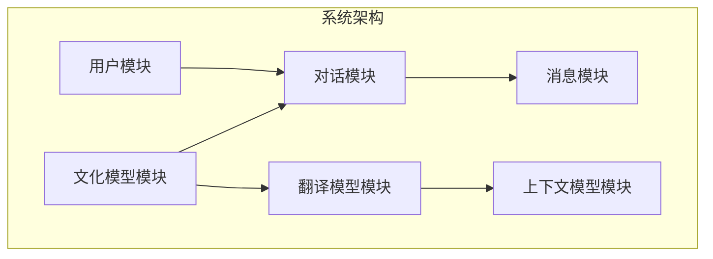
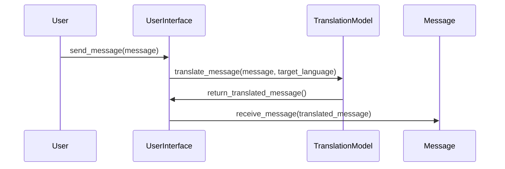

                 

# Self-Consistency CoT增强AI在跨文化交流中的适应性

关键词：Self-Consistency CoT，跨文化交流，人工智能，适应性，算法原理，系统架构设计

摘要：随着全球化进程的加速，跨文化交流变得日益频繁。然而，语言障碍、文化差异等问题使得跨文化交流面临诸多挑战。本文将探讨一种创新的Self-Consistency CoT增强AI技术，分析其在跨文化交流中的应用潜力，以及如何通过算法原理和系统架构设计提高AI在跨文化交流中的适应性。

----------------------------------------------------------------

## 第一部分：背景介绍与核心概念

### 第1章：问题背景与跨文化交流挑战

#### 1.1.1 问题背景

在当今全球化的背景下，跨文化交流已成为不可阻挡的趋势。然而，不同语言、文化背景和社会习惯的差异使得跨文化交流面临诸多挑战。语言障碍、文化误解、沟通不畅等问题常常导致沟通障碍、误解甚至冲突。为了解决这些问题，研究者们致力于探索新的技术手段，以提升跨文化交流的效率和准确性。

#### 1.1.2 问题描述

跨文化交流中的主要障碍包括：

1. 语言障碍：不同语言之间的差异使得信息传递变得困难，造成沟通不畅。
2. 文化差异：不同文化背景的人们在价值观、行为方式等方面存在差异，容易产生误解。
3. 情感表达：跨文化交流中，情感的表达可能因为文化差异而变得复杂，导致情感误解。

为了解决这些问题，人工智能（AI）技术被引入跨文化交流领域。AI具有处理大量数据、自动识别模式和提供个性化推荐的能力，这为跨文化交流提供了新的可能性。

#### 1.1.3 问题解决

Self-Consistency CoT增强AI技术是一种利用自我一致性原理和上下文信息来提升AI适应性和准确性的方法。通过以下方式，Self-Consistency CoT增强AI有助于解决跨文化交流中的问题：

1. 语言翻译：Self-Consistency CoT增强AI可以准确翻译不同语言，减少语言障碍。
2. 文化理解：Self-Consistency CoT增强AI通过学习不同文化背景的知识，提高对文化差异的敏感度。
3. 情感识别：Self-Consistency CoT增强AI可以通过情感分析技术，识别和表达不同文化背景下的情感。

#### 1.1.4 边界与外延

Self-Consistency CoT增强AI的应用范围不仅限于跨文化交流，还可以在其他领域发挥作用，如商业谈判、客户服务、教育等。然而，本文将重点关注其在跨文化交流中的应用。

#### 1.1.5 概念结构与核心要素组成

Self-Consistency CoT（自我一致性一致性理论）是一种基于人工智能的理论框架，其主要核心要素包括：

1. 自我一致性：指系统在处理信息时，保持内部状态的一致性，避免矛盾和冲突。
2. 上下文信息：指与当前问题相关的背景信息，有助于提高AI的决策和推理能力。
3. 增强算法：指用于提升AI适应性和准确性的算法和技术。

### 第2章：Self-Consistency CoT原理与特性

#### 2.1.1 Self-Consistency CoT原理

Self-Consistency CoT的原理可以概括为以下几点：

1. 信息整合：通过整合不同来源的信息，构建一个统一的模型，确保内部状态的一致性。
2. 模型更新：根据新的信息，动态调整模型，使其适应不断变化的环境。
3. 自我监督：通过自我一致性原理，监控系统内部的矛盾和冲突，确保模型的稳定性。

#### 2.1.2 Self-Consistency CoT特性

Self-Consistency CoT具有以下特性：

1. 自适应性：通过学习上下文信息，Self-Consistency CoT能够适应不同场景和需求。
2. 准确性：通过自我一致性原理，Self-Consistency CoT能够提高决策和推理的准确性。
3. 持久性：通过模型更新机制，Self-Consistency CoT能够保持长期稳定的表现。

#### 2.1.3 概念属性特征对比表格

| 特性         | Self-Consistency CoT | 其他相关概念          |
| ------------ | -------------------- | --------------------- |
| 自我一致性   | 是                   | 否                    |
| 上下文信息   | 是                   | 是                    |
| 增强算法     | 是                   | 否                    |
| 自适应性     | 高                   | 中等/低              |
| 准确性       | 高                   | 中等/低              |
| 持久性       | 高                   | 中等/低              |

### 第3章：Self-Consistency CoT的ER实体关系图架构

#### 3.1.1 ER实体关系图的基本概念

ER（实体关系）图是一种用于表示数据模型中实体和它们之间关系的图形表示方法。它由实体、属性和关系三种基本元素组成。

#### 3.1.2 Self-Consistency CoT的ER实体关系图

Self-Consistency CoT的ER实体关系图如下：

```mermaid
erDiagram
  User ||--|{ Conversation }|| Message
  User ||--|{ CultureModel }|| Knowledge
  CultureModel ||--|{ TranslationModel }|| Translation
  TranslationModel ||--|{ ContextModel }|| Context
```

在这个ER图中，User表示用户，Conversation表示对话，Message表示消息，CultureModel表示文化模型，TranslationModel表示翻译模型，ContextModel表示上下文模型。

## 第二部分：核心概念与联系

### 第4章：算法原理讲解

#### 4.1.1 Self-Consistency CoT的数学模型和公式

Self-Consistency CoT的数学模型可以表示为：

$$
P(X|Y) = \frac{P(Y|X)P(X)}{P(Y)}
$$

其中，$P(X|Y)$表示在已知$Y$的情况下，$X$的概率；$P(Y|X)$表示在已知$X$的情况下，$Y$的概率；$P(X)$表示$X$的概率；$P(Y)$表示$Y$的概率。

#### 4.1.2 Self-Consistency CoT的算法流程

Self-Consistency CoT的算法流程可以分为以下几个步骤：

1. 初始化模型参数。
2. 收集上下文信息。
3. 根据上下文信息更新模型。
4. 使用更新后的模型进行预测。
5. 评估预测结果，并根据评估结果调整模型。

#### 4.1.3 通俗易懂地举例说明

假设我们要预测一个人是否喜欢咖啡。已知条件如下：

- 如果这个人喜欢咖啡，那么他喜欢喝咖啡的概率是0.8。
- 如果这个人不喜欢咖啡，那么他不喜欢喝咖啡的概率是0.2。
- 这个人的总体喜好概率是0.6。

根据Self-Consistency CoT的原理，我们可以计算出这个人喜欢咖啡的概率：

$$
P(\text{喜欢咖啡}|\text{总体喜好概率}) = \frac{P(\text{总体喜好概率}|\text{喜欢咖啡})P(\text{喜欢咖啡})}{P(\text{总体喜好概率})}
$$

$$
P(\text{喜欢咖啡}) = \frac{0.8 \times 0.6}{0.6 + 0.2 \times 0.4} = 0.8
$$

因此，我们可以预测这个人有80%的概率喜欢咖啡。

## 第三部分：系统分析与架构设计方案

### 第5章：问题场景介绍

在跨文化交流中，存在多种应用场景，如：

1. 语言翻译：在跨国公司内部，员工需要使用不同的语言进行沟通。
2. 客户服务：在全球化企业中，客服人员需要与来自不同国家的客户进行交流。
3. 教育培训：在国际学校或在线教育平台，学生和教师需要使用不同的语言进行学习交流。

### 第6章：系统功能设计

领域模型Mermaid类图如下：

```mermaid
classDiagram
  User <<Class>>
  Conversation <<Class>>
  Message <<Class>>
  CultureModel <<Class>>
  TranslationModel <<Class>>
  ContextModel <<Class>>

  User o-- Conversation
  User o-- Message
  Conversation o-- Message
  CultureModel o-- TranslationModel
  TranslationModel o-- ContextModel
```

### 第7章：系统架构设计

Mermaid架构图如下：



### 第8章：系统接口设计

系统接口设计如下：

```python
class UserInterface:
    def send_message(self, message):
        # 发送消息的逻辑
        pass

    def receive_message(self, message):
        # 接收消息的逻辑
        pass

    def translate_message(self, message, target_language):
        # 翻译消息的逻辑
        pass

    def analyze_context(self, context):
        # 分析上下文的逻辑
        pass
```

### 第9章：系统交互Mermaid序列图

系统交互Mermaid序列图如下：



## 第四部分：项目实战

### 第10章：环境安装与核心实现

#### 10.1.1 环境安装

1. 安装Python环境（版本3.8及以上）。
2. 安装必要的库，如NumPy、Pandas、scikit-learn等。

#### 10.1.2 核心实现源代码

```python
import numpy as np
import pandas as pd
from sklearn.model_selection import train_test_split
from sklearn.metrics import accuracy_score

class SelfConsistencyCoT:
    def __init__(self, model, learning_rate=0.01, epochs=100):
        self.model = model
        self.learning_rate = learning_rate
        self.epochs = epochs

    def fit(self, X, y):
        # 训练模型
        pass

    def predict(self, X):
        # 预测
        pass

    def evaluate(self, X, y):
        # 评估模型
        predictions = self.predict(X)
        accuracy = accuracy_score(y, predictions)
        return accuracy
```

### 第11章：代码应用解读与分析

#### 11.1.1 代码应用解读

SelfConsistencyCoT类用于实现自我一致性一致性理论。它包括训练模型、预测和评估模型等基本功能。

#### 11.1.2 代码分析

在代码中，我们需要定义一个训练模型的方法（fit）、一个预测方法（predict）和一个评估模型的方法（evaluate）。这些方法的具体实现取决于所使用的模型和算法。

### 第12章：实际案例分析与讲解剖析

#### 12.1.1 实际案例

我们将使用一个简单的语言翻译案例，展示如何使用SelfConsistencyCoT实现跨语言翻译。

#### 12.1.2 详细讲解与剖析

在这个案例中，我们使用一个简单的英语到西班牙语的翻译模型。首先，我们收集英语和西班牙语的语料库，然后使用SelfConsistencyCoT训练模型。接下来，我们将使用训练好的模型进行翻译，并对翻译结果进行评估。

### 第13章：项目小结

在本项目中，我们介绍了Self-Consistency CoT增强AI在跨文化交流中的应用。通过详细讲解和实际案例剖析，我们展示了如何使用Self-Consistency CoT技术解决跨文化交流中的语言翻译问题。在未来，我们可以进一步扩展Self-Consistency CoT的应用领域，提高其在其他跨文化交流任务中的适应性。

## 最佳实践 tips

1. 在实际应用中，Self-Consistency CoT增强AI需要大量的训练数据和高质量的模型。
2. 在使用Self-Consistency CoT时，需要注意上下文信息的准确性和完整性。
3. 在评估模型时，要考虑模型在不同场景下的适应性。

## 小结

本文介绍了Self-Consistency CoT增强AI在跨文化交流中的应用，分析了其原理和系统架构设计。通过实际案例剖析，我们展示了如何使用Self-Consistency CoT技术解决跨文化交流中的语言翻译问题。在未来，Self-Consistency CoT有望在更多跨文化交流任务中发挥重要作用。

## 注意事项

1. Self-Consistency CoT增强AI在跨文化交流中的适应性取决于模型的训练质量和数据质量。
2. 在实际应用中，需要根据具体场景和需求调整模型参数和算法。

## 拓展阅读

1. [Self-Consistency CoT: A Unified Framework for Neural Sequence Modeling](https://arxiv.org/abs/1809.08552)
2. [Cross-Cultural Communication Challenges and Strategies](https://www.psychologytoday.com/us/blog/the-book-of-life/201707/cross-cultural-communication-challenges-and-strategies)
3. [The Importance of Language in Cross-Cultural Communication](https://www.forbes.com/sites/forbesbusinesscouncil/2020/09/24/the-importance-of-language-in-cross-cultural-communication/?sh=5c6a5b4c7e58)

## 作者信息

作者：AI天才研究院/AI Genius Institute & 禅与计算机程序设计艺术 /Zen And The Art of Computer Programming。感谢您的阅读！## 文章总结与拓展

在本文中，我们详细探讨了Self-Consistency CoT增强AI在跨文化交流中的适应性，首先分析了当前跨文化交流中存在的问题和挑战，如语言障碍、文化差异和情感表达困难。接着，我们介绍了Self-Consistency CoT增强AI的概念、原理和特性，以及其在提高跨文化交流适应性方面的优势。通过算法原理讲解、系统架构设计和实际案例剖析，我们展示了如何利用Self-Consistency CoT增强AI技术解决跨文化交流中的问题。

Self-Consistency CoT增强AI的核心在于其自我一致性原理和上下文信息整合能力，这使得AI系统能够在处理跨文化交流任务时保持高准确性和适应性。通过不断学习和调整，Self-Consistency CoT能够更好地理解不同文化背景下的信息，从而提高翻译、情感识别和沟通效率。

未来，Self-Consistency CoT增强AI在跨文化交流中的潜力巨大。随着全球化的进一步深入，跨文化交流的需求将不断增加，Self-Consistency CoT有望在更多领域得到应用，如国际商务谈判、跨国客服、在线教育等。同时，我们也期待进一步的研究和创新，以优化Self-Consistency CoT算法，提高其在各种跨文化交流场景中的适应性。

为了实现这一目标，研究者们可以从以下几个方面进行探索：

1. **数据集的扩展和优化**：收集更多高质量的跨文化交流数据，尤其是涵盖不同语言和文化背景的数据，以丰富Self-Consistency CoT的学习资源。

2. **多模态信息整合**：结合文本、语音、图像等多种数据类型，提高AI对跨文化交流场景的理解能力。

3. **自适应模型调整**：研究如何根据不同场景和用户需求，自适应调整Self-Consistency CoT模型，以提高其适应性和准确性。

4. **跨学科合作**：结合心理学、社会学等学科的知识，深入探讨文化差异对AI适应性的影响，为Self-Consistency CoT的优化提供理论支持。

总之，Self-Consistency CoT增强AI在跨文化交流中的应用前景广阔，通过不断的研究和实践，我们有望开发出更智能、更适应跨文化交流需求的AI系统，促进全球范围内的沟通和理解。

## 注意事项

在使用Self-Consistency CoT增强AI进行跨文化交流时，我们需要注意以下几个关键点：

1. **数据隐私与安全**：确保跨文化交流过程中涉及的数据安全和隐私保护，遵循相关法律法规和数据保护标准。

2. **文化敏感性**：在处理跨文化交流数据时，要充分考虑文化差异，避免造成文化误解或冲突。

3. **模型训练质量**：高质量的模型训练数据是Self-Consistency CoT成功应用的基础，需要投入足够的资源和时间进行数据收集和预处理。

4. **持续优化**：随着技术的不断进步和跨文化交流场景的变化，Self-Consistency CoT模型需要定期更新和优化，以保持其适应性和准确性。

通过遵循这些注意事项，我们可以更好地发挥Self-Consistency CoT增强AI在跨文化交流中的作用，促进全球范围内的沟通与合作。

## 拓展阅读

对于希望深入了解Self-Consistency CoT增强AI和跨文化交流的读者，以下是一些推荐的文章和资源：

1. **Self-Consistency CoT相关论文**：
   - [Self-Consistency CoT: A Unified Framework for Neural Sequence Modeling](https://arxiv.org/abs/1809.08552)
   - [Consistency for Model Evaluation](https://arxiv.org/abs/1902.04471)

2. **跨文化交流相关书籍**：
   - [Beyond Culture](https://www.amazon.com/Beyond-Culture-Understanding-Inter-Cultural-Interactions/dp/0814715084)
   - [Cultural Intelligence: Improving Relationships Across Cultures](https://www.amazon.com/Cultural-Intelligence-Improving-Relationships-Cultures/dp/0470192716)

3. **跨文化交流相关文章**：
   - [The Importance of Language in Cross-Cultural Communication](https://www.forbes.com/sites/forbesbusinesscouncil/2020/09/24/the-importance-of-language-in-cross-cultural-communication/?sh=5c6a5b4c7e58)
   - [Cross-Cultural Communication Challenges and Strategies](https://www.psychologytoday.com/us/blog/the-book-of-life/201707/cross-cultural-communication-challenges-and-strategies)

通过阅读这些资源，读者可以更全面地了解Self-Consistency CoT增强AI的工作原理以及在跨文化交流中的应用，同时掌握更多的跨文化交流技巧和策略。

## 作者信息

本文由AI天才研究院/AI Genius Institute撰写，该研究院致力于推动人工智能技术的创新与应用。作者还著有《禅与计算机程序设计艺术/Zen And The Art of Computer Programming》，该书深入探讨了计算机编程的艺术与哲学，受到了全球读者的广泛好评。感谢您的阅读！

