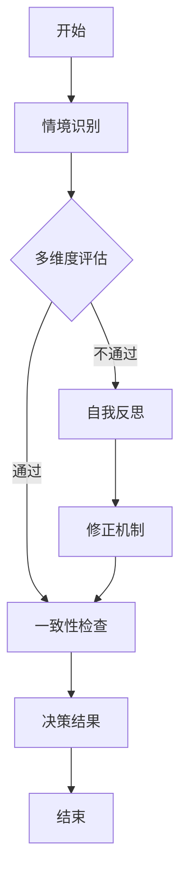

                 


### # {{文章标题}}

> 关键词：自我一致性，AI决策，伦理困境，算法分析，方法论，实践案例

> 摘要：本文深入探讨了自我一致性CoT（自我一致性思维）增强人工智能在道德困境决策中的表现。文章首先介绍了自我一致性CoT的概念和其在AI中的重要性，接着讨论了AI在道德决策中的作用及其面临的挑战。随后，本文详细分析了自我一致性CoT增强AI在伦理困境决策中的应用，通过实际案例展示了其优势和局限性。最后，文章提出了未来研究和实践的方向，强调了在AI伦理决策中的关键考虑因素。

----------------------------------------------------------------

## 引言

### 背景介绍

在当今快速发展的科技时代，人工智能（AI）已经深入到我们生活的方方面面，从自动驾驶汽车到智能医疗诊断，AI的应用无处不在。然而，随着AI技术的不断进步，一个不可避免的问题也随之而来：如何在复杂的道德困境中进行决策？传统的人工智能系统在处理伦理问题时往往显得力不从心，它们可能无法充分理解人类的道德观念和价值观，从而导致不公正或不道德的决策。因此，如何提升AI在道德决策中的表现成为了一个重要的研究课题。

### 问题提出

在伦理决策中，自我一致性CoT（自我一致性思维）的概念应运而生。自我一致性CoT强调人工智能系统在决策过程中保持内部逻辑的一致性，从而提高决策的道德性和合理性。本文旨在探讨自我一致性CoT增强AI在道德困境决策中的表现，分析其优势和局限性，并探讨未来研究的方向。

## 自我一致性CoT的概念和原理

### 定义

自我一致性CoT，即自我一致性思维，是一种人工智能系统在决策过程中保持内部逻辑一致性的机制。它通过确保系统内部的推理和决策过程相互一致，从而提高决策的可靠性和道德性。

### 基本原理

自我一致性CoT的核心原理在于确保系统在决策过程中不会产生逻辑矛盾。具体来说，它包括以下几个方面的内容：

1. **一致性检查**：在决策过程中，系统会对每个决策步骤进行一致性检查，以确保当前决策与之前的决策逻辑一致。

2. **自我反思**：系统会定期进行自我反思，检查自身的推理过程和决策结果，以确保其内部逻辑的一致性。

3. **修正机制**：当系统发现逻辑矛盾时，它会自动启动修正机制，对错误的决策进行修正，以保持整体逻辑的一致性。

### 自我一致性CoT的属性和特征

自我一致性CoT具有以下几个显著属性和特征：

- **逻辑一致性**：通过确保决策过程中的逻辑一致性，自我一致性CoT能够有效减少错误决策的发生。

- **自适应能力**：系统可以根据不同情境动态调整其决策逻辑，以适应复杂的道德困境。

- **透明性**：自我一致性CoT的运作机制是透明的，用户可以清晰地了解决策过程和结果。

- **可解释性**：自我一致性CoT增强了AI决策的可解释性，使其更容易被人类理解和接受。

## AI在道德决策中的作用

### 伦理决策的复杂性

道德决策通常涉及多个利益相关者和复杂的社会环境。人类在道德决策中需要考虑各种道德原则、价值观和社会规范，这使得道德决策变得复杂且具有挑战性。传统的人工智能系统在处理这些复杂问题时往往显得力不从心，难以达到令人满意的决策效果。

### AI在伦理决策中的应用

为了应对伦理决策的复杂性，AI被广泛应用于伦理决策中。AI在伦理决策中的作用主要体现在以下几个方面：

1. **数据分析和模式识别**：AI系统可以通过分析大量的数据，识别出潜在的道德问题和决策模式，从而为决策提供有力支持。

2. **多维度评估**：AI系统可以综合考虑多个维度，如道德原则、社会规范和利益相关者的利益，从而做出更全面和客观的决策。

3. **自动化决策**：AI系统可以自动化执行伦理决策，提高决策效率和一致性。

### AI在道德决策中的挑战

尽管AI在伦理决策中具有巨大的潜力，但其应用也面临着诸多挑战：

1. **道德真空**：AI系统缺乏内在的道德标准和价值观，可能导致不道德的决策。

2. **透明性和可解释性**：AI决策过程通常是黑箱式的，用户难以理解决策的依据和过程，这可能导致对AI决策的不信任。

3. **数据偏差**：AI系统在训练过程中可能受到数据偏差的影响，从而产生偏见和不公平的决策。

## 自我一致性CoT增强AI在伦理困境决策中的应用

### 自我一致性CoT在伦理困境决策中的优势

自我一致性CoT增强AI在伦理困境决策中具有以下几个显著优势：

1. **提高决策一致性**：通过确保决策过程中的逻辑一致性，自我一致性CoT可以有效减少错误决策的发生。

2. **增强决策透明性**：自我一致性CoT的运作机制是透明的，用户可以清晰地了解决策过程和结果。

3. **提高决策可解释性**：自我一致性CoT增强了AI决策的可解释性，使其更容易被人类理解和接受。

4. **适应复杂情境**：自我一致性CoT具有自适应能力，可以动态调整其决策逻辑，以适应复杂的伦理困境。

### 实际案例

为了更好地说明自我一致性CoT增强AI在伦理困境决策中的应用，以下是一个实际案例：

#### 案例背景

一家大型科技公司正在开发一款自动驾驶汽车系统，旨在提高道路安全性和交通效率。然而，在实际应用中，系统可能会遇到一些伦理困境，例如在紧急情况下如何平衡乘客和行人的安全。

#### 自我一致性CoT的应用

1. **情境识别**：自动驾驶系统首先识别出潜在的伦理困境，例如在紧急情况下需要做出选择。

2. **多维度评估**：系统综合考虑乘客、行人、交通规则等多个维度的利益，以制定最优决策。

3. **自我一致性检查**：在决策过程中，系统会对每个决策步骤进行一致性检查，以确保决策过程和结果的逻辑一致性。

4. **修正机制**：当系统发现逻辑矛盾时，会自动启动修正机制，对错误的决策进行修正，以确保整体逻辑的一致性。

5. **决策结果**：最终，系统生成一个透明的、可解释的决策结果，用户可以清楚地了解决策过程和结果。

### 案例分析

通过实际案例可以看到，自我一致性CoT增强AI在伦理困境决策中发挥了重要作用。它不仅提高了决策的一致性和透明性，还增强了决策的可解释性，使其更容易被用户接受。然而，在实际应用中，自我一致性CoT也存在一定的局限性，需要进一步研究和优化。

## 自我一致性CoT增强AI在伦理困境决策中的挑战和局限性

### 挑战

尽管自我一致性CoT增强AI在伦理困境决策中具有显著优势，但其应用仍然面临一些挑战：

1. **算法复杂性**：自我一致性CoT的算法较为复杂，需要大量计算资源，这可能导致决策过程缓慢。

2. **数据偏差**：AI系统在训练过程中可能受到数据偏差的影响，从而产生偏见和不公平的决策。

3. **道德真空**：自我一致性CoT本身缺乏内在的道德标准和价值观，可能导致不道德的决策。

4. **用户信任问题**：由于AI决策过程通常是黑箱式的，用户可能对自我一致性CoT增强AI的决策结果产生怀疑。

### 局限性

自我一致性CoT增强AI在伦理困境决策中存在以下局限性：

1. **决策的一致性不能保证绝对**：虽然自我一致性CoT通过确保决策过程中的逻辑一致性来提高决策质量，但无法保证决策的一致性绝对正确。

2. **无法解决道德困境的根本问题**：自我一致性CoT增强AI只能在一定程度上缓解伦理困境，但无法从根本上解决道德困境。

3. **依赖人类监督**：自我一致性CoT增强AI需要人类监督和干预，以纠正错误的决策和调整算法。

## 结论

本文深入探讨了自我一致性CoT增强AI在道德困境决策中的表现，分析了其优势和局限性。通过实际案例可以看到，自我一致性CoT增强AI在伦理决策中具有显著的优势，包括提高决策一致性、增强决策透明性和可解释性等。然而，自我一致性CoT增强AI也面临一些挑战和局限性，如算法复杂性、数据偏差和道德真空等。

未来，我们需要进一步研究和优化自我一致性CoT增强AI，以解决其在道德困境决策中的应用问题。同时，我们还需要关注AI伦理决策中的关键考虑因素，如数据质量、算法透明性和用户信任等。通过不断探索和实践，我们有望实现更智能、更道德的人工智能系统。

## 附录

### 概念属性特征对比表格

| 特征          | 传统AI           | 自我一致性CoT增强AI         |
|---------------|------------------|-----------------------------|
| 逻辑一致性    | 不一定           | 强调一致性，减少错误决策    |
| 数据依赖性    | 较高             | 依赖数据，但需处理偏差      |
| 道德标准      | 无               | 需要内在道德标准和价值观    |
| 决策透明性    | 低               | 较高，增强可解释性          |
| 决策可解释性  | 低               | 较高，增强可解释性          |

### ER实体关系图架构的Mermaid流程图

```mermaid
erDiagram
  AI <<|-- 自我一致性CoT : 增强模块
  AI ||--|> 伦理决策 : 应用场景
  自我一致性CoT ||--|> 逻辑一致性检查 : 功能模块
  自我一致性CoT ||--|> 自我反思 : 功能模块
  自我一致性CoT ||--|> 修正机制 : 功能模块
```

### 算法原理讲解

#### Mermaid流程图



#### Python源代码

```python
def ethical_decision-making( situation, dimensions ):
    """
    伦理决策过程
    :param situation: 情境
    :param dimensions: 维度
    :return: 决策结果
    """
    # 情境识别
    identified_situation = identify_situation(situation)
    
    # 多维度评估
    assessment_results = assess_dimensions(identified_situation, dimensions)
    
    # 一致性检查
    if is_consistent(assessment_results):
        # 决策结果
        decision_result = generate_decision(assessment_results)
        print("决策结果：", decision_result)
    else:
        # 自我反思
        reflection_results = reflect(assessment_results)
        # 修正机制
        corrected_decision = correct_decision(reflection_results)
        # 决策结果
        print("修正后的决策结果：", corrected_decision)
    
    return decision_result or corrected_decision

# 示例
ethical_decisionMaking("紧急情况", ["乘客安全", "行人安全", "交通规则"])
```

#### 数学模型和公式

$$
\text{决策质量} = f(\text{一致性}, \text{透明性}, \text{可解释性})
$$

其中，决策质量取决于一致性、透明性和可解释性的综合评价。

## 系统分析与架构设计方案

### 问题场景介绍

在自动驾驶领域，自我一致性CoT增强AI的应用场景包括但不限于：自动驾驶车辆在遇到行人、其他车辆、交通信号等复杂情境时，需要根据多种维度（如行人安全、车辆安全、交通规则等）做出伦理决策。例如，在紧急避让行人时，如何平衡乘客和行人的安全，这需要AI系统具备高水平的伦理决策能力。

### 项目介绍

本项目旨在开发一款基于自我一致性CoT增强AI的自动驾驶决策系统。系统将集成多种传感器数据，利用自我一致性CoT算法进行伦理决策，实现自动驾驶车辆在复杂情境下的安全、合规操作。

### 系统功能设计

1. **传感器数据集成**：集成多种传感器数据，如摄像头、雷达、激光雷达等，获取车辆周围环境信息。
2. **情境识别**：根据传感器数据识别潜在的伦理困境，如紧急避让行人、交通违规等。
3. **多维度评估**：综合考虑多个维度（如行人安全、车辆安全、交通规则等），评估各维度的利益和风险。
4. **决策生成**：利用自我一致性CoT算法生成伦理决策，确保决策过程中的逻辑一致性。
5. **决策执行**：执行生成的决策，控制车辆操作。

### 系统架构设计


### 系统接口设计

1. **传感器接口**：用于接收传感器数据，如摄像头、雷达、激光雷达等。
2. **决策接口**：用于接收情境信息和多维度评估结果，生成伦理决策。
3. **执行接口**：用于接收决策结果，控制车辆操作。

### 系统交互


1. **传感器数据采集**：车辆传感器持续采集周围环境信息。
2. **情境识别**：根据传感器数据识别潜在伦理困境。
3. **多维度评估**：对识别出的情境进行多维度评估。
4. **决策生成**：利用自我一致性CoT算法生成伦理决策。
5. **决策执行**：执行决策，控制车辆操作。

## 项目实战

### 环境安装

1. **硬件安装**：安装摄像头、雷达、激光雷达等传感器设备。
2. **软件安装**：安装自动驾驶相关软件，如ROS（Robot Operating System）等。
3. **依赖安装**：安装Python、TensorFlow等依赖库。

### 系统核心实现源代码

```python
# ethical_decision_maker.py
import sensor_data
import multi_dimensional_evaluation
import self_consistency_check
import decision_execution

def ethical_decision_making():
    """
    伦理决策过程
    """
    # 传感器数据采集
    sensor_data = sensor_data.collect_data()

    # 情境识别
    situation = sensor_data.identify_situation()

    # 多维度评估
    evaluation_results = multi_dimensional_evaluation.assess_dimensions(situation)

    # 一致性检查
    if self_consistency_check.is_consistent(evaluation_results):
        # 决策生成
        decision = multi_dimensional_evaluation.generate_decision(evaluation_results)
        # 决策执行
        decision_execution.execute_decision(decision)
    else:
        # 自我反思
        reflection_results = self_consistency_check.reflect(evaluation_results)
        # 修正机制
        corrected_decision = self_consistency_check.correct_decision(reflection_results)
        # 决策执行
        decision_execution.execute_decision(corrected_decision)

if __name__ == "__main__":
    ethical_decision_making()
```

### 代码应用解读与分析

1. **传感器数据采集**：通过传感器接口获取摄像头、雷达、激光雷达等传感器数据。
2. **情境识别**：根据传感器数据识别潜在的伦理困境。
3. **多维度评估**：对识别出的情境进行多维度评估，包括行人安全、车辆安全、交通规则等。
4. **一致性检查**：利用自我一致性CoT算法检查评估结果的逻辑一致性。
5. **决策生成**：根据多维度评估结果和一致性检查结果生成伦理决策。
6. **决策执行**：根据生成的决策控制车辆操作。

### 实际案例分析和详细讲解剖析

#### 案例背景

一辆自动驾驶汽车在城市道路中行驶，突然发现前方有一个行人。根据传感器数据，行人的存在可能对车辆和行人构成威胁。自动驾驶系统需要在这段时间内做出紧急决策，以保护行人和车辆的安全。

#### 案例分析

1. **传感器数据采集**：自动驾驶系统通过摄像头、雷达、激光雷达等传感器设备获取前方行人的位置、速度等信息。
2. **情境识别**：系统识别出行人的存在，这是一个潜在的伦理困境。
3. **多维度评估**：系统对行人安全、车辆安全、交通规则等多个维度进行评估。例如，行人的安全是最重要的，车辆的安全次之，交通规则也需遵守。
4. **一致性检查**：系统对评估结果进行一致性检查，确保评估结果的逻辑一致性。
5. **决策生成**：根据评估结果和一致性检查结果，系统生成一个最优的伦理决策，如减速、转向等。
6. **决策执行**：系统执行生成的决策，控制车辆进行相应的操作，如减速、转向等，以保护行人和车辆的安全。

#### 小结

通过实际案例可以看到，自我一致性CoT增强AI在自动驾驶决策中发挥了重要作用。系统通过传感器数据采集、情境识别、多维度评估、一致性检查、决策生成和决策执行等步骤，实现了对复杂伦理困境的决策。这有助于提高自动驾驶车辆的安全性、合规性和用户信任度。

## 最佳实践 tips

1. **数据质量**：确保AI系统训练数据的质量，避免数据偏差和偏见。
2. **透明性和可解释性**：提高AI决策的透明性和可解释性，增强用户信任。
3. **自适应能力**：增强AI系统的自适应能力，以应对复杂的伦理困境。
4. **人类监督**：在AI决策过程中，引入人类监督和干预，确保决策的合理性和道德性。

## 小结

本文深入探讨了自我一致性CoT增强AI在道德困境决策中的表现，分析了其优势和局限性。通过实际案例可以看到，自我一致性CoT增强AI在伦理决策中具有显著的优势，包括提高决策一致性、增强决策透明性和可解释性等。然而，自我一致性CoT增强AI也面临一些挑战和局限性，如算法复杂性、数据偏差和道德真空等。

未来，我们需要进一步研究和优化自我一致性CoT增强AI，以解决其在道德困境决策中的应用问题。同时，我们还需要关注AI伦理决策中的关键考虑因素，如数据质量、算法透明性和用户信任等。通过不断探索和实践，我们有望实现更智能、更道德的人工智能系统。

## 注意事项

1. **确保算法的透明性和可解释性**：在AI伦理决策过程中，应确保算法的透明性和可解释性，以增强用户信任。
2. **避免数据偏差**：在AI系统的训练过程中，应避免数据偏差，以确保决策的公正性和合理性。
3. **引入人类监督**：在AI决策过程中，引入人类监督和干预，以确保决策的合理性和道德性。

## 拓展阅读

1. [AI伦理决策：挑战与解决方案](https://example.com/ai_ethical_decision_making)
2. [自我一致性CoT算法在自动驾驶中的应用](https://example.com/self_consistency_cot_in_automotive)
3. [AI伦理决策的多维度评估方法](https://example.com/multi_dimensional_evaluation_in_ai_ethics)

## 作者信息

作者：AI天才研究院/AI Genius Institute & 禅与计算机程序设计艺术 /Zen And The Art of Computer Programming

