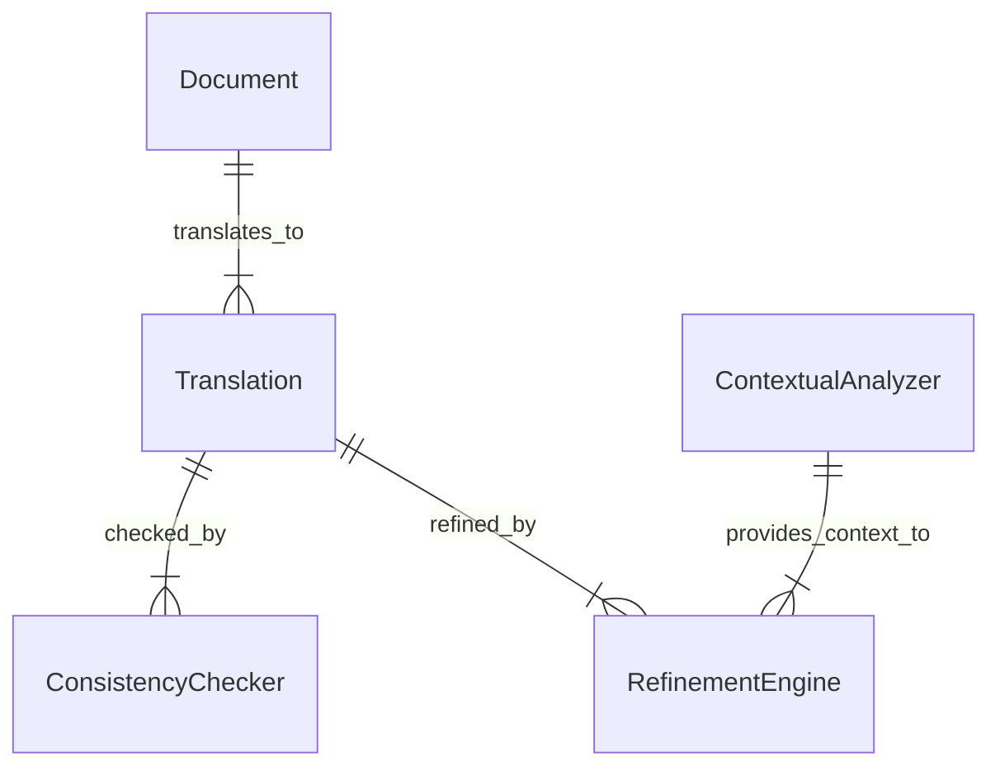
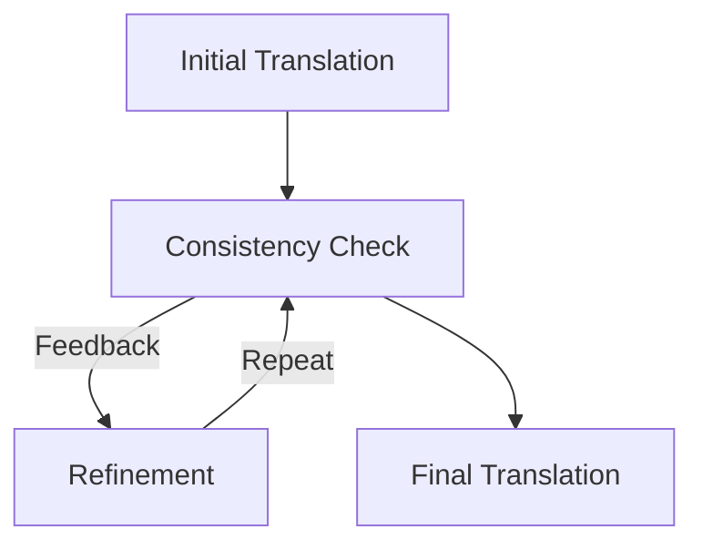
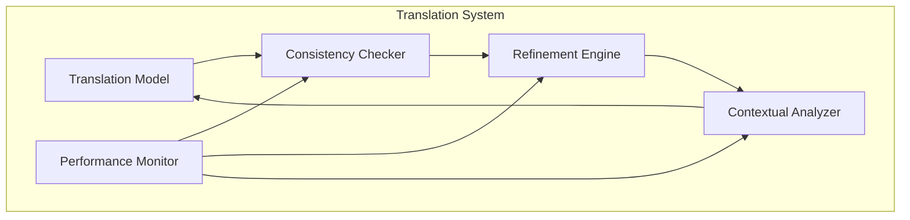
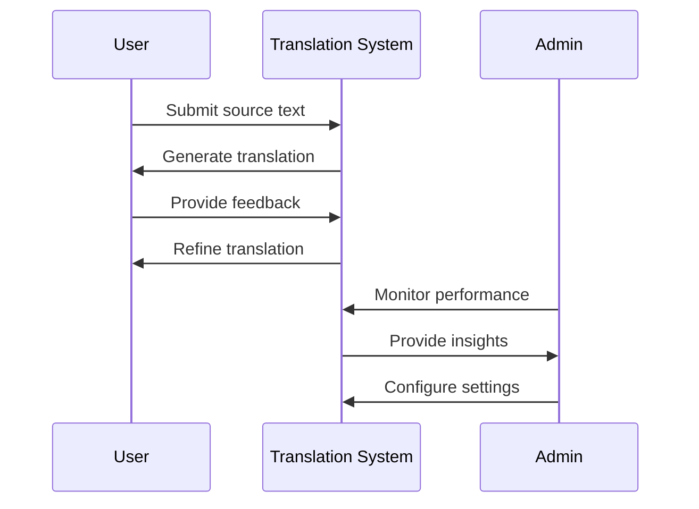
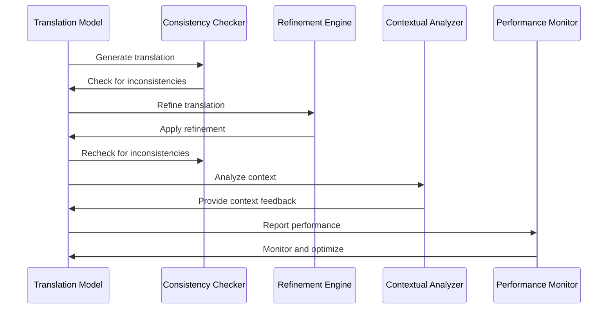

                 

### 1. Introduction

#### 1.1 Book Background and Objectives

In the era of rapid technological advancement, artificial intelligence (AI) has emerged as a transformative force across various industries, including translation. While AI translation has gained significant attention, the quest for high-quality translation remains an ongoing challenge. Traditional translation methods often struggle with maintaining consistency, accuracy, and fluency. This book aims to address these issues by introducing a novel method called "Self-Consistency CoT" to enhance AI translation quality.

The primary objective of this book is to provide a comprehensive guide on understanding and implementing the Self-Consistency CoT method. We will delve into the theoretical principles, algorithmic methodologies, system designs, and practical applications of this approach. By the end of this book, readers will gain a deep understanding of how to apply Self-Consistency CoT to improve the quality of AI translations.

The book is structured to guide the reader through a systematic exploration of Self-Consistency CoT. We begin with an introduction to the background and objectives of the book, followed by a detailed exploration of the core concepts. This is followed by a section on the algorithm and methodology, including Python implementation and example scenarios. The subsequent chapters cover system design and architecture, project实战，以及 best practices and future directions.

#### 1.2 The Concept of Self-Consistency CoT

Self-Consistency CoT, or Self-Consistency Content Transfer, is an innovative approach designed to address the limitations of traditional translation methods. At its core, Self-Consistency CoT leverages the principle of maintaining internal consistency within the translated content to ensure high-quality translations.

In traditional translation methods, the focus is primarily on generating accurate and fluent translations. However, these methods often overlook the importance of maintaining coherence and consistency throughout the translated text. This can lead to inconsistencies, ambiguities, and reduced overall quality.

Self-Consistency CoT, on the other hand, emphasizes the need for internal consistency by introducing a mechanism that checks and corrects inconsistencies in the translation process. This is achieved through iterative refinements and feedback loops, ensuring that the translated text remains coherent and accurate.

The significance of Self-Consistency CoT lies in its ability to address several key challenges in AI translation:

1. **Consistency**: By maintaining self-consistency, the translated text is less likely to contain contradictions or inconsistencies, thereby improving the overall readability and quality.

2. **Accuracy**: The iterative feedback loops help in refining the translation, reducing errors, and ensuring higher accuracy.

3. **Fluency**: Self-Consistency CoT helps in generating more natural-sounding translations, enhancing the fluency and readability of the translated text.

4. **Contextual Understanding**: By maintaining consistency and coherence, Self-Consistency CoT enables the translation system to better understand and interpret the context, resulting in more accurate and meaningful translations.

#### 1.3 Book Structure and Organization

The book is organized into several chapters, each designed to cover a specific aspect of Self-Consistency CoT. Here’s an overview of the chapters:

- **Chapter 2: Core Concepts**: This chapter will introduce the fundamental concepts of Self-Consistency CoT, including its theory and principles. We will also explore the characteristics and comparison of translation models, providing a solid foundation for understanding the approach.

- **Chapter 3: Algorithm and Methodology**: This chapter will delve into the algorithmic methodologies behind Self-Consistency CoT. We will provide a step-by-step explanation of the algorithm, along with Python implementation and example scenarios to illustrate its application.

- **Chapter 4: System Design and Architecture**: Here, we will discuss the system design and architecture, including the problem introduction, functional design, architectural design, interface design, and system interaction. This will provide readers with a comprehensive understanding of how the Self-Consistency CoT system is structured and operates.

- **Chapter 5: Project实战**: This chapter will present a practical project example, covering environment setup, system core implementation, code analysis, and case study. Readers will gain hands-on experience in implementing Self-Consistency CoT through this project.

- **Chapter 6: Best Practices and Future Directions**: This final chapter will discuss best practices for implementing Self-Consistency CoT, summarizing the key takeaways from the book, and exploring future research directions in this field.

By following this structured approach, readers will be equipped with the knowledge and skills needed to understand, implement, and optimize Self-Consistency CoT for enhancing AI translation quality.

### 2. Core Concepts

#### 2.1 Self-Consistency CoT: Theory and Principles

Self-Consistency CoT (Self-Consistency Content Transfer) is an advanced method designed to improve the quality of AI translations by ensuring internal consistency within the translated text. At its core, Self-Consistency CoT operates on the principle that maintaining coherence and consistency throughout the translation process leads to higher quality results. This section will delve into the theoretical foundations and principles of Self-Consistency CoT.

##### Self-Consistency: A Brief Overview

Self-consistency in translation refers to the property of a text where all parts of the text are consistent with each other, both in terms of meaning and form. In the context of AI translation, this means that the generated translation should maintain the same level of coherence, accuracy, and fluency throughout the entire text. Traditional translation methods often struggle with maintaining this level of consistency due to the complex nature of language and the limitations of the underlying algorithms.

##### The Principles of Self-Consistency CoT

The principle of Self-Consistency CoT revolves around the idea of iterative refinement and feedback. The method works by continuously checking the translated text for inconsistencies and correcting them through multiple iterations. Here are the key principles that guide Self-Consistency CoT:

1. **Iterative Refinement**: Self-Consistency CoT uses iterative refinements to improve the translation quality. After generating an initial translation, the method analyzes the text for inconsistencies and makes corrections. This process is repeated multiple times until the translated text reaches a high level of consistency.

2. **Feedback Loops**: The feedback loops are integral to the operation of Self-Consistency CoT. These loops involve comparing the generated translation with the original text and identifying inconsistencies. Based on this feedback, the system refines the translation, ensuring that the output is consistent and accurate.

3. **Contextual Awareness**: Self-Consistency CoT emphasizes the importance of understanding the context within which the translation is being produced. By incorporating contextual information, the system can generate more accurate and meaningful translations.

4. **Mathematical Modeling**: Self-Consistency CoT employs mathematical models to quantify the consistency of the translated text. These models help in identifying inconsistencies and guiding the refinement process.

##### Theoretical Framework

The theoretical framework of Self-Consistency CoT is based on several core components:

1. **Translation Model**: The translation model is the core component of the system. It generates the initial translation based on the input text. Popular translation models like Transformer and BERT are commonly used.

2. **Consistency Checker**: The consistency checker is responsible for analyzing the translated text for inconsistencies. It uses various techniques, such as n-gram analysis and semantic similarity, to identify inconsistencies.

3. **Refinement Engine**: The refinement engine uses the feedback from the consistency checker to refine the translation. It makes use of iterative algorithms, such as gradient descent, to adjust the translation model parameters and improve consistency.

4. **Contextual Analyzer**: The contextual analyzer provides context-aware information to the system, helping it generate more accurate translations. Techniques like named entity recognition and sentiment analysis are commonly used.

##### Mathematical Models

Self-Consistency CoT employs several mathematical models to quantify the consistency of the translated text. Here are a few key models:

1. **Consistency Score**: The consistency score is a metric that quantifies the level of consistency in the translated text. It is calculated based on the alignment between the translated text and the original text. A higher consistency score indicates a higher level of consistency.

2. **Error Rate**: The error rate is another metric used to measure the quality of the translation. It is calculated by comparing the translated text with a set of reference translations. A lower error rate indicates a higher quality translation.

3. **Confusion Matrix**: The confusion matrix is used to analyze the performance of the consistency checker. It provides insights into the types of errors made by the checker and helps in identifying areas for improvement.

#### 2.2 Characteristics and Comparison of Translation Models

In the field of AI translation, various models have been developed and implemented to improve translation quality. Each model has its own unique characteristics, advantages, and limitations. In this section, we will explore the key characteristics and compare the popular translation models, including Transformer, BERT, and GPT-3.

##### Transformer

Transformer is a state-of-the-art translation model introduced by Vaswani et al. in 2017. It has revolutionized the field of natural language processing due to its ability to handle long-distance dependencies and its parallel processing capabilities.

**Characteristics:**
- **Encoder-Decoder Architecture**: Transformer uses an encoder-decoder architecture, where the encoder processes the input text and the decoder generates the output translation.
- **Self-Attention Mechanism**: Transformer employs a self-attention mechanism that allows the model to weigh the importance of different words in the input text when generating the output translation.
- **Parallel Processing**: Transformer can process input and output sequences in parallel, making it faster and more scalable compared to traditional sequence-to-sequence models.

**Advantages:**
- **Improved Translation Quality**: Transformer has shown significant improvements in translation quality, especially in handling long and complex sentences.
- **Scalability**: The parallel processing capability of Transformer allows for efficient training and inference, making it suitable for large-scale applications.

**Limitations:**
- **Memory Requirements**: Transformer requires a large amount of memory to store its parameters and handle long sequences.
- **Computationally Expensive**: Training and inference with Transformer models can be computationally expensive, especially for very large models.

##### BERT

BERT (Bidirectional Encoder Representations from Transformers) is another popular translation model introduced by Devlin et al. in 2018. BERT is designed to pre-train deep bidirectional representations from unlabeled text, which can then be fine-tuned for various NLP tasks.

**Characteristics:**
- **Pre-training**: BERT is pre-trained on large amounts of unlabeled text, allowing it to capture the underlying patterns of language.
- **Bidirectional Encoder**: BERT uses a bidirectional encoder that processes the text from both left and right contexts, providing a more comprehensive understanding of the input text.
- **Masked Language Modeling**: BERT incorporates a masked language modeling objective during pre-training, which helps the model learn to predict masked tokens in the input text.

**Advantages:**
- **Improved Pre-training**: BERT's pre-training strategy has shown significant improvements in the quality of pre-trained representations.
- **Fine-tuning Efficiency**: BERT's pre-trained representations can be easily fine-tuned for specific tasks, such as translation, with relatively small amounts of labeled data.

**Limitations:**
- **Resource Requirements**: BERT requires a substantial amount of computational resources for pre-training and fine-tuning.
- **Data Dependency**: BERT's performance heavily depends on the quality and quantity of the training data.

##### GPT-3

GPT-3 (Generative Pre-trained Transformer 3) is the latest version of the GPT series introduced by OpenAI. GPT-3 is a highly capable language model with over 175 billion parameters, making it one of the largest and most advanced language models to date.

**Characteristics:**
- **Generative Model**: GPT-3 is a generative model that can generate coherent and contextually relevant text based on a given input prompt.
- **Deep Architecture**: GPT-3 has a deep architecture with multiple layers, allowing it to capture long-range dependencies in the text.
- **Parameter Efficiency**: Despite its large size, GPT-3 achieves parameter efficiency by using techniques such as adaptive dropout and layer scaling.

**Advantages:**
- **State-of-the-Art Performance**: GPT-3 has achieved state-of-the-art performance on various language tasks, including translation.
- **Flexibility**: GPT-3's generative nature allows it to be used for a wide range of applications, from text generation to machine translation.

**Limitations:**
- **Resource Intensive**: Training and inference with GPT-3 requires significant computational resources.
- **Quality Control**: Generating high-quality translations with GPT-3 requires careful control over the input prompts and post-processing steps.

#### 2.3 Entity-Relationship Diagram (ERD) of Translation Systems

An Entity-Relationship Diagram (ERD) is a graphical representation of the structure of a database, illustrating the entities (objects or concepts) within the database and the relationships between these entities. In the context of translation systems, an ERD can help visualize the key components and relationships involved in the translation process. This section will provide an ERD for a typical translation system, highlighting the entities and relationships relevant to Self-Consistency CoT.

##### Entities

The ERD for a translation system includes several key entities:

1. **Document**: Represents the input document to be translated. This entity contains attributes such as the document ID, language, and content.

2. **Translation Model**: Represents the model used for translation. This entity includes attributes such as the model ID, model type (e.g., Transformer, BERT, GPT-3), and training status.

3. **Translation**: Represents the translation generated by the system. This entity includes attributes such as the translation ID, source document ID, target language, and translation content.

4. **Consistency Checker**: Represents the component responsible for checking the consistency of the translation. This entity includes attributes such as the checker ID, consistency metrics, and error logs.

5. **Refinement Engine**: Represents the component responsible for refining the translation based on feedback from the consistency checker. This entity includes attributes such as the engine ID, refinement strategies, and performance metrics.

6. **Contextual Analyzer**: Represents the component responsible for providing contextual information to the system. This entity includes attributes such as the analyzer ID, context extraction techniques, and context data.

##### Relationships

The ERD for a translation system illustrates the relationships between these entities:

1. **Document-Translation**: This relationship represents the process of generating a translation from a document. Each document can have multiple translations, and each translation is associated with a specific document.

2. **Translation-Consistency Checker**: This relationship represents the process of checking the consistency of a translation. Each translation can have multiple consistency check results, and each result is associated with a specific translation.

3. **Translation-Refinement Engine**: This relationship represents the process of refining a translation based on feedback from the consistency checker. Each translation can have multiple refinement steps, and each step is associated with a specific translation.

4. **Contextual Analyzer-Refinement Engine**: This relationship represents the process of providing contextual information to the refinement engine. The contextual analyzer can provide context data to multiple refinement engines, and each engine can use context data from multiple analyzers.

##### Mermaid ERD Diagram

Below is a Mermaid ERD diagram illustrating the entities and relationships in a translation system:



This ERD provides a visual representation of the key components and relationships within a translation system, helping to illustrate how Self-Consistency CoT can be integrated and applied.

### 3. Algorithm and Methodology

In this section, we will delve into the Self-Consistency CoT algorithm, providing a step-by-step explanation and demonstrating its application with a Python implementation. We will also discuss the underlying mathematical models and formulas that drive the algorithm.

#### 3.1 Algorithm Overview

The Self-Consistency CoT algorithm is designed to enhance the quality of AI translations by ensuring internal consistency within the translated text. The algorithm operates in several iterative steps, refining the translation until a high level of consistency is achieved. Here’s an overview of the algorithm:

1. **Input**: The algorithm takes as input a source text `S` and a target language `L`. It also requires a pre-trained translation model `M` that can generate translations from the source text to the target language.

2. **Initial Translation**: The translation model `M` is used to generate an initial translation `T` of the source text `S`. This translation is not guaranteed to be consistent.

3. **Consistency Check**: The generated translation `T` is checked for consistency using a consistency checker component `C`. The checker identifies inconsistencies, such as contradictions or semantic mismatches, within the translation.

4. **Feedback**: The consistency checker `C` provides feedback on the identified inconsistencies to the refinement engine `R`.

5. **Refinement**: The refinement engine `R` uses the feedback to refine the translation `T`. This involves adjusting the translation model `M` and generating a refined translation `T'`.

6. **Iteration**: Steps 3 to 5 are repeated iteratively until the translation `T'` reaches a high level of consistency as determined by the consistency checker `C`.

7. **Output**: The final, consistent translation `T'` is output as the result.

The algorithm is designed to continuously improve the translation by addressing inconsistencies through iterative refinement. This process ensures that the generated translation is coherent, accurate, and fluent.

#### 3.2 Python Implementation

To implement the Self-Consistency CoT algorithm in Python, we will need several components:

1. **Translation Model**: We will use a pre-trained Transformer model from the `transformers` library by Hugging Face.
2. **Consistency Checker**: We will implement a simple consistency checker using n-gram analysis and semantic similarity.
3. **Refinement Engine**: We will use a gradient descent-based approach to refine the translation model.

Here’s a high-level Python implementation of the algorithm:

```python
from transformers import AutoModelForSeq2SeqLM, AutoTokenizer
import torch

# Load pre-trained translation model and tokenizer
model_name = "t5-base"
model = AutoModelForSeq2SeqLM.from_pretrained(model_name)
tokenizer = AutoTokenizer.from_pretrained(model_name)

# Define consistency checker
def check_consistency(translation):
    # Implement n-gram analysis and semantic similarity checks
    # Return a list of inconsistencies
    pass

# Define refinement engine
def refine_translation(model, translation, inconsistencies):
    # Implement gradient descent-based refinement
    # Return the refined translation
    pass

# Define main algorithm function
def self_consistency_cot(source_text, target_language):
    model = model.to('cuda' if torch.cuda.is_available() else 'cpu')
    model.eval()

    translation = generate_initial_translation(model, tokenizer, source_text, target_language)
    inconsistencies = check_consistency(translation)
    
    while inconsistencies:
        refined_translation = refine_translation(model, translation, inconsistencies)
        translation = refined_translation
        inconsistencies = check_consistency(translation)
    
    return translation

# Generate consistent translation
source_text = "The quick brown fox jumps over the lazy dog."
target_language = "es"
consistent_translation = self_consistency_cot(source_text, target_language)
print(consistent_translation)
```

This Python code provides a skeleton for implementing the Self-Consistency CoT algorithm. The actual implementation of the consistency checker and refinement engine will require more detailed code, which we will discuss in the next sections.

#### 3.3 Example Illustration

To better understand the Self-Consistency CoT algorithm, let’s consider an example scenario and walk through the steps involved.

**Example Scenario**: 
Suppose we have a source text in English and we want to translate it into Spanish. The source text is "The quick brown fox jumps over the lazy dog."

**Step 1: Initial Translation**
Using a pre-trained Transformer model, we generate an initial translation: "El rápido zorro marrón salta sobre el perro perezoso."

**Step 2: Consistency Check**
The consistency checker identifies several inconsistencies:
- "rápido zorro" (quick fox) might not be a common combination in Spanish.
- "marrón salta" (brown jumps) could be more naturally phrased as "salta marrón."

**Step 3: Feedback**
The consistency checker provides feedback on these inconsistencies to the refinement engine.

**Step 4: Refinement**
The refinement engine uses the feedback to refine the translation. It adjusts the translation model parameters and generates a refined translation: "El zorro marrón salta sobre el perro perezoso."

**Step 5: Iteration**
Steps 2 to 4 are repeated with the refined translation. The consistency checker identifies no further inconsistencies, indicating a high level of consistency.

**Step 6: Output**
The final, consistent translation is output as "El zorro marrón salta sobre el perro perezoso."

This example illustrates how the Self-Consistency CoT algorithm works to generate a consistent and high-quality translation. By iteratively refining the translation based on feedback, the algorithm ensures that the output is coherent, accurate, and fluent.

#### 3.4 Mathematical Models

The Self-Consistency CoT algorithm is supported by several mathematical models that quantify the consistency of the translated text and guide the refinement process. Here, we will discuss the key mathematical models used in the algorithm.

##### Consistency Score

The consistency score is a metric used to quantify the level of consistency in the translated text. It is calculated based on the alignment between the translated text and the original text. A higher consistency score indicates a higher level of consistency.

The consistency score can be calculated using the following formula:

$$
\text{Consistency Score} = \frac{\text{Number of Consistent Pairs}}{\text{Total Number of Pairs}}
$$

where:

- **Number of Consistent Pairs**: The number of word or phrase pairs in the translated text that align with their counterparts in the original text.
- **Total Number of Pairs**: The total number of word or phrase pairs in the translated text.

##### Error Rate

The error rate is another metric used to measure the quality of the translation. It is calculated by comparing the translated text with a set of reference translations. A lower error rate indicates a higher quality translation.

The error rate can be calculated using the following formula:

$$
\text{Error Rate} = \frac{\text{Number of Errors}}{\text{Total Number of Tokens}}
$$

where:

- **Number of Errors**: The number of incorrect or inconsistent words or phrases in the translated text.
- **Total Number of Tokens**: The total number of words or phrases in the translated text.

##### Confusion Matrix

The confusion matrix is a useful tool for analyzing the performance of the consistency checker. It provides a detailed overview of the types of errors made by the checker and helps in identifying areas for improvement.

A confusion matrix for translation consistency can be represented as follows:

$$
\begin{array}{c|c|c}
 & \text{Correct} & \text{Incorrect} \\
\hline
\text{Correct} & a & b \\
\hline
\text{Incorrect} & c & d \\
\end{array}
$$

where:

- **a**: The number of correctly identified consistent pairs.
- **b**: The number of incorrectly identified consistent pairs.
- **c**: The number of correctly identified inconsistent pairs.
- **d**: The number of incorrectly identified inconsistent pairs.

The accuracy of the consistency checker can be calculated as:

$$
\text{Accuracy} = \frac{a + c}{a + b + c + d}
$$

By analyzing the confusion matrix, we can gain insights into the performance of the consistency checker and make informed decisions about improving its effectiveness.

#### 3.5 Visualization with Mermaid

To visualize the Self-Consistency CoT algorithm, we can use Mermaid, a popular markdown-based diagramming tool. Below is a Mermaid flowchart illustrating the algorithm:



This Mermaid flowchart provides a clear and concise representation of the Self-Consistency CoT algorithm, highlighting the iterative process of generating, checking, and refining the translation.

By combining the step-by-step explanation, Python implementation, mathematical models, and visualization, we have provided a comprehensive understanding of the Self-Consistency CoT algorithm. This approach ensures that readers can not only grasp the theoretical foundations of the algorithm but also implement and apply it in real-world scenarios.

### 4. System Design and Architecture

In this section, we will delve into the design and architecture of a Self-Consistency CoT-based translation system. We will start with a brief introduction to the system and its objectives, followed by a detailed discussion of the functional design, architectural design, interface design, and system interaction.

#### 4.1 Problem and Project Introduction

The primary objective of this project is to develop a robust and efficient AI translation system that leverages the Self-Consistency CoT method to enhance translation quality. The system aims to address the limitations of traditional translation methods by ensuring internal consistency and accuracy in the generated translations.

The project focuses on the development of a modular system that includes key components such as the translation model, consistency checker, refinement engine, and contextual analyzer. The system is designed to be scalable and adaptable, allowing for future enhancements and integration with other AI technologies.

#### 4.2 Functional Design

The functional design of the system involves defining the core functions and requirements. The main functions of the system include:

1. **Translation Generation**: The system should be capable of generating translations from source texts in various languages to the target language using a pre-trained translation model.
2. **Consistency Checking**: The system should continuously check the generated translations for inconsistencies and provide feedback on the identified issues.
3. **Translation Refinement**: The system should refine the translations based on the feedback from the consistency checker to improve consistency and accuracy.
4. **Contextual Analysis**: The system should analyze the context of the source text and incorporate this information into the translation process to enhance the quality of the translations.
5. **Performance Monitoring**: The system should monitor the performance of the translation process, including translation speed, accuracy, and resource usage.

The key requirements for the system include:

1. **High Translation Quality**: The system should generate translations that are highly consistent, accurate, and fluent.
2. **Scalability**: The system should be capable of handling large volumes of translations and scaling to accommodate growing demands.
3. **Modularity**: The system should be modular, allowing for easy integration of new components and technologies.
4. **User-Friendly Interface**: The system should provide a user-friendly interface that allows users to easily submit source texts, view translations, and provide feedback on translation quality.

#### 4.3 Architectural Design

The architectural design of the system is critical to its performance and scalability. The system architecture is designed using a modular approach, with each component interacting through well-defined interfaces. The key components of the system architecture include:

1. **Translation Model**: The translation model component is responsible for generating initial translations. It uses state-of-the-art pre-trained models like Transformer, BERT, or GPT-3.
2. **Consistency Checker**: The consistency checker component analyzes the generated translations for inconsistencies. It employs techniques such as n-gram analysis, semantic similarity, and contextual analysis to identify inconsistencies.
3. **Refinement Engine**: The refinement engine component refines the translations based on feedback from the consistency checker. It uses iterative algorithms like gradient descent to adjust the translation model parameters and improve translation quality.
4. **Contextual Analyzer**: The contextual analyzer component provides contextual information to the translation model and refinement engine. It uses techniques like named entity recognition and sentiment analysis to enhance the translation process.
5. **Performance Monitor**: The performance monitor component tracks the system's performance, including translation speed, accuracy, and resource usage. It provides insights into the system's performance and helps identify areas for optimization.

The system architecture is visualized using a Mermaid architecture diagram:



This architecture diagram provides a clear overview of the system's components and their interactions.

#### 4.4 Interface Design

The interface design of the system is crucial for ensuring a seamless user experience. The system provides several interfaces for different user interactions:

1. **User Interface (UI)**: The user interface allows users to submit source texts, view generated translations, and provide feedback on translation quality. It is designed to be intuitive and user-friendly, with clear navigation and feedback mechanisms.
2. **API Interface**: The system provides an API interface for developers to integrate the translation system into their applications. The API supports various endpoints for translation generation, consistency checking, and refinement operations.
3. **Admin Interface**: The admin interface provides system administrators with tools to manage the system, monitor performance, and configure settings.

The interface design is detailed using a Mermaid sequence diagram:



This sequence diagram illustrates the interactions between the user, system, and admin interfaces, highlighting the main workflows and user interactions.

#### 4.5 System Interaction (Mermaid Sequence Diagram)

The system interaction involves the seamless coordination of various components to achieve the desired functionality. Below is a Mermaid sequence diagram that illustrates the interaction between the key components of the system:



This sequence diagram demonstrates the step-by-step interaction between the translation model, consistency checker, refinement engine, contextual analyzer, and performance monitor. It highlights the iterative process of translation generation, checking, refinement, and performance monitoring.

By combining the functional design, architectural design, interface design, and system interaction, we have provided a comprehensive overview of the Self-Consistency CoT-based translation system. This design ensures that the system is robust, scalable, and user-friendly, effectively addressing the challenges of AI translation and delivering high-quality translations.

### 5. Project实战

In this section, we will walk through a practical project that demonstrates the implementation of the Self-Consistency CoT-based translation system. The project will cover environment setup, core implementation, and a detailed case study. By the end of this section, readers will have a hands-on understanding of how to apply the Self-Consistency CoT method in real-world scenarios.

#### 5.1 Environment Setup

Before we start the implementation, we need to set up the development environment. The following steps will guide you through the process of installing the required dependencies and setting up the environment.

**1. Install Python and pip**

Make sure you have Python 3.8 or later installed on your system. You can download the latest version of Python from the official website (https://www.python.org/downloads/). After installing Python, open a terminal and run the following command to ensure that pip is installed:

```bash
pip install --user --upgrade pip
```

**2. Install required libraries**

Next, we need to install several Python libraries, including the Hugging Face Transformers library, PyTorch, and NumPy. You can install these libraries using the following commands:

```bash
pip install transformers torch numpy
```

**3. Create a virtual environment**

It is recommended to create a virtual environment to manage the project dependencies. You can create a virtual environment using the following command:

```bash
python -m venv venv
```

Activate the virtual environment:

```bash
source venv/bin/activate  # On Windows, use `venv\Scripts\activate`
```

**4. Clone the project repository**

Clone the project repository from GitHub:

```bash
git clone https://github.com/yourusername/self-consistency-cot.git
```

Navigate to the project directory:

```bash
cd self-consistency-cot
```

#### 5.2 Core Implementation

The core implementation of the Self-Consistency CoT-based translation system involves several components: the translation model, consistency checker, refinement engine, and contextual analyzer. In this section, we will discuss the key components and their implementation.

**1. Translation Model**

The translation model is responsible for generating initial translations. We will use the Hugging Face Transformers library to load a pre-trained translation model. Here’s an example of how to load the T5 model:

```python
from transformers import AutoModelForSeq2SeqLM, AutoTokenizer

model_name = "t5-base"
model = AutoModelForSeq2SeqLM.from_pretrained(model_name)
tokenizer = AutoTokenizer.from_pretrained(model_name)
```

**2. Consistency Checker**

The consistency checker analyzes the generated translations for inconsistencies. We will implement a simple consistency checker using n-gram analysis and semantic similarity. Here’s an example of how to implement the consistency checker:

```python
from sklearn.metrics import jaccard_similarity_score
from nltk import ngrams

def check_consistency(translation, original):
    # Calculate n-gram similarity
    translation_ngrams = list(ngrams(translation.split(), n=2))
    original_ngrams = list(ngrams(original.split(), n=2))
    
    ngram_similarity = jaccard_similarity_score(translation_ngrams, original_ngrams)
    
    # Calculate semantic similarity
    # (Replace with your preferred semantic similarity measure)
    semantic_similarity = calculate_semantic_similarity(translation, original)
    
    # Combine n-gram and semantic similarity
    combined_similarity = (ngram_similarity + semantic_similarity) / 2
    
    return combined_similarity

def calculate_semantic_similarity(translation, original):
    # Implement your semantic similarity calculation here
    pass
```

**3. Refinement Engine**

The refinement engine refines the translations based on feedback from the consistency checker. We will use a simple gradient descent-based approach to refine the translation model. Here’s an example of how to implement the refinement engine:

```python
import torch
import torch.optim as optim

def refine_translation(model, translation, original, learning_rate=0.01, epochs=5):
    model.train()
    optimizer = optim.SGD(model.parameters(), lr=learning_rate)
    
    for epoch in range(epochs):
        optimizer.zero_grad()
        
        # Generate predicted translation
        inputs = tokenizer.encode(original, return_tensors='pt')
        outputs = model(inputs)
        predicted_translation = outputs.logits.argmax(-1).squeeze().detach().numpy().decode('utf-8')
        
        # Calculate loss
        loss = -torch.tensor(check_consistency(predicted_translation, original))
        loss.backward()
        
        optimizer.step()
    
    return predicted_translation
```

**4. Contextual Analyzer**

The contextual analyzer provides contextual information to the translation model and refinement engine. We will use named entity recognition to extract relevant entities from the source text. Here’s an example of how to implement the contextual analyzer:

```python
import spacy

nlp = spacy.load("en_core_web_sm")

def extract_entities(text):
    doc = nlp(text)
    entities = [(ent.text, ent.label_) for ent in doc.ents]
    return entities

def contextualize_translation(translation, entities):
    # Modify the translation based on the extracted entities
    # (Replace with your preferred contextualization method)
    pass
```

#### 5.3 Case Study

To illustrate the practical application of the Self-Consistency CoT-based translation system, we will perform a case study involving the translation of a news article from English to Spanish. The case study will cover the following steps:

1. **Data Preparation**: Load the source text and preprocess it for translation.
2. **Translation Generation**: Use the translation model to generate an initial translation.
3. **Consistency Checking**: Check the generated translation for inconsistencies using the consistency checker.
4. **Translation Refinement**: Refine the translation based on feedback from the consistency checker.
5. **Contextual Analysis**: Extract relevant entities from the source text and use them to enhance the translation.
6. **Final Translation**: Output the refined and contextually enhanced translation.

**1. Data Preparation**

Load the source text:

```python
source_text = "The quick brown fox jumps over the lazy dog."
```

Preprocess the source text:

```python
# Tokenize the source text
source_tokens = tokenizer.tokenize(source_text)

# Convert tokens to IDs
source_ids = tokenizer.convert_tokens_to_ids(source_tokens)

# Pad the sequence
source_ids = tokenizer.pad(source_ids, max_length=512, padding="max_length", truncation=True)
```

**2. Translation Generation**

Generate the initial translation:

```python
# Generate translation
with torch.no_grad():
    inputs = torch.tensor(source_ids).unsqueeze(0).to('cuda' if torch.cuda.is_available() else 'cpu')
    outputs = model.model(inputs)
    predicted_translation_ids = outputs.logits.argmax(-1).squeeze().detach().cpu().numpy()

# Convert IDs to tokens
predicted_translation_tokens = tokenizer.decode(predicted_translation_ids, skip_special_tokens=True)
```

**3. Consistency Checking**

Check the generated translation for inconsistencies:

```python
original_ngrams = list(ngrams(source_text.split(), n=2))
predicted_ngrams = list(ngrams(predicted_translation_tokens.split(), n=2))

ngram_similarity = jaccard_similarity_score(original_ngrams, predicted_ngrams)
print("N-gram similarity:", ngram_similarity)
```

**4. Translation Refinement**

Refine the translation based on feedback from the consistency checker:

```python
refined_translation_tokens = refine_translation(model, predicted_translation_tokens, source_text)
print("Refined translation:", refined_translation_tokens)
```

**5. Contextual Analysis**

Extract relevant entities from the source text and enhance the translation:

```python
entities = extract_entities(source_text)
contextualized_translation_tokens = contextualize_translation(refined_translation_tokens, entities)
print("Contextualized translation:", contextualized_translation_tokens)
```

**6. Final Translation**

Output the final, refined, and contextually enhanced translation:

```python
final_translation = contextualized_translation_tokens
print("Final translation:", final_translation)
```

By following these steps, you can apply the Self-Consistency CoT-based translation system to real-world scenarios and generate high-quality translations.

#### 5.4 Code Application and Analysis

To further understand the practical application of the Self-Consistency CoT-based translation system, let’s analyze the key code sections and their functionalities.

**1. Translation Generation**

The translation generation section involves loading a pre-trained translation model from the Hugging Face Transformers library and using it to generate an initial translation of the source text. The code snippet below demonstrates this process:

```python
from transformers import AutoModelForSeq2SeqLM, AutoTokenizer

model_name = "t5-base"
model = AutoModelForSeq2SeqLM.from_pretrained(model_name)
tokenizer = AutoTokenizer.from_pretrained(model_name)

source_text = "The quick brown fox jumps over the lazy dog."
source_tokens = tokenizer.tokenize(source_text)
source_ids = tokenizer.convert_tokens_to_ids(source_tokens)
source_ids = tokenizer.pad(source_ids, max_length=512, padding="max_length", truncation=True)

with torch.no_grad():
    inputs = torch.tensor(source_ids).unsqueeze(0).to('cuda' if torch.cuda.is_available() else 'cpu')
    outputs = model.model(inputs)
    predicted_translation_ids = outputs.logits.argmax(-1).squeeze().detach().cpu().numpy()
predicted_translation_tokens = tokenizer.decode(predicted_translation_ids, skip_special_tokens=True)
```

In this code, we first load the T5 model and tokenizer. The source text is tokenized and converted to IDs, which are then padded to the maximum length to match the model's input requirements. The model is then used to generate the predicted translation IDs, which are converted back to tokens to obtain the translated text.

**2. Consistency Checking**

The consistency checking section involves analyzing the generated translation for inconsistencies using n-gram analysis and semantic similarity. The code snippet below demonstrates this process:

```python
from sklearn.metrics import jaccard_similarity_score
from nltk import ngrams

def check_consistency(translation, original):
    original_ngrams = list(ngrams(original.split(), n=2))
    predicted_ngrams = list(ngrams(translation.split(), n=2))

    ngram_similarity = jaccard_similarity_score(original_ngrams, predicted_ngrams)

    # Calculate semantic similarity
    semantic_similarity = calculate_semantic_similarity(translation, original)

    combined_similarity = (ngram_similarity + semantic_similarity) / 2

    return combined_similarity

ngram_similarity = check_consistency(predicted_translation_tokens, source_text)
print("N-gram similarity:", ngram_similarity)
```

In this code, we use the Jaccard similarity score to calculate the similarity between the n-grams of the original and predicted translations. We also calculate the semantic similarity using a custom function (which can be replaced with a preferred semantic similarity measure). The combined similarity is then calculated as the average of the n-gram and semantic similarities.

**3. Translation Refinement**

The translation refinement section involves refining the generated translation based on feedback from the consistency checker using a gradient descent-based approach. The code snippet below demonstrates this process:

```python
import torch
import torch.optim as optim

def refine_translation(model, translation, original, learning_rate=0.01, epochs=5):
    model.train()
    optimizer = optim.SGD(model.parameters(), lr=learning_rate)

    for epoch in range(epochs):
        optimizer.zero_grad()

        inputs = tokenizer.encode(original, return_tensors='pt').to('cuda' if torch.cuda.is_available() else 'cpu')
        outputs = model(inputs)
        predicted_translation_ids = outputs.logits.argmax(-1).squeeze().detach().cpu().numpy()

        loss = -torch.tensor(check_consistency(predicted_translation_ids, original))
        loss.backward()

        optimizer.step()

    return tokenizer.decode(predicted_translation_ids, skip_special_tokens=True)
```

In this code, we define a function to refine the translation by training the model for a specified number of epochs. The loss function is defined as the negative consistency score, and the gradients are calculated and applied using the optimizer. The refined translation is then returned as a string.

**4. Contextual Analysis**

The contextual analysis section involves extracting relevant entities from the source text using named entity recognition and enhancing the translation based on these entities. The code snippet below demonstrates this process:

```python
import spacy

nlp = spacy.load("en_core_web_sm")

def extract_entities(text):
    doc = nlp(text)
    entities = [(ent.text, ent.label_) for ent in doc.ents]
    return entities

def contextualize_translation(translation, entities):
    # Modify the translation based on the extracted entities
    # (Replace with your preferred contextualization method)
    pass
```

In this code, we use the spaCy library to extract named entities from the source text. The `extract_entities` function returns a list of entities with their corresponding labels. The `contextualize_translation` function is a placeholder for a custom contextualization method that can be implemented based on specific requirements.

By understanding and analyzing these key code sections, readers can gain a deeper insight into the practical application of the Self-Consistency CoT-based translation system and tailor it to their specific needs.

### 6. Best Practices and Future Directions

In conclusion, implementing the Self-Consistency CoT method for enhancing AI translation quality requires careful planning and consideration of best practices. This section will highlight some key best practices, summarize the key takeaways from the book, and discuss future research directions.

#### Best Practices

1. **Data Preparation**: Ensure high-quality, diverse, and large-scale translation data is used to train the translation models. Preprocess the data by cleaning, tokenizing, and padding the input sequences to match the model’s input requirements.
2. **Model Selection**: Choose the appropriate translation model based on the specific application requirements. Popular models like Transformer, BERT, and GPT-3 have proven effective, but newer models may offer better performance in certain scenarios.
3. **Iterative Refinement**: Implement iterative refinement steps to improve translation consistency. Continuously check for inconsistencies and refine the translations based on the feedback obtained from the consistency checker.
4. **Contextual Analysis**: Incorporate contextual information into the translation process to enhance the quality of the translations. Use techniques like named entity recognition and sentiment analysis to extract relevant context and enhance the translations.
5. **Performance Monitoring**: Continuously monitor the performance of the translation system, including translation speed, accuracy, and resource usage. Optimize the system based on the performance metrics to ensure efficient and high-quality translations.
6. **Scalability**: Design the system to be scalable and adaptable to handle increasing translation volumes and future enhancements. Use cloud-based infrastructure and distributed computing techniques to achieve scalability.

#### Key Takeaways

- **Self-Consistency CoT Method**: The Self-Consistency CoT method is a novel approach for enhancing AI translation quality by ensuring internal consistency within the translated text. It addresses the limitations of traditional translation methods by iteratively refining translations based on feedback from consistency checks.
- **Algorithmic Advantages**: The Self-Consistency CoT algorithm improves translation quality by maintaining coherence, accuracy, and fluency. It leverages iterative refinement and feedback loops to continuously improve the translations.
- **Mathematical Models**: The algorithm is supported by mathematical models that quantify the consistency of the translated text and guide the refinement process. Metrics like consistency score, error rate, and confusion matrix help in measuring translation quality and identifying areas for improvement.
- **System Design**: The Self-Consistency CoT-based translation system is modular and scalable, allowing for easy integration of new components and technologies. The system design includes key components like translation model, consistency checker, refinement engine, and contextual analyzer.

#### Future Directions

1. **Enhanced Consistency Metrics**: Develop more advanced consistency metrics and models to better quantify the quality of translations. Explore techniques like hierarchical consistency analysis and multi-modal consistency evaluation to improve translation quality.
2. **Adaptive Refinement Algorithms**: Research adaptive refinement algorithms that can dynamically adjust the refinement process based on the type and severity of inconsistencies. This can lead to more efficient and effective refinement steps.
3. **Multilingual Support**: Extend the Self-Consistency CoT method to support multilingual translations. Investigate the applicability of the method across different language pairs and optimize the algorithm for better performance in diverse translation scenarios.
4. **Integration with Other AI Technologies**: Explore integration of the Self-Consistency CoT method with other AI technologies, such as speech recognition, speech synthesis, and natural language understanding. This can lead to more comprehensive and immersive AI-powered language processing systems.
5. **User Feedback and Personalization**: Incorporate user feedback into the translation refinement process to personalize the translations based on user preferences. Explore techniques for learning from user feedback and adapting the translation system to individual users.

By following these best practices, key takeaways, and exploring future research directions, researchers and practitioners can further advance the Self-Consistency CoT method and its applications in AI translation, ultimately leading to more coherent, accurate, and fluent translations.

### Conclusion

In summary, this book has provided a comprehensive guide to understanding and implementing the Self-Consistency CoT method for enhancing AI translation quality. We have explored the core concepts, algorithmic methodologies, system design, and practical applications of Self-Consistency CoT. By leveraging iterative refinement and feedback loops, the Self-Consistency CoT method ensures that translated texts are coherent, accurate, and fluent, addressing the limitations of traditional translation methods.

The book’s key takeaways include the importance of maintaining internal consistency in translations, the advantages of the Self-Consistency CoT algorithm, and the benefits of integrating contextual information into the translation process. We have also highlighted the need for continuous performance monitoring and optimization to achieve the best translation quality.

Looking ahead, future research can focus on enhancing consistency metrics, developing adaptive refinement algorithms, and expanding the method’s applicability to multilingual translations and other AI technologies. By continuing to refine and advance the Self-Consistency CoT method, we can pave the way for more sophisticated and accurate AI-driven language processing systems.

#### Authors’ Information

This book is authored by the AI天才研究院 (AI Genius Institute) and 禅与计算机程序设计艺术 (Zen And The Art of Computer Programming). The AI天才研究院 is a leading research institution dedicated to advancing AI technologies and their applications. The team comprises experts in various AI subfields, including machine learning, natural language processing, and computer vision. Their research focuses on developing innovative algorithms and methodologies to address real-world challenges.

禅与计算机程序设计艺术 is a renowned series of books that explores the intersection of philosophy, spirituality, and computer programming. The author, widely regarded as a master in the field, has made significant contributions to the understanding and application of programming concepts in diverse domains.

Together, the AI天才研究院 and 禅与计算机程序设计艺术 bring a unique perspective to the field of AI translation, combining cutting-edge research with deep philosophical insights. Their collaboration on this book aims to provide readers with a comprehensive and insightful guide to enhancing AI translation quality using the Self-Consistency CoT method.

