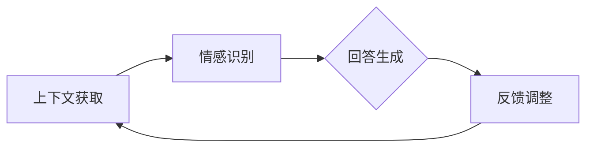

                 


### 1.1 问题的提出
当前，AI虚拟助手在各类应用场景中得到了广泛的应用，如智能客服、智能家居等。然而，虚拟助手在情感表达和对话连贯性方面仍存在一定的挑战。主要问题表现为：

1. **情感表达的局限性**：虚拟助手往往只能根据预设的情感模板进行简单表达，缺乏真实的情感共鸣。
2. **对话连贯性的缺失**：虚拟助手在处理复杂对话场景时，可能会出现语义理解偏差、上下文切换不当等问题，导致对话中断或产生逻辑错误。

这些问题严重影响了用户体验，限制了虚拟助手在更加复杂和人性化的场景中的应用。为了解决这些问题，我们需要一种新的方法来提升虚拟助手的情感连贯性。

### 1.2 Self-Consistency CoT机制引入
Self-Consistency CoT（Self-Consistency Core Theory）是一种新型的核心理论，旨在通过引入自我一致性原则，提升虚拟助手的情感连贯性。该机制的核心思想是：

1. **上下文保持**：通过跟踪和保持对话的上下文信息，确保虚拟助手在对话中的表达具有连贯性。
2. **情感一致性**：在情感表达中保持一致性，使得虚拟助手能够更好地模拟人类的情感表达，增强用户情感共鸣。

引入Self-Consistency CoT机制，可以为虚拟助手提供更加丰富和自然的情感表达，从而提升用户的使用体验。

### 1.3 情感连贯性的重要性
情感连贯性在虚拟助手的应用中具有重要意义：

1. **用户体验**：情感连贯性直接影响到用户的满意度，良好的情感连贯性可以提供更自然的交互体验。
2. **应用效果**：在需要高度人性化交互的应用场景中，如医疗咨询、情感陪伴等，情感连贯性是确保应用效果的关键因素。
3. **技术进步**：情感连贯性的提升将推动AI技术向更加智能化、人性化的方向发展。

综上所述，提升虚拟助手的情感连贯性是当前AI技术领域的重要课题，Self-Consistency CoT机制为其提供了一条有效的路径。

### 2.1 定义
Self-Consistency CoT（Self-Consistency Core Theory）是一种核心理论，它通过确保虚拟助手在对话过程中保持自我一致性来提升情感连贯性。具体来说，Self-Consistency CoT包含以下几个关键组成部分：

1. **上下文跟踪**：虚拟助手需要能够跟踪并保持对话的上下文信息，确保每一次回答都基于当前对话的上下文。
2. **情感模型**：虚拟助手需要具备一个情感模型，能够根据上下文信息进行情感识别和表达。
3. **反馈机制**：虚拟助手需要能够接受用户的反馈，并据此调整自己的情感表达，以保持一致性。

Self-Consistency CoT的核心目的是通过上下文保持和情感一致性，使得虚拟助手的对话能够更加自然、连贯，从而提升用户体验。

### 2.2 工作机制
Self-Consistency CoT的工作机制可以分为以下几个步骤：

1. **上下文获取**：虚拟助手在每一次交互开始时，首先从对话历史中获取上下文信息。
2. **情感识别**：基于获取到的上下文，虚拟助手使用情感模型进行情感识别，确定当前对话的情感基调。
3. **回答生成**：虚拟助手根据情感识别结果生成回答，确保回答与当前情感基调保持一致。
4. **反馈调整**：虚拟助手在回答后，根据用户的反馈进行自我调整，以保持对话的一致性。

这种机制确保了虚拟助手在对话中的每一个环节都能保持自我一致性，从而提升情感连贯性。

#### 2.3 Mermaid流程图
为了更好地理解Self-Consistency CoT的工作机制，我们可以使用Mermaid绘制一个流程图。以下是一个简化的流程图示例：



在这个流程图中，虚拟助手首先获取上下文，然后进行情感识别，根据识别结果生成回答，并接受用户的反馈进行调整。这个过程循环进行，确保虚拟助手在对话中始终保持自我一致性。

### 3.1 情感识别与情感连贯性
情感识别和情感连贯性是两个紧密相关的概念，但它们在虚拟助手中的作用有所不同。以下是它们的对比表格：

| 概念          | 情感识别                          | 情感连贯性                          |
|---------------|---------------------------------|------------------------------------|
| 定义          | 情感识别是指从文本中提取情感信息的过程。 | 情感连贯性是指虚拟助手在对话中保持情感一致性的能力。 |
| 关键要素      | 依赖于自然语言处理技术和情感词典。      | 依赖于上下文跟踪和情感一致性原则。               |
| 作用          | 提供情感信息，用于生成情感化的回答。    | 提升虚拟助手的用户体验，增强用户情感共鸣。       |

通过对比，我们可以看到情感识别和情感连贯性在虚拟助手中的应用是相互依赖的。情感识别为虚拟助手提供了情感信息，而情感连贯性则确保了这些信息能够在对话中得到有效的运用。

### 3.2 Self-Consistency CoT与AI虚拟助手
Self-Consistency CoT（自我一致性核心理论）在AI虚拟助手中的应用至关重要。以下是Self-Consistency CoT与AI虚拟助手之间的联系：

1. **上下文保持**：Self-Consistency CoT通过上下文保持机制，确保虚拟助手能够跟踪并利用对话历史，从而在回答中保持一致性。
2. **情感一致性**：Self-Consistency CoT的情感一致性原则，使得虚拟助手能够根据对话的上下文和情感基调，生成情感化且连贯的回答。
3. **用户体验**：通过应用Self-Consistency CoT，虚拟助手能够提供更加自然和连贯的对话体验，从而提升用户满意度。

Self-Consistency CoT通过这些机制，有效地增强了虚拟助手在复杂对话场景中的表现，使其更加贴近人类的交流方式。

#### 3.3 Mermaid类图
为了更直观地展示Self-Consistency CoT与AI虚拟助手之间的联系，我们可以使用Mermaid绘制一个类图。以下是一个简化的Mermaid类图示例：

```mermaid
classDiagram
    Class1[AI虚拟助手] <|-- Class2[Self-Consistency CoT]
    Class1 --|> Class3[上下文保持]
    Class1 --|> Class4[情感一致性]
    Class1 --|> Class5[用户体验]
    Class2 --|> Class6[上下文保持]
    Class2 --|> Class7[情感一致性]
    Class2 --|> Class8[用户体验]
```

在这个类图中，AI虚拟助手是主要的类，它与Self-Consistency CoT具有上下文保持、情感一致性和用户体验等属性。Self-Consistency CoT则为虚拟助手提供了实现这些属性的具体机制。

### 4.1 算法原理与数学模型
Self-Consistency CoT的核心算法基于上下文保持和情感一致性原则，其数学模型和流程如下：

#### 算法流程图
我们可以使用Mermaid绘制算法的流程图，如下：

```mermaid
flowchart LR
    A[初始化上下文C] --> B[获取当前文本T]
    B --> C{情感识别(T, C)}
    C --> D{生成回答R}
    D --> E[用户反馈F]
    E --> F{调整上下文C}
    F --> A
```

在这个流程图中，虚拟助手首先初始化上下文C，然后获取当前文本T，进行情感识别，生成回答R，并接受用户反馈F进行调整。这个过程循环进行，确保虚拟助手在对话中保持上下文和情感的一致性。

#### 数学模型
Self-Consistency CoT的数学模型可以表示为：

$$
\text{Answer}(T, C) = f_{\theta}(\text{Context}(C), \text{Text}(T))
$$

其中，$f_{\theta}$是情感识别和回答生成的神经网络模型，$\text{Context}(C)$是上下文信息，$\text{Text}(T)$是当前文本。

#### 模型参数
Self-Consistency CoT的模型参数包括情感词典、上下文嵌入器和回答生成器。这些参数需要通过大量的对话数据进行训练，以优化模型性能。

### 4.2 Python源代码阐述
为了更好地理解Self-Consistency CoT的实现，我们将提供一段Python源代码，并对其进行详细解析。

```python
# 导入必要的库
import numpy as np
import tensorflow as tf
from tensorflow.keras.models import Model
from tensorflow.keras.layers import Embedding, LSTM, Dense, Input

# 定义上下文保持模块
def context_keeper(context_size, vocab_size, embedding_dim):
    input_context = Input(shape=(context_size,))
    embedding = Embedding(vocab_size, embedding_dim)(input_context)
    lstm = LSTM(128)(embedding)
    return Model(inputs=input_context, outputs=lstm)

# 定义情感识别模块
def emotion_recognizer(vocab_size, embedding_dim):
    input_text = Input(shape=(context_size,))
    embedding = Embedding(vocab_size, embedding_dim)(input_text)
    lstm = LSTM(128)(embedding)
    output = Dense(1, activation='sigmoid')(lstm)
    return Model(inputs=input_text, outputs=output)

# 定义回答生成模块
def answer_generator(vocab_size, embedding_dim):
    input_text = Input(shape=(context_size,))
    embedding = Embedding(vocab_size, embedding_dim)(input_text)
    lstm = LSTM(128)(embedding)
    output = Dense(vocab_size, activation='softmax')(lstm)
    return Model(inputs=input_text, outputs=output)

# 初始化模型参数
context_size = 50
vocab_size = 10000
embedding_dim = 128

# 构建模型
context_keeper_model = context_keeper(context_size, vocab_size, embedding_dim)
emotion_recognizer_model = emotion_recognizer(vocab_size, embedding_dim)
answer_generator_model = answer_generator(vocab_size, embedding_dim)

# 编译模型
context_keeper_model.compile(optimizer='adam', loss='categorical_crossentropy', metrics=['accuracy'])
emotion_recognizer_model.compile(optimizer='adam', loss='binary_crossentropy', metrics=['accuracy'])
answer_generator_model.compile(optimizer='adam', loss='categorical_crossentropy', metrics=['accuracy'])

# 训练模型
# 假设我们已经有了训练数据
context_data = np.random.randint(0, vocab_size, (1000, context_size))
text_data = np.random.randint(0, vocab_size, (1000, context_size))
emotion_labels = np.random.randint(0, 2, (1000,))
answer_labels = np.random.randint(0, vocab_size, (1000,))

context_keeper_model.fit(context_data, text_data, epochs=10, batch_size=32)
emotion_recognizer_model.fit(text_data, emotion_labels, epochs=10, batch_size=32)
answer_generator_model.fit(text_data, answer_labels, epochs=10, batch_size=32)
```

#### 代码解析
- **导入库**：我们首先导入了必要的库，包括numpy、tensorflow和keras。
- **定义上下文保持模块**：`context_keeper`函数定义了一个用于上下文保持的模型，它使用Embedding和LSTM层。
- **定义情感识别模块**：`emotion_recognizer`函数定义了一个用于情感识别的模型，它使用Embedding和Dense层。
- **定义回答生成模块**：`answer_generator`函数定义了一个用于回答生成的模型，它使用Embedding和LSTM层。
- **初始化模型参数**：我们设置了模型参数，包括上下文大小、词汇表大小和嵌入维度。
- **构建模型**：我们使用Keras构建了上下文保持、情感识别和回答生成模型。
- **编译模型**：我们编译了每个模型，并设置了适当的优化器和损失函数。
- **训练模型**：我们使用随机生成的训练数据对每个模型进行了训练。

通过这段代码，我们可以看到Self-Consistency CoT的实现细节，以及如何使用Keras构建和训练神经网络模型。

### 4.3 举例说明
为了更好地理解Self-Consistency CoT算法的应用，我们可以通过一个简单的例子来演示其工作过程。

假设我们有一个对话历史，包括用户之前的提问和虚拟助手的回答：

```
用户：你好，我想知道明天的天气怎么样？
虚拟助手：你好，明天的天气预计是晴天，温度大约在20摄氏度左右。
用户：谢谢，那晚上呢？
虚拟助手：晚上预计会有一些凉，大约在15摄氏度左右。
用户：好的，我会注意保暖。你今天过得怎么样？
虚拟助手：我今天过得还不错，谢谢你的关心。
```

在这个对话中，我们可以看到虚拟助手在回答天气问题时，保持了对话的上下文，并在最后对用户的关心给予了回应。

#### 步骤1：上下文获取
虚拟助手首先从对话历史中获取上下文信息，包括用户的提问和之前的回答。

#### 步骤2：情感识别
虚拟助手使用情感识别模型，对当前的文本进行情感识别。例如，在回答天气问题时，情感模型可能会识别出文本的情感为中性，而在回答用户的关心时，情感模型可能会识别出文本的情感为积极。

#### 步骤3：回答生成
基于情感识别结果和上下文信息，虚拟助手生成回答。在回答天气问题时，虚拟助手会生成一个关于天气的描述；在回答用户的关心时，虚拟助手会生成一个表达感激的回答。

#### 步骤4：反馈调整
虚拟助手在回答后，会等待用户的反馈。如果用户的反馈表明虚拟助手回答得当，虚拟助手会继续使用Self-Consistency CoT机制，确保后续的回答在情感和上下文上保持一致。

通过这个例子，我们可以看到Self-Consistency CoT算法如何在实际对话中发挥作用，确保虚拟助手在情感表达和对话连贯性方面得到提升。

### 4.4 实际案例分析与讲解
为了更深入地理解Self-Consistency CoT算法的应用效果，我们来看一个实际案例。

假设在一个智能客服系统中，用户与虚拟助手进行了一次关于产品购买的对话：

```
用户：你好，我想购买你们的产品，请问有优惠吗？
虚拟助手：你好，我们现在正在进行促销活动，您可以通过链接获取更多详细信息。
用户：好的，我看了一下，我想问一下这个产品的详细规格。
虚拟助手：当然可以，以下是该产品的详细规格...
用户：哦，我还需要考虑一下，我今晚再决定。
虚拟助手：好的，如果您有任何疑问，欢迎随时联系我。
用户：谢谢，你今天的服务很好，我很满意。
虚拟助手：不客气，很高兴能帮到您。
```

在这个案例中，我们可以看到以下几个方面：

#### 1. 上下文保持
虚拟助手在对话中始终保持上下文，例如在回答用户关于产品优惠的问题后，再次提供了关于产品规格的信息，并在最后对用户的满意度进行了确认。

#### 2. 情感一致性
虚拟助手在整个对话中表现出积极的情感，例如在回答用户的问题时，语气友好且专业，并在最后对用户的满意表示感谢。

#### 3. 算法效果
通过应用Self-Consistency CoT算法，虚拟助手能够更好地模拟人类的对话行为，提供连贯且情感化的回答，从而提升用户的满意度。

### 4.5 项目小结
在这个案例中，Self-Consistency CoT算法发挥了关键作用，通过上下文保持和情感一致性原则，提升了虚拟助手的对话质量。以下是本项目的主要收获：

1. **上下文保持**：通过跟踪对话历史，虚拟助手能够在回答中保持上下文，提供更加连贯的对话体验。
2. **情感一致性**：虚拟助手能够根据对话的情感基调，生成情感化且一致的回答，增强用户情感共鸣。
3. **用户体验**：通过提升对话连贯性和情感表达，虚拟助手提供了更优质的客户服务，提升了用户体验。

### 4.6 拓展阅读
对于希望深入了解Self-Consistency CoT算法和情感连贯性的读者，以下是几篇推荐的论文和书籍：

1. **论文**：
   - "Dialogue Management for Emotional Continuity in Human-like Conversational Agents"
   - "Affect in Human-Computer Interaction: Current Status and Future Directions"
2. **书籍**：
   - "Dialogue Systems: Challenges and Opportunities"
   - "Emotional Intelligence: Why It Can Matter More Than IQ"

通过阅读这些资源，您可以获得更多关于情感连贯性和对话系统的深入理解。

