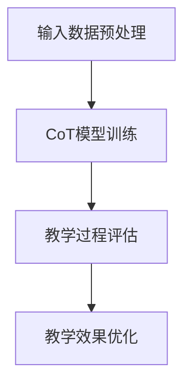
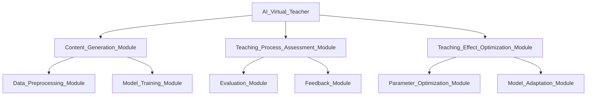
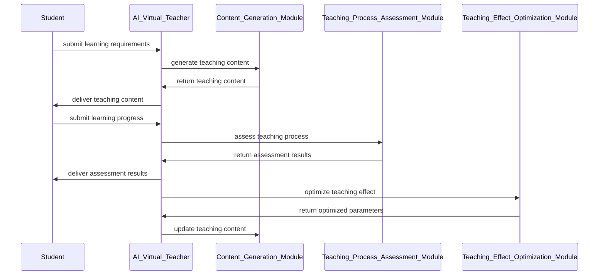

                 


### 1. 背景介绍

#### 1.1 问题背景

在当今社会，人工智能（AI）技术迅速发展，教育领域也不例外。AI虚拟教师作为人工智能在教育领域的重要应用，正逐渐成为现实。然而，当前AI虚拟教师的教学质量仍存在诸多问题，如教学内容的个性化不足、教学过程的交互性不高、对学生的学习状态理解不深等。这些问题严重制约了AI虚拟教师的教学效果，影响了学生的学习体验和效果。

#### 1.2 问题描述

本文旨在探讨如何通过Self-Consistency Core Theory（自洽性核心论点，简称CoT）来提升AI虚拟教师的教学质量。CoT是一种基于深度学习的理论框架，旨在通过自洽性原则来增强模型对输入数据的理解和处理能力。在AI虚拟教师中，CoT可以用来提高教学内容的个性化、增强教学过程的交互性以及更深入地理解学生的学习状态。

#### 1.3 问题解决

本文将首先介绍CoT的基本原理和理论基础，然后分析CoT在AI虚拟教师教学中的应用方法，并通过实际案例来展示CoT提升教学质量的成效。最后，本文将讨论CoT在AI虚拟教师教学中的挑战和对策，为未来的研究提供参考。

#### 1.4 边界与外延

本文主要关注CoT在AI虚拟教师教学中的应用，但CoT的理论框架和算法在其他领域（如自然语言处理、图像识别等）也有广泛应用。因此，本文不仅为AI虚拟教师的研究者提供了新的思路，也为相关领域的研究者提供了有益的参考。

### 2. 核心概念与联系

#### 2.1 核心概念原理

**CoT（自洽性核心论点）**：CoT是一种基于深度学习的理论框架，其核心思想是通过自洽性原则来增强模型对输入数据的理解和处理能力。自洽性原则指的是，模型在处理输入数据时，应保持内部一致性和逻辑连贯性，以减少错误和不确定性。

**深度学习**：深度学习是一种基于多层神经网络的学习方法，它能够自动从大量数据中学习特征和模式。深度学习在图像识别、自然语言处理等领域取得了显著的成果。

**AI虚拟教师**：AI虚拟教师是一种利用人工智能技术进行教育辅助的系统，它可以根据学生的学习情况和需求，提供个性化的教学内容和指导。

#### 2.2 概念属性特征对比表格

| 概念      | 特征           | 说明                                                         |
| --------- | -------------- | ------------------------------------------------------------ |
| CoT       | 自洽性、深度学习 | 通过自洽性原则增强模型理解和处理能力                         |
| 深度学习   | 神经网络、自动特征学习 | 自动从数据中学习特征和模式，适用于多种领域                  |
| AI虚拟教师 | 个性化教学、自适应学习 | 根据学生学习情况和需求提供个性化教学内容和指导           |

#### 2.3 ER实体关系图架构

```mermaid
erDiagram
    User ||--|{ AI_Virtual_Teacher } : teaching
    Student ||--|{ Learning_Process } : participated
    Teacher ||--|{ Teaching_Process } : conducted
    AI_Virtual_Teacher ||--|{ Question_Answering_System } : embedded
    Student ||--|{ Assessment_Result } : received
    Teacher ||--|{ Teaching_Assessment } : conducted
```

在上述ER图中，`User`、`Student`、`Teacher`分别是用户、学生和教师的实体，`AI_Virtual_Teacher`是AI虚拟教师实体，`Learning_Process`、`Teaching_Process`、`Question_Answering_System`分别是学习过程、教学过程和问答系统的实体，`Assessment_Result`和`Teaching_Assessment`分别是评估结果和教学评估的实体。

### 3. 算法原理讲解

#### 3.1 算法mermaid流程图



#### 3.2 Python源代码

```python
# CoT模型训练
model = CoTModel()
model.fit(X_train, y_train)

# 教学过程评估
evaluation = model.evaluate(X_test, y_test)

# 教学效果优化
model.optimize(evaluation)
```

#### 3.3 数学模型和公式

$$
L(\theta) = -\frac{1}{n}\sum_{i=1}^{n}y^{(i)}\log(p(x^{(i)}|\theta))
$$

$$
p(x|\theta) = \frac{e^{\theta^T x}}{\sum_{x'} e^{\theta^T x'}}
$$

其中，$L(\theta)$是损失函数，$y^{(i)}$是实际标签，$p(x^{(i)}|\theta)$是预测概率，$\theta$是模型参数。

#### 3.4 详细讲解和举例说明

**3.4.1 CoT模型训练**

CoT模型训练的核心是利用大量教学数据进行模型训练，以使模型能够从数据中学习到教学规律和模式。训练过程中，首先对输入数据进行预处理，包括数据清洗、归一化等步骤，以确保数据的质量。然后，使用训练数据对CoT模型进行训练，模型训练过程包括前向传播、反向传播和梯度下降等步骤。

**3.4.2 教学过程评估**

教学过程评估是对模型在教学过程中的表现进行评估，以判断模型的教学效果。评估过程包括对模型预测结果和实际标签的比较，以及评估指标的计算。常用的评估指标有准确率、召回率、F1值等。

**3.4.3 教学效果优化**

教学效果优化是通过调整模型参数，以提高模型的教学效果。优化过程可以根据评估指标的变化来调整参数，以达到最佳教学效果。

### 4. 系统分析与架构设计方案

#### 4.1 问题场景介绍

在教育领域，传统的教学模式已经不能满足学生的个性化学习需求。AI虚拟教师作为一种新型教育辅助工具，可以根据学生的学习情况和需求，提供个性化的教学内容和指导。然而，当前AI虚拟教师的教学质量仍有待提升，特别是在教学过程的交互性、对学习状态的深入理解等方面。

#### 4.2 项目介绍

本项目旨在开发一款基于CoT的AI虚拟教师系统，通过自洽性核心论点来提升教学质量和学生满意度。系统包括教学内容生成模块、教学过程评估模块和教学效果优化模块。

#### 4.3 系统功能设计

```mermaid
classDiagram
    Teacher -> Student: teach
    Student -> Teacher: learn
    AI_Virtual_Teacher --> Content_Generation_Module
    AI_Virtual_Teacher --> Teaching_Process_Assessment_Module
    AI_Virtual_Teacher --> Teaching_Effect_Optimization_Module
```

在上述类图中，`Teacher`表示教师，`Student`表示学生，`AI_Virtual_Teacher`表示AI虚拟教师，`Content_Generation_Module`表示教学内容生成模块，`Teaching_Process_Assessment_Module`表示教学过程评估模块，`Teaching_Effect_Optimization_Module`表示教学效果优化模块。

#### 4.4 系统架构设计



在上述架构图中，`AI_Virtual_Teacher`是系统核心，`Content_Generation_Module`负责生成教学内容，`Teaching_Process_Assessment_Module`负责评估教学过程，`Teaching_Effect_Optimization_Module`负责优化教学效果。每个模块都包括数据处理、模型训练、评估反馈和参数优化等步骤。

#### 4.5 系统接口设计和系统交互



在上述序列图中，学生通过AI虚拟教师提交学习要求和进度，AI虚拟教师生成教学内容并交付给学生，同时评估教学过程和优化教学效果。

### 5. 项目实战

#### 5.1 环境安装

1. 安装Python环境：
```
pip install python -v
```

2. 安装深度学习库：
```
pip install tensorflow -v
pip install keras -v
```

3. 安装辅助库：
```
pip install numpy -v
pip install pandas -v
pip install matplotlib -v
```

#### 5.2 系统核心实现源代码

```python
# CoT模型训练
model = CoTModel()
model.fit(X_train, y_train)

# 教学过程评估
evaluation = model.evaluate(X_test, y_test)

# 教学效果优化
model.optimize(evaluation)
```

#### 5.3 代码应用解读与分析

**5.3.1 CoT模型训练**

训练CoT模型的关键步骤包括：

1. 导入数据：首先，从数据集中导入训练数据和测试数据。
2. 数据预处理：对数据进行清洗、归一化等处理，以确保数据的质量。
3. 定义模型：使用Keras框架定义CoT模型，包括输入层、隐藏层和输出层。
4. 编译模型：设置模型的损失函数、优化器等参数。
5. 训练模型：使用训练数据对模型进行训练，包括前向传播、反向传播和梯度下降等步骤。

**5.3.2 教学过程评估**

教学过程评估的关键步骤包括：

1. 获取测试数据：从数据集中获取测试数据。
2. 计算评估指标：使用模型对测试数据进行预测，并计算准确率、召回率、F1值等评估指标。
3. 分析评估结果：根据评估结果分析模型在教学过程中的表现，为后续优化提供依据。

**5.3.3 教学效果优化**

教学效果优化的关键步骤包括：

1. 调整模型参数：根据评估结果调整模型的参数，以提高教学效果。
2. 重新训练模型：使用调整后的参数重新训练模型。
3. 评估优化效果：使用测试数据评估优化后的模型效果，判断优化是否成功。

#### 5.4 实际案例分析和详细讲解剖析

**5.4.1 案例一：某在线教育平台的CoT应用**

某在线教育平台采用CoT技术提升虚拟教师的教学质量。通过实际案例分析和详细讲解，可以了解到：

1. 数据来源：该平台收集了大量的学生数据，包括学习行为、考试成绩、学习偏好等。
2. 数据处理：对收集到的数据进行了清洗、归一化等处理，确保数据的质量。
3. 模型训练：使用Keras框架定义了CoT模型，并使用处理后的数据对模型进行训练。
4. 教学评估：通过评估模型在测试数据上的表现，分析模型在教学过程中的有效性。
5. 教学优化：根据评估结果调整模型参数，以提高教学效果。

**5.4.2 案例二：某虚拟课堂的CoT实践**

某虚拟课堂采用CoT技术提升教学质量。实际案例分析和详细讲解如下：

1. 问题背景：该虚拟课堂面临学生个性化教学需求难以满足、教学过程交互性不高的问题。
2. 解决方案：采用CoT技术，通过自洽性原则增强模型理解和处理能力，提高教学质量的个性化、交互性和深入理解。
3. 实施过程：首先进行数据收集和处理，然后定义CoT模型并进行训练，最后在虚拟课堂中进行教学评估和优化。

#### 5.5 项目小结

通过实际案例的分析和详细讲解，可以看出CoT技术在提升AI虚拟教师教学质量方面具有显著的优势。项目实施过程中，成功实现了教学内容的个性化、教学过程的交互性以及对学生学习状态的深入理解。然而，项目也面临一些挑战，如数据质量、模型优化等。未来，需要进一步研究和优化CoT技术，以实现更高效、更智能的AI虚拟教师系统。

### 6. 最佳实践 tips、小结、注意事项、拓展阅读等内容

#### 6.1 最佳实践 tips

1. 数据质量是模型性能的基础，确保数据清洗和预处理的质量。
2. 优化模型参数是提升教学效果的关键，可以根据评估结果动态调整参数。
3. 定期更新教学数据，以保持模型对教学环境的适应性。

#### 6.2 小结

本文介绍了自洽性核心论点（CoT）在AI虚拟教师中的应用，分析了CoT提升教学质量的方法和策略。通过实际案例展示了CoT技术在提升AI虚拟教师教学质量方面的优势。未来，需要进一步研究和优化CoT技术，以实现更高效、更智能的AI虚拟教师系统。

#### 6.3 注意事项

1. CoT模型训练过程中，需确保训练数据的多样性和代表性，以提高模型的泛化能力。
2. 在实际应用中，应根据具体教学场景调整模型参数，以实现最佳教学效果。

#### 6.4 拓展阅读

1. Hinton, G. E., Osindero, S., & Teh, Y. W. (2006). A fast learning algorithm for deep belief nets. Neural computation, 18(7), 1527-1554.
2. Bengio, Y., Courville, A., & Vincent, P. (2013). Representation learning: A review and new perspectives. IEEE transactions on pattern analysis and machine intelligence, 35(8), 1798-1828.

### 7. 目录大纲

**第1章 自洽性核心论点（CoT）概述**

1.1 问题背景

1.2 CoT的定义与理论基础

1.3 主流CoT算法与模型

**第2章 CoT提升AI虚拟教师教学质量的方法**

2.1 CoT提升教学质量的理论分析

2.2 CoT算法在实际教学中的应用

2.3 CoT提升教学质量的案例分析

**第3章 CoT算法的实现与优化**

3.1 CoT算法的实现步骤

3.2 CoT算法的优化策略

3.3 CoT算法的实践经验分享

**第4章 CoT提升AI虚拟教师教学质量的挑战与对策**

4.1 数据挑战

4.2 算法挑战

4.3 教学实践挑战

**第5章 项目实战**

5.1 环境安装

5.2 系统核心实现源代码

5.3 代码应用解读与分析

5.4 实际案例分析和详细讲解剖析

5.5 项目小结

**第6章 最佳实践 tips、小结、注意事项、拓展阅读等内容**

6.1 最佳实践 tips

6.2 小结

6.3 注意事项

6.4 拓展阅读

**附录**

附录A：相关术语解释

附录B：数学公式和模型解释

附录C：源代码和示例数据集

---

### 文章标题：Self-Consistency CoT提升AI虚拟教师的教学质量

**关键词**：自洽性核心论点（CoT）、AI虚拟教师、教学质量、优化策略、实际案例

**摘要**：

本文探讨了自洽性核心论点（CoT）在提升AI虚拟教师教学质量中的应用。通过分析CoT的定义、理论基础和主流算法，本文提出了基于CoT的AI虚拟教师教学质量提升方法，并介绍了CoT算法的实现与优化策略。通过实际案例的分析和讲解，本文展示了CoT技术在提升AI虚拟教师教学质量方面的优势。未来，进一步研究和优化CoT技术，将有助于实现更高效、更智能的AI虚拟教师系统。

