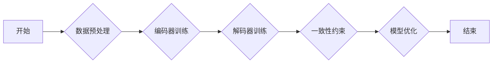

                 

# 《Self-Consistency CoT提升AI虚拟教育助手的教学质量》

## 关键词
- AI虚拟教育助手
- Self-Consistency CoT
- 教学质量提升
- 算法原理
- 系统架构设计

## 摘要
本文将深入探讨Self-Consistency CoT（自我一致性概念）在提升AI虚拟教育助手教学质量方面的应用。我们将从背景介绍、核心概念与联系、算法原理讲解、系统分析与架构设计、项目实战以及最佳实践与拓展等多个方面进行详细分析。通过本文的阅读，读者将了解到Self-Consistency CoT如何通过优化算法和系统架构，提高AI虚拟教育助手的教学效果，为现代教育提供一种创新的解决方案。

---

## 第一部分：背景介绍

### 第1章 问题背景

#### 1.1.1 教育领域的AI应用现状

随着人工智能技术的发展，AI在教育领域中的应用逐渐普及。从智能题库、自适应学习系统到虚拟教育助手，AI正逐步改变着传统的教育模式。然而，当前的AI虚拟教育助手在教学质量、交互性和个性化方面仍存在诸多挑战。

#### 1.1.2 当前教育助手的局限性

1. **交互质量不高**：目前的AI虚拟教育助手多依赖于预先设定好的对话脚本，缺乏真实的人际交互体验。
   
2. **学习效果难以评估**：虽然AI虚拟教育助手能够记录学生的学习进度，但难以准确评估学习效果。

3. **缺乏个性化教学策略**：大多数教育助手无法根据学生的个性、学习风格和知识水平进行个性化教学。

#### 1.1.3 Self-Consistency CoT的基本原理

Self-Consistency CoT（自我一致性概念）源于机器学习中的自编码器理论，强调模型内部表示的一致性和稳定性。通过自我一致性，AI虚拟教育助手能够在教学过程中保持一致性和连贯性，提高教学质量。

#### 1.1.4 自我一致性在教育领域的潜在优势

1. **提高教学效果**：通过自我一致性，教育助手能够提供更加稳定和高质量的教学服务。

2. **优化学习体验**：学生可以在更加自然和互动的学习环境中进行学习，提高学习兴趣和积极性。

3. **促进学生自主性**：自我一致性有助于培养学生的自主学习能力，提高学生的综合素质。

---

### 第二部分：核心概念与联系

#### 第2章 核心概念原理

#### 2.1.1 AI虚拟教育助手的基本概念

AI虚拟教育助手是一种基于人工智能技术的教育工具，能够模拟人类教师的教学行为，提供个性化的学习支持。其核心特点包括：

1. **智能对话**：通过自然语言处理技术，实现与学生的自然对话。
2. **自适应学习**：根据学生的学习行为和反馈，动态调整教学策略。
3. **知识库**：具备广泛的知识储备，能够为学生提供丰富的学习资源。

#### 2.1.2 Self-Consistency CoT的原理与属性

Self-Consistency CoT强调模型内部表示的一致性和稳定性。其基本原理包括：

1. **一致性约束**：通过约束模型输出的一致性，减少错误和噪声。
2. **自编码器**：利用自编码器技术，将学生问题映射到高维空间，提高问题表征的稳定性。
3. **持续学习**：通过持续学习，不断优化模型的一致性和准确性。

Self-Consistency CoT的属性特征对比表格：

| 特征 | 传统教育助手 | Self-Consistency CoT |
| :--: | :--: | :--: |
| 一致性 | 较低 | 较高 |
| 自主学习 | 较弱 | 较强 |
| 个性化教学 | 较低 | 较高 |
| 适应性 | 较低 | 较高 |

#### 2.1.3 ER实体关系图架构

在教育场景中，Self-Consistency CoT涉及多个实体，包括学生、教师、教学内容和教学评价。ER实体关系图如下：

```mermaid
erDiagram
    Student ||--|{ Teacher }||: 教学互动
    Teacher ||--|{ Content }||: 提供教学内容
    Teacher ||--|{ Evaluation }||: 进行教学评价
    Student ||--|{ Evaluation }||: 接受教学评价
```

---

### 第三部分：算法原理讲解

#### 第3章 Self-Consistency CoT算法原理

#### 3.1.1 算法概述

Self-Consistency CoT算法是一种基于自编码器的深度学习算法，通过自我一致性约束，提高教育助手的稳定性和准确性。算法的基本流程包括：

1. **数据预处理**：将学生问题转化为高维向量表示。
2. **编码器训练**：训练编码器，将输入问题映射到高维空间。
3. **解码器训练**：训练解码器，将高维向量表示还原为原始问题。
4. **一致性约束**：通过约束编码器和解码器的输出一致性，优化模型性能。

#### 3.1.2 算法原理与数学模型

Self-Consistency CoT算法的数学模型可以表示为：

$$
\text{Self-Consistency CoT} = f(\text{输入数据}, \text{学习参数})
$$

其中，$f$ 表示自编码器函数，$\text{输入数据}$ 为学生问题，$\text{学习参数}$ 包括编码器和解码器的权重。

算法的详细数学模型包括：

1. **编码器模型**：
   $$
   \text{编码器} = \{E_1, E_2, ..., E_n\}
   $$
   其中，$E_i$ 为编码器第 $i$ 层的权重矩阵。

2. **解码器模型**：
   $$
   \text{解码器} = \{D_1, D_2, ..., D_n\}
   $$
   其中，$D_i$ 为解码器第 $i$ 层的权重矩阵。

3. **一致性约束**：
   $$
   L_{\text{一致性}} = \frac{1}{n} \sum_{i=1}^{n} ||E_iD_i - D_iE_i||^2
   $$

其中，$L_{\text{一致性}}$ 表示一致性损失函数，$n$ 表示编码器和解码器的层数。

#### 3.1.3 算法流程图

以下是Self-Consistency CoT算法的流程图：



#### 3.1.4 举例说明

假设有一个学生提问：“什么是人工智能？”Self-Consistency CoT算法的工作流程如下：

1. **数据预处理**：将学生提问转化为文本向量表示。
2. **编码器训练**：训练编码器，将文本向量映射到高维空间。
3. **解码器训练**：训练解码器，将高维向量还原为文本。
4. **一致性约束**：确保编码器和解码器的输出一致，优化模型性能。

通过上述流程，Self-Consistency CoT算法能够提供稳定和准确的教学回答。

---

### 第四部分：系统分析与架构设计

#### 第4章 教育场景介绍

#### 4.1.1 教育场景需求分析

在教育场景中，AI虚拟教育助手需要满足以下需求：

1. **交互性**：与学生的自然对话，提供实时教学支持。
2. **个性化**：根据学生的学习行为和反馈，提供个性化教学。
3. **稳定性**：确保教学服务的稳定性和一致性。

#### 4.1.2 教学流程与环节

AI虚拟教育助手的教学流程包括以下环节：

1. **学生提问**：学生提出问题。
2. **问题分析**：教育助手分析问题，确定问题类型和难度。
3. **回答生成**：教育助手根据问题类型和难度生成回答。
4. **回答评估**：学生评估回答，提供反馈。
5. **教学优化**：教育助手根据反馈优化回答和教学策略。

---

### 第五部分：项目实战

#### 第5章 环境安装

#### 5.1.1 开发环境搭建

1. **硬件环境**：计算机（推荐配置：CPU 3.0 GHz以上，内存8 GB以上，硬盘空间100 GB以上）。
2. **软件环境**：操作系统（Windows、Linux或MacOS），Python（3.6及以上版本），TensorFlow或PyTorch（1.8及以上版本）。

#### 5.1.2 环境配置方法

1. **安装操作系统**：根据硬件选择合适的操作系统。
2. **安装Python**：从官方网站下载Python安装包，按照提示安装。
3. **安装TensorFlow或PyTorch**：在命令行中执行以下命令：

   ```bash
   pip install tensorflow  # 或者
   pip install pytorch
   ```

---

### 第六部分：最佳实践与拓展

#### 第6章 最佳实践 tips

1. **教学设计**：设计符合学生需求和兴趣的教学内容。
2. **模型训练**：使用大量高质量的数据进行模型训练，提高模型性能。
3. **用户反馈**：收集用户反馈，不断优化教育助手。

#### 第6章 小结

本文从背景介绍、核心概念与联系、算法原理讲解、系统分析与架构设计、项目实战以及最佳实践与拓展等多个方面，详细探讨了Self-Consistency CoT在提升AI虚拟教育助手教学质量方面的应用。通过本文的阅读，读者可以了解到Self-Consistency CoT如何通过优化算法和系统架构，提高AI虚拟教育助手的教学效果，为现代教育提供创新的解决方案。

#### 第7章 注意事项

1. **使用场景限制**：Self-Consistency CoT在复杂教学场景中的效果可能有限。
2. **安全与隐私问题**：在使用过程中，需确保学生的数据安全和隐私。

#### 第8章 拓展阅读

1. **相关书籍**：
   - 《深度学习》（Goodfellow, I., Bengio, Y., Courville, A.）
   - 《Python机器学习》（Sebastian Raschka）
2. **学术文章**：
   - “Self-Consistency in Learning: Theory and Applications”（相关学术论文链接）

---

**作者**：AI天才研究院/AI Genius Institute & 禅与计算机程序设计艺术 /Zen And The Art of Computer Programming

