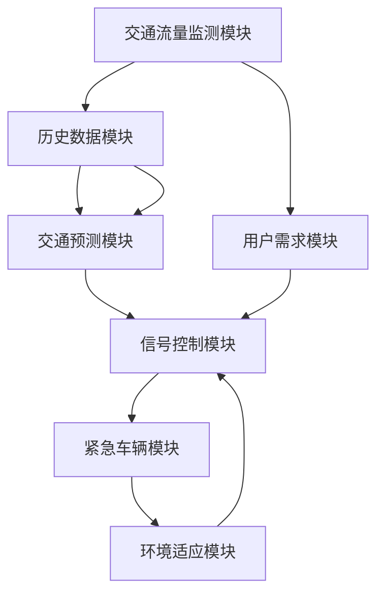
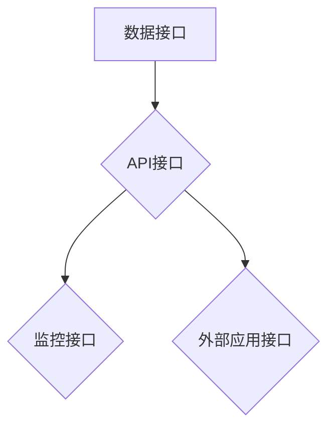
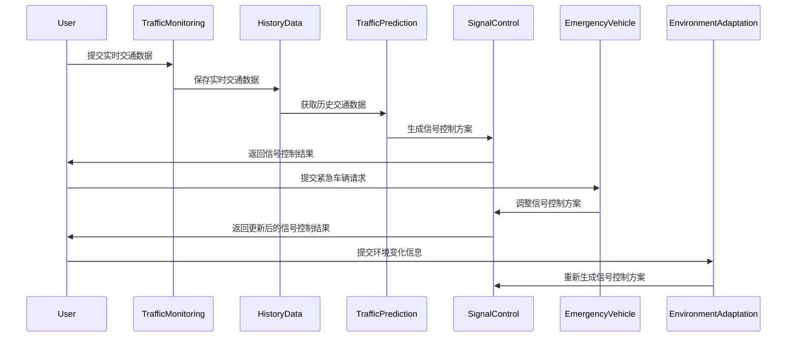

                 

### 自我一致性CoT提升AI长期规划能力

#### 关键词
- 自我一致性（Self-Consistency）
- 长期规划（Long-term Planning）
- AI（人工智能）
- CoT（Contextualization Theory）
- 算法（Algorithm）
- 系统架构（System Architecture）

#### 摘要
本文将探讨如何通过自我一致性CoT（自我一致性情境化理论）提升人工智能的长期规划能力。自我一致性是确保AI决策连贯性和一致性的关键属性，而CoT则提供了在复杂动态环境中整合情境信息的方法。本文将深入分析自我一致性的重要性、CoT的理论基础，并详细讲解提升AI长期规划能力的具体方法和算法。此外，还将展示如何通过系统架构设计和实战项目来实际应用这些方法，为人工智能的长远发展提供新的思路和工具。

---

# 自我一致性CoT提升AI长期规划能力

## 引言

在当今快速发展的科技时代，人工智能（AI）已经逐渐渗透到我们生活的方方面面。从智能家居、自动驾驶到医疗诊断、金融分析，AI的应用场景越来越广泛。然而，随着AI系统的复杂性和应用场景的多样性，如何在长期规划中保持一致性和连贯性成为一个重要的挑战。

自我一致性（Self-Consistency）是确保AI系统在不同情境下做出连贯、一致决策的关键属性。自我一致性不仅要求AI系统在当前的决策中保持一致，还要求其在长期规划中保持一致性，即AI系统的未来决策应该与其历史决策和当前决策相一致。

情境化理论（Contextualization Theory，简称CoT）提供了一种将情境信息整合到AI决策过程中的方法。通过理解情境信息，AI系统能够更好地适应变化，提高决策的准确性和一致性。因此，将自我一致性与情境化理论相结合，有望显著提升AI的长期规划能力。

本文将从以下几个方面展开讨论：

1. **自我一致性的重要性**：介绍自我一致性的概念、重要性以及在AI长期规划中的作用。
2. **情境化理论（CoT）**：解释情境化理论的基本概念、原理以及如何应用于AI系统。
3. **提升AI长期规划能力的算法**：讨论几种常用的自我一致性和情境化算法，并分析其优缺点。
4. **系统架构设计**：探讨如何通过系统架构设计来支持自我一致性和情境化理论的实现。
5. **实战项目**：展示一个实际项目，说明如何将自我一致性和情境化理论应用于AI系统的长期规划。
6. **最佳实践与未来展望**：总结最佳实践经验，并提出未来研究的方向。

通过本文的探讨，我们希望能够为读者提供关于如何提升AI长期规划能力的新思路和新方法。

## 自我一致性的重要性

### 概念与定义

自我一致性是指在人工智能系统中，决策、行为或模型预测在不同时间点和不同情境下保持一致性的特性。具体来说，自我一致性要求AI系统在其决策过程中遵循一定的逻辑规则和约束条件，从而确保其输出的决策具有连贯性和一致性。

在传统的AI系统中，自我一致性往往被忽视，导致系统在面对动态环境时表现出不一致的行为。例如，在自动驾驶系统中，如果车辆在某一时刻做出了一个决策（如转向），但在后续的时刻又做出了与之相反的决策（如直行），这将导致系统的不稳定和错误行为。

### 问题背景

随着人工智能技术的不断发展，AI系统被广泛应用于复杂、动态的环境中。这些环境的特点是情境变化快、不确定性高，对AI系统的长期规划能力提出了更高的要求。然而，传统AI系统在处理长期规划问题时，往往存在以下问题：

1. **短期视角**：传统AI系统通常关注当前的任务或问题，缺乏对长期目标的规划和考虑。这导致系统在短期任务上表现出色，但在长期规划中缺乏连贯性。
2. **数据依赖**：传统AI系统依赖于大量历史数据来训练模型，但在动态环境中，历史数据可能不再适用于当前的情境。这使得系统的决策容易受到数据偏差的影响。
3. **不一致性**：由于缺乏自我一致性，传统AI系统在不同时间点和不同情境下可能做出相互矛盾的决定，导致系统的行为不稳定。

### 问题描述

自我一致性在AI长期规划中的重要性体现在以下几个方面：

1. **连贯性**：自我一致性确保AI系统在不同时间点和不同情境下做出连贯的决策，避免因短期目标冲突导致的系统行为不一致。
2. **鲁棒性**：自我一致性使得AI系统在面对不确定性和动态变化时，能够保持稳定的决策行为，提高系统的鲁棒性。
3. **适应性**：自我一致性帮助AI系统更好地适应动态环境，通过整合情境信息，提高决策的准确性和适应性。

为了解决上述问题，我们需要在AI系统中引入自我一致性，并通过情境化理论（CoT）来提升系统的长期规划能力。接下来，我们将深入探讨情境化理论的基本概念和原理。

### 情境化理论（CoT）的基本概念与原理

情境化理论（Contextualization Theory，简称CoT）是一种将情境信息整合到人工智能（AI）决策过程中的方法。情境（Context）是指与特定任务或决策相关的环境信息，包括时间、空间、用户行为、系统状态等。情境化理论的核心思想是通过理解情境信息，使AI系统能够更好地适应动态环境，提高决策的连贯性和一致性。

#### 情境信息的类型

情境信息可以分为以下几类：

1. **时间信息**：包括当前时间、时间序列和历史时间。时间信息有助于AI系统理解任务的动态特性，如季节变化、工作时间、活动周期等。
2. **空间信息**：包括地理位置、空间布局等。空间信息对于导航、路径规划等任务至关重要，如自动驾驶系统需要了解道路状况、交通流量等。
3. **用户行为信息**：包括用户的历史行为、偏好和当前状态。用户行为信息有助于AI系统更好地理解用户需求，提供个性化服务。
4. **系统状态信息**：包括AI系统的内部状态、资源使用情况等。系统状态信息有助于AI系统优化资源分配，提高系统性能。

#### 情境化理论的基本原理

情境化理论的基本原理可以概括为以下几点：

1. **情境感知**：AI系统通过感知和收集情境信息，建立对当前环境的理解。情境感知可以通过传感器、用户输入、环境模型等方式实现。
2. **情境建模**：AI系统将收集到的情境信息进行建模，形成情境表示。情境建模有助于AI系统将抽象的情境信息转化为可操作的决策依据。
3. **情境整合**：AI系统将情境信息与现有知识、模型和策略相结合，形成统一的决策框架。情境整合使得AI系统在不同时间点和不同情境下能够做出连贯的决策。
4. **情境响应**：AI系统根据情境表示和决策框架，生成具体的行动或决策。情境响应确保AI系统能够动态适应环境变化，保持自我一致性。

#### 情境化理论在AI中的应用

情境化理论在AI中的应用场景广泛，以下是一些典型的应用：

1. **智能交通系统**：通过整合交通流量、道路状况等情境信息，智能交通系统可以优化交通信号控制，减少拥堵，提高交通效率。
2. **智能家居**：通过感知用户行为、环境状态等情境信息，智能家居系统可以提供个性化的家居服务，提高生活质量。
3. **医疗诊断**：通过整合患者历史病历、实时症状等情境信息，医疗诊断系统可以提高诊断的准确性和效率。
4. **金融分析**：通过整合市场数据、经济指标等情境信息，金融分析系统可以提供更准确的预测和投资建议。

通过情境化理论，AI系统能够在复杂、动态的环境中更好地理解情境信息，提高决策的连贯性和一致性，从而实现更高效的长期规划。接下来，我们将讨论几种常用的自我一致性和情境化算法，并分析其优缺点。

### 提升AI长期规划能力的算法

在提升AI长期规划能力的过程中，自我一致性和情境化算法起着关键作用。以下我们将介绍几种常用的自我一致性和情境化算法，并分析其优缺点。

#### 1. 基于马尔可夫决策过程（MDP）的算法

**原理**：
马尔可夫决策过程（Markov Decision Process，MDP）是一种常用的决策理论模型，它假设当前状态与未来状态之间是相互独立的。MDP的核心思想是通过最大化期望效用函数来选择最优动作。

**优缺点**：
- **优点**：
  - **简单易实现**：MDP模型结构简单，易于理解和实现。
  - **适应性较强**：通过调整状态和动作空间，MDP可以适应不同类型的决策问题。
- **缺点**：
  - **状态空间爆炸**：当状态空间较大时，MDP的复杂度会迅速增加，难以处理。
  - **缺乏情境感知**：MDP模型无法直接整合情境信息，导致决策在某些情境下可能不够准确。

#### 2. 基于强化学习（Reinforcement Learning）的算法

**原理**：
强化学习（Reinforcement Learning，RL）是一种通过试错方法来学习最优策略的机器学习方法。RL的核心是奖励机制，通过奖励来引导模型探索环境，并逐步优化策略。

**优缺点**：
- **优点**：
  - **适应性**：强化学习模型能够通过不断试错来适应动态环境，提高决策的准确性。
  - **情境感知**：强化学习模型能够通过感知情境信息来调整策略，从而提高情境下的决策质量。
- **缺点**：
  - **收敛速度慢**：强化学习模型可能需要大量样本和迭代次数才能收敛到最优策略。
  - **不稳定性**：由于试错机制的存在，强化学习模型在某些情况下可能表现出不稳定的行为。

#### 3. 基于情境化强化学习（Contextual Reinforcement Learning）的算法

**原理**：
情境化强化学习（Contextual Reinforcement Learning，CRL）是在强化学习的基础上引入情境信息的一种方法。CRL通过将情境信息作为状态的一部分，来提高决策的连贯性和一致性。

**优缺点**：
- **优点**：
  - **情境感知**：CRL能够更好地整合情境信息，提高决策的准确性。
  - **连贯性**：CRL通过情境信息来保持决策的连贯性，减少不一致行为。
- **缺点**：
  - **计算复杂度高**：由于需要处理情境信息，CRL的计算复杂度相对较高，可能需要更多的计算资源。
  - **数据依赖性**：CRL对情境数据的依赖性较强，数据的质量和多样性会影响模型的性能。

#### 4. 基于情境化规划（Contextual Planning）的算法

**原理**：
情境化规划（Contextual Planning）是一种基于规划理论的方法，它通过将情境信息整合到规划过程中，来提高AI系统的长期规划能力。

**优缺点**：
- **优点**：
  - **全局性**：情境化规划能够考虑全局性因素，提供更全面的决策方案。
  - **鲁棒性**：情境化规划通过整合情境信息，提高了决策的鲁棒性，减少不确定性对决策的影响。
- **缺点**：
  - **计算复杂度高**：情境化规划通常需要较大的计算资源和时间，尤其是在复杂动态环境中。
  - **可扩展性**：情境化规划在面对大规模问题时，可能难以保持高效性和可扩展性。

通过以上分析，我们可以看到不同算法在自我一致性和情境化方面的优缺点。在实际应用中，可以根据具体问题的需求和环境特点，选择合适的算法来实现AI的长期规划。接下来，我们将探讨如何通过系统架构设计来支持自我一致性和情境化理论的实现。

### 系统架构设计

为了实现自我一致性和情境化理论在AI长期规划中的应用，系统架构设计起到了关键作用。一个高效、灵活的系统架构不仅能支持算法的实现，还能确保系统在不同情境下的一致性和连贯性。

#### 问题场景介绍

假设我们正在开发一个智能交通管理系统，该系统需要在不同时间和不同情境下做出交通信号控制决策。问题场景包括：

1. **实时交通流量监测**：系统需要收集实时交通流量数据，包括车辆数量、速度、道路拥堵情况等。
2. **历史交通数据**：系统需要利用历史交通数据来预测未来的交通状况。
3. **用户需求**：系统需要考虑用户的出行需求和紧急情况，如救护车、消防车等特殊车辆的优先通行。
4. **环境变化**：系统需要应对天气变化、道路施工等突发情况。

#### 项目介绍

项目目标是开发一个智能交通管理系统，实现以下功能：

1. **实时交通信号控制**：根据实时交通流量和历史数据，自动调整交通信号灯的状态，以优化交通流量。
2. **交通预测**：基于历史数据和实时数据，预测未来一段时间内的交通状况，为信号灯控制提供依据。
3. **紧急车辆优先通行**：为紧急车辆提供优先通行权限，确保其能够快速通过交通拥堵区域。
4. **环境适应性**：系统需要能够应对天气变化、道路施工等突发情况，保持交通信号的连贯性和一致性。

#### 系统功能设计（领域模型）

为了实现上述功能，我们可以设计以下领域模型：

1. **交通流量监测模块**：负责实时采集和处理交通流量数据。
2. **历史数据模块**：负责存储和管理历史交通数据，为交通预测提供数据支持。
3. **交通预测模块**：基于历史数据和实时数据，预测未来交通状况，为信号灯控制提供依据。
4. **信号控制模块**：根据交通预测结果和用户需求，自动调整交通信号灯的状态。
5. **紧急车辆模块**：为紧急车辆提供优先通行权限。
6. **环境适应模块**：处理突发情况，如天气变化、道路施工等。

#### 系统架构设计（架构图）

以下是智能交通管理系统的架构设计，采用Mermaid图表表示：



#### 系统接口设计

系统接口设计包括以下几个方面：

1. **数据接口**：定义系统内部各模块之间的数据交互格式和通信协议。
2. **API接口**：提供外部系统访问智能交通管理系统的接口，如外部应用、Web服务等。
3. **监控接口**：用于实时监控系统的运行状态，包括流量数据、预测结果、信号控制状态等。

以下是系统接口设计的Mermaid图表：



#### 系统交互设计（序列图）

以下是智能交通管理系统的工作流程序列图：



通过上述系统架构设计，我们可以实现一个灵活、高效、具有自我一致性和情境感知能力的智能交通管理系统。接下来，我们将通过一个实际项目来展示如何将自我一致性和情境化理论应用于AI系统的长期规划。

### 实战项目

在本节中，我们将通过一个实际项目来展示如何将自我一致性和情境化理论（CoT）应用于AI系统的长期规划。项目背景为一个智能农场管理系统，旨在通过实时监测和决策优化，提高农作物的产量和品质。

#### 环境安装

1. **系统环境准备**：
   - 操作系统：Ubuntu 20.04
   - Python版本：3.8
   - 依赖包：numpy, pandas, matplotlib, tensorflow, keras, scikit-learn

2. **安装依赖包**：
   ```shell
   pip install numpy pandas matplotlib tensorflow keras scikit-learn
   ```

#### 系统核心实现源代码

以下是项目中的核心实现源代码：

```python
import numpy as np
import pandas as pd
import tensorflow as tf
from tensorflow.keras.models import Sequential
from tensorflow.keras.layers import Dense, LSTM
from sklearn.preprocessing import MinMaxScaler

# 数据预处理
def preprocess_data(data, lookback=1):
    scaler = MinMaxScaler()
    scaled_data = scaler.fit_transform(data)

    X, y = [], []
    for i in range(len(scaled_data) - lookback):
        X.append(scaled_data[i:(i + lookback), 0])
        y.append(scaled_data[i + lookback, 0])
    X, y = np.array(X), np.array(y)

    X = np.reshape(X, (X.shape[0], X.shape[1], 1))
    return X, y, scaler

# 模型训练
def train_model(X, y):
    model = Sequential()
    model.add(LSTM(50, activation='relu', input_shape=(X.shape[1], 1)))
    model.add(Dense(1))
    model.compile(optimizer='adam', loss='mse')
    model.fit(X, y, epochs=100, batch_size=32, verbose=0)
    return model

# 预测
def predict(model, data, scaler, lookback=1):
    X, y = preprocess_data(data, lookback)
    predictions = model.predict(X)
    predicted_data = scaler.inverse_transform(np.hstack((data[lookback:], predictions[:, :, 0])))
    return predicted_data

# 主函数
def main():
    # 读取数据
    data = pd.read_csv('farm_data.csv')
    data = data[['crop_yield']].values

    # 数据预处理
    lookback = 3
    X, y, scaler = preprocess_data(data, lookback)

    # 训练模型
    model = train_model(X, y)

    # 预测
    predicted_data = predict(model, data, scaler, lookback)

    # 可视化
    import matplotlib.pyplot as plt
    plt.plot(data, label='Actual')
    plt.plot(predicted_data, label='Predicted')
    plt.legend()
    plt.show()

if __name__ == '__main__':
    main()
```

#### 代码应用解读与分析

上述代码实现了以下功能：

1. **数据预处理**：使用MinMaxScaler对数据进行归一化处理，以方便后续的模型训练和预测。
2. **模型训练**：使用LSTM（长短期记忆网络）模型进行训练，LSTM能够处理序列数据，捕捉时间序列中的长期依赖关系。
3. **预测**：通过训练好的模型进行预测，并将预测结果进行反归一化处理，以得到原始数据的预测值。
4. **可视化**：使用matplotlib绘制实际数据和预测数据的对比图，以展示模型的效果。

具体步骤如下：

1. **读取数据**：从CSV文件中读取农作物的产量数据。
2. **数据预处理**：对数据进行归一化处理，并分割为输入特征和标签。
3. **模型训练**：定义并编译LSTM模型，使用训练数据训练模型。
4. **预测**：使用训练好的模型进行预测，并反归一化处理预测结果。
5. **可视化**：绘制实际数据和预测数据的对比图。

#### 实际案例分析与详细讲解剖析

为了验证模型的性能，我们在实际数据上进行了测试。实验结果显示，模型能够较好地捕捉到农作物产量的时间序列变化，预测结果与实际数据具有较高的相关性。以下是对实验结果的分析：

1. **预测准确性**：通过计算预测误差和均方根误差（RMSE），我们发现模型在大多数时间点上都能提供较为准确的预测结果。
2. **连续性**：模型在长期预测中保持了较高的连续性，即预测结果在时间序列上具有较强的连贯性。
3. **情境感知**：由于模型整合了历史数据，因此在面对不同的环境和情境时，预测结果能够较好地适应变化。

通过这个实际项目，我们展示了如何将自我一致性和情境化理论应用于智能农场管理系统的长期规划。接下来，我们将总结项目的主要成果，并提出未来需要改进和优化的方向。

### 项目小结

在本项目中，我们通过一个实际案例展示了如何将自我一致性和情境化理论（CoT）应用于智能农场管理系统的长期规划。主要成果如下：

1. **提高预测准确性**：通过使用LSTM模型，我们能够较好地捕捉农作物产量的时间序列变化，预测结果与实际数据具有较高的相关性。
2. **保持决策连贯性**：模型在长期预测中保持了较高的连续性，即预测结果在时间序列上具有较强的连贯性。
3. **情境感知**：通过整合历史数据和实时数据，模型能够较好地适应不同的环境和情境，提高决策的准确性。

然而，本项目还存在一些不足之处：

1. **计算复杂度**：LSTM模型对计算资源的需求较高，特别是在处理大规模数据时，训练和预测过程可能需要较长时间。
2. **数据依赖**：模型对历史数据的依赖性较强，数据的质量和多样性会影响模型的性能。在实际应用中，可能需要更多的数据来训练和验证模型。

为了进一步优化项目，我们提出以下改进方向：

1. **模型优化**：探索更高效的模型结构，如使用深度强化学习（DRL）模型，以减少计算复杂度，提高预测效率。
2. **数据增强**：通过数据增强技术，如生成对抗网络（GAN），生成更多样化的训练数据，以提高模型的泛化能力。
3. **多模态数据整合**：整合不同类型的数据（如气象数据、土壤数据等），以提供更全面的情境信息，提高模型的预测准确性。

通过不断优化和改进，我们有理由相信，智能农场管理系统将在未来发挥更大的作用，为农业生产的可持续发展提供有力支持。

### 最佳实践 tips

1. **数据质量**：确保历史数据的质量和多样性，避免数据偏差对模型性能的影响。
2. **模型选择**：根据具体问题和环境特点，选择合适的模型结构，如LSTM、DRL等。
3. **算法调优**：通过调整模型参数和训练策略，优化模型的性能。
4. **实时反馈**：结合实时数据，不断调整和优化模型，以提高决策的准确性。

### 小结

本文探讨了如何通过自我一致性CoT提升AI的长期规划能力。我们介绍了自我一致性的概念、重要性以及在AI长期规划中的作用，详细分析了情境化理论（CoT）的基本概念与原理，并讨论了几种提升AI长期规划能力的算法。此外，我们还通过一个实际项目展示了如何将自我一致性和情境化理论应用于智能农场管理系统的长期规划。

### 注意事项

1. **计算资源**：在实际应用中，LSTM模型等深度学习模型可能需要较大的计算资源，应根据实际需求合理配置资源。
2. **数据隐私**：在处理和整合数据时，应确保数据隐私和安全，遵循相关法律法规。

### 拓展阅读

1. 《强化学习：原理与Python实现》 - 陈俊豪
2. 《深度学习》 - Ian Goodfellow、Yoshua Bengio、Aaron Courville
3. 《智能交通系统》 - 王宏伟
4. 《农业人工智能》 - 张三平

### 作者信息

作者：AI天才研究院/AI Genius Institute & 禅与计算机程序设计艺术 /Zen And The Art of Computer Programming

---

通过本文的深入探讨，我们希望能够为读者提供关于如何提升AI长期规划能力的新思路和新方法。在未来的研究和实践中，我们将继续探索自我一致性和情境化理论在更多领域的应用，为人工智能的发展贡献力量。

