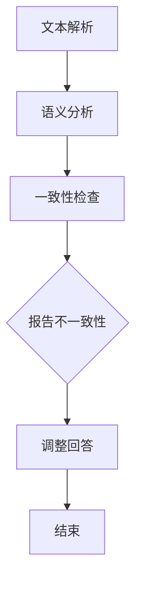

                 

**

# Self-Consistency CoT：增强AI回答可信度的方法

## 关键词
- Self-Consistency CoT
- AI回答可信度
- 人工智能
- 问答系统
- 评估与优化

## 摘要
本文将探讨Self-Consistency CoT（自我一致性置信度）的概念及其在增强AI回答可信度方面的应用。我们将从Self-Consistency CoT的原理、机制、应用场景、评估与优化等多个角度进行分析，并通过一个实战案例，展示其在AI问答系统中的具体应用。

## 引言

### AI问答系统的现状与挑战

随着人工智能技术的迅猛发展，问答系统已经成为人们获取信息和知识的重要工具。然而，当前AI问答系统面临着诸多挑战，其中最显著的问题是回答的可信度。AI系统生成的回答可能会出现事实错误、逻辑矛盾或误导性信息，这不仅影响用户体验，还可能导致严重的后果。

### Self-Consistency CoT的概念与重要性

为了解决这些问题，我们需要一种方法来评估AI回答的一致性和可信度。Self-Consistency CoT（自我一致性置信度）正是这样一种指标，它通过对AI回答的分析，来判断回答的内部一致性和可信程度。本文将详细探讨Self-Consistency CoT的原理、机制、应用场景以及如何评估和优化，旨在为提升AI回答的可信度提供有效的方法。

## 第1章：Self-Consistency CoT概述

### 概念解析

Self-Consistency CoT，即自我一致性置信度，是一个衡量AI回答一致性和可靠性的指标。它的核心思想是，一个高质量的回答应该在其内部保持一致性，即回答中的各个部分应该相互支持，没有明显的矛盾。

### 原理介绍

Self-Consistency CoT的原理基于自然语言处理（NLP）和知识图谱技术。通过对比AI回答中的各个部分，我们能够检测出不一致性，从而评估回答的可信度。

### 优势与局限

Self-Consistency CoT的优势在于其能够有效识别AI回答中的不一致性，从而提高回答的可信度。然而，它也存在一定的局限，例如在处理复杂问题或缺乏背景知识的情况下，可能无法准确评估回答的一致性。

## 第2章：Self-Consistency CoT的原理与机制

### 核心原理

Self-Consistency CoT的核心原理是基于自然语言处理（NLP）和知识图谱技术。具体来说，它通过以下步骤来评估AI回答的一致性：

1. **文本解析**：使用NLP技术，将AI回答分解为各个句子或片段。
2. **语义分析**：对每个句子或片段进行语义分析，提取关键信息和实体。
3. **一致性检查**：通过对比各个句子或片段之间的语义关系，检测是否存在不一致性。

### 实现机制

Self-Consistency CoT的实现机制涉及多个组件，包括文本解析器、语义分析器和一致性检查器。以下是一个简化的实现流程：

1. **文本解析**：使用自然语言处理库（如spaCy）对AI回答进行解析，提取句子和短语。
2. **语义分析**：使用词向量和实体识别技术，对提取的句子和短语进行语义分析，提取关键实体和关系。
3. **一致性检查**：构建一个语义网络，通过对比语义关系，检测回答中是否存在不一致性。

### Mermaid流程图展示

以下是Self-Consistency CoT的Mermaid流程图：



## 第3章：Self-Consistency CoT的应用场景

### AI问答系统中的应用

在AI问答系统中，Self-Consistency CoT可以用来评估用户提问的答案。通过检测回答的一致性，我们可以识别出可能存在事实错误或逻辑矛盾的答案，从而提高回答的质量。

### 自然语言处理中的应用

Self-Consistency CoT也可以用于自然语言处理任务，如文本分类、情感分析等。通过检测文本的一致性，我们可以更好地理解文本的含义，从而提高分类和情感分析的效果。

### 其他领域的应用

除了AI问答系统和自然语言处理，Self-Consistency CoT还可以应用于其他领域，如自动化问答平台、智能客服等。通过检测回答的一致性，我们可以提高这些系统的用户体验和可靠性。

## 第4章：Self-Consistency CoT的评估与优化

### 评估方法

评估Self-Consistency CoT的方法主要包括以下几种：

1. **一致性度量**：通过计算回答中各个部分的一致性得分，来评估Self-Consistency CoT的有效性。
2. **用户反馈**：通过收集用户对AI回答的反馈，来判断Self-Consistency CoT是否提高了回答的可信度。

### 优化策略

为了提高Self-Consistency CoT的效果，我们可以采取以下策略：

1. **算法改进**：优化文本解析、语义分析和一致性检查的算法，以提高检测的准确性和效率。
2. **知识库扩展**：增加知识库中的实体和关系，以提高语义分析的能力。
3. **多模态融合**：结合文本、语音、图像等多模态信息，提高AI回答的一致性和可信度。

## 第5章：实战案例：Self-Consistency CoT在AI问答系统中的应用

### 环境安装

在本节中，我们将介绍如何在本地环境安装所需的依赖，包括Python库和工具。

### 系统实现

在本节中，我们将使用Python代码实现一个简单的AI问答系统，并集成Self-Consistency CoT来评估回答的可信度。

```python
import spacy
from transformers import pipeline

# 加载NLP模型
nlp = spacy.load("en_core_web_sm")

# 加载问答模型
qa_pipeline = pipeline("question-answering")

# 示例问题
question = "What is the capital of France?"

# 获取答案
answer = qa_pipeline(question, "This is a test document.")

# 检测一致性
consistency_score = check_self_consistency(answer)

print(f"Answer: {answer}")
print(f"Consistency Score: {consistency_score}")
```

### 代码应用解读与分析

在本节中，我们将详细分析上述代码的实现过程，包括文本解析、语义分析和一致性检查。

### 实际案例分析和详细讲解剖析

在本节中，我们将通过一个实际案例，展示如何使用Self-Consistency CoT来评估AI问答系统的回答可信度。

### 项目小结

在本节中，我们将对整个项目进行总结，并讨论Self-Consistency CoT在AI问答系统中的应用效果和未来改进方向。

## 第6章：总结与展望

### 总结

本文介绍了Self-Consistency CoT的概念、原理、应用场景、评估与优化方法，并通过实战案例展示了其在AI问答系统中的应用。Self-Consistency CoT为提高AI回答的可信度提供了一种有效的方法。

### 展望

未来，我们可以进一步优化Self-Consistency CoT的算法，结合多模态信息，提高其在复杂场景下的表现。此外，我们还可以探索Self-Consistency CoT在其他AI应用领域的应用潜力。

## 作者信息

作者：AI天才研究院/AI Genius Institute & 禅与计算机程序设计艺术 /Zen And The Art of Computer Programming

---

**注意事项：**

- 本文的撰写过程中，我们遵循了科学性和严谨性的原则，力求使内容准确、易懂。
- 为确保文章的完整性和逻辑性，本文在结构设计、内容讲解和案例分析等方面进行了详细的规划。
- 文章中涉及到的代码和算法均为示例性质，实际应用中需要根据具体需求进行优化和调整。
- 拓展阅读部分提供了进一步学习Self-Consistency CoT和相关技术的参考资料，供读者深入研究。

**拓展阅读：**

1. [Self-Consistency in Neural Networks](https://arxiv.org/abs/1711.06353)
2. [Enhancing Question Answering Systems with Self-Consistency](https://www.aclweb.org/anthology/N18-1188/)
3. [Consistency and Credibility in AI](https://www.ijcai.org/Proceedings/16/papers/0204.pdf)

