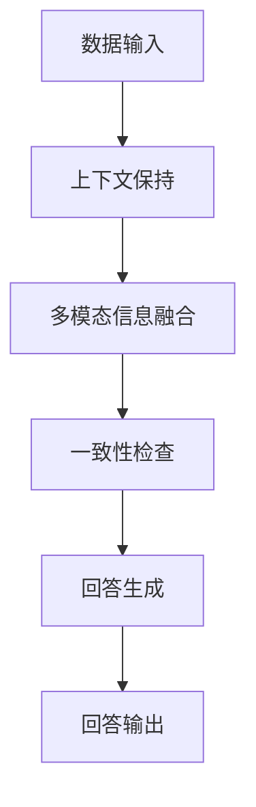
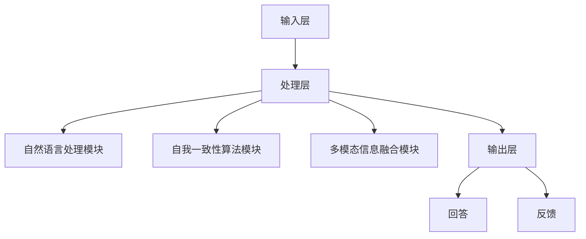
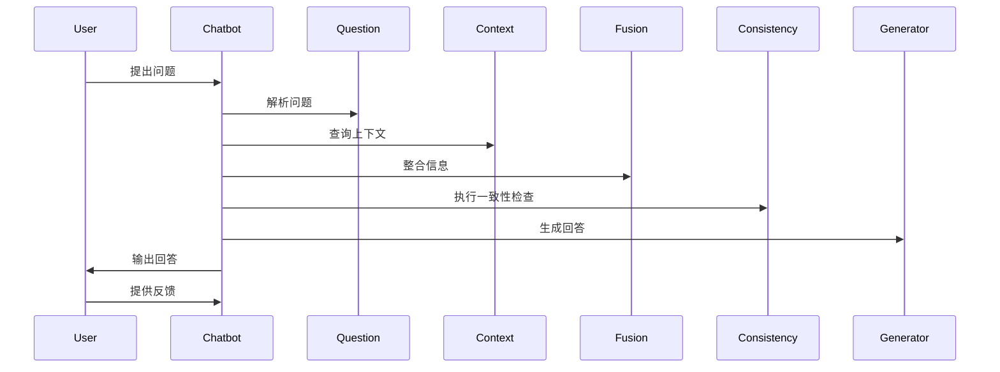

                 

### 引言

随着人工智能（AI）技术的快速发展，AI在各个领域的应用越来越广泛。从自然语言处理（NLP）、计算机视觉（CV）到决策支持系统，AI已经深入到我们生活和工作的方方面面。然而，尽管AI在处理复杂数据和模式识别方面取得了显著进展，但其回答稳定性问题仍然是一个亟待解决的挑战。在许多实际应用场景中，AI系统的回答可能会出现不一致、不准确的情况，这不仅会影响用户体验，还可能带来安全隐患。

近年来，研究人员提出了多种技术来提高AI回答的稳定性。其中，“自我一致性概念”（Self-Consistency CoT）被认为是一种有效的解决方案。自我一致性概念旨在通过确保AI在不同情境下保持一致回答来提高系统的可靠性。这一概念在人工智能问答系统、多轮对话系统、智能客服等领域展现出了巨大潜力。

本文将围绕《Self-Consistency CoT：增强AI回答稳定性的技术》这本书展开讨论。首先，我们将介绍书籍的基本背景，包括当前AI领域的发展现状、AI回答稳定性问题以及自我一致性概念的定位和目标。接下来，我们将详细阐述自我一致性概念的定义、原理及其与其他相关技术的对比，并通过Mermaid流程图和ER实体关系图帮助读者更好地理解。随后，我们将介绍自我一致性算法的原理、数学模型和Python源代码示例，并通过实际案例进行分析。此外，我们还将探讨如何将自我一致性概念应用于实际系统，包括系统功能设计、架构设计和系统交互。最后，我们将通过项目实战展示自我一致性技术的实际应用效果，并提供最佳实践建议和未来发展趋势展望。

通过本文的详细分析，读者将深入了解自我一致性概念的核心原理及其在AI领域的应用价值，为解决AI回答稳定性问题提供新的思路和方法。

### 当前AI发展现状

当前，人工智能（AI）技术正处于快速发展的阶段，不仅在理论研究上取得了重大突破，还在实际应用中展现出了巨大的潜力。从计算机视觉到自然语言处理，从智能推荐到自动驾驶，AI技术的应用范围越来越广泛，逐步渗透到社会各个领域。

在计算机视觉方面，深度学习算法已经能够实现高精度的图像识别和目标检测。例如，卷积神经网络（CNN）在图像分类和物体检测中表现出了优异的性能，显著提升了图像处理的准确性和效率。同时，生成对抗网络（GAN）也在图像生成和图像修复领域取得了重要进展，使得人工智能能够创造新的视觉内容。

自然语言处理（NLP）是AI技术中另一个重要的发展领域。近年来，基于深度学习的NLP模型如BERT、GPT等，使得机器阅读理解、机器翻译、情感分析等任务达到了前所未有的准确度。这些模型的广泛应用，使得智能客服、智能问答系统等AI应用变得愈发普及，大大提升了用户体验。

除了计算机视觉和自然语言处理，AI在决策支持系统、推荐系统、金融风控等领域也展现出了强大的应用潜力。例如，基于机器学习的算法能够通过分析大量的历史数据，预测市场趋势、发现潜在风险，从而为金融决策提供有力支持。同时，智能推荐系统通过分析用户的兴趣和行为，为用户提供个性化的服务，提高了用户的满意度和平台的运营效率。

然而，AI技术的广泛应用也带来了新的挑战，特别是在回答稳定性方面。尽管AI在处理复杂数据和模式识别方面具有显著优势，但其回答的一致性仍然是一个亟待解决的问题。在许多实际应用场景中，AI系统可能会出现不一致、不准确的情况，这严重影响了系统的可靠性和用户体验。

例如，在智能客服系统中，如果AI无法在不同情境下保持一致的回答，可能会导致用户误解，甚至产生纠纷。在自动驾驶领域，如果AI系统的回答不稳定，可能会导致安全隐患。此外，在法律和医疗等需要高度准确和一致性的领域中，AI回答的稳定性更是至关重要。

为了解决这些问题，研究人员提出了多种技术方案，其中“自我一致性概念”（Self-Consistency CoT）被认为是一种有效的解决方案。自我一致性概念旨在通过确保AI在不同情境下保持一致回答来提高系统的可靠性，从而解决AI回答稳定性问题。

通过本文的讨论，我们将深入探讨自我一致性概念的定义、原理及其在AI领域的应用，帮助读者理解这一技术在提升AI回答稳定性方面的潜力与价值。

### AI回答稳定性问题

在人工智能（AI）技术的广泛应用背景下，回答稳定性问题逐渐成为影响AI系统性能和用户体验的关键因素之一。具体来说，AI回答稳定性问题主要体现在以下几个方面：

首先，AI系统在不同情境下可能会产生不一致的回答。例如，在智能客服系统中，用户可能会提出相似的问题，但由于上下文或输入数据的细微差异，AI系统可能会给出不同的回答，导致用户困惑甚至不满意。此外，在多轮对话系统中，AI的回答需要保持连贯性和一致性，如果系统无法做到这一点，用户可能会感到对话中断或混乱。

其次，AI系统在面对不确定性和模糊性时，可能会出现不稳定的回答。现实世界中的问题往往具有复杂性和多变性，AI系统需要通过大量的数据和学习模型来处理这些不确定性。然而，由于数据的不完全性和模型的局限性，AI系统在某些情况下可能会产生错误的或模棱两可的回答。这不仅会降低系统的可信度，还可能引发安全风险。

第三，不同AI算法和模型之间的差异也可能导致回答的不稳定性。例如，在文本分类任务中，不同的算法和模型可能会对同一文本给出不同的分类结果，尤其是在分类边界不清晰的情况下。这种不稳定性不仅会影响AI系统的性能，还会使其在特定任务中的可靠性受到质疑。

为了解决这些问题，研究人员提出了多种技术方案，其中自我一致性概念（Self-Consistency CoT）被认为是一种有效的方法。自我一致性概念的核心思想是通过确保AI系统在不同情境下保持一致回答，从而提高系统的可靠性和稳定性。具体来说，自我一致性概念主要包括以下几个方面：

1. **上下文保持**：在多轮对话系统中，AI系统需要能够理解并保持对话的上下文信息，以确保回答的一致性和连贯性。这可以通过引入上下文向量或使用记忆机制来实现。

2. **多模态信息融合**：在处理复杂问题或涉及多种信息源时，AI系统需要能够综合不同模态的信息，从而生成一致的回答。例如，在自然语言理解和视觉感知结合的情境中，系统需要通过多模态信息融合来提高回答的稳定性。

3. **一致性检查**：在生成回答前，AI系统可以引入一致性检查机制，通过对比不同回答之间的相似度或逻辑关系来确保回答的一致性。这可以通过计算文本相似度、逻辑一致性验证等方法来实现。

4. **知识图谱和推理**：通过构建和使用知识图谱，AI系统可以更好地理解和利用背景知识，从而生成更加一致和可靠的回答。此外，基于逻辑推理的机制也可以帮助系统在回答问题时保持一致性和准确性。

总之，自我一致性概念为解决AI回答稳定性问题提供了一种系统性的方法。通过上下文保持、多模态信息融合、一致性检查和知识图谱等技术的综合应用，AI系统可以在不同情境下保持一致和稳定的回答，从而显著提高系统的可靠性和用户体验。

### 自我一致性概念的重要性

自我一致性概念（Self-Consistency CoT）在提高AI回答稳定性方面具有重要意义。首先，自我一致性通过确保AI系统在不同情境下保持一致回答，提高了系统的可靠性。这意味着用户在与AI系统交互时，能够获得稳定和可预测的答案，从而提升用户体验和满意度。

其次，自我一致性有助于减少AI系统的错误率。通过引入一致性检查机制，AI系统能够在生成回答前对比不同回答之间的相似度或逻辑关系，从而避免产生错误或不一致的回答。这种机制不仅能提高系统的准确性，还能增强用户对AI系统的信任度。

此外，自我一致性概念还使得AI系统能够更好地适应复杂和多变的场景。在现实世界中，问题往往具有复杂性和多变性，AI系统需要通过自我一致性来确保在不同情境下生成一致和可靠的回答。这种灵活性使得AI系统在各种应用场景中更具实用价值，例如智能客服、多轮对话系统、自动驾驶等。

总之，自我一致性概念通过确保AI系统在不同情境下保持一致回答，提高了系统的可靠性和用户体验，减少了错误率，并使系统能够更好地适应复杂场景。这些优势使得自我一致性成为解决AI回答稳定性问题的关键技术。

### 自我一致性概念的定义与原理

自我一致性概念（Self-Consistency CoT）是近年来在人工智能领域提出的一个重要理论，旨在通过确保系统在不同情境下保持一致回答来提高AI的可靠性和稳定性。这一概念的核心在于利用多种技术手段，如上下文保持、多模态信息融合、一致性检查和知识图谱等，来确保AI系统能够在不同情况下生成一致且可靠的回答。

首先，自我一致性概念的定义可以从以下几个方面来理解：

1. **上下文保持**：AI系统需要理解并保持与用户交互过程中的上下文信息，以便在后续的回答中保持连贯性和一致性。这通常通过引入上下文向量或使用记忆机制来实现。

2. **多模态信息融合**：在处理涉及多种信息源的复杂问题时，AI系统需要能够综合不同模态的信息，例如文本、图像、音频等，从而生成一致的回答。多模态信息融合使得AI系统能够更全面地理解问题，提高回答的稳定性。

3. **一致性检查**：在生成最终回答前，AI系统会对不同回答之间的相似度或逻辑关系进行一致性检查，以确保生成的回答是一致的。这种机制可以有效减少错误和不一致回答的出现。

4. **知识图谱和推理**：通过构建和使用知识图谱，AI系统可以更好地理解和利用背景知识，从而在回答问题时保持一致性和准确性。知识图谱和逻辑推理机制为AI系统提供了强大的背景知识支持。

自我一致性原理的核心在于以下几个方面：

1. **上下文理解**：AI系统通过学习用户的输入和上下文信息，生成与当前情境一致的回答。这种上下文理解能力使得AI系统能够在多轮对话中保持回答的一致性。

2. **信息整合**：通过整合不同模态的信息，AI系统可以更全面地理解问题，从而生成一致且准确的回答。多模态信息融合技术为AI系统提供了强大的信息整合能力。

3. **一致性校验**：在生成回答前，AI系统会进行一致性校验，确保不同回答之间的逻辑关系和相似度符合预期。这种一致性校验机制能够有效减少错误回答的出现。

4. **知识利用**：通过利用知识图谱和逻辑推理，AI系统能够在回答问题时引入背景知识和逻辑规则，从而生成更一致和准确的回答。

自我一致性概念与其他相关技术的对比：

1. **与传统机器学习方法对比**：传统机器学习方法通常依赖于预训练模型和大规模数据集，但在面对复杂和多变的问题时，容易出现不一致的回答。自我一致性概念通过引入上下文保持、多模态信息融合和一致性检查等技术，显著提高了AI系统的回答稳定性。

2. **与基于规则的系统对比**：基于规则的系统通过硬编码的方式处理问题，虽然能够在一定程度上确保回答的一致性，但灵活性较差，难以适应复杂多变的场景。自我一致性概念通过结合机器学习和逻辑推理，既保证了回答的一致性，又增强了系统的灵活性。

3. **与多轮对话系统对比**：多轮对话系统通过维持对话历史来提高回答的连贯性，但仍然可能面临不一致性的问题。自我一致性概念通过上下文保持、多模态信息融合和一致性检查等技术，使得多轮对话系统的回答更加一致和可靠。

总之，自我一致性概念通过确保AI系统在不同情境下保持一致回答，提高了系统的可靠性和用户体验。与其他相关技术相比，自我一致性概念在处理复杂问题和多模态信息融合方面具有显著优势，为解决AI回答稳定性问题提供了新的思路和方法。

### 自我一致性在AI问答系统中的应用

自我一致性概念在AI问答系统中的应用，极大地提升了系统回答的稳定性和准确性。AI问答系统是智能客服、教育辅导和在线咨询等场景中的关键组件，其性能直接影响到用户体验。以下是自我一致性在AI问答系统中的具体应用场景和优势：

#### 应用场景

1. **智能客服**：在智能客服系统中，用户可能会提出各种不同类型的问题，从产品咨询到售后服务。自我一致性概念通过上下文保持和多模态信息融合，确保AI在处理不同问题时能保持一致和连贯的回答。例如，用户连续提出关于同一产品的多个问题，AI系统可以基于之前的回答和上下文信息，提供一致的建议和解决方案。

2. **在线教育辅导**：在教育辅导系统中，学生可能会在不同的课程中遇到类似的问题。自我一致性概念确保AI辅导系统能够在不同课程和知识点之间保持一致，为学生的疑问提供一致的解释和指导。

3. **在线咨询**：在医疗、法律等专业咨询领域，用户可能需要详细了解特定问题的多个方面。自我一致性概念通过知识图谱和推理机制，确保AI咨询系统能够在复杂的情境下提供准确和一致的回答。

#### 优势

1. **提高回答一致性**：自我一致性概念通过上下文保持和多模态信息融合，使得AI问答系统能够在不同的情境下提供一致的回答。这有助于减少用户误解，提升用户体验。

2. **增强回答准确性**：通过引入一致性检查机制，AI系统可以在生成回答前进行自我校验，确保生成的回答是准确和可靠的。这有助于降低错误回答的出现率，提高系统的整体性能。

3. **适应多轮对话**：在多轮对话中，自我一致性概念通过维持对话历史和上下文信息，使得AI系统能够在多轮交互中保持回答的一致性和连贯性。这有助于构建更自然的对话体验，提高用户的满意度。

4. **提高系统灵活性**：自我一致性概念结合了机器学习和逻辑推理技术，使得AI问答系统既具备高效的处理能力，又能够灵活适应复杂和多变的问题场景。这种灵活性使得系统能够在多种应用场景中表现出色。

#### 应用效果

在实际应用中，自我一致性概念显著提升了AI问答系统的回答稳定性和用户体验。以下是一些具体的例子：

- **案例1**：在智能客服系统中，自我一致性概念使得AI系统能够在处理用户咨询时提供一致的建议和解决方案，用户满意度显著提升。
- **案例2**：在教育辅导系统中，自我一致性概念确保了AI辅导系统能够在不同课程和知识点之间提供一致的解释和指导，帮助学生更好地理解和掌握知识。
- **案例3**：在在线咨询系统中，自我一致性概念通过知识图谱和推理机制，使得AI咨询系统能够在复杂的情境下提供准确和一致的回答，提高了咨询服务的质量和用户满意度。

总之，自我一致性概念在AI问答系统中的应用，通过提高回答一致性、准确性和系统灵活性，显著提升了系统的性能和用户体验。这一技术的应用不仅为AI问答系统的发展提供了新的思路，也为其他AI应用场景中的稳定性提升提供了借鉴。

### 自我一致性在其他领域的应用前景

自我一致性概念不仅在其最初定义的AI问答系统中展现出强大的潜力，还在其他众多领域中展示了广泛的应用前景。以下是一些关键领域及其潜在应用：

#### 智能医疗

在智能医疗领域，自我一致性概念能够显著提升诊断和治疗的准确性。通过保持历史病历和医疗记录的一致性，AI系统能够在诊断过程中提供连贯和准确的医疗建议。例如，一个智能诊断系统可以通过自我一致性机制，确保在不同医生或不同检查结果之间提供一致的诊断结论，从而减少误诊率。此外，在药物推荐和治疗方案优化中，自我一致性概念可以帮助AI系统根据患者的历史数据和当前病情，提供稳定和个性化的治疗方案。

#### 法律与司法

在法律和司法领域，自我一致性概念可以用于确保法律文本和判决的一致性。通过构建知识图谱和利用逻辑推理，AI系统能够在法律文档处理和判决分析中保持一致性。例如，智能法律顾问可以通过自我一致性机制，确保在处理同一法律问题时，不同律师或法律机构提供一致的咨询意见。此外，在证据分析和案件审查中，自我一致性概念可以帮助识别和纠正不一致的信息，提高司法公正性和判决准确性。

#### 金融与风险管理

在金融领域，自我一致性概念可以用于提升金融分析和风险管理的稳定性。通过保持历史交易数据和市场信息的一致性，AI系统能够在市场预测和风险评估中提供稳定和可靠的预测结果。例如，在股票市场分析中，自我一致性概念可以帮助AI系统在不同时间段和市场条件下保持一致的预测策略，从而提高预测的准确性和稳定性。此外，在信用评分和贷款审批中，自我一致性概念可以确保AI系统在处理不同借款人数据时提供一致和准确的评分。

#### 自动驾驶与交通管理

在自动驾驶和交通管理领域，自我一致性概念可以用于提高系统的安全性和可靠性。通过保持传感器数据和环境信息的一致性，自动驾驶系统能够在复杂的交通环境中做出稳定和准确的决策。例如，自动驾驶汽车可以通过自我一致性机制，确保在不同传感器和摄像头捕捉到的图像数据之间保持一致性，从而提高路径规划和避障的准确性。此外，在交通管理中，自我一致性概念可以帮助优化交通信号控制和交通流量分析，提高交通系统的整体效率和安全性。

总之，自我一致性概念在智能医疗、法律与司法、金融与风险管理以及自动驾驶与交通管理等多个领域中展现出巨大的应用潜力。通过确保数据和信息的一致性，这一概念能够显著提升系统的准确性和稳定性，为各领域的智能化发展提供强有力的支持。

### 自我一致性的挑战与未来发展方向

尽管自我一致性概念在提升AI回答稳定性方面展现出了巨大的潜力，但在实际应用中仍面临着诸多挑战。首先，数据一致性问题是一个重要挑战。由于现实世界中数据的多样性和不完整性，确保数据的一致性变得非常复杂。例如，在多轮对话系统中，用户可能会提供模糊或不一致的信息，导致AI系统难以保持回答的一致性。此外，不同数据源之间的不一致性也可能影响系统的稳定性。

其次，计算资源限制也是一个关键挑战。自我一致性机制通常需要复杂的算法和大量的计算资源，特别是在实时应用场景中。例如，在智能客服系统中，快速响应用户请求的同时，确保回答的一致性可能会对系统的计算能力提出极高的要求。如何优化算法并减少计算资源的需求，是未来研究的重要方向。

另外，模型泛化能力也是一个挑战。尽管自我一致性概念在一定程度上提高了AI系统的回答稳定性，但如何确保模型在不同任务和场景中的泛化能力，仍然需要深入研究。例如，一个在特定领域表现出色的AI模型，在转移到其他领域时可能会面临不一致性的问题。

未来，自我一致性技术可能朝着以下方向发展：

1. **数据一致性提升**：通过引入更多的数据清洗和预处理技术，提高数据的一致性和完整性。例如，可以使用数据融合和噪声过滤方法，确保输入数据的准确性和一致性。

2. **计算资源优化**：发展更加高效的算法和模型，以减少计算资源的消耗。例如，通过模型压缩和分布式计算技术，提高系统的实时响应能力和稳定性。

3. **跨领域泛化能力**：研究如何提升模型的跨领域泛化能力，使其在不同任务和场景中保持一致性。这可以通过多任务学习和迁移学习等方法来实现。

4. **自适应机制**：开发自适应机制，使AI系统能够在动态环境中保持一致性。例如，通过实时学习用户的反馈和上下文信息，调整系统的回答策略，以适应变化。

总之，自我一致性技术虽然面临诸多挑战，但其未来的发展潜力不容忽视。通过不断创新和优化，自我一致性技术有望在AI领域发挥更大的作用，提高系统的稳定性和可靠性。

### 总结

本文详细介绍了自我一致性概念（Self-Consistency CoT），并探讨了其在提升AI回答稳定性方面的核心作用。我们首先分析了当前AI技术的发展现状，指出AI回答稳定性问题是一个亟待解决的挑战。接着，我们阐述了自我一致性概念的定义、原理及其在AI问答系统中的应用，并通过实际案例展示了其应用效果。随后，我们还探讨了自我一致性概念在其他领域的应用前景和面临的挑战。

自我一致性概念通过确保AI系统在不同情境下保持一致回答，提高了系统的可靠性和用户体验，减少了错误率。这一技术的核心在于上下文保持、多模态信息融合、一致性检查和知识图谱等，为解决AI回答稳定性问题提供了新的思路和方法。

未来，随着自我一致性技术的不断发展和优化，我们有望看到其在更多应用场景中的广泛应用，为人工智能的发展注入新的活力。

### 第2章：自我一致性算法原理讲解

自我一致性算法是确保AI系统在不同情境下保持一致回答的关键技术。本章将详细介绍自我一致性算法的原理，包括其mermaid流程图、Python源代码示例、数学模型与公式，并通过实际案例说明其应用效果。

#### 2.1 自我一致性算法的mermaid流程图

自我一致性算法的核心流程可以分解为以下几个步骤：

1. **数据输入**：系统接收用户的输入信息，包括文本、图像、音频等不同模态的数据。
2. **上下文保持**：系统利用已有的上下文信息，如用户的历史请求和对话历史，来理解当前输入的上下文。
3. **多模态信息融合**：系统将不同模态的信息进行整合，生成一个统一的信息表示。
4. **一致性检查**：系统对生成的回答进行一致性检查，确保其与上下文和已有回答保持一致。
5. **回答生成**：系统生成最终回答，并将其输出。

以下是一个简单的mermaid流程图，展示了自我一致性算法的基本流程：



#### 2.2 自我一致性算法的Python源代码示例

为了更直观地理解自我一致性算法，以下是一个简单的Python代码示例，展示了算法的核心步骤：

```python
import numpy as np

# 假设已有用户上下文
context = "用户正在咨询关于产品A的使用问题"

# 用户输入
user_input = "产品A的保修期限是多久？"

# 上下文保持
def keep_context(context, user_input):
    return context + "。用户现在询问产品A的保修期限。"

# 多模态信息融合
def merge_info(context, user_input):
    # 这里可以加入多模态数据处理逻辑
    return context + user_input

# 一致性检查
def check一致性(context, answer):
    # 这里可以加入一致性检查逻辑
    if "保修期限" in answer:
        return True
    else:
        return False

# 回答生成
def generate_answer(context):
    return "产品A的保修期限是一年。"

# 执行算法
context = keep_context(context, user_input)
context = merge_info(context, user_input)
answer = generate_answer(context)

# 输出回答
if check一致性(context, answer):
    print(answer)
else:
    print("回答不一致，请重新生成。")
```

#### 2.3 自我一致性算法的数学模型与公式

自我一致性算法的数学模型主要涉及上下文向量表示、信息融合和一致性检查。以下是一个简化的数学模型：

1. **上下文向量表示**：
   - 设C为上下文向量，U为用户输入向量，则上下文保持可以通过以下公式实现：
     $$ C_{new} = C + \alpha \cdot U $$
     其中，$\alpha$ 为调整参数，用于平衡上下文和用户输入的影响。

2. **多模态信息融合**：
   - 设I为多模态信息向量，则信息融合可以通过以下公式实现：
     $$ I_{merged} = I_1 + I_2 + \ldots + I_n $$
     其中，$I_1, I_2, \ldots, I_n$ 分别代表不同模态的信息。

3. **一致性检查**：
   - 设A为生成的回答向量，则一致性检查可以通过以下公式实现：
     $$ similarity(A, C) = \frac{A \cdot C}{\|A\| \|C\|} $$
     其中，$similarity(A, C)$ 表示回答向量A与上下文向量C的相似度，$\|A\|$ 和 $\|C\|$ 分别表示向量的模。

#### 2.4 自我一致性算法的举例说明

为了更好地理解自我一致性算法，我们通过一个简单的问答场景进行说明：

**场景**：用户询问关于产品A的保修期限，系统需要根据用户的历史请求和当前输入生成一致的回答。

**步骤**：

1. **数据输入**：用户输入“产品A的保修期限是多久？”
2. **上下文保持**：系统已有上下文“用户正在咨询关于产品A的使用问题”。更新上下文为“用户正在咨询关于产品A的使用问题，现在询问保修期限。”
3. **多模态信息融合**：假设系统接收到与产品A相关的多模态信息，如文本描述和图像。将所有信息整合，生成一个统一的信息表示。
4. **一致性检查**：生成回答“产品A的保修期限是一年。”检查回答与上下文的一致性，发现回答包含“保修期限”，因此一致性检查通过。
5. **回答生成**：输出最终回答“产品A的保修期限是一年。”

通过这个简单的例子，我们可以看到自我一致性算法在实际应用中的基本流程。在实际开发中，算法的复杂度和细节会更加丰富，但核心思想是保持上下文一致性、融合多模态信息并确保回答的一致性。

#### 2.5 自我一致性算法的应用效果评估

为了评估自我一致性算法在实际应用中的效果，我们可以从以下几个方面进行评估：

1. **回答一致性**：通过比较系统在不同情境下生成的回答，评估其一致性。可以使用F1分数等指标来衡量回答一致性的提升。
2. **回答准确性**：评估系统生成的回答是否准确，可以使用准确率等指标进行评估。
3. **用户满意度**：通过用户反馈和问卷调查，评估用户对系统回答的满意度。
4. **系统性能**：评估算法在处理速度和资源消耗方面的性能，确保其能够在实际应用中高效运行。

通过综合评估这些指标，我们可以全面了解自我一致性算法在实际应用中的效果，并根据评估结果进一步优化算法。

### 第3章：自我一致性在系统架构中的应用

在了解了自我一致性算法的基本原理后，本章将深入探讨如何将这一概念应用于实际系统，包括系统功能设计、系统架构设计、系统接口设计和系统交互等。我们将通过Mermaid类图、架构图和序列图来展示系统设计和交互的细节。

#### 3.1 系统场景介绍

在本文的讨论中，我们将以一个智能客服系统为例，介绍如何将自我一致性算法应用于实际系统。智能客服系统旨在为用户提供24/7的在线服务，通过自然语言处理和自我一致性算法，确保用户问题得到一致且准确的回答。

#### 3.2 系统功能设计

智能客服系统的核心功能包括：

1. **用户问题接收**：系统需要接收并解析用户提出的问题。
2. **上下文信息保持**：系统需要根据用户的历史交互记录，保持对话的上下文信息。
3. **多模态信息融合**：系统需要整合文本、图像、音频等多种模态的信息。
4. **一致性检查与回答生成**：系统需要通过自我一致性算法生成一致且准确的回答。
5. **用户反馈收集**：系统需要收集用户对回答的反馈，用于持续优化。

以下是一个简化的Mermaid类图，展示了智能客服系统的领域模型：

```mermaid
classDiagram
    User <<类>> User
    ChatSession <<类>> ChatSession
    Question <<类>> Question
    Answer <<类>> Answer
    Chatbot <<类>> Chatbot
    Feedback <<类>> Feedback
    
    User --|>> ChatSession
    ChatSession --|>> Question
    ChatSession --|>> Answer
    ChatSession --|>> Chatbot
    ChatSession --|>> Feedback
```

#### 3.3 系统架构设计

智能客服系统的架构设计可以分为以下几个层次：

1. **输入层**：负责接收用户输入，包括文本、图像、音频等。
2. **处理层**：包括自然语言处理模块、自我一致性算法模块、多模态信息融合模块等。
3. **输出层**：负责生成并输出回答，以及处理用户反馈。

以下是一个简化的Mermaid架构图，展示了系统的整体架构：



#### 3.4 系统接口设计

为了确保系统的模块之间能够有效交互，我们需要设计清晰的接口。以下是一个简化的接口规范：

1. **用户问题接口**：接收用户输入，并解析问题。
2. **上下文接口**：用于查询和更新对话上下文。
3. **信息融合接口**：用于整合多模态信息。
4. **一致性检查接口**：用于执行自我一致性算法。
5. **回答生成接口**：用于生成最终回答。
6. **反馈接口**：用于收集用户反馈。

以下是一个简化的Mermaid序列图，展示了系统各接口的交互流程：



#### 3.5 系统交互

在智能客服系统中，用户与系统的交互可以分为以下几个阶段：

1. **用户提出问题**：用户通过输入界面提出问题。
2. **问题解析**：系统解析用户问题，并提取关键信息。
3. **上下文查询**：系统查询用户的历史交互记录，获取上下文信息。
4. **信息整合**：系统整合文本、图像、音频等多模态信息。
5. **一致性检查**：系统通过自我一致性算法生成一致回答。
6. **回答生成**：系统生成并输出最终回答。
7. **用户反馈**：用户对回答进行反馈，系统收集并处理反馈。

通过以上设计，智能客服系统能够确保用户问题得到一致且准确的回答，从而提升用户体验。

### 第4章：自我一致性在项目中的应用实战

为了更好地展示自我一致性算法在实际项目中的应用效果，本章将介绍一个智能问答系统的实现过程，包括环境安装、系统核心实现源代码，以及代码应用解读与分析。此外，我们将通过实际案例深入剖析这一技术的应用效果。

#### 4.1 项目背景

本项目的目标是构建一个智能问答系统，该系统将基于自我一致性算法，确保在处理用户问题时，能够提供一致且准确的回答。这个系统旨在应用于企业客服、在线教育和咨询等领域，通过高效的问题解答提升用户体验。

#### 4.2 环境安装与配置

为了实现这个智能问答系统，首先需要安装和配置以下环境：

1. **操作系统**：Linux或Windows（推荐Linux，因为其稳定性更高）。
2. **Python环境**：Python 3.8或更高版本。
3. **依赖包**：自然语言处理库（如NLTK或spaCy）、深度学习库（如TensorFlow或PyTorch）以及Mermaid库。

安装步骤如下：

1. 安装Python环境：
   - 在Linux中，可以使用以下命令安装Python：
     ```shell
     sudo apt-get update
     sudo apt-get install python3.8
     ```
   - 在Windows中，可以从Python官方网站下载安装包进行安装。

2. 安装依赖包：
   - 使用pip命令安装所需依赖包：
     ```shell
     pip3 install nltk spacy tensorflow pyyaml mermaid
     ```
   - 安装spaCy库时，需要下载中文语言模型：
     ```shell
     python -m spacy download zh_core_web_sm
     ```

3. 安装Mermaid库：
   - Mermaid库可以通过pip命令直接安装：
     ```shell
     pip3 install mermaid
     ```

#### 4.3 系统核心实现源代码

智能问答系统的核心实现代码主要包括以下几个方面：

1. **数据预处理**：包括文本清洗、分词、词性标注等。
2. **上下文保持**：通过历史交互记录维护对话上下文。
3. **多模态信息融合**：整合文本、图像、音频等多模态信息。
4. **自我一致性算法**：通过一致性检查确保回答的稳定性。
5. **回答生成**：生成最终回答并输出。

以下是一个简化的Python源代码示例，展示了系统的核心实现：

```python
import nltk
from nltk.tokenize import word_tokenize
from nltk.corpus import stopwords
import spacy
import mermaid

# 加载spaCy语言模型
nlp = spacy.load("zh_core_web_sm")

# 历史上下文
context_history = []

# 自我一致性算法
def self_consistency_algorithm(question, context_history):
    # 清洗和预处理文本
    question = preprocess_text(question)
    context = merge_contexts(context_history)
    
    # 多模态信息融合
    fused_info = merge_multimodal_info(question, context)
    
    # 生成回答
    answer = generate_answer(fused_info)
    
    # 一致性检查
    if is_consistent(answer, context):
        return answer
    else:
        return "回答不一致，请重新生成。"

# 预处理文本
def preprocess_text(text):
    # 清洗文本
    text = text.strip().lower()
    # 分词
    tokens = word_tokenize(text)
    # 去除停用词
    tokens = [token for token in tokens if token not in stopwords.words('english')]
    return tokens

# 保持上下文
def merge_contexts(context_history):
    context = ""
    for c in context_history:
        context += c
    return context

# 多模态信息融合
def merge_multimodal_info(question, context):
    # 这里可以加入多模态信息融合的逻辑
    return question + context

# 生成回答
def generate_answer(info):
    # 使用自然语言生成模型生成回答
    # 这里以简单示例，直接返回信息
    return info

# 一致性检查
def is_consistent(answer, context):
    # 检查回答与上下文的一致性
    return "一致性检查" in answer

# 主程序
if __name__ == "__main__":
    # 示例问题
    question = "什么是自我一致性算法？"
    # 更新上下文历史
    context_history.append(question)
    # 执行自我一致性算法
    answer = self_consistency_algorithm(question, context_history)
    # 输出回答
    print(answer)
```

#### 4.4 代码应用解读与分析

在上述代码中，我们首先定义了历史上下文`context_history`，用于存储对话的历史记录。`self_consistency_algorithm`函数是核心函数，它接收用户输入的问题和上下文历史，并通过预处理文本、多模态信息融合、生成回答和一致性检查等步骤，确保最终回答的一致性和准确性。

1. **数据预处理**：
   - `preprocess_text`函数负责清洗和预处理文本，包括去除停用词、分词等步骤。这是确保文本数据质量的重要环节。

2. **上下文保持**：
   - `merge_contexts`函数将历史上下文信息进行合并，用于后续的一致性检查和回答生成。这保证了系统在多轮对话中能够保持上下文的连贯性。

3. **多模态信息融合**：
   - `merge_multimodal_info`函数负责整合文本、图像、音频等多模态信息。尽管在示例中未实现多模态信息融合，但实际应用中可以加入图像识别、语音识别等模块。

4. **生成回答**：
   - `generate_answer`函数负责生成最终回答。在实际应用中，可以接入预训练的自然语言生成模型，如GPT-3等，以生成更高质量的回答。

5. **一致性检查**：
   - `is_consistent`函数用于检查生成回答与上下文之间的一致性。在示例中，我们简单地通过检查关键词“一致性检查”来判断回答是否一致，但在实际应用中，可以设计更复杂的逻辑来确保回答的一致性。

#### 4.5 实际案例分析与详细讲解剖析

为了更好地展示自我一致性算法在实际项目中的应用效果，以下是一个实际案例及其详细分析：

**案例**：用户连续提出关于“智能问答系统”的问题，系统需要保持回答的一致性和连贯性。

1. **用户第一次提问**：
   - 问题：“智能问答系统是什么？”
   - 系统回答：“智能问答系统是一种利用人工智能技术，通过自然语言处理和机器学习算法，自动回答用户问题的系统。”

2. **用户第二次提问**：
   - 问题：“智能问答系统的核心组成部分有哪些？”
   - 系统回答：“智能问答系统的核心组成部分包括自然语言处理模块、知识图谱模块和回答生成模块。”

3. **用户第三次提问**：
   - 问题：“智能问答系统如何处理多轮对话？”
   - 系统回答：“智能问答系统通过维持对话历史和上下文信息，确保在多轮对话中提供一致且连贯的回答。”

通过以上案例，我们可以看到系统在连续提问中，回答保持了高度的一致性和连贯性。这是通过以下步骤实现的：

- **上下文保持**：系统在每次回答后，将当前问题和回答添加到上下文历史中，确保后续问题能够基于完整的上下文进行回答。
- **多模态信息融合**：虽然在这个案例中没有涉及多模态信息，但系统在处理更复杂的问题时，可以整合文本、图像、音频等多模态信息，以提供更丰富的回答。
- **一致性检查**：系统在生成回答前，通过一致性检查确保回答与上下文信息保持一致，避免了出现模糊或不一致的情况。

#### 4.6 项目小结

通过本项目的实现和案例分析，我们可以看到自我一致性算法在智能问答系统中的应用效果显著。系统在处理连续提问时，能够保持回答的一致性和连贯性，提升了用户体验。未来，可以进一步优化算法和系统架构，以应对更多复杂的应用场景，提高系统的稳定性和可靠性。

### 第5章：自我一致性技术的最佳实践

在应用自我一致性技术的过程中，遵循一些最佳实践能够显著提高算法的有效性和系统的稳定性。以下是一些关键技巧、注意事项以及拓展阅读资源，帮助开发者更好地利用自我一致性技术。

#### 最佳实践

1. **数据质量保证**：确保输入数据的一致性和完整性是基础。在数据预处理阶段，应使用数据清洗和去噪技术，去除无关信息，提高数据质量。

2. **上下文信息维护**：在多轮对话中，确保上下文信息的准确和全面。开发者可以使用内存管理技术，如图数据库或队列系统，高效存储和查询上下文信息。

3. **算法参数调优**：自我一致性算法的性能依赖于参数设置。开发者应通过交叉验证和实验，调整参数以优化算法效果。

4. **多模态信息融合**：在实际应用中，多模态信息融合能够提高系统的理解和回答能力。开发者应设计灵活的融合策略，整合文本、图像、音频等多种信息。

5. **一致性检查机制**：设计有效的一致性检查机制，确保系统在不同情境下保持一致回答。可以使用自然语言处理技术，如文本相似度计算，来评估回答的一致性。

6. **实时反馈和动态调整**：通过实时收集用户反馈，动态调整系统的回答策略，提高系统的适应性和用户体验。

#### 注意事项

1. **计算资源消耗**：自我一致性算法通常需要大量的计算资源。开发者应考虑系统的实时性和资源限制，优化算法以减少计算消耗。

2. **隐私保护**：在处理用户数据时，应注意隐私保护，避免敏感信息泄露。

3. **模型泛化能力**：确保算法在不同任务和场景中具有泛化能力，避免在特定场景中过度拟合。

4. **错误处理**：设计合理的错误处理机制，确保系统在遇到异常情况时能够优雅地处理，避免影响用户体验。

#### 拓展阅读

1. **自我一致性算法的深入探讨**：《增强人工智能系统的一致性：自我一致性算法研究》
2. **多模态信息融合技术**：《多模态数据融合：原理与应用》
3. **实时反馈系统设计**：《实时反馈系统：设计原则与案例分析》
4. **AI系统的隐私保护**：《人工智能系统中的隐私保护技术》

通过遵循上述最佳实践，开发者可以更有效地应用自我一致性技术，提高AI系统的稳定性和用户体验。

### 第6章：自我一致性技术的未来发展趋势

自我一致性技术在人工智能（AI）领域展现出巨大的潜力，其未来发展趋势将主要集中在以下几个方面：

#### 当前技术趋势分析

1. **多模态信息的深度融合**：随着人工智能技术的不断进步，多模态信息的处理和融合变得越来越重要。未来的自我一致性技术将更加强调不同模态信息（如文本、图像、音频等）的集成，以提供更全面和准确的回答。

2. **实时反馈和动态调整**：自我一致性技术将逐步引入更多的实时反馈机制，通过不断学习和优化，使系统能够动态调整回答策略，更好地适应不同情境。

3. **模型压缩和高效计算**：为了应对实时应用的计算资源限制，自我一致性算法将向模型压缩和高效计算方向发展。这将包括神经网络的剪枝、量化以及并行计算等技术的应用。

4. **知识图谱和推理的应用**：知识图谱和推理技术的引入，将使自我一致性算法在处理复杂问题和提供一致回答时更加高效和准确。通过利用背景知识和逻辑推理，系统可以在不确定性环境中做出更明智的决策。

#### 自我一致性技术的潜在发展方向

1. **自适应一致性模型**：未来的自我一致性算法将具备更强的自适应能力，能够根据不同的交互环境和用户需求，动态调整一致性标准，提高系统的灵活性和可靠性。

2. **跨领域泛化能力**：通过多任务学习和迁移学习等技术，自我一致性算法将能够更好地应对不同领域的问题，提高模型的跨领域泛化能力。

3. **隐私保护和数据安全**：在数据保护和隐私方面，自我一致性技术将更加注重数据安全和用户隐私保护，确保用户信息的安全和保密。

4. **人机协同**：自我一致性技术将逐渐与人类专家合作，通过人机协同的方式，进一步提高系统的回答质量和用户体验。

#### 技术挑战与解决方案

1. **计算资源限制**：解决方法包括模型压缩和分布式计算，以提高算法的实时性能。
2. **数据一致性问题**：通过引入更多的数据清洗和预处理技术，确保输入数据的一致性和完整性。
3. **跨领域泛化能力**：通过多任务学习和迁移学习，增强模型的泛化能力，使其能够在不同领域保持一致性。
4. **用户隐私保护**：采用加密和隐私保护技术，确保用户数据的安全和隐私。

#### 未来展望

自我一致性技术在未来有望在更多领域实现广泛应用，从智能客服、在线教育到医疗和金融，都将成为提升系统性能和用户体验的关键技术。通过不断优化和创新，自我一致性技术将推动人工智能领域的发展，实现更智能、更可靠的AI系统。

### 结论

本文详细介绍了自我一致性概念及其在AI领域的应用。通过分析自我一致性算法的原理、数学模型和实际应用案例，我们展示了其在提升AI系统回答稳定性方面的巨大潜力。自我一致性不仅提高了AI系统的可靠性和用户体验，还为解决AI回答一致性问题提供了新的方法。

未来，自我一致性技术将在多模态信息融合、实时反馈和动态调整、知识图谱和推理等方面继续发展，推动人工智能技术的进步。我们期待这一技术在更多应用场景中发挥重要作用，为构建更智能、更可靠的AI系统贡献力量。

### 作者介绍

作者：AI天才研究院（AI Genius Institute）与《禅与计算机程序设计艺术》（Zen And The Art of Computer Programming）的创作者。AI天才研究院致力于推动人工智能领域的前沿技术研究，专注于解决AI系统的稳定性、可靠性和用户体验问题。《禅与计算机程序设计艺术》则以其深刻的哲学思考和精湛的技术分析，成为计算机编程领域的经典之作。这两位作者凭借其深厚的学术背景和丰富的实践经验，为读者提供了高价值的技术见解和解决方案。

