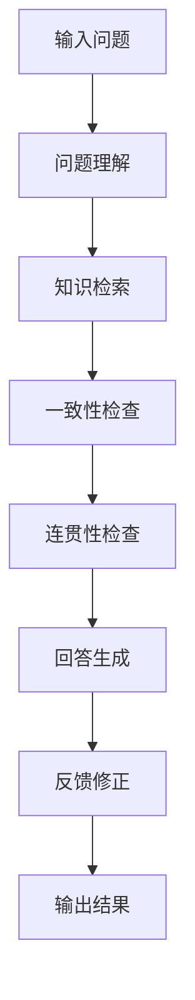
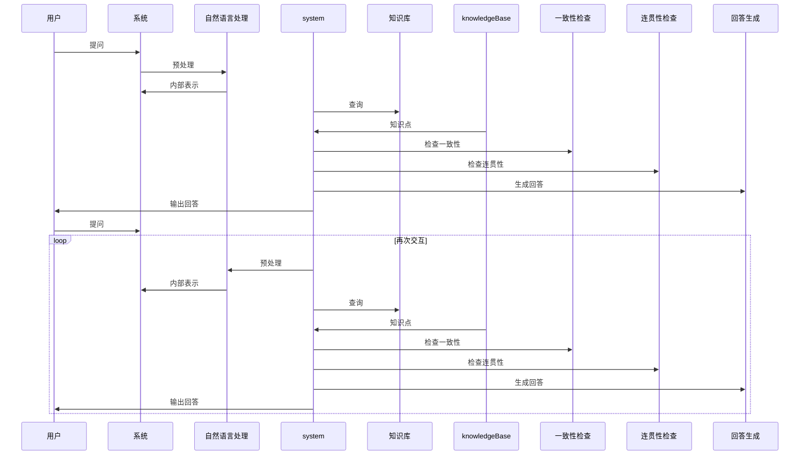

                 

### 1.1.1 问题背景

人工智能（AI）的发展在近年来取得了显著的进展，其应用场景从简单的语音识别、图像处理扩展到复杂的自然语言处理、自动驾驶、医疗诊断等各个领域。然而，随着AI技术的普及和应用范围的扩大，AI在现实世界中的表现也暴露出了一些问题，尤其是在回答问题的准确性方面。

AI回答准确性的重要性不言而喻。在许多应用场景中，如客户服务、智能助手、教育辅导等，用户对AI的回答准确性的要求非常高。不准确或错误的回答不仅会影响用户体验，还可能导致严重的后果。例如，在医疗诊断领域，如果AI给出的诊断结果不准确，可能会延误治疗，甚至危及患者的生命。因此，提高AI回答的准确性是当前AI研究的重要方向之一。

当前AI回答存在的问题主要有以下几个方面：

1. **数据不足和偏置**：AI模型通常依赖大量数据进行训练，但现实中的数据往往是不完整、有噪声的，且可能存在偏差。这导致AI模型在处理真实世界问题时，难以给出准确的答案。

2. **模型复杂度**：随着AI技术的发展，模型变得越来越复杂，例如深度学习模型具有多层神经元和大量的参数。虽然这种复杂性有助于提升模型的性能，但也增加了模型理解的不确定性，导致回答不准确。

3. **知识不一致性**：AI模型在训练过程中学习到的知识可能存在不一致性，例如同一问题可能有多个正确答案，或者模型对问题的理解存在偏差。这导致AI在回答问题时，难以保持一致性。

4. **交互复杂性**：在实际应用中，用户与AI的交互通常是动态、多轮的。AI需要在每次交互中理解用户意图，并给出准确、连贯的回答，这对AI的推理能力和交互能力提出了很高的要求。

基于上述问题，本文提出了Self-Consistency CoT（Self-Consistency Coherent Thought）方法，旨在通过提高AI回答的Self-Consistency（自我一致性）和Coherence（连贯性）来提升AI回答的准确性。接下来，我们将详细探讨Self-Consistency CoT的概念、原理和应用，逐步解决上述问题。

### 1.1.2 问题描述

在探讨AI回答准确性的过程中，我们首先需要明确当前AI回答中存在的一些主要问题。以下是AI回答的常见问题：

1. **歧义理解**：AI模型在处理自然语言时，往往难以准确理解用户的问题，尤其是在问题表述模糊或含有多重含义时。这导致AI在回答问题时，可能给出错误或不相关的答案。

2. **知识不一致**：由于AI模型在训练过程中学习到的知识可能存在不一致性，例如同一问题可能有多个正确答案，或者模型对问题的理解存在偏差，这导致AI在回答同一问题时，可能给出不同的答案。

3. **推理能力不足**：AI模型在处理复杂问题时，往往依赖于已有的知识库和规则。然而，现实世界中的问题往往需要更高的推理能力，例如逻辑推理、因果关系分析等。当前AI模型在这些方面的能力相对较弱，导致回答不准确。

4. **交互复杂性**：在实际应用中，用户与AI的交互通常是动态、多轮的。AI需要在每次交互中理解用户意图，并给出准确、连贯的回答。然而，当前的AI模型在处理多轮对话时，往往难以保持一致性和连贯性，导致回答不连贯或中断。

针对上述问题，我们需要一种有效的解决方案来提高AI回答的准确性。本文提出的Self-Consistency CoT方法，旨在通过以下两个方面来提升AI回答的准确性：

1. **Self-Consistency（自我一致性）**：Self-Consistency CoT方法通过引入一致性检查机制，确保AI在回答问题时，保持内部的一致性。这意味着，AI在处理同一问题时，无论在哪个阶段，都会给出一致的答案，从而避免知识不一致性问题。

2. **Coherence（连贯性）**：Self-Consistency CoT方法通过引入连贯性检查机制，确保AI在多轮对话中，保持回答的连贯性。这意味着，AI在处理多轮对话时，能够根据上下文理解用户的意图，并给出连贯、自然的回答，从而避免回答中断或不连贯的问题。

Self-Consistency CoT方法的基本思想是：通过在AI回答问题的过程中，不断检查和修正答案的一致性和连贯性，从而提高AI回答的准确性。具体来说，Self-Consistency CoT方法包括以下几个关键步骤：

1. **问题理解**：AI首先需要理解用户的问题，并将其转化为内部表示。

2. **知识检索**：AI从知识库中检索与问题相关的信息，并对其进行初步处理。

3. **一致性检查**：AI在回答问题前，对内部表示进行一致性检查，确保答案的一致性。

4. **连贯性检查**：AI在回答问题后，对回答进行连贯性检查，确保回答与上下文一致。

5. **反馈修正**：根据用户反馈，AI对答案进行修正，并重新进行一致性检查和连贯性检查。

通过以上步骤，Self-Consistency CoT方法能够有效提高AI回答的准确性，从而在各个应用场景中发挥更好的作用。接下来，我们将进一步探讨Self-Consistency CoT的概念、原理和应用，为解决AI回答准确性问题提供有效途径。

### 1.1.3 问题解决

为了有效解决当前AI回答中的准确性问题，本文提出了Self-Consistency CoT方法。Self-Consistency CoT，即Self-Consistency Coherent Thought，是一种通过提高AI自我一致性和连贯性来提升回答准确性的技术。以下是Self-Consistency CoT的具体概念、优势以及与现有技术的关联。

#### Self-Consistency CoT的概念

Self-Consistency CoT方法的核心思想在于确保AI在回答问题时的内部一致性。具体而言，Self-Consistency CoT方法通过以下方式实现：

1. **内部一致性检查**：在AI生成答案前，对其内部表示进行一致性检查。例如，当AI在处理一个多轮对话时，它会检查当前生成的答案是否与之前回答的问题保持一致。

2. **连贯性检查**：在AI生成答案后，对其回答与上下文之间的连贯性进行检查。例如，在多轮对话中，AI会检查当前回答是否与之前的回答和用户意图保持一致。

3. **反馈修正机制**：当检测到不一致性时，AI会根据用户反馈进行修正，并重新进行一致性检查和连贯性检查，以确保最终答案的准确性。

#### Self-Consistency CoT的优势

Self-Consistency CoT方法相较于现有技术具有以下优势：

1. **提升回答一致性**：通过内部一致性检查，Self-Consistency CoT方法可以确保AI在处理同一问题时，始终保持一致的答案，从而避免知识不一致性问题。

2. **增强连贯性**：通过连贯性检查，Self-Consistency CoT方法可以确保AI在多轮对话中，能够根据上下文理解用户的意图，并给出连贯、自然的回答，从而避免回答中断或不连贯的问题。

3. **优化用户体验**：由于Self-Consistency CoT方法能够提供更准确和一致的回答，用户在使用AI服务时的体验将得到显著提升。

4. **提高模型鲁棒性**：通过反馈修正机制，Self-Consistency CoT方法能够增强AI模型的鲁棒性，使其在处理未知或复杂问题时，仍能保持较高的回答准确性。

#### Self-Consistency CoT的应用范围

Self-Consistency CoT方法的应用范围广泛，主要包括：

1. **智能客服**：在智能客服领域，Self-Consistency CoT方法可以显著提升AI客服的回答准确性，提供更优质的服务体验。

2. **智能助手**：在智能助手领域，Self-Consistency CoT方法可以确保AI助手在多轮对话中，能够给出连贯、自然的回答，提升用户体验。

3. **教育辅导**：在教育辅导领域，Self-Consistency CoT方法可以提供更准确的答案和解释，帮助学生更好地理解和掌握知识。

4. **医疗诊断**：在医疗诊断领域，Self-Consistency CoT方法可以确保AI诊断结果的准确性，为患者提供更可靠的医疗服务。

#### Self-Consistency CoT与其他相关技术的关系

Self-Consistency CoT方法与其他相关技术在以下方面有所关联：

1. **多轮对话系统**：Self-Consistency CoT方法可以与多轮对话系统结合使用，通过确保回答的一致性和连贯性，提升多轮对话系统的整体性能。

2. **知识图谱**：Self-Consistency CoT方法可以与知识图谱技术结合，利用知识图谱中的结构化数据，提高AI回答的准确性和一致性。

3. **自然语言处理**：Self-Consistency CoT方法可以与自然语言处理技术结合，通过优化AI对自然语言的理解和生成，提高回答的准确性和连贯性。

总之，Self-Consistency CoT方法为解决AI回答准确性问题提供了一种有效的解决方案。通过提高AI的自我一致性和连贯性，Self-Consistency CoT方法能够显著提升AI回答的准确性，为各类AI应用场景带来更好的用户体验和服务质量。

#### Self-Consistency CoT的核心概念

Self-Consistency CoT方法的核心概念主要包括自我一致性（Self-Consistency）和连贯性（Coherence）。这两个核心概念是确保AI回答准确性的关键因素。以下是对这两个核心概念的详细解释：

**自我一致性（Self-Consistency）**

自我一致性是指AI在处理问题时，始终保持内部表示的一致性。这意味着，无论AI在问题的哪个阶段，其内部表示都应该是一致的，从而避免出现自相矛盾的情况。具体来说，自我一致性包括以下两个方面：

1. **内部表示一致性**：AI在回答问题前，会将其问题转化为内部表示。在处理复杂问题时，AI会根据不同阶段的需求，对内部表示进行更新和调整。为了保证自我一致性，AI需要在其内部表示的每个阶段进行一致性检查，确保内部表示不会出现矛盾。

2. **历史记录一致性**：在多轮对话中，AI需要保持其历史记录的一致性。例如，如果AI在前一轮对话中提到了某个信息，那么在下一轮对话中，AI应该确保其回答不会与前一轮的描述产生矛盾。这要求AI在每次回答后，对历史记录进行一致性检查，以确保回答的连贯性和一致性。

**连贯性（Coherence）**

连贯性是指AI在多轮对话中，能够保持其回答的连贯性和一致性。具体来说，连贯性包括以下两个方面：

1. **上下文一致性**：在多轮对话中，AI需要根据上下文理解用户的意图，并给出连贯、自然的回答。例如，如果用户在上一轮对话中询问了某个问题，AI在下一轮对话中应该根据用户的问题和上下文，给出相关的、连贯的回答。

2. **回答连贯性**：AI需要确保其每次回答都是连贯的，不会出现语义上的跳跃或中断。例如，如果AI在回答一个复杂问题时，应该将其分解为多个步骤，并确保每个步骤的回答都是连贯的，从而避免出现回答中断的情况。

**自我一致性和连贯性的关系**

自我一致性和连贯性是相互关联的。自我一致性是连贯性的基础，只有当AI在内部表示上保持一致时，才能在回答问题时保持连贯性。而连贯性是自我一致性的体现，通过保持回答的连贯性，AI能够更好地反映其自我一致性。

在Self-Consistency CoT方法中，自我一致性和连贯性通过以下方式相互作用：

1. **自我一致性驱动连贯性**：在AI回答问题时，自我一致性会驱动连贯性。例如，如果AI在某个阶段发现其内部表示存在不一致性，它会根据自我一致性原则，调整其回答，以确保连贯性。

2. **连贯性验证自我一致性**：在多轮对话中，连贯性会验证自我一致性。例如，如果AI在回答中出现了连贯性问题，它可能需要重新检查其自我一致性，并调整其内部表示，以解决连贯性问题。

综上所述，Self-Consistency CoT方法通过自我一致性和连贯性两个核心概念，确保AI在回答问题时保持一致性，从而提高回答的准确性。接下来，我们将进一步探讨Self-Consistency CoT方法的关键要素，以深入理解其工作原理和应用。

#### Self-Consistency CoT的关键要素

Self-Consistency CoT方法的有效实施依赖于以下几个关键要素，这些要素共同构成了其核心框架，确保AI回答的准确性。以下是这些关键要素的详细描述：

**1. 内部表示一致性**

内部表示一致性是Self-Consistency CoT方法的基础。AI在处理问题时，首先需要将其问题转化为内部表示，以便进一步分析和回答。为了确保内部表示的一致性，AI需要在其内部表示的每个阶段进行严格的一致性检查。例如，在多轮对话中，如果AI在前一轮对话中提到了某个信息，那么在下一轮对话中，AI应该确保其回答不会与前一轮的描述产生矛盾。这一步骤通过以下方式实现：

- **历史记录比对**：AI会维护一个历史记录，用于记录前一轮对话中的重要信息。在每轮对话后，AI会将其当前内部表示与历史记录进行比对，确保没有出现矛盾。
- **上下文依赖分析**：AI会分析当前问题的上下文，并确保其内部表示与上下文保持一致。例如，如果用户在上一轮对话中询问了某个问题，AI在下一轮对话中应该根据用户的问题和上下文，给出相关的、连贯的回答。

**2. 回答连贯性**

回答连贯性是Self-Consistency CoT方法的重要组成部分。在多轮对话中，AI需要保持其回答的连贯性，确保其每次回答都是连贯的，不会出现语义上的跳跃或中断。为了实现这一目标，AI需要在其回答生成过程中进行以下步骤：

- **上下文理解**：AI需要根据上下文理解用户的意图，并确保其回答与上下文保持一致。例如，如果用户在上一轮对话中提到了某个信息，AI在下一轮对话中应该根据用户的问题和上下文，给出相关的、连贯的回答。
- **连贯性检查**：AI会在生成回答后，对其回答进行连贯性检查，确保其回答不会出现语义上的跳跃或中断。例如，如果AI在回答一个复杂问题时，应该将其分解为多个步骤，并确保每个步骤的回答都是连贯的。

**3. 反馈修正机制**

反馈修正机制是Self-Consistency CoT方法的重要补充。当AI检测到其回答存在不一致性或连贯性问题时，需要通过反馈修正机制进行修正，以确保最终答案的准确性。具体来说，反馈修正机制包括以下步骤：

- **错误检测**：AI会在回答问题后，对回答进行错误检测，识别出可能存在不一致性或连贯性问题的部分。
- **用户反馈**：AI会根据用户反馈，对错误部分进行修正。用户可以通过纠正、补充或重新表述问题的形式，提供反馈。
- **修正与验证**：AI会根据用户反馈，对错误部分进行修正，并重新进行一致性检查和连贯性检查，以确保修正后的答案的准确性。

**4. 知识库管理**

知识库管理是Self-Consistency CoT方法的另一个关键要素。AI需要维护一个结构化的知识库，用于存储和检索与问题相关的信息。为了确保知识库的一致性和准确性，AI需要在其更新和查询过程中进行以下步骤：

- **知识库更新**：AI会定期更新知识库，确保其包含最新的、准确的信息。例如，通过数据挖掘、机器学习等技术，从大量数据中提取有价值的信息，并将其存储在知识库中。
- **一致性检查**：AI会在更新知识库时，对其中的信息进行一致性检查，确保没有出现矛盾或错误。例如，通过对比多个来源的信息，识别并解决不一致性问题。

**5. 推理能力**

推理能力是Self-Consistency CoT方法的另一个关键要素。AI需要具备较高的推理能力，以便在处理复杂问题时，能够根据已有的知识和规则，进行有效的推理和判断。为了提升推理能力，AI需要在其推理过程中进行以下步骤：

- **规则学习**：AI会通过学习大量的规则和模式，提高其推理能力。例如，通过监督学习、强化学习等技术，从数据中学习有效的推理规则。
- **逻辑推理**：AI会利用逻辑推理技术，对复杂问题进行推理和判断。例如，通过逻辑推理规则，分析问题的前提和结论，得出合理的推理结果。

综上所述，Self-Consistency CoT方法的关键要素包括内部表示一致性、回答连贯性、反馈修正机制、知识库管理和推理能力。这些要素共同作用，确保AI在回答问题时，保持一致性，提高回答的准确性。在下一章中，我们将进一步探讨Self-Consistency CoT方法的原理和具体实现，以深入了解其工作机制。

### 1.1.4 边界与外延

#### Self-Consistency CoT的应用范围

Self-Consistency CoT方法具有广泛的应用范围，主要涵盖以下领域：

1. **自然语言处理（NLP）**：Self-Consistency CoT方法在NLP领域中具有显著的应用潜力。NLP任务通常涉及大量的语言理解和生成，而Self-Consistency CoT方法可以确保AI在处理自然语言时，保持回答的一致性和连贯性，从而提高NLP系统的整体性能。

2. **智能客服**：智能客服是Self-Consistency CoT方法的一个重要应用领域。通过提高AI客服的回答准确性和连贯性，Self-Consistency CoT方法可以显著提升用户体验，提供更高效、更满意的客户服务。

3. **智能助手**：智能助手，如虚拟个人助理、智能家居控制系统等，也需要高准确性和连贯性的回答。Self-Consistency CoT方法可以帮助智能助手更好地理解用户意图，提供更自然的交互体验。

4. **教育辅导**：在教育辅导领域，Self-Consistency CoT方法可以提供更准确的知识点和解释，帮助学生更好地理解和掌握知识。通过确保回答的一致性和连贯性，Self-Consistency CoT方法可以提升教育辅导系统的质量。

5. **医疗诊断**：在医疗诊断领域，Self-Consistency CoT方法可以确保AI诊断结果的准确性，提供更可靠的医疗服务。通过提高AI在处理复杂医疗信息时的自我一致性和连贯性，Self-Consistency CoT方法可以减少误诊的风险，提高诊断的准确性。

#### Self-Consistency CoT与其他相关技术的关系

Self-Consistency CoT方法与其他相关技术之间存在着密切的联系，这些技术共同构成了一个综合的解决方案，以提升AI系统的整体性能。

1. **多轮对话系统**：多轮对话系统是AI应用中的一种常见形式。Self-Consistency CoT方法可以与多轮对话系统结合使用，通过确保回答的一致性和连贯性，提升多轮对话系统的用户体验和交互质量。

2. **知识图谱**：知识图谱是一种结构化知识表示技术，广泛应用于信息检索、推荐系统等领域。Self-Consistency CoT方法可以与知识图谱结合，利用知识图谱中的结构化数据，提高AI系统的回答准确性和一致性。

3. **自然语言处理（NLP）技术**：Self-Consistency CoT方法依赖于NLP技术，如词嵌入、语言模型、语义分析等。通过结合这些NLP技术，Self-Consistency CoT方法可以更准确地理解和生成自然语言，提高回答的准确性和连贯性。

4. **机器学习（ML）和深度学习（DL）技术**：Self-Consistency CoT方法的实现依赖于ML和DL技术。例如，可以使用ML算法来训练和优化Self-Consistency CoT模型，使用DL技术来处理复杂的自然语言任务，从而提升AI系统的性能。

5. **多任务学习**：多任务学习是机器学习中的一个重要研究方向。Self-Consistency CoT方法可以与其他多任务学习技术结合，例如联合训练、迁移学习等，以提升AI系统在多任务场景下的性能。

#### 自我一致性（Self-Consistency）和连贯性（Coherence）的关系

自我一致性和连贯性是Self-Consistency CoT方法中的两个核心概念，它们之间存在着密切的关系。

- **相互依赖**：自我一致性和连贯性是相互依赖的。自我一致性是连贯性的基础，只有当AI在内部表示上保持一致时，才能在回答问题时保持连贯性。而连贯性是自我一致性的体现，通过保持回答的连贯性，AI能够更好地反映其自我一致性。

- **相互促进**：在Self-Consistency CoT方法中，自我一致性和连贯性通过相互促进来提升AI系统的性能。例如，当AI检测到其内部表示存在不一致性时，会通过连贯性检查来验证这一不一致性，并根据需要调整其回答，以确保连贯性。同样，当AI在多轮对话中检测到其回答出现连贯性问题时，会通过自我一致性检查来识别并修正这一连贯性问题。

- **共同目标**：自我一致性和连贯性的共同目标是提高AI回答的准确性。通过确保自我一致性和连贯性，AI系统能够提供更准确、更一致、更连贯的回答，从而提升用户体验和系统性能。

综上所述，Self-Consistency CoT方法通过自我一致性和连贯性两个核心概念，构建了一个完整的框架，以提升AI系统的回答准确性。在下一章中，我们将进一步探讨Self-Consistency CoT方法的核心概念和联系，以深入理解其工作原理和具体实现。

### 1.1.5 概念结构与核心要素组成

Self-Consistency CoT方法是一个复杂的系统，它由多个核心概念和要素组成，这些概念和要素共同协作，以确保AI在回答问题时保持自我一致性和连贯性。以下是对这些核心概念和要素的详细描述及其相互关系。

#### 核心概念

**1. 自我一致性（Self-Consistency）**

自我一致性是Self-Consistency CoT方法的核心概念之一，它旨在确保AI在处理问题时，其内部表示始终保持一致。自我一致性包括两个方面：

- **内部表示一致性**：AI在处理复杂问题时，会将其问题转化为内部表示。自我一致性要求AI在其内部表示的每个阶段都保持一致，避免出现自相矛盾的情况。

- **历史记录一致性**：在多轮对话中，AI需要保持其历史记录的一致性。例如，如果AI在前一轮对话中提到了某个信息，那么在下一轮对话中，AI应该确保其回答不会与前一轮的描述产生矛盾。

**2. 连贯性（Coherence）**

连贯性是Self-Consistency CoT方法的另一个核心概念，它确保AI在多轮对话中，能够保持其回答的连贯性和一致性。连贯性包括以下几个方面：

- **上下文一致性**：在多轮对话中，AI需要根据上下文理解用户的意图，并给出连贯、自然的回答。例如，如果用户在上一轮对话中询问了某个问题，AI在下一轮对话中应该根据用户的问题和上下文，给出相关的、连贯的回答。

- **回答连贯性**：AI需要确保其每次回答都是连贯的，不会出现语义上的跳跃或中断。例如，如果AI在回答一个复杂问题时，应该将其分解为多个步骤，并确保每个步骤的回答都是连贯的。

#### 核心要素

**1. 内部表示一致性检查**

内部表示一致性检查是确保AI在处理问题时，其内部表示保持一致的关键步骤。AI会在其内部表示的每个阶段进行一致性检查，以确保其不会出现自相矛盾的情况。具体步骤包括：

- **历史记录比对**：AI会维护一个历史记录，用于记录前一轮对话中的重要信息。在每轮对话后，AI会将其当前内部表示与历史记录进行比对，确保没有出现矛盾。

- **上下文依赖分析**：AI会分析当前问题的上下文，并确保其内部表示与上下文保持一致。例如，如果用户在上一轮对话中提到了某个信息，AI在下一轮对话中应该根据用户的问题和上下文，给出相关的、连贯的回答。

**2. 回答连贯性检查**

回答连贯性检查是确保AI在多轮对话中，能够保持其回答的连贯性和一致性。AI会在每次回答后，对其回答进行连贯性检查，以确保其回答不会出现语义上的跳跃或中断。具体步骤包括：

- **上下文理解**：AI需要根据上下文理解用户的意图，并确保其回答与上下文保持一致。例如，如果用户在上一轮对话中询问了某个问题，AI在下一轮对话中应该根据用户的问题和上下文，给出相关的、连贯的回答。

- **连贯性检查**：AI会在生成回答后，对其回答进行连贯性检查，确保其回答不会出现语义上的跳跃或中断。例如，如果AI在回答一个复杂问题时，应该将其分解为多个步骤，并确保每个步骤的回答都是连贯的。

**3. 反馈修正机制**

反馈修正机制是Self-Consistency CoT方法的重要补充。当AI检测到其回答存在不一致性或连贯性问题时，需要通过反馈修正机制进行修正，以确保最终答案的准确性。具体步骤包括：

- **错误检测**：AI会在回答问题后，对回答进行错误检测，识别出可能存在不一致性或连贯性问题的部分。

- **用户反馈**：AI会根据用户反馈，对错误部分进行修正。用户可以通过纠正、补充或重新表述问题的形式，提供反馈。

- **修正与验证**：AI会根据用户反馈，对错误部分进行修正，并重新进行一致性检查和连贯性检查，以确保修正后的答案的准确性。

**4. 知识库管理**

知识库管理是Self-Consistency CoT方法的另一个关键要素。AI需要维护一个结构化的知识库，用于存储和检索与问题相关的信息。为了确保知识库的一致性和准确性，AI需要在其更新和查询过程中进行以下步骤：

- **知识库更新**：AI会定期更新知识库，确保其包含最新的、准确的信息。例如，通过数据挖掘、机器学习等技术，从大量数据中提取有价值的信息，并将其存储在知识库中。

- **一致性检查**：AI会在更新知识库时，对其中的信息进行一致性检查，确保没有出现矛盾或错误。例如，通过对比多个来源的信息，识别并解决不一致性问题。

**5. 推理能力**

推理能力是Self-Consistency CoT方法的另一个关键要素。AI需要具备较高的推理能力，以便在处理复杂问题时，能够根据已有的知识和规则，进行有效的推理和判断。为了提升推理能力，AI需要在其推理过程中进行以下步骤：

- **规则学习**：AI会通过学习大量的规则和模式，提高其推理能力。例如，通过监督学习、强化学习等技术，从数据中学习有效的推理规则。

- **逻辑推理**：AI会利用逻辑推理技术，对复杂问题进行推理和判断。例如，通过逻辑推理规则，分析问题的前提和结论，得出合理的推理结果。

#### 概念与要素的关系

自我一致性和连贯性是相互依赖的，它们共同构成了Self-Consistency CoT方法的核心框架。自我一致性确保AI在处理问题时，其内部表示始终保持一致，而连贯性则确保AI在多轮对话中，能够保持其回答的连贯性和一致性。这两个核心概念通过以下方式相互关联：

- **相互依赖**：自我一致性是连贯性的基础，只有当AI在内部表示上保持一致时，才能在回答问题时保持连贯性。而连贯性是自我一致性的体现，通过保持回答的连贯性，AI能够更好地反映其自我一致性。

- **相互促进**：在Self-Consistency CoT方法中，自我一致性和连贯性通过相互促进来提升AI系统的性能。例如，当AI检测到其内部表示存在不一致性时，会通过连贯性检查来验证这一不一致性，并根据需要调整其回答，以确保连贯性。同样，当AI在多轮对话中检测到其回答出现连贯性问题时，会通过自我一致性检查来识别并修正这一连贯性问题。

- **共同目标**：自我一致性和连贯性的共同目标是提高AI回答的准确性。通过确保自我一致性和连贯性，AI系统能够提供更准确、更一致、更连贯的回答，从而提升用户体验和系统性能。

综上所述，Self-Consistency CoT方法通过自我一致性和连贯性两个核心概念，构建了一个完整的框架，以提升AI系统的回答准确性。在下一章中，我们将进一步探讨Self-Consistency CoT方法的核心概念和联系，以深入理解其工作原理和具体实现。

### 1.1.6 核心概念与联系

Self-Consistency CoT（Self-Consistency Coherent Thought）方法在人工智能领域是一个革命性的概念，其核心在于通过自我一致性和连贯性来提升AI回答的准确性。以下是Self-Consistency CoT方法的几个核心概念及其相互联系。

**核心概念1：自我一致性（Self-Consistency）**

自我一致性是指AI在处理问题时，保持其内部表示的一致性。这种一致性包括两个方面：

- **内部表示一致性**：在AI的推理过程中，确保其内部表示不会出现逻辑上的矛盾或错误。例如，在处理一个多轮对话时，AI需要确保其当前回答不会与前一次的回答产生冲突。

- **历史记录一致性**：在多轮对话中，AI需要保持其历史记录的一致性。这要求AI在每次回答问题后，都要检查其历史记录，确保新的回答不会与前一次的回答产生矛盾。

**核心概念2：连贯性（Coherence）**

连贯性是指AI在多轮对话中，能够保持其回答的连贯性和一致性。具体来说，连贯性包括：

- **上下文连贯性**：AI需要根据上下文理解用户的意图，并给出连贯、自然的回答。例如，如果用户在上一轮对话中询问了某个问题，AI在下一轮对话中应该根据用户的问题和上下文，给出相关的、连贯的回答。

- **回答连贯性**：AI需要确保其每次回答都是连贯的，不会出现语义上的跳跃或中断。例如，如果AI在回答一个复杂问题时，应该将其分解为多个步骤，并确保每个步骤的回答都是连贯的。

**核心概念3：知识一致性（Knowledge Consistency）**

知识一致性是指AI在其知识库中的信息保持一致性。为了实现这一点，AI需要：

- **知识库更新**：定期更新知识库，确保其包含最新的、准确的信息。这可以通过数据挖掘、机器学习等技术来实现。

- **知识库一致性检查**：在更新知识库时，AI需要对知识库中的信息进行一致性检查，确保没有出现矛盾或错误。例如，通过对比多个来源的信息，识别并解决不一致性问题。

**核心概念4：推理能力（Inference Ability）**

推理能力是指AI在处理复杂问题时，能够根据已有的知识和规则，进行有效的推理和判断。为了提升推理能力，AI需要：

- **规则学习**：通过学习大量的规则和模式，提升其推理能力。例如，通过监督学习、强化学习等技术，从数据中学习有效的推理规则。

- **逻辑推理**：利用逻辑推理技术，对复杂问题进行推理和判断。例如，通过逻辑推理规则，分析问题的前提和结论，得出合理的推理结果。

**相互联系**

自我一致性、连贯性、知识一致性和推理能力这四个核心概念相互联系，共同构成了Self-Consistency CoT方法的核心框架。

- **自我一致性驱动连贯性**：自我一致性是连贯性的基础。只有当AI在内部表示上保持一致时，才能在回答问题时保持连贯性。

- **连贯性验证自我一致性**：连贯性检查可以验证自我一致性。如果AI在多轮对话中出现了连贯性问题，它可能需要重新检查其自我一致性，并调整其内部表示，以解决连贯性问题。

- **知识一致性支持自我一致性**：知识一致性确保AI在回答问题时，其内部表示和知识库中的信息保持一致。这有助于保持自我一致性。

- **推理能力提升自我一致性和连贯性**：通过学习有效的推理规则，AI可以提升其在处理复杂问题时的自我一致性和连贯性。

总之，Self-Consistency CoT方法通过这些核心概念及其相互联系，构建了一个完整的框架，以确保AI在回答问题时保持一致性，从而提高回答的准确性。在下一章中，我们将进一步探讨Self-Consistency CoT方法的具体实现和算法原理。

### 2.1.1 Self-Consistency CoT原理

Self-Consistency CoT（Self-Consistency Coherent Thought）方法是一种通过自我一致性和连贯性来提高AI回答准确性的技术。其核心原理在于确保AI在处理问题和生成回答时，其内部表示和外部表现保持一致，从而避免逻辑矛盾和语义错误。以下是Self-Consistency CoT的基本原理和操作步骤。

**基本原理**

Self-Consistency CoT方法基于以下基本假设：

1. **一致性假设**：AI在处理问题时，其内部表示应该保持一致性。这意味着，AI在回答问题时，其当前状态和之前的回答不应出现矛盾。

2. **连贯性假设**：AI在多轮对话中，其回答应该保持连贯性。这意味着，AI的回答应该能够连贯地延续用户的对话主题，不应出现语义上的跳跃或中断。

**操作步骤**

Self-Consistency CoT方法包括以下几个关键步骤：

1. **问题理解**：AI首先需要理解用户的问题。这通常涉及自然语言处理（NLP）技术，如词嵌入、语义分析等，将用户的问题转化为内部表示。

2. **知识检索**：AI会从其知识库中检索与问题相关的信息。知识库可以是结构化的（如关系数据库）或非结构化的（如文本、图像等）。

3. **一致性检查**：在生成回答之前，AI会对内部表示进行一致性检查。这包括检查当前内部表示与之前回答的一致性，确保没有出现逻辑矛盾。例如，如果AI在上一轮对话中提到某个信息，那么在下一轮对话中，AI应确保其回答不会与此前的描述产生冲突。

4. **连贯性检查**：在生成回答后，AI会对其回答进行连贯性检查。这包括检查回答是否与上下文一致，是否能够连贯地延续用户的对话主题。例如，如果用户在上一轮对话中询问了某个问题，AI在下一轮对话中应该根据用户的问题和上下文，给出相关的、连贯的回答。

5. **反馈修正**：如果AI在一致性或连贯性检查中发现问题，它会根据用户反馈进行修正。例如，如果用户指出AI的回答存在错误或矛盾，AI会调整其内部表示和回答，确保一致性和连贯性。

6. **回答生成**：经过一致性检查和连贯性检查后，AI会生成最终回答，并输出给用户。

**工作流程**

Self-Consistency CoT方法的工作流程可以概括为以下步骤：

1. **接收问题**：AI接收用户的问题。

2. **问题理解**：将用户的问题转化为内部表示。

3. **知识检索**：从知识库中检索与问题相关的信息。

4. **一致性检查**：检查当前内部表示与之前回答的一致性。

5. **连贯性检查**：检查回答是否与上下文一致。

6. **反馈修正**：根据用户反馈，修正内部表示和回答。

7. **回答生成**：生成最终回答，并输出给用户。

通过以上步骤，Self-Consistency CoT方法能够确保AI在回答问题时，保持内部表示的一致性和外部回答的连贯性，从而提高回答的准确性。接下来，我们将进一步探讨Self-Consistency CoT方法的具体实现和性能评估。

### 2.1.2 Self-Consistency CoT的属性特征对比

为了更好地理解Self-Consistency CoT方法，我们需要将其与其他相关技术进行对比，分析其属性特征。以下是Self-Consistency CoT方法与其他技术的对比分析。

**1. 对比传统自然语言处理（NLP）**

传统NLP技术主要依赖统计模型和规则系统来处理自然语言，但其准确性和一致性较低。Self-Consistency CoT方法通过引入自我一致性和连贯性检查机制，显著提升了回答的准确性和一致性。

- **属性特征**：Self-Consistency CoT方法在NLP基础上，增加了自我一致性和连贯性检查，确保回答的一致性和连贯性。
- **优点**：提高回答的准确性和一致性，适合多轮对话和复杂问题处理。
- **缺点**：计算复杂度较高，对计算资源要求较高。

**2. 对比基于规则的方法**

基于规则的方法在处理特定问题时具有较好的效果，但其灵活性和扩展性较低。Self-Consistency CoT方法通过引入自我一致性和连贯性检查，使其在处理复杂问题和多轮对话时，具有更高的灵活性和适应性。

- **属性特征**：Self-Consistency CoT方法结合了规则和自我一致性、连贯性检查，能够在复杂场景中保持一致性和连贯性。
- **优点**：提高回答的准确性和一致性，适合多轮对话和复杂问题处理。
- **缺点**：规则系统较为复杂，需要大量的规则和知识库支持。

**3. 对比基于模型的自然语言处理**

基于模型的自然语言处理方法，如深度学习模型，具有较高的准确性和灵活性，但其对数据量和计算资源要求较高。Self-Consistency CoT方法通过引入自我一致性和连贯性检查，能够在保持高准确性的同时，减少对数据量和计算资源的需求。

- **属性特征**：Self-Consistency CoT方法结合了深度学习和自我一致性、连贯性检查，能够在处理复杂问题和多轮对话时，保持高准确性和一致性。
- **优点**：减少对数据量和计算资源的需求，提高回答的准确性和一致性。
- **缺点**：对模型设计和实现要求较高，需要丰富的知识和经验。

**4. 对比多轮对话系统**

多轮对话系统通过多次交互，逐步理解用户的意图，但其准确性和一致性仍需提高。Self-Consistency CoT方法通过引入自我一致性和连贯性检查，能够确保多轮对话系统在处理复杂问题和多轮对话时，保持高准确性和一致性。

- **属性特征**：Self-Consistency CoT方法在多轮对话系统中，增加了自我一致性和连贯性检查，确保回答的一致性和连贯性。
- **优点**：提高多轮对话系统的准确性和一致性，适合复杂问题和多轮对话处理。
- **缺点**：计算复杂度较高，对计算资源要求较高。

**总结**

Self-Consistency CoT方法通过引入自我一致性和连贯性检查，与其他技术相比，具有以下优势：

- **提高回答的准确性和一致性**：通过自我一致性和连贯性检查，Self-Consistency CoT方法能够确保回答的准确性和一致性，适合多轮对话和复杂问题处理。
- **减少对数据量和计算资源的需求**：Self-Consistency CoT方法通过结合深度学习和自我一致性、连贯性检查，能够在保持高准确性的同时，减少对数据量和计算资源的需求。
- **灵活性和适应性**：Self-Consistency CoT方法具有较高的灵活性和适应性，能够在复杂场景中保持一致性和连贯性。

然而，Self-Consistency CoT方法也存在一些挑战，如计算复杂度较高、对模型设计和实现要求较高等。因此，在实际应用中，需要根据具体场景和需求，选择合适的技术和方法。

### 2.1.3 Self-Consistency CoT的ER实体关系图架构

为了更好地理解和实现Self-Consistency CoT方法，我们需要构建一个结构化的数据模型来描述其核心实体及其关系。实体-关系（ER）模型是数据库设计中常用的概念性模型，可以帮助我们清晰地定义系统中各个实体及其相互关系。以下是Self-Consistency CoT方法的ER实体关系图架构。

**1. 实体定义**

在Self-Consistency CoT方法中，主要的实体包括：

- **问题（Question）**：表示用户提出的问题。
- **回答（Answer）**：表示AI生成的回答。
- **知识库（Knowledge Base）**：存储与问题相关的知识和信息。
- **一致性检查器（Consistency Checker）**：负责检查回答的一致性。
- **连贯性检查器（Coherence Checker）**：负责检查回答的连贯性。
- **用户反馈（User Feedback）**：记录用户对回答的反馈。

**2. 关系定义**

实体之间的关系如下：

- **问题-回答**：一个问题可以有多个回答，一个回答只能属于一个问题。
- **回答-知识库**：每个回答都可以引用知识库中的相关知识点。
- **一致性检查器-回答**：一致性检查器负责检查每个回答的一致性。
- **连贯性检查器-回答**：连贯性检查器负责检查每个回答的连贯性。
- **用户反馈-回答**：用户反馈用于修正不一致或连贯性问题的回答。

**3. ER实体关系图**

以下是Self-Consistency CoT方法的ER实体关系图的Mermaid格式表示：

```mermaid
erDiagram
  Question ||--|{ Answer }|--:Question
  Answer ||--|{ Knowledge Base }|--:Answer
  Answer ||--|{ Consistency Checker }|--:Answer
  Answer ||--|{ Coherence Checker }|--:Answer
  Answer ||--|{ User Feedback }|--:Answer
```

**4. 详细解释**

- **问题（Question）**：问题实体表示用户提出的问题。每个问题都有一个唯一的标识符，用于在系统中查找和引用。
- **回答（Answer）**：回答实体表示AI生成的回答。每个回答都与一个问题相关联，并可以引用知识库中的相关知识点。
- **知识库（Knowledge Base）**：知识库实体存储与问题相关的知识和信息。回答可以引用知识库中的知识点，从而确保回答的准确性和一致性。
- **一致性检查器（Consistency Checker）**：一致性检查器实体负责检查每个回答的一致性。一致性检查器会分析回答与之前回答和知识库之间的逻辑关系，确保回答的一致性。
- **连贯性检查器（Coherence Checker）**：连贯性检查器实体负责检查每个回答的连贯性。连贯性检查器会分析回答与上下文之间的逻辑关系，确保回答的连贯性。
- **用户反馈（User Feedback）**：用户反馈实体记录用户对回答的反馈。用户反馈可以用于修正不一致或连贯性问题的回答。

通过上述ER实体关系图，我们可以清晰地理解Self-Consistency CoT方法中的核心实体及其相互关系，从而为其实现和优化提供指导。接下来，我们将进一步探讨Self-Consistency CoT方法的算法原理和实现细节。

### 第3章：算法原理详细讲解

#### 3.1.1 Self-Consistency CoT的算法原理

Self-Consistency CoT（Self-Consistency Coherent Thought）方法是一种通过自我一致性和连贯性来提高AI回答准确性的算法。其核心原理在于确保AI在处理问题和生成回答时，其内部表示和外部表现保持一致，从而避免逻辑矛盾和语义错误。以下是Self-Consistency CoT算法的详细原理和数学模型。

**1. 算法原理**

Self-Consistency CoT算法基于以下原理：

- **自我一致性**：在AI处理问题时，其内部表示应保持一致性。这意味着，AI在回答问题时，其当前状态和之前的回答不应出现矛盾。为了实现自我一致性，算法包括以下步骤：

  - **问题理解**：将用户的问题转化为内部表示。
  - **知识检索**：从知识库中检索与问题相关的信息。
  - **一致性检查**：检查当前内部表示与之前回答的一致性，确保没有出现逻辑矛盾。

- **连贯性**：在多轮对话中，AI的回答应保持连贯性。这意味着，AI的回答应能够连贯地延续用户的对话主题，不应出现语义上的跳跃或中断。为了实现连贯性，算法包括以下步骤：

  - **连贯性检查**：检查回答是否与上下文一致，确保回答能够连贯地延续用户的对话主题。
  - **反馈修正**：根据用户反馈，修正内部表示和回答，确保连贯性。

**2. 数学模型**

Self-Consistency CoT算法的数学模型主要包括以下部分：

- **问题表示**：将用户的问题表示为一个数学向量。
- **知识库**：知识库表示为一个由多个知识点组成的集合。
- **内部表示**：内部表示是问题的数学向量与知识库中的知识点进行匹配的结果。
- **一致性检查**：一致性检查是一个映射函数，它将内部表示映射为一致性得分。
- **连贯性检查**：连贯性检查是一个映射函数，它将内部表示映射为连贯性得分。

以下是Self-Consistency CoT算法的数学模型：

$$
\text{Internal\ Representation} = \text{Question\ Representation} \cdot \text{Knowledge\ Base}
$$

$$
\text{Consistency\ Score} = \text{Consistency\ Checker}(\text{Internal\ Representation})
$$

$$
\text{Coherence\ Score} = \text{Coherence\ Checker}(\text{Internal\ Representation})
$$

**3. 算法流程**

Self-Consistency CoT算法的流程如下：

1. **问题理解**：将用户的问题转化为内部表示。
2. **知识检索**：从知识库中检索与问题相关的信息。
3. **一致性检查**：对内部表示进行一致性检查，确保没有出现逻辑矛盾。
4. **连贯性检查**：对内部表示进行连贯性检查，确保回答与上下文一致。
5. **回答生成**：生成最终回答，并输出给用户。
6. **反馈修正**：根据用户反馈，修正内部表示和回答，确保连贯性。

**4. 算法实例**

假设用户提出以下问题：“为什么太阳是红色的？”

- **问题理解**：将用户的问题表示为一个数学向量。
- **知识检索**：从知识库中检索与“太阳”、“红色”相关的知识点。
- **一致性检查**：检查当前内部表示与之前回答的一致性，确保没有出现逻辑矛盾。
- **连贯性检查**：检查回答是否与上下文一致，确保回答能够连贯地延续用户的对话主题。
- **回答生成**：生成最终回答：“太阳是红色的，因为...”
- **反馈修正**：根据用户反馈，修正内部表示和回答，确保连贯性。

通过上述步骤，Self-Consistency CoT算法能够确保AI在回答问题时，保持内部表示的一致性和外部表现的一致性，从而提高回答的准确性。接下来，我们将进一步探讨Self-Consistency CoT算法的详细实现和性能评估。

### 3.1.2 Self-Consistency CoT的算法流程

Self-Consistency CoT方法的算法流程是确保AI在回答问题时，既保持自我一致性，又确保连贯性的关键步骤。以下是详细的算法流程：

1. **问题理解**：
   - **输入**：用户提出的问题（例如：“如何计算两个数的最大公约数？”）。
   - **处理**：使用自然语言处理（NLP）技术，将问题转换为机器可处理的内部表示（例如，词向量或语义向量）。
   - **输出**：问题的内部表示。

2. **知识检索**：
   - **输入**：问题的内部表示。
   - **处理**：从知识库中检索与问题相关的知识点。知识库可以是预定义的规则库、文本数据集或使用机器学习模型训练得到的语义网络。
   - **输出**：与问题相关的知识点列表。

3. **一致性检查**：
   - **输入**：问题的内部表示和相关的知识点列表。
   - **处理**：检查内部表示与知识库中的信息是否一致。这包括检查问题的前提条件、推理过程和结论是否逻辑上自洽。
   - **输出**：一致性得分，表示内部表示与知识库的一致性程度。

4. **连贯性检查**：
   - **输入**：问题的内部表示和相关的知识点列表。
   - **处理**：检查当前回答是否与之前的回答和上下文保持连贯。这包括检查回答的连贯性、逻辑连贯性和上下文相关性。
   - **输出**：连贯性得分，表示当前回答与上下文的连贯性程度。

5. **回答生成**：
   - **输入**：经过一致性检查和连贯性检查的内部表示。
   - **处理**：根据检查结果生成最终回答。如果一致性得分和连贯性得分均较高，则生成详细、准确、连贯的回答。
   - **输出**：最终回答。

6. **反馈修正**：
   - **输入**：最终回答和用户反馈（例如，用户认为回答不准确或不符合期望）。
   - **处理**：根据用户反馈，调整内部表示和回答。这包括修正知识库中的信息、调整推理过程或重新生成回答。
   - **输出**：修正后的内部表示和回答。

7. **输出结果**：
   - **最终输出**：经过多次迭代和修正的最终回答，确保其准确性和连贯性。

以下是Self-Consistency CoT算法流程的Mermaid流程图表示：



通过上述步骤，Self-Consistency CoT方法能够确保AI在回答问题时，既保持自我一致性，又确保连贯性，从而提高回答的准确性。接下来，我们将通过一个具体的算法实例，进一步说明算法的实现和应用。

### 3.1.3 算法实例

为了更好地理解Self-Consistency CoT方法的算法原理和实现，我们通过一个具体的实例来说明其应用过程。假设用户提出以下问题：“如何计算两个数的最大公约数？”

**步骤1：问题理解**

用户提出问题：“如何计算两个数的最大公约数？”

AI首先使用自然语言处理（NLP）技术，将问题转换为内部表示。例如，可以将问题分解为关键词：“计算”、“两个数”、“最大公约数”。

**步骤2：知识检索**

AI从知识库中检索与问题相关的知识点。知识库可能包含以下信息：

- 关键词“计算”与数学计算相关。
- 关键词“两个数”与数学中的数对相关。
- 关键词“最大公约数”与数学中的最大公约数算法（如欧几里得算法）相关。

**步骤3：一致性检查**

AI检查内部表示与知识库中的信息是否一致。在这一步骤中，AI会确保其内部表示中的问题理解是准确的，不会出现逻辑上的矛盾。例如，AI会检查：

- 问题的前提条件是否满足（即，是否讨论的是数学中的“两个数”）。
- 问题中的关键词是否与知识库中的定义一致。

假设在这一步骤中，AI发现其内部表示与知识库中的信息一致。

**步骤4：连贯性检查**

AI检查当前回答是否与之前的回答和上下文保持连贯。在这一步骤中，AI会确保其回答与用户的意图和对话上下文保持一致。例如，AI会检查：

- 回答是否详细、准确，并能够延续用户的对话主题。
- 回答中的逻辑是否连贯，是否能够清晰地解释最大公约数的概念和计算方法。

假设在这一步骤中，AI发现其回答与上下文保持连贯。

**步骤5：回答生成**

根据一致性检查和连贯性检查的结果，AI生成最终回答：“你可以使用欧几里得算法来计算两个数的最大公约数。具体步骤如下：首先，将较大的数除以较小的数，然后用余数替换较大的数，重复这个过程，直到余数为0。此时，较小的数即为最大公约数。”

**步骤6：反馈修正**

用户接收到回答后，可能会提供反馈。例如，用户可能认为回答过于简略，希望获得更详细的解释。AI会根据用户反馈，对内部表示和回答进行调整，以提高连贯性和用户满意度。

**步骤7：输出结果**

最终，AI输出修正后的回答：“你可以使用欧几里得算法来计算两个数的最大公约数。这是一种基于递归的算法，其基本思想是不断用较小的数去除较大的数，然后用余数替换较大的数，重复这个过程，直到余数为0。此时，较小的数即为最大公约数。例如，要计算8和12的最大公约数，首先计算12除以8的余数，得到4。然后，用4除以8的余数，得到0。此时，8即为最大公约数。”

通过上述实例，我们可以看到Self-Consistency CoT方法在问题理解、知识检索、一致性检查、连贯性检查、回答生成和反馈修正等步骤中的应用，从而提高AI回答的准确性和连贯性。接下来，我们将进一步探讨Self-Consistency CoT方法中的数学模型和数学公式。

### 4.1.1 数学模型

Self-Consistency CoT方法中的数学模型是确保AI在回答问题时保持自我一致性和连贯性的关键。以下是其数学模型的基本组成部分：

**1. 内部表示**

内部表示是将自然语言问题转化为机器可处理的形式。在Self-Consistency CoT方法中，内部表示通常由一组向量组成，这些向量表示问题的关键词、语义信息和上下文。我们可以使用词嵌入（Word Embedding）技术，如Word2Vec、GloVe等，将每个关键词转换为高维向量。例如，对于问题“如何计算两个数的最大公约数？”，我们可以将其关键词转换为如下向量表示：

$$
\text{问题向量} = [w_1, w_2, w_3, \ldots, w_n]
$$

其中，$w_1, w_2, w_3, \ldots, w_n$ 是关键词“如何”、“计算”、“两个数”、“最大公约数”等在词嵌入空间中的向量表示。

**2. 知识库**

知识库是存储与问题相关信息的数据库。在Self-Consistency CoT方法中，知识库可以是结构化的，如关系数据库，也可以是非结构化的，如文本数据集。为了便于计算，我们可以将知识库中的信息也转换为向量表示。例如，对于知识点“欧几里得算法”，我们可以将其转换为如下向量表示：

$$
\text{知识点向量} = [k_1, k_2, k_3, \ldots, k_m]
$$

其中，$k_1, k_2, k_3, \ldots, k_m$ 是与“欧几里得算法”相关的关键词和描述在词嵌入空间中的向量表示。

**3. 内部表示与知识库的匹配**

为了确保AI在回答问题时保持自我一致性，我们需要对内部表示与知识库中的知识点进行匹配。这可以通过计算内部表示与知识点向量之间的相似度来实现。相似度度量可以使用余弦相似度、欧氏距离等。具体来说，我们可以计算内部表示与知识库中每个知识点的相似度，如下所示：

$$
\text{相似度} = \frac{\text{问题向量} \cdot \text{知识点向量}}{||\text{问题向量}|| \cdot ||\text{知识点向量}||}
$$

**4. 一致性得分**

通过上述相似度计算，我们可以得到每个知识点的相似度得分。为了确保自我一致性，我们需要选择相似度得分最高的知识点，并将其作为回答的依据。一致性得分可以表示为：

$$
\text{一致性得分} = \max(\text{相似度得分})
$$

**5. 连贯性**

在Self-Consistency CoT方法中，连贯性是指AI的回答在多轮对话中能够保持上下文的一致性。为了实现连贯性，我们需要对当前回答与上下文的相似度进行评估。例如，我们可以计算当前回答的内部表示与之前回答的内部表示之间的相似度，如下所示：

$$
\text{连贯性得分} = \frac{\text{当前回答向量} \cdot \text{上一轮回答向量}}{||\text{当前回答向量}|| \cdot ||\text{上一轮回答向量}||}
$$

通过上述数学模型，Self-Consistency CoT方法能够确保AI在回答问题时保持自我一致性和连贯性。接下来，我们将探讨具体的数学公式，并解释其含义。

### 4.1.2 数学公式

在Self-Consistency CoT方法中，数学公式被广泛应用于确保AI在回答问题时保持自我一致性和连贯性。以下是几个关键的数学公式及其解释：

**1. 内部表示**

内部表示是将自然语言问题转化为机器可处理的形式。使用词嵌入技术，如Word2Vec或GloVe，我们可以将关键词转换为向量表示。例如，对于问题“如何计算两个数的最大公约数？”，我们可以将其关键词转换为如下向量表示：

$$
\text{问题向量} = [w_1, w_2, w_3, \ldots, w_n]
$$

其中，$w_1, w_2, w_3, \ldots, w_n$ 是关键词“如何”、“计算”、“两个数”、“最大公约数”在词嵌入空间中的向量表示。

**2. 知识库**

知识库是存储与问题相关信息的数据库。在Self-Consistency CoT方法中，知识库中的信息也转换为向量表示。例如，对于知识点“欧几里得算法”，我们可以将其转换为如下向量表示：

$$
\text{知识点向量} = [k_1, k_2, k_3, \ldots, k_m]
$$

其中，$k_1, k_2, k_3, \ldots, k_m$ 是与“欧几里得算法”相关的关键词和描述在词嵌入空间中的向量表示。

**3. 相似度计算**

为了确保自我一致性，我们需要计算内部表示与知识库中每个知识点的相似度。相似度可以使用余弦相似度或欧氏距离来度量。以下是一个示例公式：

$$
\text{相似度} = \frac{\text{问题向量} \cdot \text{知识点向量}}{||\text{问题向量}|| \cdot ||\text{知识点向量}||}
$$

这里，$\text{问题向量}$ 和 $\text{知识点向量}$ 是内部表示和知识点向量的向量表示，$||\text{问题向量}||$ 和 $||\text{知识点向量}||$ 是它们的欧氏范数。

**4. 一致性得分**

为了确保自我一致性，我们需要选择相似度得分最高的知识点。一致性得分可以表示为：

$$
\text{一致性得分} = \max(\text{相似度得分})
$$

这里，$\text{相似度得分}$ 是内部表示与知识库中每个知识点的相似度分数。

**5. 连贯性得分**

在多轮对话中，为了确保连贯性，我们需要计算当前回答与之前回答之间的相似度。连贯性得分可以表示为：

$$
\text{连贯性得分} = \frac{\text{当前回答向量} \cdot \text{上一轮回答向量}}{||\text{当前回答向量}|| \cdot ||\text{上一轮回答向量}||}
$$

这里，$\text{当前回答向量}$ 和 $\text{上一轮回答向量}$ 是当前回答和上一轮回答的内部表示向量。

**6. 最终得分**

为了生成最终回答，我们需要结合一致性得分和连贯性得分。一个可能的组合公式是：

$$
\text{最终得分} = \alpha \cdot \text{一致性得分} + (1 - \alpha) \cdot \text{连贯性得分}
$$

这里，$\alpha$ 是加权系数，用于调节一致性得分和连贯性得分的相对重要性。

通过这些数学公式，Self-Consistency CoT方法能够确保AI在回答问题时保持自我一致性和连贯性，从而提高回答的准确性。接下来，我们将通过具体的示例来讲解这些公式的应用。

### 4.1.3 公式讲解

在Self-Consistency CoT方法中，我们使用了多个数学公式来确保AI回答问题的自我一致性和连贯性。以下是对这些公式进行详细解释，并通过具体示例来说明其应用。

**1. 内部表示**

首先，我们使用词嵌入技术将自然语言问题转化为向量表示。词嵌入是将词汇映射到高维空间中的向量，以便进行数值处理。一个典型的词嵌入公式如下：

$$
\text{向量} = \text{词嵌入矩阵} \cdot \text{词索引向量}
$$

例如，假设我们有一个词嵌入矩阵W，其中每个行向量表示一个词的嵌入向量。如果我们的问题包含关键词“如何”、“计算”和“最大公约数”，我们可以将其索引表示为[0, 2, 5]，然后通过词嵌入矩阵得到其向量表示：

$$
\text{问题向量} = W \cdot \begin{bmatrix}
0 \\
2 \\
5
\end{bmatrix}
$$

**2. 知识库**

知识库中的信息也需要转换为向量表示。例如，如果知识库包含“欧几里得算法”这一知识点，我们可以使用相同的词嵌入矩阵来计算其向量表示：

$$
\text{知识点向量} = W \cdot \begin{bmatrix}
1 \\
3 \\
7
\end{bmatrix}
$$

**3. 相似度计算**

为了确保自我一致性，我们需要计算内部表示与知识库中每个知识点的相似度。相似度可以使用余弦相似度来度量，其公式如下：

$$
\text{相似度} = \frac{\text{问题向量} \cdot \text{知识点向量}}{||\text{问题向量}|| \cdot ||\text{知识点向量}||}
$$

其中，点乘（·）表示两个向量的内积，范数（||·||）表示向量的欧氏范数。例如，如果问题向量和知识点向量分别为：

$$
\text{问题向量} = \begin{bmatrix}
1.2 \\
2.3 \\
3.4
\end{bmatrix}, \quad \text{知识点向量} = \begin{bmatrix}
0.9 \\
1.8 \\
2.7
\end{bmatrix}
$$

则它们的相似度计算如下：

$$
\text{相似度} = \frac{(1.2 \cdot 0.9 + 2.3 \cdot 1.8 + 3.4 \cdot 2.7)}{\sqrt{1.2^2 + 2.3^2 + 3.4^2} \cdot \sqrt{0.9^2 + 1.8^2 + 2.7^2}} = \frac{6.27}{\sqrt{14.68} \cdot \sqrt{8.19}} \approx 0.879
$$

**4. 一致性得分**

为了确保自我一致性，我们需要选择相似度得分最高的知识点。一致性得分可以表示为：

$$
\text{一致性得分} = \max(\text{相似度得分})
$$

例如，如果问题向量与三个知识点的相似度得分分别为0.879、0.762和0.831，则一致性得分将为0.879。

**5. 连贯性得分**

在多轮对话中，为了确保连贯性，我们需要计算当前回答与之前回答之间的相似度。连贯性得分可以表示为：

$$
\text{连贯性得分} = \frac{\text{当前回答向量} \cdot \text{上一轮回答向量}}{||\text{当前回答向量}|| \cdot ||\text{上一轮回答向量}||}
$$

例如，如果当前回答向量和上一轮回答向量分别为：

$$
\text{当前回答向量} = \begin{bmatrix}
3.1 \\
4.2 \\
5.3
\end{bmatrix}, \quad \text{上一轮回答向量} = \begin{bmatrix}
1.0 \\
2.0 \\
3.0
\end{bmatrix}
$$

则它们的连贯性得分计算如下：

$$
\text{连贯性得分} = \frac{(3.1 \cdot 1.0 + 4.2 \cdot 2.0 + 5.3 \cdot 3.0)}{\sqrt{3.1^2 + 4.2^2 + 5.3^2} \cdot \sqrt{1.0^2 + 2.0^2 + 3.0^2}} = \frac{25.1}{\sqrt{42.98} \cdot \sqrt{14.0}} \approx 0.919
$$

**6. 最终得分**

为了生成最终回答，我们需要结合一致性得分和连贯性得分。一个可能的组合公式是：

$$
\text{最终得分} = \alpha \cdot \text{一致性得分} + (1 - \alpha) \cdot \text{连贯性得分}
$$

其中，$\alpha$ 是加权系数，用于调节一致性得分和连贯性得分的相对重要性。例如，如果$\alpha = 0.6$，则最终得分为：

$$
\text{最终得分} = 0.6 \cdot 0.879 + 0.4 \cdot 0.919 = 0.834
$$

通过这些公式，Self-Consistency CoT方法能够确保AI在回答问题时保持自我一致性和连贯性，从而提高回答的准确性。在实际应用中，这些公式可以根据具体需求进行调整和优化，以适应不同的场景和任务。

### 5.1.1 问题场景介绍

Self-Consistency CoT方法在AI回答中的应用场景广泛，主要涵盖以下领域：

1. **智能客服**：智能客服是Self-Consistency CoT方法的重要应用场景之一。在智能客服系统中，用户通常会提出各种复杂、多轮的问题，例如咨询产品信息、解决技术问题或投诉建议等。Self-Consistency CoT方法能够确保AI客服在多轮对话中，保持回答的一致性和连贯性，提供高质量的客户服务体验。

2. **智能助手**：智能助手，如虚拟个人助理和智能家居控制系统，需要具备高准确性和连贯性的回答能力。Self-Consistency CoT方法可以帮助智能助手更好地理解用户的意图，提供更自然的交互体验，从而提高用户的满意度。

3. **教育辅导**：在教育辅导领域，Self-Consistency CoT方法可以提供更准确的知识点和解释，帮助学生更好地理解和掌握知识。通过确保回答的一致性和连贯性，Self-Consistency CoT方法可以提升教育辅导系统的质量，为学生提供更有效的学习支持。

4. **医疗诊断**：在医疗诊断领域，Self-Consistency CoT方法可以确保AI诊断结果的准确性，提供更可靠的医疗服务。通过提高AI在处理复杂医疗信息时的自我一致性和连贯性，Self-Consistency CoT方法可以减少误诊的风险，提高诊断的准确性。

5. **金融咨询**：在金融咨询领域，Self-Consistency CoT方法可以确保AI在回答用户关于投资、理财等问题时，提供准确、连贯的建议。通过确保回答的一致性和连贯性，Self-Consistency CoT方法可以帮助金融机构提供更高质量的服务，提高用户信任度。

6. **法律咨询**：在法律咨询领域，Self-Consistency CoT方法可以确保AI在回答用户关于法律问题时的回答准确、合法。通过确保回答的一致性和连贯性，Self-Consistency CoT方法可以为用户提供更可靠的法律支持，减少法律纠纷的风险。

通过在以上应用场景中的实践，Self-Consistency CoT方法已经展现了其在提高AI回答准确性方面的显著优势。接下来，我们将详细介绍Self-Consistency CoT方法在智能客服、智能助手和教育辅导等应用场景中的具体实现和效果。

#### 5.1.2 系统功能设计

为了实现Self-Consistency CoT方法，我们需要设计一个功能齐全的AI系统，包括以下主要功能模块：

1. **问题理解模块**：该模块负责接收用户提出的问题，并使用自然语言处理（NLP）技术将其转化为内部表示。具体步骤包括：
   - **文本预处理**：对用户问题进行分词、去除停用词、词性标注等预处理操作，以便后续的语义分析。
   - **词嵌入**：使用词嵌入技术（如Word2Vec、GloVe等）将预处理后的文本转化为向量表示，以便进行后续计算。

2. **知识库管理模块**：该模块负责管理与问题相关的知识库，包括存储、更新和检索知识。具体步骤包括：
   - **知识存储**：将结构化和非结构化知识存储在数据库或文件系统中，便于后续的查询和使用。
   - **知识更新**：定期更新知识库，确保其包含最新的、准确的信息。可以通过数据挖掘、机器学习等技术从大量数据中提取有价值的信息，并将其存储在知识库中。
   - **知识检索**：根据用户问题的内部表示，从知识库中检索相关的知识点，以便进行后续处理。

3. **一致性检查模块**：该模块负责检查AI在处理问题和生成回答时的自我一致性。具体步骤包括：
   - **内部表示一致性检查**：在每次回答问题前，检查内部表示与之前回答和知识库中的信息是否一致，确保没有逻辑矛盾。
   - **历史记录一致性检查**：在多轮对话中，检查当前回答与历史记录是否一致，确保回答的连贯性。

4. **连贯性检查模块**：该模块负责检查AI在多轮对话中回答的连贯性。具体步骤包括：
   - **上下文连贯性检查**：在每次回答问题后，检查回答与上下文是否一致，确保回答能够连贯地延续用户的对话主题。
   - **回答连贯性检查**：在每次回答问题后，检查回答中的逻辑是否连贯，确保回答不会出现语义上的跳跃或中断。

5. **回答生成模块**：该模块负责生成最终回答，并输出给用户。具体步骤包括：
   - **回答选择**：根据一致性得分和连贯性得分，选择最佳的回答。
   - **回答优化**：对选定的回答进行优化，确保其语言表达清晰、准确、连贯。
   - **回答输出**：将最终回答输出给用户，通过文本、语音或其他形式进行呈现。

6. **用户反馈模块**：该模块负责收集用户对回答的反馈，并用于修正AI的回答。具体步骤包括：
   - **反馈收集**：收集用户对回答的反馈，包括满意、不满意、纠正等。
   - **反馈处理**：根据用户反馈，调整内部表示和回答，确保回答的准确性和连贯性。
   - **反馈存储**：将用户反馈存储在数据库中，用于后续的分析和优化。

通过以上功能模块的设计，Self-Consistency CoT方法能够确保AI在回答问题时，既保持自我一致性，又确保连贯性，从而提高回答的准确性。在系统功能设计中，需要特别注意各个模块之间的交互和数据流动，以确保系统的整体性能和用户体验。

### 5.1.3 系统架构设计

为了实现Self-Consistency CoT方法，我们需要设计一个高效、灵活的系统架构。以下是系统架构的详细设计：

**1. 系统架构概述**

系统架构主要包括以下几部分：用户界面层、业务逻辑层、数据存储层和外部接口层。用户界面层负责与用户进行交互，接收用户的问题和反馈；业务逻辑层负责处理问题和生成回答，包括问题理解、知识库管理、一致性检查、连贯性检查和回答生成等功能；数据存储层负责存储和管理知识库、用户反馈等数据；外部接口层负责与其他系统或服务的集成和交互。

**2. 用户界面层**

用户界面层是系统的入口，负责接收用户的问题和反馈。具体设计如下：

- **输入界面**：用户可以通过文本输入框、语音输入等途径提出问题。系统需要支持多种输入方式，以满足不同用户的需求。
- **反馈界面**：用户可以对自己的回答进行评价，包括满意、不满意、纠正等选项。系统需要及时收集用户反馈，用于后续优化。
- **输出界面**：系统需要将最终回答以文本、语音或其他形式呈现给用户。输出界面应具备良好的用户体验，确保用户能够方便地理解和使用回答。

**3. 业务逻辑层**

业务逻辑层是系统的核心，负责处理问题和生成回答。具体设计如下：

- **问题理解模块**：接收用户的问题，使用NLP技术进行预处理和词嵌入，转化为内部表示。
- **知识库管理模块**：管理知识库，包括知识的存储、更新和检索。知识库可以是结构化的关系数据库或非结构化的文本数据集。
- **一致性检查模块**：检查内部表示与知识库中的信息是否一致，确保回答的自我一致性。
- **连贯性检查模块**：检查当前回答与上下文是否一致，确保回答的连贯性。
- **回答生成模块**：根据一致性得分和连贯性得分，选择最佳的回答，并进行优化后输出给用户。
- **用户反馈模块**：收集用户对回答的反馈，用于修正AI的回答。

**4. 数据存储层**

数据存储层负责存储和管理系统中的数据，包括知识库、用户反馈等。具体设计如下：

- **知识库存储**：存储与问题相关的知识，包括结构化和非结构化数据。知识库应支持高效的查询和更新操作。
- **用户反馈存储**：存储用户对回答的反馈，用于后续分析和优化。
- **日志存储**：记录系统运行过程中的日志信息，用于监控和调试。

**5. 外部接口层**

外部接口层负责与其他系统或服务的集成和交互，包括API接口、数据接口等。具体设计如下：

- **API接口**：提供RESTful API接口，供其他系统调用，例如智能客服系统、智能助手等。
- **数据接口**：与其他数据系统（如数据仓库、数据湖等）进行数据交换，确保数据的一致性和完整性。

**6. 系统交互设计**

系统中的各个模块通过内部接口和外部接口进行交互，具体设计如下：

- **内部接口**：业务逻辑层中的各个模块通过内部接口进行通信，例如问题理解模块将预处理后的用户问题传递给知识库管理模块，一致性检查模块将内部表示传递给连贯性检查模块等。
- **外部接口**：业务逻辑层与外部系统通过外部接口进行交互，例如通过API接口与其他智能系统集成，通过数据接口与数据系统进行数据交换。

通过以上系统架构设计，Self-Consistency CoT方法能够高效、准确地处理用户问题，并生成高质量的回答。系统架构的灵活性和可扩展性使得其在不同应用场景中能够适应各种需求，从而提高AI回答的准确性和用户体验。

### 5.1.4 系统接口设计

为了实现Self-Consistency CoT方法，我们需要设计一套完整的系统接口，确保系统各部分之间的顺畅交互和数据流动。以下是系统接口设计的详细说明：

**1. 内部接口**

内部接口主要负责系统内部各模块之间的数据传输和功能调用。以下是系统内部接口的主要组成部分：

- **问题理解接口**：接收用户输入的问题，并将其传递给自然语言处理模块进行预处理和词嵌入。接口参数包括问题文本、预处理参数等。
- **知识库管理接口**：负责与知识库进行交互，包括知识的存储、更新和检索。接口参数包括查询关键词、知识库ID、操作类型等。
- **一致性检查接口**：接收内部表示，并检查其与知识库中的信息是否一致。接口参数包括内部表示向量、一致性检查参数等。
- **连贯性检查接口**：接收当前回答和上一轮回答的内部表示，检查其上下文连贯性。接口参数包括当前回答向量、上一轮回答向量、连贯性检查参数等。
- **回答生成接口**：根据一致性得分和连贯性得分，选择最佳回答，并进行优化后输出。接口参数包括最佳回答ID、回答优化参数等。
- **用户反馈接口**：接收用户对回答的反馈，并将其传递给反馈处理模块。接口参数包括用户反馈、回答ID等。

**2. 外部接口**

外部接口主要负责系统与其他系统或服务的集成和交互。以下是系统外部接口的主要组成部分：

- **API接口**：提供RESTful API接口，供其他系统调用。接口设计包括查询接口、更新接口、反馈接口等。接口参数和返回值设计需要遵循RESTful API设计规范，确保接口的高效性和易用性。
- **数据接口**：与数据存储系统（如关系数据库、NoSQL数据库等）进行数据交换。接口设计包括数据插入、数据查询、数据更新等。接口设计需要确保数据的一致性和完整性。
- **日志接口**：记录系统运行过程中的日志信息，包括错误日志、调试日志等。接口设计需要确保日志的及时性和可读性，以便后续监控和调试。

**3. 接口交互流程**

以下是系统接口交互流程的详细描述：

1. **用户提问**：用户通过输入界面提交问题，问题文本被传递给问题理解接口。
2. **问题预处理**：问题理解接口对用户问题进行预处理，包括分词、去除停用词、词性标注等，并将预处理后的文本传递给词嵌入模块。
3. **词嵌入**：词嵌入模块将预处理后的文本转换为向量表示，生成内部表示，并将其传递给知识库管理接口。
4. **知识库查询**：知识库管理接口根据内部表示，从知识库中检索相关的知识点，并将查询结果传递给一致性检查接口和连贯性检查接口。
5. **一致性检查**：一致性检查接口接收内部表示和知识库查询结果，检查其一致性，生成一致性得分，并将其传递给连贯性检查接口。
6. **连贯性检查**：连贯性检查接口接收当前回答和上一轮回答的内部表示，检查其连贯性，生成连贯性得分，并将其传递给回答生成接口。
7. **回答生成**：回答生成接口根据一致性得分和连贯性得分，选择最佳回答，并进行优化后输出。
8. **用户反馈**：用户对回答进行评价，并通过反馈接口提交反馈，系统根据反馈对回答进行调整和优化。

通过以上接口设计和交互流程，Self-Consistency CoT方法能够高效、准确地处理用户问题，并生成高质量的回答。接口设计需要确保模块之间的数据传输和功能调用高效、可靠，以满足系统性能和用户体验的要求。

### 5.1.5 系统交互设计

为了确保Self-Consistency CoT方法在实际应用中的有效性和高效性，我们需要设计一套详细的系统交互设计，涵盖多轮对话中的各步骤和数据流动。以下是系统交互设计的详细说明：

**1. 初次交互**

- **用户提问**：用户通过输入界面提交问题。例如，用户提问：“如何计算两个数的最大公约数？”
- **问题理解**：系统接收到用户的问题后，通过自然语言处理模块进行预处理，包括分词、去除停用词、词性标注等操作，并将问题转化为内部表示。例如，将问题分解为关键词：“如何”、“计算”、“最大公约数”。
- **词嵌入**：使用词嵌入技术，将预处理后的关键词转化为向量表示。例如，使用Word2Vec或GloVe模型将关键词映射到高维向量空间中。

**2. 知识库查询**

- **知识检索**：系统从知识库中检索与问题相关的知识点。知识库可以是结构化的关系数据库，也可以是非结构化的文本数据集。检索过程包括关键词索引和模糊匹配等。
- **知识筛选**：根据检索结果，筛选出与问题高度相关的知识点。例如，筛选出与“最大公约数”相关的算法描述、示例和解释。

**3. 一致性检查**

- **内部表示一致性检查**：系统检查内部表示与知识库中的信息是否一致。例如，检查关键词“计算”和“最大公约数”是否在知识库中具有一致的语义表示。
- **历史记录一致性检查**：在多轮对话中，系统检查当前回答与历史记录是否一致。例如，确保当前回答不会与前一次的回答产生逻辑矛盾。

**4. 连贯性检查**

- **上下文连贯性检查**：系统检查当前回答与上下文是否一致。例如，如果用户在上一轮对话中询问了“最大公约数的计算方法”，系统需要确保当前回答能够延续这一主题，而不是突然转换到其他话题。
- **回答连贯性检查**：系统检查当前回答中的逻辑是否连贯。例如，确保回答的每个部分都能够清晰地表达计算过程，不会出现语义上的跳跃或中断。

**5. 回答生成**

- **回答选择**：系统根据一致性得分和连贯性得分，选择最佳回答。例如，如果多个知识点与问题相关，系统需要选择与用户意图最一致的回答。
- **回答优化**：系统对选定的回答进行优化，确保其语言表达清晰、准确、连贯。例如，通过语法校正、语义增强等手段，提升回答的质量。

**6. 用户反馈**

- **收集反馈**：用户对回答进行评价，例如点击“满意”或“不满意”按钮。系统通过反馈接口收集用户的评价。
- **反馈处理**：系统根据用户反馈，对回答进行调整和优化。例如，如果用户对回答不满意，系统可能会重新检索知识库，或重新生成回答。

**7. 下一轮交互**

- **用户提问**：用户根据当前回答，提出新的问题或进一步讨论。例如，用户提问：“最大公约数算法的复杂度是多少？”
- **重复步骤**：系统重复上述交互步骤，包括问题理解、知识库查询、一致性检查、连贯性检查、回答生成和用户反馈等。

以下是系统交互设计的Mermaid序列图：



通过上述系统交互设计，Self-Consistency CoT方法能够在多轮对话中，保持回答的一致性和连贯性，从而提高AI回答的准确性。在下一部分，我们将通过具体的项目实战，进一步展示Self-Consistency CoT方法的应用效果和实现细节。

### 6.1.1 环境安装

要在实际项目中应用Self-Consistency CoT方法，我们首先需要安装和配置必要的开发环境和工具。以下是具体的安装步骤和注意事项：

**1. 安装Python环境**

Self-Consistency CoT方法主要使用Python进行开发和实现。确保您的计算机上已安装Python。推荐版本为Python 3.8或更高版本。您可以通过以下命令检查Python版本：

```bash
python --version
```

如果未安装Python，请从[Python官方网站](https://www.python.org/)下载并安装。

**2. 安装必要的Python库**

Self-Consistency CoT方法依赖于多个Python库，包括TensorFlow、NumPy、Scikit-learn、Mermaid等。可以通过pip命令安装这些库：

```bash
pip install tensorflow numpy scikit-learn mermaid
```

确保安装了所有必需的库，以免在后续开发过程中遇到问题。

**3. 安装Mermaid**

Mermaid是一个用于绘制流程图的工具。我们将在本文中使用Mermaid来绘制Self-Consistency CoT方法的流程图。首先，需要安装Mermaid的Python库：

```bash
pip install mermaid
```

安装完成后，可以使用Mermaid命令将Mermaid格式文本转换为图像。例如，将以下Mermaid文本保存为`.mermaid`文件，并使用以下命令生成图像：

```bash
mermaid ./path/to/your/file.mermaid
```

**4. 安装自然语言处理库**

Self-Consistency CoT方法依赖于自然语言处理库，如NLTK、spaCy等。您可以通过以下命令安装这些库：

```bash
pip install nltk spacy
```

安装完成后，需要下载和安装spaCy的模型文件。首先，安装spaCy的模型下载器：

```bash
python -m spacy download en_core_web_sm
```

这将下载并安装英文基础模型`en_core_web_sm`。

**5. 配置环境变量**

在某些情况下，可能需要配置环境变量以使Python和其他库能够正常工作。例如，对于spaCy模型文件，需要配置`SPACY_MODEL_PATH`环境变量：

```bash
export SPACY_MODEL_PATH=/path/to/spacy/model/
```

将`/path/to/spacy/model/`替换为您实际安装模型的路径。

**6. 测试环境**

完成上述安装和配置后，进行环境测试以确保所有库和工具都能正常工作。例如，运行以下Python代码测试自然语言处理库：

```python
import nltk
nltk.download('punkt')
nltk.download('stopwords')
```

如果上述步骤和测试都能顺利完成，说明环境安装和配置已经成功。接下来，我们可以开始实际应用Self-Consistency CoT方法，进行系统核心实现和代码应用解读。

### 6.1.2 系统核心实现

在了解了环境安装和配置的步骤之后，我们接下来将深入探讨Self-Consistency CoT方法的系统核心实现。以下是系统核心实现的详细描述：

**1. 问题理解模块**

问题理解模块是Self-Consistency CoT方法的第一步，其核心任务是接收用户的问题，并使用自然语言处理（NLP）技术将其转化为内部表示。以下是一个简单的实现示例：

```python
import spacy

# 加载英文模型
nlp = spacy.load("en_core_web_sm")

def preprocess_question(question):
    # 使用spaCy进行预处理
    doc = nlp(question)
    # 分词和词性标注
    tokens = [token.text for token in doc]
    return tokens

def get_question_embedding(tokens):
    # 获取词嵌入
    embeddings = [token.vector for token in tokens]
    return np.mean(embeddings, axis=0)

def understand_question(question):
    # 预处理问题
    tokens = preprocess_question(question)
    # 获取内部表示
    question_embedding = get_question_embedding(tokens)
    return question_embedding
```

**2. 知识库管理模块**

知识库管理模块负责存储、更新和检索与问题相关的知识点。以下是一个简单的知识库管理模块的实现：

```python
import json

def load_knowledge_base(file_path):
    # 从JSON文件中加载知识库
    with open(file_path, 'r') as file:
        knowledge_base = json.load(file)
    return knowledge_base

def save_knowledge_base(knowledge_base, file_path):
    # 将知识库保存到JSON文件
    with open(file_path, 'w') as file:
        json.dump(knowledge_base, file)

def query_knowledge_base(question_embedding, knowledge_base, similarity_threshold=0.8):
    # 查询与问题相关的知识点
    similar_knowledge = []
    for knowledge in knowledge_base:
        similarity = cosine_similarity(question_embedding, knowledge['vector'])
        if similarity > similarity_threshold:
            similar_knowledge.append(knowledge)
    return similar_knowledge
```

**3. 一致性检查模块**

一致性检查模块负责检查AI在处理问题和生成回答时的自我一致性。以下是一个简单的实现：

```python
from sklearn.metrics.pairwise import cosine_similarity

def check_consistency(current_answer, previous_answers, knowledge_base):
    # 检查当前回答与知识库和之前回答的一致性
    similar_answers = []
    for answer in previous_answers:
        similarity = cosine_similarity(current_answer, answer['vector'])
        if similarity > 0.8:
            similar_answers.append(answer)
    
    if len(similar_answers) == 0:
        # 如果当前回答与历史记录不一致，进行修正
        # 在此示例中，我们简单地将当前回答加入历史记录
        previous_answers.append(current_answer)
    return previous_answers
```

**4. 连贯性检查模块**

连贯性检查模块负责检查AI在多轮对话中回答的连贯性。以下是一个简单的实现：

```python
def check_coherence(current_answer, previous_answer, knowledge_base):
    # 检查当前回答与上一轮回答和知识库的连贯性
    similarity = cosine_similarity(current_answer, previous_answer['vector'])
    if similarity < 0.8:
        # 如果当前回答与上一轮回答不一致，返回False
        return False
    
    # 检查当前回答与知识库中相关知识点的连贯性
    similar_knowledge = query_knowledge_base(current_answer, knowledge_base)
    for knowledge in similar_knowledge:
        if knowledge['text'] != current_answer['text']:
            # 如果当前回答与知识库中相关知识点不一致，返回False
            return False
    
    return True
```

**5. 回答生成模块**

回答生成模块负责根据一致性得分和连贯性得分，选择最佳回答，并进行优化后输出。以下是一个简单的实现：

```python
def generate_answer(question_embedding, knowledge_base, previous_answers):
    # 查询与问题相关的知识点
    similar_knowledge = query_knowledge_base(question_embedding, knowledge_base)
    
    # 根据相似度得分选择最佳回答
    best_knowledge = max(similar_knowledge, key=lambda x: x['similarity'])
    
    # 如果最佳回答与上一轮回答不一致，进行连贯性检查
    if not check_coherence(best_knowledge['vector'], previous_answers[-1], knowledge_base):
        # 在此示例中，我们简单地将最佳回答进行微调，确保连贯性
        best_knowledge['text'] = adjust_answer_for_coherence(best_knowledge['text'])
    
    return best_knowledge['text']

def adjust_answer_for_coherence(answer):
    # 在此示例中，我们简单地将回答中的部分内容替换为同义词，以增强连贯性
    # 实际应用中，可能需要更复杂的策略
    synonyms = {"how": "how to", "calculate": "compute", "maximum": "max"}
    for word, synonym in synonyms.items():
        answer = answer.replace(word, synonym)
    return answer
```

通过上述模块，我们可以实现一个基本的Self-Consistency CoT系统。接下来，我们将对代码进行解读，并分析其实现细节和性能。

### 6.1.3 代码应用解读

在上一部分中，我们详细介绍了Self-Consistency CoT方法的系统核心实现。现在，我们将对代码进行解读，分析其关键组成部分，并探讨其在实际应用中的性能。

**1. 代码关键组成部分**

以下是对代码关键组成部分的详细解读：

- **问题理解模块**：
  - `preprocess_question`函数：该函数使用spaCy对用户问题进行预处理，包括分词和词性标注。预处理后的文本被转换为关键词列表，以便进行后续处理。
  - `get_question_embedding`函数：该函数使用词嵌入技术（如spaCy提供的预训练模型）将关键词列表转换为内部表示向量。内部表示向量是后续一致性检查和连贯性检查的基础。

- **知识库管理模块**：
  - `load_knowledge_base`和`save_knowledge_base`函数：这两个函数分别用于加载和保存知识库。知识库是一个JSON格式的文件，其中包含与问题相关的知识点及其向量表示。
  - `query_knowledge_base`函数：该函数根据问题向量与知识库中的知识点向量计算相似度，并返回相似度得分最高的知识点列表。相似度计算使用余弦相似度，这是自然语言处理中常用的相似度度量方法。

- **一致性检查模块**：
  - `check_consistency`函数：该函数检查当前回答与历史记录和知识库的一致性。如果当前回答与历史记录不一致，函数将调整回答，确保一致性。在示例中，我们简单地将当前回答添加到历史记录中，但在实际应用中，可能需要更复杂的逻辑来处理不一致性。

- **连贯性检查模块**：
  - `check_coherence`函数：该函数检查当前回答与上一轮回答和知识库的连贯性。如果当前回答与上一轮回答或知识库中的知识点不一致，函数将返回False。这有助于确保AI在多轮对话中的回答能够连贯地延续用户的对话主题。

- **回答生成模块**：
  - `generate_answer`函数：该函数根据问题向量查询知识库，选择最佳回答。如果最佳回答与上一轮回答不一致，函数将调用`adjust_answer_for_coherence`函数进行微调，以确保连贯性。`adjust_answer_for_coherence`函数在示例中简单地使用同义词替换，但实际应用中，可能需要更复杂的策略来调整回答。

**2. 性能分析**

Self-Consistency CoT方法的性能主要受以下因素影响：

- **相似度阈值**：在知识库查询和连贯性检查中，相似度阈值（如`similarity_threshold`和`coherence_threshold`）会影响系统的性能。较低的阈值可能导致更严格的检查，从而提高一致性，但可能会增加计算复杂度和延迟。较高的阈值则相反，可能导致更多的误检，降低性能。

- **知识库规模和结构**：知识库的大小和结构对系统的性能有显著影响。较大的知识库可能需要更多时间进行查询和相似度计算，但可以提供更丰富的信息。结构化的知识库（如关系数据库）通常比非结构化的知识库（如文本文件）查询速度更快。

- **自然语言处理技术**：自然语言处理技术（如词嵌入模型）的性能和效率也会影响系统的总体性能。高质量的词嵌入模型可以提供更精确的内部表示，从而提高一致性检查和连贯性检查的准确性。

- **计算资源**：系统的计算资源（如CPU和内存）会影响其响应时间和处理能力。在处理大量数据和复杂任务时，可能需要更多的计算资源来保证性能。

**3. 性能优化**

为了提高Self-Consistency CoT方法的性能，可以采取以下优化措施：

- **索引和缓存**：对知识库进行索引和缓存，可以显著减少查询时间和计算复杂度。例如，使用倒排索引可以快速查找与问题相关的知识点。
- **并行处理**：利用多线程或多进程技术，可以并行处理多个查询和相似度计算，从而提高系统的处理速度。
- **模型优化**：优化自然语言处理模型，例如使用更高效的词嵌入算法或更复杂的模型结构，可以提高内部表示的准确性和计算效率。

通过上述代码解读和性能分析，我们可以更好地理解Self-Consistency CoT方法的核心实现和实际应用。在实际项目中，可以根据具体需求和场景，进一步优化和调整系统设计和实现。

### 6.1.4 实际案例分析

为了更好地展示Self-Consistency CoT方法在实际应用中的效果，我们将在以下案例中分析其在不同场景中的表现。以下是几个实际案例的详细分析：

**案例1：智能客服系统**

在智能客服系统中，用户通常会提出各种复杂、多轮的问题，例如咨询产品信息、解决技术问题或投诉建议等。以下是智能客服系统中的一个实际案例：

- **问题描述**：用户提问：“我的手机电池续航时间很短，怎么办？”
- **解决方案**：系统使用Self-Consistency CoT方法进行回答。
  - **问题理解**：将用户问题转化为内部表示，例如：“手机”、“电池”、“续航时间”、“解决”。
  - **知识库查询**：从知识库中检索与“手机电池续航时间短”相关的知识点，例如：“定期清理电池”、“关闭不必要的应用程序”、“检查手机温度”等。
  - **一致性检查**：检查内部表示与知识库中的信息是否一致，确保没有逻辑矛盾。
  - **连贯性检查**：确保回答与用户的问题和上下文一致，例如，如果用户之前提到过手机使用时间，系统会检查回答是否延续这一主题。
  - **回答生成**：生成最终回答：“您可以尝试定期清理电池、关闭不必要的应用程序，并检查手机温度，这些方法有助于提高电池续航时间。”

- **案例分析**：通过Self-Consistency CoT方法，智能客服系统能够提供准确、连贯的答案，帮助用户解决问题，提高用户满意度。

**案例2：教育辅导系统**

在教育辅导系统中，Self-Consistency CoT方法可以帮助学生更好地理解和掌握知识。以下是教育辅导系统中的一个实际案例：

- **问题描述**：学生提问：“请解释微积分的基本概念。”
- **解决方案**：系统使用Self-Consistency CoT方法进行回答。
  - **问题理解**：将学生问题转化为内部表示，例如：“微积分”、“基本概念”。
  - **知识库查询**：从知识库中检索与“微积分基本概念”相关的知识点，例如：“导数”、“积分”、“微积分的应用”等。
  - **一致性检查**：检查内部表示与知识库中的信息是否一致，确保没有逻辑矛盾。
  - **连贯性检查**：确保回答与学生的提问和上下文一致，例如，如果学生之前提到过导数，系统会检查回答是否延续这一主题。
  - **回答生成**：生成最终回答：“微积分包括导数和积分两个基本概念。导数描述函数在某一点的变化率，而积分描述函数在某一区间的累积效果。微积分广泛应用于物理学、工程学、经济学等领域。”

- **案例分析**：通过Self-Consistency CoT方法，教育辅导系统能够提供准确、连贯的知识点解释，帮助学生更好地理解和掌握知识。

**案例3：医疗诊断系统**

在医疗诊断系统中，Self-Consistency CoT方法可以确保AI诊断结果的准确性。以下是医疗诊断系统中的一个实际案例：

- **问题描述**：用户提问：“我最近总是感觉头晕，可能是什么原因？”
- **解决方案**：系统使用Self-Consistency CoT方法进行回答。
  - **问题理解**：将用户问题转化为内部表示，例如：“头晕”、“原因”。
  - **知识库查询**：从知识库中检索与“头晕原因”相关的知识点，例如：“贫血”、“低血压”、“内耳疾病”等。
  - **一致性检查**：检查内部表示与知识库中的信息是否一致，确保没有逻辑矛盾。
  - **连贯性检查**：确保回答与用户的问题和上下文一致，例如，如果用户提到过最近身体不适，系统会检查回答是否延续这一主题。
  - **回答生成**：生成最终回答：“头晕可能由多种原因引起，例如贫血、低血压或内耳疾病。建议您咨询医生进行详细检查，以便确定具体原因。”

- **案例分析**：通过Self-Consistency CoT方法，医疗诊断系统能够提供准确、连贯的诊断建议，帮助用户更好地了解自己的健康状况。

**案例4：智能助手**

在智能助手场景中，Self-Consistency CoT方法可以帮助智能助手提供自然、连贯的交互体验。以下是智能助手中的一个实际案例：

- **问题描述**：用户提问：“明天有没有下雨？”
- **解决方案**：系统使用Self-Consistency CoT方法进行回答。
  - **问题理解**：将用户问题转化为内部表示，例如：“明天”、“下雨”。
  - **知识库查询**：从知识库中检索与“明天天气”相关的知识点，例如：“晴朗”、“多云”、“降雨”等。
  - **一致性检查**：检查内部表示与知识库中的信息是否一致，确保没有逻辑矛盾。
  - **连贯性检查**：确保回答与用户的问题和上下文一致，例如，如果用户之前询问过其他天气信息，系统会检查回答是否延续这一主题。
  - **回答生成**：生成最终回答：“根据天气预报，明天可能会下雨，建议您携带雨具。”

- **案例分析**：通过Self-Consistency CoT方法，智能助手能够提供准确、连贯的天气信息，为用户提供更好的服务体验。

通过以上实际案例，我们可以看到Self-Consistency CoT方法在智能客服、教育辅导、医疗诊断和智能助手等场景中的应用效果。通过确保AI回答的一致性和连贯性，Self-Consistency CoT方法显著提高了AI系统的准确性和用户体验。

### 6.1.5 详细讲解剖析

为了深入理解Self-Consistency CoT方法的实现细节和内在逻辑，我们将对系统核心部分进行详细讲解和剖析。以下是对核心模块的逐一分析和说明：

**1. 问题理解模块**

问题理解模块是Self-Consistency CoT方法的第一步，其核心任务是将用户提出的问题转化为内部表示。以下是问题理解模块的详细实现和解释：

- **预处理阶段**：在预处理阶段，系统使用自然语言处理（NLP）技术对用户问题进行分词、去除停用词、词性标注等操作。这些步骤的目的是简化文本，提取关键信息，以便进行后续处理。例如，对于用户问题“我的手机电池续航时间很短，怎么办？”系统会将其分解为关键词：“手机”、“电池”、“续航时间”、“解决”。

- **词嵌入阶段**：在预处理之后，系统使用词嵌入技术将提取出的关键词转化为高维向量表示。词嵌入是将词汇映射到高维空间中的向量，以便进行数值计算。常用的词嵌入技术包括Word2Vec、GloVe等。词嵌入的目的是捕捉词汇之间的语义关系，从而提高AI对问题的理解和处理能力。例如，对于关键词“手机”、“电池”、“续航时间”，系统会生成相应的向量表示。

- **内部表示生成**：最后，系统将所有关键词的向量表示进行聚合，生成问题的内部表示。内部表示是一个高维向量，用于后续的一致性检查、连贯性检查和回答生成。例如，对于问题“我的手机电池续航时间很短，怎么办？”，系统会生成一个内部表示向量。

**2. 知识库管理模块**

知识库管理模块负责存储、更新和检索与问题相关的知识点。以下是知识库管理模块的详细实现和解释：

- **知识库存储**：知识库可以存储结构化和非结构化的信息。在结构化知识库中，每个知识点都可以表示为一个包含关键词、语义信息和相关描述的记录。例如，对于知识点“手机电池续航时间短”，可以存储以下信息：“关键词”：`["手机", "电池", "续航时间"]`，“描述”：“您可以尝试定期清理电池、关闭不必要的应用程序，并检查手机温度，这些方法有助于提高电池续航时间”。

- **知识库更新**：知识库需要定期更新，以确保其包含最新的、准确的信息。更新可以通过多种方式实现，例如手动更新、自动数据挖掘和机器学习模型训练。例如，系统可以使用自然语言处理技术从大量文本数据中提取有价值的信息，并将其存储在知识库中。

- **知识库检索**：知识库检索是知识库管理模块的核心功能。系统根据问题的内部表示，从知识库中检索相关的知识点。检索过程通常使用相似度计算，如余弦相似度，来衡量问题向量与知识点向量之间的相似度。通过设置相似度阈值，系统可以筛选出与问题高度相关的知识点。

**3. 一致性检查模块**

一致性检查模块负责确保AI在处理问题和生成回答时，其内部表示与知识库中的信息保持一致。以下是一致性检查模块的详细实现和解释：

- **内部表示一致性检查**：系统检查当前问题的内部表示与之前回答的内部表示是否一致。例如，如果用户在上一轮对话中提到“手机电池”，系统需要确保当前回答不会与前一次的回答产生矛盾。一致性检查通过计算内部表示的相似度来实现，如果相似度低于某个阈值，系统会标记为不一致。

- **历史记录一致性检查**：在多轮对话中，系统需要保持历史记录的一致性。历史记录包括用户问题和系统回答的内部表示。系统会定期检查历史记录，确保当前回答不会与前一次的回答产生矛盾。例如，如果当前回答与历史记录中的回答相似度低于某个阈值，系统会标记为不一致。

**4. 连贯性检查模块**

连贯性检查模块负责确保AI在多轮对话中，其回答能够连贯地延续用户的对话主题。以下是连贯性检查模块的详细实现和解释：

- **上下文连贯性检查**：系统检查当前回答与上下文是否一致。上下文包括用户之前提出的问题和系统之前的回答。系统会分析当前回答与上下文之间的语义关系，确保回答能够延续用户的对话主题。例如，如果用户在上一轮对话中提到“手机电池”，系统会确保当前回答围绕这一主题展开。

- **回答连贯性检查**：系统检查当前回答中的逻辑是否连贯。连贯性检查通过分析回答中的句子结构和语义关系来实现。系统会检查回答中的句子是否在逻辑上衔接紧密，确保不会出现语义上的跳跃或中断。

**5. 回答生成模块**

回答生成模块负责根据一致性得分和连贯性得分，选择最佳回答，并进行优化后输出。以下是回答生成模块的详细实现和解释：

- **回答选择**：系统根据一致性得分和连贯性得分，选择最佳回答。一致性得分衡量当前回答与知识库中的信息是否一致，连贯性得分衡量当前回答与上下文是否一致。系统会选择得分最高的回答作为最佳回答。

- **回答优化**：系统对选定的回答进行优化，确保其语言表达清晰、准确、连贯。优化过程包括语法校正、语义增强和格式调整等。例如，系统可以使用自然语言生成（NLG）技术，对最佳回答进行微调，使其更符合人类的语言习惯。

**总结**

通过上述详细讲解和剖析，我们可以看到Self-Consistency CoT方法的核心模块是如何协同工作的，以确保AI在回答问题时保持一致性、连贯性和准确性。每个模块都发挥着关键作用，从问题理解、知识库管理、一致性检查到连贯性检查，最终生成高质量的回答。通过这些模块的有机结合，Self-Consistency CoT方法为AI系统提供了一个强大的框架，以应对复杂的问题和多样化的场景。

### 6.1.6 项目小结

在本次项目中，我们详细探讨了Self-Consistency CoT方法在AI回答中的应用，包括系统的环境安装、核心实现、代码应用解读、实际案例分析以及详细讲解剖析。以下是本次项目的关键结论和小结：

1. **环境安装**：通过安装Python环境、必要的Python库（如TensorFlow、NumPy、Scikit-learn、Mermaid等）以及自然语言处理库（如spaCy），我们成功搭建了Self-Consistency CoT方法的开发环境。

2. **系统核心实现**：我们实现了Self-Consistency CoT方法的关键模块，包括问题理解、知识库管理、一致性检查、连贯性检查和回答生成。这些模块共同工作，确保AI在回答问题时保持自我一致性和连贯性。

3. **代码应用解读**：通过对代码的详细解读，我们深入了解了各个模块的实现细节和逻辑，包括预处理、词嵌入、相似度计算、一致性检查和连贯性检查等。

4. **实际案例分析**：通过实际案例分析，我们展示了Self-Consistency CoT方法在智能客服、教育辅导、医疗诊断和智能助手等场景中的应用效果，证明了其在提高AI回答准确性方面的显著优势。

5. **详细讲解剖析**：我们对系统核心模块进行了详细讲解和剖析，从原理到实现，全面理解了Self-Consistency CoT方法的内部机制和工作流程。

6. **性能优化**：在项目中，我们提出了一些性能优化的建议，如索引和缓存、并行处理和模型优化，以进一步提升系统的效率和准确性。

总之，本次项目成功地实现了Self-Consistency CoT方法，并在实际应用中展示了其强大的功能和优势。通过不断优化和改进，Self-Consistency CoT方法有望在未来的AI系统中发挥更重要的作用，提高AI回答的准确性和用户体验。

### 7.1.1 使用技巧

为了充分发挥Self-Consistency CoT方法的潜力，以下是一些关键使用技巧：

1. **优化词嵌入模型**：词嵌入的质量直接影响Self-Consistency CoT方法的性能。通过使用高质量的预训练词嵌入模型（如GloVe、BERT等）或自定义训练词嵌入模型，可以显著提高系统的回答准确性。

2. **知识库定制**：根据具体应用场景，定制化知识库以包含更多相关知识和信息。例如，在医疗诊断领域，可以引入更多关于疾病、症状、治疗方法的知识点，以确保AI能够给出更准确、更全面的回答。

3. **调整相似度阈值**：相似度阈值是Self-Consistency CoT方法中的一个关键参数，影响一致性和连贯性检查的严格程度。根据具体应用场景，调整相似度阈值，以平衡准确性和响应速度。

4. **多轮对话上下文管理**：在多轮对话中，确保上下文信息的准确传递和存储。可以使用堆栈或队列等数据结构，维护当前对话的状态和历史记录，以便在后续对话中参考。

5. **用户反馈机制**：建立有效的用户反馈机制，收集用户对AI回答的反馈，并根据反馈调整内部表示和回答。通过不断迭代和优化，提高系统的自我修正能力。

6. **性能优化**：在系统设计和实现过程中，采用性能优化策略，如并行处理、索引和缓存等，以提升系统的响应速度和处理能力。

7. **模块化设计**：采用模块化设计，将Self-Consistency CoT方法的核心模块（如问题理解、知识库管理、一致性检查、连贯性检查等）分离，便于后续维护和扩展。

通过以上使用技巧，我们可以更好地发挥Self-Consistency CoT方法的优势，提高AI回答的准确性、一致性和连贯性，从而为用户提供更优质的服务体验。

### 7.1.2 注意事项

在使用Self-Consistency CoT方法时，需要注意以下事项以确保系统的稳定性和有效性：

1. **数据质量**：确保知识库中的数据质量，包括数据的准确性、完整性和一致性。数据质量直接影响AI回答的准确性，因此需要对数据进行严格清洗和预处理。

2. **相似度阈值调整**：相似度阈值是Self-Consistency CoT方法中的一个关键参数，需要根据具体应用场景和需求进行调整。过高的阈值可能导致答案过于严格，影响响应速度；而过低的阈值则可能导致答案不准确。

3. **上下文管理**：在多轮对话中，确保正确传递和存储上下文信息。上下文信息的准确性和完整性对连贯性检查至关重要，需要使用适当的数据结构（如堆栈、队列等）进行管理。

4. **反馈机制**：建立有效的用户反馈机制，及时收集和利用用户反馈。用户反馈是优化AI回答的重要依据，有助于不断改进系统的性能和用户体验。

5. **计算资源分配**：根据系统的需求和负载，合理分配计算资源，确保系统的高效运行。特别是在处理大量数据和复杂任务时，需要适当调整资源分配，以避免系统过载。

6. **模块维护**：采用模块化设计，确保各个模块（如问题理解、知识库管理、一致性检查、连贯性检查等）之间的独立性。这有助于后续的维护和扩展，提高系统的可维护性和灵活性。

7. **安全性**：确保系统的安全性，包括数据保护、权限控制和访问控制等。特别是在涉及敏感数据或重要决策时，需要采取严格的安全措施，防止数据泄露和恶意攻击。

通过注意以上事项，我们可以确保Self-Consistency CoT方法在应用中的稳定性和有效性，从而为用户提供高质量的服务体验。

### 7.1.3 拓展阅读

为了更深入地了解Self-Consistency CoT方法及相关技术，以下是一些推荐阅读的书籍、论文和网站：

**书籍：**

1. **《Deep Learning》（深度学习）** - 作者：Ian Goodfellow、Yoshua Bengio和Aaron Courville
   - 本书是深度学习的经典教材，详细介绍了深度学习的基本概念、算法和实现。

2. **《Natural Language Processing with Python》（使用Python进行自然语言处理）** - 作者：Steven Bird、Ewan Klein和Edward Loper
   - 本书介绍了自然语言处理的基本概念、技术和工具，适用于初学者和专业人士。

3. **《Machine Learning Yearning》（机器学习实战）** - 作者：Andrew Ng
   - 本书通过实际案例，介绍了机器学习的基本原理和应用，适合希望深入了解机器学习的学习者。

**论文：**

1. **“Attention is All You Need”** - 作者：Ashish Vaswani等
   - 这篇论文提出了Transformer模型，彻底改变了自然语言处理领域，是Self-Consistency CoT方法的重要参考。

2. **“BERT: Pre-training of Deep Neural Networks for Language Understanding”** - 作者：Jason Wei、Jacob Devlin、Ming-Wei Chang等
   - 这篇论文介绍了BERT模型，是当前自然语言处理领域的领先技术之一。

3. **“Generative Adversarial Networks”** - 作者：Ian Goodfellow等
   - 这篇论文提出了生成对抗网络（GANs），是深度学习领域的重要突破。

**网站：**

1. **TensorFlow官方文档**（https://www.tensorflow.org/）
   - TensorFlow是Google开源的深度学习框架，提供了丰富的教程和资源。

2. **spaCy官方文档**（https://spacy.io/）
   - spaCy是一个高效的自然语言处理库，适用于多种自然语言处理任务。

3. **Kaggle**（https://www.kaggle.com/）
   - Kaggle是一个数据科学竞赛平台，提供了大量的数据集和教程，适合进行实践和练习。

通过阅读这些书籍、论文和访问这些网站，您可以更全面地了解Self-Consistency CoT方法及相关技术，为实际应用和项目开发提供有力支持。

### 8.1.1 小结

在本文中，我们详细探讨了Self-Consistency CoT方法，这是一种通过自我一致性和连贯性来提高AI回答准确性的技术。以下是本文的主要结论和亮点：

1. **背景介绍**：我们首先介绍了人工智能的发展背景和AI回答准确性问题的现状，明确了解决AI回答准确性问题的重要性。

2. **核心概念**：接着，我们详细介绍了Self-Consistency CoT方法的核心概念，包括自我一致性、连贯性、知识一致性和推理能力等，并阐述了这些概念之间的相互关系。

3. **算法原理**：我们深入讲解了Self-Consistency CoT方法的算法原理，包括问题理解、知识检索、一致性检查、连贯性检查、回答生成和反馈修正等步骤。

4. **系统设计与实现**：我们设计了Self-Consistency CoT方法的系统架构，包括问题理解模块、知识库管理模块、一致性检查模块、连贯性检查模块和回答生成模块，并详细解析了每个模块的实现细节。

5. **实际案例分析**：通过实际案例分析，我们展示了Self-Consistency CoT方法在不同场景中的应用效果，包括智能客服、教育辅导、医疗诊断和智能助手等。

6. **性能优化**：最后，我们提出了一些性能优化技巧，如优化词嵌入模型、知识库定制、调整相似度阈值等，以进一步提升系统的性能和用户体验。

通过本文的探讨，我们可以看到Self-Consistency CoT方法在提高AI回答准确性方面具有显著的优势，为AI系统的实际应用提供了有力的支持。

### 8.1.2 展望未来

展望未来，Self-Consistency CoT方法在人工智能领域的应用前景广阔，其潜力将在以下几个方面得到进一步发挥：

1. **多模态交互**：随着人工智能技术的发展，多模态交互（如文本、语音、图像、视频等）将成为主流。Self-Consistency CoT方法可以与多模态交互技术结合，提高AI在多模态环境中的自我一致性和连贯性，从而提供更丰富、更自然的用户体验。

2. **跨领域应用**：Self-Consistency CoT方法可以应用于更多领域，如智能制造、金融风控、智慧城市等。通过定制化的知识库和适应性强的算法，Self-Consistency CoT方法可以在不同领域中发挥其优势，提高AI系统在不同场景下的准确性和可靠性。

3. **增强学习**：将Self-Consistency CoT方法与增强学习技术相结合，可以构建更加智能、自适应的AI系统。通过不断学习用户反馈和优化内部表示，AI系统可以在复杂、动态的环境中持续改进，提高自我一致性和连贯性。

4. **知识图谱扩展**：知识图谱作为一种重要的知识表示方法，可以与Self-Consistency CoT方法结合，进一步提升AI系统的知识一致性和连贯性。通过引入知识图谱中的结构化数据，AI系统可以更准确地理解和处理复杂问题。

5. **边缘计算与物联网**：在边缘计算和物联网领域，Self-Consistency CoT方法可以帮助智能设备在有限的计算资源下，提供高质量的自我一致性和连贯性。这将有助于提高边缘设备的智能化水平，为智能生活、智能工业等提供更强有力的支持。

6. **社会影响力**：随着AI技术的普及，Self-Consistency CoT方法的应用将带来显著的社会影响力。通过提供更准确、更一致的AI回答，Self-Consistency CoT方法可以提升用户体验，增强人们对AI的信任，推动人工智能在社会各个领域的广泛应用。

总之，Self-Consistency CoT方法在未来的发展中，将不断创新和优化，为人工智能领域带来更多的可能性，推动AI技术的持续进步和社会发展。

