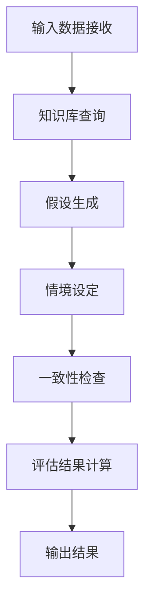
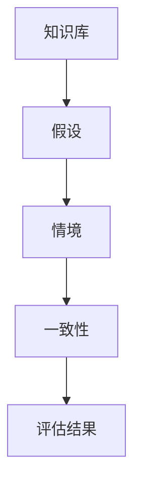

                 

# 第1章：问题背景与核心概念

## 1.1 人工智能发展现状

### 问题背景

随着信息技术的飞速发展，人工智能（AI）已经从实验室研究走向了实际应用，成为现代科技的重要驱动力。从早期的规则推理系统，到如今基于深度学习的复杂算法，AI在图像识别、自然语言处理、智能推荐、自动驾驶等领域取得了显著的成就。然而，随着AI技术的广泛应用，人们开始关注到AI回答的可靠性问题。

### 问题描述

尽管AI在许多领域表现出色，但其回答的可靠性仍然存在问题。例如，在问答系统、智能客服等应用中，AI可能会产生错误或误导性的回答。这些问题不仅影响了用户体验，还在某些关键领域（如医疗诊断、金融决策等）可能导致严重后果。

### 问题解决

为了提高AI回答的可靠性，研究人员提出了多种方法，如基于规则的推理、概率图模型、神经网络等。然而，这些方法在处理复杂问题时往往存在局限性。因此，我们需要寻找一种新的方法来解决这个问题。

## 1.2 AI回答可靠性问题

### 核心概念

自我一致性（Self-Consistency）是一种评价AI回答可靠性的方法，它通过评估AI回答的内部一致性来判断其可靠性。自我一致性框架假设，一个可靠的AI回答应该在其生成的各种假设之间保持一致性。

### 问题背景

在传统的AI系统中，回答的可靠性通常依赖于输入数据的质量和算法的复杂性。然而，当输入数据存在噪声或算法无法处理复杂问题时，AI的回答可能会失去可靠性。自我一致性框架提供了一种新的思路，通过评估AI回答的内部一致性来提高其可靠性。

### 问题描述

如何设计一个有效的自我一致性框架，以评估AI回答的可靠性？

## 1.3 自我一致性概念的定义

### 定义

自我一致性是指AI在处理问题时，其生成的各种假设之间保持一致性的能力。具体来说，如果一个AI系统在处理一个问题时，其生成的假设在不同的情境下都能保持一致性，那么这个系统就具有自我一致性。

### 特征

- **一致性**：自我一致性要求AI在不同情境下生成的假设保持一致。
- **可靠性**：自我一致性框架旨在提高AI回答的可靠性，使其在面对复杂问题时仍能提供一致且可信的答案。

### 应用场景

自我一致性框架可以应用于多个领域，包括：

- **问答系统**：在问答系统中，自我一致性可以用于评估AI的回答是否可靠。
- **智能客服**：在智能客服中，自我一致性可以帮助判断AI的回答是否准确。
- **医疗诊断**：在医疗诊断中，自我一致性可以用于评估AI提供的诊断建议的可靠性。

## 1.4 自我一致性在AI中的应用

### 应用一：问答系统

在问答系统中，自我一致性可以帮助评估AI的回答是否可靠。例如，在一个问答系统中，如果AI的回答在不同的提问下保持一致，那么我们可以认为这个回答具有较高的可靠性。

### 应用二：智能客服

在智能客服中，自我一致性可以用于评估AI的回答是否准确。例如，当用户提出一个问题时，AI需要根据已有的知识库和上下文信息给出一个准确的答案。通过自我一致性评估，我们可以确保AI的回答在不同情境下保持一致。

### 应用三：医疗诊断

在医疗诊断中，自我一致性可以用于评估AI提供的诊断建议的可靠性。例如，当AI系统诊断出一个疾病时，它需要通过自我一致性框架来确保这个诊断在不同情境下保持一致，以提高诊断的准确性。

# 第2章：自我一致性框架的基本原理

## 2.1 自我一致性框架的组成部分

### 组成部分

自我一致性框架主要由以下几个部分组成：

- **输入数据**：包括问题的描述和相关背景信息。
- **知识库**：存储了与问题相关的知识，用于生成假设。
- **推理引擎**：负责根据知识库生成假设。
- **评估模块**：用于评估生成的假设的一致性。
- **输出模块**：将评估结果呈现给用户。

### 功能

- **输入数据解析**：将问题转化为可以处理的形式，并提取相关背景信息。
- **假设生成**：根据知识库和输入数据，生成一组可能的假设。
- **一致性评估**：评估生成的假设在各个情境下的一致性。
- **输出结果**：将评估结果以易于理解的形式呈现给用户。

## 2.2 自我一致性评估机制

### 评估机制

自我一致性评估机制主要通过以下步骤进行：

1. **假设生成**：根据知识库和输入数据，生成一组可能的假设。
2. **情境设定**：为每个假设设定一系列可能的情境。
3. **一致性检查**：检查每个假设在各个情境下的一致性。
4. **评估结果计算**：根据一致性检查结果，计算每个假设的可靠性得分。

### 评估指标

- **一致性得分**：表示假设在不同情境下的一致性程度。
- **可靠性得分**：表示假设的总体可靠性。

### 评估流程

1. **输入数据解析**：将问题转化为可以处理的形式，并提取相关背景信息。
2. **假设生成**：根据知识库和输入数据，生成一组可能的假设。
3. **情境设定**：为每个假设设定一系列可能的情境。
4. **一致性检查**：检查每个假设在各个情境下的一致性。
5. **评估结果计算**：根据一致性检查结果，计算每个假设的可靠性得分。
6. **输出结果**：将评估结果以易于理解的形式呈现给用户。

## 2.3 自我一致性框架的工作流程

### 工作流程

自我一致性框架的工作流程主要包括以下几个步骤：

1. **输入数据接收**：接收用户提出的问题和相关背景信息。
2. **知识库查询**：根据输入数据，查询知识库中相关的知识。
3. **假设生成**：根据知识库中的知识，生成一组可能的假设。
4. **情境设定**：为每个假设设定一系列可能的情境。
5. **一致性检查**：检查每个假设在各个情境下的一致性。
6. **评估结果计算**：根据一致性检查结果，计算每个假设的可靠性得分。
7. **输出结果**：将评估结果以易于理解的形式呈现给用户。

### 流程图

# 第3章：核心概念与联系

## 3.1 自我一致性相关的核心概念

### 核心概念

自我一致性框架涉及到多个核心概念，以下是其中几个重要的概念：

- **知识库**：存储了与问题相关的知识，用于生成假设。
- **假设**：根据知识库和输入数据，生成的可能的回答。
- **情境**：为假设设定的可能场景。
- **一致性**：假设在不同情境下保持一致的程度。

### 定义

- **知识库**：知识库是一组有组织的信息集合，用于支持AI系统的推理和决策。
- **假设**：假设是基于现有知识和输入数据生成的可能答案。
- **情境**：情境是假设可能面临的各种场景。
- **一致性**：一致性是假设在不同情境下保持一致的程度。

### 功能

- **知识库**：提供支持AI系统推理和决策的基础知识。
- **假设**：生成可能的答案，为用户提供选择。
- **情境**：模拟问题可能面临的各种情况，评估假设的可靠性。
- **一致性**：评估假设在不同情境下的可靠性。

## 3.2 概念属性特征对比表格

为了更好地理解自我一致性框架中的核心概念，我们可以通过以下属性特征对比表格进行对比：

| 概念 | 定义 | 功能 | 属性特征 |
| ---- | ---- | ---- | ---- |
| 知识库 | 存储与问题相关的知识 | 提供支持推理和决策的基础知识 | 内容丰富性、准确性、组织结构 |
| 假设 | 根据知识库和输入数据生成的可能答案 | 为用户提供选择 | 一致性、可靠性、多样性 |
| 情境 | 假设可能面临的各种场景 | 评估假设的可靠性 | 多样性、代表性、相关性 |
| 一致性 | 假设在不同情境下保持一致的程度 | 评估假设的可靠性 | 一致性得分、可靠性得分 |

## 3.3 自我一致性框架的ER实体关系图

为了更好地理解自我一致性框架中的核心概念之间的关系，我们可以通过ER（实体关系）图进行展示：

在上面的ER图中：

- **知识库**是生成假设的基础。
- **假设**是基于知识库和情境生成的可能答案。
- **情境**用于评估假设的可靠性。
- **一致性**是评估假设的关键指标。
- **评估结果**是自我一致性框架输出的最终结果。

通过这些核心概念与联系的分析，我们可以更好地理解自我一致性框架的基本原理和功能，为后续的算法原理讲解和系统设计打下基础。在下一章中，我们将深入探讨自我一致性算法的原理和数学模型。

