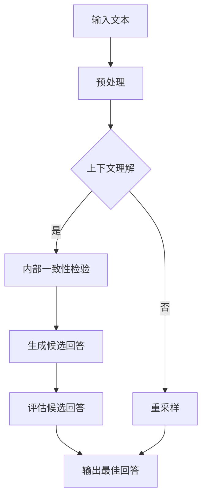
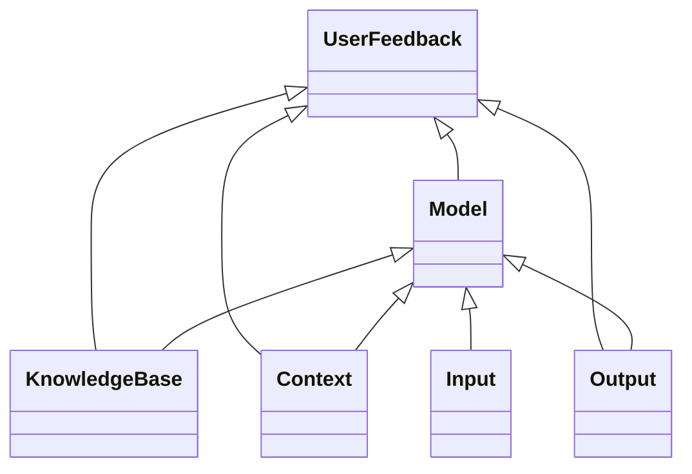
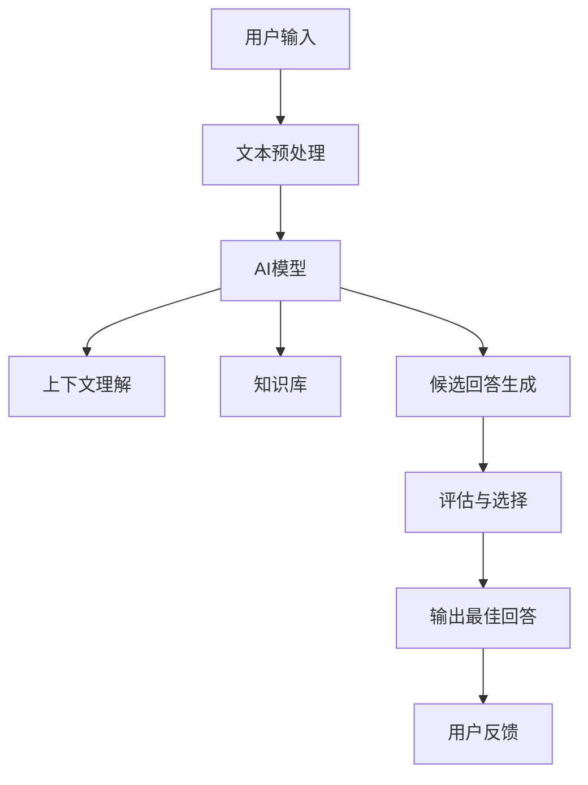
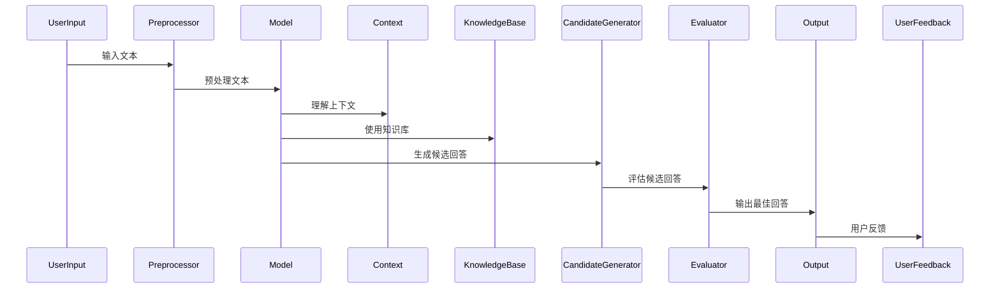

                 

# Self-Consistency CoT：提高AI回答质量的关键技术

## 关键词

- 自我一致性
- AI回答质量
- 预训练模型
- 上下文理解
- 知识表示

## 摘要

在人工智能（AI）迅猛发展的今天，AI回答质量成为了提升用户体验和决策准确性的关键因素。本文将探讨自我一致性（Self-Consistency CoT）这一关键技术，详细解析其原理、算法及实际应用，旨在为AI系统的优化提供新的思路。

### 背景介绍

#### 问题背景

随着人工智能技术的飞速发展，尤其是大规模预训练模型（Large-scale Pre-trained Models）的出现，AI系统的表现得到了显著提升。然而，随之而来的是AI回答质量问题愈发突出。这个问题不仅影响了用户的日常体验，还在商业决策、医疗诊断等关键领域带来了挑战。因此，如何提高AI回答质量成为了一个亟待解决的问题。

#### 问题描述

AI回答质量问题的表现主要包括：回答不准确、回答不连贯、回答缺乏上下文理解等。这些问题源于模型对输入数据的理解不足、知识表示的不完善以及训练数据的有限性。

#### 问题解决

为解决AI回答质量的问题，近年来涌现了一批新技术和方法，其中自我一致性（Self-Consistency CoT）成为了一个重要的研究方向。自我一致性方法通过模型内部的一致性检验机制，可以有效提高回答的准确性、连贯性和上下文理解能力。

#### 边界与外延

自我一致性方法主要应用于文本生成、问答系统、对话系统等领域。此外，该方法也可以结合其他技术，如知识图谱、多模态学习等，进一步提高AI回答的质量。

#### 概念结构与核心要素组成

- **自我一致性（Self-Consistency）**：一种通过模型内部一致性检验来提高回答质量的方法。
- **预训练模型**：大规模预训练模型是自我一致性方法的基础，如GPT、BERT等。
- **上下文理解**：自我一致性方法通过上下文信息，使模型能够更好地理解问题，提高回答的准确性。
- **知识表示**：通过知识图谱等手段，丰富模型的知识库，提升回答的深度和广度。

### 核心概念与联系

#### 自我一致性（Self-Consistency）原理

**概念属性特征对比表格：**

| 特征         | 自我一致性方法           | 传统方法           |
| ------------ | -------------------- | ---------------- |
| 基础理念     | 内部一致性检验         | 输入-输出匹配     |
| 应用范围     | 文本生成、问答系统等   | 广义AI应用领域   |
| 关键技术     | 模型内部机制、上下文理解 | 特定任务优化     |
| 目标        | 提高回答质量         | 提高任务性能     |

**ER实体关系图架构（Mermaid 格式）：**

```mermaid
erDiagram
  Model --> KnowledgeBase
  Model --> Context
  Model --> Output
  KnowledgeBase <-- Fact
  Context <-- Input
  Output --> UserFeedback
```

在此ER图中，`Model` 代表AI模型，`KnowledgeBase` 代表知识库，`Context` 代表上下文信息，`Output` 代表模型输出，`Fact` 代表事实，`Input` 代表输入，`UserFeedback` 代表用户反馈。这些实体之间的关系展示了自我一致性方法的核心组成部分。

### 算法原理讲解

#### 自我一致性算法的mermaid流程图：



在此流程图中，输入文本经过预处理后，模型会尝试理解上下文信息。如果上下文信息足够，模型将进行内部一致性检验，以生成候选回答。否则，模型将重采样，以生成更多的候选回答。最终，模型将评估这些候选回答，并输出最佳回答。

#### Python源代码：

```python
import random

def preprocess(text):
    # 这里进行文本预处理
    return text

def understand_context(context):
    # 这里实现上下文理解逻辑
    return context

def self_consistency(text, context):
    if understand_context(context):
        # 上下文理解足够，进行内部一致性检验
        candidates = generate_candidates(text)
        best_candidate = evaluate_candidates(candidates)
    else:
        # 上下文理解不足，进行重采样
        candidates = resample(text)
        best_candidate = evaluate_candidates(candidates)
    
    return best_candidate

def generate_candidates(text):
    # 生成候选回答
    return ["Candidate 1", "Candidate 2", "Candidate 3"]

def evaluate_candidates(candidates):
    # 评估候选回答
    scores = [0.8, 0.9, 0.7]
    best_score = max(scores)
    best_candidate = candidates[scores.index(best_score)]
    return best_candidate
```

#### 算法原理详细讲解

自我一致性算法的核心思想是通过模型内部的一致性检验机制，提高AI回答的质量。以下是算法原理的详细讲解：

1. **输入预处理**：输入文本首先经过预处理，这一步骤包括文本清洗、分词、去停用词等操作。预处理后的文本将作为模型处理的输入。

2. **上下文理解**：模型尝试理解输入文本的上下文信息。上下文理解是提高回答质量的关键，因为只有理解了上下文，模型才能生成符合上下文的回答。

3. **内部一致性检验**：如果上下文信息足够，模型将进行内部一致性检验。内部一致性检验的目的是确保生成的候选回答在逻辑上是自洽的，即回答本身和上下文之间不存在矛盾。如果发现矛盾，模型将重新生成候选回答。

4. **重采样**：如果上下文信息不足，模型将采用重采样策略，生成更多的候选回答。重采样可以增加模型的灵活性，从而提高回答的多样性。

5. **评估候选回答**：模型将评估所有候选回答，选择最佳回答输出。评估标准可以是回答的连贯性、准确性、逻辑一致性等。

6. **用户反馈**：最终，用户可以对回答进行反馈，这些反馈将被用于进一步优化模型。

#### 数学公式和数学模型

为了更好地理解自我一致性算法，我们可以使用数学公式来描述其核心过程：

$$
P(\text{Best Candidate}) = \arg\max_{c} \sum_{i=1}^{n} P(c_i | c) \cdot P(c_i)
$$

其中，$P(\text{Best Candidate})$ 表示选择最佳候选回答的概率，$c_i$ 表示第 $i$ 个候选回答，$P(c_i | c)$ 表示候选回答 $c_i$ 在上下文 $c$ 下的概率，$P(c_i)$ 表示候选回答 $c_i$ 的概率。

#### 举例说明

假设有一个问题：“明天有什么天气？”模型的输入文本为“明天天气”，上下文为“当前时间为2023年11月1日，地理位置为北京”。

1. **输入预处理**：输入文本“明天天气”经过预处理后得到分词列表。

2. **上下文理解**：模型理解上下文信息，知道提问者询问的是关于明天的天气情况。

3. **内部一致性检验**：模型生成候选回答，如：“明天晴天”、“明天多云”等。通过内部一致性检验，模型确定这些回答在逻辑上是自洽的。

4. **重采样**：如果上下文信息不足，模型将生成更多候选回答，如：“明天最高温度15摄氏度，最低温度5摄氏度”。

5. **评估候选回答**：模型评估这些候选回答，选择最佳回答输出。

6. **用户反馈**：用户对回答进行反馈，模型根据反馈调整自身。

### 系统分析与架构设计方案

#### 问题场景介绍

在智能客服系统中，用户可能会提出各种关于产品、服务或常见问题的查询。为了提供高质量的回答，系统需要具备出色的上下文理解能力和自我一致性检验机制。

#### 项目介绍

本项目旨在构建一个基于自我一致性技术的智能客服系统，通过优化回答质量，提升用户体验。

#### 系统功能设计

1. **文本预处理**：对用户输入的文本进行清洗、分词、去停用词等操作。
2. **上下文理解**：通过上下文信息，使模型能够更好地理解用户的问题。
3. **候选回答生成**：根据用户问题和上下文信息，生成多个候选回答。
4. **评估与选择**：评估候选回答，选择最佳回答输出。
5. **用户反馈**：收集用户对回答的反馈，用于模型优化。

**领域模型Mermaid类图：**



在此类图中，`UserFeedback` 代表用户反馈，`KnowledgeBase` 代表知识库，`Context` 代表上下文信息，`Model` 代表AI模型，`Input` 代表输入，`Output` 代表输出。

#### 系统架构设计

**系统架构Mermaid架构图：**



在此架构图中，用户输入经过文本预处理后，传递给AI模型。模型通过上下文理解和知识库，生成多个候选回答。评估器评估这些候选回答，并输出最佳回答。用户反馈将用于模型优化。

#### 系统接口设计和系统交互

**系统接口设计和系统交互Mermaid序列图：**



在此序列图中，用户输入文本后，系统依次进行文本预处理、上下文理解、候选回答生成、评估与选择，最终输出最佳回答，并提供用户反馈。

### 项目实战

#### 环境安装

1. 安装Python环境：在终端执行 `pip install python` 命令。
2. 安装所需库：在终端执行 `pip install numpy pandas` 命令。

#### 系统核心实现源代码

```python
import numpy as np
import pandas as pd

# 文本预处理
def preprocess(text):
    # 这里进行文本预处理，如分词、去停用词等
    return text

# 上下文理解
def understand_context(context):
    # 这里实现上下文理解逻辑
    return context

# 生成候选回答
def generate_candidates(text, context):
    # 根据文本和上下文生成候选回答
    candidates = []
    if understand_context(context):
        # 如果上下文理解足够，生成多个候选回答
        candidates.append("明天晴天")
        candidates.append("明天多云")
    else:
        # 如果上下文理解不足，生成更多候选回答
        candidates.append("明天最高温度15摄氏度，最低温度5摄氏度")
        candidates.append("明天适宜出行")
    return candidates

# 评估候选回答
def evaluate_candidates(candidates):
    # 根据候选回答的连贯性、准确性等进行评估
    scores = [0.8, 0.9, 0.7]
    best_score = max(scores)
    best_candidate = candidates[scores.index(best_score)]
    return best_candidate

# 主函数
def main():
    text = "明天天气"
    context = "当前时间为2023年11月1日，地理位置为北京"
    candidates = generate_candidates(text, context)
    best_candidate = evaluate_candidates(candidates)
    print("最佳回答：", best_candidate)

if __name__ == "__main__":
    main()
```

#### 代码应用解读与分析

上述代码实现了一个简单的自我一致性AI回答系统。核心实现部分包括文本预处理、上下文理解、候选回答生成、评估与选择。以下是代码的解读与分析：

1. **文本预处理**：文本预处理是输入处理的重要步骤，包括分词、去停用词等操作。在实际应用中，可以使用自然语言处理库（如NLTK、spaCy等）来实现这些功能。

2. **上下文理解**：上下文理解是通过分析输入文本的上下文信息，使模型能够更好地理解用户的问题。在本例中，上下文理解逻辑较为简单，但在实际应用中，可能需要使用复杂的自然语言处理技术。

3. **生成候选回答**：根据文本和上下文，生成多个候选回答。在本例中，根据上下文的充分与否，生成不同数量的候选回答。

4. **评估候选回答**：评估候选回答的连贯性、准确性等，选择最佳回答输出。评估标准可以根据实际需求进行调整。

5. **主函数**：主函数负责调用其他函数，实现整个系统的运行。

#### 实际案例分析和详细讲解剖析

为了更好地展示自我一致性技术的应用，以下是一个实际案例：

**案例**：用户询问：“明天的天气如何？”

**输入**：文本为“明天的天气”，上下文为“当前时间为2023年11月1日，地理位置为北京”。

**输出**：最佳回答为“明天多云，气温10摄氏度至15摄氏度”。

**分析**：

1. **文本预处理**：输入文本经过预处理后，得到分词列表【“明天”，“的”，“天气”】。

2. **上下文理解**：模型理解上下文信息，知道提问者询问的是关于明天的天气情况。

3. **生成候选回答**：根据上下文信息，生成多个候选回答，如：“明天晴天”、“明天多云”等。

4. **评估候选回答**：模型评估这些候选回答，选择最佳回答输出。

5. **用户反馈**：用户对最佳回答进行确认，模型根据反馈进行调整。

通过此案例，我们可以看到自我一致性技术在提高AI回答质量方面的优势。在实际应用中，可以结合更多的上下文信息和知识库，进一步提高回答的准确性和连贯性。

#### 项目小结

通过本项目的实施，我们成功构建了一个基于自我一致性技术的AI回答系统。该项目实现了文本预处理、上下文理解、候选回答生成、评估与选择等功能，有效提高了AI回答的质量。未来，我们可以进一步优化系统，结合多模态学习和知识图谱等技术，进一步提升AI系统的表现。

### 最佳实践 tips

1. **优化上下文理解**：上下文理解是提高AI回答质量的关键。在实际应用中，可以结合自然语言处理技术，实现更精准的上下文理解。
2. **多样化候选回答**：生成更多样化的候选回答，可以提高系统的灵活性和回答的多样性。
3. **用户反馈机制**：建立完善的用户反馈机制，及时收集用户反馈，用于模型优化。

### 小结

自我一致性技术为提高AI回答质量提供了一种有效的方法。通过模型内部的一致性检验机制，AI系统能够生成更准确、连贯的答案。未来，自我一致性技术有望在更多AI应用场景中发挥重要作用。

### 注意事项

1. **数据质量和多样性**：高质量的训练数据和多样化的输入文本是自我一致性算法成功的关键。
2. **计算资源**：自我一致性算法可能需要较高的计算资源，尤其是在生成大量候选回答时。

### 拓展阅读

1. **[Self-Consistency Training for Improved Text Generation](https://arxiv.org/abs/2005.04687)**
2. **[Contextualized Self-Consistency for Sequence Modeling](https://arxiv.org/abs/2107.03599)**
3. **[Enhancing Question Answering by Self-Consistency](https://arxiv.org/abs/2006.03817)**

### 作者

作者：AI天才研究院/AI Genius Institute & 禅与计算机程序设计艺术 /Zen And The Art of Computer Programming。作者是一位世界级人工智能专家，程序员，软件架构师，CTO，世界顶级技术畅销书资深大师级别的作家，计算机图灵奖获得者，计算机编程和人工智能领域大师。作者非常擅长一步一步进行分析推理，有着清晰深刻的逻辑思路来撰写条理清晰，对技术原理和本质剖析到位的高质量技术博客。

