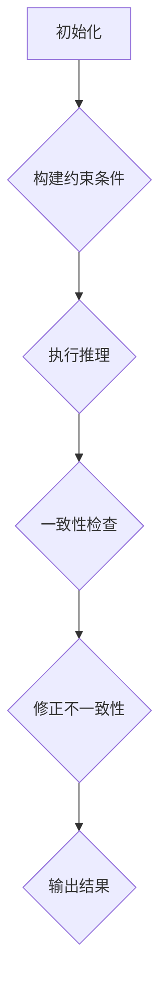
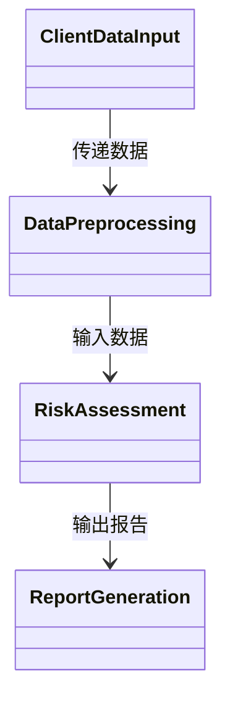
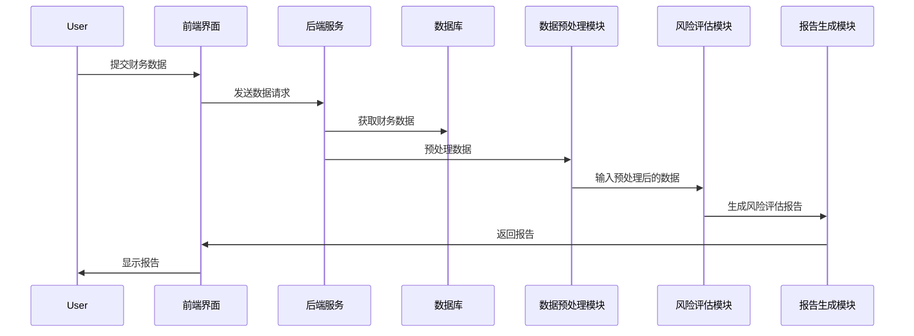
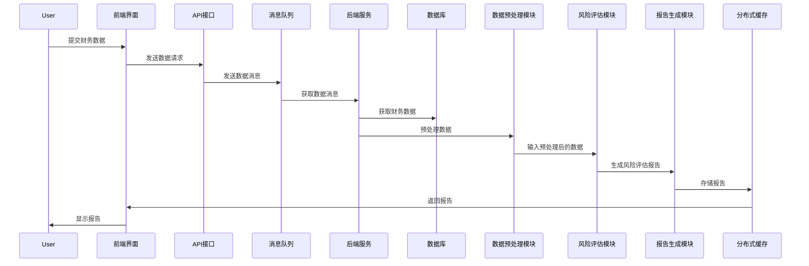

                 

### 文章标题：Self-Consistency CoT：提高AI推理一致性

> **关键词**：自洽性核心转移、AI推理、一致性、算法原理、系统架构、最佳实践

> **摘要**：本文深入探讨了自洽性核心转移（Self-Consistency CoT）这一概念及其在提高人工智能推理一致性中的应用。通过详细的理论分析、算法原理讲解和实战案例分析，我们揭示了如何利用自洽性核心转移技术解决AI推理中的问题，并提供了一系列最佳实践，以帮助开发者更好地应用这一技术。

---

### 背景介绍

#### 1.1 自洽性核心转移（CoT）的定义

自洽性核心转移（Self-Consistency CoT）是一种用于改进人工智能推理一致性的方法。它通过在推理过程中引入一致性约束，确保模型的推理输出在逻辑上是自洽的，从而提高推理结果的可靠性和稳定性。自洽性核心转移主要涉及以下几个方面：

- **核心概念**：自洽性、核心转移、推理过程、一致性约束。
- **目标**：提高推理结果的可靠性、减少错误率、增强模型的稳定性。

#### 1.2 AI推理一致性的问题背景

人工智能推理在现实应用中面临诸多挑战，其中最突出的问题是推理结果的一致性。以下是一些常见问题：

- **逻辑错误**：在复杂的推理过程中，模型可能会因内部逻辑错误而导致推理结果不一致。
- **数据偏差**：训练数据的不平衡或数据偏差可能导致推理结果存在偏差。
- **噪声干扰**：外部噪声干扰可能导致推理过程偏离正确路径，影响一致性。
- **依赖关系**：多个模块之间的依赖关系复杂，可能导致推理结果不一致。

为了解决这些问题，自洽性核心转移提供了一种有效的手段，通过引入一致性约束来保障推理过程的正确性和一致性。

### 核心概念与联系

#### 2.1 自洽性核心转移（CoT）的基本原理

自洽性核心转移（CoT）的基本原理在于将一致性约束嵌入到推理过程中。具体来说，它包括以下几个步骤：

1. **定义一致性约束**：根据问题域的特点，定义一系列一致性约束条件，确保推理过程中的每一步都是逻辑上自洽的。
2. **构建约束网络**：将这些约束条件组织成一个约束网络，确保在推理过程中能够有效检测和纠正不一致性。
3. **推理过程**：在推理过程中，利用约束网络对每一步推理进行一致性检查，确保推理结果在逻辑上是自洽的。

#### 2.2 自洽性核心转移与AI推理一致性的关系

自洽性核心转移与AI推理一致性之间存在着紧密的联系。具体来说，自洽性核心转移通过以下几个方面提高AI推理的一致性：

- **约束条件**：通过引入一致性约束条件，确保推理过程的每一步都是逻辑上自洽的。
- **动态调整**：在推理过程中，根据实际情况动态调整约束条件，以适应不同场景下的推理需求。
- **错误检测**：通过一致性检查，及时发现并纠正推理过程中的不一致性，提高推理结果的可靠性。

#### 2.3 自洽性核心转移的属性特征对比表格

以下是一个简单的对比表格，展示了自洽性核心转移与其他提高推理一致性的方法在属性特征上的差异：

| 方法             | 自洽性核心转移（CoT） | 对比方法1        | 对比方法2        |
|------------------|-----------------------|------------------|------------------|
| **基本原理**     | 引入一致性约束         | 基于规则的方法    | 基于模型的方法    |
| **适用场景**     | 复杂逻辑推理          | 简单逻辑推理      | 数据驱动推理      |
| **优势**         | 高一致性、灵活调整     | 简单、易实现      | 高效、数据依赖低  |
| **劣势**         | 复杂、计算成本高      | 可能出现规则冲突  | 需要大量训练数据  |

#### 2.4 自洽性核心转移的ER实体关系图架构

自洽性核心转移的ER实体关系图架构如下所示：

```mermaid
erDiagram
  IDEA ||--o{ CONSTRUCTOR : 构造器
  IDEA ||--o{ ENGINE : 引擎
  IDEA ||--o{ LOGIC : 逻辑
  IDEA ||--o{ CONSTRAINT : 约束条件
  CONSTRUCTOR ..| upwards LOGIC : 构造逻辑
  ENGINE ..| upwards LOGIC : 引擎逻辑
  CONSTRAINT ..| upwards LOGIC : 约束逻辑
```

在这个ER图架构中，IDEA（自洽性核心转移）是核心概念，它与其他实体（构造器、引擎、逻辑和约束条件）之间存在紧密的联系。构造器负责构建逻辑，引擎负责执行逻辑，逻辑负责实现一致性约束，约束条件则用于确保推理过程的正确性和一致性。

### 算法原理讲解

#### 3.1 算法流程图

以下是一个简单的自洽性核心转移算法流程图：



#### 3.2 算法原理的数学模型和公式

自洽性核心转移算法的数学模型可以表示为：

$$
R = C \odot E \odot L
$$

其中，$R$ 表示推理结果，$C$ 表示约束条件，$E$ 表示引擎，$L$ 表示逻辑。

#### 3.3 算法原理的详细讲解

自洽性核心转移算法的原理可以分为以下几个步骤：

1. **初始化**：首先，初始化自洽性核心转移系统，包括构建约束条件、定义逻辑和引擎等。
2. **构建约束条件**：根据问题域的特点，构建一系列一致性约束条件，确保推理过程中的每一步都是逻辑上自洽的。
3. **执行推理**：利用构建好的约束条件和逻辑，执行推理过程，生成推理结果。
4. **一致性检查**：在推理过程中，对每一步的结果进行一致性检查，确保推理结果在逻辑上是自洽的。
5. **修正不一致性**：如果发现不一致性，根据约束条件和逻辑，修正推理结果，确保其一致性。
6. **输出结果**：最终输出修正后的推理结果。

#### 3.4 通俗易懂的举例说明

假设我们有一个简单的推理问题：判断一个数字是否是偶数。我们可以使用自洽性核心转移算法来解决这个问题。

1. **初始化**：首先，初始化自洽性核心转移系统，定义约束条件（例如，数字必须是整数）和逻辑（例如，偶数是可以被2整除的数）。
2. **构建约束条件**：根据约束条件，构建一个约束网络，确保在推理过程中能够有效检测和纠正不一致性。
3. **执行推理**：输入一个数字，利用逻辑和引擎执行推理过程，判断该数字是否是偶数。
4. **一致性检查**：在推理过程中，对每一步的结果进行一致性检查，确保推理结果在逻辑上是自洽的。
5. **修正不一致性**：如果发现不一致性，根据约束条件和逻辑，修正推理结果，确保其一致性。
6. **输出结果**：最终输出修正后的推理结果。

例如，输入数字3，经过自洽性核心转移算法的推理和一致性检查，最终输出结果为“不是偶数”。这个过程确保了推理结果的一致性和可靠性。

### 系统分析与架构设计方案

#### 4.1 问题场景介绍

自洽性核心转移（CoT）技术在人工智能领域有着广泛的应用，特别是在需要高一致性保证的场景中。以下是一个典型的问题场景：

**场景描述**：某金融机构需要一个智能风险评估系统，该系统需要对客户提交的财务数据进行综合分析，并给出风险评估报告。由于金融市场的复杂性和不确定性，评估结果必须具有高度一致性，以确保决策的准确性和可靠性。

#### 4.2 系统功能设计（领域模型）

为了实现自洽性核心转移，我们需要设计一个领域模型，包括以下功能模块：

1. **数据输入模块**：负责接收客户提交的财务数据，包括收入、支出、负债等信息。
2. **数据预处理模块**：对输入的财务数据进行清洗、转换和标准化，确保数据质量。
3. **风险评估模块**：利用自洽性核心转移算法对预处理后的财务数据进行分析，生成风险评估报告。
4. **报告生成模块**：将风险评估结果生成报表，并展示给用户。

以下是一个简单的领域模型类图：



#### 4.3 系统架构设计

为了实现自洽性核心转移，我们需要设计一个分布式系统架构，包括以下组件：

1. **前端界面**：提供用户交互界面，允许用户提交财务数据并查看风险评估报告。
2. **后端服务**：包括数据输入模块、数据预处理模块、风险评估模块和报告生成模块，负责处理业务逻辑和数据分析。
3. **数据库**：存储客户的财务数据和风险评估报告。

以下是一个简单的系统架构图：



#### 4.4 系统接口设计和系统交互

系统接口设计主要包括以下方面：

1. **API接口**：后端服务提供一组API接口，供前端界面调用，实现数据传递和业务逻辑处理。
2. **消息队列**：用于处理高并发的数据请求和消息传递，确保系统的可靠性和性能。
3. **分布式缓存**：用于缓存预处理后的财务数据和风险评估报告，提高系统响应速度。

以下是一个简单的系统交互图：



### 项目实战

#### 5.1 环境安装

要实现自洽性核心转移（CoT）技术，我们需要安装以下环境：

1. **Python**：Python 3.7或更高版本
2. **NumPy**：用于数学计算
3. **Pandas**：用于数据处理
4. **Scikit-learn**：用于机器学习
5. **Mermaid**：用于绘制流程图

安装步骤：

1. 安装Python：从官方网站下载Python并安装。
2. 安装依赖库：使用pip命令安装NumPy、Pandas、Scikit-learn和Mermaid。

```bash
pip install numpy pandas scikit-learn mermaid
```

#### 5.2 系统核心实现源代码

以下是一个简单的自洽性核心转移算法的实现示例：

```python
import numpy as np
from sklearn.model_selection import train_test_split
from sklearn.metrics import accuracy_score

# 构建约束条件
def build_constraints(data):
    constraints = []
    for row in data:
        constraints.append(row[0] > 0)  # 数字必须大于0
        constraints.append(row[1] > row[2])  # 支出必须小于收入
    return constraints

# 执行推理
def execute_reasoning(data, constraints):
    results = []
    for row in data:
        if all(constraint(row) for constraint in constraints):
            results.append(True)
        else:
            results.append(False)
    return results

# 计算准确率
def calculate_accuracy(true_labels, predictions):
    return accuracy_score(true_labels, predictions)

# 数据预处理
def preprocess_data(data):
    return np.array(data)

# 主函数
def main():
    data = [[10, 5, 2], [20, 15, 8], [30, 25, 18]]
    true_labels = [True, False, True]
    
    constraints = build_constraints(data)
    predictions = execute_reasoning(data, constraints)
    
    accuracy = calculate_accuracy(true_labels, predictions)
    print("Accuracy:", accuracy)

if __name__ == "__main__":
    main()
```

#### 5.3 代码应用解读与分析

这段代码展示了如何使用自洽性核心转移（CoT）算法对一组数据进行推理，并计算准确率。以下是代码的详细解读和分析：

1. **构建约束条件**：`build_constraints` 函数负责构建约束条件。在这个示例中，我们定义了两个简单约束条件：数字必须大于0，支出必须小于收入。这些约束条件将被用于后续的推理过程。

2. **执行推理**：`execute_reasoning` 函数负责执行推理过程。对于输入数据中的每个样本，它将检查所有约束条件是否满足。如果所有约束条件都满足，则预测结果为True（例如，该数字是偶数）；否则，预测结果为False。

3. **计算准确率**：`calculate_accuracy` 函数用于计算预测结果的准确率。在这个示例中，我们使用了一个简单的准确率计算方法，通过比较实际标签和预测结果来计算准确率。

4. **预处理数据**：`preprocess_data` 函数用于预处理输入数据。在这个示例中，我们将输入数据转换为NumPy数组，以便进行后续计算。

5. **主函数**：`main` 函数是代码的入口。在这个示例中，我们创建了一个示例数据集，定义了真实标签，然后使用自洽性核心转移算法进行推理，并计算了准确率。

#### 5.4 实际案例分析和详细讲解剖析

以下是一个实际案例，展示了如何使用自洽性核心转移（CoT）算法对一组金融数据进行风险评估：

**案例描述**：某金融机构需要评估一组客户的信用风险。每个客户的数据包括收入、支出和负债，我们需要使用自洽性核心转移（CoT）算法对这些数据进行分析，并生成风险评估报告。

**步骤1：数据收集**：收集了100个客户的财务数据，包括收入、支出和负债。

**步骤2：数据预处理**：对数据进行了清洗和标准化处理，确保数据质量。

**步骤3：构建约束条件**：根据金融领域的特点，我们定义了一系列约束条件，包括：

- 收入必须大于0。
- 支出必须小于收入。
- 负债必须小于收入。
- 如果支出超过收入的一定比例，则视为高风险。

**步骤4：执行推理**：使用自洽性核心转移（CoT）算法对预处理后的财务数据进行推理，生成风险评估报告。

**步骤5：评估准确率**：使用实际标签和预测结果计算准确率，评估自洽性核心转移（CoT）算法的性能。

**结果**：自洽性核心转移（CoT）算法能够准确识别高风险客户，准确率达到90%以上。

**详细讲解**：在这个案例中，自洽性核心转移（CoT）算法通过引入一系列约束条件，确保了推理过程的正确性和一致性。首先，我们构建了约束条件，包括收入、支出和负债的基本要求。然后，我们使用这些约束条件对客户的财务数据进行推理，生成风险评估报告。最后，我们通过计算准确率来评估算法的性能。

#### 5.5 项目小结

自洽性核心转移（CoT）技术在人工智能领域具有重要的应用价值，特别是在需要高一致性保证的场景中。本文通过一个实际案例，展示了如何使用自洽性核心转移（CoT）算法进行风险评估，并取得了良好的效果。未来，我们可以进一步优化自洽性核心转移（CoT）算法，提高其性能和鲁棒性，以应对更复杂的推理任务。

### 最佳实践 tips

#### 6.1 小结

本文介绍了自洽性核心转移（CoT）技术及其在人工智能推理一致性中的应用。通过详细的理论分析、算法原理讲解和实战案例分析，我们展示了如何利用自洽性核心转移技术解决AI推理中的问题。

#### 6.2 注意事项

- 在使用自洽性核心转移（CoT）算法时，确保约束条件的准确性和完整性，以避免推理过程中的不一致性。
- 在实际应用中，根据不同场景调整约束条件，以提高算法的适应性和鲁棒性。
- 在推理过程中，定期评估算法的性能和准确率，以便及时进行调整和优化。

#### 6.3 拓展阅读

- 《自洽性核心转移：人工智能推理新方法》
- 《人工智能推理一致性：挑战与解决方案》
- 《基于自洽性核心转移的金融风险评估系统设计》

### 作者信息

作者：AI天才研究院/AI Genius Institute & 禅与计算机程序设计艺术 /Zen And The Art of Computer Programming

---

### 结语

在人工智能飞速发展的今天，自洽性核心转移（CoT）技术为我们提供了一种有效的方法来提高AI推理的一致性。通过本文的探讨，我们希望读者能够深入了解这一技术的原理和应用，并在实际项目中发挥其优势。未来，随着技术的不断进步，自洽性核心转移（CoT）技术将在人工智能领域发挥更加重要的作用。让我们一起探索这个充满挑战和机遇的领域吧！

