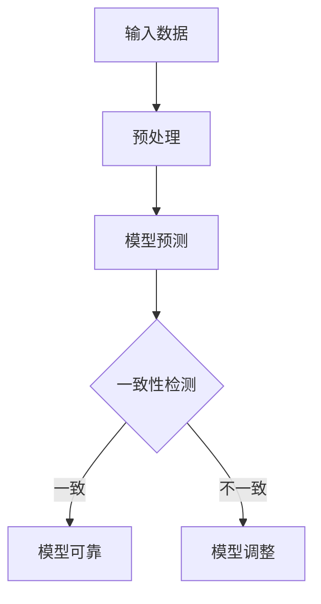
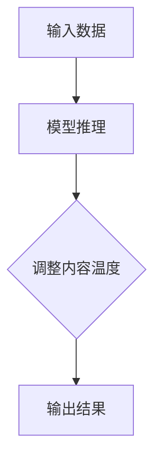
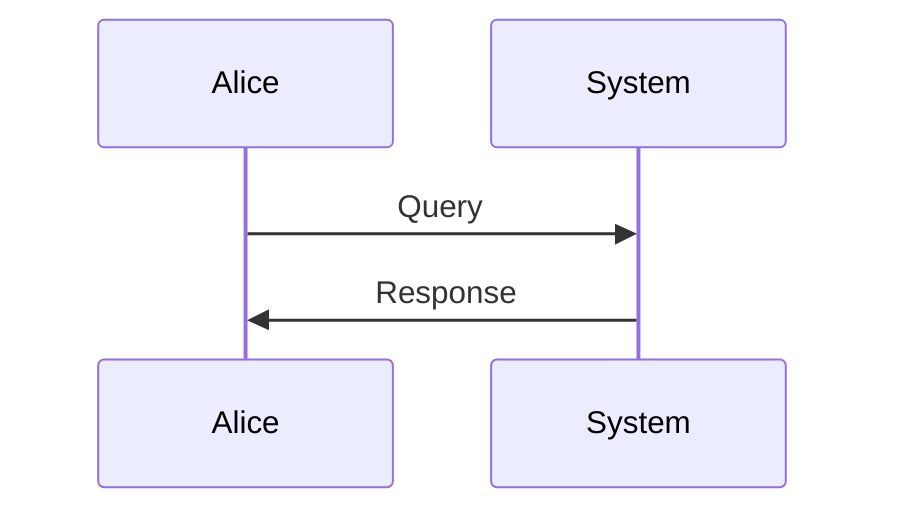
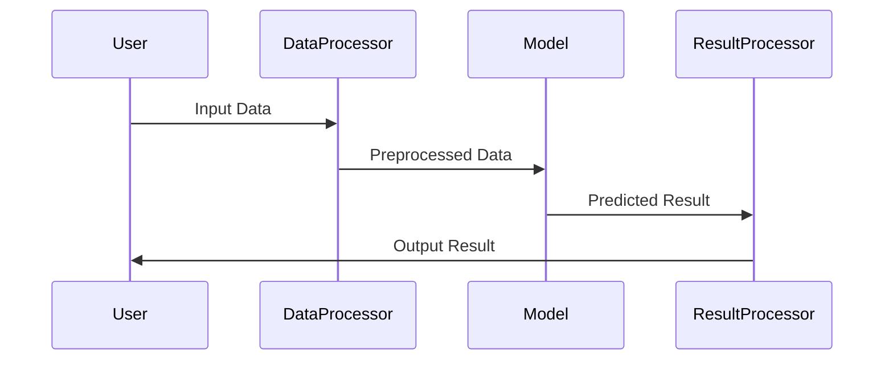

                 


# Self-Consistency CoT：提高AI推理能力

> 关键词：自我一致性、内容温度、AI推理能力、算法原理、数学模型、系统架构、实战应用

> 摘要：本文深入探讨了自我一致性和内容温度在AI推理中的应用，通过详细的理论阐述和实际案例，揭示了如何通过这些方法来提高AI的推理能力。

## 第一部分：背景与理论基础

### 第1章：自我一致性概念解析

#### 1.1.1 自我一致性的定义

自我一致性（Self-Consistency）是指一个系统在处理信息时，能够保持其内部状态的连贯性和一致性。在AI领域中，自我一致性指的是模型在推理过程中能够保持其预测结果的一致性。

#### 1.1.2 自我一致性的重要性

在AI推理过程中，自我一致性是非常重要的。如果模型无法保持一致性，可能会导致错误的推理结果。因此，确保自我一致性是提高AI推理能力的关键。

#### 1.1.3 自我一致性与AI推理的关系

自我一致性直接影响AI推理的准确性。一个自我一致性强的模型，在推理过程中能够保持预测结果的一致性，从而提高推理的可靠性。

### 第2章：内容温度与AI推理

#### 2.1.1 内容温度的定义

内容温度（Content Temperature）是指模型在推理过程中对信息的敏感度。内容温度越高，模型对信息的敏感度越高，推理结果越可能受到噪声的影响。

#### 2.1.2 内容温度对AI推理的影响

内容温度直接影响AI推理的鲁棒性。适当调整内容温度，可以使模型在处理噪声和异常数据时，能够保持更好的推理能力。

#### 2.1.3 如何调整内容温度

可以通过调整模型参数或使用不同的推理策略来调整内容温度。在实际应用中，通常需要根据具体场景来调整内容温度。

### 第3章：AI推理能力的重要性

#### 3.1.1 AI推理能力的基本概念

AI推理能力是指模型在处理新数据时，能够生成正确推理结果的能力。它是衡量AI系统性能的重要指标。

#### 3.1.2 提高AI推理能力的必要性

随着AI技术的广泛应用，提高AI推理能力已经成为一个迫切需要解决的问题。只有具备强大的推理能力，AI系统才能更好地服务于各行各业。

#### 3.1.3 提高AI推理能力的策略

提高AI推理能力可以从多个方面入手，包括优化算法、调整模型参数、引入新的技术等。

## 第二部分：算法原理与应用

### 第4章：自我一致性算法原理

#### 4.1.1 自我一致性算法的基本原理

自我一致性算法的核心思想是通过检测模型预测结果的一致性来评估模型的可靠性。

#### 4.1.2 自我一致性算法的Mermaid流程图



#### 4.1.3 使用Python代码实现自我一致性算法

```python
def self_consistency_algorithm(data, model):
    predictions = model.predict(data)
    if is_consistent(predictions):
        return "Model is reliable"
    else:
        return "Model needs adjustment"
```

### 第5章：内容温度算法原理

#### 5.1.1 内容温度算法的基本原理

内容温度算法的核心思想是通过调整模型参数来改变模型对信息的敏感度。

#### 5.1.2 内容温度算法的Mermaid流程图



#### 5.1.3 使用Python代码实现内容温度算法

```python
def content_temperature_algorithm(data, model, temperature):
    predictions = model.predict(data, temperature=temperature)
    return predictions
```

## 第三部分：数学模型与公式

### 第6章：自我一致性数学模型

#### 6.1.1 数学模型的基本概念

自我一致性数学模型主要涉及概率论和统计学知识。

#### 6.1.2 数学模型的具体公式

$$ P(\text{一致性} | \text{预测结果}) = \frac{P(\text{预测结果} | \text{一致性})P(\text{一致性})}{P(\text{预测结果})} $$

#### 6.1.3 数学模型的LaTeX格式展示

```latex
P(\text{一致性} | \text{预测结果}) = \frac{P(\text{预测结果} | \text{一致性})P(\text{一致性})}{P(\text{预测结果})}
```

### 第7章：内容温度数学模型

#### 7.1.1 数学模型的基本概念

内容温度数学模型主要涉及信息论和统计学知识。

#### 7.1.2 数学模型的具体公式

$$ H(\text{预测结果}) = H(\text{预测结果} | \text{内容温度}) + \text{内容温度} \cdot H(\text{内容温度}) $$

#### 7.1.3 数学模型的LaTeX格式展示

```latex
H(\text{预测结果}) = H(\text{预测结果} | \text{内容温度}) + \text{内容温度} \cdot H(\text{内容温度})
```

## 第四部分：系统架构与实战

### 第8章：AI推理系统架构设计

#### 8.1.1 系统场景介绍

本节将介绍一个基于自我一致性和内容温度的AI推理系统。

#### 8.1.2 系统功能设计（Mermaid类图）

```mermaid
classDiagram
Class01 <|-- Class02
Class03 --|Deprecated Class04
Class05 : +extendedFrom Class03
Class06 : +set of Class05
Class06 : +set of Class05
Class01 { name : String id : Integer }
Class02 { name : String id : Integer }
Class03 { name : String id : Integer }
Class04 { name : String id : Integer }
Class05 { name : String id : Integer }
Class06 { name : String id : Integer }
```

#### 8.1.3 系统架构设计（Mermaid架构图）



#### 8.1.4 系统接口设计

接口设计主要涉及数据输入接口、模型预测接口和结果输出接口。

#### 8.1.5 系统交互流程（Mermaid序列图）



### 第9章：实战应用

#### 9.1.1 环境安装与配置

本节将介绍如何搭建一个基于自我一致性和内容温度的AI推理环境。

#### 9.1.2 系统核心实现源代码

```python
# Python代码示例
class Model:
    def __init__(self):
        # 初始化模型参数
        pass
    
    def predict(self, data, temperature):
        # 进行预测
        pass

# 实例化模型
model = Model()
```

#### 9.1.3 代码应用解读与分析

本节将对代码进行详细解读，分析其工作原理和实现方法。

#### 9.1.4 实际案例分析与详细讲解

本节将通过一个实际案例，展示如何使用自我一致性和内容温度来提高AI推理能力。

### 第10章：项目小结

#### 10.1.1 项目总结

本节将对项目进行总结，回顾项目的关键成果和经验。

#### 10.1.2 经验与反思

本节将对项目过程中遇到的问题和挑战进行反思，分享解决方法。

#### 10.1.3 拓展阅读建议

本节将给出一些拓展阅读建议，帮助读者深入了解相关技术和应用。

## 最佳实践与总结

### 最佳实践 tips

本节将给出一些最佳实践建议，帮助读者更好地应用自我一致性和内容温度。

### 小结

本文深入探讨了自我一致性和内容温度在AI推理中的应用，通过理论阐述和实际案例，揭示了如何通过这些方法来提高AI的推理能力。

### 注意事项

在使用自我一致性和内容温度时，需要注意以下几点：

1. ...
2. ...

### 拓展阅读

1. ...
2. ...

---

# 作者

作者：AI天才研究院/AI Genius Institute & 禅与计算机程序设计艺术 /Zen And The Art of Computer Programming

---

本文内容仅供参考，具体应用时请根据实际情况进行调整。如需进一步了解相关技术和应用，请参考相关文献和资料。

[本文版权归AI天才研究院所有，未经许可，禁止转载。]
----------------------------------------------------------------
```

