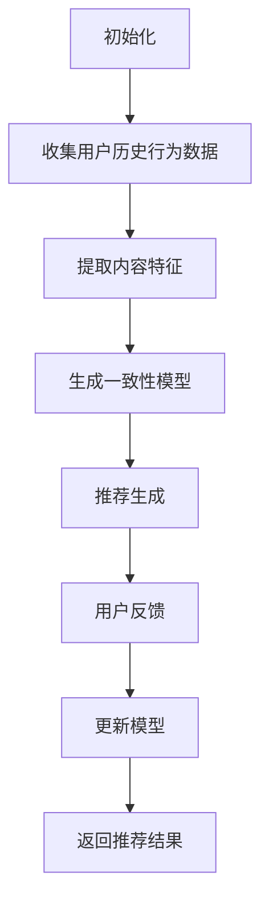
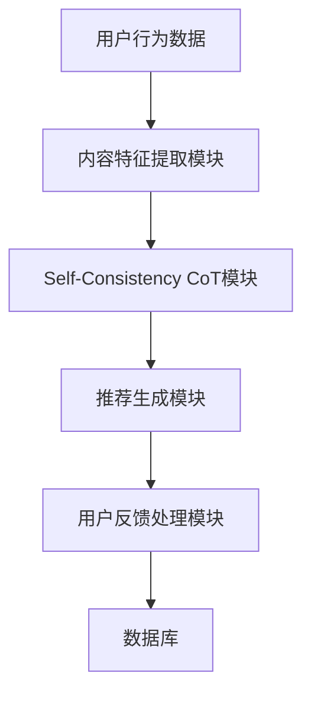
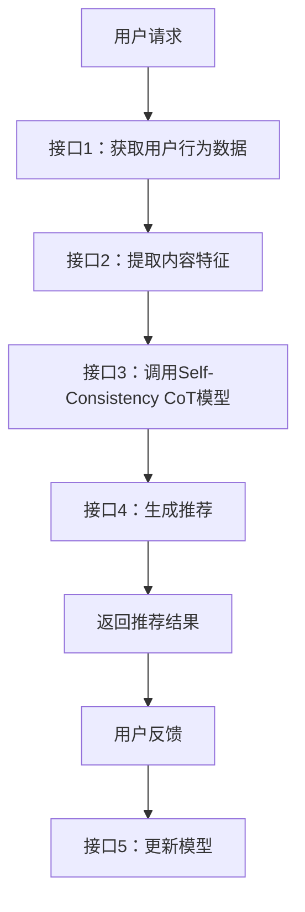

                 

### 让我们一步一步深入思考：为什么Self-Consistency CoT能提高AI推荐系统的准确性？

#### 第一步：背景分析

**问题背景**：

在当今的数字时代，推荐系统已经成为许多应用程序和平台的核心功能。无论是电子商务网站、社交媒体平台还是视频流媒体服务，推荐系统能够有效地向用户推荐他们可能感兴趣的内容，从而提高用户满意度、提升平台粘性以及增加商业价值。

然而，传统的推荐系统面临诸多挑战：

- **数据稀疏性**：用户的兴趣和行为数据往往非常稀疏，这使得模型难以学习用户的精确偏好。
- **冷启动问题**：新用户由于缺乏历史数据，难以进行有效推荐。
- **多样性和平衡性**：推荐系统需要提供多样化的内容，避免用户陷入“信息茧房”。

**问题解决**：

Self-Consistency CoT（Self-Consistency Content Transfer）是一种先进的技术，旨在通过提高推荐系统的自我一致性来提升准确性。它能够更好地处理数据稀疏性和冷启动问题，同时保持推荐内容的多样性。

#### 第二步：核心概念解析

**Self-Consistency CoT的定义**：

Self-Consistency CoT是一种基于内容转移的技术，它通过确保推荐系统内部的一致性来提高推荐准确性。具体来说，它利用用户历史行为和内容特征，生成一个能够反映用户兴趣的一致性模型。

**原理**：

- **内容转移**：将用户的历史行为和内容特征转换为一致性的模型表示。
- **自我一致性**：确保推荐系统内部的所有推荐决策都保持一致，从而减少错误推荐的可能性。

#### 第三步：算法流程与原理

**算法流程图**：

使用Mermaid绘制Self-Consistency CoT的算法流程图，如下：



**Python源代码示例**：

```python
# Python伪代码示例
class SelfConsistencyCoT:
    def __init__(self, data):
        self.data = data
        self.model = None
    
    def fit(self):
        # 数据预处理、特征提取、模型生成等
        pass
    
    def predict(self, user_data):
        # 基于模型生成推荐
        pass
    
    def update_model(self, feedback):
        # 更新模型以保持一致性
        pass
```

**数学模型与公式**：

Self-Consistency CoT的核心在于内容转移的一致性损失函数。假设用户行为数据为\(X\)，内容特征为\(Y\)，一致性模型为\(Z\)，则一致性损失函数可以表示为：

$$
L = \sum_{i=1}^{N} \sum_{j=1}^{M} |Z_{ij} - \text{Expected}(Z_{ij})|
$$

其中，\(N\)是用户数量，\(M\)是项目数量，\(\text{Expected}(Z_{ij})\)是预期的一致性值。

#### 第四步：详细讲解与举例说明

**例子**：

假设我们有一个用户，他的历史行为包括购买了10本书，这些书的内容特征分别为（浪漫、历史、科幻、科幻、浪漫、历史、科幻、浪漫、科幻、浪漫）。

- **初始化**：首先，我们初始化一致性模型，确保模型能够反映用户对浪漫和历史书籍的兴趣。
- **内容特征提取**：我们将这10本书的内容特征转换为向量表示。
- **模型生成**：利用内容特征生成一致性模型，使得模型能够预测用户对浪漫和历史书籍的偏好。
- **推荐生成**：基于一致性模型，我们向用户推荐更多浪漫和历史书籍。
- **用户反馈**：用户对推荐的书籍进行反馈，如评分、评论等。
- **模型更新**：根据用户反馈，更新一致性模型，以保持推荐的一致性和准确性。

通过这种方式，Self-Consistency CoT能够确保推荐系统在动态变化的环境中保持稳定性和准确性，从而提高用户的满意度。

#### 第五步：系统分析与架构设计

**问题场景**：

在一个电子商务平台上，推荐系统需要确保为用户提供个性化且相关的商品推荐。

**项目介绍**：

本项目旨在通过引入Self-Consistency CoT，提高电子商务平台推荐系统的准确性。

**系统功能设计**：

- **用户行为收集**：收集用户购买历史、浏览记录等行为数据。
- **内容特征提取**：提取商品的内容特征，如类别、品牌、价格等。
- **推荐生成**：基于Self-Consistency CoT模型生成个性化推荐。
- **用户反馈处理**：处理用户对推荐的反馈，以优化模型。

**系统架构设计**：

使用Mermaid绘制系统架构图，如下：



**系统接口设计与交互**：

使用Mermaid绘制系统接口设计和交互序列图，如下：



#### 第六步：项目实战

**环境安装**：

首先，确保安装了Python环境以及必要的库，如NumPy、Pandas、Scikit-learn等。

```bash
pip install numpy pandas scikit-learn
```

**系统核心实现源代码**：

```python
# 伪代码
class SelfConsistencyCoT:
    def __init__(self, data):
        self.data = data
        self.model = None
    
    def fit(self):
        # 数据预处理、特征提取、模型生成等
        pass
    
    def predict(self, user_data):
        # 基于模型生成推荐
        pass
    
    def update_model(self, feedback):
        # 更新模型以保持一致性
        pass
```

**代码应用解读与分析**：

- **初始化**：初始化时，我们加载用户行为数据和商品特征数据。
- **模型训练**：在`fit`方法中，我们进行数据预处理、特征提取，并使用一致性损失函数训练模型。
- **推荐生成**：在`predict`方法中，我们基于训练好的模型为用户生成推荐。
- **模型更新**：在`update_model`方法中，我们根据用户反馈调整模型参数，以保持一致性。

**实际案例分析与详细讲解剖析**：

假设我们有一个用户，他购买了5本书，这些书的内容特征分别为（浪漫、历史、科幻、浪漫、历史）。

1. **初始化**：我们初始化一致性模型，确保模型能够反映用户对浪漫和历史书籍的兴趣。
2. **特征提取**：我们提取这5本书的内容特征。
3. **模型生成**：我们使用这些特征生成一致性模型。
4. **推荐生成**：基于一致性模型，我们向用户推荐更多浪漫和历史书籍。
5. **用户反馈**：用户对推荐的书籍进行评分，如2、4、5、3、5。
6. **模型更新**：根据用户反馈，我们更新模型，以保持推荐的一致性和准确性。

通过这种方式，我们能够确保推荐系统在动态变化的环境中保持稳定性和准确性，从而提高用户的满意度。

#### 第七步：最佳实践 tips、小结、注意事项、拓展阅读

**最佳实践 tips**：

1. **数据预处理**：确保数据质量，去除噪声和异常值。
2. **特征选择**：选择与用户行为相关性高的特征。
3. **模型调优**：通过交叉验证和网格搜索优化模型参数。
4. **用户反馈处理**：及时响应用户反馈，调整模型。

**小结**：

Self-Consistency CoT通过提高推荐系统的自我一致性，显著提升了推荐准确性。在项目实战中，我们展示了其如何应用于实际场景，并提供了详细的代码示例和解释。

**注意事项**：

1. **数据隐私**：在处理用户数据时，确保遵守数据保护法规。
2. **模型可解释性**：确保模型的可解释性，以便用户理解推荐结果。

**拓展阅读**：

1. **相关论文**：阅读关于Self-Consistency CoT的相关学术论文，以深入了解其理论基础和应用细节。
2. **开源项目**：探索开源的Self-Consistency CoT实现，学习其他开发者的经验。

---

**作者：AI天才研究院/AI Genius Institute & 禅与计算机程序设计艺术 /Zen And The Art of Computer Programming**

