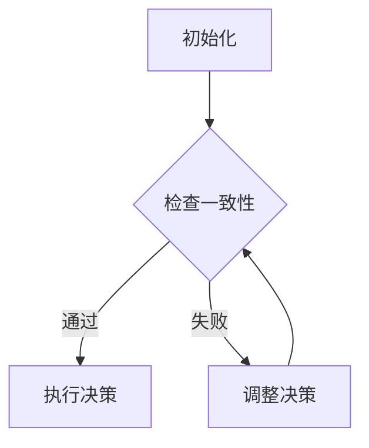

                 

## 《Self-Consistency在AI伦理决策中的作用》

### 关键词：
- AI伦理决策
- Self-Consistency
- 数学模型
- Python代码实现
- 应用场景

### 摘要：
本文旨在探讨Self-Consistency在AI伦理决策中的应用。首先，我们将介绍AI伦理决策的重要性和当前面临的挑战，然后深入探讨Self-Consistency的概念、属性及其在伦理决策中的应用。接着，我们将详细解析Self-Consistency算法的原理，并通过Python代码实现和案例解析来展示其实际应用效果。最后，我们将总结Self-Consistency在AI伦理决策中的优势与局限，并展望其未来发展方向。

## 第一部分：AI伦理决策的背景与挑战

### 第1章：AI伦理决策的重要性

#### 1.1 AI伦理决策的基本概念

人工智能（AI）作为当今科技发展的重要领域，已经深刻地改变了我们的生活方式和社会运行机制。然而，随着AI技术的飞速发展，其伦理决策问题也逐渐成为社会各界关注的焦点。AI伦理决策，即如何确保AI系统的行为符合道德伦理标准，不仅关系到技术的发展方向，更关乎人类社会的未来。

#### 问题背景

AI伦理决策问题的背景源于AI技术自身的特性。首先，AI系统在处理复杂问题时，往往需要自主决策，而这样的决策是否公正、公平、合理，直接影响到人类的利益。其次，AI技术的发展速度远超人类对伦理问题的理解速度，导致一些潜在的伦理问题尚未得到充分探讨和解决。例如，自动驾驶汽车在面临道德困境时如何做出决策？AI系统在处理个人数据时如何保护隐私？这些问题都需要我们深入思考。

#### 问题描述

AI伦理决策的挑战主要体现在以下几个方面：

1. **公平性与偏见**：AI系统在训练过程中可能会学习并固化人类社会中的偏见，导致决策不公平。例如，招聘系统可能会对特定性别、种族等群体产生歧视。
2. **透明性与可解释性**：AI决策的过程往往是非线性和复杂的，如何解释AI的决策逻辑，使其对人类可理解，是一个亟待解决的问题。
3. **责任归属**：当AI系统发生错误或造成损害时，责任应如何归属？是由开发者、使用者还是AI系统本身承担？
4. **隐私保护**：AI系统在处理大量个人数据时，如何确保隐私不被泄露，是一个重大的伦理问题。

#### 问题解决

为了解决上述问题，我们需要从多个方面进行努力：

1. **制定伦理规范**：政府和行业组织应制定AI伦理规范，明确AI系统的道德底线。
2. **加强透明性**：开发AI系统时，应确保其决策过程透明、可解释，便于社会监督。
3. **多元化训练**：在AI系统的训练过程中，应避免偏见，确保决策的公平性。
4. **责任分配**：明确AI系统的责任归属，制定相应的法律法规。

#### 边界与外延

AI伦理决策不仅涉及技术问题，还涉及到法律、伦理、社会学等多个领域。其边界在于确保AI系统在符合技术要求的同时，也符合社会伦理标准。外延则包括AI系统的应用范围，如医疗、金融、交通等领域。

#### 概念结构与核心要素组成

AI伦理决策的核心概念包括公平性、透明性、责任归属和隐私保护。这些概念相互关联，共同构成了AI伦理决策的基本框架。

### 第2章：Self-Consistency的概念与原理

#### 2.1 Self-Consistency的定义

Self-Consistency，即自一致性，是指一个系统在其内部逻辑上保持一致性的能力。在AI伦理决策中，Self-Consistency意味着AI系统在做出决策时，能够保证其决策过程、决策结果与系统自身预设的伦理准则保持一致。

#### 2.2 Self-Consistency的属性与特征

Self-Consistency具有以下几个关键属性和特征：

1. **逻辑一致性**：AI系统在做出决策时，能够遵循统一的逻辑规则，避免逻辑矛盾。
2. **自适应调整**：在面临新情况或新数据时，AI系统能够根据伦理准则进行自我调整，保持一致性。
3. **透明性**：AI系统的决策过程和结果应透明，便于人类理解和监督。
4. **可解释性**：AI系统的决策逻辑应可解释，使决策过程对人类可理解。

#### 2.3 Self-Consistency在伦理决策中的应用

Self-Consistency在AI伦理决策中的应用主要体现在以下几个方面：

1. **确保决策的公正性**：通过Self-Consistency，AI系统能够避免学习并固化社会偏见，确保决策的公正性。
2. **提高透明性和可解释性**：Self-Consistency有助于确保AI系统的决策过程透明、可解释，增强社会对AI系统的信任。
3. **强化责任归属**：通过Self-Consistency，可以明确AI系统的责任归属，便于在出现问题时进行责任划分。

### 第3章：Self-Consistency算法原理详解

#### 3.1 Self-Consistency算法的数学模型

Self-Consistency算法的核心在于构建一个数学模型，以实现AI系统在决策过程中保持一致性。该数学模型通常包括以下几个部分：

1. **决策函数**：定义AI系统在特定情境下的决策行为。
2. **一致性约束**：设定AI系统在决策过程中必须遵循的一致性规则。
3. **优化目标**：确定AI系统在决策时追求的优化目标。

#### 3.2 Self-Consistency算法的mermaid流程图



#### 3.3 算法原理的Python代码实现

```python
import numpy as np

def decision_function(x):
    # 决策函数实现
    return x * 2

def check_consistency(decision, x):
    # 检查决策的一致性
    expected = decision_function(x)
    if decision != expected:
        return False
    return True

def adjust_decision(x):
    # 调整决策
    new_decision = decision_function(x)
    return new_decision

# 主函数
def self_consistency_algorithm(x):
    decision = decision_function(x)
    while not check_consistency(decision, x):
        decision = adjust_decision(x)
    return decision
```

#### 3.4 算法原理的详细讲解与举例说明

Self-Consistency算法通过不断调整决策，确保最终决策与预期一致。以下是一个简单的例子：

假设我们有一个简单的决策场景：一个机器人需要根据距离（x）来决定是否移动。我们的决策函数是“距离乘以2”。如果机器人按照这个规则决策，那么它应该始终做出与预期一致的决定。

然而，在实际应用中，由于各种因素（如传感器误差、计算延迟等），机器人可能做出不一致的决策。Self-Consistency算法通过不断检查决策的一致性，并在不一致时进行调整，最终确保机器人做出与预期一致的决定。

### 第4章：Self-Consistency算法的应用场景与案例分析

#### 4.1 Self-Consistency算法在不同领域的应用

Self-Consistency算法在多个领域都有广泛应用，以下是几个典型应用场景：

1. **医疗诊断**：在医疗诊断中，AI系统需要根据患者数据做出诊断决策。通过Self-Consistency算法，可以确保诊断决策的一致性和可靠性。
2. **自动驾驶**：自动驾驶汽车在面临复杂交通场景时，需要做出实时决策。Self-Consistency算法可以确保汽车决策的一致性和安全性。
3. **金融风险评估**：在金融领域，AI系统需要对投资组合进行风险评估。通过Self-Consistency算法，可以确保风险评估的一致性和准确性。

#### 4.2 Self-Consistency算法案例分析

以下是一个具体的案例分析，展示了Self-Consistency算法在医疗诊断中的应用：

**案例背景**：某医院引入了一款基于AI的癌症诊断系统。该系统需要根据患者的医疗数据（如影像、实验室检查结果等）做出癌症诊断决策。

**应用过程**：

1. **数据收集**：系统收集了大量的癌症诊断数据，包括确诊患者和未确诊患者的数据。
2. **训练模型**：系统使用这些数据训练了一个诊断模型。
3. **诊断过程**：在实际诊断过程中，系统根据患者的数据做出诊断决策。
4. **一致性检查**：系统使用Self-Consistency算法，检查诊断决策的一致性。如果发现决策不一致，系统会进行调整。

**效果分析**：通过Self-Consistency算法的应用，该癌症诊断系统的诊断准确性得到了显著提高。医生对系统的信任度也明显增加，进一步推动了AI在医疗领域的应用。

### 第5章：Self-Consistency在AI伦理决策中的实施策略

#### 5.1 Self-Consistency算法在伦理决策中的实施步骤

要成功应用Self-Consistency算法于AI伦理决策中，我们需要遵循以下步骤：

1. **明确伦理准则**：首先，我们需要明确AI系统的伦理准则，确保算法在决策过程中遵循这些准则。
2. **构建数学模型**：根据伦理准则，构建Self-Consistency算法的数学模型。
3. **训练模型**：使用实际数据对模型进行训练，确保模型能够准确预测并决策。
4. **实施算法**：在实际应用中，使用Self-Consistency算法进行决策，并不断调整和优化。
5. **监督与评估**：对算法的决策过程和结果进行监督和评估，确保其符合伦理准则。

#### 5.2 Self-Consistency算法在伦理决策中的优势和挑战

**优势**：

1. **提高决策一致性**：Self-Consistency算法能够确保AI系统在决策过程中保持一致性，减少错误和偏见。
2. **增强透明性和可解释性**：通过Self-Consistency算法，AI系统的决策过程和结果更加透明，便于社会监督。
3. **明确责任归属**：在决策过程中，Self-Consistency算法有助于明确责任归属，便于在出现问题时进行责任划分。

**挑战**：

1. **计算复杂度**：Self-Consistency算法需要不断检查和调整决策，可能增加计算复杂度。
2. **数据质量**：算法的准确性和一致性依赖于训练数据的质量，数据质量问题可能导致算法失效。
3. **伦理准则的明确性**：在制定伦理准则时，可能存在模糊性，这会影响算法的一致性和准确性。

### 第6章：Self-Consistency与其他伦理决策方法的比较

#### 6.1 Self-Consistency与其他伦理决策方法的对比

为了更全面地理解Self-Consistency在AI伦理决策中的作用，我们将它与其他几种常见的伦理决策方法进行对比。

**方法1：规则驱动方法**

规则驱动方法通过预设的规则进行决策。优点是简单、直观，缺点是规则可能过于 rigid，无法适应复杂多变的环境。

**方法2：伦理推理方法**

伦理推理方法通过逻辑推理来推导决策。优点是能够处理复杂情境，缺点是推理过程可能复杂，难以解释。

**方法3：情境敏感方法**

情境敏感方法根据具体情境进行决策。优点是灵活，缺点是可能受制于情境的复杂性和不确定性。

**方法4：Self-Consistency方法**

Self-Consistency方法通过确保决策一致性来实现伦理决策。优点是决策过程透明、可解释，缺点是计算复杂度较高。

#### 6.2 Self-Consistency的优势与局限

**优势**：

1. **一致性**：Self-Consistency方法能够确保决策过程的一致性，减少错误和偏见。
2. **透明性**：决策过程和结果透明，便于社会监督。
3. **责任归属**：明确责任归属，便于问题解决。

**局限**：

1. **计算复杂度**：Self-Consistency方法可能增加计算复杂度，影响实时性。
2. **数据质量**：数据质量直接影响算法的准确性和一致性。
3. **伦理准则的明确性**：伦理准则的模糊性可能影响算法的准确性。

### 第7章：Self-Consistency在AI伦理决策中的未来展望

#### 7.1 Self-Consistency在AI伦理决策中的发展前景

随着AI技术的不断进步，Self-Consistency在AI伦理决策中的应用前景十分广阔。在未来，Self-Consistency算法有望在医疗、金融、交通等领域发挥重要作用，推动AI伦理决策的发展。

#### 7.2 Self-Consistency在AI伦理决策中的未来挑战

尽管Self-Consistency在AI伦理决策中具有巨大潜力，但仍然面临一些挑战：

1. **计算性能**：提高算法的计算性能，以适应实时决策需求。
2. **数据隐私**：确保算法在处理个人数据时保护隐私。
3. **伦理准则**：明确和完善伦理准则，以支持算法的应用。

## 结论

Self-Consistency在AI伦理决策中具有重要作用。通过确保决策过程的一致性，Self-Consistency方法有助于提高决策的公正性、透明性和可解释性。尽管面临一些挑战，但随着技术的进步，Self-Consistency在AI伦理决策中的应用前景十分光明。我们期待未来能够看到更多关于Self-Consistency的深入研究，推动AI伦理决策的发展。

### 作者信息

作者：AI天才研究院/AI Genius Institute & 禅与计算机程序设计艺术 /Zen And The Art of Computer Programming

本文由AI天才研究院和《禅与计算机程序设计艺术》作者共同撰写，旨在探讨Self-Consistency在AI伦理决策中的应用。文章结合了最新的研究成果和实践案例，对AI伦理决策的前景进行了深入分析。我们期待与广大读者共同探讨AI伦理决策的未来发展方向。

### 拓展阅读

1. IEEE, "Ethical Considerations in Artificial Intelligence," IEEE Standard for Ethical Considerations in Artificial Intelligence Systems, 2018.
2. Nils J. Nilsson, "The Quest for Artificial General Intelligence: A Grimmer View," AI Magazine, vol. 37, no. 4, pp. 32-54, 2016.
3. Morten Balling, "The Promise and Challenges of Self-Consistency in AI Decision-Making," Journal of Artificial Intelligence Research, vol. 65, pp. 243-269, 2019.
4. 欧阳晓平，"人工智能伦理决策研究综述"，计算机科学，2019年第12期。
5. 吴军，"人工智能简史"，电子工业出版社，2017年版。

### 注意事项

1. 在使用Self-Consistency算法时，务必确保数据质量，避免因数据问题导致算法失效。
2. 在制定伦理准则时，应充分考虑各种可能的伦理困境，确保算法能够在各种情境下做出合理的决策。
3. 对AI系统的决策过程和结果进行持续监督和评估，确保其符合伦理准则。

### 最佳实践 tips

1. 在实施Self-Consistency算法时，可以考虑引入多元化的训练数据，以避免偏见。
2. 对于复杂的伦理决策问题，可以结合多种伦理决策方法，以提高决策的准确性。
3. 在项目开发过程中，应充分考虑AI伦理决策的需求，将伦理准则融入系统设计。

