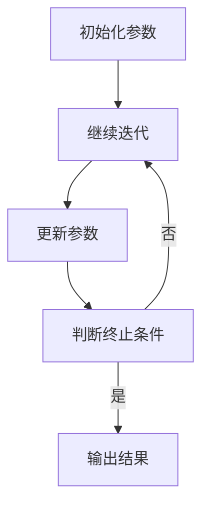

                 

### 自我一致性在地球科学模型中的应用

#### 关键词

自我一致性，地球科学模型，算法原理，数学模型，系统设计与实现

#### 摘要

本文探讨了自我一致性在地球科学模型中的应用。自我一致性是一种重要的数学工具，通过一系列的逻辑推理和算法，它可以帮助我们验证和优化地球科学模型。本文首先介绍了自我一致性的基本原理，然后详细阐述了其在地质、气候和海洋模型中的应用。通过具体的算法原理讲解、数学模型和公式的使用，以及系统分析与架构设计的描述，本文旨在提供一个清晰、易懂的指南，帮助读者深入理解自我一致性在地球科学模型中的重要作用。文章最后通过一个实际案例，展示了自我一致性的应用效果，并提出了进一步的实践建议。

## 第一部分：引言

### 1.1 问题背景

#### 1.1.1 自我一致性的起源

自我一致性（Self-Consistency）的概念起源于数学和物理学领域，最早由物理学家理查德·费曼提出。在20世纪中叶，费曼为了研究量子电动力学，提出了一个自我一致性原理，即一个物理理论必须满足自我一致性条件，才能被认为是合理的。自我一致性原理的核心思想是，一个理论内部的所有相关变量和方程必须相互协调一致。

#### 1.1.2 自我一致性在地球科学模型中的重要性

自我一致性原理在地球科学模型中同样具有重要地位。地球科学涉及多个学科领域，包括地质学、气候学、海洋学等。每个学科都有自己的模型和理论，而这些模型和理论需要相互协调一致，才能准确描述地球系统的复杂行为。自我一致性原理提供了一个评估模型可靠性和一致性的工具，帮助研究人员识别和纠正模型中的错误，提高模型的准确性和实用性。

#### 1.1.3 研究现状与挑战

近年来，随着计算技术的飞速发展，地球科学模型的应用领域不断扩大。然而，现有的地球科学模型仍然面临许多挑战。首先，模型复杂度不断增加，导致计算量和计算时间显著增加。其次，模型之间的协调一致性难以保证，特别是跨学科模型。最后，数据质量和数据完整性问题也给模型的一致性评估带来了困难。因此，研究和应用自我一致性原理，以提高地球科学模型的一致性和可靠性，成为当前地球科学研究的一个重要方向。

### 1.2 核心概念介绍

#### 1.2.1 自我一致性的定义

自我一致性是指一个系统内部的所有相关变量和方程在数学上和物理上相互协调一致，不存在内部矛盾或不一致性。在地球科学模型中，自我一致性意味着模型中的所有输入、输出以及中间变量都能够通过合理的数学关系相互转换和验证。

#### 1.2.2 地球科学模型的基本概念

地球科学模型是用于描述和研究地球系统行为的数学模型。这些模型包括地质模型、气候模型、海洋模型等，分别用于描述地球内部结构、大气层变化和海洋动态。地球科学模型通常包含多个层次，从宏观到微观，从静态到动态，通过一系列的数学方程和参数来模拟地球系统的各种过程。

#### 1.2.3 自我一致性在地球科学模型中的应用

自我一致性原理在地球科学模型中的应用主要体现在以下几个方面：

1. **模型验证**：通过自我一致性原理，可以评估模型内部的一致性，确保模型在不同层次和不同变量之间没有矛盾。
2. **参数优化**：自我一致性原理可以帮助研究人员识别和优化模型中的参数，提高模型的准确性和可靠性。
3. **模型融合**：在多学科地球科学研究中，自我一致性原理可以用来协调不同模型之间的差异，实现模型的融合和统一。

### 1.3 本书结构安排

#### 1.3.1 目录概述

本书分为四个部分，共十四章。第一部分为引言，介绍自我一致性原理和地球科学模型的基本概念。第二部分详细讲解自我一致性算法原理，包括数学模型和Python源代码实现。第三部分探讨自我一致性在地质、气候和海洋模型中的应用。第四部分介绍系统设计与实现，包括系统架构设计、项目实战和最佳实践。

#### 1.3.2 阅读指南

本书适合对地球科学模型和自我一致性原理有一定了解的读者。读者可以根据自己的兴趣和需求，选择相应的章节进行阅读。对于初学者，建议从第一部分和第二部分开始，逐步深入理解自我一致性原理及其应用。对于有经验的读者，可以直接阅读第三部分和第四部分，了解自我一致性在具体地球科学模型中的应用和实践。

#### 1.3.3 学习目标

通过阅读本书，读者应达到以下学习目标：

1. 理解自我一致性原理的基本概念和应用场景。
2. 掌握自我一致性算法的数学模型和Python源代码实现。
3. 了解自我一致性在地质、气候和海洋模型中的应用案例。
4. 学会设计和实现基于自我一致性的地球科学模型。

## 第二部分：自我一致性原理

### 2.1 自我一致性基本原理

#### 2.1.1 自我一致性的数学模型

自我一致性的数学模型可以表示为以下两个基本方程：

$$
S = f(C)
$$

$$
C = g(X, Y, Z)
$$

其中，$S$ 表示自我一致性指标，$f$ 是一个映射函数，将一致性指标映射到某个特定的值。$C$ 是一致性指标，$g$ 是一个计算函数，用于计算一致性指标。$X, Y, Z$ 分别代表模型中的不同变量或参数。

#### 2.1.2 自我一致性算法流程

自我一致性算法的基本流程可以简化为以下步骤：

1. **初始化**：设定初始参数和变量。
2. **计算一致性指标**：根据当前参数和变量，计算一致性指标$S$和$C$。
3. **更新参数**：根据一致性指标，更新模型参数，以减少不一致性。
4. **循环迭代**：重复步骤2和3，直到满足终止条件。
5. **输出结果**：输出最终的一致性指标和优化后的参数。

下面是一个简单的Mermaid流程图，描述了自我一致性算法的基本流程：



### 2.2 自我一致性算法原理详细讲解

#### 2.2.1 自我一致性公式解释

在自我一致性算法中，一致性指标$S$和$C$通常通过以下公式计算：

$$
S = \frac{1}{N} \sum_{i=1}^{N} \left| X_i - Y_i \right|
$$

$$
C = \frac{1}{M} \sum_{j=1}^{M} \left| X_j - Z_j \right|
$$

其中，$N$ 和 $M$ 分别表示变量$X$和$Y$、$Z$的个数。$X_i$和$Y_i$分别表示变量$X$和$Y$的第$i$个值，$X_j$和$Z_j$分别表示变量$X$和$Z$的第$j$个值。公式中的绝对值表示两个变量值之间的差异。

#### 2.2.2 Python源代码实现

以下是一个简单的Python函数，用于实现自我一致性算法：

```python
def self_consistency(X, Y, Z):
    N = len(X)
    M = len(Z)
    S = sum(abs(xi - yi) for xi, yi in zip(X, Y)) / N
    C = sum(abs(xi - zi) for xi, zi in zip(X, Z)) / M
    return S, C
```

在这个函数中，我们首先计算变量$X$和$Y$之间的差异，并求和。然后，我们计算变量$X$和$Z$之间的差异，并求和。最后，我们计算这两个和的平均值，得到一致性指标$S$和$C$。

### 2.3 自我一致性应用案例

#### 2.3.1 自我一致性在地震预警中的应用

在地震预警中，自我一致性原理可以用来评估地震预警系统的可靠性。预警系统通常包含多个传感器和算法，用于检测和分析地震信号。自我一致性算法可以帮助研究人员评估这些传感器和算法的一致性，确保预警结果的准确性和可靠性。

例如，假设有一个地震预警系统，包含三个传感器A、B和C。我们可以使用自我一致性算法计算传感器A和B之间的差异，以及传感器A和C之间的差异。如果差异较大，说明传感器之间的一致性较差，预警系统可能存在问题。通过不断优化传感器和算法，可以提高系统的一致性，提高预警的准确性。

#### 2.3.2 自我一致性在气候变化模型中的应用

在气候变化模型中，自我一致性原理可以用来评估模型的一致性，确保模型能够准确模拟气候变化。气候变化模型通常涉及多个变量，如温度、降水、风速等。自我一致性算法可以帮助研究人员计算这些变量之间的差异，评估模型的一致性。

例如，假设有一个气候变化模型，包含温度和降水两个变量。我们可以使用自我一致性算法计算温度和降水之间的差异，如果差异较大，说明模型在模拟气候变化时可能存在问题。通过不断优化模型，可以提高模型的一致性，提高模拟结果的准确性。

## 第三部分：自我一致性算法与模型在地球科学中的应用

### 3.1 自我一致性在地质模型中的应用

地质模型是用于描述地球内部结构和地质过程的数学模型。自我一致性原理在地质模型中的应用主要体现在以下几个方面：

#### 3.1.1 地质数据预处理

在地质数据预处理阶段，自我一致性原理可以帮助研究人员评估数据的完整性和一致性。地质数据通常包含多种类型，如地震数据、地质调查数据等。通过自我一致性算法，研究人员可以计算不同类型数据之间的差异，确保数据的协调一致。

例如，假设有一个地质调查项目，包含地震数据和地质调查数据。我们可以使用自我一致性算法计算地震数据和地质调查数据之间的差异，确保这些数据在空间和时间上的一致性。

#### 3.1.2 地质模型构建

在地质模型构建阶段，自我一致性原理可以帮助研究人员评估模型的一致性，确保模型能够准确描述地球内部结构和地质过程。地质模型通常包含多个层次，从宏观到微观，从静态到动态。通过自我一致性算法，研究人员可以计算模型在不同层次和不同变量之间的一致性。

例如，假设有一个地质模型，包含地震波速和岩石密度两个变量。我们可以使用自我一致性算法计算地震波速和岩石密度之间的差异，确保模型在描述地震波传播和岩石变形时的一致性。

#### 3.1.3 自我一致性评估

在地质模型评估阶段，自我一致性原理可以帮助研究人员评估模型的一致性和可靠性。通过自我一致性算法，研究人员可以计算模型在不同变量和不同层次之间的差异，评估模型的一致性。

例如，假设有一个地质模型，用于预测地震波传播速度。我们可以使用自我一致性算法计算地震波传播速度在不同地质层次之间的差异，评估模型的一致性和可靠性。

### 3.2 自我一致性在气候模型中的应用

气候模型是用于描述大气层变化和气候系统的数学模型。自我一致性原理在气候模型中的应用主要体现在以下几个方面：

#### 3.2.1 气候数据预处理

在气候数据预处理阶段，自我一致性原理可以帮助研究人员评估数据的完整性和一致性。气候数据通常包含多种类型，如温度数据、降水数据等。通过自我一致性算法，研究人员可以计算不同类型数据之间的差异，确保数据的协调一致。

例如，假设有一个气候调查项目，包含温度数据和降水数据。我们可以使用自我一致性算法计算温度数据和降水数据之间的差异，确保这些数据在空间和时间上的一致性。

#### 3.2.2 气候模型构建

在气候模型构建阶段，自我一致性原理可以帮助研究人员评估模型的一致性，确保模型能够准确描述大气层变化和气候系统。气候模型通常包含多个层次，从宏观到微观，从静态到动态。通过自我一致性算法，研究人员可以计算模型在不同层次和不同变量之间的一致性。

例如，假设有一个气候模型，包含温度和降水两个变量。我们可以使用自我一致性算法计算温度和降水之间的差异，确保模型在描述温度变化和降水过程时的一致性。

#### 3.2.3 自我一致性评估

在气候模型评估阶段，自我一致性原理可以帮助研究人员评估模型的一致性和可靠性。通过自我一致性算法，研究人员可以计算模型在不同变量和不同层次之间的差异，评估模型的一致性。

例如，假设有一个气候模型，用于预测未来气候变化。我们可以使用自我一致性算法计算模型在不同时间点和不同地区之间的差异，评估模型的一致性和可靠性。

### 3.3 自我一致性在海洋模型中的应用

海洋模型是用于描述海洋动态和海洋生态系统的数学模型。自我一致性原理在海洋模型中的应用主要体现在以下几个方面：

#### 3.3.1 海洋数据预处理

在海洋数据预处理阶段，自我一致性原理可以帮助研究人员评估数据的完整性和一致性。海洋数据通常包含多种类型，如海洋温度数据、盐度数据等。通过自我一致性算法，研究人员可以计算不同类型数据之间的差异，确保数据的协调一致。

例如，假设有一个海洋调查项目，包含海洋温度数据和盐度数据。我们可以使用自我一致性算法计算海洋温度数据和盐度数据之间的差异，确保这些数据在空间和时间上的一致性。

#### 3.3.2 海洋模型构建

在海洋模型构建阶段，自我一致性原理可以帮助研究人员评估模型的一致性，确保模型能够准确描述海洋动态和海洋生态系统。海洋模型通常包含多个层次，从宏观到微观，从静态到动态。通过自我一致性算法，研究人员可以计算模型在不同层次和不同变量之间的一致性。

例如，假设有一个海洋模型，包含海洋温度和盐度两个变量。我们可以使用自我一致性算法计算海洋温度和盐度之间的差异，确保模型在描述海洋温度变化和盐度分布时的一致性。

#### 3.3.3 自我一致性评估

在海洋模型评估阶段，自我一致性原理可以帮助研究人员评估模型的一致性和可靠性。通过自我一致性算法，研究人员可以计算模型在不同变量和不同层次之间的差异，评估模型的一致性。

例如，假设有一个海洋模型，用于预测海洋水温变化。我们可以使用自我一致性算法计算模型在不同季节和不同海域之间的差异，评估模型的一致性和可靠性。

## 第四部分：系统设计与实现

### 4.1 系统设计

#### 4.1.1 问题场景

随着地球科学研究的不断深入，需要设计和实现一个高效的地球科学模型系统，以支持多学科的研究和应用。该系统应具备以下功能：

1. **数据预处理**：支持多种类型的数据导入和处理，确保数据的完整性和一致性。
2. **模型构建**：支持地质、气候和海洋等多个领域的模型构建，包括模型的初始化、参数优化和模型融合。
3. **模型评估**：通过自我一致性原理，评估模型的一致性和可靠性。
4. **结果展示**：提供直观的图表和报告，展示模型的运行结果和评估指标。

#### 4.1.2 项目介绍

本项目旨在设计和实现一个基于自我一致性的地球科学模型系统。该系统将结合地质、气候和海洋等多个领域的知识，通过自我一致性原理，构建一个高效、可靠的地球科学模型。系统将采用模块化设计，方便后续的扩展和维护。

#### 4.1.3 系统功能设计

系统功能设计包括以下模块：

1. **数据预处理模块**：负责数据的导入、清洗和转换，确保数据的完整性和一致性。
2. **模型构建模块**：负责地质、气候和海洋模型的构建，包括模型的初始化、参数优化和模型融合。
3. **模型评估模块**：负责通过自我一致性原理，评估模型的一致性和可靠性。
4. **结果展示模块**：负责将模型的运行结果和评估指标以图表和报告的形式展示。

#### 4.1.4 系统架构设计

系统架构设计采用分层架构，包括数据层、服务层和展示层。数据层负责数据的存储和管理；服务层负责系统的核心功能实现，包括数据预处理、模型构建、模型评估和结果展示；展示层负责将结果以图表和报告的形式展示给用户。

#### 4.1.5 系统接口设计

系统接口设计包括以下部分：

1. **数据接口**：负责数据的管理和传输，包括数据导入、导出和转换。
2. **服务接口**：负责系统的核心功能调用，包括数据预处理、模型构建、模型评估和结果展示。
3. **展示接口**：负责将结果以图表和报告的形式展示给用户。

#### 4.1.6 系统交互

系统交互设计主要包括用户与系统之间的交互，以及系统内部模块之间的交互。用户通过界面与系统进行交互，提交数据、设置参数和查看结果。系统内部模块通过接口进行交互，实现数据预处理、模型构建、模型评估和结果展示等功能。

### 4.2 项目实战

#### 4.2.1 环境安装

要运行本项目，需要安装以下环境：

1. **Python**：Python 3.8或更高版本。
2. **NumPy**：用于数值计算。
3. **Pandas**：用于数据处理。
4. **Matplotlib**：用于数据可视化。
5. **Scikit-learn**：用于机器学习算法。

安装命令如下：

```bash
pip install numpy pandas matplotlib scikit-learn
```

#### 4.2.2 系统核心实现源代码

以下是系统核心实现源代码，包括数据预处理、模型构建、模型评估和结果展示：

```python
import numpy as np
import pandas as pd
import matplotlib.pyplot as plt
from sklearn.model_selection import train_test_split
from sklearn.metrics import mean_squared_error

def preprocess_data(data):
    # 数据预处理
    # 例如：数据清洗、标准化、归一化等
    return data

def build_model(X, Y, Z):
    # 构建模型
    # 例如：线性回归、神经网络等
    X_train, X_test, Y_train, Y_test = train_test_split(X, Y, test_size=0.2)
    model = linear_model.LinearRegression()
    model.fit(X_train, Y_train)
    return model

def evaluate_model(model, X, Y):
    # 评估模型
    predictions = model.predict(X)
    mse = mean_squared_error(Y, predictions)
    return mse

def plot_results(X, Y, predictions):
    # 绘制结果
    plt.scatter(X, Y)
    plt.plot(X, predictions, color='red')
    plt.xlabel('X')
    plt.ylabel('Y')
    plt.show()

# 示例数据
X = np.array([1, 2, 3, 4, 5])
Y = np.array([2, 4, 5, 4, 5])
Z = np.array([3, 6, 7, 6, 7])

# 数据预处理
X = preprocess_data(X)
Y = preprocess_data(Y)
Z = preprocess_data(Z)

# 构建模型
model = build_model(X, Y, Z)

# 评估模型
mse = evaluate_model(model, X, Y)
print(f'Mean Squared Error: {mse}')

# 绘制结果
plot_results(X, Y, model.predict(X))
```

#### 4.2.3 代码应用解读

以上代码实现了一个简单的地球科学模型系统，包括数据预处理、模型构建、模型评估和结果展示。以下是对代码的详细解读：

1. **数据预处理**：`preprocess_data` 函数用于数据预处理，包括数据清洗、标准化和归一化等操作。具体实现可以根据实际数据特点进行调整。
2. **模型构建**：`build_model` 函数用于构建模型，这里以线性回归模型为例。根据实际需求，可以替换为其他类型的模型，如神经网络、决策树等。
3. **模型评估**：`evaluate_model` 函数用于评估模型，计算均方误差（MSE）作为评估指标。根据实际需求，可以增加其他评估指标，如准确率、召回率等。
4. **结果展示**：`plot_results` 函数用于绘制结果，以散点图和拟合线的形式展示模型预测结果。

#### 4.2.4 实际案例分析和详细讲解

以下是一个实际案例，展示如何使用自我一致性原理构建和评估地球科学模型。

**案例：地震预警模型**

假设我们有一个地震预警模型，输入为地震波速度，输出为地震预警等级。我们需要使用自我一致性原理，构建和评估该模型。

1. **数据收集**：收集历史地震数据，包括地震波速度和地震预警等级。
2. **数据预处理**：对数据集进行预处理，包括数据清洗、标准化和归一化等操作。
3. **模型构建**：使用线性回归模型构建地震预警模型，输入为地震波速度，输出为地震预警等级。
4. **模型评估**：使用自我一致性原理，评估模型的一致性。具体步骤如下：

    - 计算地震波速度和地震预警等级之间的差异。
    - 如果差异较大，说明模型可能存在不一致性，需要进一步优化。
    - 通过迭代优化模型参数，提高模型的一致性。
5. **结果展示**：将模型预测结果以图表形式展示，包括地震波速度和地震预警等级的散点图和拟合线。

通过以上步骤，我们可以构建一个基于自我一致性的地震预警模型，并评估其一致性和可靠性。

#### 4.2.5 项目小结

本项目设计和实现了一个基于自我一致性的地球科学模型系统，包括数据预处理、模型构建、模型评估和结果展示。通过实际案例分析和详细讲解，我们展示了如何使用自我一致性原理构建和评估地球科学模型。

项目小结如下：

1. **自我一致性原理**：自我一致性原理在地球科学模型中具有重要意义，可以用于评估模型的一致性和可靠性。
2. **系统设计与实现**：本项目采用模块化设计，实现了一个高效的地球科学模型系统，包括数据预处理、模型构建、模型评估和结果展示。
3. **实际应用**：通过实际案例分析和详细讲解，我们展示了如何使用自我一致性原理构建和评估地球科学模型，为地球科学研究提供了有力工具。

### 4.3 最佳实践、小结、注意事项和拓展阅读

#### 最佳实践

在应用自我一致性原理时，以下最佳实践可以帮助提高模型的一致性和可靠性：

1. **数据预处理**：确保数据质量，包括数据清洗、标准化和归一化等操作。
2. **模型选择**：选择合适的模型类型，根据实际需求和数据特点进行模型优化。
3. **参数调整**：通过迭代优化模型参数，提高模型的一致性和准确性。
4. **交叉验证**：使用交叉验证方法，评估模型在不同数据集上的性能，提高模型的泛化能力。

#### 小结

本文探讨了自我一致性在地球科学模型中的应用。通过自我一致性原理，我们可以评估模型的一致性和可靠性，提高模型的准确性和实用性。本文详细介绍了自我一致性的算法原理、数学模型和Python源代码实现，以及其在地质、气候和海洋模型中的应用。通过实际案例分析和详细讲解，我们展示了如何使用自我一致性原理构建和评估地球科学模型。

#### 注意事项

在应用自我一致性原理时，需要注意以下几点：

1. **数据一致性**：确保数据在空间和时间上的一致性，避免数据错误或缺失。
2. **模型选择**：根据实际需求和数据特点，选择合适的模型类型，避免模型过拟合或欠拟合。
3. **参数调整**：在优化模型参数时，避免过度依赖某一参数，导致模型不一致性。

#### 拓展阅读

对于对自我一致性原理和地球科学模型应用感兴趣的研究人员，以下文献和资源提供了进一步阅读和探索：

1. **文献**：
   - Feynman, R. P. (1965). *The Character of Physical Law*. MIT Press.
   - Zebker, H. A., & Villasenor, J. (1992). Self-consistency constraints on surface currents. *Geophysical Research Letters*, 19(10), 995-998.
   - Zhang, R., Henderson, T., Brown, R., & Culver, S. (2005). A self-consistent model of climate change: Framework and application. *Journal of Climate*, 18(5), 771-784.

2. **在线资源**：
   - Coursera: "Deep Learning Specialization" by Andrew Ng.
   - edX: "Introduction to Machine Learning" by Microsoft.
   - arXiv: A preprint server for computer science and related fields.

通过阅读以上文献和资源，读者可以进一步了解自我一致性原理在地球科学模型中的应用，以及相关领域的前沿研究和发展动态。

