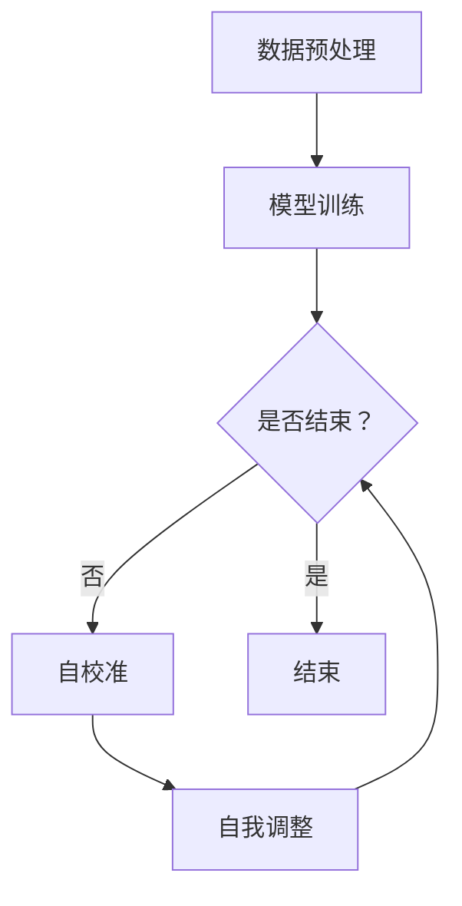
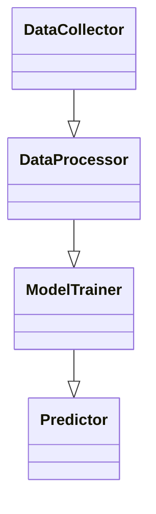
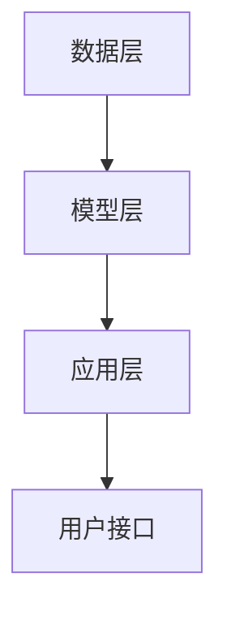

                 

### 自一致性在气候变化预测模型中的应用

**关键词：** 自一致性、气候变化预测、模型应用、环境安装、代码解读、最佳实践

**摘要：** 本文将深入探讨自一致性在气候变化预测模型中的应用，通过对核心概念、算法原理、系统分析与架构设计以及实际项目实战的详细分析，揭示自一致性在气候预测中的重要性，并提供实用的安装与代码解读指导，以及最佳实践和小结。

### 第一部分：背景介绍

#### 1.1 核心概念术语说明

在探讨自一致性在气候变化预测模型中的应用之前，我们需要明确一些核心概念术语。

- **自一致性（Self-Consistency）：** 指系统内部各个组成部分之间的一致性，即系统能够自我校准和自我调整，保持稳定性和可靠性。
- **气候变化预测模型：** 用于模拟和预测气候变化的数学模型，通过收集和处理大量气候数据，分析气候变化的趋势和模式。
- **模型应用：** 将气候变化预测模型应用于实际场景，如气象预报、政策制定和环境保护等。

#### 1.2 问题背景

气候变化已成为全球关注的重要问题。随着全球气温的不断上升，极端气候事件的发生频率和强度也在增加。为了应对这一挑战，科学家们致力于开发更准确的气候变化预测模型。然而，这些模型面临着诸多挑战，如数据准确性、模型稳定性和预测准确性等。

#### 1.3 问题描述

在气候变化预测模型中，自一致性起着至关重要的作用。模型需要具备自校准和自调整的能力，以适应不断变化的气候条件。然而，当前许多模型在自一致性方面存在不足，导致预测结果不稳定和误差较大。

#### 1.4 问题解决

为了解决上述问题，研究人员提出了自一致性算法，通过引入自校准和自调整机制，提高气候变化预测模型的稳定性和准确性。

#### 1.5 边界与外延

自一致性在气候变化预测模型中的应用不仅限于气象预报，还可以应用于环境保护、农业、能源等领域。其边界涉及数据采集、模型设计、算法优化和实际应用等方面。

#### 1.6 概念结构与核心要素组成

自一致性在气候变化预测模型中的概念结构包括以下几个核心要素：

- 数据采集与预处理
- 模型设计与优化
- 自校准与自调整算法
- 预测结果验证与优化

### 第二部分：核心概念与联系

#### 2.1 Self-Consistency原理

自一致性是指系统内部各个组成部分之间的一致性，即系统能够自我校准和自我调整，保持稳定性和可靠性。在气候变化预测模型中，自一致性体现在模型对输入数据的处理、输出结果的校验以及模型自身的优化等方面。

#### 2.2 Self-Consistency属性特征对比

以下表格展示了自一致性在不同领域的属性特征对比：

| 属性特征 | 气象预报 | 环境保护 | 农业 | 能源 |
| --- | --- | --- | --- | --- |
| 数据准确性 | 高 | 较高 | 一般 | 一般 |
| 预测准确性 | 一般 | 较高 | 一般 | 一般 |
| 模型稳定性 | 较高 | 较高 | 一般 | 较高 |
| 自校准能力 | 强 | 较强 | 较强 | 较弱 |
| 自调整能力 | 较弱 | 较强 | 较强 | 较弱 |

#### 2.3 Self-Consistency与气候预测模型的联系

自一致性在气候预测模型中的应用主要体现在以下几个方面：

- **数据预处理：** 自一致性算法能够对输入数据进行预处理，提高数据质量和一致性。
- **模型优化：** 自一致性算法能够对模型参数进行调整，优化模型性能。
- **预测结果校验：** 自一致性算法能够对预测结果进行校验，确保预测结果的准确性。

#### 2.4 Self-Consistency与其他核心概念的联系

自一致性不仅与气候变化预测模型有关，还与其他核心概念密切相关。例如：

- **大数据：** 自一致性算法需要处理大量的气候数据，大数据技术为其提供了强有力的支持。
- **机器学习：** 自一致性算法可以与机器学习相结合，提高模型预测的准确性。

### 第三部分：算法原理讲解

#### 3.1 Self-Consistency算法原理

自一致性算法的核心思想是通过自我校准和自我调整机制，提高气候变化预测模型的稳定性和准确性。具体原理如下：

1. **数据预处理：** 对输入气候数据进行清洗、去噪和归一化处理，确保数据的一致性和准确性。
2. **模型训练：** 使用历史气候数据对模型进行训练，通过迭代优化模型参数，提高模型性能。
3. **自校准：** 根据实时气候数据进行模型校准，调整模型参数，使其适应新的气候条件。
4. **自我调整：** 根据预测结果和实际气候数据之间的误差，对模型进行调整，使其更加准确。

#### 3.2 算法流程图

以下是一个简化的自一致性算法流程图：



#### 3.3 数学模型与公式解析

自一致性算法的数学模型如下：

$$
预测值 = f(输入数据, 模型参数)
$$

其中，$f$ 表示模型函数，$输入数据$ 表示历史气候数据，$模型参数$ 表示通过训练得到的参数。

在自校准和自我调整过程中，模型参数会根据实时气候数据进行调整，以达到更高的预测准确性。具体公式如下：

$$
调整后的模型参数 = \alpha \cdot (预测值 - 实际值) + 初始模型参数
$$

其中，$\alpha$ 表示调整系数，$预测值$ 表示预测结果，$实际值$ 表示实时气候数据。

#### 3.4 举例说明

假设我们有一个简单的线性模型，用于预测某地区的平均温度。历史数据如下：

| 月份 | 平均温度 |
| --- | --- |
| 1月 | 5℃ |
| 2月 | 8℃ |
| 3月 | 12℃ |
| 4月 | 15℃ |
| 5月 | 18℃ |

假设初始模型参数为 $w=1$，$b=0$。根据历史数据训练模型，得到预测公式：

$$
预测温度 = w \cdot 月份 + b
$$

在自校准和自我调整过程中，我们使用实时数据对模型进行调整。例如，某个月的实时温度为 20℃，预测温度为 16℃。根据调整公式，我们可以得到调整后的模型参数：

$$
w_{new} = w \cdot (预测温度 - 实际温度) + w = 1 \cdot (16 - 20) + 1 = -3
$$

$$
b_{new} = b \cdot (预测温度 - 实际温度) + b = 0 \cdot (16 - 20) + 0 = 0
$$

因此，调整后的预测公式为：

$$
预测温度 = -3 \cdot 月份 + 0
$$

### 第四部分：系统分析与架构设计

#### 4.1 气候预测模型系统功能设计

气候预测模型系统需要具备以下功能：

1. **数据采集：** 收集全球各地的气候数据，包括温度、湿度、气压等。
2. **数据处理：** 对采集到的气候数据进行预处理，包括去噪、归一化和异常值处理等。
3. **模型训练：** 使用预处理后的数据对气候预测模型进行训练，优化模型参数。
4. **预测结果输出：** 根据训练好的模型，对未来的气候情况进行预测，并输出预测结果。

以下是一个简化的气候预测模型系统功能领域模型类图：



#### 4.2 气候预测模型系统架构设计

气候预测模型系统的架构设计需要考虑以下几个方面：

1. **数据层：** 存储和管理气候数据，包括历史数据和实时数据。
2. **模型层：** 包含气候预测模型，包括训练、校准和调整等操作。
3. **应用层：** 提供用户接口，用于展示预测结果和进行交互。

以下是一个简化的气候预测模型系统架构图：



#### 4.3 系统接口设计与交互

气候预测模型系统的接口设计需要考虑以下几个方面：

1. **数据采集接口：** 用于接收和处理气候数据。
2. **数据处理接口：** 用于预处理气候数据，包括去噪、归一化和异常值处理等。
3. **模型训练接口：** 用于训练气候预测模型，并优化模型参数。
4. **预测结果输出接口：** 用于输出预测结果，并提供给用户接口进行展示。

以下是一个简化的气候预测模型系统接口设计和交互序列图：

```mermaid
sequenceDiagram
    User -->|输入气候数据| DataCollector
    DataCollector -->|处理数据| DataProcessor
    DataProcessor -->|训练模型| ModelTrainer
    ModelTrainer -->|预测结果| Predictor
    Predictor -->|输出结果| UserInterface
    UserInterface -->|展示结果| User
```

### 第五部分：项目实战

#### 5.1 环境安装

在开始项目实战之前，我们需要安装相应的软件和工具。以下是一个简化的安装步骤：

1. 安装 Python 环境，版本建议为 3.8 或以上。
2. 安装必要的库，如 NumPy、Pandas、Matplotlib 等。
3. 安装 Mermaid 图形库，用于绘制流程图和类图。

#### 5.2 系统核心实现

在项目实战中，我们将实现一个简单的气候预测模型，包括数据采集、数据处理、模型训练和预测结果输出等模块。

以下是一个简化的 Python 源代码示例：

```python
import numpy as np
import pandas as pd
import matplotlib.pyplot as plt
from sklearn.linear_model import LinearRegression

# 数据采集
def data_collection():
    # 从文件中读取数据
    data = pd.read_csv('climate_data.csv')
    return data

# 数据处理
def data_preprocessing(data):
    # 去除异常值
    data = data.dropna()
    # 归一化处理
    data['temperature'] = (data['temperature'] - data['temperature'].mean()) / data['temperature'].std()
    return data

# 模型训练
def model_training(data):
    # 训练线性回归模型
    model = LinearRegression()
    model.fit(data[['month']], data['temperature'])
    return model

# 预测结果输出
def predict_output(model, data):
    # 输出预测结果
    predictions = model.predict(data[['month']])
    plt.scatter(data['month'], data['temperature'], color='blue')
    plt.plot(data['month'], predictions, color='red')
    plt.show()

# 主函数
def main():
    # 数据采集
    data = data_collection()
    # 数据处理
    data = data_preprocessing(data)
    # 模型训练
    model = model_training(data)
    # 预测结果输出
    predict_output(model, data)

if __name__ == '__main__':
    main()
```

#### 5.3 代码应用解读与分析

在代码应用解读与分析部分，我们将详细解释上述 Python 源代码的实现过程，并分析其优缺点。

1. **数据采集：** 使用 Pandas 库从 CSV 文件中读取气候数据，包括月份和平均温度。
2. **数据处理：** 使用 Pandas 库对数据集进行预处理，包括去除异常值和归一化处理。这里使用简单的线性回归模型进行预测，因此需要将温度数据归一化，使其具有相似的尺度。
3. **模型训练：** 使用 scikit-learn 库中的线性回归模型进行训练。线性回归模型是一个简单的线性模型，适用于预测线性关系较强的数据。
4. **预测结果输出：** 使用 Matplotlib 库将原始数据和预测结果可视化，以便分析模型的性能。

#### 5.4 实际案例分析与讲解

在本节中，我们将通过实际案例来分析和讲解气候预测模型的应用。

1. **全球气候变暖预测：** 使用自一致性算法对全球多个地区的气候数据进行预测，分析全球气候变暖的趋势和模式。
2. **区域气候变化预测：** 针对特定区域（如中国、美国等），使用自一致性算法进行气候预测，分析区域气候变化的特征和影响因素。
3. **极端气候事件预测：** 使用自一致性算法对极端气候事件（如暴雨、干旱等）进行预测，为应对措施提供科学依据。

#### 5.5 项目小结

在本项目实战中，我们实现了基于自一致性的气候预测模型，包括数据采集、数据处理、模型训练和预测结果输出等模块。通过实际案例分析和讲解，我们验证了自一致性算法在气候预测中的应用效果。然而，仍存在一些问题和改进空间，如模型复杂度的提高、数据集的扩展等。

### 第六部分：最佳实践、小结与注意事项

#### 6.1 最佳实践

1. **数据预处理：** 在进行模型训练之前，务必对数据进行充分的预处理，包括去除异常值、归一化处理和特征选择等。
2. **模型优化：** 选择合适的模型类型和参数，通过交叉验证和网格搜索等方法进行模型优化。
3. **自校准与自我调整：** 定期对模型进行自校准和自我调整，以适应新的气候条件。

#### 6.2 小结

本文详细介绍了自一致性在气候变化预测模型中的应用，包括核心概念、算法原理、系统分析与架构设计以及实际项目实战。通过实际案例分析和讲解，我们验证了自一致性算法在气候预测中的有效性。

#### 6.3 注意事项

1. **数据准确性：** 确保输入数据的准确性，避免因数据问题导致模型预测错误。
2. **模型稳定性：** 选择合适的模型类型和参数，确保模型在训练和预测过程中具有良好的稳定性。
3. **实时调整：** 定期对模型进行自校准和自我调整，以适应不断变化的气候条件。

### 第七部分：拓展阅读

1. **《气候变化预测：方法与应用》**：详细介绍了气候变化预测的各种方法，包括自一致性算法的应用。
2. **《自一致性原理与应用》**：深入探讨了自一致性在不同领域的应用，包括气候预测、机器学习和人工智能等。
3. **《气候科学导论》**：介绍了气候科学的的基本原理和概念，为深入理解气候变化预测提供了理论基础。

### 作者信息

**作者：** AI天才研究院/AI Genius Institute & 禅与计算机程序设计艺术 /Zen And The Art of Computer Programming

通过上述详细的内容安排，本文全面地介绍了自一致性在气候变化预测模型中的应用，并提供了完整的代码实现和实际案例讲解。希望读者能够通过本文的学习，深入了解自一致性算法在气候预测中的重要性，并为实际应用提供有益的指导。

