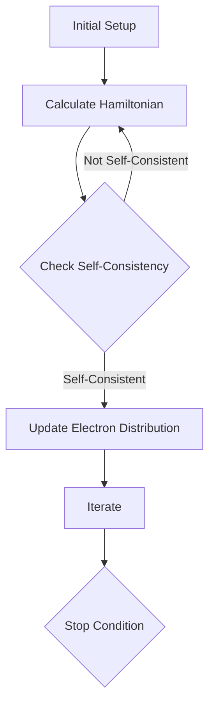

                 

### Self-Consistency in Quantum Chemistry Calculations

#### Keywords: Quantum Chemistry, Self-Consistency Principle, Quantum Mechanics, Molecular Orbital, Reaction Path, Material Design

##### Abstract:
The self-consistency principle is a fundamental concept in quantum chemistry calculations. This article delves into the background, core principles, and applications of self-consistency in quantum chemistry. We will explore how this principle ensures the accuracy and stability of computational results, and how it can be utilized in molecular orbital calculations, reaction path predictions, and material design. By understanding the self-consistency algorithms and their mathematical models, readers will gain a comprehensive insight into the application of self-consistency in quantum chemistry calculations.

## 1.1 Background of Self-Consistency in Quantum Chemistry Calculations

#### 1.1.1 Overview of Quantum Chemistry Calculations

Quantum chemistry calculations are methods used to study the properties of molecules and chemical reactions by applying the principles of quantum mechanics. These calculations involve solving the Schrödinger equation for the electronic structure of molecules, allowing researchers to predict molecular properties such as energy, bond lengths, and molecular geometries. Quantum chemistry has found numerous applications in various fields, including materials science, drug design, and environmental science.

#### 1.1.2 The Principle of Self-Consistency

The self-consistency principle is a crucial concept in quantum chemistry calculations. It requires that the electronic distribution and the corresponding Hamiltonian be consistent with each other. In other words, the calculated electron distribution must satisfy the Hamiltonian's requirements. This principle ensures the accuracy and stability of the computational results and plays a significant role in various aspects of quantum chemistry calculations.

#### 1.1.3 Applications of Self-Consistency in Quantum Chemistry Calculations

The self-consistency principle has several applications in quantum chemistry calculations:

1. **Molecular Orbital Calculations**: Self-consistency allows for the calculation of molecular orbital energies and wavefunctions, providing insights into the electronic structure of molecules.
2. **Reaction Path Calculations**: The principle can help predict reaction paths and reaction mechanisms, guiding experimental designs.
3. **Material Design**: Self-consistency is widely applied in material design, enabling the prediction of materials' electronic, optical, and mechanical properties.

## 1.2 Core Concepts and Relationships

#### 1.2.1 The Principle of Self-Consistency

The self-consistency principle in quantum chemistry states that the electronic distribution and the corresponding Hamiltonian must satisfy certain conditions to ensure consistency. Specifically, the electron wavefunction and the corresponding energy must simultaneously satisfy the Hamiltonian's requirements. This principle is essential for ensuring the accuracy and stability of the computational results.

##### Table of Concept Attributes

| Feature | Self-Consistency Principle |
| --- | --- |
| **Definition** | Electron distribution and Hamiltonian satisfy self-consistent conditions |
| **Role** | Ensures the accuracy and stability of computational results |
| **Type** | Quantum mechanics principle |

##### ER Entity Relationship Diagram

```mermaid
erDiagram
    SCF Calculation ||--o{ Self-Consistency Principle : Ensures consistency
    Molecular Orbital Calculation ||--|{ Self-Consistency Principle
    Reaction Path Calculation ||--|{ Self-Consistency Principle
    Material Design ||--|{ Self-Consistency Principle
```

## 1.3 Principles of Self-Consistency Algorithms

#### 1.3.1 Overview of Self-Consistency Algorithms

Self-Consistency Algorithms (SCF) are one of the most commonly used methods in quantum chemistry calculations. The core idea of SCF is to iteratively approach the self-consistent state of the electronic distribution and the Hamiltonian. The algorithm gradually refines the electronic distribution to achieve self-consistency, which is crucial for obtaining accurate and stable computational results.

##### Mermaid Flowchart



#### 1.3.2 Principles of Self-Consistency Algorithms

The basic principles of self-consistency algorithms can be summarized in the following steps:

1. **Initial Setup**: Choose an initial electronic distribution and corresponding Hamiltonian.
2. **Calculate Hamiltonian**: Based on the initial electronic distribution, calculate the Hamiltonian for the molecule.
3. **Check Self-Consistency**: Compare the calculated Hamiltonian with the electronic distribution to determine if they are self-consistent.
4. **Update Electron Distribution**: If they are not self-consistent, update the electronic distribution.
5. **Iterate**: Repeat the above steps until self-consistency is achieved.

#### 1.3.3 Mathematical Model and Equations

The mathematical model of self-consistency algorithms can be represented as:

$$
E_{total} = E_{kinetic} + V_{nuclear} + V_{electronic}
$$

where $E_{kinetic}$ is the kinetic energy of the electrons, $V_{nuclear}$ is the nuclear attraction, and $V_{electronic}$ is the repulsion between electrons. To satisfy the self-consistency condition, the electronic distribution must satisfy the following equation:

$$
\left[ -\frac{\hbar^2}{2m} \nabla^2 + V_{nuclear}(\mathbf{r}) + V_{electronic}(\mathbf{r}, \mathbf{r}') \right] \psi(\mathbf{r}) = E \psi(\mathbf{r})
$$

where $\hbar$ is the reduced Planck constant, $m$ is the electron mass, $\mathbf{r}$ and $\mathbf{r}'$ are the positions of two electrons, and $\psi(\mathbf{r})$ is the electron wavefunction. The self-consistency condition ensures that the electronic distribution is consistent with the Hamiltonian, leading to accurate and stable computational results.

### Conclusion

In conclusion, the self-consistency principle is a fundamental concept in quantum chemistry calculations. It plays a crucial role in ensuring the accuracy and stability of computational results by ensuring that the electronic distribution and the Hamiltonian are consistent with each other. By understanding the principles and applications of self-consistency, researchers can better utilize quantum chemistry calculations to predict molecular properties and design new materials. The self-consistency algorithms, with their iterative approach, provide a powerful tool for achieving self-consistency in quantum chemistry calculations, enabling the accurate prediction of molecular properties and reaction mechanisms.

#### Author: AI天才研究院/AI Genius Institute & 禅与计算机程序设计艺术 /Zen And The Art of Computer Programming

---

本文由AI天才研究院（AI Genius Institute）撰写，旨在深入探讨量子化学计算中的自我一致性原理及其应用。通过详细讲解自我一致性原理、核心概念和算法原理，读者可以更好地理解这一关键概念在量子化学计算中的重要性。希望本文能为从事相关领域的研究人员和开发者提供有价值的参考。在量子化学计算的未来发展中，自我一致性原理将继续发挥重要作用，推动计算化学和材料科学的发展。

---

注意事项与拓展阅读：
1. 在实际应用中，自我一致性算法的选择和参数设置对计算结果的准确性和效率有很大影响。了解不同算法的特点和适用范围有助于提高计算效率。
2. 对于复杂系统的量子化学计算，采用高性能计算和分布式计算技术可以有效提高计算速度和精度。
3. 探索新的量子计算方法，如量子化学模拟、量子机器学习等，将有望进一步提升量子化学计算的效率和准确性。
4. 拓展阅读：相关文献包括《量子化学计算导论》（Introduction to Quantum Chemistry Calculations）、《量子化学计算方法与实现》（Methods and Implementation of Quantum Chemistry Calculations）等。此外，还可以查阅相关领域的学术期刊，如《物理评论快报》（Physical Review Letters）、《化学物理快报》（Chemical Physics Letters）等，以获取最新的研究进展。

