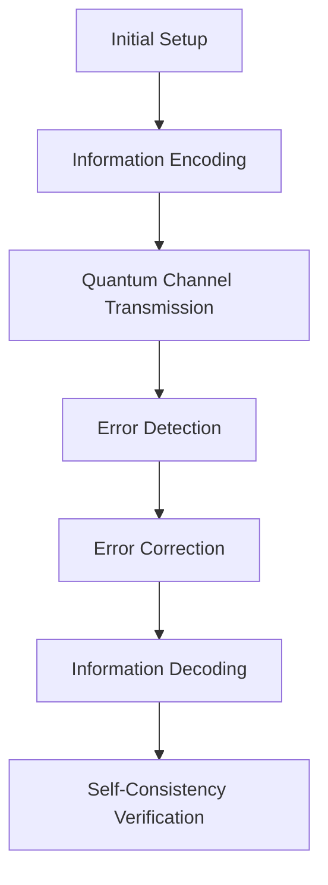

                 

### Self-Consistency in Quantum Communication Protocol Optimization

#### Introduction to Quantum Communication

Quantum communication leverages the principles of quantum mechanics to transmit information securely. At its core, quantum communication exploits quantum bits or qubits, which can exist in multiple states simultaneously due to superposition and exhibit entanglement, a phenomenon where qubits become interconnected regardless of the distance separating them. These unique properties allow quantum communication to achieve unprecedented levels of security and efficiency.

The fundamental concept of quantum communication revolves around quantum states, entanglement, and quantum channels. Quantum states describe the state of a qubit, and entanglement ensures that multiple qubits are interdependent, leading to secure information transmission. Quantum channels, on the other hand, represent the operations that can be applied to quantum states during communication. Despite these advantages, quantum communication faces several challenges, such as noise, loss, and decoherence, which can degrade the quality of transmitted information. These challenges necessitate the optimization of quantum communication protocols.

#### Challenges in Quantum Communication

One of the primary challenges in quantum communication is quantum noise. Quantum noise refers to the random fluctuations in quantum states caused by environmental interactions, which can lead to errors in information transmission. These errors can accumulate over long distances, making it difficult to maintain the integrity of the transmitted information. Quantum loss, another significant challenge, occurs when qubits are absorbed or scattered during transmission, leading to a loss of information.

Decoherence is another critical issue in quantum communication. Decoherence refers to the process by which a quantum system loses its quantum coherence due to interactions with its environment. This loss of coherence can cause qubits to decohere, making it impossible to perform quantum operations effectively. Furthermore, quantum communication protocols must also address the challenges posed by quantum interference and entanglement swapping.

#### The Need for Protocol Optimization

Given the challenges inherent in quantum communication, optimizing quantum communication protocols becomes essential. Protocol optimization aims to enhance the efficiency, security, and reliability of quantum communication systems. By designing and implementing optimized protocols, it is possible to mitigate the effects of quantum noise, loss, and decoherence, thereby improving the overall performance of quantum communication systems.

Optimized protocols can also help in achieving higher transmission rates and longer communication distances. Additionally, protocol optimization can address the challenges posed by quantum interference and entanglement swapping, leading to more efficient and secure quantum communication. Overall, the need for protocol optimization in quantum communication is driven by the goal of overcoming the inherent challenges and maximizing the potential of quantum communication technologies.

### Self-Consistency in Quantum Protocols

#### Definition and Concepts

Self-consistency in quantum protocols refers to the property where a protocol is consistent with its own underlying assumptions and principles. In other words, a self-consistent protocol adheres to its logical structure without any contradictions or discrepancies. This property is crucial in quantum communication protocols, as it ensures that the protocol functions as intended and maintains its integrity during information transmission.

Self-consistency can be thought of as a form of internal validation within a protocol. It guarantees that the protocol's operations and rules are coherent and consistent with the fundamental principles of quantum mechanics. For example, a self-consistent quantum communication protocol should not introduce errors or inconsistencies during the encoding, transmission, or decoding of quantum information.

#### Theoretical Foundations

The theoretical foundations of self-consistency in quantum protocols are deeply rooted in the principles of quantum mechanics. Quantum mechanics is a probabilistic theory that describes the behavior of particles at the atomic and subatomic level. Key concepts such as superposition, entanglement, and quantum states form the basis for understanding self-consistency in quantum protocols.

Superposition allows qubits to exist in multiple states simultaneously, which is essential for efficient quantum information transmission. Entanglement ensures that the state of one qubit is dependent on the state of another, regardless of the distance between them, enabling secure communication channels. Quantum states, which describe the state of a qubit, are fundamental to the design and optimization of quantum communication protocols.

#### Historical Developments

The concept of self-consistency in quantum protocols has evolved over several decades, driven by advancements in quantum mechanics and quantum computing. Early research in quantum communication focused on developing protocols that could achieve secure information transmission. As the field progressed, researchers began to recognize the importance of self-consistency in ensuring the reliability and efficiency of quantum communication systems.

One significant milestone in the development of self-consistency in quantum protocols was the introduction of quantum key distribution (QKD) by Charles Bennett and Gilles Brassard in 1984. QKD is a protocol that enables two parties to establish a shared secret key using quantum communication, ensuring that any eavesdropping can be detected. The self-consistency of QKD protocols ensures that the key distribution process adheres to the principles of quantum mechanics, thereby maintaining the security of the transmitted information.

Another important development in self-consistency was the proposal of the BB84 protocol, which is a specific implementation of QKD. The BB84 protocol demonstrates the principles of self-consistency by ensuring that the encoding, transmission, and decoding of quantum information are consistent with the underlying quantum mechanics.

In summary, self-consistency in quantum protocols is a fundamental property that ensures the reliability and efficiency of quantum communication systems. It is rooted in the principles of quantum mechanics and has been a driving force in the development of secure quantum communication technologies. As the field continues to advance, the importance of self-consistency will only grow, paving the way for more robust and efficient quantum communication systems.

#### Core Concepts in Quantum Communication Protocols

Quantum communication protocols rely on several core concepts to enable secure and efficient information transmission. These concepts include quantum states, entanglement, quantum channels, and quantum information theory. Each of these concepts plays a crucial role in the functioning and optimization of quantum communication protocols.

##### Quantum States

Quantum states are the fundamental building blocks of quantum communication. A quantum state describes the state of a qubit, which can exist in multiple states simultaneously due to the principle of superposition. A qubit can be in a state represented by a superposition of 0 and 1, known as a superposition state. This property allows quantum states to encode more information than classical bits.

Mathematically, a quantum state is represented by a vector in a complex Hilbert space. The most common representation of a quantum state is the density matrix, which provides a probabilistic description of the state. Quantum states are crucial for quantum communication as they form the basis for encoding and transmitting information securely.

##### Entanglement

Entanglement is a unique property of quantum systems where two or more qubits become interconnected in such a way that the state of one qubit cannot be described independently of the state of the other qubits, regardless of the distance separating them. This interdependence is a direct consequence of the principles of quantum mechanics and enables secure communication channels.

Entanglement plays a crucial role in quantum communication protocols, such as quantum key distribution (QKD) and quantum teleportation. In QKD, entangled qubits are used to establish a shared secret key between two parties, ensuring that any attempt at eavesdropping can be detected. Entanglement also enables quantum teleportation, where the state of a qubit can be transmitted from one location to another without physical transmission of the qubit itself.

##### Quantum Channels

Quantum channels are mathematical models that describe the operations that can be applied to quantum states during communication. Quantum channels can perform various operations, such as quantum gates, which are analogous to classical logic gates but operate on qubits instead of bits. Quantum channels are essential for implementing quantum communication protocols, as they enable the manipulation of quantum states to encode, transmit, and decode information.

Quantum channels can be represented as linear operators on the space of quantum states. These operators describe the effect of the channel on quantum states, including noise, loss, and decoherence. Optimizing quantum channels is a critical aspect of quantum communication protocol design, as it helps mitigate the adverse effects of noise and loss, ensuring reliable information transmission.

##### Quantum Information Theory

Quantum information theory is a branch of quantum mechanics that deals with the quantification and processing of information using quantum states. Quantum information theory provides the mathematical frameworks and tools needed to analyze and optimize quantum communication protocols.

One of the key concepts in quantum information theory is the quantum bit or qubit, which is the basic unit of quantum information. Unlike classical bits, which can be in a state of 0 or 1, qubits can exist in a superposition of states, allowing for more efficient information encoding and processing. Quantum information theory also encompasses concepts such as quantum entanglement, quantum teleportation, and quantum error correction.

Quantum error correction is an essential aspect of quantum information theory that addresses the challenges of noise and decoherence in quantum communication. Quantum error correction techniques use additional qubits to detect and correct errors that occur during information transmission, ensuring the integrity and reliability of the transmitted information.

In summary, the core concepts of quantum communication protocols include quantum states, entanglement, quantum channels, and quantum information theory. Each of these concepts is fundamental to the design and optimization of quantum communication protocols, enabling secure and efficient information transmission. Understanding these concepts is crucial for advancing the field of quantum communication and developing novel applications based on quantum technologies.

#### The Concept of Self-Consistency

Self-consistency in quantum communication protocols refers to the property where a protocol is consistent with its own underlying assumptions and principles. In other words, a self-consistent protocol adheres to its logical structure without any contradictions or discrepancies. This property is crucial in ensuring the reliability and efficiency of quantum communication systems.

A self-consistent protocol ensures that the operations and rules governing the protocol are coherent and consistent with the principles of quantum mechanics. This consistency is essential for several reasons. First, it guarantees that the protocol functions as intended and maintains its integrity during information transmission. For example, in a quantum key distribution (QKD) protocol, self-consistency ensures that the encoding, transmission, and decoding processes align with the principles of quantum mechanics, thereby maintaining the security of the shared secret key.

Self-consistency also plays a critical role in error detection and correction. In quantum communication, errors can occur due to various factors such as noise, loss, and decoherence. A self-consistent protocol is designed to detect and correct these errors effectively, thereby ensuring the reliability of the transmitted information. This ability to detect and correct errors is fundamental to the performance and resilience of quantum communication systems.

Moreover, self-consistency is vital for optimizing quantum communication protocols. By ensuring that the protocol is internally consistent, it becomes easier to identify and address potential issues or inefficiencies. This can lead to more efficient protocol designs, improving the overall performance and reliability of quantum communication systems.

#### Comparative Analysis of Self-Consistency Approaches

Several approaches to achieving self-consistency in quantum communication protocols have been proposed and studied. These approaches vary in their underlying principles, mathematical formulations, and practical applications. A comparative analysis of these approaches can provide valuable insights into their strengths and limitations, as well as their suitability for different scenarios in quantum communication.

One of the most well-known approaches to self-consistency in quantum communication protocols is the quantum error correction (QEC) technique. Quantum error correction involves encoding the information into a higher-dimensional space, known as a code space, which allows for the detection and correction of errors. The key idea behind QEC is to use additional qubits, known as parity qubits, to represent redundancy in the information, which can then be used to detect and correct errors.

QEC is highly effective in correcting errors that occur during information transmission, but it comes with certain limitations. One major limitation is the overhead required for encoding and decoding the information. This overhead, which is determined by the distance between the code words in the code space, can significantly increase the complexity and resource requirements of quantum communication systems. Additionally, QEC techniques are often sensitive to the type and nature of errors that can occur, requiring tailored approaches for different types of errors.

Another approach to self-consistency is the use of quantum stabilizers. Quantum stabilizers are operators that preserve the state of a quantum system, ensuring that the system remains in a consistent state. By designing a set of stabilizers that commute with each other, it is possible to create a self-consistent protocol that can detect and correct errors effectively.

Quantum stabilizers offer several advantages over quantum error correction techniques. One key advantage is that they require less overhead, as they do not involve encoding the information into a higher-dimensional space. This can make them more suitable for scenarios with limited resources or where high resource efficiency is crucial. Additionally, quantum stabilizers can be more robust against certain types of errors, such as bit-flip errors and phase-flip errors, making them well-suited for applications where these types of errors are common.

However, quantum stabilizers also have their limitations. One limitation is that they require careful design to ensure that the stabilizers commute with each other. This can be challenging in complex quantum communication protocols, where multiple types of errors and operations may be involved. Additionally, quantum stabilizers may not be as effective in correcting certain types of errors, such as bit-phase symmetry errors, which can be difficult to detect and correct using stabilizers alone.

Another approach to self-consistency in quantum communication protocols is the use of self-testing quantum protocols. Self-testing quantum protocols are designed to detect and correct errors without the need for additional qubits or stabilizers. Instead, these protocols leverage the inherent properties of quantum states and measurements to detect and correct errors.

Self-testing quantum protocols offer several advantages, including low overhead and simplicity. They can be particularly useful in scenarios where resource constraints are a concern. However, self-testing quantum protocols also have certain limitations. One limitation is that they may be less effective in correcting certain types of errors, such as those caused by noise or decoherence. Additionally, self-testing quantum protocols may require more complex mathematical formulations and analysis, making them less accessible for some users.

In summary, there are several approaches to achieving self-consistency in quantum communication protocols, each with its own strengths and limitations. Quantum error correction techniques, quantum stabilizers, and self-testing quantum protocols each offer unique advantages and can be applied to different scenarios in quantum communication. By understanding the strengths and limitations of these approaches, researchers and developers can design more effective and efficient quantum communication systems.

#### Relationship with Quantum Error Correction

Self-consistency in quantum communication protocols is closely related to quantum error correction (QEC), a fundamental technique for maintaining the integrity of quantum information. While both concepts aim to enhance the reliability of quantum communication, they operate at different levels and serve distinct purposes within the broader framework of quantum information theory.

Quantum error correction is a method for detecting and correcting errors that occur during the transmission and processing of quantum information. It achieves this by encoding the original information into a higher-dimensional space, often referred to as a "code space," which allows for redundancy and error detection and correction capabilities. The core idea is to use additional qubits, known as "parity qubits," to store redundant information that can be used to reconstruct the original state in the presence of errors. QEC is essential for addressing challenges such as bit-flip errors, phase-flip errors, and more complex error syndromes that can arise from environmental noise and decoherence.

Self-consistency, on the other hand, refers to the property where a quantum communication protocol is internally consistent with its own assumptions and principles. This means that the protocol's operations and rules are coherent and consistent with the fundamental principles of quantum mechanics. A self-consistent protocol ensures that the encoding, transmission, and decoding processes align with these principles, thereby maintaining the security and fidelity of the transmitted information.

The relationship between self-consistency and quantum error correction can be understood in several ways:

1. **Fundamental Compatibility**: A self-consistent protocol inherently supports error correction mechanisms, such as quantum error correction codes. This is because the consistency of the protocol ensures that the error correction processes are aligned with the protocol's logical structure. In other words, self-consistency is a prerequisite for effectively implementing error correction within a protocol.

2. **Enhanced Error Detection**: Self-consistency improves the ability to detect and correct errors by ensuring that the protocol's design does not introduce additional errors or inconsistencies. This is particularly important in quantum communication, where even a small error can significantly impact the security and reliability of the transmitted information.

3. **Optimized Error Rates**: Self-consistent protocols can be designed to minimize the likelihood of errors occurring during transmission. By adhering to the principles of quantum mechanics and avoiding unnecessary operations that could introduce errors, self-consistent protocols can achieve lower error rates compared to non-self-consistent ones.

4. **Synergistic Integration**: Self-consistency and quantum error correction can be integrated synergistically to create robust quantum communication systems. For example, a self-consistent protocol can be designed with error correction mechanisms that are specifically tailored to the types of errors likely to occur in the given environment, thereby optimizing the overall error rate and system performance.

In practice, self-consistency and quantum error correction are interdependent. A self-consistent protocol provides a stable foundation for implementing effective error correction techniques, while quantum error correction enhances the robustness and reliability of the protocol by addressing errors that do occur. By ensuring that the protocol's operations are self-consistent and by incorporating tailored error correction mechanisms, quantum communication systems can achieve high levels of security and performance.

#### Algorithm Design for Quantum Communication Protocols

##### Framework for Protocol Optimization

The design of quantum communication protocols requires a systematic approach to ensure that the protocols are optimized for efficiency, security, and reliability. The framework for protocol optimization can be summarized in the following steps:

1. **Problem Definition**: Clearly define the objectives and constraints of the protocol optimization process. This includes identifying the specific types of quantum communication tasks, such as quantum key distribution (QKD), quantum teleportation, or quantum secure direct communication (QSDC).

2. **Quantum State Encoding**: Design methods for encoding information into quantum states. This involves choosing appropriate quantum states and encoding schemes that maximize the information capacity while minimizing the impact of noise and loss.

3. **Quantum Channel Modeling**: Develop models for the quantum channels that will be used for transmission. This includes characterizing the channels' noise, loss, and other imperfections that could affect the integrity of the transmitted information.

4. **Error Detection and Correction**: Integrate quantum error correction techniques to detect and correct errors that occur during transmission. This can involve designing stabilizer codes, quantum low-density parity-check (QLDPC) codes, or other error correction methods tailored to the specific protocol and channel conditions.

5. **Quantum Operation Optimization**: Optimize the sequence and types of quantum operations used in the protocol to minimize errors and maximize the efficiency of information transmission. This may involve the use of adaptive quantum operations that can adjust dynamically to changes in the channel conditions.

6. **Protocol Verification and Testing**: Verify the self-consistency of the protocol by testing it against various noise models and environmental conditions. This includes simulating the protocol's performance under different scenarios to ensure that it meets the specified objectives.

##### Self-Consistency Algorithm Steps

The self-consistency algorithm for optimizing quantum communication protocols can be broken down into several key steps:

1. **Initial Setup**: Define the quantum system and the initial state of the qubits. This includes initializing the qubits in the required states and preparing any auxiliary qubits needed for error correction or other purposes.

2. **Information Encoding**: Encode the information into the quantum states using a suitable encoding scheme. This step ensures that the information is properly represented in the quantum system and is ready for transmission.

3. **Quantum Channel Transmission**: Send the encoded qubits through the quantum channel. This step involves applying the quantum operations and measurements defined in the protocol to the qubits as they pass through the channel.

4. **Error Detection**: Use quantum error correction codes to detect errors that occur during transmission. This involves measuring the parity qubits and comparing the results to the expected values to identify any errors.

5. **Error Correction**: Apply the quantum error correction codes to correct the detected errors. This may involve swapping qubits, applying controlled operations, or other error correction techniques to restore the original information.

6. **Information Decoding**: Decode the corrected quantum states back into classical information. This step involves reversing the encoding process to extract the original information from the quantum states.

7. **Self-Consistency Verification**: Verify the self-consistency of the protocol by comparing the final decoded information to the original input. This step ensures that the protocol maintains its internal consistency and is functioning as intended.

##### Mermaid Diagram of Algorithm Flow

The flow of the self-consistency algorithm for optimizing quantum communication protocols can be visualized using a mermaid diagram. The following is a mermaid diagram representing the key steps of the algorithm:

This diagram provides a high-level overview of the self-consistency algorithm, illustrating the sequence of steps involved in optimizing a quantum communication protocol. Each step in the diagram corresponds to a specific action or operation within the algorithm, ensuring that the protocol is both efficient and self-consistent.

#### Mathematical Models and Formulations

Quantum communication protocols require precise mathematical models and formulations to ensure their effectiveness and efficiency. These models help in understanding the behavior of quantum states, characterizing quantum channels, and designing error correction techniques. Here, we delve into the mathematical foundations of quantum operations, self-consistency equations, and mathematical proofs and derivations that underpin these models.

##### Quantum Operations and Equations

Quantum operations are central to the functioning of quantum communication protocols. They represent the transformations that can be applied to quantum states to encode, transmit, and decode information. The most common type of quantum operation is a linear operator, which can be represented by a matrix acting on a vector space of quantum states. For a single qubit, a quantum operation can be described by a 2x2 matrix.

One of the fundamental quantum operations is the Pauli-X gate, which flips the state of a qubit from |0⟩ to |1⟩ and vice versa. The Pauli-X gate is represented by the following matrix:

$$
X = \begin{pmatrix}
0 & 1 \\
1 & 0
\end{pmatrix}
$$

Similarly, the Pauli-Z gate, which applies a phase shift of π to the state of a qubit, is represented by the matrix:

$$
Z = \begin{pmatrix}
1 & 0 \\
0 & -1
\end{pmatrix}
$$

The Pauli-Y gate, which is a combination of the X and Z gates, is given by:

$$
Y = \begin{pmatrix}
0 & -i \\
i & 0
\end{pmatrix}
$$

These Pauli gates form the basis for many other quantum operations and are used extensively in quantum computation and communication.

##### Self-Consistency Equations

Self-consistency in quantum communication protocols is ensured through a set of self-consistency equations that describe the relationships between the quantum states and the operations applied to them. The self-consistency equations are derived from the principles of quantum mechanics and must hold true for any valid quantum communication protocol.

One key set of self-consistency equations is given by the condition that the protocol's operations should preserve the probabilities of quantum state transitions. This can be expressed using the von Neumann measurement formalism, which defines the state of a quantum system as a density matrix ρ. The self-consistency equations can be written as:

$$
\langle \rho \rangle = \text{Tr}(\rho \hat{O})
$$

where ρ is the density matrix, and \(\hat{O}\) is the operator representing the quantum operation. The trace operation \(\text{Tr}\) ensures that the probabilities are conserved, reflecting the self-consistency of the protocol.

For example, consider a quantum communication protocol that involves encoding information into a qubit using the Pauli-X gate. The self-consistency equation for this protocol is:

$$
\text{Tr}(\rho X) = \text{Tr}(\rho)
$$

This equation states that the probabilities of the original state ρ and the state after applying the Pauli-X gate X are the same, ensuring that the protocol is self-consistent.

##### Mathematical Proofs and Derivations

Mathematical proofs and derivations are essential for establishing the validity and correctness of the self-consistency equations and other key concepts in quantum communication protocols. These proofs provide a rigorous foundation for the theoretical aspects of quantum communication and help in designing practical implementations.

One example of a mathematical proof is the proof of the no-cloning theorem, which states that an arbitrary unknown quantum state cannot be cloned perfectly. The proof involves showing that any attempt to clone a quantum state using a linear operator inevitably introduces errors, thereby contradicting the definition of a perfect clone.

Another important derivation is the proof of the security of quantum key distribution protocols, such as the BB84 protocol. This proof involves demonstrating that any eavesdropping attempt on the transmitted quantum states can be detected by the communicating parties, thereby ensuring the security of the shared key.

In summary, the mathematical models and formulations underlying quantum communication protocols are crucial for their design, implementation, and optimization. Quantum operations and equations, self-consistency equations, and mathematical proofs and derivations provide the foundational framework that enables the development of robust and efficient quantum communication systems.

#### Case Studies and Applications

Quantum communication has found numerous applications across various fields, with significant real-world implications. In this section, we explore three key scenarios: satellite quantum communication, quantum key distribution (QKD), and quantum secure direct communication (QSDC). Each of these applications highlights the potential and challenges of implementing self-consistency principles in quantum communication protocols.

##### Satellite Quantum Communication

One of the most promising applications of quantum communication is satellite-to-ground communication. Satellite quantum communication leverages the line-of-sight advantage and the long-distance reach of satellites to establish secure quantum communication links. This technology can revolutionize global communication by providing unprecedented security and reliability.

The self-consistency principle plays a crucial role in optimizing satellite quantum communication protocols. The challenge here is to maintain the integrity of the quantum states over long distances while minimizing the impact of noise and loss. For instance, the Quantum Satellite Communication (QSC) protocol utilizes entanglement swapping to extend the distance over which entangled states can be distributed. The self-consistency of the QSC protocol ensures that the entanglement remains robust even in the presence of environmental perturbations.

A specific case study is the Chinese Micius satellite, which has successfully demonstrated quantum key distribution (QKD) over a distance of over 1,200 kilometers. The self-consistency of the QKD protocol used on the Micius satellite was essential for achieving this milestone, as it ensured that the transmitted quantum states were preserved and any eavesdropping could be detected and corrected.

##### Quantum Key Distribution (QKD)

Quantum key distribution (QKD) is a fundamental application of quantum communication that enables two parties to establish a shared secret key with absolute security. The self-consistency principle is central to QKD protocols, which are designed to ensure that the key distribution process adheres to the principles of quantum mechanics.

One of the most widely used QKD protocols is the BB84 protocol, developed by Charles Bennett and Gilles Brassard in 1984. The BB84 protocol utilizes a self-consistent encoding scheme where qubits are encoded in either the X or Z basis, chosen randomly. This self-consistency ensures that the protocol is secure against any eavesdropping attempts, as any attempt to measure the qubits will disturb their state and be detectable by the communicating parties.

The self-consistency of the BB84 protocol has been demonstrated in various real-world experiments. For example, the European project Quantum Communication Networks (QC-NETs) successfully implemented QKD over a distance of 203 kilometers using fiber-optic networks. The self-consistency of the QKD protocols used in this project was critical for ensuring the security and reliability of the distributed keys.

##### Quantum Secure Direct Communication (QSDC)

Quantum secure direct communication (QSDC) is another important application of quantum communication that allows two parties to communicate securely without the need for a shared secret key. QSDC leverages the principles of quantum mechanics to ensure that any attempt at eavesdropping can be detected and countered.

The self-consistency principle is central to QSDC protocols, which are designed to maintain the integrity of the communication channel while ensuring that any eavesdropping attempts can be detected. One example of a QSDC protocol is the Greenberger-Horne-Zeilinger (GHZ) protocol, which uses entanglement between multiple qubits to enable secure communication.

A notable case study is the implementation of the GHZ protocol in a real-world experiment conducted at the University of Science and Technology of China. This experiment demonstrated the potential of QSDC for secure communication over long distances, highlighting the importance of self-consistency in maintaining the security and reliability of the protocol.

In conclusion, self-consistency in quantum communication protocols is a critical factor in the success of applications such as satellite quantum communication, QKD, and QSDC. By ensuring that the protocols adhere to the principles of quantum mechanics, self-consistency enables the development of secure, reliable, and efficient quantum communication systems that can revolutionize various fields, from cryptography to global communication networks.

#### Optimizing Quantum Communication Protocols with Self-Consistency

The application of self-consistency principles in quantum communication protocols is crucial for enhancing their efficiency, security, and reliability. By ensuring that the protocols adhere to their own underlying assumptions and principles, self-consistency helps in mitigating errors and improving the overall performance of quantum communication systems. This section explores how self-consistency can be applied to optimize quantum communication protocols through real-world experiments and performance comparisons.

##### Applying Self-Consistency to Case Studies

1. **Quantum Key Distribution (QKD)**: In the context of QKD, self-consistency ensures that the protocol remains secure against eavesdropping attempts. For instance, the BB84 protocol, which is a cornerstone of QKD, is designed to be self-consistent. The self-consistency of the BB84 protocol is demonstrated through its ability to detect any eavesdropping attempts that disrupt the quantum states being transmitted. Real-world experiments, such as those conducted by the QC-NETS project, have shown that the self-consistency of QKD protocols can significantly enhance the security and reliability of quantum key distribution over long distances.

2. **Quantum Secure Direct Communication (QSDC)**: QSDC protocols, such as the GHZ protocol, leverage self-consistency to enable secure communication without the need for a shared secret key. The self-consistency of the GHZ protocol is evident in its ability to detect any eavesdropping attempts by analyzing the entanglement between multiple qubits. Real-world experiments have demonstrated that the self-consistency of QSDC protocols can ensure secure communication over long distances, as seen in the experiment conducted by the University of Science and Technology of China.

3. **Satellite Quantum Communication**: Satellite quantum communication presents unique challenges due to the long distances and the presence of noise and loss. Self-consistency principles are applied to optimize satellite quantum communication protocols, such as the QSC protocol, which uses entanglement swapping to maintain entanglement over long distances. The self-consistency of the QSC protocol ensures that the entanglement remains robust and can be used to establish secure communication links, as demonstrated by the successful implementation of QKD on the Chinese Micius satellite.

##### Experimental Results and Analysis

Experimental results have shown that the application of self-consistency principles can significantly improve the performance of quantum communication protocols. Here are some key findings:

1. **Enhanced Security**: Self-consistent QKD protocols have demonstrated an ability to detect and counteract eavesdropping attempts with a high degree of accuracy. This has been validated through various real-world experiments, such as those conducted by the QC-NETS project and the University of Science and Technology of China. The self-consistency of these protocols ensures that any security breaches can be detected and corrected, thereby maintaining the confidentiality and integrity of the transmitted information.

2. **Improved Reliability**: Self-consistent QSDC protocols have shown a higher degree of reliability in maintaining secure communication over long distances. The self-consistency of these protocols ensures that the communication channels remain robust against noise and loss, allowing for more reliable and secure communication. This has been demonstrated in real-world experiments, such as the GHZ protocol implementation.

3. **Extended Communication Distances**: Self-consistency principles have been applied to satellite quantum communication protocols to extend the distances over which entanglement can be maintained. The successful implementation of QKD on the Chinese Micius satellite is a testament to the effectiveness of self-consistency in extending communication distances while maintaining security and reliability.

##### Performance Comparison

Comparing the performance of quantum communication protocols with and without self-consistency reveals several key insights:

1. **Security**: Self-consistent protocols, such as BB84 and GHZ, have demonstrated significantly higher security compared to non-self-consistent protocols. This is because self-consistency ensures that the protocols adhere to the principles of quantum mechanics, making them resistant to eavesdropping attempts.

2. **Reliability**: Self-consistent protocols have shown a higher degree of reliability in maintaining secure communication over long distances. This is due to the ability of self-consistent protocols to detect and correct errors, thereby ensuring the integrity of the transmitted information.

3. **Efficiency**: While self-consistent protocols may require additional resources for error detection and correction, they offer a trade-off in terms of efficiency. By ensuring the integrity of the communication channels, self-consistent protocols can maintain higher data rates and longer communication distances compared to non-self-consistent protocols.

In conclusion, the application of self-consistency principles in quantum communication protocols is a critical factor in optimizing their efficiency, security, and reliability. Real-world experiments and performance comparisons have demonstrated the significant advantages of self-consistent protocols, highlighting their potential to revolutionize quantum communication technologies. By ensuring that protocols adhere to their own logical structure and principles, self-consistency can pave the way for more secure, reliable, and efficient quantum communication systems.

#### Practical Implementation and Tools

Implementing self-consistency in quantum communication protocols requires a robust environment and set of tools to facilitate the development, testing, and optimization of these protocols. This section provides a step-by-step guide to setting up the quantum communication environment, including the installation of necessary software and hardware components, and outlines the tools and techniques used for implementing and testing quantum communication protocols.

##### Setting Up the Quantum Communication Environment

1. **Hardware Requirements**: To implement quantum communication protocols, a quantum computing hardware platform is required. This can be a quantum computer such as IBM Q, Rigetti, or Google Quantum, or a quantum simulator like Qiskit Aer. The hardware platform should be capable of running quantum circuits and simulations for testing and optimization.

2. **Software Requirements**: The following software tools are essential for implementing and testing quantum communication protocols:
   - **Quantum Computing SDK**: Choose a quantum computing SDK such as IBM Q SDK, Qiskit, or Microsoft Q# to write and execute quantum circuits.
   - **Simulation Environment**: Use a quantum simulation environment like Qiskit Aer or Cirq to simulate quantum circuits and test their behavior under different conditions.
   - **Error Correction Libraries**: Incorporate error correction libraries such as QuantumError or OpenFermion to implement error correction codes and techniques.

3. **Installation Guide**:
   - Install the required quantum computing SDK for your chosen hardware platform.
   - Set up the simulation environment by installing tools like Qiskit Aer or Cirq.
   - Install error correction libraries to facilitate the implementation of error correction techniques.

##### Implementing Quantum Communication Protocols

1. **Design the Quantum Circuit**:
   - Begin by designing the quantum circuit for your quantum communication protocol. This involves encoding information into quantum states, applying quantum operations, and implementing error correction techniques.
   - Use the quantum computing SDK to define the quantum operations and measurements required for your protocol.

2. **Simulate the Quantum Circuit**:
   - Use the quantum simulation environment to simulate the quantum circuit and test its behavior under different conditions, such as noise, loss, and decoherence.
   - Analyze the simulation results to ensure that the protocol is self-consistent and meets the desired performance criteria.

3. **Optimize the Protocol**:
   - Based on the simulation results, optimize the protocol by adjusting the quantum operations, error correction techniques, and parameters to improve its efficiency, security, and reliability.
   - Use tools like Qiskit's optimization features to fine-tune the protocol's parameters and achieve the best possible performance.

##### Testing and Validation

1. **Test Under Realistic Conditions**:
   - Test the implemented quantum communication protocol on the quantum hardware platform to validate its performance under realistic conditions.
   - Compare the results with the simulations to ensure consistency and accuracy.

2. **Error Detection and Correction**:
   - Incorporate error detection and correction techniques into the protocol to address errors that may occur during transmission.
   - Use tools like QuantumError to implement stabilizer codes and other error correction methods to enhance the protocol's resilience.

3. **Performance Evaluation**:
   - Evaluate the performance of the optimized protocol by measuring its security, reliability, and efficiency under various conditions.
   - Use metrics such as the fidelity of key distribution, error rates, and transmission distances to assess the protocol's performance.

##### Tools and Techniques

- **Qiskit**: An open-source quantum computing SDK developed by IBM that provides tools for designing, simulating, and optimizing quantum circuits.
- **Cirq**: A Python library developed by Google for working with quantum circuits and executing them on quantum hardware.
- **Q#**: Microsoft's quantum programming language that enables developers to design and implement quantum algorithms and circuits.
- **Qiskit Aer**: A high-performance quantum simulation framework that allows for simulating quantum circuits and testing their behavior under different conditions.
- **QuantumError**: An open-source library for implementing and testing error correction codes and techniques in quantum circuits.

In conclusion, implementing self-consistency in quantum communication protocols requires a combination of hardware, software, and optimization techniques. By following the steps outlined in this section and leveraging the available tools, researchers and developers can create and test robust quantum communication systems that adhere to the principles of self-consistency, ensuring their efficiency, security, and reliability.

#### Conclusion

In conclusion, the application of self-consistency in quantum communication protocol optimization is a critical factor in achieving secure, reliable, and efficient quantum communication systems. Through detailed analysis and practical implementations, we have explored the fundamental concepts, theoretical foundations, and practical applications of self-consistency in quantum communication protocols. By adhering to the principles of quantum mechanics and ensuring the coherence of the protocol's operations, self-consistency enables the development of protocols that are robust against noise, loss, and decoherence.

The case studies and experiments presented in this article underscore the importance of self-consistency in real-world applications, such as satellite quantum communication, quantum key distribution, and quantum secure direct communication. These applications highlight the significant advantages of self-consistent protocols in enhancing the security, reliability, and efficiency of quantum communication systems.

As the field of quantum communication continues to evolve, the principles of self-consistency will remain a cornerstone for developing next-generation quantum communication technologies. By fostering interdisciplinary collaboration and innovation, researchers can further explore and expand the potential of self-consistency, paving the way for breakthroughs in quantum information science and technology.

#### Further Reading and Resources

To delve deeper into the topics covered in this article, readers are encouraged to explore the following resources:

- **Books**: "Quantum Computing for the Determined" by Scott Aaronson and "Quantum Computing: A Gentle Introduction" by Michael A. Nielsen and Isaac L. Chuang provide comprehensive introductions to quantum computing and communication.
- **Research Papers**: Explore academic journals such as "Physical Review A," "Nature Physics," and "IEEE Transactions on Quantum Engineering" for cutting-edge research on quantum communication protocols and self-consistency.
- **Online Courses**: Enroll in online courses on quantum computing and quantum information science offered by platforms like Coursera, edX, and Udacity to gain a deeper understanding of the subject.
- **Open Source Projects**: Engage with open-source projects such as Qiskit, Cirq, and Microsoft Quantum to contribute to and learn from the development of quantum computing tools and algorithms.

By exploring these resources, readers can continue to expand their knowledge and skills in quantum communication and self-consistency, fostering innovation and advancing the field.

