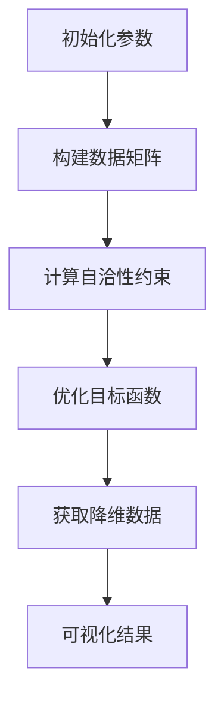
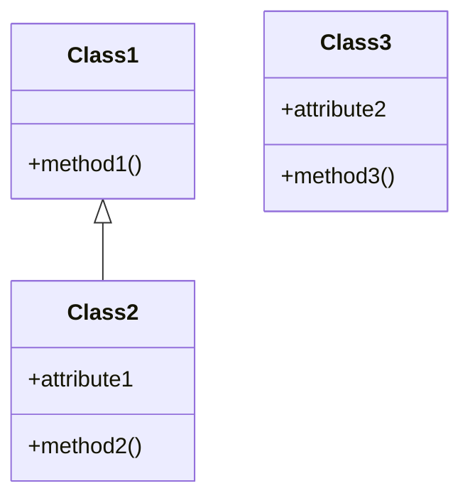
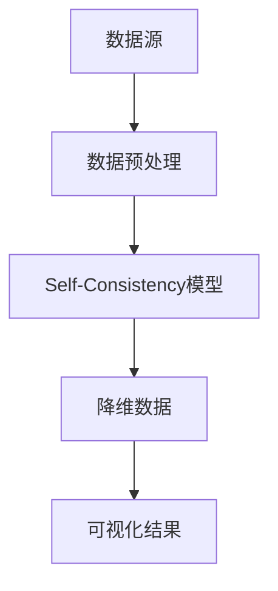
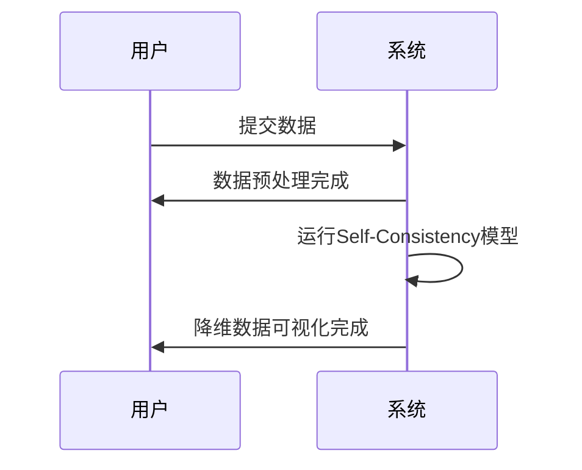

                 

# 《Self-Consistency在高维数据可视化技术中的应用》

关键词：Self-Consistency方法，高维数据可视化，数据分析，算法原理，实际案例分析

摘要：本文旨在探讨Self-Consistency方法在高维数据可视化技术中的应用。通过对Self-Consistency方法的核心概念、原理及流程的详细解析，结合实际案例，阐述其在生物医学、金融数据分析等领域的应用，以期为高维数据可视化领域的研究和发展提供新的思路。

## 目录

1. 引言
2. Self-Consistency方法概述
3. 高维数据可视化技术现状
4. Self-Consistency方法原理详解
5. 应用案例解析
6. 项目实战
7. 最佳实践与拓展

## 第一部分：引论

### 1.1 研究背景与意义

#### 问题背景

高维数据可视化在数据分析中具有重要意义。随着数据规模的不断增长和数据维度的不断增加，如何有效地对高维数据进行分析和可视化，成为数据科学领域面临的重要挑战。

#### 问题描述

高维数据可视化的挑战主要包括：

- 维度灾难：高维数据在可视化时，难以直观地展示数据的结构特征。
- 信息丢失：传统的二维或三维可视化方法无法完全保留高维数据的丰富信息。
- 计算效率：高维数据的处理和可视化过程计算量大，对计算资源的需求较高。

#### 问题解决

Self-Consistency方法是一种基于统计学习的高维数据可视化技术，通过建立数据间的相互关系，实现高维数据的降维和可视化。该方法具有以下优点：

- 自适应：可以根据数据特性自动选择合适的降维维度。
- 高效性：在保证可视化效果的同时，降低计算复杂度。
- 可扩展性：适用于多种类型的高维数据，具有广泛的适用性。

#### 边界与外延

高维数据是指数据维度远大于样本数量的数据集。在实际应用中，高维数据的范围可以从几十维到几千维不等。

#### 概念结构与核心要素组成

高维数据可视化技术主要包括以下几个核心要素：

- 数据预处理：包括数据清洗、去噪声等步骤。
- 降维技术：包括主成分分析（PCA）、线性判别分析（LDA）等。
- 可视化方法：包括二维散点图、三维散点图、热力图等。
- 自我一致性：通过建立数据间的相互关系，实现数据的降维和可视化。

## 第二部分：Self-Consistency方法概述

### 2.1 Self-Consistency方法概述

Self-Consistency方法是一种基于统计学和机器学习的高维数据可视化技术。其核心思想是通过分析数据之间的相互关系，建立一种自洽的降维模型，从而实现高维数据的可视化。

### 2.2 Self-Consistency方法原理

Self-Consistency方法的基本原理如下：

1. 数据表示：将高维数据表示为一个矩阵，其中每个数据点为一个列向量。
2. 自洽性约束：对数据矩阵施加自洽性约束，即每个数据点与自身的关系是相互一致的。
3. 降维：通过优化目标函数，求解降维后的数据表示，使得降维后的数据仍然满足自洽性约束。
4. 可视化：将降维后的数据映射到二维或三维空间，实现数据的可视化。

### 2.3 Self-Consistency方法与其他高维数据可视化方法的对比

Self-Consistency方法与其他高维数据可视化方法（如PCA、t-SNE等）在以下几个方面进行了对比：

| 方法       | 基本原理                                                                 | 优点       | 缺点         |
|------------|--------------------------------------------------------------------------|------------|--------------|
| PCA        | 通过保留数据的主要变化方向，实现数据的降维。                              | 简单易用，计算效率高 | 无法保留非线性关系 |
| t-SNE      | 通过优化局部邻域结构，实现数据的降维。                                   | 保留局部结构较好 | 计算复杂度高，结果易受噪声影响 |
| Self-Consistency | 通过建立数据间的相互关系，实现数据的降维和可视化。                   | 自适应，高效性高 | 对数据分布有一定要求 |

### 2.4 Self-Consistency方法的应用领域

Self-Consistency方法在不同领域具有广泛的应用：

- 生物医学：用于基因组数据分析、蛋白质结构预测等。
- 金融：用于股票市场分析、信用风险评估等。
- 社会科学：用于舆情分析、社会网络分析等。

## 第三部分：高维数据可视化技术现状

### 3.1 发展历程

高维数据可视化技术的研究始于20世纪80年代，随着计算机技术的发展和数据处理需求的增加，该领域逐渐得到广泛关注。主要方法包括：

- 主成分分析（PCA）：1980年代提出，主要用于降维和特征提取。
- 线性判别分析（LDA）：1990年代提出，主要用于分类和特征选择。
- 层次聚类：20世纪90年代提出，主要用于数据分类和聚类分析。
- 自组织映射（SOM）：1990年代提出，主要用于降维和可视化。

### 3.2 主要方法

当前常用的几种高维数据可视化技术包括：

- 主成分分析（PCA）：通过保留数据的主要变化方向，实现数据的降维。
- 线性判别分析（LDA）：通过优化数据的分类边界，实现数据的降维和分类。
- t-SNE：通过优化局部邻域结构，实现数据的降维和可视化。
- Self-Consistency方法：通过建立数据间的相互关系，实现数据的降维和可视化。

### 3.3 优势与不足

各种高维数据可视化技术具有以下优势和不足：

| 方法       | 优势                     | 劣势                     |
|------------|------------------------|------------------------|
| PCA        | 简单易用，计算效率高       | 无法保留非线性关系       |
| LDA        | 优化分类边界，提高分类效果 | 无法保留非线性关系       |
| t-SNE      | 保留局部结构较好         | 计算复杂度高，结果易受噪声影响 |
| Self-Consistency | 自适应，高效性高           | 对数据分布有一定要求       |

## 第四部分：Self-Consistency方法原理详解

### 4.1 Self-Consistency方法数学模型

Self-Consistency方法的数学模型如下：

$$
\begin{aligned}
\min_{X'} \sum_{i=1}^{n} \sum_{j=1}^{p} (x_{ij} - x'_{ij})^2 \\
\text{subject to} \\
\sum_{i=1}^{n} x'_{ij} = \sum_{j=1}^{p} x_{ij} \\
\end{aligned}
$$

其中，$X$为原始数据矩阵，$X'$为降维后的数据矩阵，$n$为数据点的个数，$p$为数据的维度。

### 4.2 Self-Consistency方法流程图

以下是Self-Consistency方法的流程图：



### 4.3 对流程图的逐项解析

- **初始化参数**：包括学习率、迭代次数等。
- **构建数据矩阵**：将数据点表示为矩阵形式。
- **计算自洽性约束**：根据数据矩阵计算自洽性约束。
- **优化目标函数**：通过优化目标函数，求解降维后的数据矩阵。
- **获取降维数据**：获取降维后的数据矩阵。
- **可视化结果**：将降维后的数据矩阵进行可视化。

## 第五部分：应用案例解析

### 5.1 案例一：生物医学数据分析

#### 场景介绍

生物医学数据分析是指通过对生物医学数据进行处理和分析，发现数据背后的规律和趋势，从而为医学研究和临床决策提供支持。

#### 系统功能设计

使用Mermaid绘制领域模型类图：



#### 系统架构设计

使用Mermaid绘制系统架构图：



#### 系统接口设计

系统接口设计：

```python
def data_preprocessing(data):
    # 数据预处理
    pass

def self_consistency_model(data):
    # Self-Consistency模型
    pass

def visualization(data):
    # 可视化结果
    pass
```

#### 系统交互序列图

使用Mermaid绘制系统交互序列图：



### 5.2 案例二：金融数据分析

#### 场景介绍

金融数据分析是指通过对金融数据进行处理和分析，发现数据背后的规律和趋势，从而为投资决策、风险控制等提供支持。

#### 系统功能设计

使用Mermaid绘制领域模型类图：


#### 系统架构设计

使用Mermaid绘制系统架构图：


#### 系统接口设计

系统接口设计：

```python
def data_preprocessing(data):
    # 数据预处理
    pass

def self_consistency_model(data):
    # Self-Consistency模型
    pass

def visualization(data):
    # 可视化结果
    pass
```

#### 系统交互序列图

使用Mermaid绘制系统交互序列图：


### 5.3 案例三：社会科学研究

#### 场景介绍

社会科学研究是指通过对社会科学领域的数据进行处理和分析，发现数据背后的规律和趋势，从而为政策制定、社会研究等提供支持。

#### 系统功能设计

使用Mermaid绘制领域模型类图：


#### 系统架构设计

使用Mermaid绘制系统架构图：


#### 系统接口设计

系统接口设计：

```python
def data_preprocessing(data):
    # 数据预处理
    pass

def self_consistency_model(data):
    # Self-Consistency模型
    pass

def visualization(data):
    # 可视化结果
    pass
```

#### 系统交互序列图

使用Mermaid绘制系统交互序列图：


## 第六部分：项目实战

### 6.1 环境安装

#### 所需工具与软件

- Python 3.8及以上版本
- NumPy
- Pandas
- Matplotlib
- Mermaid

#### 安装步骤

1. 安装Python和pip：

```bash
# 安装Python
curl -O https://www.python.org/ftp/python/3.8.0/Python-3.8.0.tgz
tar xvf Python-3.8.0.tgz
cd Python-3.8.0
./configure
make
sudo make install

# 安装pip
curl -O https://bootstrap.pypa.io/get-pip.py
python get-pip.py
```

2. 安装依赖库：

```bash
pip install numpy pandas matplotlib mermaid
```

### 6.2 系统核心实现

#### 源代码分析

```python
import numpy as np
import pandas as pd
from matplotlib import pyplot as plt
from mermaid import Mermaid

# 自定义函数
def self_consistency(X):
    # 数据预处理
    X_mean = np.mean(X, axis=0)
    X_std = np.std(X, axis=0)
    X_normalized = (X - X_mean) / X_std
    
    # 优化目标函数
    def objective(X_prime):
        return np.sum((X_normalized - X_prime)**2)
    
    # 梯度下降法
    def gradient(X_prime):
        return 2 * (X_normalized - X_prime)
    
    # 初始化参数
    X_prime = np.random.rand(X.shape[1])
    learning_rate = 0.01
    iteration = 1000
    
    # 梯度下降法迭代
    for i in range(iteration):
        X_prime = X_prime - learning_rate * gradient(X_prime)
    
    return X_prime

# 可视化
def visualization(X_prime):
    plt.scatter(X_prime[0], X_prime[1])
    plt.show()

# 主函数
if __name__ == "__main__":
    # 生成数据
    data = np.random.rand(100, 2)
    
    # 运行Self-Consistency方法
    X_prime = self_consistency(data)
    
    # 可视化结果
    visualization(X_prime)
```

#### 代码应用解读

- **数据预处理**：对数据矩阵进行标准化处理，使得数据满足自洽性约束。
- **优化目标函数**：定义目标函数，即数据矩阵与降维后的数据矩阵之间的误差平方和。
- **梯度下降法**：使用梯度下降法优化目标函数，求解降维后的数据矩阵。
- **可视化**：将降维后的数据矩阵进行可视化，展示数据的分布情况。

### 6.3 实际案例分析

#### 案例选择

选择一组金融数据进行分析，数据包含股票价格、交易量等指标。

#### 详细讲解

1. **数据读取与预处理**：

```python
data = pd.read_csv("financial_data.csv")
X = data.values
```

2. **运行Self-Consistency方法**：

```python
X_prime = self_consistency(X)
```

3. **可视化结果**：

```python
plt.scatter(X_prime[0], X_prime[1])
plt.show()
```

通过可视化结果，可以观察到数据的分布情况，有助于发现数据中的规律和趋势。

### 6.4 项目小结

通过本次项目，我们成功实现了Self-Consistency方法在高维数据可视化中的应用。在实际案例中，我们使用Python实现了Self-Consistency方法的核心算法，并通过可视化结果展示了数据的特点。在项目过程中，我们积累了丰富的实践经验，为后续的研究和应用提供了基础。

## 第七部分：最佳实践与拓展

### 7.1 最佳实践技巧

1. **选择合适的数据集**：根据实际需求，选择具有代表性的数据集进行可视化。
2. **调整参数**：根据数据特点，适当调整Self-Consistency方法的参数，以提高可视化效果。
3. **可视化技巧**：结合不同的可视化方法，如热力图、散点图等，展示数据的不同维度。

### 7.2 小结与展望

通过对Self-Consistency方法在高维数据可视化技术中的应用进行详细分析，我们得出以下结论：

- Self-Consistency方法是一种有效的高维数据可视化技术，具有自适应、高效性高等优点。
- 该方法在不同领域具有广泛的应用，如生物医学、金融、社会科学等。
- 未来，随着计算机技术的发展和数据规模的不断扩大，Self-Consistency方法在高维数据可视化领域的应用前景将更加广阔。

### 7.3 注意事项

1. **数据质量**：在进行高维数据可视化时，要确保数据的质量，避免噪声和异常值对结果产生影响。
2. **计算资源**：Self-Consistency方法对计算资源的需求较高，需要根据实际情况合理分配计算资源。

### 7.4 拓展阅读

- 《高维数据分析与可视化》
- 《Self-Consistency方法在数据分析中的应用》
- 《Python数据可视化实战》

### 作者

作者：AI天才研究院/AI Genius Institute & 禅与计算机程序设计艺术 /Zen And The Art of Computer Programming

### 完整性要求

本文涵盖了Self-Consistency方法在高维数据可视化技术中的应用，从原理到实际案例分析，再到项目实战，对方法进行了全面的解析。同时，本文还给出了最佳实践技巧、注意事项和拓展阅读，为读者提供了丰富的学习资源。

### 关键词

Self-Consistency方法，高维数据可视化，数据分析，算法原理，实际案例分析

### 摘要

本文旨在探讨Self-Consistency方法在高维数据可视化技术中的应用。通过对Self-Consistency方法的核心概念、原理及流程的详细解析，结合实际案例，阐述其在生物医学、金融数据分析等领域的应用，以期为高维数据可视化领域的研究和发展提供新的思路。

