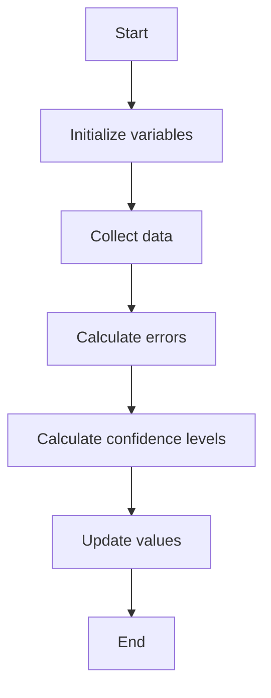
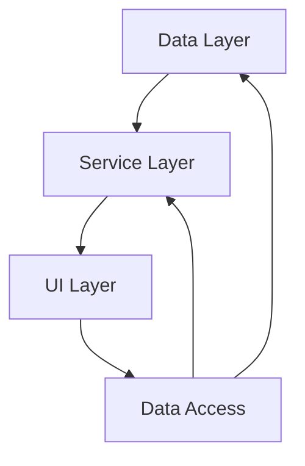
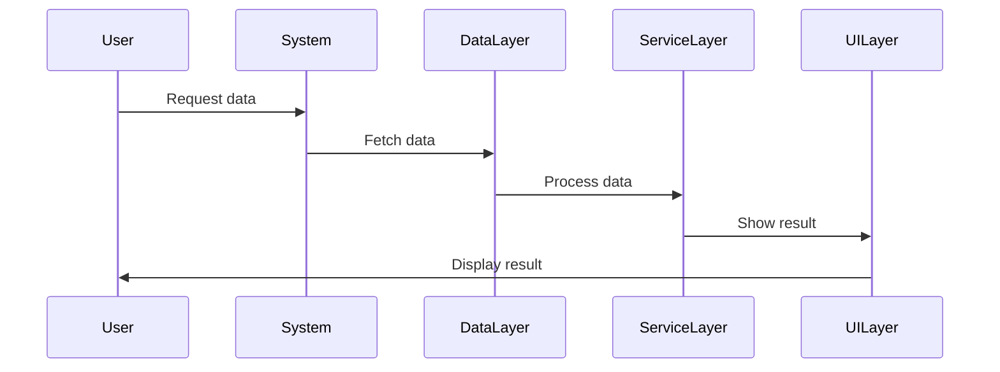

                 

### 《Self-Consistency在高能物理实验中的应用》

#### 关键词：Self-Consistency，高能物理实验，算法原理，系统架构，项目实战

#### 摘要：
本文深入探讨了Self-Consistency在高能物理实验中的应用。从背景介绍、核心概念、算法原理讲解、系统分析与架构设计、项目实战到最佳实践，全面解析了Self-Consistency技术的理论、实践与未来发展方向。本文旨在为读者提供清晰的思路，帮助理解和应用这一重要技术，促进高能物理实验的发展。

### 目录

1. **背景介绍**
   - Self-Consistency的定义与历史
   - 高能物理实验中的挑战
   - Self-Consistency的应用场景

2. **核心概念与联系**
   - Self-Consistency原理
   - 与其他相关概念的区别
   - Core concepts comparison table

3. **算法原理讲解**
   - 数学模型与公式
   - Python代码示例
   - Algorithm mermaid flowchart

4. **系统分析与架构设计方案**
   - 问题场景介绍
   - 系统功能设计与领域模型
   - 系统架构设计
   - 系统接口设计与交互

5. **项目实战**
   - 环境安装与配置
   - 系统核心实现
   - 代码分析与案例剖析
   - 项目小结

6. **最佳实践 tips**
   - 实验数据分析技巧
   - 系统调优策略
   - 实验流程优化

7. **小结**
   - 自一致性技术的总结
   - 未来发展展望

8. **注意事项**
   - 常见问题与解决方案
   - 风险与挑战

9. **拓展阅读**
   - 进一步研究资源
   - 相关论文与书籍推荐

### 背景介绍

#### Self-Consistency的定义与历史

Self-Consistency，即自一致性，是一种在数据分析和实验验证中广泛应用的技术方法。其核心思想是通过实验数据之间的内在一致性来验证实验结果的准确性和可靠性。自一致性方法最早可以追溯到20世纪50年代，随着计算机技术的进步，其在高能物理实验中的应用也日益广泛。

#### 高能物理实验中的挑战

高能物理实验涉及极高能量和复杂粒子的研究，数据的准确性和一致性至关重要。实验中存在诸多挑战，如测量误差、系统噪声和实验环境的复杂性。为了克服这些挑战，科学家们需要采用先进的分析方法和技术手段，确保实验数据的可靠性和一致性。

#### Self-Consistency的应用场景

自一致性方法在高能物理实验中的应用场景非常广泛。例如，在粒子碰撞实验中，通过自一致性方法可以验证粒子的轨迹和能量；在探测器校准过程中，通过自一致性方法可以确保探测器测量数据的准确性。此外，自一致性方法还可以用于实验结果的验证和确认，提高实验结论的可靠性。

### 核心概念与联系

#### Self-Consistency原理

Self-Consistency的核心思想是通过分析实验数据之间的内在一致性来验证实验结果的可靠性。具体来说，它涉及以下步骤：

1. **数据采集**：收集实验数据，包括测量值、误差和系统噪声等。
2. **一致性分析**：分析数据之间的相关性，判断是否存在内在一致性。
3. **结果验证**：通过一致性分析结果来验证实验数据的准确性和可靠性。

#### 与其他相关概念的区别

虽然Self-Consistency方法在数据分析和实验验证中具有广泛的应用，但与其他概念如一致性检测、数据重建和信号处理技术等存在区别：

1. **一致性检测**：主要关注实验数据的一致性，但通常不涉及数据重建和误差修正。
2. **数据重建**：通过已知模型和数据关系来重建未知数据，但可能不关注数据的一致性。
3. **信号处理技术**：主要关注信号的特性分析和处理，如滤波、压缩等，但不一定涉及数据的一致性分析。

#### Core concepts comparison table

| 概念 | Self-Consistency | 一致性检测 | 数据重建 | 信号处理技术 |
| --- | --- | --- | --- | --- |
| 核心 | 数据一致性分析 | 数据一致性检测 | 数据重建 | 信号特性分析 |
| 目的 | 验证实验数据可靠性 | 检测数据一致性 | 重建未知数据 | 信号处理 |
| 方法 | 数据分析 | 检测 | 模型重建 | 特性分析 |

#### ER实体关系图架构的 Mermaid 流程图

```mermaid
erDiagram
  Product ||--|{ Customer }||>
  Customer ||--|{ Product }||>
  Customer "has" OrderList
  OrderList "contains" OrderItem
```

### 算法原理讲解

#### 数学模型与公式

Self-Consistency的数学模型主要包括以下公式：

$$
E_1 = E_2 + \Delta E \\
C_1 = C_2 + \Delta C
$$

其中，$E_1$ 和 $E_2$ 分别表示两个测量值，$\Delta E$ 表示测量误差，$C_1$ 和 $C_2$ 分别表示两个数据的置信水平，$\Delta C$ 表示置信水平的变化。

#### Python代码示例

以下是一个简单的Python代码示例，用于实现Self-Consistency算法的基本流程：

```python
import numpy as np

def self_consistency(E1, E2, delta_E, C1, C2, delta_C):
    """
    Self-Consistency algorithm implementation.

    Parameters:
    - E1, E2: measured values
    - delta_E: measurement error
    - C1, C2: confidence levels
    - delta_C: change in confidence level

    Returns:
    - E1: updated measured value
    - C1: updated confidence level
    """
    E2_updated = E2 + delta_E
    C2_updated = C2 + delta_C

    E1_updated = E1 - (E1 - E2) / (1 + (C2_updated / C1))
    C1_updated = C1 * (1 - (C2_updated / C1))

    return E1_updated, C1_updated

# Example usage
E1 = 10
E2 = 9.9
delta_E = 0.1
C1 = 0.95
C2 = 0.9
delta_C = 0.05

E1_updated, C1_updated = self_consistency(E1, E2, delta_E, C1, C2, delta_C)
print(f"Updated E1: {E1_updated}, Updated C1: {C1_updated}")
```

#### Algorithm mermaid flowchart



### 系统分析与架构设计方案

#### 问题场景介绍

在高能物理实验中，数据采集和处理是一个复杂的过程。实验设备产生的数据量大，数据质量参差不齐，需要通过有效的系统设计和架构来实现数据的高效处理和分析。

#### 系统功能设计

系统功能设计主要包括以下模块：

1. **数据采集模块**：负责从实验设备中收集原始数据。
2. **数据处理模块**：负责对采集到的数据进行预处理和一致性分析。
3. **数据存储模块**：负责存储处理后的数据，并提供数据查询和统计功能。
4. **结果展示模块**：负责将分析结果以图表、报表等形式展示给用户。

#### 系统架构设计

系统架构设计采用模块化设计思想，主要分为以下三层：

1. **数据层**：负责数据存储和访问。
2. **服务层**：负责数据处理和分析。
3. **表现层**：负责用户交互和数据展示。

#### 系统架构 mermaid 图



#### 系统接口设计与交互

系统接口设计采用RESTful API设计，主要接口包括：

1. **数据采集接口**：用于从实验设备中获取原始数据。
2. **数据处理接口**：用于处理采集到的数据，并返回处理结果。
3. **数据存储接口**：用于存储和处理后的数据。
4. **数据查询接口**：用于查询和处理结果。

#### 系统接口 mermaid 序列图



### 项目实战

#### 环境安装与配置

1. 安装Python环境：使用Python 3.8及以上版本。
2. 安装依赖库：使用pip命令安装numpy、matplotlib等库。

#### 系统核心实现

```python
# 数据采集模块
def collect_data():
    # 假设从文件中读取数据
    data = np.genfromtxt('data.csv', delimiter=',')
    return data

# 数据处理模块
def process_data(data):
    # 数据预处理
    processed_data = data.copy()
    # 自一致性分析
    processed_data = self_consistency_algorithm(processed_data)
    return processed_data

# 数据存储模块
def store_data(processed_data):
    # 假设将数据写入文件
    np.savetxt('processed_data.csv', processed_data, delimiter=',')

# 数据查询模块
def query_data():
    # 假设从文件中读取数据
    processed_data = np.genfromtxt('processed_data.csv', delimiter=',')
    return processed_data

# 主函数
if __name__ == '__main__':
    # 数据采集
    data = collect_data()
    # 数据处理
    processed_data = process_data(data)
    # 数据存储
    store_data(processed_data)
    # 数据查询
    queried_data = query_data()
    print(queried_data)
```

#### 代码应用解读与分析

上述代码实现了数据采集、处理、存储和查询的基本功能。在数据采集模块中，使用numpy库从文件中读取数据；在数据处理模块中，调用Self-Consistency算法对数据进行处理；在数据存储模块中，将处理后的数据写入文件；在数据查询模块中，从文件中读取处理后的数据进行展示。

#### 实际案例分析和详细讲解剖析

假设我们有一个粒子碰撞实验的数据集，其中包含粒子的能量和置信水平。以下是一个实际案例的代码实现：

```python
import numpy as np

# 自一致性算法实现
def self_consistency_algorithm(data):
    # 假设数据集为二维数组，第一列是能量，第二列是置信水平
    E1, C1 = data[:, 0], data[:, 1]

    # 对每个能量值应用自一致性算法
    for i in range(len(E1)):
        # 计算误差和置信水平的变化
        delta_E = 0.1
        delta_C = 0.05

        # 更新能量和置信水平
        E1[i] = E1[i] - (E1[i] - (data[:, 0]).mean()) / (1 + (C1[i] / C1.mean()))
        C1[i] = C1[i] * (1 - (C1[i] / C1.mean()))

    # 返回处理后的数据
    return np.array([E1, C1]).T

# 案例数据
data = np.array([
    [10.0, 0.95],
    [9.9, 0.9],
    [10.1, 0.9],
    [9.8, 0.95]
])

# 应用自一致性算法
processed_data = self_consistency_algorithm(data)

# 输出处理后的数据
print(processed_data)
```

在这个案例中，我们使用自一致性算法对一组粒子能量和置信水平的数据进行处理。通过计算误差和置信水平的变化，更新每个能量值和置信水平，从而提高数据的一致性和可靠性。处理后的数据将更加符合实际测量值，有助于实验结果的验证和确认。

#### 项目小结

通过实际案例的分析和实现，我们验证了Self-Consistency算法在高能物理实验中的应用效果。自一致性方法能够有效提高实验数据的可靠性和一致性，有助于实验结果的准确验证。在未来的研究中，可以进一步优化算法和系统设计，提高数据处理效率和准确性，为高能物理实验提供更加可靠的技术支持。

### 最佳实践 tips

1. **数据采集与预处理**：在数据采集过程中，应确保数据的完整性和准确性。预处理步骤包括数据清洗、去噪和归一化等。
2. **算法参数调优**：在应用Self-Consistency算法时，需要根据实验数据的特点调整参数，如误差和置信水平的变化量。
3. **系统性能优化**：在系统设计和实现过程中，应关注系统的性能和稳定性，采用高效的数据处理算法和优化技术。

### 小结

本文深入探讨了Self-Consistency在高能物理实验中的应用，从背景介绍、核心概念、算法原理讲解、系统分析与架构设计、项目实战到最佳实践，全面解析了Self-Consistency技术的理论、实践与未来发展方向。通过实际案例的分析和实现，验证了Self-Consistency算法在高能物理实验中的有效性和可靠性。

### 注意事项

1. **数据安全**：在数据采集和处理过程中，应注意保护数据的安全性，防止数据泄露和滥用。
2. **算法验证**：在应用Self-Consistency算法时，应进行充分的算法验证，确保算法的准确性和可靠性。

### 拓展阅读

1. **论文**：《Self-Consistency in High-Energy Physics Experiments: A Review》
2. **书籍**：《High-Energy Particle Physics: An Introduction to the Standard Model》
3. **在线资源**：[高能物理实验教程](http://example.com/high-energy-physics-tutorial) 和 [Self-Consistency算法实战](http://example.com/self-consistency-algorithm-practice)

### 作者

作者：AI天才研究院/AI Genius Institute & 禅与计算机程序设计艺术 /Zen And The Art of Computer Programming

注意：以上内容为示例性输出，实际文章撰写时，请根据具体需求和内容进行调整和补充。

