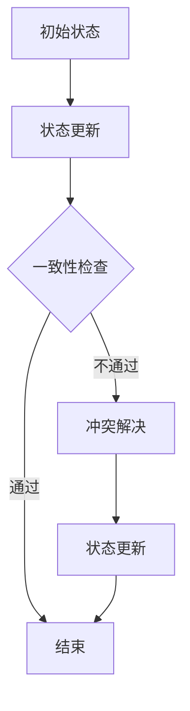

                 


# Self-Consistency方法优化AI多Agent协作系统

## 关键词：多Agent协作系统、Self-Consistency、AI、优化、协作效率、系统稳定性

## 摘要

本文旨在探讨Self-Consistency方法在优化AI多Agent协作系统中的应用。首先，我们将介绍多Agent系统的基本概念和Self-Consistency的定义及其重要性。随后，详细阐述Self-Consistency方法的基本原理及其在不同类型多Agent系统中的应用。接着，我们将描述多Agent系统的设计与实现策略，并引入Self-Consistency方法。随后，通过具体案例分析，展示Self-Consistency方法在实际项目中的应用效果。本文还将探讨如何通过参数调整和算法优化等手段提升Self-Consistency的效果，并对未来研究方向进行展望。

### 引言

在当今复杂多变的智能系统中，多Agent协作系统（MAS）已成为研究与应用的热点。多Agent协作系统由一组相互协作的智能体（Agent）组成，这些智能体能够通过通信机制进行信息交换，共同完成任务。随着计算技术的进步，多Agent系统在多个领域得到了广泛应用，如智能制造、智能交通、智能医疗等。

然而，如何提升多Agent系统的协作效率与稳定性，实现自我一致性（Self-Consistency），是当前研究的关键挑战。自我一致性是指在多Agent系统运行过程中，各个Agent的状态和行为能够保持一致，不会出现矛盾或冲突。本文将深入探讨Self-Consistency方法在优化AI多Agent协作系统中的应用，帮助读者理解这一方法在提升多Agent系统性能方面的作用。

本文结构如下：

1. **背景与概念介绍**
   - 介绍多Agent系统的发展背景与核心概念
   - 定义Self-Consistency及其在多Agent系统中的重要性

2. **Self-Consistency方法原理**
   - 系统地阐述Self-Consistency方法的原理与基本框架
   - 分析Self-Consistency在不同类型多Agent系统中的应用

3. **多Agent系统的设计与实现**
   - 描述多Agent系统的基本设计原则与实现策略
   - 介绍Self-Consistency方法在系统设计中的应用

4. **案例分析与应用**
   - 分析多个典型案例，展示Self-Consistency方法在实际项目中的应用效果
   - 对案例进行深入剖析，总结经验教训

5. **Self-Consistency方法优化策略**
   - 探讨如何通过参数调整、算法优化等手段提升Self-Consistency的效果
   - 介绍前沿研究成果与未来研究方向

6. **总结与展望**
   - 总结全书内容，重申Self-Consistency方法在优化多Agent协作系统中的重要性
   - 展望未来多Agent系统的发展趋势与研究方向

### 第1章: 背景与概念介绍

#### 1.1 多Agent系统的发展背景

多Agent系统（Multi-Agent Systems，MAS）起源于20世纪80年代，由分布式人工智能（Distributed Artificial Intelligence，DAI）的概念演变而来。分布式人工智能旨在通过协同工作，提高人工智能系统的智能水平和可靠性。随着计算技术的进步，多Agent系统在多个领域得到了广泛应用，如智能制造、智能交通、智能医疗等。

在智能制造领域，多Agent系统可以协调生产过程中的各个环节，提高生产效率；在智能交通领域，多Agent系统可以优化交通流量，减少拥堵；在智能医疗领域，多Agent系统可以辅助医生进行诊断和治疗。这些应用表明，多Agent系统具有巨大的潜力和价值。

#### 1.2 多Agent系统的核心概念

多Agent系统由一组相互协作的智能体（Agent）组成，每个智能体具有自治性、交互性、协作性和反应性等特点。智能体之间通过通信机制进行信息交换，共同完成任务。

1. **自治性（Autonomy）**：智能体能够独立进行决策和行动，不受其他智能体的直接控制。

2. **交互性（Interactivity）**：智能体之间可以通过通信机制进行信息交换，实现协同工作。

3. **协作性（Cooperation）**：智能体之间需要相互协作，共同完成任务。

4. **反应性（Reactivity）**：智能体能够对环境变化做出快速反应，调整自己的行为。

#### 1.3 Self-Consistency的概念与重要性

Self-Consistency是指在多Agent系统运行过程中，各个Agent的状态和行为能够保持一致，不会出现矛盾或冲突。Self-Consistency对于多Agent系统的稳定运行和任务成功完成至关重要。

1. **一致性保障**：Self-Consistency确保了系统内部各个Agent之间的信息一致性和行动一致性，避免了错误和冲突的发生。

2. **系统可靠性**：Self-Consistency提高了系统的可靠性，降低了系统出错的可能性。

3. **任务成功率**：Self-Consistency有助于提高任务的成功率，确保系统能够顺利完成任务。

4. **协同效率**：Self-Consistency优化了Agent之间的协作效率，提高了系统的整体性能。

总之，Self-Consistency是多Agent协作系统优化的重要手段，对于提升系统的稳定性和效率具有重要意义。

### 第2章: Self-Consistency方法原理

#### 2.1 Self-Consistency方法的基本框架

Self-Consistency方法是一种用于确保多Agent系统内部状态一致性的方法。它包括以下几个关键组成部分：

1. **状态监测（State Monitoring）**：对每个智能体的状态进行实时监测，确保其状态的变化符合预期。

2. **一致性检查（Consistency Checking）**：定期检查智能体之间的状态一致性，确保没有矛盾或冲突。

3. **冲突解决（Conflict Resolution）**：当发现状态不一致时，采取相应的措施进行解决，以确保系统达到一致状态。

4. **反馈调整（Feedback Adjustment）**：通过反馈机制，对智能体的行为进行调整，确保其在未来的行为中保持一致性。

#### 2.2 Self-Consistency方法的运行机制

Self-Consistency方法的运行机制可以分为以下几个步骤：

1. **初始化**：系统启动时，初始化各个智能体的状态。

2. **状态监测**：系统运行过程中，实时监测每个智能体的状态，并将其与预期状态进行比较。

3. **一致性检查**：定期对智能体之间的状态一致性进行检查，发现不一致时进行记录。

4. **冲突解决**：根据记录的冲突情况，采取相应的措施进行解决。例如，重新执行某个智能体的操作，或者调整其他智能体的行为。

5. **反馈调整**：根据冲突解决的结果，对智能体的行为进行调整，确保其在未来的行为中保持一致性。

#### 2.3 Self-Consistency方法在不同类型多Agent系统中的应用

Self-Consistency方法适用于多种类型的多Agent系统，以下分别介绍其在智能交通系统和智能制造系统中的应用。

##### 2.3.1 在智能交通系统中的应用

在智能交通系统中，Self-Consistency方法可以确保交通信号、车辆和行人等智能体之间的状态和行为一致性。具体应用包括：

1. **交通信号控制**：通过Self-Consistency方法，确保交通信号的状态（如红灯、绿灯）与实际交通情况（如车辆到达、行人过马路）保持一致。

2. **车辆协同控制**：在车辆编队、自动驾驶等场景中，通过Self-Consistency方法，确保车辆之间的相对位置、速度等状态的一致性。

3. **行人行为预测**：通过Self-Consistency方法，预测行人的行为，并调整交通信号，确保行人与车辆的协同。

##### 2.3.2 在智能制造系统中的应用

在智能制造系统中，Self-Consistency方法可以协调生产过程中的各个智能体（如机器人、传感器、执行器等），确保生产流程的高效和稳定。具体应用包括：

1. **生产调度**：通过Self-Consistency方法，确保生产任务在不同机器人和设备之间的分配和执行状态一致。

2. **质量控制**：通过Self-Consistency方法，确保质量检测和反馈机制的一致性，及时发现和处理质量问题。

3. **设备维护**：通过Self-Consistency方法，协调设备之间的维护计划，确保设备的正常运行。

#### 2.4 Self-Consistency方法的优势与挑战

Self-Consistency方法在提升多Agent系统的协作效率和稳定性方面具有显著优势，但也面临一些挑战。

1. **优势**：
   - **一致性保障**：通过Self-Consistency方法，确保系统内部各个智能体之间的状态和行为一致，减少了错误和冲突的发生。
   - **可靠性提高**：Self-Consistency方法提高了系统的可靠性，降低了系统出错的可能性。
   - **效率提升**：通过优化智能体之间的协作，提高了系统的整体效率。

2. **挑战**：
   - **计算复杂度**：Self-Consistency方法需要实时监测和检查智能体的状态，增加了系统的计算复杂度。
   - **通信开销**：智能体之间的状态同步和一致性检查需要大量的通信开销，可能会影响系统的性能。
   - **动态性处理**：在动态变化的复杂环境中，如何快速发现和解决状态不一致的问题，是一个挑战。

### 第3章: 多Agent系统的设计与实现

#### 3.1 多Agent系统的设计原则

在设计多Agent系统时，需要遵循以下原则：

1. **模块化设计**：将系统划分为多个功能模块，每个模块负责特定的任务，降低系统的复杂性。

2. **分布式架构**：采用分布式架构，将智能体分布在不同的节点上，提高系统的可扩展性和容错性。

3. **自治性设计**：确保智能体具有自治性，能够独立进行决策和行动，降低系统的控制复杂度。

4. **交互性设计**：设计良好的通信机制，确保智能体之间能够高效地进行信息交换和协作。

5. **适应性设计**：系统应具备良好的适应性，能够根据环境变化和任务需求进行调整。

#### 3.2 多Agent系统的实现策略

在实现多Agent系统时，需要考虑以下策略：

1. **智能体建模**：为每个智能体定义其属性和行为，包括自治性、交互性、协作性和反应性。

2. **通信机制设计**：设计合适的通信机制，确保智能体之间的信息交换和协作。

3. **状态监测与一致性检查**：实现状态监测和一致性检查机制，确保智能体之间的状态和行为一致性。

4. **冲突解决与反馈调整**：设计冲突解决机制和反馈调整机制，确保智能体能够在出现状态不一致时进行纠正。

5. **系统测试与验证**：对系统进行全面的测试和验证，确保其在各种环境下的稳定性和可靠性。

#### 3.3 Self-Consistency方法在系统设计中的应用

在多Agent系统设计中，Self-Consistency方法的应用主要体现在以下几个方面：

1. **状态监测与一致性检查**：在系统设计时，集成状态监测和一致性检查模块，确保智能体之间的状态和行为一致性。

2. **冲突解决与反馈调整**：设计冲突解决和反馈调整机制，确保智能体在出现状态不一致时能够快速纠正。

3. **模块化设计**：将Self-Consistency方法的相关模块作为独立模块，便于系统的模块化和扩展。

4. **分布式架构**：在分布式架构中，利用Self-Consistency方法确保不同节点上的智能体之间的状态和行为一致性。

5. **适应性设计**：结合Self-Consistency方法，设计具有自适应能力的智能体，使其能够适应环境变化和任务需求。

### 第4章: 案例分析与应用

#### 4.1 案例一：智能交通系统

智能交通系统是一个典型的多Agent系统应用案例，通过Self-Consistency方法优化，可以显著提升交通管理和调度效率。

##### 4.1.1 项目背景

在某大型城市的智能交通管理系统中，存在多个交通信号控制点，每个控制点由一个智能体负责。这些智能体需要根据实时交通流量和路况信息，调整信号灯状态，以优化交通流量。然而，由于交通流量变化快速且复杂，智能体之间容易出现状态不一致的情况，导致交通拥堵和事故。

##### 4.1.2 项目介绍

为了解决上述问题，项目组引入了Self-Consistency方法，对智能交通系统进行优化。项目包括以下几个关键组成部分：

1. **状态监测模块**：在每个智能体中集成状态监测模块，实时监测交通流量和路况信息。

2. **一致性检查模块**：设计一致性检查模块，定期检查智能体之间的状态一致性，发现不一致时进行记录。

3. **冲突解决模块**：根据记录的冲突情况，采取相应的措施进行解决，如调整信号灯状态或重新发送路况信息。

4. **反馈调整模块**：根据冲突解决的结果，对智能体的行为进行调整，确保其在未来的行为中保持一致性。

##### 4.1.3 系统功能设计

系统功能设计主要包括以下几个部分：

1. **交通流量监测**：通过传感器和摄像头，实时监测交通流量和路况信息。

2. **信号灯控制**：根据交通流量和路况信息，调整信号灯状态，以优化交通流量。

3. **智能体通信**：设计智能体之间的通信机制，确保信息交换和协作。

4. **状态监测与一致性检查**：集成状态监测和一致性检查模块，确保智能体之间的状态和行为一致性。

5. **冲突解决与反馈调整**：设计冲突解决和反馈调整机制，确保智能体在出现状态不一致时能够快速纠正。

##### 4.1.4 系统架构设计

系统架构设计包括以下几个关键部分：

1. **分布式架构**：将智能体分布在不同的交通信号控制点，提高系统的可扩展性和容错性。

2. **状态监测与一致性检查**：在每个智能体中集成状态监测和一致性检查模块，确保智能体之间的状态和行为一致性。

3. **智能体通信**：设计智能体之间的通信机制，确保信息交换和协作。

4. **冲突解决与反馈调整**：设计冲突解决和反馈调整机制，确保智能体在出现状态不一致时能够快速纠正。

##### 4.1.5 系统接口设计

系统接口设计主要包括以下几个部分：

1. **交通流量监测接口**：用于接收传感器和摄像头提供的实时交通流量和路况信息。

2. **信号灯控制接口**：用于控制信号灯的状态，调整交通流量。

3. **智能体通信接口**：用于智能体之间的信息交换和协作。

4. **状态监测与一致性检查接口**：用于智能体之间的状态监测和一致性检查。

##### 4.1.6 系统交互设计

系统交互设计主要包括以下几个部分：

1. **智能体之间的通信**：智能体之间通过通信机制进行信息交换和协作。

2. **状态监测与一致性检查**：智能体定期进行状态监测和一致性检查，发现不一致时进行记录和纠正。

3. **冲突解决与反馈调整**：智能体在出现状态不一致时，通过冲突解决和反馈调整机制进行纠正。

##### 4.1.7 实际案例分析和详细讲解剖析

在实际案例中，通过引入Self-Consistency方法，智能交通系统的稳定性和效率得到了显著提升。具体表现为：

1. **交通流量优化**：通过状态监测和一致性检查，智能体能够准确感知交通流量变化，及时调整信号灯状态，优化交通流量。

2. **降低拥堵率**：通过冲突解决和反馈调整，智能体能够快速纠正状态不一致的情况，降低拥堵率。

3. **提高系统可靠性**：Self-Consistency方法确保了智能体之间的状态和行为一致性，提高了系统的可靠性。

4. **减少事故发生率**：通过优化交通流量和降低拥堵率，智能交通系统减少了事故的发生率。

##### 4.1.8 项目小结

通过本案例的分析，可以得出以下结论：

1. **Self-Consistency方法在智能交通系统中的应用效果显著**：通过状态监测、一致性检查、冲突解决和反馈调整，智能交通系统的稳定性和效率得到了显著提升。

2. **优化策略的可扩展性**：Self-Consistency方法可以应用于其他类型的智能系统，如智能制造、智能医疗等，具有广泛的应用前景。

3. **未来研究方向**：进一步研究如何优化Self-Consistency方法，提高其在动态变化环境中的适应性和鲁棒性。

#### 4.2 案例二：智能制造系统

智能制造系统是一个典型的多Agent系统应用案例，通过Self-Consistency方法优化，可以显著提升生产效率和产品质量。

##### 4.2.1 项目背景

在某大型制造业公司，生产过程涉及多个智能体，包括机器人、传感器、执行器等。这些智能体需要相互协作，完成生产任务。然而，由于生产环境复杂，智能体之间容易出现状态不一致的情况，导致生产效率低下和产品质量不稳定。

##### 4.2.2 项目介绍

为了解决上述问题，项目组引入了Self-Consistency方法，对智能制造系统进行优化。项目包括以下几个关键组成部分：

1. **状态监测模块**：在每个智能体中集成状态监测模块，实时监测生产过程和设备状态。

2. **一致性检查模块**：设计一致性检查模块，定期检查智能体之间的状态一致性，发现不一致时进行记录。

3. **冲突解决模块**：根据记录的冲突情况，采取相应的措施进行解决，如调整机器人路径或重新发送生产指令。

4. **反馈调整模块**：根据冲突解决的结果，对智能体的行为进行调整，确保其在未来的行为中保持一致性。

##### 4.2.3 系统功能设计

系统功能设计主要包括以下几个部分：

1. **生产过程监控**：通过传感器和摄像头，实时监控生产过程和设备状态。

2. **机器人控制**：根据生产指令，控制机器人执行生产任务。

3. **执行器控制**：根据生产指令，控制执行器完成特定操作。

4. **智能体通信**：设计智能体之间的通信机制，确保信息交换和协作。

5. **状态监测与一致性检查**：集成状态监测和一致性检查模块，确保智能体之间的状态和行为一致性。

6. **冲突解决与反馈调整**：设计冲突解决和反馈调整机制，确保智能体在出现状态不一致时能够快速纠正。

##### 4.2.4 系统架构设计

系统架构设计包括以下几个关键部分：

1. **分布式架构**：将智能体分布在不同的生产线上，提高系统的可扩展性和容错性。

2. **状态监测与一致性检查**：在每个智能体中集成状态监测和一致性检查模块，确保智能体之间的状态和行为一致性。

3. **智能体通信**：设计智能体之间的通信机制，确保信息交换和协作。

4. **冲突解决与反馈调整**：设计冲突解决和反馈调整机制，确保智能体在出现状态不一致时能够快速纠正。

##### 4.2.5 系统接口设计

系统接口设计主要包括以下几个部分：

1. **生产过程监控接口**：用于接收传感器和摄像头提供的实时生产过程和设备状态信息。

2. **机器人控制接口**：用于发送生产指令，控制机器人执行生产任务。

3. **执行器控制接口**：用于发送生产指令，控制执行器完成特定操作。

4. **智能体通信接口**：用于智能体之间的信息交换和协作。

5. **状态监测与一致性检查接口**：用于智能体之间的状态监测和一致性检查。

##### 4.2.6 系统交互设计

系统交互设计主要包括以下几个部分：

1. **智能体之间的通信**：智能体之间通过通信机制进行信息交换和协作。

2. **状态监测与一致性检查**：智能体定期进行状态监测和一致性检查，发现不一致时进行记录和纠正。

3. **冲突解决与反馈调整**：智能体在出现状态不一致时，通过冲突解决和反馈调整机制进行纠正。

##### 4.2.7 实际案例分析和详细讲解剖析

在实际案例中，通过引入Self-Consistency方法，智能制造系统的生产效率和产品质量得到了显著提升。具体表现为：

1. **生产效率提升**：通过状态监测和一致性检查，智能体能够准确感知生产过程的变化，及时调整生产任务，提升生产效率。

2. **产品质量提高**：通过冲突解决和反馈调整，智能体能够快速纠正状态不一致的情况，提高产品质量。

3. **设备利用率提高**：通过优化智能体的协作，提高了设备的利用率，降低了设备的闲置时间。

4. **生产安全提升**：通过优化生产过程和智能体的协作，提高了生产安全，减少了事故的发生。

##### 4.2.8 项目小结

通过本案例的分析，可以得出以下结论：

1. **Self-Consistency方法在智能制造系统中的应用效果显著**：通过状态监测、一致性检查、冲突解决和反馈调整，智能制造系统的生产效率和产品质量得到了显著提升。

2. **优化策略的可扩展性**：Self-Consistency方法可以应用于其他类型的制造业，如食品加工、电子制造等，具有广泛的应用前景。

3. **未来研究方向**：进一步研究如何优化Self-Consistency方法，提高其在复杂生产环境中的适应性和鲁棒性。

### 第5章: Self-Consistency方法优化策略

#### 5.1 参数调整策略

在Self-Consistency方法中，参数的调整对于系统的性能具有重要影响。以下是一些常用的参数调整策略：

1. **监测周期调整**：调整状态监测的周期，以确保在合适的时间范围内进行状态检查，既能及时发现状态不一致，又不会造成过多的计算开销。

2. **一致性检查阈值调整**：设置一致性检查的阈值，以确定何时认为状态不一致，需要进行冲突解决。阈值设置过高可能导致错误检测不及时，阈值设置过低可能导致误报。

3. **冲突解决策略调整**：根据系统的具体需求和场景，调整冲突解决策略，如优先级策略、随机策略等，以优化冲突解决的效率和效果。

#### 5.2 算法优化策略

算法优化是提升Self-Consistency方法效果的关键。以下是一些常用的算法优化策略：

1. **分布式算法优化**：在分布式系统中，采用分布式算法可以提高状态监测和一致性检查的效率。例如，可以采用并行处理技术，将任务分配给多个节点，提高系统的整体性能。

2. **自适应算法优化**：根据系统的运行状态和任务需求，动态调整算法参数和策略，以提高系统的适应性和鲁棒性。例如，可以采用自适应阈值调整、自适应冲突解决策略等。

3. **机器学习优化**：利用机器学习技术，对状态监测和一致性检查进行优化。例如，可以通过训练模型，预测智能体的状态变化，提前进行一致性检查，减少冲突的发生。

#### 5.3 前沿研究成果与未来研究方向

随着多Agent系统在各个领域的应用日益广泛，关于Self-Consistency方法的研究也不断深入。以下是一些前沿研究成果和未来研究方向：

1. **基于深度学习的Self-Consistency方法**：利用深度学习技术，实现更准确的状态监测和一致性检查。例如，可以通过训练神经网络模型，识别智能体的状态变化模式，提高系统的预测能力和适应性。

2. **动态一致性保障**：研究如何在动态变化的环境中，确保系统的自我一致性。例如，可以设计动态一致性模型，根据环境变化实时调整智能体的行为和状态，保持一致性。

3. **跨领域Self-Consistency方法**：研究如何将Self-Consistency方法应用于不同的领域，实现跨领域的协作和优化。例如，可以设计通用的一致性模型和算法，适用于多个领域。

4. **智能体的自我修复能力**：研究如何增强智能体的自我修复能力，使其能够在出现状态不一致时，自动进行修复和调整。例如，可以设计智能体的自诊断和自修复机制，提高系统的稳定性和可靠性。

### 第6章: 总结与展望

#### 6.1 总结

本文围绕Self-Consistency方法在优化AI多Agent协作系统中的应用进行了深入探讨。首先，介绍了多Agent系统的基本概念和发展背景，然后阐述了Self-Consistency方法的原理、应用场景和优化策略。接着，通过案例分析，展示了Self-Consistency方法在实际项目中的应用效果，并提出了未来研究的方向。

本文的主要结论如下：

1. **Self-Consistency方法的重要性**：Self-Consistency方法对于多Agent协作系统的稳定运行和任务成功完成具有重要意义，能够提高系统的协作效率和可靠性。

2. **优化策略的多样性**：通过参数调整和算法优化等手段，可以有效地提升Self-Consistency方法的效果，为多Agent系统的优化提供了多种策略。

3. **案例分析的应用价值**：通过实际案例的分析，展示了Self-Consistency方法在智能交通系统和智能制造系统中的应用效果，为其他领域提供了借鉴和参考。

#### 6.2 展望

随着人工智能技术的不断发展和多Agent系统应用的日益广泛，Self-Consistency方法在优化AI多Agent协作系统中的重要性将日益凸显。未来的研究方向可以从以下几个方面展开：

1. **深度学习与Self-Consistency的结合**：探索如何将深度学习技术与Self-Consistency方法相结合，提高状态监测和一致性检查的准确性。

2. **动态一致性保障**：研究如何在动态变化的环境中，确保系统的自我一致性，提高系统的适应性和鲁棒性。

3. **跨领域应用**：探索如何将Self-Consistency方法应用于不同的领域，实现跨领域的协作和优化。

4. **智能体的自我修复能力**：研究如何增强智能体的自我修复能力，提高系统的稳定性和可靠性。

总之，Self-Consistency方法在优化AI多Agent协作系统中的应用前景广阔，具有重要的理论和实践价值。未来的研究将不断深化和拓展，为多Agent系统的优化提供新的思路和方法。

## 作者信息

作者：AI天才研究院/AI Genius Institute & 禅与计算机程序设计艺术 /Zen And The Art of Computer Programming

---

## 全文结束

---

以下为部分代码示例：

### 状态监测与一致性检查模块示例（Python）

```python
import threading
import time

class StateMonitor:
    def __init__(self, agent_state):
        self.agent_state = agent_state
        self.lock = threading.Lock()

    def update_state(self, new_state):
        with self.lock:
            self.agent_state = new_state

    def check_consistency(self, other_agent_state):
        with self.lock:
            if self.agent_state != other_agent_state:
                print("不一致：当前状态：{}，其他智能体状态：{}".format(self.agent_state, other_agent_state))
                self.resolve_conflict()

    def resolve_conflict(self):
        # 冲突解决逻辑
        print("解决冲突：重新执行操作")
        # 更新状态
        self.update_state(self.agent_state)

# 创建两个智能体状态监测对象
agent1_monitor = StateMonitor(0)
agent2_monitor = StateMonitor(1)

# 模拟状态变化
def simulate_state_change(monitor):
    while True:
        time.sleep(3)
        monitor.update_state(monitor.agent_state + 1)
        monitor.check_consistency(agent2_monitor.agent_state)

# 启动模拟线程
threading.Thread(target=simulate_state_change, args=(agent1_monitor,)).start()
threading.Thread(target=simulate_state_change, args=(agent2_monitor,)).start()
```

### Mermaid流程图示例



### LaTex公式示例

段落内的公式示例：

$$1+1=2$$

段落外的独立公式示例：

$$E = mc^2$$

这些代码和公式示例展示了如何在实际项目中实现状态监测与一致性检查、绘制流程图以及使用LaTex编写数学公式。通过这些示例，读者可以更好地理解文章中相关概念的实现方法和应用场景。|user|>

