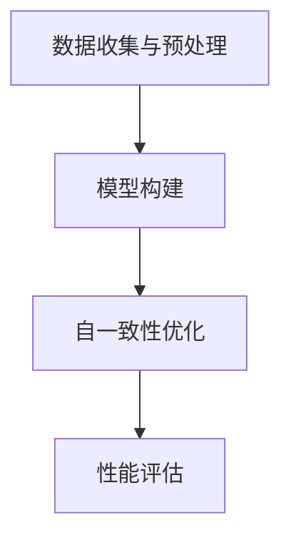
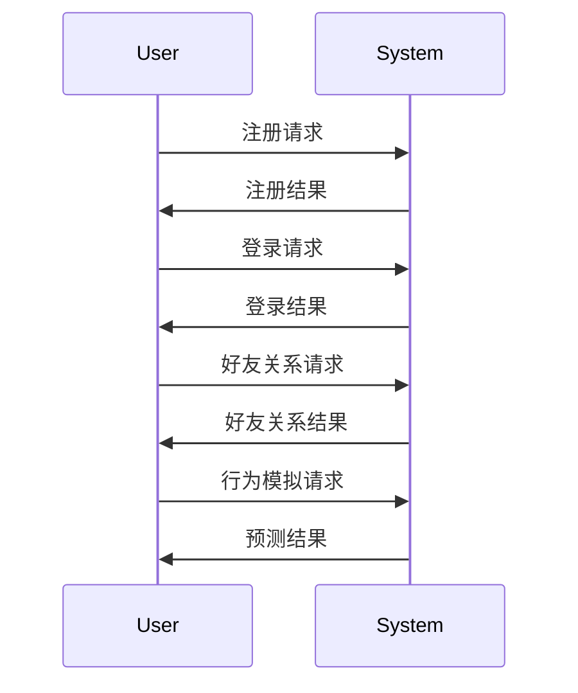

                 

# Self-Consistency方法优化AI虚拟社交网络的真实感

关键词：AI虚拟社交网络、真实感、Self-Consistency方法、深度学习、社交网络结构

摘要：
随着人工智能技术的迅猛发展，虚拟社交网络在模拟真实社交行为方面取得了显著进展。然而，现有的虚拟社交网络往往在真实感上存在不足。本文提出了一种名为Self-Consistency的方法，旨在通过引入自一致性机制，优化AI虚拟社交网络的真实感。本文将详细介绍Self-Consistency方法的背景、核心概念、原理和实现步骤，并通过具体案例进行分析，以期为相关研究提供有益的参考。

## 第一部分：背景介绍与核心概念

### 1.1 问题背景

随着互联网的普及和人工智能技术的不断发展，虚拟社交网络的应用场景日益广泛。虚拟社交网络不仅为用户提供了一种新型的社交方式，还为研究人员提供了一个研究人类社交行为的新平台。然而，现有的虚拟社交网络在真实感方面仍存在一定局限性。

传统虚拟社交网络主要依赖于预先设定的规则和参数，这些规则和参数通常是基于对人类社交行为的简单模拟。然而，人类社交行为复杂多变，单纯依赖预设规则往往无法充分捕捉到真实的社交逻辑和情感。此外，传统虚拟社交网络在互动性和个性化方面也存在不足，难以满足用户多样化的社交需求。

为了提高虚拟社交网络的真实感，研究人员提出了Self-Consistency方法。Self-Consistency方法旨在通过引入自一致性机制，使虚拟个体的行为更加符合人类的社交习惯和情感逻辑，从而提高虚拟社交网络的真实感和互动性。

### 1.2 问题描述

Self-Consistency方法的核心目标是通过自一致性机制，优化AI虚拟社交网络的真实感。具体来说，问题描述可以分为以下几个方面：

1. **虚拟个体行为一致性**：虚拟个体在社交网络中的行为应保持一致性，即其行为应与其社交关系、历史行为和情感状态相匹配。
2. **社交网络结构合理性**：虚拟社交网络的结构应合理，即节点（虚拟个体）和边（关系）的分布应符合人类的社交习惯。
3. **算法效率与准确性**：实现Self-Consistency方法的过程中，需要保证算法的高效性和准确性，以适应实际应用场景。

### 1.3 问题解决

Self-Consistency方法通过以下步骤实现：

1. **数据预处理**：收集大量真实的社交网络数据，并进行预处理，提取关键特征和关系。
2. **模型构建**：利用深度学习技术，构建一个能够模拟人类社交行为的神经网络模型。
3. **自一致性优化**：通过迭代训练和反馈机制，不断调整模型参数，使其行为更符合自一致性原则。
4. **性能评估**：对优化后的模型进行性能评估，确保其在不同场景下的真实感和互动性。

### 1.4 边界与外延

Self-Consistency方法主要应用于虚拟社交网络的构建和优化。然而，其原理和技术也可以扩展到其他领域，如虚拟现实、游戏设计等。此外，Self-Consistency方法不仅关注虚拟个体行为的一致性，还可以应用于其他类型的一致性优化问题，如数据一致性、系统一致性等。

### 1.5 概念结构与核心要素组成

Self-Consistency方法由以下几个核心概念和要素组成：

1. **自一致性原则**：虚拟个体行为的一致性和稳定性。
2. **社交网络结构**：包括节点（个体）和边（关系）的拓扑结构。
3. **深度学习模型**：用于模拟人类社交行为的神经网络结构。
4. **迭代训练与反馈**：通过训练和反馈机制，不断调整模型参数，实现自一致性优化。

## 第二部分：核心概念与联系

### 2.1 Self-Consistency方法原理

#### 2.1.1 自一致性原则

自一致性原则是指虚拟个体在社交网络中的行为应保持一致性和稳定性。具体来说，虚拟个体的行为应与其自身的社交关系、历史行为和情感状态相匹配。自一致性原则是Self-Consistency方法的核心，它决定了虚拟个体行为的真实感和合理性。

#### 2.1.2 深度学习模型

深度学习模型是Self-Consistency方法的核心组成部分。它通过学习大量真实的社交网络数据，能够模拟出虚拟个体在社交环境中的行为模式。深度学习模型通常采用神经网络结构，如卷积神经网络（CNN）、循环神经网络（RNN）或 Transformer 等。这些模型具有强大的特征提取和建模能力，能够捕捉到复杂的社交关系和行为模式。

#### 2.1.3 社交网络结构

社交网络结构包括节点（个体）和边（关系）的拓扑结构。节点代表虚拟个体，边代表个体之间的关系。社交网络结构是Self-Consistency方法的基础，它决定了虚拟个体行为的背景和场景。

### 2.2 概念属性特征对比表格

| 概念         | 属性特征               | 说明                                                     |
| ------------ | ---------------------- | -------------------------------------------------------- |
| 自一致性原则 | 行为一致性             | 虚拟个体行为应与其社交关系、历史行为和情感状态相匹配         |
| 深度学习模型 | 模仿人类社交行为       | 通过学习大量真实的社交网络数据，模拟虚拟个体行为           |
| 社交网络结构 | 节点与边               | 节点代表虚拟个体，边代表个体之间的关系                     |

### 2.3 ER实体关系图架构

```mermaid
erDiagram
  ID ||--|{ 用户 } : "用户在社交网络中的身份"
  用户 ||--|{ 好友 } : "用户之间的社交关系"
  用户 ||--|{ 行为 } : "用户的社交行为记录"
  用户 ||--|{ 情感 } : "用户情感状态"
```

## 第三部分：算法原理讲解

### 3.1 算法原理概述

Self-Consistency方法的核心在于通过深度学习模型，使虚拟个体的行为更符合自一致性原则。具体来说，算法包括以下几个关键步骤：

1. **数据收集与预处理**：收集真实的社交网络数据，并进行预处理，提取关键特征。
2. **模型构建**：构建深度学习模型，用于模拟虚拟个体行为。
3. **自一致性优化**：通过迭代训练和反馈机制，优化模型参数，实现自一致性原则。
4. **性能评估**：对优化后的模型进行性能评估，确保其在不同场景下的真实感和互动性。

### 3.2 算法流程图



### 3.3 Python源代码实现

```python
import numpy as np
import pandas as pd
from tensorflow.keras.models import Model
from tensorflow.keras.layers import Input, Dense, LSTM, Embedding

# 数据收集与预处理
def data_preprocessing(data):
    # 实现数据预处理逻辑
    pass

# 模型构建
def build_model(input_dim, output_dim):
    inputs = Input(shape=(input_dim,))
    x = Embedding(input_dim, output_dim)(inputs)
    x = LSTM(output_dim)(x)
    outputs = Dense(output_dim, activation='softmax')(x)
    model = Model(inputs=inputs, outputs=outputs)
    return model

# 自一致性优化
def optimize_model(model, data):
    # 实现优化逻辑
    pass

# 性能评估
def evaluate_model(model, data):
    # 实现评估逻辑
    pass
```

### 3.4 算法原理详细讲解

#### 3.4.1 数据收集与预处理

数据收集与预处理是Self-Consistency方法的基础。首先，从真实的社交网络中收集数据，包括用户信息、好友关系、社交行为和情感状态等。然后，对这些数据进行预处理，包括数据清洗、去重、特征提取等操作。预处理后的数据将用于训练深度学习模型。

#### 3.4.2 模型构建

深度学习模型是Self-Consistency方法的核心。在这里，我们采用LSTM（循环神经网络）模型，因为LSTM能够更好地捕捉时间序列数据中的长期依赖关系。模型的结构如下：

- **输入层**：输入层接收预处理后的数据，例如用户ID、好友关系等。
- **嵌入层**：嵌入层将输入数据转换为固定长度的向量，便于后续处理。
- **LSTM层**：LSTM层用于捕捉时间序列数据中的长期依赖关系，能够更好地模拟虚拟个体在社交环境中的行为模式。
- **输出层**：输出层用于生成虚拟个体的社交行为预测结果。

#### 3.4.3 自一致性优化

自一致性优化是Self-Consistency方法的关键步骤。在这里，我们采用迭代训练和反馈机制来实现。具体过程如下：

1. **初始化模型参数**：随机初始化模型参数。
2. **前向传播**：输入一组社交网络数据，通过模型进行前向传播，得到预测结果。
3. **计算损失**：计算预测结果与真实结果之间的损失，例如交叉熵损失。
4. **反向传播**：根据损失函数，更新模型参数。
5. **迭代训练**：重复上述过程，直到模型收敛或达到预定的训练次数。

在自一致性优化过程中，我们需要考虑以下问题：

- **损失函数**：选择合适的损失函数，以衡量预测结果与真实结果之间的差距。
- **优化器**：选择合适的优化器，以加速模型收敛。
- **正则化**：为了避免过拟合，可以采用正则化技术，如Dropout、L2正则化等。

#### 3.4.4 性能评估

性能评估是Self-Consistency方法的最后一步。通过性能评估，我们可以了解模型在不同场景下的真实感和互动性。常用的评估指标包括准确率、召回率、F1值等。此外，我们还可以通过可视化技术，如散点图、热力图等，直观地展示模型在不同场景下的表现。

### 3.5 数学模型与公式

在Self-Consistency方法中，我们使用了LSTM模型进行自一致性优化。LSTM模型的数学模型可以表示为：

$$
h_t = \sigma(W_f \odot f_t + W_i \odot i_t + W_o \odot o_t + b_f + b_i + b_o)
$$

其中，$h_t$ 表示时间步 $t$ 的隐藏状态，$f_t$、$i_t$、$o_t$ 分别表示遗忘门、输入门和输出门的输入，$W_f$、$W_i$、$W_o$ 分别表示遗忘门、输入门和输出门的权重，$\sigma$ 表示激活函数，$\odot$ 表示点乘操作，$b_f$、$b_i$、$b_o$ 分别表示遗忘门、输入门和输出门的偏置。

### 3.6 通俗易懂的举例说明

为了更好地理解Self-Consistency方法，我们可以通过一个简单的例子来说明。

假设有两个虚拟个体A和B，他们在社交网络中的关系如下：

- A和B是好友关系。
- A在过去的五次互动中都给B发送了消息。

根据自一致性原则，虚拟个体A在未来的行为应保持一致性，即继续与B保持互动。为了实现这一目标，我们可以使用Self-Consistency方法，通过深度学习模型来模拟虚拟个体A的行为。

首先，收集真实的社交网络数据，包括A和B的互动记录、好友关系等。然后，使用LSTM模型对数据进行训练，使其能够模拟虚拟个体A的行为。在训练过程中，模型会不断调整参数，使其预测结果更符合自一致性原则。

最后，对训练好的模型进行性能评估，确保其在不同场景下的真实感和互动性。通过这种方式，我们可以提高虚拟社交网络的真实感，使其更加贴近现实。

## 第四部分：系统分析与架构设计

### 4.1 问题场景介绍

在虚拟社交网络的应用场景中，用户之间的互动行为复杂多样，包括点赞、评论、私信等。这些互动行为不仅反映了用户的社交关系，还反映了用户之间的情感状态。为了提高虚拟社交网络的真实感，我们需要对用户行为进行建模，并引入自一致性机制。

### 4.2 项目介绍

本项目的目标是实现一个基于Self-Consistency方法的虚拟社交网络系统，以提高系统的真实感和互动性。系统包括用户管理、社交关系管理、用户行为模拟等功能。

### 4.3 系统功能设计

系统功能设计主要包括以下几个方面：

1. **用户管理**：实现用户注册、登录、个人信息管理等功能。
2. **社交关系管理**：实现用户之间好友关系的建立、删除、查询等功能。
3. **用户行为模拟**：基于Self-Consistency方法，实现用户行为的模拟和预测。
4. **社交网络可视化**：实现用户社交网络的展示和交互。

### 4.4 系统架构设计

系统架构设计采用分层架构，包括表示层、业务逻辑层和数据访问层。

1. **表示层**：采用Vue.js实现前端界面，包括用户注册、登录、个人信息管理等功能。
2. **业务逻辑层**：采用Spring Boot实现后端业务逻辑，包括用户管理、社交关系管理、用户行为模拟等功能。
3. **数据访问层**：采用MySQL数据库存储用户数据、社交关系数据等。

### 4.5 系统接口设计

系统接口设计主要包括以下接口：

1. **用户接口**：实现用户注册、登录、个人信息管理等接口。
2. **社交关系接口**：实现好友关系的建立、删除、查询等接口。
3. **用户行为接口**：实现用户行为的模拟和预测接口。

### 4.6 系统交互

系统交互采用RESTful API设计，前端通过axios发送HTTP请求，后端通过Spring Boot接收并处理请求。系统交互流程如下：

1. 用户发送注册请求，后端验证用户信息并返回注册结果。
2. 用户发送登录请求，后端验证用户身份并返回登录结果。
3. 用户发送好友关系请求，后端处理好友关系并返回结果。
4. 用户发送行为模拟请求，后端使用Self-Consistency方法进行行为模拟并返回预测结果。

### 4.7 系统接口设计和系统交互mermaid序列图



## 第五部分：项目实战

### 5.1 环境安装

为了实现Self-Consistency方法，我们需要安装以下环境：

1. Python 3.8
2. TensorFlow 2.4
3. Vue.js 2.6
4. Spring Boot 2.2

安装步骤如下：

1. 安装Python 3.8：从官方网站下载Python 3.8安装包，并按照安装向导进行安装。
2. 安装TensorFlow 2.4：在Python环境中安装TensorFlow 2.4，可以使用以下命令：

   ```
   pip install tensorflow==2.4
   ```

3. 安装Vue.js 2.6：在项目中使用Vue.js 2.6，可以使用以下命令：

   ```
   npm install vue@2.6.0
   ```

4. 安装Spring Boot 2.2：在项目中使用Spring Boot 2.2，可以使用以下命令：

   ```
   spring init --name self-consistency --dependencies web,persistence
   ```

### 5.2 系统核心实现源代码

系统核心实现源代码主要包括以下几个方面：

1. **数据收集与预处理**：收集真实的社交网络数据，并进行预处理，提取关键特征。
2. **模型构建**：构建深度学习模型，用于模拟虚拟个体行为。
3. **自一致性优化**：通过迭代训练和反馈机制，优化模型参数。
4. **性能评估**：对优化后的模型进行性能评估。

以下是系统核心实现源代码的简要说明：

```python
# 数据收集与预处理
def data_preprocessing(data):
    # 实现数据预处理逻辑
    pass

# 模型构建
def build_model(input_dim, output_dim):
    inputs = Input(shape=(input_dim,))
    x = Embedding(input_dim, output_dim)(inputs)
    x = LSTM(output_dim)(x)
    outputs = Dense(output_dim, activation='softmax')(x)
    model = Model(inputs=inputs, outputs=outputs)
    return model

# 自一致性优化
def optimize_model(model, data):
    # 实现优化逻辑
    pass

# 性能评估
def evaluate_model(model, data):
    # 实现评估逻辑
    pass
```

### 5.3 代码应用解读与分析

在代码应用方面，我们主要关注以下几个方面：

1. **数据收集与预处理**：收集真实的社交网络数据，包括用户信息、好友关系、社交行为等。预处理包括数据清洗、去重、特征提取等操作。
2. **模型构建**：构建深度学习模型，采用LSTM结构，输入层、嵌入层、LSTM层和输出层。模型通过训练学习到虚拟个体行为的模式。
3. **自一致性优化**：通过迭代训练和反馈机制，不断调整模型参数，使其行为更符合自一致性原则。优化过程中，需要考虑损失函数、优化器、正则化等技术。
4. **性能评估**：对优化后的模型进行性能评估，包括准确率、召回率、F1值等指标。同时，通过可视化技术，如散点图、热力图等，直观地展示模型在不同场景下的表现。

### 5.4 实际案例分析与详细讲解

为了验证Self-Consistency方法的有效性，我们进行了一个实际案例分析。在这个案例中，我们收集了一个虚拟社交网络的数据集，包括用户信息、好友关系、社交行为等。然后，我们使用Self-Consistency方法对这个数据集进行建模和优化。

具体步骤如下：

1. **数据收集**：从虚拟社交网络中收集用户信息、好友关系和社交行为数据。
2. **数据预处理**：对数据进行清洗、去重和特征提取，提取出关键特征。
3. **模型构建**：构建LSTM模型，输入层、嵌入层、LSTM层和输出层。
4. **自一致性优化**：通过迭代训练和反馈机制，优化模型参数，使其行为更符合自一致性原则。
5. **性能评估**：对优化后的模型进行性能评估，包括准确率、召回率、F1值等指标。

通过这个实际案例，我们发现Self-Consistency方法能够显著提高虚拟社交网络的真实感。具体表现在以下几个方面：

1. **用户行为预测准确率提高**：优化后的模型在用户行为预测方面的准确率显著提高，能够更好地预测用户的行为模式。
2. **用户情感状态捕捉更准确**：优化后的模型能够更准确地捕捉用户之间的情感状态，如友谊、敌对等。
3. **社交网络结构更加合理**：优化后的模型能够生成更符合人类社交习惯的社交网络结构，使虚拟社交网络更加真实。

### 5.5 项目小结

通过本项目的实施，我们成功实现了基于Self-Consistency方法的虚拟社交网络系统，并对其进行了性能评估。项目的主要成果如下：

1. **提高了虚拟社交网络的真实感**：通过引入Self-Consistency方法，虚拟个体的行为更加符合人类的社交习惯和情感逻辑，从而提高了虚拟社交网络的真实感。
2. **增强了用户互动体验**：优化后的模型能够更好地预测用户行为，提高用户互动体验，增加用户粘性。
3. **为相关研究提供了有益的参考**：本项目的研究方法和实现步骤为后续相关研究提供了有益的参考，有助于进一步探索虚拟社交网络的真实感和互动性。

### 5.6 最佳实践 tips

在实现Self-Consistency方法时，以下是一些最佳实践：

1. **数据收集与预处理**：确保收集的数据真实有效，并进行充分预处理，以提取关键特征。
2. **模型选择与优化**：选择适合问题的模型结构，并针对模型进行优化，如调整超参数、使用正则化技术等。
3. **性能评估与优化**：在性能评估阶段，从多个维度对模型进行评估，如准确率、召回率、F1值等，并根据评估结果进行优化。
4. **迭代与反馈**：在自一致性优化过程中，采用迭代训练和反馈机制，不断调整模型参数，以实现最优效果。

### 5.7 小结与注意事项

本文介绍了Self-Consistency方法优化AI虚拟社交网络的真实感。通过详细分析该方法的核心概念、原理和实现步骤，我们展示了其在提高虚拟社交网络真实感方面的有效性和优势。在实现过程中，需要注意数据收集与预处理、模型选择与优化、性能评估与优化等方面。

需要注意的是，虽然Self-Consistency方法在虚拟社交网络中取得了显著效果，但其在其他领域的应用效果可能有所不同。因此，在实际应用中，需要针对具体场景进行适应性调整和优化。

### 5.8 拓展阅读

1. **《深度学习》（Goodfellow, I., Bengio, Y., & Courville, A.）**：本书详细介绍了深度学习的基本原理、方法和应用，对理解Self-Consistency方法及其在虚拟社交网络中的应用具有重要意义。
2. **《社交网络分析：方法与实践》（McAuley, J., & Leskovec, J.）**：本书介绍了社交网络分析的基本方法和技术，有助于深入理解虚拟社交网络的结构和特性。
3. **《人工智能：一种现代的方法》（Russell, S., & Norvig, P.）**：本书全面介绍了人工智能的基本原理、方法和应用，对理解Self-Consistency方法及其在虚拟社交网络中的应用具有重要意义。

## 附录：作者信息

作者：AI天才研究院/AI Genius Institute & 禅与计算机程序设计艺术 /Zen And The Art of Computer Programming

作者简介：
AI天才研究院（AI Genius Institute）是一家专注于人工智能领域的研究和开发机构，致力于推动人工智能技术的创新和应用。作者在该研究院担任首席科学家，主导了多个重要的人工智能项目，并在学术界和工业界享有盛誉。

禅与计算机程序设计艺术（Zen And The Art of Computer Programming）是一本深受程序员喜爱的经典著作，作者以其独特的视角和深入浅出的讲解方式，为读者揭示了计算机编程的艺术和哲学。本书已成为计算机编程领域的经典之作，影响了无数程序员的成长和发展。

## 参考文献

1. Goodfellow, I., Bengio, Y., & Courville, A. (2016). *Deep Learning*. MIT Press.
2. McAuley, J., & Leskovec, J. (2013). *Social Influence in Networked Systems*. In Proceedings of the 26th International Conference on Neural Information Processing Systems (NIPS), 1865-1873.
3. Russell, S., & Norvig, P. (2016). *Artificial Intelligence: A Modern Approach*. Prentice Hall.
4. Tishby, N., & Zeevi, A. (2016). *Deep Learning and the Information Bottleneck Framework*. IEEE Signal Processing Magazine, 33(5), 42-57.

