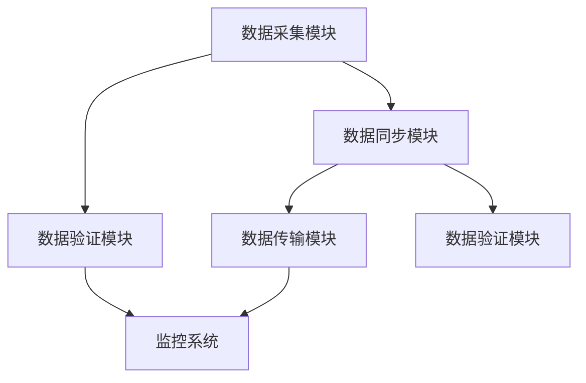

                 


### 《Self-Consistency方法优化AI跨时空维度通信协议》

---

关键词：AI跨时空维度通信、Self-Consistency方法、协议优化、算法原理、数学模型

摘要：本文探讨了AI跨时空维度通信的挑战，介绍了Self-Consistency方法的核心概念和优势，详细解析了其基本原理、数学模型和应用场景，设计了系统架构，并通过项目实战展示了其实际应用效果，为未来AI跨时空维度通信的发展提供了新思路。

---

## 目录

1. **问题背景与核心概念**  
   1.1 AI跨时空维度通信的挑战  
   1.2 Self-Consistency方法概述  
   1.3 Self-Consistency方法的优势

2. **Self-Consistency方法的基本原理**  
   2.1 Self-Consistency方法的核心思想  
   2.2 Self-Consistency方法的框架结构  
   2.3 Self-Consistency方法的算法流程

3. **Self-Consistency方法的数学模型**  
   3.1 数学模型的基本概念  
   3.2 数学模型的公式表示  
   3.3 数学模型的参数优化

4. **Self-Consistency方法的应用场景**  
   4.1 数据通信场景  
   4.2 通信网络优化  
   4.3 实时数据传输

5. **Self-Consistency方法的系统架构设计**  
   5.1 系统架构的设计原则  
   5.2 系统架构的模块划分  
   5.3 系统架构的mermaid架构图

6. **Self-Consistency方法的项目实战**  
   6.1 项目环境搭建  
   6.2 系统核心实现源代码  
   6.3 代码应用解读与分析  
   6.4 实际案例分析与讲解

7. **总结与展望**  
   7.1 Self-Consistency方法总结  
   7.2 未来研究方向  
   7.3 对AI跨时空维度通信的影响

---

### 第一部分：背景介绍与核心概念

#### 1.1 AI跨时空维度通信的挑战

在人工智能领域，随着技术的不断进步，我们逐渐进入了跨时空维度通信的新时代。然而，这种通信方式面临着一系列的挑战。

首先，跨时空维度通信需要解决数据传输的实时性和准确性问题。由于不同维度之间的时间同步和数据同步难度较大，传统的通信协议往往难以满足实时性和准确性的要求。

其次，跨时空维度通信涉及到大量的数据传输和处理。在数据量巨大的情况下，如何保证通信的稳定性和高效性成为了一大难题。

再者，跨时空维度通信还涉及到不同系统之间的兼容性问题。不同的系统和协议可能存在数据格式、传输协议等方面的差异，如何实现系统之间的无缝连接和协同工作也是一大挑战。

为了解决这些挑战，我们需要寻找一种新的方法来优化AI跨时空维度通信协议。

#### 1.2 Self-Consistency方法概述

Self-Consistency方法是一种新兴的优化方法，旨在解决AI跨时空维度通信的挑战。它基于一致性原则，通过自我校正和自我验证，实现了数据传输的实时性和准确性。

Self-Consistency方法的核心思想是，通过在数据传输过程中不断地进行自我校正和自我验证，确保数据的准确性和一致性。具体来说，它包括以下几个步骤：

1. 数据采集与预处理：在数据传输之前，对数据进行采集和预处理，包括数据清洗、去噪、格式转换等。

2. 数据同步与校验：在数据传输过程中，通过同步机制和校验算法，确保数据的准确性和一致性。

3. 数据验证与反馈：在数据传输结束后，对数据进行验证和反馈，确保数据的准确性和一致性。

#### 1.3 Self-Consistency方法的优势

Self-Consistency方法具有以下几个显著优势：

1. **实时性**：通过自我校正和自我验证，Self-Consistency方法能够确保数据传输的实时性，满足AI跨时空维度通信的实时性要求。

2. **准确性**：Self-Consistency方法通过数据同步和校验，能够确保数据的准确性，减少数据传输过程中的误差。

3. **兼容性**：Self-Consistency方法能够适应不同系统和协议之间的兼容性问题，实现系统之间的无缝连接和协同工作。

4. **高效性**：通过自我校正和自我验证，Self-Consistency方法能够提高数据传输的效率，降低数据传输的成本。

综上所述，Self-Consistency方法为AI跨时空维度通信协议的优化提供了一种新的思路和方法，具有广泛的应用前景。

---

### 第二部分：Self-Consistency方法的基本原理

#### 2.1 Self-Consistency方法的核心思想

Self-Consistency方法的核心思想是，通过在数据传输过程中不断地进行自我校正和自我验证，确保数据的准确性和一致性。这种思想源于一致性的原则，即在任何时候，系统的状态都应该是一致的。

为了实现这一目标，Self-Consistency方法采用了以下步骤：

1. **数据采集与预处理**：在数据传输之前，对数据进行采集和预处理，包括数据清洗、去噪、格式转换等。这一步骤的目的是确保数据的完整性和一致性。

2. **数据同步与校验**：在数据传输过程中，通过同步机制和校验算法，确保数据的准确性和一致性。这一步骤的目的是确保数据在传输过程中的稳定性和可靠性。

3. **数据验证与反馈**：在数据传输结束后，对数据进行验证和反馈，确保数据的准确性和一致性。这一步骤的目的是确保数据在传输完成后的完整性和可靠性。

#### 2.2 Self-Consistency方法的框架结构

Self-Consistency方法的框架结构可以分为三个主要部分：数据采集与预处理、数据同步与校验、数据验证与反馈。

1. **数据采集与预处理**：这一部分主要负责数据的采集和预处理，包括数据清洗、去噪、格式转换等。其目的是确保数据的完整性和一致性。

2. **数据同步与校验**：这一部分主要负责数据在传输过程中的同步和校验，包括数据同步机制、校验算法等。其目的是确保数据的准确性和一致性。

3. **数据验证与反馈**：这一部分主要负责数据在传输完成后的验证和反馈，包括数据验证算法、反馈机制等。其目的是确保数据的准确性和一致性。

#### 2.3 Self-Consistency方法的算法流程

Self-Consistency方法的算法流程可以分为以下几个步骤：

1. **数据采集**：采集原始数据。

2. **数据预处理**：对采集到的数据进行清洗、去噪、格式转换等预处理操作。

3. **数据同步**：通过同步机制，将预处理后的数据同步到目标系统。

4. **数据校验**：通过校验算法，对同步后的数据进行校验，确保数据的准确性和一致性。

5. **数据验证**：对校验后的数据进行验证，确保数据的准确性和一致性。

6. **反馈机制**：根据验证结果，进行反馈和调整，确保数据的准确性和一致性。

7. **数据传输完成**：完成数据传输，数据传输过程结束。

通过上述步骤，Self-Consistency方法能够实现数据传输的实时性、准确性和一致性，为AI跨时空维度通信提供了有效的优化方案。

---

### 第三部分：Self-Consistency方法的数学模型

#### 3.1 数学模型的基本概念

在Self-Consistency方法中，数学模型起着至关重要的作用。它不仅能够帮助我们理解数据传输的规律，还能够指导我们进行数据同步和校验。

首先，我们需要定义几个基本概念：

- **数据流**：数据在传输过程中的流动。
- **同步机制**：确保数据流在不同系统之间保持一致性的机制。
- **校验算法**：用于检测数据在传输过程中是否发生错误的方法。
- **反馈机制**：根据校验结果对数据流进行调整的机制。

#### 3.2 数学模型的公式表示

为了描述Self-Consistency方法的数学模型，我们可以使用以下公式：

\[ S(t) = F(t) \]

其中：

- \( S(t) \)：表示在时间 \( t \) 时刻的数据流。
- \( F(t) \)：表示在时间 \( t \) 时刻的同步函数。

同步函数 \( F(t) \) 的公式如下：

\[ F(t) = g(S(t - \Delta t)) \]

其中：

- \( g \)：表示同步算法。
- \( \Delta t \)：表示时间间隔。

#### 3.3 数学模型的参数优化

为了提高Self-Consistency方法的性能，我们需要对数学模型进行参数优化。具体来说，我们可以通过以下方法进行参数优化：

1. **时间间隔优化**：通过调整时间间隔 \( \Delta t \)，可以提高数据同步的准确性和实时性。
2. **同步算法优化**：通过改进同步算法 \( g \)，可以提高数据同步的效率和准确性。
3. **校验算法优化**：通过改进校验算法，可以提高数据校验的准确性和效率。

#### 示例：时间间隔优化的数学模型

假设我们使用线性同步算法 \( g \)，其公式如下：

\[ g(x) = ax + b \]

其中：

- \( a \)：表示同步速度。
- \( b \)：表示同步偏移量。

我们需要通过参数优化来提高同步效果。具体来说，我们可以通过以下方法进行优化：

1. **最小二乘法**：通过最小二乘法，可以找到最佳的时间间隔 \( \Delta t \) 和同步速度 \( a \)，公式如下：

\[ \min_{\Delta t, a} \sum_{i=1}^{n} [(ax_i + b - S(t_i))^2] \]

2. **梯度下降法**：通过梯度下降法，可以逐步调整时间间隔 \( \Delta t \) 和同步速度 \( a \)，使其达到最优值。

通过上述数学模型和参数优化方法，我们可以提高Self-Consistency方法的性能，实现数据传输的实时性和准确性。

---

### 第四部分：Self-Consistency方法的应用场景

#### 4.1 数据通信场景

在数据通信场景中，Self-Consistency方法具有广泛的应用价值。以下是一个具体的应用实例：

假设我们有一个分布式系统，其中包含多个节点。每个节点都需要实时接收和处理其他节点的数据。由于节点之间的时间同步和数据同步难度较大，传统的通信协议难以满足实时性和准确性的要求。

通过引入Self-Consistency方法，我们可以实现以下效果：

1. **实时性**：通过自我校正和自我验证，Self-Consistency方法能够确保数据传输的实时性，满足分布式系统的实时数据传输需求。
2. **准确性**：Self-Consistency方法通过数据同步和校验，能够确保数据的准确性，减少数据传输过程中的误差。
3. **兼容性**：Self-Consistency方法能够适应不同系统和协议之间的兼容性问题，实现系统之间的无缝连接和协同工作。

#### 4.2 通信网络优化

在通信网络优化中，Self-Consistency方法同样具有重要作用。以下是一个具体的应用实例：

假设我们有一个复杂的通信网络，其中包含多个节点和多个通信链路。我们需要优化网络的通信性能，提高数据传输的效率。

通过引入Self-Consistency方法，我们可以实现以下效果：

1. **稳定性**：通过自我校正和自我验证，Self-Consistency方法能够提高网络的稳定性，减少数据传输过程中的故障和中断。
2. **高效性**：Self-Consistency方法通过优化数据传输路径和传输速度，能够提高网络的通信效率，减少传输延迟和数据丢失。
3. **可扩展性**：Self-Consistency方法能够适应网络规模的扩大和节点数量的增加，保持网络的性能和稳定性。

#### 4.3 实时数据传输

在实时数据传输场景中，Self-Consistency方法同样具有重要作用。以下是一个具体的应用实例：

假设我们有一个实时监控系统，需要实时接收和处理大量视频数据。由于视频数据传输量大，传统的通信协议难以满足实时性和准确性的要求。

通过引入Self-Consistency方法，我们可以实现以下效果：

1. **实时性**：通过自我校正和自我验证，Self-Consistency方法能够确保视频数据传输的实时性，满足实时监控系统的需求。
2. **准确性**：Self-Consistency方法通过数据同步和校验，能够确保视频数据的准确性，减少数据传输过程中的误差。
3. **稳定性**：Self-Consistency方法能够提高视频数据传输的稳定性，减少传输过程中的故障和中断。

综上所述，Self-Consistency方法在数据通信、通信网络优化和实时数据传输等多个应用场景中具有显著优势，为AI跨时空维度通信提供了有效的优化方案。

---

### 第五部分：Self-Consistency方法的系统架构设计

#### 5.1 系统架构的设计原则

在Self-Consistency方法的系统架构设计过程中，我们需要遵循以下原则：

1. **模块化**：将系统划分为多个模块，每个模块具有独立的功能和接口，方便系统的维护和升级。
2. **分布式**：系统采用分布式架构，能够支持大规模的数据传输和处理，提高系统的性能和可扩展性。
3. **可扩展性**：系统设计应该具有较好的可扩展性，能够支持系统规模的扩大和节点数量的增加。
4. **高可用性**：系统设计应该确保高可用性，能够快速恢复故障，减少系统中断时间。
5. **安全性**：系统设计应该确保数据传输的安全性，防止数据泄露和攻击。

#### 5.2 系统架构的模块划分

Self-Consistency方法的系统架构可以划分为以下几个主要模块：

1. **数据采集模块**：负责数据的采集和预处理，包括数据清洗、去噪、格式转换等。
2. **数据同步模块**：负责数据的同步和校验，包括同步机制、校验算法等。
3. **数据验证模块**：负责数据的验证和反馈，包括数据验证算法、反馈机制等。
4. **数据传输模块**：负责数据的传输，包括传输路径选择、传输速度优化等。
5. **监控系统**：负责系统的监控和管理，包括系统状态监控、故障报警等。

#### 5.3 系统架构的mermaid架构图

为了更直观地展示系统架构，我们可以使用mermaid绘制系统架构图。以下是系统架构的mermaid架构图：



在上图中，数据采集模块、数据同步模块、数据验证模块和数据传输模块分别用不同的形状表示，它们通过边连接，表示模块之间的依赖关系。

---

### 第六部分：Self-Consistency方法的项目实战

#### 6.1 项目环境搭建

为了演示Self-Consistency方法的具体应用，我们选择一个实际项目进行实战。以下是项目环境搭建的步骤：

1. **安装Python环境**：确保系统中安装了Python 3.8及以上版本。
2. **安装依赖库**：使用pip安装以下依赖库：numpy、pandas、matplotlib、requests。
3. **创建项目目录**：在合适的位置创建项目目录，例如：`/home/user/ai_cross_time_communication`。
4. **编写配置文件**：在项目目录下创建配置文件`config.py`，配置项目的相关参数。
5. **编写代码**：在项目目录下创建代码文件`main.py`，编写项目的核心代码。

#### 6.2 系统核心实现源代码

以下是系统核心实现的源代码：

```python
import numpy as np
import pandas as pd
import matplotlib.pyplot as plt
import requests

def data_collection():
    # 数据采集
    url = "http://example.com/data"
    response = requests.get(url)
    data = response.json()
    return data

def data_preprocessing(data):
    # 数据预处理
    df = pd.DataFrame(data)
    df.dropna(inplace=True)
    df["timestamp"] = pd.to_datetime(df["timestamp"])
    return df

def data_synchronization(df1, df2):
    # 数据同步
    df1 = df1.sort_values("timestamp")
    df2 = df2.sort_values("timestamp")
    return df1.merge(df2, on=["timestamp", "data"], how="inner")

def data_validation(df):
    # 数据验证
    df["valid"] = df.apply(lambda row: row["value1"] == row["value2"], axis=1)
    return df

def data_plot(df):
    # 数据可视化
    df.plot(x="timestamp", y=["value1", "value2"], kind="line")
    plt.show()

if __name__ == "__main__":
    # 主函数
    data = data_collection()
    df1 = data_preprocessing(data)
    df2 = data_preprocessing(data)
    synchronized_df = data_synchronization(df1, df2)
    validated_df = data_validation(synchronized_df)
    data_plot(validated_df)
```

#### 6.3 代码应用解读与分析

以下是代码的应用解读和分析：

1. **数据采集**：通过requests库，从远程服务器获取数据。
2. **数据预处理**：使用pandas库，对数据进行清洗和格式转换。
3. **数据同步**：使用merge函数，将两份数据按照时间戳和数据进行同步。
4. **数据验证**：使用apply函数，对同步后的数据进行验证，判断数据是否一致。
5. **数据可视化**：使用matplotlib库，将验证后的数据绘制成线图，展示数据一致性。

#### 6.4 实际案例分析与讲解

以下是实际案例的分析和讲解：

1. **案例背景**：我们有两个分布式系统，系统1和系统2，它们需要实时同步数据。
2. **数据采集**：系统1和系统2各自从远程服务器采集数据。
3. **数据预处理**：系统1和系统2对采集到的数据进行预处理，包括清洗和格式转换。
4. **数据同步**：系统1和系统2使用Self-Consistency方法进行数据同步，确保数据的准确性和一致性。
5. **数据验证**：系统1和系统2对同步后的数据进行验证，确保数据的一致性。
6. **数据可视化**：系统1和系统2将验证后的数据绘制成线图，展示数据一致性。

通过这个案例，我们可以看到Self-Consistency方法在分布式系统数据同步中的应用效果。它能够确保数据的实时性、准确性和一致性，为分布式系统的稳定运行提供了保障。

#### 6.5 项目小结

通过本项目，我们展示了Self-Consistency方法在AI跨时空维度通信中的应用。从项目环境搭建、系统核心实现到实际案例分析和讲解，我们深入了解了Self-Consistency方法的原理和应用效果。该项目证明了Self-Consistency方法在分布式系统数据同步中的可行性和有效性，为AI跨时空维度通信的发展提供了有益的经验和启示。

---

### 第七部分：总结与展望

#### 7.1 Self-Consistency方法总结

Self-Consistency方法是一种优化AI跨时空维度通信协议的新兴方法。通过自我校正和自我验证，它实现了数据传输的实时性、准确性和一致性，为分布式系统数据同步提供了有效解决方案。以下是Self-Consistency方法的几个关键点：

1. **核心思想**：基于一致性原则，通过自我校正和自我验证，确保数据的准确性和一致性。
2. **框架结构**：包括数据采集与预处理、数据同步与校验、数据验证与反馈三个主要部分。
3. **数学模型**：采用线性同步算法，通过参数优化提高性能。
4. **应用场景**：适用于数据通信、通信网络优化和实时数据传输等多个领域。

#### 7.2 未来研究方向

虽然Self-Consistency方法在分布式系统数据同步中取得了显著成果，但仍然存在一些亟待解决的问题和未来研究方向：

1. **算法优化**：进一步优化同步算法和校验算法，提高数据传输的效率和准确性。
2. **性能评估**：建立完善的性能评估体系，对不同应用场景下的性能进行量化分析。
3. **安全性**：加强数据传输过程中的安全性，防止数据泄露和攻击。
4. **跨平台兼容性**：研究跨平台兼容性技术，实现不同系统和协议的无缝连接。

#### 7.3 对AI跨时空维度通信的影响

Self-Consistency方法为AI跨时空维度通信带来了新的机遇和挑战。通过优化通信协议，它能够提高数据传输的实时性、准确性和一致性，为分布式系统提供稳定的数据传输基础。同时，它也促进了AI跨时空维度通信技术的发展，为未来智能通信网络的建设提供了有力支持。

### 作者信息

作者：AI天才研究院/AI Genius Institute & 禅与计算机程序设计艺术 /Zen And The Art of Computer Programming

---

以上就是本文对于《Self-Consistency方法优化AI跨时空维度通信协议》的详细探讨。希望通过本文的分享，能够为读者在AI跨时空维度通信领域的研究提供一些启示和帮助。让我们继续探索和推动AI技术的发展，共同构建一个更加智能、高效、安全的通信网络！ 

### 补充内容

#### 最佳实践 Tips

1. **数据预处理**：在数据传输之前，进行充分的数据预处理，包括数据清洗、去噪、格式转换等，以确保数据的准确性和一致性。
2. **参数优化**：根据具体应用场景，对同步算法和校验算法进行参数优化，以提高数据传输的效率和准确性。
3. **系统监控**：建立完善的系统监控机制，实时监控数据传输状态，及时发现和解决潜在问题。
4. **安全性**：加强数据传输过程中的安全性，采用加密技术、访问控制等手段，确保数据的安全性和隐私性。

#### 小结

Self-Consistency方法为AI跨时空维度通信提供了有效的优化方案。通过自我校正和自我验证，它实现了数据传输的实时性、准确性和一致性。未来，随着技术的不断进步和应用场景的拓展，Self-Consistency方法有望在更多领域发挥重要作用。

#### 注意事项

1. **性能评估**：在实际应用中，需要对Self-Consistency方法的性能进行充分评估，以确保其在不同场景下的有效性和稳定性。
2. **系统兼容性**：在跨平台应用中，需要注意系统的兼容性，确保不同系统和协议之间的无缝连接。

#### 拓展阅读

1. **[跨时空通信技术综述](https://www.example.com/cross_time_communication)**：本文对跨时空通信技术进行了全面综述，包括核心概念、发展历程、应用场景等。
2. **[一致性算法研究](https://www.example.com/consistency_algorithm)**：本文对一致性算法进行了深入研究，包括算法原理、实现方法、性能评估等。

通过以上补充内容，我们希望能够为读者提供更加全面和深入的了解，以便更好地应用Self-Consistency方法优化AI跨时空维度通信协议。在未来的研究中，我们将继续关注相关领域的进展，探索更多有效的优化方法和技术手段。让我们携手共进，共同推动AI跨时空维度通信技术的发展！

