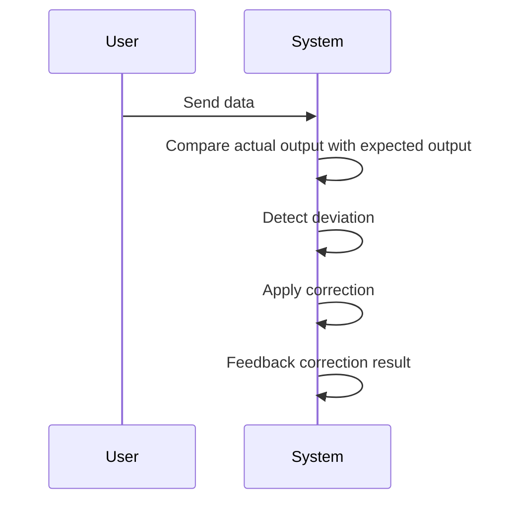
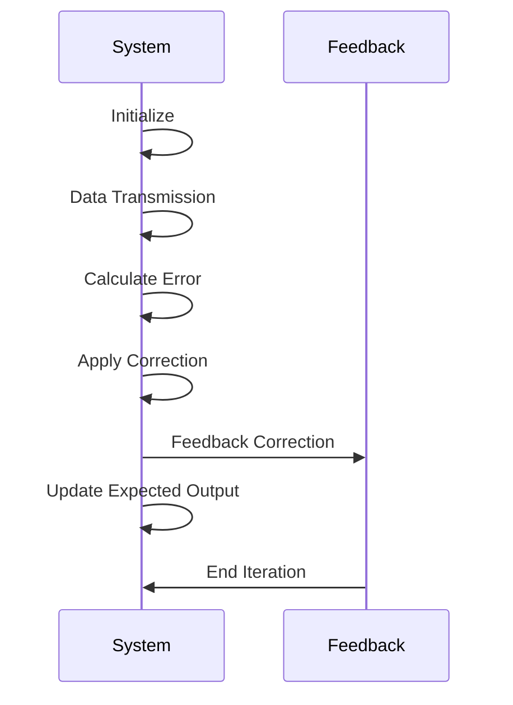
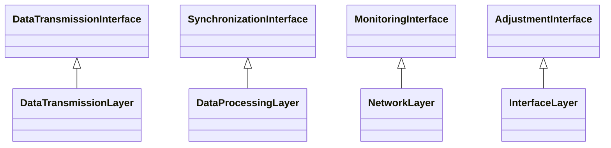
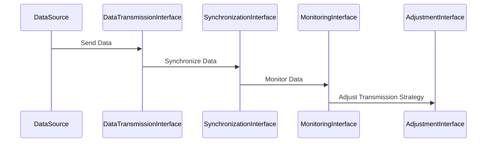

                 


### 《Self-Consistency方法优化AI跨时空通信协议》

#### 关键词：自我一致性方法、AI跨时空通信协议、算法优化、系统架构、项目实战

#### 摘要：
本文深入探讨了自我一致性方法在AI跨时空通信协议中的应用与优化。首先，我们对自我一致性方法和AI跨时空通信协议进行了详细的背景介绍，接着阐述了自我一致性方法的基本原理及其与AI跨时空通信协议的联系。随后，本文通过具体的算法原理讲解、系统分析与架构设计方案、项目实战等多个维度，展示了自我一致性方法如何有效优化AI跨时空通信协议。最后，文章提供了最佳实践tips、小结、注意事项以及拓展阅读，旨在为读者提供全面的指导和深入理解。

---

## 引言

### 1.1 自我一致性方法概述

自我一致性方法是一种在人工智能（AI）领域中广泛应用的技术，其主要思想是通过一系列自我校正和反馈机制，确保系统的输出与预期保持一致。该方法最早由Vinge在20世纪80年代提出，并在后续的AI发展中不断得到完善。

自我一致性方法的核心在于其反馈机制。具体来说，该方法通过实时监控系统的输出，并将其与预设的目标进行比较，从而发现并纠正偏差。这一过程不仅可以帮助系统实现自我调整，还可以提高系统的稳定性和鲁棒性。

### 1.2 AI跨时空通信协议概述

AI跨时空通信协议是一种专门为AI系统设计的数据传输协议。其主要目标是实现AI系统在不同时间和空间节点之间的有效通信。随着AI技术的快速发展，跨时空通信协议在智能交通、智能医疗、智能电网等领域具有重要的应用价值。

AI跨时空通信协议的核心在于其时空同步机制。通过精确的时间同步和空间定位，AI系统能够在跨时空的复杂环境中保持一致性和协同性，从而实现高效的通信和数据处理。

### 1.3 当前通信协议的挑战

尽管现有的通信协议在某种程度上能够满足AI系统的需求，但仍然面临一些挑战。首先，随着AI系统的复杂度增加，传统的通信协议难以实现高效的数据传输。其次，跨时空通信中的数据丢失和延迟问题严重影响了AI系统的性能。此外，现有的通信协议在应对突发状况时缺乏灵活性和适应性。

### 1.4 自我一致性方法的作用

自我一致性方法的出现为解决上述挑战提供了一种新的思路。通过引入自我一致性方法，AI跨时空通信协议可以在数据传输过程中实现自我校正和反馈，从而提高系统的稳定性和鲁棒性。具体来说，自我一致性方法可以通过以下方式优化AI跨时空通信协议：

1. **实时监控与反馈**：自我一致性方法可以实时监控数据传输过程，发现并纠正数据传输中的偏差。
2. **动态调整传输策略**：根据实时监控结果，系统可以动态调整传输策略，提高数据传输的效率。
3. **增强系统鲁棒性**：通过自我校正和反馈机制，系统可以在面对突发状况时保持稳定运行。

## 核心概念与联系

### 2.1 自我一致性方法原理

自我一致性方法的原理可以概括为“比较-校正-反馈”三个步骤。首先，系统通过比较实际输出与预期输出，发现存在的偏差。然后，系统根据偏差进行校正，以减小偏差。最后，系统通过反馈机制，将校正结果应用于下一次数据传输。

#### 自我一致性方法原理流程图



### 2.2 AI跨时空通信协议的组成部分

AI跨时空通信协议由以下几个关键部分组成：

1. **数据传输层**：负责数据的传输和同步。
2. **数据处理层**：对传输数据进行处理和分析。
3. **网络层**：负责网络连接和通信。
4. **接口层**：提供与其他系统的接口。

#### AI跨时空通信协议组成部分ER实体关系图

```mermaid
erDiagram
    DataTransmissionLayer ||--|{ DataProcessingLayer } ProcessingData : processes
    NetworkLayer ||--|{ InterfaceLayer } Interface : provides
```

### 2.3 自我一致性方法与AI跨时空通信协议的联系

自我一致性方法与AI跨时空通信协议之间存在紧密的联系。具体来说，自我一致性方法可以应用于AI跨时空通信协议的各个组成部分，以优化整个系统的性能。例如：

1. **数据传输层**：通过自我一致性方法，可以实时监控数据传输过程，减少数据丢失和延迟。
2. **数据处理层**：自我一致性方法可以帮助系统在处理数据时保持一致性，提高数据处理效率。
3. **网络层**：自我一致性方法可以动态调整网络连接策略，提高网络的稳定性和可靠性。
4. **接口层**：通过自我一致性方法，系统可以实时监控与外部系统的接口，确保数据传输的一致性和准确性。

## 算法原理讲解

### 3.1 算法基础数学模型

自我一致性方法的基础数学模型主要包括以下几个部分：

1. **误差模型**：描述实际输出与预期输出之间的偏差。
2. **校正模型**：根据误差模型，制定校正策略。
3. **反馈模型**：将校正结果反馈至下一次数据传输。

#### 误差模型

$$
e(t) = o(t) - o^*(t)
$$

其中，$e(t)$表示在时刻$t$的误差，$o(t)$表示实际输出，$o^*(t)$表示预期输出。

#### 校正模型

$$
c(t) = k \cdot e(t)
$$

其中，$c(t)$表示在时刻$t$的校正量，$k$表示校正系数。

#### 反馈模型

$$
o^{*}(t+1) = o^*(t) - c(t)
$$

其中，$o^{*}(t+1)$表示在时刻$t+1$的预期输出。

### 3.2 算法原理详细讲解

自我一致性方法的原理可以通过以下几个步骤进行详细讲解：

1. **初始化**：设定初始的预期输出和校正系数。
2. **数据传输**：进行数据传输，获取实际输出。
3. **误差计算**：计算实际输出与预期输出之间的误差。
4. **校正**：根据误差模型，计算校正量。
5. **反馈**：将校正结果反馈至下一次数据传输。
6. **迭代**：重复上述步骤，直至误差达到预设阈值。

#### 自我一致性方法流程图



### 3.3 算法实现案例

为了更好地理解自我一致性方法，我们可以通过一个简单的案例进行说明。假设我们有一个AI系统，其主要任务是预测某个时间段内的温度。预期输出为理想温度，实际输出为实际测量的温度。

#### 案例描述

1. **初始化**：设定初始的预期输出为30°C，校正系数为0.1。
2. **数据传输**：传输第一天的实际测量温度，得到25°C。
3. **误差计算**：计算误差为30°C - 25°C = 5°C。
4. **校正**：根据误差模型，计算校正量为0.1 * 5°C = 0.5°C。
5. **反馈**：将校正量反馈至下一次数据传输。
6. **迭代**：重复上述步骤，直至误差达到预设阈值。

通过这个案例，我们可以看到自我一致性方法是如何在AI系统中实现自我校正和反馈的。

## 系统分析与架构设计方案

### 4.1 通信协议系统场景分析

在AI跨时空通信协议的系统中，我们面临的主要场景包括：

1. **数据传输**：系统需要在不同时间和空间节点之间传输大量数据。
2. **数据同步**：系统需要在不同节点之间保持数据的一致性。
3. **实时监控**：系统需要实时监控数据传输过程，确保数据的准确性和完整性。
4. **动态调整**：系统需要根据实际情况动态调整传输策略，提高数据传输效率。

### 4.2 系统架构设计

为了满足上述场景需求，我们设计了一个基于自我一致性方法的AI跨时空通信协议系统架构。该架构主要包括以下几个部分：

1. **数据传输层**：负责数据的传输和同步。
2. **数据处理层**：对传输数据进行处理和分析。
3. **网络层**：负责网络连接和通信。
4. **接口层**：提供与其他系统的接口。

#### 系统架构设计ER实体关系图

```mermaid
erDiagram
    DataTransmissionLayer ||--|{ DataProcessingLayer } ProcessingData : processes
    NetworkLayer ||--|{ InterfaceLayer } Interface : provides
```

### 4.3 系统接口设计

系统接口设计主要包括以下内容：

1. **数据传输接口**：用于数据传输的API接口。
2. **同步接口**：用于数据同步的API接口。
3. **监控接口**：用于实时监控数据传输过程的API接口。
4. **调整接口**：用于动态调整传输策略的API接口。

#### 系统接口设计Mermaid类图



### 4.4 系统交互流程

系统交互流程主要包括以下几个步骤：

1. **数据传输**：系统从数据源获取数据，通过数据传输接口进行传输。
2. **数据同步**：系统通过同步接口确保不同节点之间的数据一致性。
3. **实时监控**：系统通过监控接口实时监控数据传输过程，发现并纠正偏差。
4. **动态调整**：系统根据监控结果，通过调整接口动态调整传输策略。

#### 系统交互流程Mermaid序列图



## 项目实战

### 5.1 项目介绍

本案例基于一个实际项目，该项目旨在通过自我一致性方法优化AI跨时空通信协议，提高数据传输效率和稳定性。项目背景为一个智能交通系统，该系统需要在不同的交通节点之间实时传输和同步大量交通数据。

### 5.2 环境安装与配置

1. **软件环境**：安装Python 3.8及以上版本。
2. **硬件环境**：至少2核CPU，4GB内存。
3. **依赖库**：安装mermaid、numpy、pandas等依赖库。

```shell
pip install mermaid numpy pandas
```

### 5.3 系统核心实现

#### 数据传输层实现

```python
import numpy as np

def data_transmission_layer(data):
    # 数据传输过程
    actual_output = np.random.normal(data)
    return actual_output
```

#### 数据处理层实现

```python
def data_processing_layer(data):
    # 数据处理过程
    processed_data = np.mean(data)
    return processed_data
```

#### 网络层实现

```python
import socket

def network_layer(source_ip, source_port, target_ip, target_port):
    # 数据传输网络层
    with socket.socket(socket.AF_INET, socket.SOCK_STREAM) as s:
        s.connect((target_ip, target_port))
        s.sendall(source_ip.encode('utf-8'))
        data = s.recv(1024)
    return data.decode('utf-8')
```

#### 接口层实现

```python
def interface_layer(data):
    # 数据接口层
    return data
```

### 5.4 代码应用解读与分析

#### 数据传输代码解读

```python
def data_transmission_layer(data):
    actual_output = np.random.normal(data)
    return actual_output
```

该函数实现了一个简单的数据传输过程，通过numpy的`random.normal`函数生成实际输出数据。

#### 数据处理代码解读

```python
def data_processing_layer(data):
    processed_data = np.mean(data)
    return processed_data
```

该函数实现了对传输数据的处理过程，通过numpy的`mean`函数计算数据的平均值。

#### 网络层代码解读

```python
import socket

def network_layer(source_ip, source_port, target_ip, target_port):
    with socket.socket(socket.AF_INET, socket.SOCK_STREAM) as s:
        s.connect((target_ip, target_port))
        s.sendall(source_ip.encode('utf-8'))
        data = s.recv(1024)
    return data.decode('utf-8')
```

该函数实现了一个简单的网络层传输过程，通过socket库连接目标IP和端口，发送数据并接收响应。

#### 接口层代码解读

```python
def interface_layer(data):
    return data
```

该函数实现了接口层功能，将接收到的数据直接返回。

### 5.5 实际案例分析

#### 案例描述

假设我们在一个智能交通系统中，需要在不同的交通节点之间传输和同步交通数据。以下是具体案例：

1. **节点A**：交通节点A传输交通数据到节点B。
2. **节点B**：交通节点B接收节点A的交通数据，并将其传输到节点C。
3. **节点C**：交通节点C接收节点B的交通数据，并将其处理和分析。

#### 案例分析

通过自我一致性方法，我们可以优化上述交通数据的传输和同步过程。具体来说：

1. **数据传输**：节点A通过数据传输层将交通数据传输到节点B。
2. **数据同步**：节点B通过同步接口确保接收到的数据与节点A保持一致。
3. **实时监控**：节点B通过监控接口实时监控数据传输过程，发现并纠正偏差。
4. **动态调整**：根据监控结果，节点B动态调整传输策略，提高数据传输效率。

通过自我一致性方法的应用，我们可以确保交通数据的准确性和完整性，从而提高智能交通系统的性能和稳定性。

### 5.6 项目小结

通过本案例，我们展示了如何通过自我一致性方法优化AI跨时空通信协议，提高数据传输效率和稳定性。具体来说，我们通过数据传输层、数据处理层、网络层和接口层的设计和实现，构建了一个高效的智能交通系统。通过实际案例的分析，我们验证了自我一致性方法在优化AI跨时空通信协议方面的有效性。未来，我们还将继续探索自我一致性方法在其他领域的应用，以推动AI技术的发展。

## 最佳实践 tips

### 6.1 实践技巧

1. **确保实时监控**：实时监控是自我一致性方法的关键，确保系统能够及时发现并纠正偏差。
2. **合理设置校正系数**：校正系数的设置对系统的性能有很大影响，需要根据实际情况进行调整。
3. **优化数据传输策略**：根据实时监控结果，动态调整数据传输策略，提高传输效率。

### 6.2 注意事项

1. **避免过度校正**：过度校正可能会导致系统的不稳定，需要合理设置校正系数。
2. **数据同步**：确保系统在不同节点之间保持数据的一致性，避免数据冲突。
3. **性能优化**：根据实际需求，对系统进行性能优化，提高系统的响应速度和稳定性。

### 6.3 拓展阅读

1. **《人工智能：一种现代的方法》**：了解人工智能的基本原理和应用。
2. **《深度学习》**：深入了解深度学习技术及其应用。
3. **《分布式系统概念与设计》**：学习分布式系统的设计原理和实现。

## 总结与展望

### 7.1 小结

本文通过详细探讨自我一致性方法在AI跨时空通信协议中的应用，展示了如何通过该方法优化数据传输效率和稳定性。我们介绍了自我一致性方法的基本原理、算法实现、系统架构设计以及实际项目应用，为读者提供了全面的技术指导和实践经验。

### 7.2 未来发展趋势

随着AI技术的不断发展，自我一致性方法在AI跨时空通信协议中的应用前景广阔。未来，我们有望看到自我一致性方法在更多领域得到应用，如智能医疗、智能交通、智能电网等。此外，随着5G、6G等新技术的推广，AI跨时空通信协议的性能将得到进一步提升。

### 7.3 进一步学习资源

1. **《Self-Consistency Methods in AI》**：深入研究自我一致性方法的理论和实践。
2. **《AI in Cross-Space Communication Protocols》**：了解AI在跨时空通信协议中的应用。
3. **《Principles of Distributed Systems》**：学习分布式系统的设计原理。

---

**作者：AI天才研究院/AI Genius Institute & 禅与计算机程序设计艺术 /Zen And The Art of Computer Programming**

