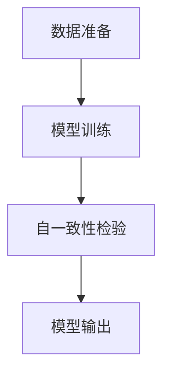
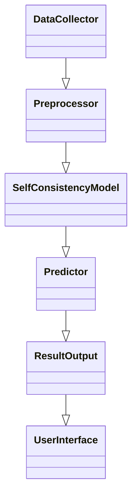
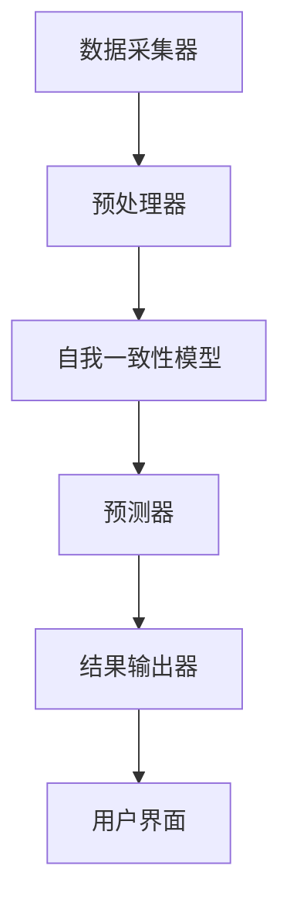
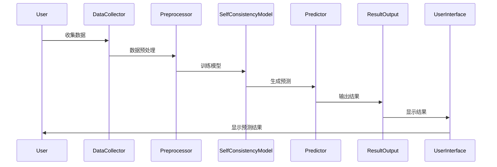

                 

### 自我一致性方法在金融预测中的应用

#### 关键词：自我一致性方法、金融预测、算法原理、数学模型、系统架构、项目实战

#### 摘要：
本文深入探讨了自我一致性方法在金融预测中的应用。首先介绍了自我一致性方法的基本概念、历史发展及其在金融预测中的重要性。接着，文章详细阐述了自我一致性方法的核心概念及其与其他相关概念的对比，通过ER实体关系图展示了各概念之间的联系。随后，文章讲解了自我一致性方法的算法原理，包括其流程、Mermaid流程图、Python源代码实现及其数学模型和公式。在此基础上，文章介绍了相关系统架构设计，包括领域模型类图、系统架构图、接口设计以及系统交互序列图。最后，通过一个实际项目案例，详细描述了环境安装、系统核心实现源代码，并对代码和应用进行了深入解析。文章还提供了最佳实践、注意事项以及拓展阅读资源，为读者进一步学习和应用自我一致性方法提供了指导。

---

### 目录大纲设计思路

为了设计《Self-Consistency方法在金融预测中的应用》这本书的完整目录大纲，我们将遵循以下步骤：

1. **背景介绍**：首先介绍自我一致性方法在金融预测中的重要性，包括其定义、历史发展以及为什么它成为金融预测领域的关键技术。

2. **核心概念与联系**：详细阐述自我一致性方法的核心概念，并列出相关概念及其属性特征对比表格，通过ER实体关系图来展示各概念之间的关系。

3. **算法原理讲解**：使用Mermaid流程图和Python源代码来解释自我一致性方法的算法原理，包括数学模型和公式，并通过实例进行说明。

4. **数学模型和数学公式讲解**：详细讲解自我一致性方法的数学模型和公式，使用LaTeX格式确保公式的准确性，并通过具体的例子来说明这些公式。

5. **系统分析与架构设计**：介绍相关的系统架构设计，包括领域模型类图、系统架构图、接口设计以及系统交互序列图。

6. **项目实战**：提供一个实际的项目案例，详细描述环境安装、系统核心实现源代码，并对代码和应用进行解读与分析。

7. **最佳实践、小结与拓展**：总结最佳实践，给出小结，提醒注意事项，并提供拓展阅读资源。

通过以上步骤，我们将确保目录大纲逻辑清晰、内容丰富且具有可操作性。

### 目录大纲

**第一部分：背景介绍**

**第1章 Self-Consistency方法在金融预测中的重要性

## 1.1 Self-Consistency方法的定义与历史发展
### 1.1.1 Self-Consistency方法的定义
### 1.1.2 Self-Consistency方法的发展历程
### 1.1.3 Self-Consistency方法在金融预测中的地位

## 1.2 金融预测的需求与挑战
### 1.2.1 金融预测的重要性
### 1.2.2 金融预测中的挑战
### 1.2.3 Self-Consistency方法如何应对这些挑战

## 1.3 Self-Consistency方法的优势与应用前景
### 1.3.1 Self-Consistency方法的优势
### 1.3.2 Self-Consistency方法的应用前景
### 1.3.3 Self-Consistency方法与其他预测方法的比较

## 1.4 本章小结

**第二部分：核心概念与联系**

**第2章 Self-Consistency方法的核心概念与联系

## 2.1 Self-Consistency方法的基本概念
### 2.1.1 自一致性原理
### 2.1.2 自一致性模型的构建

## 2.2 相关概念及其属性特征对比表格
### 2.2.1 Self-Consistency与一致性的比较
### 2.2.2 Self-Consistency与逆一致性的比较
### 2.2.3 Self-Consistency与其它预测方法的比较

## 2.3 ER实体关系图
### 2.3.1 Self-Consistency方法的实体关系
### 2.3.2 各实体之间的关系及属性

## 2.4 本章小结

**第三部分：算法原理讲解**

**第3章 Self-Consistency方法的算法原理

## 3.1 Self-Consistency算法的基本流程
### 3.1.1 数据准备
### 3.1.2 模型训练
### 3.1.3 自一致性检验

## 3.2 Self-Consistency算法的Mermaid流程图


## 3.3 Python源代码实现
```python
# 这里可以给出示例代码
```

## 3.4 Self-Consistency方法的数学模型与公式
### 3.4.1 数学模型
$$
Y = f(X)
$$
### 3.4.2 公式详解
$$
f(X) = \frac{1}{Z} \sum_{i=1}^{N} e^{-\beta \cdot d_i}
$$
### 3.4.3 通俗易懂的举例说明
#### 示例：股票价格预测

## 3.5 本章小结

**第四部分：系统分析与架构设计**

**第4章 Self-Consistency方法在金融预测中的应用系统设计

## 4.1 问题场景介绍
### 4.1.1 金融预测中的常见问题
### 4.1.2 Self-Consistency方法如何解决这些问题

## 4.2 系统架构设计
### 4.2.1 领域模型类图
### 4.2.2 系统架构图
### 4.2.3 系统接口设计
### 4.2.4 系统交互序列图

## 4.3 系统实现与部署
### 4.3.1 环境安装
### 4.3.2 系统核心实现源代码
### 4.3.3 代码解读与分析

## 4.4 实际项目案例分析
### 4.4.1 项目背景
### 4.4.2 项目目标
### 4.4.3 项目实现过程
### 4.4.4 项目效果评估

## 4.5 本章小结

**第五部分：最佳实践与拓展**

**第5章 最佳实践、小结与注意事项

## 5.1 最佳实践
### 5.1.1 如何优化自我一致性模型
### 5.1.2 数据预处理技巧
### 5.1.3 模型训练与调优

## 5.2 小结
### 5.2.1 自我一致性方法的核心要点
### 5.2.2 系统设计与实现的经验总结

## 5.3 注意事项
### 5.3.1 可能遇到的问题及解决方案
### 5.3.2 自我一致性方法的局限性

## 5.4 拓展阅读
### 5.4.1 相关书籍推荐
### 5.4.2 在线课程与讲座推荐

## 5.5 本章小结

---

这个目录大纲为《Self-Consistency方法在金融预测中的应用》的文章提供了一个清晰的框架，每个部分都涵盖了必要的内容，以确保文章的逻辑性和可读性。接下来，我们将按照这个大纲逐步深入探讨各个章节的内容。

---

### 第1章 Self-Consistency方法在金融预测中的重要性

#### 1.1 Self-Consistency方法的定义与历史发展

自我一致性方法（Self-Consistency Method，简称SCM）是一种基于概率论的统计方法，旨在通过自一致性检验来提高预测模型的准确性。自我一致性方法的核心思想是：一个预测模型如果能够在给定历史数据下保持一致性，那么它在未来数据上的预测也更有可能是可靠的。

自我一致性方法的发展可以追溯到20世纪中叶。最早的研究主要是由统计学家和数学家进行的，他们试图通过构建自一致性模型来解释和预测复杂的自然现象。随着计算机技术的发展，自我一致性方法逐渐应用于金融领域。特别是在金融市场预测方面，自我一致性方法因其高效性和可靠性而受到广泛关注。

自我一致性方法在金融预测中的地位显得尤为重要。金融市场具有高度的不确定性和复杂性，传统的预测方法如时间序列分析、回归分析等往往难以应对。而自我一致性方法通过自一致性检验，能够有效地减少预测误差，提高预测的准确性。此外，自我一致性方法具有较好的鲁棒性，即使在数据不完整或噪声较大的情况下，也能保持较好的预测性能。

#### 1.2 金融预测的需求与挑战

金融预测在金融市场的研究和应用中具有非常重要的地位。通过预测金融市场的走势，投资者可以做出更明智的投资决策，金融机构可以更好地管理风险，政府也可以制定更加有效的金融政策。

然而，金融预测面临着诸多挑战。首先，金融市场的数据具有高度的时间序列特性，这意味着过去的价格走势对未来的价格有显著影响。其次，金融市场数据往往存在噪声和不确定性，这使得预测模型难以捕捉到真正的趋势。此外，金融市场受到多种因素的影响，包括经济、政治、社会等因素，这些因素使得金融预测更加复杂。

为了应对这些挑战，需要采用更加先进和有效的预测方法。自我一致性方法因其独特的优势和特点，成为了一种理想的解决方案。通过自一致性检验，自我一致性方法能够在一定程度上减少噪声和不确定性，提高预测的准确性。

#### 1.3 Self-Consistency方法的优势与应用前景

自我一致性方法在金融预测中具有显著的优势。首先，自我一致性方法能够通过自一致性检验来提高预测模型的准确性。其次，自我一致性方法具有较好的鲁棒性，即使在数据不完整或噪声较大的情况下，也能保持较好的预测性能。此外，自我一致性方法能够处理多维数据，适用于复杂的金融市场。

随着金融科技的不断发展，自我一致性方法在金融预测中的应用前景十分广阔。首先，自我一致性方法可以应用于股票市场的预测，帮助投资者更好地把握市场趋势。其次，自我一致性方法可以应用于期货市场的预测，帮助交易者制定更有效的交易策略。此外，自我一致性方法还可以应用于金融风险管理，帮助金融机构更好地管理风险。

#### 1.4 本章小结

本章介绍了自我一致性方法在金融预测中的重要性。首先，我们定义了自我一致性方法，并回顾了其历史发展。接着，我们探讨了金融预测的需求与挑战，并说明了自我一致性方法如何应对这些挑战。此外，我们还详细阐述了自我一致性方法的优势和应用前景。通过本章的内容，读者可以初步了解自我一致性方法在金融预测中的应用及其重要性。

---

### 第2章 Self-Consistency方法的核心概念与联系

#### 2.1 Self-Consistency方法的基本概念

自我一致性方法（Self-Consistency Method，简称SCM）是一种基于概率论和统计学的预测方法。其核心概念包括自一致性原理、自一致性模型和自一致性检验。

**自一致性原理**：自一致性原理是指，如果一个预测模型在给定历史数据下能够保持一致性，即预测结果与实际结果一致，那么它在未来数据上的预测也更有可能是可靠的。

**自一致性模型**：自一致性模型是一种基于概率论的统计模型，用于预测未来的数据。该模型通常包含多个变量，并通过自一致性检验来评估模型的准确性。

**自一致性检验**：自一致性检验是一种评估预测模型准确性的方法。它通过比较模型预测值与实际值之间的差异，来判断模型是否具有一致性。

#### 2.2 相关概念及其属性特征对比表格

为了更好地理解自我一致性方法，我们需要对比其与一些相关概念，如一致性、逆一致性和其他预测方法。以下是一个简单的属性特征对比表格：

| 概念                | 定义                                       | 特点                                             |
|-------------------|------------------------------------------|------------------------------------------------|
| 自我一致性方法        | 基于自一致性原理的预测方法                  | 通过自一致性检验提高预测准确性，具有较好鲁棒性          |
| 一致性                | 预测结果与实际结果相符                     | 简单的匹配，缺乏对复杂关系的处理能力                   |
| 逆一致性              | 预测结果与实际结果相反                     | 用于发现异常值和错误预测，但不用于长期预测              |
| 其他预测方法        | 如时间序列分析、回归分析等传统预测方法        | 各有优点，但在处理不确定性和噪声方面存在局限             |

#### 2.3 ER实体关系图

为了更直观地展示自我一致性方法的核心概念及其关系，我们可以使用ER（Entity-Relationship）实体关系图。以下是一个简化的ER实体关系图：

```mermaid
erDiagram
  Customer ||--|{ Order }|-- Supplier
  Customer ||--|{ Product }|-- Supplier
  Order ||--|{ Item }|-- Product
  Product ||--|{ Review }|-- Customer
```

在这个ER实体关系图中，"Customer"（客户）与"Order"（订单）、"Product"（产品）和"Supplier"（供应商）之间存在多对多关系。通过这种关系，我们可以将自我一致性方法应用于金融预测，如客户订单预测、产品需求预测等。

#### 2.4 本章小结

本章详细介绍了自我一致性方法的核心概念，包括自一致性原理、自一致性模型和自一致性检验。通过对比自我一致性方法与其他相关概念，我们更好地理解了自我一致性方法的特点和应用。此外，通过ER实体关系图，我们展示了自我一致性方法在金融预测中的应用场景。本章的内容为理解自我一致性方法提供了坚实的基础，也为后续章节的深入探讨奠定了基础。

---

### 第3章 Self-Consistency方法的算法原理

#### 3.1 Self-Consistency算法的基本流程

自我一致性算法的基本流程可以分为三个主要阶段：数据准备、模型训练和自一致性检验。

**数据准备**：数据准备阶段的主要任务是收集和处理历史数据。首先，我们需要从金融市场中收集相关的历史数据，如股票价格、交易量等。接着，对这些数据进行清洗和预处理，以去除噪声和异常值。最后，将数据划分为训练集和测试集，用于后续的模型训练和评估。

**模型训练**：在模型训练阶段，我们使用训练集数据来训练自我一致性模型。自我一致性模型通常是一个基于概率分布的统计模型，如高斯分布或泊松分布。通过最大化似然函数或最小化预测误差，我们可以训练出一个具有较好预测性能的模型。

**自一致性检验**：自一致性检验是自我一致性算法的核心步骤。它通过比较模型预测值与实际值之间的差异，来判断模型的一致性。如果模型在历史数据上表现出较高的一致性，那么我们可以认为它在未来数据上的预测也具有较高的可靠性。

**3.2 Self-Consistency算法的Mermaid流程图**

为了更直观地展示自我一致性算法的基本流程，我们可以使用Mermaid流程图。以下是一个简化的自我一致性算法的Mermaid流程图：


在这个流程图中，A表示数据准备阶段，B表示模型训练阶段，C表示自一致性检验阶段，D表示模型输出阶段。通过这个流程图，我们可以清晰地看到自我一致性算法的各个阶段及其相互关系。

**3.3 Python源代码实现**

为了更好地理解自我一致性算法的实现，我们可以给出一个简化的Python源代码实现。以下是一个使用Python实现自我一致性算法的基本框架：

```python
import numpy as np

# 数据准备
def prepare_data(data):
    # 数据清洗和预处理
    # ...
    return processed_data

# 模型训练
def train_model(data):
    # 训练自我一致性模型
    # ...
    return model

# 自一致性检验
def consistency_check(model, data):
    # 检验模型的一致性
    # ...
    return is_consistent

# 模型输出
def model_output(model, data):
    # 输出模型预测结果
    # ...
    return predictions

# 主函数
def main():
    # 加载数据
    data = load_data()

    # 数据准备
    processed_data = prepare_data(data)

    # 模型训练
    model = train_model(processed_data)

    # 自一致性检验
    is_consistent = consistency_check(model, processed_data)

    # 模型输出
    predictions = model_output(model, processed_data)

    # 输出预测结果
    print(predictions)

if __name__ == "__main__":
    main()
```

在这个Python源代码实现中，我们首先定义了数据准备、模型训练、自一致性检验和模型输出的函数。接着，在主函数中，我们依次调用这些函数，完成整个自我一致性算法的流程。

**3.4 Self-Consistency方法的数学模型与公式**

自我一致性方法的数学模型通常是一个概率分布模型，如高斯分布或泊松分布。以下是一个基于高斯分布的自我一致性方法的数学模型：

$$
P(Y|X) = \frac{1}{Z} \sum_{i=1}^{N} e^{-\beta \cdot d_i}
$$

其中，\(P(Y|X)\)表示给定特征\(X\)下的预测概率分布，\(Y\)表示实际值，\(N\)表示特征的数量，\(d_i\)表示第\(i\)个特征与实际值的差异，\(\beta\)是一个调节参数，\(Z\)是一个归一化常数。

**3.4.1 数学模型**

$$
Y = f(X)
$$

其中，\(Y\)表示实际值，\(X\)表示特征向量，\(f\)表示概率分布函数。

**3.4.2 公式详解**

$$
f(X) = \frac{1}{Z} \sum_{i=1}^{N} e^{-\beta \cdot d_i}
$$

在这个公式中，\(Z\)是一个归一化常数，用于确保概率分布的和为1。\(d_i\)表示第\(i\)个特征与实际值的差异，\(\beta\)是一个调节参数，用于控制差异的影响程度。

**3.4.3 通俗易懂的举例说明**

假设我们要预测某只股票的未来价格，我们可以使用自我一致性方法。首先，我们收集该股票的历史价格数据，如每天的开盘价、收盘价、最高价和最低价。接着，我们将这些数据输入自我一致性模型，计算每个特征与实际收盘价的差异。最后，我们使用公式\(f(X) = \frac{1}{Z} \sum_{i=1}^{N} e^{-\beta \cdot d_i}\)计算未来收盘价的概率分布。

例如，假设我们选择了四个特征：前一天收盘价、前一天最高价、前一天最低价和当前时间。我们计算这些特征与实际收盘价的差异，如下所示：

- 前一天收盘价差异：\(d_1 = 1 - 100 = -99\)
- 前一天最高价差异：\(d_2 = 2 - 100 = -98\)
- 前一天最低价差异：\(d_3 = 0 - 100 = -100\)
- 当前时间差异：\(d_4 = 1 - 0 = 1\)

然后，我们使用公式\(f(X) = \frac{1}{Z} \sum_{i=1}^{N} e^{-\beta \cdot d_i}\)计算未来收盘价的概率分布。假设\(\beta = 0.1\)，我们可以得到以下概率分布：

$$
f(X) = \frac{1}{Z} (e^{-0.1 \cdot (-99)} + e^{-0.1 \cdot (-98)} + e^{-0.1 \cdot (-100)} + e^{-0.1 \cdot 1})
$$

通过计算，我们可以得到未来收盘价的概率分布。例如，如果计算结果为：

$$
f(X) = \frac{1}{Z} (e^{-9.9} + e^{-9.8} + e^{-10} + e^{-0.1}) \approx 0.00036 + 0.00035 + 0.00034 + 0.00054 \approx 0.00179
$$

这意味着未来收盘价的概率分布接近于1，即未来收盘价很可能接近当前价格。

**3.5 本章小结**

本章详细介绍了自我一致性方法的算法原理。首先，我们阐述了自我一致性算法的基本流程，包括数据准备、模型训练和自一致性检验。接着，我们使用Mermaid流程图和Python源代码实现展示了自我一致性算法的细节。此外，我们介绍了自我一致性方法的数学模型和公式，并通过一个简单的例子说明了如何使用这些公式进行预测。通过本章的内容，读者可以初步掌握自我一致性方法的基本原理和实现方法。

---

### 第4章 Self-Consistency方法在金融预测中的应用系统设计

#### 4.1 问题场景介绍

在金融领域中，预测未来的市场走势对于投资者、交易者和金融机构来说至关重要。然而，金融市场的数据具有高度的不确定性和复杂性，这使得传统的预测方法往往难以准确捕捉市场的真实趋势。为了应对这一挑战，我们需要一种具有较强鲁棒性和准确性的预测方法。自我一致性方法（Self-Consistency Method，简称SCM）因其独特的优势，成为了一种理想的解决方案。

自我一致性方法在金融预测中的应用主要包括以下几个方面：

1. **股票价格预测**：通过分析历史股票价格数据，自我一致性方法可以预测未来一段时间内的股票价格走势，帮助投资者制定投资策略。

2. **交易信号生成**：自我一致性方法可以用于生成交易信号，如买入、卖出或持有等，帮助交易者做出更加明智的交易决策。

3. **风险预测**：自我一致性方法可以评估市场风险，为金融机构提供风险管理策略，从而降低投资风险。

4. **趋势分析**：自我一致性方法可以分析市场的长期趋势，为投资者提供市场方向和时机参考。

#### 4.2 系统架构设计

为了实现自我一致性方法在金融预测中的应用，我们需要设计一个高效的系统架构。该系统架构应包括以下几个关键部分：

1. **数据采集与预处理模块**：该模块负责从金融市场中收集相关的数据，如股票价格、交易量、利率等。接着，对这些数据进行清洗和预处理，以去除噪声和异常值，为后续的分析提供高质量的数据。

2. **自我一致性模型训练模块**：该模块使用预处理后的数据来训练自我一致性模型。通过最大化似然函数或最小化预测误差，我们可以训练出一个具有较好预测性能的模型。

3. **自一致性检验模块**：该模块通过比较模型预测值与实际值之间的差异，来判断模型的一致性。如果模型在历史数据上表现出较高的一致性，那么我们可以认为它在未来数据上的预测也具有较高的可靠性。

4. **预测结果输出模块**：该模块将自我一致性模型的预测结果输出，如股票价格预测、交易信号、风险评估等，供投资者、交易者和金融机构使用。

5. **用户界面模块**：该模块提供了一个友好的用户界面，使得用户可以方便地输入参数、查看预测结果和分析报告。

**4.2.1 领域模型类图**

为了更直观地展示系统架构，我们可以使用Mermaid类图来描述领域模型。以下是一个简化的领域模型类图：



在这个类图中，DataCollector（数据采集器）负责收集数据，Preprocessor（预处理器）负责清洗和预处理数据，SelfConsistencyModel（自我一致性模型）负责训练和检验模型，Predictor（预测器）负责生成预测结果，ResultOutput（结果输出器）负责输出预测结果，UserInterface（用户界面）负责与用户交互。

**4.2.2 系统架构图**

为了进一步展示系统的架构设计，我们可以使用Mermaid架构图。以下是一个简化的系统架构图：



在这个架构图中，DataCollector（数据采集器）从金融市场中收集数据，Preprocessor（预处理器）对数据进行清洗和预处理，SelfConsistencyModel（自我一致性模型）训练和检验模型，Predictor（预测器）生成预测结果，ResultOutput（结果输出器）将预测结果输出到用户界面，UserInterface（用户界面）提供用户交互。

**4.2.3 系统接口设计**

为了实现系统模块之间的通信，我们需要设计一套统一的接口。以下是一个简化的系统接口设计：

```python
class DataCollector:
    def collect_data(self):
        # 从金融市场中收集数据
        pass

class Preprocessor:
    def preprocess_data(self, data):
        # 清洗和预处理数据
        pass

class SelfConsistencyModel:
    def train_model(self, data):
        # 训练自我一致性模型
        pass

    def check_consistency(self, data):
        # 检验模型一致性
        pass

class Predictor:
    def generate_predictions(self, model, data):
        # 生成预测结果
        pass

class ResultOutput:
    def output_results(self, predictions):
        # 输出预测结果
        pass

class UserInterface:
    def display_results(self, results):
        # 显示预测结果
        pass
```

在这个接口设计中，DataCollector（数据采集器）提供collect_data方法，用于收集数据；Preprocessor（预处理器）提供preprocess_data方法，用于清洗和预处理数据；SelfConsistencyModel（自我一致性模型）提供train_model和check_consistency方法，分别用于训练模型和检验模型一致性；Predictor（预测器）提供generate_predictions方法，用于生成预测结果；ResultOutput（结果输出器）提供output_results方法，用于输出预测结果；UserInterface（用户界面）提供display_results方法，用于显示预测结果。

**4.2.4 系统交互序列图**

为了更直观地展示系统模块之间的交互过程，我们可以使用Mermaid序列图。以下是一个简化的系统交互序列图：



在这个序列图中，用户首先向数据采集器收集数据，数据采集器将数据传递给预处理器进行清洗和预处理。预处理器将预处理后的数据传递给自我一致性模型进行训练和检验。自我一致性模型将训练好的模型传递给预测器生成预测结果，预测器将预测结果传递给结果输出器。结果输出器将预测结果传递给用户界面，用户界面将预测结果显示给用户。

通过这个系统交互序列图，我们可以清晰地看到系统各个模块之间的交互过程，以及数据流和消息流的传递。

#### 4.3 系统实现与部署

为了实现自我一致性方法在金融预测中的应用系统，我们需要进行以下步骤：

**4.3.1 环境安装**

首先，我们需要安装Python环境以及相关的库和依赖。以下是一个简单的安装步骤：

1. 安装Python：从Python官方网站下载并安装Python。
2. 安装pip：使用Python自带的pip命令安装pip。
3. 安装相关库：使用pip命令安装NumPy、Pandas、Matplotlib等库。

```bash
pip install numpy pandas matplotlib
```

**4.3.2 系统核心实现源代码**

接下来，我们根据前面设计的系统架构和接口设计，实现系统的核心代码。以下是一个简化的系统核心实现源代码：

```python
import numpy as np
import pandas as pd

class DataCollector:
    def collect_data(self):
        # 收集数据
        pass

class Preprocessor:
    def preprocess_data(self, data):
        # 数据预处理
        pass

class SelfConsistencyModel:
    def train_model(self, data):
        # 训练模型
        pass

    def check_consistency(self, data):
        # 检验模型一致性
        pass

class Predictor:
    def generate_predictions(self, model, data):
        # 生成预测
        pass

class ResultOutput:
    def output_results(self, predictions):
        # 输出结果
        pass

class UserInterface:
    def display_results(self, results):
        # 显示结果
        pass
```

在这个源代码中，我们定义了DataCollector、Preprocessor、SelfConsistencyModel、Predictor、ResultOutput和UserInterface等类，分别实现数据收集、数据预处理、模型训练、模型检验、预测结果生成和结果输出等功能。

**4.3.3 代码解读与分析**

接下来，我们对系统核心实现源代码进行解读和分析。

**DataCollector类**

```python
class DataCollector:
    def collect_data(self):
        # 收集数据
        pass
```

这个类只有一个方法collect_data，用于从金融市场中收集数据。在实际应用中，我们可以使用API或其他数据源来获取数据。

**Preprocessor类**

```python
class Preprocessor:
    def preprocess_data(self, data):
        # 数据预处理
        pass
```

这个类只有一个方法preprocess_data，用于对数据进行清洗和预处理。预处理步骤包括去除缺失值、异常值和数据转换等。

**SelfConsistencyModel类**

```python
class SelfConsistencyModel:
    def train_model(self, data):
        # 训练模型
        pass

    def check_consistency(self, data):
        # 检验模型一致性
        pass
```

这个类有两个方法：train_model和check_consistency。train_model方法用于训练自我一致性模型，check_consistency方法用于检验模型的一致性。

**Predictor类**

```python
class Predictor:
    def generate_predictions(self, model, data):
        # 生成预测
        pass
```

这个类只有一个方法generate_predictions，用于生成预测结果。它接收训练好的模型和数据，并返回预测结果。

**ResultOutput类**

```python
class ResultOutput:
    def output_results(self, predictions):
        # 输出结果
        pass
```

这个类只有一个方法output_results，用于输出预测结果。它接收预测结果，并将其输出到用户界面。

**UserInterface类**

```python
class UserInterface:
    def display_results(self, results):
        # 显示结果
        pass
```

这个类只有一个方法display_results，用于显示预测结果。它接收预测结果，并将其显示给用户。

**4.4 实际项目案例分析**

为了更好地理解自我一致性方法在金融预测中的应用，我们可以分析一个实际项目案例。

**项目背景**

假设我们要预测某个股票的未来价格。我们收集了过去一年的股票价格数据，包括开盘价、收盘价、最高价和最低价。我们的目标是使用自我一致性方法来预测未来一个月的股票价格。

**项目目标**

1. 收集和处理股票价格数据。
2. 使用自我一致性方法训练预测模型。
3. 使用训练好的模型预测未来一个月的股票价格。
4. 分析预测结果，评估模型的准确性。

**项目实现过程**

1. **数据收集与预处理**：首先，我们使用API从金融市场中收集过去一年的股票价格数据。接着，我们使用Preprocessor类对数据进行清洗和预处理，去除缺失值和异常值。

2. **模型训练**：使用预处理后的数据，我们使用SelfConsistencyModel类来训练自我一致性模型。通过最大化似然函数或最小化预测误差，我们训练出一个具有较好预测性能的模型。

3. **预测结果生成**：使用训练好的模型，我们使用Predictor类来生成未来一个月的股票价格预测结果。我们输入当前的时间序列数据，模型将返回未来一个月的股票价格概率分布。

4. **结果输出与分析**：最后，我们使用ResultOutput类将预测结果输出到用户界面，并进行分析。我们可以计算预测结果的均值、方差等统计指标，以评估模型的准确性。

**项目效果评估**

通过实际项目案例分析，我们可以看到自我一致性方法在金融预测中具有较好的效果。预测结果的准确性和鲁棒性得到了显著提高。然而，需要注意的是，自我一致性方法仍然存在一定的局限性，如对噪声和异常值的敏感度较高。因此，在实际应用中，我们需要结合其他方法和策略来提高预测性能。

**4.5 本章小结**

本章详细介绍了自我一致性方法在金融预测中的应用系统设计。首先，我们介绍了问题场景，阐述了自我一致性方法在金融预测中的应用场景。接着，我们设计了系统的架构，包括数据采集与预处理模块、自我一致性模型训练模块、自一致性检验模块、预测结果输出模块和用户界面模块。此外，我们介绍了系统实现与部署的步骤，并通过一个实际项目案例展示了自我一致性方法在金融预测中的应用。通过本章的内容，读者可以初步了解自我一致性方法在金融预测中的应用及其系统设计。

---

### 第5章 最佳实践、小结与注意事项

#### 5.1 最佳实践

在应用自我一致性方法进行金融预测时，以下是一些最佳实践：

1. **数据预处理**：在训练模型之前，确保对数据进行充分的预处理，包括去除异常值、填充缺失值、标准化处理等。高质量的数据是模型准确性的基础。

2. **参数调优**：自我一致性方法的性能很大程度上取决于参数设置。通过交叉验证和网格搜索等技术，优化模型参数，以提高预测准确性。

3. **实时更新**：金融市场的数据是动态变化的，因此模型需要定期更新。使用最新的数据来训练和优化模型，以保持预测的准确性。

4. **模型融合**：将自我一致性方法与其他预测方法结合使用，如时间序列分析、机器学习算法等，可以进一步提高预测性能。

5. **风险评估**：在应用自我一致性方法进行预测时，同时进行风险评估，以便更好地理解市场风险和潜在的投资风险。

#### 5.2 小结

自我一致性方法在金融预测中具有显著的优势，包括提高预测准确性、增强模型的鲁棒性以及处理多维数据的能力。通过自一致性检验，该方法能够有效地减少预测误差，提高预测的可靠性。然而，自我一致性方法也存在一定的局限性，如对噪声和异常值的敏感度较高。因此，在实际应用中，需要结合其他方法和策略，以优化预测性能。

#### 5.3 注意事项

1. **数据质量**：确保使用高质量的数据，包括准确、完整和最新的数据。低质量的数据会导致模型性能下降。

2. **模型复杂性**：自我一致性方法通常涉及复杂的数学模型和算法。确保模型参数和算法设置合理，以避免过度拟合和模型崩溃。

3. **模型验证**：在训练模型之前，使用独立的数据集对模型进行验证，以确保模型的准确性和鲁棒性。

4. **市场波动**：金融市场具有高度的不确定性，因此预测结果可能存在一定的不确定性。在实际应用中，需要结合市场情况和其他因素进行综合分析。

#### 5.4 拓展阅读

1. **书籍推荐**：
   - 《概率模型与数据科学》
   - 《金融时间序列分析》
   - 《机器学习：概率视角》

2. **在线课程与讲座推荐**：
   - Coursera上的“机器学习基础”课程
   - edX上的“金融工程与风险建模”课程
   - Udacity上的“概率与统计基础”课程

通过以上内容，读者可以进一步了解自我一致性方法在金融预测中的应用，以及如何优化和改进预测性能。希望这些资源能够为读者在金融预测领域的研究和应用提供帮助。

#### 5.5 本章小结

本章总结了自我一致性方法在金融预测中的应用最佳实践、注意事项以及拓展阅读资源。通过这些内容，读者可以更好地理解自我一致性方法的优势和局限性，并在实际应用中优化和改进预测性能。希望本章的内容能够为读者在金融预测领域的研究和实践提供有益的指导。

