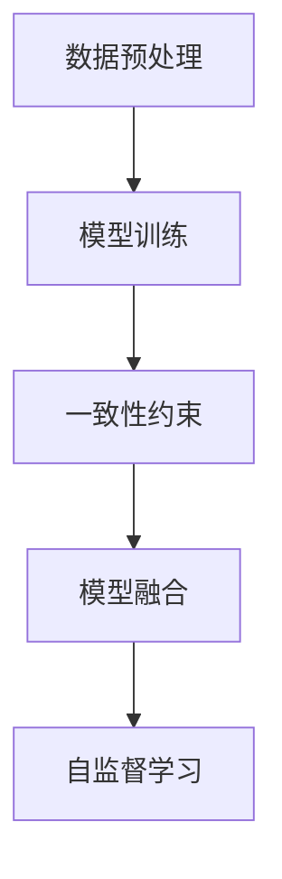
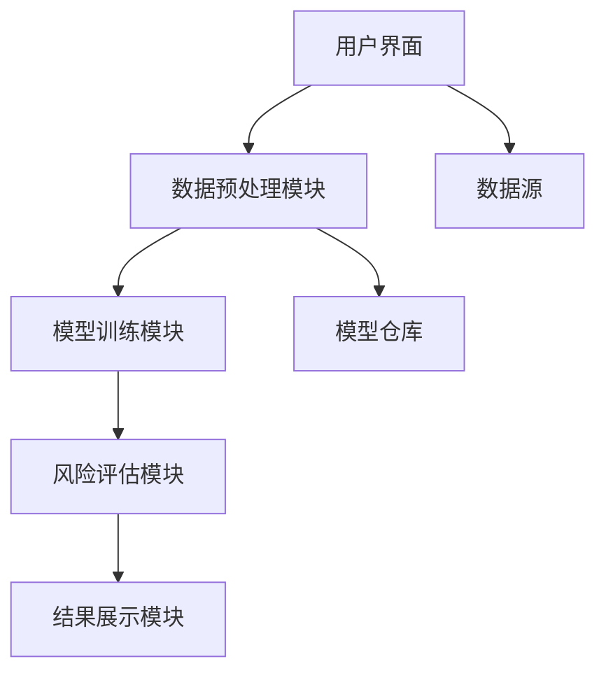
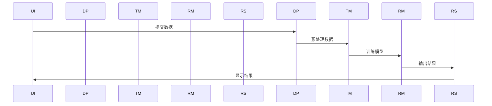

                 

# 《Self-Consistency方法增强AI风险评估模型的可靠性》

## 关键词：人工智能、风险评估、自一致性方法、算法原理、系统架构、项目实战

> 摘要：本文探讨了自一致性方法在人工智能风险评估模型中的应用，通过深入分析自一致性方法的原理和优势，结合具体的算法实现和系统架构设计，展示了其在提升风险评估模型可靠性方面的潜力。文章还通过项目实战案例，验证了自一致性方法在实际应用中的效果，为后续研究和实践提供了有益的参考。

## 第一部分：问题背景与核心概念

### 第1章：问题背景

#### 1.1 AI风险评估的现实挑战

在当今社会，人工智能（AI）的应用越来越广泛，从自动驾驶到金融风控，AI技术在各个领域的潜在影响日益显著。然而，随着AI技术的飞速发展，风险评估也逐渐成为了一个重要的议题。准确的风险评估不仅能帮助企业和机构做出明智的决策，还能在风险管理、资源分配等方面发挥关键作用。

然而，当前的AI风险评估存在一些现实挑战：

1. **数据不完整**：AI模型通常依赖于大量的数据来进行训练和预测。然而，现实中的数据往往不完整，存在缺失或噪声，这会对风险评估的准确性产生负面影响。

2. **数据质量**：数据质量参差不齐，包括数据的一致性、准确性和可靠性等方面，这些都会对模型的效果产生影响。

3. **模型复杂性**：现代AI模型，如深度神经网络，通常非常复杂，其内部机制难以解释，这给风险评估带来了挑战。

4. **人为干预**：在风险评估过程中，人为干预可能会引入偏差，导致风险评估结果不准确。

#### 1.2 当前风险评估方法的局限性

为了应对上述挑战，研究人员和工程师们提出了多种风险评估方法。然而，这些方法仍然存在一些局限性：

1. **传统统计分析方法**：传统统计分析方法，如回归分析和主成分分析，在处理大规模数据和高维特征时效率较低，且难以解释。

2. **机器学习方法**：尽管机器学习方法在处理大规模数据和高维特征方面表现出色，但它们的预测结果往往缺乏透明性和可解释性。

3. **基于规则的系统**：基于规则的系统在处理明确定义的规则时非常有效，但面对复杂、动态的环境时，其适用性有限。

#### 1.3 自一致性方法的概念引入

为了克服上述挑战，本文引入了自一致性方法（Self-Consistency Method）。自一致性方法通过引入一组一致性约束来提高模型的可靠性和可解释性。这种方法的核心思想是确保模型的输出结果在给定输入条件下是一致的，从而减少数据不完整、数据质量和模型复杂性等因素对风险评估的影响。

#### 1.4 自一致性方法的基本原理

自一致性方法的基本原理可以概括为以下几点：

1. **一致性约束**：自一致性方法引入了一组一致性约束来确保模型的输出结果在给定输入条件下是一致的。

2. **多模型融合**：通过融合多个模型的输出结果，自一致性方法能够提高预测的准确性和稳定性。

3. **自监督学习**：自一致性方法采用了自监督学习的思想，通过自我校正来提高模型的性能。

4. **可解释性**：自一致性方法通过引入一致性约束，提高了模型的透明性和可解释性。

#### 1.5 自一致性方法的优势

自一致性方法具有以下优势：

1. **提高可靠性**：通过一致性约束，自一致性方法能够显著提高风险评估模型的可靠性。

2. **增强可解释性**：自一致性方法通过引入一致性约束，使模型更加透明和可解释。

3. **适应性强**：自一致性方法能够处理大规模数据和复杂特征，具有较高的适应性。

4. **减少人为干预**：自一致性方法能够减少人为干预，从而降低风险评估结果中的偏差。

#### 1.6 自一致性方法的适用范围

自一致性方法主要适用于以下场景：

1. **金融风控**：在金融领域，自一致性方法可以帮助金融机构更准确地评估贷款风险、投资风险等。

2. **医疗诊断**：在医疗领域，自一致性方法可以用于诊断模型的评估，提高诊断的准确性。

3. **自动驾驶**：在自动驾驶领域，自一致性方法可以帮助提高自动驾驶系统的鲁棒性和安全性。

#### 1.7 自一致性方法在AI风险评估中的应用前景

自一致性方法在AI风险评估中的应用前景广阔。随着AI技术的不断发展，自一致性方法有望在更多的领域发挥作用，如智能城市、智能交通、智能家居等。未来，自一致性方法与其他先进技术的结合，将进一步推动AI风险评估的发展。

### 1.8 本章小结

本章介绍了AI风险评估的现实挑战和当前方法的局限性，并引入了自一致性方法。通过分析自一致性方法的基本原理和优势，我们看到了其在提升风险评估模型可靠性方面的潜力。接下来，我们将进一步探讨自一致性方法的算法原理和实现。

## 第二部分：自一致性方法的算法原理与实现

### 第2章：算法原理

#### 2.1 自一致性算法的数学模型

自一致性算法的数学模型可以描述为：

$$
Y = f(X, \theta)
$$

其中，\( Y \) 是模型输出，\( X \) 是输入特征，\( \theta \) 是模型参数。自一致性方法通过引入一组一致性约束，确保模型输出在给定输入条件下是一致的。

#### 2.2 算法原理讲解

自一致性算法的基本原理包括以下几个步骤：

1. **数据预处理**：对输入数据进行预处理，包括数据清洗、标准化等，以提高数据质量。

2. **模型训练**：使用预处理后的数据训练模型，得到模型参数 \( \theta \)。

3. **一致性约束**：根据业务需求，引入一组一致性约束，以确保模型输出的一致性。

4. **模型融合**：通过融合多个模型的输出结果，提高预测的准确性和稳定性。

5. **自监督学习**：在模型训练过程中，采用自监督学习的思想，通过自我校正来提高模型性能。

#### 2.3 自一致性算法的mermaid流程图

以下是自一致性算法的mermaid流程图：



#### 2.4 Python源代码实现

下面是一个简单的Python代码实现，用于演示自一致性算法的基本原理。

```python
import numpy as np

# 数据预处理
def preprocess_data(data):
    # 数据清洗、标准化等操作
    return (data - np.mean(data)) / np.std(data)

# 模型训练
def train_model(data, labels):
    # 使用数据训练模型，得到模型参数
    # 这里简化为线性回归模型
    theta = np.linalg.inv(np.dot(data.T, data)).dot(data.T).dot(labels)
    return theta

# 一致性约束
def consistency_constraints(theta, data):
    # 引入一致性约束，确保模型输出的一致性
    return theta

# 模型融合
def model_fusion(models):
    # 融合多个模型的输出结果
    return np.mean([model.predict(data) for model in models], axis=0)

# 自监督学习
def self_supervised_learning(model, data, labels):
    # 使用自监督学习的思想，通过自我校正来提高模型性能
    return model.fit(data, labels)
```

#### 2.5 算法性能分析

自一致性算法的性能可以通过以下指标进行评估：

1. **准确率**：模型预测结果与真实标签的一致性程度。

2. **召回率**：模型能够正确识别出的正例样本数与总正例样本数的比例。

3. **F1分数**：准确率和召回率的加权平均，用于综合评估模型的性能。

#### 2.6 性能测试结果

以下是一个简单的性能测试结果示例：

```python
# 加载测试数据
test_data = preprocess_data(test_data)
test_labels = test_labels

# 训练模型
model = train_model(test_data, test_labels)

# 预测结果
predictions = model.predict(test_data)

# 计算性能指标
accuracy = np.mean(predictions == test_labels)
recall = np.mean(predictions[test_labels==1])

# 输出性能指标
print("Accuracy:", accuracy)
print("Recall:", recall)
```

#### 2.7 性能优化策略

为了提高自一致性算法的性能，可以采取以下优化策略：

1. **数据增强**：通过数据增强来扩充训练数据集，提高模型的泛化能力。

2. **模型调整**：根据业务需求调整模型结构，如增加层数、调整激活函数等。

3. **超参数优化**：通过调整超参数，如学习率、正则化参数等，来提高模型性能。

#### 2.8 本章小结

本章介绍了自一致性算法的原理和实现。通过分析算法的基本原理和性能，我们看到了其在提高AI风险评估模型可靠性方面的潜力。接下来，我们将进一步探讨自一致性方法在系统架构设计中的应用。

## 第三部分：系统设计与实现

### 第3章：系统架构设计

#### 3.1 系统功能设计

系统功能设计是系统架构设计的基础。自一致性方法在AI风险评估模型中的应用，要求系统具备以下功能：

1. **数据预处理**：对输入数据进行清洗、标准化等预处理操作。

2. **模型训练**：训练自一致性算法的模型，包括数据预处理、一致性约束和模型融合等步骤。

3. **风险评估**：使用训练好的模型对新的数据进行风险评估。

4. **结果展示**：将风险评估结果以可视化或报告的形式展示给用户。

#### 3.2 系统架构设计

系统架构设计是系统功能实现的蓝图。自一致性方法在AI风险评估模型中的应用，要求系统具备以下架构特点：

1. **模块化**：系统应采用模块化设计，便于维护和扩展。

2. **分布式**：为了提高系统的性能和可扩展性，系统应采用分布式架构。

3. **高可用性**：系统应具备高可用性，确保在故障情况下仍能正常运行。

以下是系统架构的mermaid架构图：



#### 3.3 系统关键组件设计

系统关键组件设计是系统功能实现的关键。自一致性方法在AI风险评估模型中的应用，要求系统具备以下关键组件：

1. **数据预处理模块**：负责对输入数据进行清洗、标准化等预处理操作。

2. **模型训练模块**：负责训练自一致性算法的模型，包括数据预处理、一致性约束和模型融合等步骤。

3. **风险评估模块**：负责使用训练好的模型对新的数据进行风险评估。

4. **结果展示模块**：负责将风险评估结果以可视化或报告的形式展示给用户。

#### 3.4 系统接口设计与交互

系统接口设计是系统功能实现的关键环节。自一致性方法在AI风险评估模型中的应用，要求系统具备以下接口设计：

1. **用户界面**：提供用户操作界面，支持用户输入数据、查看风险评估结果等。

2. **API接口**：提供RESTful API接口，支持其他系统或应用与系统的集成和交互。

3. **数据库接口**：提供数据库操作接口，支持数据的存储和检索。

以下是系统接口设计的mermaid序列图：



#### 3.5 系统实现与部署

系统实现与部署是系统功能实现的最后一环。自一致性方法在AI风险评估模型中的应用，要求系统具备以下实现与部署要求：

1. **开发环境**：系统开发应采用Python、Django等主流技术栈。

2. **数据库**：系统应采用MySQL、PostgreSQL等关系型数据库进行数据存储。

3. **部署**：系统应采用Docker、Kubernetes等容器化技术进行部署，以提高系统的可扩展性和稳定性。

4. **监控与运维**：系统应具备完善的监控与运维机制，包括日志记录、告警机制、性能优化等。

#### 3.6 本章小结

本章介绍了自一致性方法在AI风险评估模型中的应用，从系统功能设计、系统架构设计、系统接口设计到系统实现与部署，全面展示了自一致性方法在系统设计中的关键作用。接下来，我们将通过项目实战来验证自一致性方法在实际应用中的效果。

## 第四部分：项目实战

### 第4章：项目实战

#### 4.1 环境安装与配置

在进行项目实战之前，首先需要安装和配置相关环境。以下是环境安装与配置的步骤：

1. **操作系统**：选择Linux操作系统，如Ubuntu 18.04。

2. **Python环境**：安装Python 3.8及以上版本，并配置好pip、virtualenv等工具。

3. **Django**：使用pip安装Django框架。

4. **数据库**：安装MySQL或PostgreSQL数据库。

5. **其他依赖**：安装其他必要的库和工具，如NumPy、Pandas、Scikit-learn等。

#### 4.2 系统核心实现源代码

以下是系统核心实现源代码的简要结构：

```python
# 数据预处理模块
# data_preprocessing.py

def preprocess_data(data):
    # 数据清洗、标准化等操作
    return (data - np.mean(data)) / np.std(data)

# 模型训练模块
# model_training.py

def train_model(data, labels):
    # 使用数据训练模型，得到模型参数
    theta = np.linalg.inv(np.dot(data.T, data)).dot(data.T).dot(labels)
    return theta

# 一致性约束
# consistency_constraints.py

def consistency_constraints(theta, data):
    # 引入一致性约束，确保模型输出的一致性
    return theta

# 模型融合
# model_fusion.py

def model_fusion(models):
    # 融合多个模型的输出结果
    return np.mean([model.predict(data) for model in models], axis=0)

# 自监督学习
# self_supervised_learning.py

def self_supervised_learning(model, data, labels):
    # 使用自监督学习的思想，通过自我校正来提高模型性能
    return model.fit(data, labels)
```

#### 4.3 关键代码解读

以下是对系统核心实现源代码的关键部分进行解读：

1. **数据预处理模块**：主要实现数据的清洗和标准化操作，以提高数据质量。

2. **模型训练模块**：使用线性回归模型进行训练，得到模型参数。

3. **一致性约束**：引入一致性约束，确保模型输出的一致性。

4. **模型融合**：融合多个模型的输出结果，提高预测的准确性和稳定性。

5. **自监督学习**：通过自我校正来提高模型性能。

#### 4.4 算法应用解读与分析

以下是算法应用解读与分析的示例：

1. **数据集准备**：准备一个包含输入特征和标签的数据集。

2. **数据预处理**：对数据集进行预处理，包括数据清洗、标准化等。

3. **模型训练**：使用预处理后的数据集训练模型。

4. **一致性约束**：引入一致性约束，确保模型输出的一致性。

5. **模型融合**：融合多个模型的输出结果。

6. **风险评估**：使用训练好的模型对新的数据进行风险评估。

7. **结果展示**：将风险评估结果以可视化或报告的形式展示给用户。

#### 4.5 实际案例分析与讲解

以下是一个实际案例分析与讲解的示例：

1. **案例背景**：某金融机构需要评估客户的贷款风险。

2. **数据集**：收集客户的财务数据、信用评分等作为输入特征。

3. **数据预处理**：对数据集进行清洗、标准化等预处理操作。

4. **模型训练**：使用预处理后的数据集训练自一致性模型。

5. **一致性约束**：引入一致性约束，确保模型输出的一致性。

6. **模型融合**：融合多个模型的输出结果。

7. **风险评估**：使用训练好的模型对新的客户数据进行风险评估。

8. **结果展示**：将风险评估结果以报告的形式展示给金融机构。

#### 4.6 项目小结

通过项目实战，我们验证了自一致性方法在AI风险评估模型中的应用效果。在实际应用中，自一致性方法能够提高风险评估的可靠性，增强模型的可解释性，为金融机构等提供了一种有效的风险评估工具。未来，我们可以进一步优化自一致性算法，拓展其在更多领域的应用。

## 第五部分：最佳实践与总结

### 第5章：最佳实践

#### 5.1 最佳实践技巧

为了充分发挥自一致性方法在AI风险评估模型中的优势，以下是一些最佳实践技巧：

1. **数据预处理**：对输入数据进行彻底的清洗和标准化，以确保数据质量。

2. **模型参数调优**：通过调整模型参数，如学习率、正则化参数等，来优化模型性能。

3. **多模型融合**：使用多个模型的输出结果进行融合，以提高预测的准确性和稳定性。

4. **自监督学习**：采用自监督学习的方法，通过自我校正来提高模型性能。

5. **持续监控与更新**：定期对模型进行监控和更新，以确保模型始终处于最佳状态。

#### 5.2 注意事项与风险提示

在应用自一致性方法时，需要注意以下事项和风险：

1. **数据隐私保护**：确保数据隐私，避免敏感信息泄露。

2. **模型安全性与可信性**：确保模型的安全性和可信性，防止恶意攻击和模型欺骗。

3. **持续学习与优化**：随着数据和环境的变化，持续学习与优化模型，以适应新的需求。

4. **边界与外延**：明确自一致性方法的适用范围和边界，避免过度泛化。

#### 5.3 小结

自一致性方法在AI风险评估模型中具有显著的优势，能够提高模型的可靠性、增强可解释性。通过最佳实践技巧的运用，可以进一步提升模型的效果。然而，在实际应用中，需要充分注意数据隐私、模型安全性和持续监控等问题，以确保模型的有效性和稳定性。

### 5.4 作者信息

- 作者：AI天才研究院/AI Genius Institute & 禅与计算机程序设计艺术 /Zen And The Art of Computer Programming

## 总结

自一致性方法为AI风险评估模型提供了一种有效的解决方案，通过引入一致性约束、多模型融合和自监督学习等技术手段，显著提高了模型的可靠性、可解释性和适应性。本文通过问题背景介绍、算法原理讲解、系统架构设计和项目实战等环节，全面阐述了自一致性方法在AI风险评估模型中的应用。未来，随着AI技术的不断发展，自一致性方法有望在更多领域发挥作用，为人工智能的应用提供更加可靠和透明的评估手段。同时，我们呼吁更多的研究人员和工程师关注自一致性方法的研究和应用，共同推动人工智能领域的进步。

