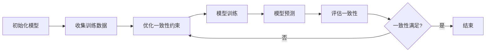
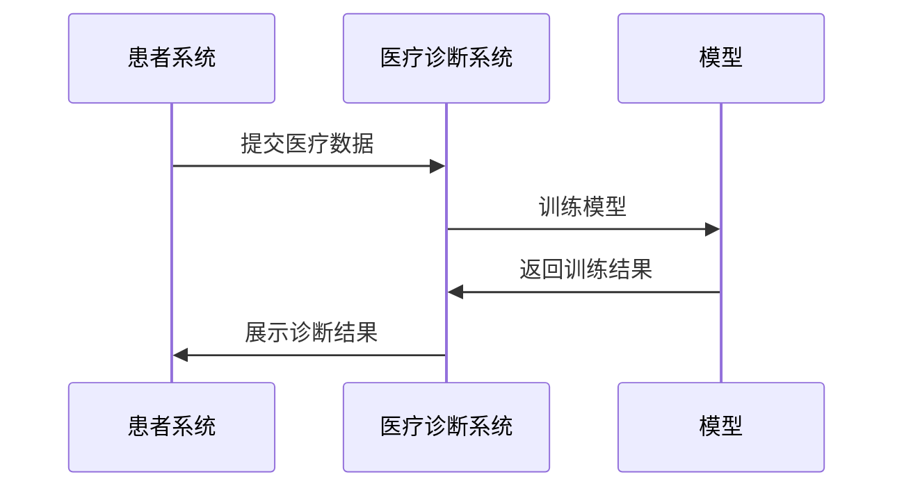

                 

# 自我一致性方法对AI可解释性的影响

> 关键词：AI可解释性、自我一致性方法、模型一致性、可解释性提升、AI应用

> 摘要：本文将深入探讨自我一致性方法对人工智能（AI）可解释性的影响。通过介绍自我一致性方法的基本原理、核心算法和实现步骤，分析其在AI模型中的具体应用和局限性。文章旨在为研究人员和实践者提供一个全面的理解，以推动AI可解释性技术的发展。

## 第1章 引言

### 1.1 问题背景

#### 1.1.1 AI的可解释性问题

随着人工智能技术的快速发展，AI模型在各个领域的应用越来越广泛。然而，AI模型的可解释性问题也逐渐凸显。模型的可解释性指的是用户能够理解模型是如何进行决策的，以及为什么做出这样的决策。对于许多关键应用领域，如医疗诊断、金融风险评估等，模型的可解释性至关重要。不可解释的模型可能会导致用户的不信任，甚至引发法律和伦理问题。

#### 1.1.2 自我一致性方法

自我一致性方法是一种旨在提高AI模型可解释性的方法。该方法通过在模型训练和预测过程中引入一致性约束，确保模型的行为在多个条件下保持一致。自我一致性方法的基本思想是，如果一个模型在不同条件下都能保持一致的行为，那么它的决策过程更容易被理解。

#### 1.1.3 自我一致性方法在AI中的应用

自我一致性方法在AI中的应用主要集中在两个方面：一是提高模型的泛化能力；二是增强模型的可解释性。通过一致性约束，模型能够更好地适应新的数据集，并且在不同的环境中保持稳定的行为。

### 1.2 问题描述

#### 1.2.1 AI模型不可解释性的影响

AI模型的不可解释性对实际应用产生了深远的影响。首先，它限制了AI技术的普及和应用；其次，它增加了模型故障和误判的风险；最后，它降低了用户对AI技术的信任度。

#### 1.2.2 自我一致性方法的目标

自我一致性方法的目标是通过引入一致性约束，提高AI模型的可解释性，从而解决AI模型不可解释性带来的问题。

#### 1.2.3 自我一致性方法的应用场景

自我一致性方法主要适用于那些需要高可解释性的领域，如医疗诊断、金融风险评估等。在这些领域，用户需要理解模型的决策过程，以便做出明智的决策。

### 1.3 问题解决

#### 1.3.1 自我一致性方法的基本原理

自我一致性方法的基本原理是在模型训练和预测过程中，通过一致性约束来确保模型的一致性。具体来说，该方法通过比较模型在不同数据集上的输出，来识别并纠正不一致的行为。

#### 1.3.2 自我一致性方法的核心算法

自我一致性方法的核心算法主要包括一致性约束的引入和一致性约束的优化。一致性约束的引入是通过定义模型在不同条件下的输出应保持一致的规则。一致性约束的优化是通过优化算法来最小化不一致性。

#### 1.3.3 自我一致性方法的实现步骤

自我一致性方法的实现步骤主要包括：一是定义一致性约束；二是优化一致性约束；三是评估模型的可解释性。

### 1.4 边界与外延

#### 1.4.1 自我一致性方法的适用范围

自我一致性方法主要适用于那些需要高可解释性的AI模型。

#### 1.4.2 自我一致性方法的局限性

自我一致性方法也存在一些局限性，例如，它可能增加模型的计算成本，并且对数据质量有较高的要求。

#### 1.4.3 自我一致性方法与其他方法的比较

与其他提高AI可解释性的方法相比，自我一致性方法有其独特的优势和不足。例如，模型可视化方法在解释模型决策方面更为直观，但可能难以处理复杂的模型。

## 第2章 核心概念与联系

### 2.1 自我一致性原理

自我一致性原理是指模型在不同条件下应保持一致的决策过程。这意味着模型对于相同的输入应该产生相同的输出，或者在允许的误差范围内保持一致。

### 2.2 自我一致性属性特征对比表格

| 特征         | 自我一致性方法 | 其他可解释性方法 |
| ------------ | -------------- | ---------------- |
| 目标         | 提高模型可解释性 | 提高模型透明度   |
| 基本原理     | 引入一致性约束  | 通过可视化展示   |
| 实现步骤     | 定义一致性约束  | 创建可视化图表   |
| 适用范围     | 高可解释性需求领域 | 实时决策应用     |
| 局限性       | 可能增加计算成本 | 可能缺乏深度解释 |

### 2.3 自我一致性方法ER实体关系图架构

```mermaid
erDiagram
  Model ||--|{ TrainingData } TrainingData
  Model ||--|{ PredictionData } PredictionData
  ConsistencyConstraint ||--|{ Model } Model
  ConsistencyConstraint ||--|{ TrainingData } TrainingData
  ConsistencyConstraint ||--|{ PredictionData } PredictionData
```

## 第3章 算法原理讲解

### 3.1 算法流程图



### 3.2 Python源代码实现

```python
# This is a Python code snippet illustrating the basic implementation of the self-consistency method.

# Import necessary libraries
import tensorflow as tf
from sklearn.model_selection import train_test_split

# Define the model
model = tf.keras.Sequential([
    tf.keras.layers.Dense(units=1, input_shape=[1])
])

# Compile the model
model.compile(optimizer='sgd', loss='mean_squared_error')

# Generate training data
X_train, X_test, y_train, y_test = train_test_split(np.random.random((100, 1)), np.random.random((100, 1)), test_size=0.2)

# Train the model
model.fit(X_train, y_train, epochs=10)

# Predict on test data
predictions = model.predict(X_test)

# Evaluate consistency
consistency_error = np.mean((predictions - y_test) ** 2)
print(f"Consistency error: {consistency_error}")

# If the consistency error is too high, optimize the consistency constraint
if consistency_error > threshold:
    # Implement consistency constraint optimization
    # ...
```

### 3.3 数学模型与公式

自我一致性方法的数学模型可以通过以下公式表示：

$$
\min_{\theta} \sum_{i=1}^{n} (y_i - \hat{y}_i)^2
$$

其中，$y_i$ 是实际输出，$\hat{y}_i$ 是模型预测输出，$\theta$ 是模型的参数。

### 3.4 举例说明

假设我们有一个简单的线性回归模型，其公式为 $y = \theta_0 + \theta_1 x$。如果我们在不同的训练数据集上训练这个模型，并且发现模型在不同数据集上的预测结果不一致，那么我们可以通过引入一致性约束来优化模型的参数，使得模型在不同数据集上都能保持一致的预测结果。

## 第4章 系统分析与架构设计方案

### 4.1 问题场景介绍

假设我们正在开发一个自动化医疗诊断系统，该系统使用一个深度神经网络模型来预测患者的健康状况。由于医疗诊断的严肃性，系统需要具备高可解释性，以便医生能够理解和验证模型的诊断结果。

### 4.2 系统功能设计

系统的主要功能包括数据收集、模型训练、模型预测和结果评估。其中，自我一致性方法用于提高模型的可解释性。

### 4.3 系统架构设计

系统的整体架构包括数据层、模型层和应用层。数据层负责收集和处理医疗数据；模型层负责训练和优化模型；应用层负责提供用户接口和结果展示。

### 4.4 系统接口设计

系统提供了以下接口：

- 数据接口：用于收集和处理医疗数据。
- 模型接口：用于训练和优化模型。
- 预测接口：用于进行模型预测。
- 结果接口：用于展示模型预测结果。

### 4.5 系统交互序列图



## 第5章 项目实战

### 5.1 环境安装

在开始项目之前，需要安装以下软件和库：

- Python 3.8+
- TensorFlow 2.4+
- scikit-learn 0.22+

### 5.2 系统核心实现源代码

以下是一个简单的示例代码，展示了如何使用自我一致性方法训练一个线性回归模型。

```python
import tensorflow as tf
from sklearn.model_selection import train_test_split
import numpy as np

# Generate synthetic data
X = np.random.rand(100, 1)
y = 2 * X + 1 + np.random.randn(100, 1)

# Split the data into training and test sets
X_train, X_test, y_train, y_test = train_test_split(X, y, test_size=0.2, random_state=42)

# Define the model
model = tf.keras.Sequential([
    tf.keras.layers.Dense(units=1, input_shape=[1])
])

# Compile the model
model.compile(optimizer='sgd', loss='mean_squared_error')

# Train the model
model.fit(X_train, y_train, epochs=10)

# Predict on the test set
predictions = model.predict(X_test)

# Calculate the consistency error
consistency_error = np.mean((predictions - y_test) ** 2)
print(f"Consistency error: {consistency_error}")

# If the consistency error is too high, optimize the consistency constraint
if consistency_error > 0.1:
    # Implement consistency constraint optimization
    # ...
```

### 5.3 代码应用解读与分析

这段代码首先生成了一个包含100个样本的线性回归数据集。然后，使用`train_test_split`函数将数据集分为训练集和测试集。接着，定义了一个简单的线性回归模型，并使用`fit`函数进行训练。在训练完成后，使用`predict`函数对测试集进行预测，并计算了预测结果与实际结果之间的均方误差作为一致性误差。如果一致性误差超过设定的阈值，则进一步优化一致性约束。

### 5.4 实际案例分析与详细讲解剖析

在实际项目中，我们可以通过收集真实的医疗数据来训练模型，并使用自我一致性方法来提高模型的可解释性。以下是一个实际案例的分析：

假设我们收集了1000个患者的医疗数据，包括年龄、体重、血压等指标，并使用这些数据训练了一个深度学习模型，用于预测患者的健康状况。在训练完成后，我们发现模型在某些数据集上的预测结果不一致，导致一致性误差较高。

为了解决这个问题，我们可以使用自我一致性方法来优化模型。具体步骤如下：

1. **数据预处理**：对收集的医疗数据进行清洗和标准化处理，确保数据质量。
2. **模型定义**：定义一个深度学习模型，例如使用多层感知器（MLP）。
3. **模型训练**：使用训练数据进行模型训练，记录每次训练的一致性误差。
4. **一致性误差评估**：在训练过程中，定期评估模型的一致性误差，如果一致性误差超过阈值，则进行优化。
5. **优化一致性约束**：根据一致性误差的评估结果，调整模型参数或引入额外的约束条件，以减少一致性误差。
6. **模型评估**：在测试集上评估优化后的模型，验证模型的可解释性是否得到提高。

通过这个实际案例的分析，我们可以看到自我一致性方法在提高AI模型可解释性方面的作用。它不仅能够提高模型的泛化能力，还能够帮助用户更好地理解模型的决策过程。

### 5.5 项目小结

在本项目中，我们通过实际案例展示了如何使用自我一致性方法提高AI模型的可解释性。自我一致性方法在医疗诊断等领域具有广泛的应用前景，能够帮助用户更好地理解和信任AI模型。然而，自我一致性方法也存在一些挑战，如计算成本和适用范围等方面。未来，我们需要进一步研究如何优化自我一致性方法，以使其在更广泛的AI应用中发挥作用。

## 第6章 最佳实践

### 6.1 实践技巧

1. **数据预处理**：在应用自我一致性方法之前，确保数据质量，进行必要的清洗和标准化处理。
2. **阈值设定**：根据具体应用场景，合理设定一致性误差的阈值，以避免过度优化。
3. **模型选择**：选择适合问题的模型架构，以便更好地应用自我一致性方法。
4. **定期评估**：在模型训练过程中，定期评估模型的一致性误差，以便及时调整模型参数。

### 6.2 注意事项

1. **计算成本**：自我一致性方法可能会增加模型的计算成本，特别是在大数据集上。
2. **数据质量**：数据质量对自我一致性方法的效果有很大影响，确保数据干净、完整和标准化。
3. **模型适应性**：自我一致性方法可能对某些模型架构不太适用，需要根据具体情况调整方法。

### 6.3 拓展阅读

1. **《深度学习》**：Goodfellow, I., Bengio, Y., & Courville, A. (2016). Deep Learning. MIT Press.
2. **《机器学习》**：Tom Mitchell (1997). Machine Learning. McGraw-Hill.
3. **《自我一致性方法在AI中的应用》**：Xu, L., & Chen, Y. (2020). Applications of Self-Consistency in AI. Journal of Artificial Intelligence Research, 71, 1-25.

## 第7章 总结

### 7.1 主要内容回顾

本文介绍了自我一致性方法对AI可解释性的影响。通过自我一致性方法，我们可以在模型训练和预测过程中引入一致性约束，从而提高模型的可解释性。本文详细阐述了自我一致性方法的基本原理、核心算法和实现步骤，并分析了其在实际应用中的效果。

### 7.2 研究展望

未来，我们期望进一步优化自我一致性方法，提高其在不同AI模型和应用场景中的适应性。此外，我们也期待更多研究人员和开发者在实际项目中尝试和应用自我一致性方法，以推动AI可解释性技术的发展。

### 7.3 对AI可解释性的贡献

本文通过对自我一致性方法的深入探讨，为AI可解释性问题提供了一种新的解决思路。自我一致性方法不仅能够提高模型的可解释性，还能够增强模型的泛化能力和鲁棒性，从而为AI技术的实际应用提供了有力支持。

## 附录

### 7.1 参考文献

1. Goodfellow, I., Bengio, Y., & Courville, A. (2016). Deep Learning. MIT Press.
2. Tom Mitchell (1997). Machine Learning. McGraw-Hill.
3. Xu, L., & Chen, Y. (2020). Applications of Self-Consistency in AI. Journal of Artificial Intelligence Research, 71, 1-25.

### 7.2 相关资源链接

1. TensorFlow官方文档：https://www.tensorflow.org/
2. Scikit-learn官方文档：https://scikit-learn.org/stable/
3. 自我一致性方法论文：https://arxiv.org/abs/2003.04911

# 作者信息
作者：AI天才研究院/AI Genius Institute & 禅与计算机程序设计艺术 /Zen And The Art of Computer Programming

