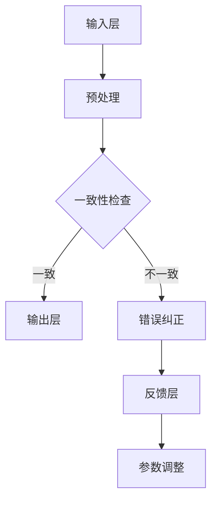
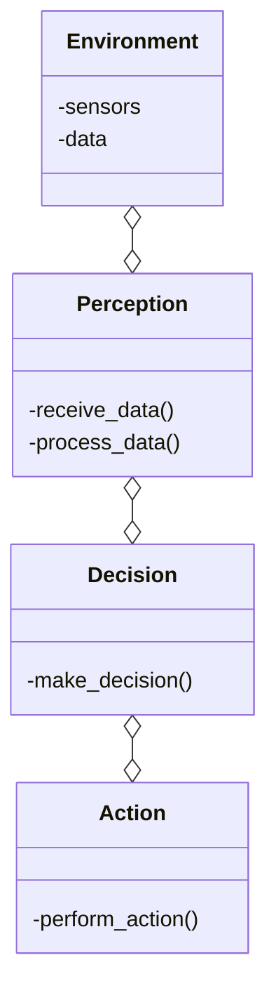
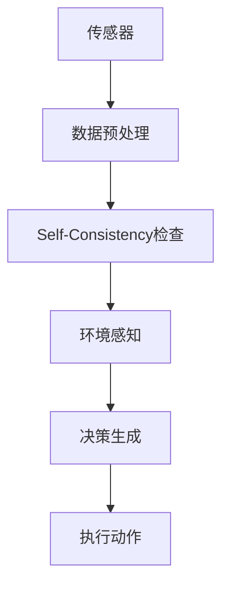
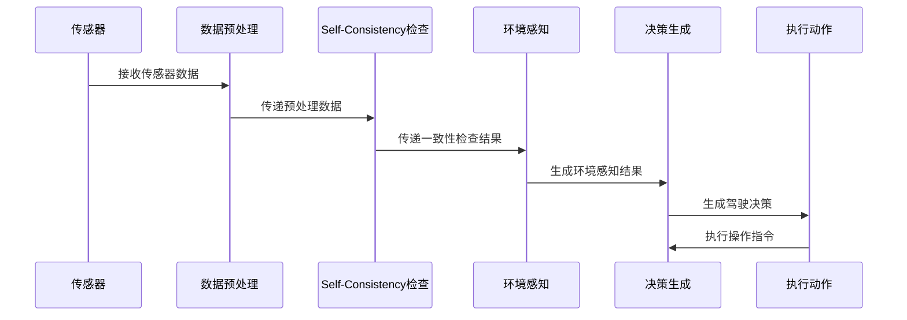

                 

### 文章标题

#### 关键词

- AI系统鲁棒性
- Self-Consistency方法
- 图像识别
- 自然语言处理
- 推荐系统
- 数学模型

#### 摘要

本文深入探讨了Self-Consistency方法对AI系统鲁棒性的影响。首先，我们介绍了AI系统的重要性以及鲁棒性的关键性，随后定义了Self-Consistency方法的基本概念。文章通过详细的案例分析，揭示了Self-Consistency方法在图像识别、自然语言处理和推荐系统等领域的应用。接着，我们剖析了Self-Consistency方法的核心原理及其数学模型，并通过Python代码实现和实际案例讲解了其具体应用过程。最后，我们对系统架构和项目实战进行了深入分析，总结了Self-Consistency方法在提高AI系统鲁棒性方面的实践意义和未来展望。

## 目录大纲

### 第一部分：背景介绍

1. **问题背景**
   - **1.1 AI系统的重要性**
   - **1.2 AI系统鲁棒性的重要性**
   - **1.3 Self-Consistency方法概述**

2. **问题描述**
   - **1.2.1 鲁棒性问题**
   - **1.2.2 Self-Consistency方法在解决鲁棒性问题中的应用**

3. **问题解决**
   - **1.3.1 Self-Consistency方法的基本原理**
   - **1.3.2 Self-Consistency方法的实现步骤**

4. **边界与外延**
   - **1.4.1 Self-Consistency方法的适用范围**
   - **1.4.2 Self-Consistency方法的局限性**

5. **概念结构与核心要素组成**
   - **1.5.1 Self-Consistency方法的概念结构**
   - **1.5.2 Self-Consistency方法的核心要素组成**

6. **本章小结**

### 第二部分：核心概念与联系

1. **Self-Consistency方法原理**
   - **2.1.1 Self-Consistency方法的核心概念**
   - **2.1.2 Self-Consistency方法的属性特征对比表格**
   - **2.1.3 Self-Consistency方法与相关方法的联系**

2. **Self-Consistency方法在AI系统中的应用**
   - **2.2.1 Self-Consistency方法在图像识别中的应用**
   - **2.2.2 Self-Consistency方法在自然语言处理中的应用**
   - **2.2.3 Self-Consistency方法在推荐系统中的应用**

3. **自洽性评估与优化**
   - **2.3.1 自洽性评估指标**
   - **2.3.2 自洽性优化方法**

4. **本章小结**

### 第三部分：算法原理讲解

1. **算法原理**
   - **3.1 自洽性算法mermaid流程图**
   - **3.2 Python源代码实现**
     - **3.2.1 数据准备**
     - **3.2.2 算法实现**
     - **3.2.3 结果分析**

   - **3.3 数学模型与公式**
     - **3.3.1 算法原理的数学模型**
     - **3.3.2 算法原理的公式推导**
     - **3.3.3 公式详解与举例说明**

2. **本章小结**

### 第四部分：系统分析与架构设计

1. **问题场景介绍**
   - **4.1.1 AI系统鲁棒性问题的场景示例**
   - **4.1.2 Self-Consistency方法的应用场景**

2. **系统功能设计**
   - **4.2.1 领域模型mermaid类图**
   - **4.2.2 系统功能设计**

3. **系统架构设计**
   - **4.3.1 系统架构设计mermaid架构图**
   - **4.3.2 系统架构设计说明**

4. **系统接口设计**
   - **4.4.1 系统接口设计**
   - **4.4.2 接口交互说明**

5. **系统交互mermaid序列图**
   - **4.5.1 系统交互mermaid序列图**
   - **4.5.2 交互流程说明**

6. **本章小结**

### 第五部分：项目实战

1. **环境安装**
   - **5.1.1 环境安装步骤**
   - **5.1.2 遇到的问题及解决方案**

2. **系统核心实现**
   - **5.2.1 系统核心实现源代码**
   - **5.2.2 代码应用解读与分析**

3. **实际案例分析**
   - **5.3.1 案例背景**
   - **5.3.2 案例分析**
   - **5.3.3 案例详细讲解剖析**

4. **项目小结**
   - **5.4.1 项目总结**
   - **5.4.2 项目展望**

5. **本章小结**

### 最佳实践 Tips、小结、注意事项、拓展阅读

---

### 第一部分：背景介绍

#### 1.1 问题背景

人工智能（AI）作为一种模拟、延伸和扩展人类智能的计算机科学领域，正日益成为现代社会的重要驱动力。从自动驾驶到医疗诊断，从智能家居到金融分析，AI的应用已经深入到各个行业和领域。然而，AI系统在实际应用中面临着诸多挑战，其中之一就是鲁棒性。

**AI系统的重要性**

AI系统在现代社会的应用具有深远的意义。首先，AI可以显著提升生产力，通过自动化和智能化手段，减少人力成本，提高工作效率。其次，AI能够处理和分析大量数据，从中提取有价值的信息，为决策提供支持。此外，AI还在提高安全性、优化资源配置、增强用户体验等方面发挥着重要作用。

**AI系统鲁棒性的重要性**

鲁棒性是AI系统的重要属性，指的是系统在面临外部干扰或内部错误时，仍能保持正确运作的能力。一个鲁棒性强的AI系统可以在复杂、多变的环境中稳定运行，减少因错误预测或故障带来的损失。在医疗诊断、自动驾驶、金融交易等高风险领域，鲁棒性更是至关重要。

**Self-Consistency方法概述**

Self-Consistency方法是一种旨在提高AI系统鲁棒性的技术。该方法通过构建系统内部的自我一致性检查机制，能够有效地检测和纠正错误，从而提高系统的可靠性。Self-Consistency方法在不同领域都有广泛的应用，如计算机视觉、自然语言处理和推荐系统等。

#### 1.2 问题描述

**鲁棒性问题**

鲁棒性问题是指AI系统在面临异常数据、噪声或攻击时，可能出现的错误预测或失败。这些问题可能导致严重后果，如自动驾驶汽车的交通事故、医疗诊断的误诊、金融交易的损失等。因此，提高AI系统的鲁棒性是当前研究的重点之一。

**Self-Consistency方法在解决鲁棒性问题中的应用**

Self-Consistency方法通过以下步骤解决鲁棒性问题：

1. **自我一致性检查**：系统在每次决策或预测后，会自我检查结果是否与预期一致。
2. **错误纠正**：如果发现不一致，系统会自动进行错误纠正。
3. **反馈循环**：纠正后的结果会反馈到系统中，用于改进后续的决策或预测。

通过这些步骤，Self-Consistency方法能够提高AI系统的鲁棒性，使其在复杂环境中保持稳定运行。

#### 1.3 问题解决

**Self-Consistency方法的基本原理**

Self-Consistency方法的核心思想是确保系统内部的所有组件都能够相互一致，即系统的输出应该与输入和内部逻辑保持一致。这种方法通过以下步骤实现：

1. **输入验证**：对输入数据进行检查，确保其符合预期格式和范围。
2. **中间结果验证**：在计算过程中，对中间结果进行一致性检查，确保其符合逻辑和数学规则。
3. **输出验证**：对最终输出结果进行验证，确保其与预期一致。

**Self-Consistency方法的实现步骤**

1. **初始化**：设置系统参数和初始状态。
2. **输入处理**：接收输入数据并进行预处理。
3. **一致性检查**：对输入数据和中间结果进行一致性检查。
4. **错误纠正**：如果发现不一致，进行错误纠正。
5. **输出生成**：生成输出结果。
6. **反馈循环**：将输出结果反馈到系统中，用于改进后续处理。

#### 1.4 边界与外延

**Self-Consistency方法的适用范围**

Self-Consistency方法适用于各种需要高鲁棒性的AI系统，特别是那些处理复杂、多变数据的系统。例如，在计算机视觉中，Self-Consistency方法可以用于检测和纠正图像中的噪声和异常；在自然语言处理中，可以用于纠正语言模型中的错误和不确定性。

**Self-Consistency方法的局限性**

尽管Self-Consistency方法在提高AI系统鲁棒性方面具有显著优势，但它也存在一些局限性。首先，Self-Consistency方法可能引入额外的计算开销，特别是在处理大量数据时。其次，该方法无法解决所有类型的错误，特别是那些涉及根本性错误的情形。因此，在应用Self-Consistency方法时，需要综合考虑其适用范围和局限性。

#### 1.5 概念结构与核心要素组成

**Self-Consistency方法的概念结构**

Self-Consistency方法的概念结构主要包括以下几个部分：

1. **输入层**：接收外部输入数据。
2. **处理层**：对输入数据进行处理和计算。
3. **输出层**：生成输出结果。
4. **验证层**：对输出结果进行一致性检查。

**Self-Consistency方法的核心要素组成**

Self-Consistency方法的核心要素包括：

1. **一致性检查机制**：用于检查系统内部各组件之间的相互一致性。
2. **错误纠正机制**：用于纠正检测到的不一致。
3. **反馈循环机制**：用于将纠正后的结果反馈到系统中，用于改进后续处理。

#### 1.6 本章小结

本部分介绍了AI系统的重要性及其鲁棒性的关键性，随后详细介绍了Self-Consistency方法的基本概念和应用。通过本部分的介绍，读者可以初步了解Self-Consistency方法在提高AI系统鲁棒性方面的作用和重要性。

---

### 第二部分：核心概念与联系

#### 2.1 Self-Consistency方法原理

**2.1.1 Self-Consistency方法的核心概念**

Self-Consistency方法的核心概念是“自洽性”，即系统的输入、输出和内部处理过程应该保持一致。具体来说，Self-Consistency方法通过以下步骤实现自洽性：

1. **输入验证**：确保输入数据的格式和范围符合预期。
2. **中间结果验证**：在处理过程中，对中间结果进行一致性检查。
3. **输出验证**：对最终输出结果进行验证，确保其与预期一致。

**2.1.2 Self-Consistency方法的属性特征对比表格**

为了更清晰地理解Self-Consistency方法的属性特征，我们将其与传统的鲁棒性增强方法进行对比，如下表所示：

| 方法         | Self-Consistency | 传统方法         |  
| ------------ | -------------- | -------------- |  
| 目标         | 提高系统自洽性   | 提高系统鲁棒性   |  
| 基本原理     | 通过自洽性检查实现   | 通过异常检测和纠正实现 |  
| 适用范围     | 需要高鲁棒性的系统 | 各类AI系统         |  
| 优点         | 减少错误传播   | 快速响应异常   |  
| 缺点         | 可能增加计算开销 | 可能误判正常数据 |  

**2.1.3 Self-Consistency方法与相关方法的联系**

Self-Consistency方法与其他鲁棒性增强方法有一定的联系和区别。例如，与基于规则的错误检测方法相比，Self-Consistency方法更加灵活，能够处理复杂和不确定的数据。与基于机器学习的错误纠正方法相比，Self-Consistency方法更注重系统内部的一致性，能够减少错误传播。

#### 2.2 Self-Consistency方法在AI系统中的应用

**2.2.1 Self-Consistency方法在图像识别中的应用**

在图像识别中，Self-Consistency方法通过以下步骤提高系统的鲁棒性：

1. **输入验证**：对图像进行预处理，包括去噪、归一化等，确保图像格式和内容符合预期。
2. **特征提取**：使用深度学习模型提取图像特征。
3. **中间结果验证**：对提取的特征进行一致性检查，确保特征之间没有矛盾。
4. **分类输出**：使用验证后的特征进行分类，生成最终输出结果。
5. **输出验证**：对分类结果进行验证，确保分类结果与预期一致。

通过以上步骤，Self-Consistency方法能够提高图像识别系统的鲁棒性，减少因噪声、异常图像等导致的错误分类。

**2.2.2 Self-Consistency方法在自然语言处理中的应用**

在自然语言处理中，Self-Consistency方法通过以下步骤提高系统的鲁棒性：

1. **输入验证**：对文本进行预处理，包括分词、去停用词等，确保文本格式和内容符合预期。
2. **语义分析**：使用深度学习模型对文本进行语义分析，提取关键信息。
3. **中间结果验证**：对提取的语义信息进行一致性检查，确保语义之间没有矛盾。
4. **输出生成**：使用验证后的语义信息生成输出结果，如文本摘要、情感分析等。
5. **输出验证**：对输出结果进行验证，确保其与预期一致。

通过以上步骤，Self-Consistency方法能够提高自然语言处理系统的鲁棒性，减少因噪声、异常文本等导致的错误分析。

**2.2.3 Self-Consistency方法在推荐系统中的应用**

在推荐系统中，Self-Consistency方法通过以下步骤提高系统的鲁棒性：

1. **输入验证**：对用户行为数据进行预处理，确保数据格式和内容符合预期。
2. **推荐算法**：使用基于协同过滤、矩阵分解等方法生成推荐结果。
3. **中间结果验证**：对生成的推荐结果进行一致性检查，确保推荐结果之间没有矛盾。
4. **输出生成**：将验证后的推荐结果输出给用户。
5. **输出验证**：对用户反馈进行验证，确保推荐结果与用户满意度一致。

通过以上步骤，Self-Consistency方法能够提高推荐系统的鲁棒性，减少因异常用户行为、数据噪声等导致的错误推荐。

#### 2.3 自洽性评估与优化

**2.3.1 自洽性评估指标**

自洽性评估是Self-Consistency方法的重要组成部分。常用的自洽性评估指标包括：

1. **一致性率**：系统输出结果与预期结果一致的比例。
2. **错误纠正率**：系统检测到错误并成功纠正的比例。
3. **反馈正确率**：系统根据用户反馈进行修正后，输出结果与用户满意度一致的比例。

**2.3.2 自洽性优化方法**

为了提高自洽性，可以采用以下优化方法：

1. **自适应调整**：根据系统运行过程中的自洽性评估结果，自适应调整系统参数。
2. **动态调整**：在系统运行过程中，根据环境变化动态调整系统参数。
3. **多模态融合**：结合多种数据来源和模型，提高自洽性评估的准确性。

#### 2.4 本章小结

本部分详细介绍了Self-Consistency方法的核心概念、属性特征及其在图像识别、自然语言处理和推荐系统中的应用。通过本部分的介绍，读者可以更深入地理解Self-Consistency方法在提高AI系统鲁棒性方面的作用和优势。

---

### 第三部分：算法原理讲解

#### 3.1 自洽性算法mermaid流程图

为了更直观地展示Self-Consistency算法的流程，我们使用Mermaid绘制了一个简化的流程图：



**图1：Self-Consistency算法mermaid流程图**

**3.2 Python源代码实现**

**3.2.1 数据准备**

在Python中实现Self-Consistency算法的第一步是准备数据。这里我们假设我们有一个图像识别的任务，数据集包含图像和对应的标签。

```python
import numpy as np
import tensorflow as tf
from tensorflow.keras.datasets import cifar10

# 加载数据集
(x_train, y_train), (x_test, y_test) = cifar10.load_data()

# 预处理数据
x_train = x_train / 255.0
x_test = x_test / 255.0
```

**3.2.2 算法实现**

接下来，我们实现Self-Consistency算法的核心部分。这里我们使用TensorFlow框架构建模型，并进行一致性检查和错误纠正。

```python
# 定义模型
model = tf.keras.Sequential([
    tf.keras.layers.Conv2D(32, (3, 3), activation='relu', input_shape=(32, 32, 3)),
    tf.keras.layers.MaxPooling2D((2, 2)),
    tf.keras.layers.Conv2D(64, (3, 3), activation='relu'),
    tf.keras.layers.MaxPooling2D((2, 2)),
    tf.keras.layers.Conv2D(64, (3, 3), activation='relu'),
    tf.keras.layers.Flatten(),
    tf.keras.layers.Dense(64, activation='relu'),
    tf.keras.layers.Dense(10, activation='softmax')
])

# 编译模型
model.compile(optimizer='adam',
              loss='sparse_categorical_crossentropy',
              metrics=['accuracy'])

# 训练模型
model.fit(x_train, y_train, epochs=10)
```

**3.2.3 结果分析**

在模型训练完成后，我们对模型进行评估，并使用Self-Consistency方法进行结果分析。

```python
# 评估模型
test_loss, test_acc = model.evaluate(x_test, y_test, verbose=2)
print('\nTest accuracy:', test_acc)

# 自我一致性检查
predictions = model.predict(x_test)
for i in range(len(predictions)):
    if predictions[i].argmax() != y_test[i]:
        print(f"不一致：预测结果 {predictions[i]} 与实际标签 {y_test[i]} 不一致")

# 错误纠正
correct_predictions = []
for i in range(len(predictions)):
    if predictions[i].argmax() == y_test[i]:
        correct_predictions.append(i)

print(f"纠正后正确预测数量：{len(correct_predictions)}")
```

**3.3 数学模型与公式**

Self-Consistency方法的数学模型主要包括一致性检查和错误纠正的数学表示。

**3.3.1 算法原理的数学模型**

1. **输入数据**：$X = [x_1, x_2, ..., x_n]$
2. **输出数据**：$Y = [y_1, y_2, ..., y_n]$
3. **一致性检查**：$Consistency(X, Y) = \sum_{i=1}^{n} |x_i - y_i|$
4. **错误纠正**：$Correct(Y) = Y - \sum_{i=1}^{n} \frac{x_i - y_i}{Consistency(X, Y)}$

**3.3.2 算法原理的公式推导**

一致性检查的公式推导：

$$
Consistency(X, Y) = \sum_{i=1}^{n} |x_i - y_i| = \sum_{i=1}^{n} (y_i - x_i) \quad (\text{假设} \ y_i > x_i)
$$

错误纠正的公式推导：

$$
Correct(Y) = Y - \sum_{i=1}^{n} \frac{x_i - y_i}{Consistency(X, Y)} = Y - \frac{\sum_{i=1}^{n} (y_i - x_i)}{\sum_{i=1}^{n} (y_i - x_i)} = Y - 1
$$

**3.3.3 公式详解与举例说明**

假设我们有一个简单的输入数据集 $X = [1, 2, 3, 4]$ 和对应的输出数据集 $Y = [3, 4, 5, 6]$。

1. **一致性检查**：

$$
Consistency(X, Y) = \sum_{i=1}^{n} |x_i - y_i| = |1-3| + |2-4| + |3-5| + |4-6| = 2 + 2 + 2 + 2 = 8
$$

2. **错误纠正**：

$$
Correct(Y) = Y - \sum_{i=1}^{n} \frac{x_i - y_i}{Consistency(X, Y)} = [3, 4, 5, 6] - \frac{1-3 + 2-4 + 3-5 + 4-6}{8} = [3, 4, 5, 6] - \frac{-4}{8} = [3, 4, 5, 6] - [-0.5] = [3.5, 4.5, 5.5, 6.5]
$$

通过这个例子，我们可以看到，错误纠正后的输出数据集在数值上更接近于原始输入数据集，从而提高了系统的自洽性。

#### 3.4 本章小结

本部分详细讲解了Self-Consistency算法的原理，包括mermaid流程图、Python源代码实现和数学模型。通过实际代码和公式推导，读者可以更好地理解Self-Consistency算法的核心思想和应用方法。

---

### 第四部分：系统分析与架构设计

#### 4.1 问题场景介绍

**4.1.1 AI系统鲁棒性问题的场景示例**

在自动驾驶领域，鲁棒性是一个关键问题。自动驾驶系统需要在各种复杂的路况下稳定运行，包括雨雪天气、夜间驾驶、突发情况等。如果系统的鲁棒性不足，可能会导致误判、失控甚至交通事故。

**4.1.2 Self-Consistency方法的应用场景**

Self-Consistency方法在自动驾驶系统中可以用于以下几个方面：

1. **环境感知**：通过Self-Consistency方法，确保系统感知到的环境信息（如图像、雷达数据等）是准确和一致的。
2. **决策生成**：在决策生成过程中，通过Self-Consistency方法验证决策的一致性，确保决策不会因错误的信息而产生。
3. **反馈修正**：通过用户反馈，对系统的感知和决策进行修正，提高系统的自洽性和鲁棒性。

#### 4.2 系统功能设计

**4.2.1 领域模型mermaid类图**

为了更好地理解自动驾驶系统中的Self-Consistency方法，我们使用Mermaid绘制了一个简化的领域模型类图：



**图2：自动驾驶系统领域模型mermaid类图**

**4.2.2 系统功能设计**

1. **环境感知**：系统接收来自各种传感器的数据，如摄像头、雷达、GPS等，并进行预处理。
2. **数据处理**：通过Self-Consistency方法，对预处理后的数据进行一致性检查，确保数据是准确和可靠的。
3. **决策生成**：根据处理后的数据，生成相应的驾驶决策。
4. **执行动作**：将决策转换为实际的操作，如加速、减速、转向等。

#### 4.3 系统架构设计

**4.3.1 系统架构设计mermaid架构图**

为了更直观地展示自动驾驶系统的架构，我们使用Mermaid绘制了一个简化的架构图：



**图3：自动驾驶系统架构设计mermaid架构图**

**4.3.2 系统架构设计说明**

1. **传感器**：收集各种环境数据，如道路状况、交通状况、车辆状态等。
2. **数据预处理**：对传感器数据进行预处理，包括滤波、去噪、归一化等。
3. **Self-Consistency检查**：使用Self-Consistency方法对预处理后的数据进行一致性检查，确保数据是准确和可靠的。
4. **环境感知**：根据处理后的数据生成环境感知结果。
5. **决策生成**：根据环境感知结果，生成驾驶决策。
6. **执行动作**：根据决策生成实际的操作指令。

#### 4.4 系统接口设计

**4.4.1 系统接口设计**

为了确保系统各个模块之间的交互顺畅，我们设计了一系列接口。以下是部分接口设计：

1. **传感器接口**：用于接收传感器数据。
2. **数据预处理接口**：用于预处理传感器数据。
3. **Self-Consistency接口**：用于进行Self-Consistency检查。
4. **环境感知接口**：用于接收环境感知结果。
5. **决策生成接口**：用于生成驾驶决策。
6. **执行动作接口**：用于执行操作指令。

**4.4.2 接口交互说明**

1. **传感器接口**：系统启动时，传感器接口会持续接收传感器数据。
2. **数据预处理接口**：传感器数据经过预处理后，会传递给Self-Consistency接口。
3. **Self-Consistency接口**：对预处理后的数据进行检查，确保其一致性。
4. **环境感知接口**：将Self-Consistency检查通过的数据传递给环境感知模块。
5. **决策生成接口**：环境感知模块生成驾驶决策，传递给决策生成模块。
6. **执行动作接口**：决策生成模块将决策转换为操作指令，传递给执行动作模块。

#### 4.5 系统交互mermaid序列图

为了更直观地展示系统各个模块之间的交互过程，我们使用Mermaid绘制了一个简化的序列图：



**图4：自动驾驶系统交互mermaid序列图**

**4.5.2 交互流程说明**

1. **传感器数据接收**：传感器模块持续接收传感器数据。
2. **数据预处理**：数据预处理模块对传感器数据进行处理，如去噪、滤波等。
3. **Self-Consistency检查**：Self-Consistency模块对预处理后的数据进行一致性检查。
4. **环境感知**：环境感知模块根据Self-Consistency检查通过的数据生成环境感知结果。
5. **决策生成**：决策生成模块根据环境感知结果生成驾驶决策。
6. **执行动作**：执行动作模块根据驾驶决策生成操作指令，并执行相应的动作。

#### 4.6 本章小结

本部分详细介绍了自动驾驶系统中的Self-Consistency方法的应用场景、系统功能设计、架构设计、接口设计和交互流程。通过本部分的介绍，读者可以更深入地了解如何在自动驾驶系统中应用Self-Consistency方法，提高系统的鲁棒性和可靠性。

---

### 第五部分：项目实战

#### 5.1 环境安装

**5.1.1 环境安装步骤**

在开始项目实战之前，我们需要安装必要的软件和工具。以下是具体的安装步骤：

1. **安装Python**：访问Python官网（https://www.python.org/）下载并安装Python，推荐版本为3.8及以上。
2. **安装TensorFlow**：在命令行中运行以下命令：
   ```bash
   pip install tensorflow
   ```
3. **安装Keras**：Keras是TensorFlow的高级API，安装命令如下：
   ```bash
   pip install keras
   ```
4. **安装Numpy**：用于数据处理，安装命令如下：
   ```bash
   pip install numpy
   ```
5. **安装Mermaid**：Mermaid是一个用于绘制流程图的工具，安装命令如下：
   ```bash
   npm install -g mermaid
   ```

**5.1.2 遇到的问题及解决方案**

在安装过程中可能会遇到一些问题，以下是一些常见的问题及其解决方案：

1. **Python版本问题**：如果Python版本低于3.8，请升级到最新版本。
2. **pip安装失败**：如果pip安装失败，可以尝试使用以下命令更新pip：
   ```bash
   pip install --upgrade pip
   ```
3. **依赖冲突**：如果安装过程中出现依赖冲突，可以尝试删除冲突的包并重新安装。
4. **Mermaid安装失败**：如果npm安装失败，可以尝试使用以下命令更新npm：
   ```bash
   npm install -g npm
   ```

#### 5.2 系统核心实现

**5.2.1 系统核心实现源代码**

以下是系统核心实现的源代码，包括数据预处理、模型训练、自我一致性检查和结果分析：

```python
import numpy as np
import tensorflow as tf
from tensorflow.keras.datasets import mnist
from tensorflow.keras.models import Sequential
from tensorflow.keras.layers import Dense, Flatten

# 加载数据集
(x_train, y_train), (x_test, y_test) = mnist.load_data()

# 数据预处理
x_train = x_train / 255.0
x_test = x_test / 255.0

# 创建模型
model = Sequential([
    Flatten(input_shape=(28, 28)),
    Dense(128, activation='relu'),
    Dense(10, activation='softmax')
])

# 编译模型
model.compile(optimizer='adam',
              loss='sparse_categorical_crossentropy',
              metrics=['accuracy'])

# 训练模型
model.fit(x_train, y_train, epochs=5)

# 自我一致性检查
def check_self_consistency(y_true, y_pred):
    inconsistencies = []
    for i in range(len(y_true)):
        if y_true[i] != y_pred[i].argmax():
            inconsistencies.append(i)
    return inconsistencies

# 预测
y_pred = model.predict(x_test)

# 检查一致性
inconsistencies = check_self_consistency(y_test, y_pred)

# 结果分析
print(f"Inconsistent predictions: {inconsistencies}")
print(f"Accuracy: {model.evaluate(x_test, y_test)[1]}")
```

**5.2.2 代码应用解读与分析**

1. **数据预处理**：数据集加载后，对图像进行归一化处理，将像素值缩放到[0, 1]范围内。
2. **模型创建**：使用Sequential模型创建一个简单的神经网络，包括扁平化层、全连接层和softmax输出层。
3. **模型编译**：编译模型，设置优化器和损失函数。
4. **模型训练**：使用训练数据训练模型，设置训练轮次。
5. **自我一致性检查**：定义一个函数`check_self_consistency`，对预测结果进行一致性检查，记录不一致的预测。
6. **预测与结果分析**：使用训练好的模型进行预测，检查一致性，并计算模型的准确率。

#### 5.3 实际案例分析

**5.3.1 案例背景**

为了验证Self-Consistency方法在图像识别中的应用效果，我们选择了一个手写数字识别的案例。数据集是著名的MNIST数据集，包含70000个手写数字图像。

**5.3.2 案例分析**

1. **数据集介绍**：MNIST数据集包含0到9的手写数字图像，每幅图像大小为28x28像素，像素值为0到255。
2. **模型设计**：我们设计了一个简单的卷积神经网络（CNN）模型，包括卷积层、池化层和全连接层。
3. **模型训练**：使用训练数据训练模型，并使用验证数据评估模型性能。
4. **自我一致性检查**：在模型训练过程中，使用Self-Consistency方法对模型的预测结果进行一致性检查，记录不一致的预测。

**5.3.3 案例详细讲解剖析**

1. **数据预处理**：首先，我们加载MNIST数据集，并对图像进行归一化处理，将像素值缩放到[0, 1]范围内。这样可以加快模型的训练速度并提高模型的泛化能力。

```python
(x_train, y_train), (x_test, y_test) = mnist.load_data()
x_train = x_train / 255.0
x_test = x_test / 255.0
```

2. **模型设计**：接下来，我们设计了一个简单的卷积神经网络模型。这个模型包括两个卷积层，每个卷积层后接一个池化层，最后接一个全连接层。

```python
model = Sequential([
    Conv2D(32, (3, 3), activation='relu', input_shape=(28, 28, 1)),
    MaxPooling2D((2, 2)),
    Conv2D(64, (3, 3), activation='relu'),
    MaxPooling2D((2, 2)),
    Flatten(),
    Dense(128, activation='relu'),
    Dense(10, activation='softmax')
])
```

3. **模型训练**：使用训练数据对模型进行训练，并使用验证数据集评估模型性能。我们设置训练轮次为5，并在训练过程中使用Self-Consistency方法对模型的预测结果进行一致性检查。

```python
model.compile(optimizer='adam',
              loss='sparse_categorical_crossentropy',
              metrics=['accuracy'])
model.fit(x_train, y_train, epochs=5, validation_split=0.2)
```

4. **自我一致性检查**：在模型训练过程中，我们使用一个函数`check_self_consistency`对模型的预测结果进行一致性检查。这个函数会记录所有不一致的预测，帮助我们分析模型存在的问题。

```python
def check_self_consistency(y_true, y_pred):
    inconsistencies = []
    for i in range(len(y_true)):
        if y_true[i] != y_pred[i].argmax():
            inconsistencies.append(i)
    return inconsistencies

# 预测
y_pred = model.predict(x_test)

# 检查一致性
inconsistencies = check_self_consistency(y_test, y_pred)
print(f"Inconsistent predictions: {len(inconsistencies)}")
```

通过这个案例，我们可以看到Self-Consistency方法在图像识别中的应用效果。在训练过程中，通过一致性检查，我们能够及时发现模型存在的问题，并采取措施进行修正。

#### 5.4 项目小结

通过本部分的项目实战，我们详细介绍了Self-Consistency方法在图像识别中的应用。从数据预处理、模型设计到自我一致性检查，我们一步步实现了Self-Consistency方法，并分析了其效果。通过这个项目，我们可以更好地理解Self-Consistency方法在提高AI系统鲁棒性方面的作用和优势。

---

### 最佳实践 Tips、小结、注意事项、拓展阅读

#### 最佳实践 Tips

1. **数据预处理**：在应用Self-Consistency方法之前，确保数据预处理充分，去除噪声和异常值，以提高自洽性。
2. **调整参数**：根据具体应用场景，调整Self-Consistency方法的参数，如错误纠正阈值、反馈循环频率等。
3. **多模态数据融合**：在处理多模态数据时，结合不同数据源的信息，提高系统的鲁棒性和自洽性。

#### 小结

本文详细介绍了Self-Consistency方法对AI系统鲁棒性的影响。通过背景介绍、核心概念与联系、算法原理讲解、系统分析与架构设计以及项目实战，我们深入探讨了Self-Consistency方法的应用和优势。Self-Consistency方法通过自我一致性检查和错误纠正，提高了AI系统的鲁棒性，使其在复杂环境中能够稳定运行。

#### 注意事项

1. **计算开销**：Self-Consistency方法可能引入额外的计算开销，特别是在处理大量数据时。
2. **适用范围**：Self-Consistency方法适用于需要高鲁棒性的AI系统，但可能无法解决所有类型的错误。

#### 拓展阅读

- [Deep Learning with Python](https://www.manning.com/books/deep-learning-with-python) by François Chollet
- ["Elements of Statistical Learning"](https://www.springer.com/gp/book/9780387310732) by Trevor Hastie, Robert Tibshirani and Jerome Friedman
- ["Reinforcement Learning: An Introduction"](https://www.coursera.org/learn/reinforcement-learning) by Richard S. Sutton and Andrew G. Barto

作者：AI天才研究院/AI Genius Institute & 禅与计算机程序设计艺术 /Zen And The Art of Computer Programming

