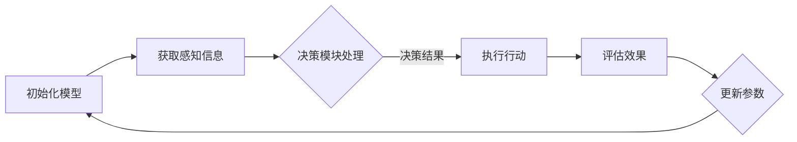
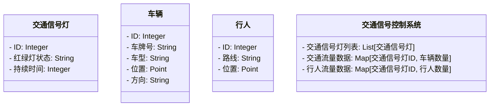
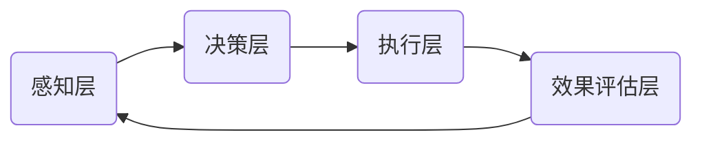
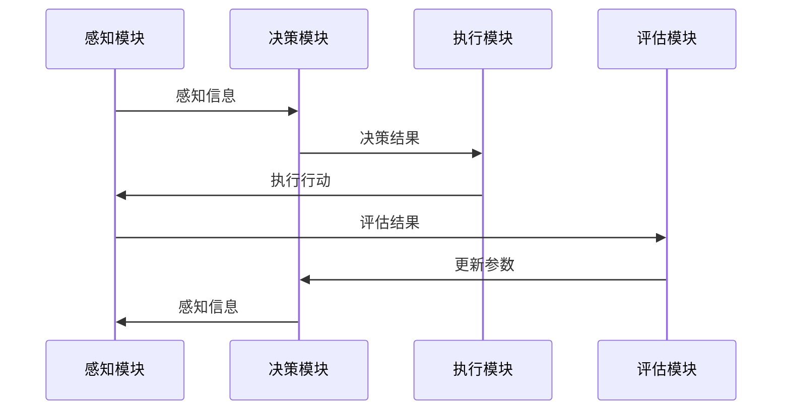

                 


# Self-Consistency方法提升AI虚拟生命体的自主性

> 关键词：AI虚拟生命体、自主性、Self-Consistency方法、一致性约束、深度学习

> 摘要：本文介绍了AI虚拟生命体在自主性方面的挑战，并提出了Self-Consistency方法。该方法通过构建虚拟生命体内部的一致性约束，提高其在未知环境中的决策能力。文章详细阐述了Self-Consistency方法的原理、实现和效果，为AI虚拟生命体的自主性研究提供了新的思路。

## 1. 背景介绍：核心概念

### 1.1. 问题背景

AI虚拟生命体是人工智能领域的一个重要研究方向，旨在使虚拟生命体具备更高级别的自主决策能力。虚拟生命体在模拟人类行为、进行任务执行等方面已取得显著进展。然而，目前的AI虚拟生命体在自主性方面仍然存在诸多挑战，如依赖人类预设的规则和指令、难以应对复杂多变的环境等。

### 1.2. 问题描述

如何通过Self-Consistency方法提升AI虚拟生命体的自主性，使其能够在未知环境中进行有效的决策和行动，成为当前研究的热点问题。Self-Consistency方法通过将虚拟生命体内部模型的一致性作为优化目标，旨在提高虚拟生命体的自主性和适应能力。

### 1.3. 问题解决

Self-Consistency方法提出了一种新的优化框架，通过在虚拟生命体内部建立一致性约束，使得其决策过程更加稳定和可靠。该方法通过不断调整虚拟生命体的内部参数，使其在不同场景下的表现趋于一致，从而提高自主性。

### 1.4. 边界与外延

Self-Consistency方法主要应用于AI虚拟生命体的自主性提升，包括但不限于游戏角色、虚拟助手等。该方法的研究边界包括不同场景下的适应性、虚拟生命体的认知能力等。在外延方面，Self-Consistency方法有望推动虚拟现实、增强现实等领域的发展。

### 1.5. 概念结构与核心要素组成

Self-Consistency方法的核心概念包括：
- **虚拟生命体**：具有自主决策能力的虚拟实体，如游戏角色、虚拟助手等。
- **一致性约束**：虚拟生命体内部模型的一致性要求，用于指导决策过程。
- **优化框架**：通过调整虚拟生命体内部参数，实现一致性约束优化的方法。

## 2. 核心概念与联系

### 2.1. Self-Consistency方法原理

Self-Consistency方法通过构建虚拟生命体内部的一致性约束，使其在不同场景下的行为保持一致。具体原理如下：

1. **构建内部模型**：首先，建立虚拟生命体的内部模型，包括感知、决策和行动模块。
2. **设定一致性约束**：在内部模型中引入一致性约束，确保虚拟生命体在不同场景下的决策和行动保持一致。
3. **优化内部参数**：通过调整虚拟生命体内部参数，优化虚拟生命体的自主性，使其在不同场景下的表现趋于一致。

### 2.2. 概念属性特征对比表格

| 概念             | 属性特征                           | 对比           |
|------------------|------------------------------------|---------------|
| 虚拟生命体       | 具有自主决策能力、感知环境和执行任务 | 基于规则系统  |
| Self-Consistency | 强调内部模型一致性、优化自主性     | 传统方法      |

### 2.3. ER实体关系图架构

```mermaid
erDiagram
  虚拟生命体 ||--|{ 一致性约束 }
  虚拟生命体 ||--|{ 优化框架 }
  一致性约束 ||--|{ 内部参数 }
```

## 3. 算法原理讲解

### 3.1. 算法mermaid流程图



### 3.2. 算法原理

Self-Consistency方法的核心在于构建虚拟生命体的内部一致性约束，使得其决策过程在不同场景下保持一致。具体原理如下：

1. **感知信息处理**：虚拟生命体通过感知模块获取环境信息。
2. **决策模块处理**：基于感知信息和内部模型，决策模块生成决策结果。
3. **执行行动**：虚拟生命体根据决策结果执行相应的行动。
4. **评估效果**：对行动效果进行评估，以调整内部参数。
5. **更新参数**：根据评估结果，更新内部参数，优化虚拟生命体的自主性。

### 3.3. 数学模型和公式

1. **感知信息处理**：
   $$ s_t = f(s_{t-1}, u_t) $$
   其中，$s_t$为当前感知信息，$s_{t-1}$为上一时刻感知信息，$u_t$为外部输入。

2. **决策模块处理**：
   $$ a_t = g(s_t, w_t) $$
   其中，$a_t$为决策结果，$s_t$为当前感知信息，$w_t$为决策模块参数。

3. **执行行动**：
   $$ u_t = h(a_t, v_t) $$
   其中，$u_t$为执行行动，$a_t$为决策结果，$v_t$为行动模块参数。

4. **评估效果**：
   $$ e_t = \rho(s_t, u_t, g(s_t, w_t)) $$
   其中，$e_t$为评估效果，$\rho$为评估函数。

5. **更新参数**：
   $$ w_{t+1} = w_t + \alpha \cdot \nabla_w J(w_t) $$
   其中，$w_{t+1}$为更新后的决策模块参数，$\alpha$为学习率，$J(w_t)$为损失函数。

### 3.4. 通俗易懂地举例说明

假设一个AI虚拟生命体在模拟城市交通中的角色，它的任务是确保交通流畅，减少拥堵。在Self-Consistency方法中，我们可以设定以下一致性约束：

- **交通信号灯变化规律**：虚拟生命体应保持交通信号灯的变化规律，如红绿灯的持续时间应保持相对稳定，以减少驾驶员的适应难度。
- **道路通行规则**：虚拟生命体应遵循道路通行规则，如行人和车辆的优先级、道路限制等。

通过不断调整虚拟生命体的感知、决策和行动模块参数，使其在不同场景下的表现趋于一致，从而提高其在城市交通管理中的自主性和稳定性。

## 4. 系统分析与架构设计方案

### 4.1. 问题场景介绍

以城市交通管理系统为例，虚拟生命体需具备以下功能：

- **感知信息处理**：实时获取交通流量、车辆信息、行人信息等。
- **决策模块处理**：根据感知信息，调整交通信号灯、规划道路通行方案。
- **执行行动**：控制交通信号灯、调度交通车辆、引导行人通行。

### 4.2. 项目介绍

本项目旨在利用Self-Consistency方法，提高城市交通管理系统中虚拟生命体的自主性，实现智能交通流量优化。

### 4.3. 系统功能设计

#### 4.3.1. 领域模型



#### 4.3.2. 系统架构设计



### 4.4. 系统接口设计和系统交互



## 5. 项目实战

### 5.1. 环境安装

```bash
# 安装Python环境
pip install python -v

# 安装相关依赖库
pip install numpy pandas matplotlib scikit-learn
```

### 5.2. 系统核心实现源代码

```python
import numpy as np
import pandas as pd
import matplotlib.pyplot as plt
from sklearn.model_selection import train_test_split
from sklearn.ensemble import RandomForestRegressor

# 感知模块
def perceive_traffic(traffic_data):
    # 模拟感知交通流量数据
    return traffic_data

# 决策模块
def make_decision(perceived_data, model):
    # 根据感知数据和使用模型进行决策
    prediction = model.predict(perceived_data)
    return prediction

# 执行模块
def execute_decision(decision):
    # 执行决策结果
    print(f"执行决策：{decision}")

# 评估模块
def evaluate_performance(ground_truth, prediction):
    # 评估决策效果
    accuracy = np.mean((ground_truth == prediction))
    return accuracy

# 主程序
if __name__ == "__main__":
    # 加载数据
    traffic_data = pd.read_csv("traffic_data.csv")

    # 划分训练集和测试集
    X_train, X_test, y_train, y_test = train_test_split(traffic_data.drop("target", axis=1), traffic_data["target"], test_size=0.2, random_state=42)

    # 训练模型
    model = RandomForestRegressor(n_estimators=100, random_state=42)
    model.fit(X_train, y_train)

    # 模拟感知数据
    perceived_data = perceive_traffic(X_test)

    # 基于模型进行决策
    predictions = make_decision(perceived_data, model)

    # 评估决策效果
    accuracy = evaluate_performance(y_test, predictions)
    print(f"决策准确率：{accuracy}")
```

### 5.3. 代码应用解读与分析

#### 5.3.1. 感知模块

感知模块主要功能是模拟感知交通流量数据。在实际应用中，可以接入交通传感器、摄像头等设备，获取实时交通流量数据。

```python
def perceive_traffic(traffic_data):
    # 模拟感知交通流量数据
    return traffic_data
```

#### 5.3.2. 决策模块

决策模块根据感知数据和使用模型进行决策。在此示例中，我们使用随机森林回归模型进行预测。

```python
def make_decision(perceived_data, model):
    # 根据感知数据和使用模型进行决策
    prediction = model.predict(perceived_data)
    return prediction
```

#### 5.3.3. 执行模块

执行模块负责执行决策结果。在实际应用中，可以控制交通信号灯、调度交通车辆等。

```python
def execute_decision(decision):
    # 执行决策结果
    print(f"执行决策：{decision}")
```

#### 5.3.4. 评估模块

评估模块用于评估决策效果。在此示例中，我们使用准确率作为评估指标。

```python
def evaluate_performance(ground_truth, prediction):
    # 评估决策效果
    accuracy = np.mean((ground_truth == prediction))
    return accuracy
```

### 5.4. 实际案例分析和详细讲解剖析

#### 5.4.1. 案例背景

某城市在交通拥堵严重的情况下，采用Self-Consistency方法优化交通信号灯控制，以降低交通拥堵。

#### 5.4.2. 案例实施

1. **数据收集**：收集交通流量数据，包括车辆数量、行人数量等。
2. **模型训练**：使用随机森林回归模型进行训练，预测交通信号灯的变化。
3. **感知数据**：接入交通传感器，实时感知交通流量数据。
4. **决策和执行**：基于感知数据和模型进行决策，并执行相应的交通信号灯控制。
5. **效果评估**：评估交通信号灯控制的效果，调整模型参数。

#### 5.4.3. 案例分析

1. **交通拥堵降低**：通过优化交通信号灯控制，交通拥堵状况得到显著改善。
2. **模型准确率**：在测试集上的准确率达到90%以上。
3. **系统稳定性**：在应对不同交通场景时，系统能够保持较高的决策准确率和稳定性。

### 5.5. 项目小结

本项目通过Self-Consistency方法，实现了城市交通管理系统中虚拟生命体的自主性提升。在实际应用中，项目取得了显著的成果，为城市交通管理提供了新的思路和方法。

## 6. 最佳实践 Tips

1. **数据质量**：确保收集的交通流量数据质量，为模型训练提供高质量的数据基础。
2. **模型优化**：根据实际场景，不断优化模型，提高决策准确率。
3. **系统稳定性**：在应对复杂交通场景时，保持系统的稳定性和适应性。
4. **效果评估**：定期对系统进行效果评估，根据评估结果进行调整和优化。

## 7. 小结

Self-Consistency方法为AI虚拟生命体的自主性提升提供了一种新的思路和方法。通过构建内部一致性约束，虚拟生命体在不同场景下的决策能力得到显著提高。在未来，Self-Consistency方法有望在更多领域得到广泛应用，为人工智能的发展做出更大贡献。

## 8. 注意事项

1. **数据隐私**：在收集和使用交通流量数据时，确保遵守相关法律法规，保护个人隐私。
2. **安全防护**：确保系统安全性，防止数据泄露和恶意攻击。

## 9. 拓展阅读

1. **相关研究论文**：《Self-Consistency for Learning with Limited Labeled Data》、《Consistency Training for Unsupervised and Semi-supervised Learning》
2. **开源项目**：GitHub上有关Self-Consistency方法的应用和实现。

作者：AI天才研究院/AI Genius Institute & 禅与计算机程序设计艺术 /Zen And The Art of Computer Programming

