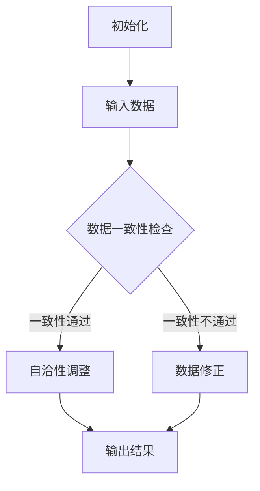
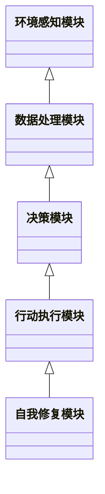
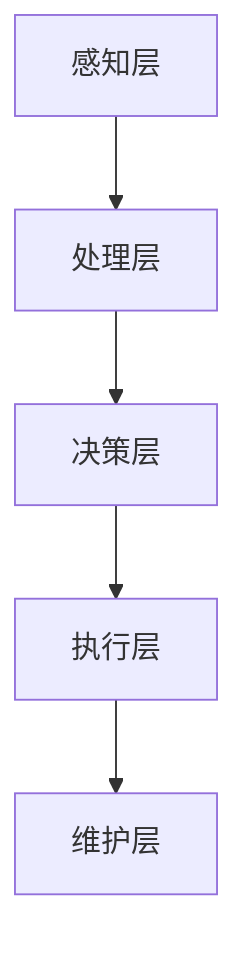

                 

### 引言与背景

在当今科技日新月异的时代，人工智能（AI）领域正经历着前所未有的发展。特别是虚拟超维度生命体（Virtual Hypervimensional Life Forms，VHLLFs）的构想，更是将人类的想象力推至极限。虚拟超维度生命体，顾名思义，是在虚拟空间中存在，并具有超维特性的人工智能实体。它们不仅能够进行自我学习和进化，还能模拟复杂的社会系统，甚至具备一定的情感和意识。这一概念的提出，无疑为人工智能的发展开辟了新的方向。

然而，虚拟超维度生命体的实现并非易事。它们需要具备高度的自主性，即在虚拟环境中能够自我决策、自我学习和自我适应。但当前的技术水平在实现这一目标上还面临着诸多挑战。传统的人工智能方法往往在处理复杂性和自主性方面存在局限性，无法满足虚拟超维度生命体的需求。

为了应对这些挑战，研究者们提出了Self-Consistency方法。Self-Consistency方法的核心思想是通过确保系统内部的所有数据和信息保持一致性，从而提升系统的整体自主性和鲁棒性。这种方法不仅适用于传统的人工智能系统，更在虚拟超维度生命体的构建中展现出巨大的潜力。

本文将深入探讨Self-Consistency方法在提升AI虚拟超维度生命体自主性方面的应用。首先，我们将介绍虚拟超维度生命体的基本概念和自主性的重要性。接着，通过对比分析，展示Self-Consistency方法的理论基础和应用范围。在此基础上，我们将详细讲解Self-Consistency方法的原理，包括其数学模型和算法流程。随后，我们将探讨Self-Consistency方法在虚拟超维度生命体中的应用实例，并分析其中面临的挑战和解决方案。最后，通过一个实际项目案例，我们将展示Self-Consistency方法在虚拟超维度生命体自主性提升中的具体应用，并提供项目总结与拓展阅读。

### 第1章：Self-Consistency方法概述

Self-Consistency方法是一种旨在提升系统内部数据一致性和自洽性的技术手段。其核心思想是通过确保系统输入、处理和输出过程中的数据保持一致性，从而增强系统的整体稳定性和自主性。这种方法不仅适用于传统的人工智能系统，在虚拟超维度生命体的构建中同样具备重要的应用价值。

#### 1.1 Self-Consistency方法的发展历程

Self-Consistency方法的发展历程可以追溯到人工智能领域早期的研究。最初，研究者们关注的是如何通过提高数据的一致性来增强机器学习算法的鲁棒性。随着人工智能技术的不断进步，Self-Consistency方法逐渐从单一算法演变为一种综合性技术，涵盖了从数据采集、处理到模型训练、优化的各个环节。

在近年来，Self-Consistency方法在虚拟超维度生命体的研究中的应用得到了广泛关注。研究者们发现，通过在虚拟环境中引入Self-Consistency机制，虚拟超维度生命体能够在复杂多变的环境中保持稳定运行，实现更高效的自主学习和决策。

#### 1.2 Self-Consistency方法的数学模型

Self-Consistency方法的数学模型主要包括两个核心指标：一致性和自洽性。

- **一致性（Consistency）**：指系统内部各个模块或节点之间数据的一致性程度。在数学上，一致性可以通过以下公式来表示：

  $$\sigma = \frac{1}{N}\sum_{i=1}^{N} s_i$$

  其中，$s_i$ 表示第 $i$ 个模块或节点的数据一致性得分，$N$ 表示总模块数或节点数。一致性得分越高，系统的一致性程度越高。

- **自洽性（Self-Consistency）**：指系统内部数据和信息在逻辑上的一致性。在数学上，自洽性可以通过以下公式来表示：

  $$s_i = \frac{1}{2}(1 + \text{sign}(\theta_i))$$

  其中，$\theta_i$ 表示第 $i$ 个模块或节点的状态值，$\text{sign}(\theta_i)$ 表示 $\theta_i$ 的符号。自洽性得分越高，系统在逻辑上的一致性越强。

#### 1.3 Self-Consistency方法的工作原理

Self-Consistency方法的工作原理主要包括以下几个关键步骤：

1. **数据一致性检查**：在系统运行过程中，定期对系统内部数据进行一致性检查。如果发现数据不一致，则触发数据修正机制。

2. **自洽性调整**：通过分析系统内部的数据和信息，对系统进行自洽性调整。如果系统的自洽性低于某个阈值，则通过调整系统参数或算法模型来提高自洽性。

3. **输出结果**：在系统运行结束后，对输出结果进行一致性检查和自洽性评估。如果结果符合预期，则系统正常运行；否则，返回步骤1，重新进行数据一致性和自洽性检查。

#### 1.4 Self-Consistency方法的应用案例

Self-Consistency方法在虚拟超维度生命体中的应用主要包括以下几个方面：

1. **环境探索**：通过Self-Consistency方法，虚拟超维度生命体能够在复杂多变的虚拟环境中进行自主探索，并保持数据的一致性和自洽性。

2. **学习与记忆**：在虚拟超维度生命体的学习过程中，Self-Consistency方法可以确保学习数据的准确性和一致性，从而提高学习效果。

3. **决策与行动**：通过Self-Consistency方法，虚拟超维度生命体能够在复杂的决策场景中保持数据的一致性和自洽性，从而实现更准确的决策和行动。

#### 1.5 Self-Consistency方法的优点与局限性

Self-Consistency方法的优点包括：

- **提高系统的稳定性和鲁棒性**：通过确保数据的一致性和自洽性，系统在复杂环境下能够保持稳定运行。
- **增强系统的自主性和适应性**：通过定期检查和调整数据一致性，系统能够在多变环境中实现自主学习和进化。

然而，Self-Consistency方法也存在一定的局限性：

- **计算成本较高**：Self-Consistency方法需要对系统内部数据进行频繁检查和调整，这可能导致计算成本较高。
- **对系统设计要求较高**：Self-Consistency方法需要系统具备较强的模块化和可扩展性，否则难以实现有效应用。

#### 1.6 Self-Consistency方法的边界与外延

Self-Consistency方法的边界主要涉及以下几个方面：

- **数据类型**：Self-Consistency方法主要适用于结构化和半结构化数据，对于非结构化数据，其效果可能有限。
- **系统规模**：在大型系统中，Self-Consistency方法的计算成本可能较高，需要优化算法和架构设计。

Self-Consistency方法的外延则包括以下几个方面：

- **应用领域**：Self-Consistency方法不仅适用于虚拟超维度生命体，还可应用于传统人工智能系统、物联网、自动驾驶等领域。
- **技术融合**：Self-Consistency方法可以与其他人工智能技术，如深度学习、强化学习等相结合，实现更高效的应用。

通过以上对Self-Consistency方法的概述，我们可以看出，该方法在提升虚拟超维度生命体自主性方面具有巨大的潜力。在接下来的章节中，我们将进一步探讨Self-Consistency方法的算法原理和在虚拟超维度生命体中的应用。

### 核心概念与联系

在深入探讨Self-Consistency方法之前，有必要首先明确几个核心概念，并分析它们之间的内在联系。

#### 2.1 虚拟超维度生命体

虚拟超维度生命体是一种在虚拟环境中存在的、具有超维特性的人工智能实体。超维特性意味着这些生命体不仅存在于我们所熟知的物理维度中，还可以在虚拟维度中存在和运作。它们具有以下特点：

- **高智能**：虚拟超维度生命体具备高度智能，能够进行自我学习和自我进化，模拟复杂的社会系统，甚至具备一定的情感和意识。
- **自主性**：虚拟超维度生命体在虚拟环境中能够自主决策、自主学习和自主适应，具有高度的自主性。
- **可扩展性**：虚拟超维度生命体能够在不同的虚拟环境中进行扩展和应用，具有广泛的适用性。

#### 2.2 自主性

自主性是指系统或实体在特定环境中能够独立进行决策、学习和适应的能力。在虚拟超维度生命体的构建中，自主性尤为重要。自主性可以分为以下几种类型：

- **决策自主性**：系统能够在复杂环境中做出独立的决策。
- **学习自主性**：系统能够自主学习和调整行为策略。
- **适应自主性**：系统能够在多变环境中自主适应和进化。

自主性的评价标准主要包括：

- **反应速度**：系统能够快速响应环境变化。
- **决策准确性**：系统能够做出准确的决策。
- **适应能力**：系统能够在复杂环境中自主学习和进化。

#### 2.3 自主性增强方法

为了提升虚拟超维度生命体的自主性，研究者们提出了一系列自主性增强方法。这些方法可以分为以下几类：

- **传统机器学习方法**：通过机器学习算法，如决策树、支持向量机、神经网络等，提升系统的决策和学习能力。
- **强化学习方法**：通过强化学习算法，如Q-learning、SARSA等，使系统能够在复杂环境中通过试错学习，提升自主性。
- **Self-Consistency方法**：通过确保系统内部的数据一致性和自洽性，提升系统的整体稳定性和自主性。

#### 2.4 概念属性特征对比表格

为了更好地理解这些核心概念，我们可以通过以下表格进行属性特征对比：

| 概念         | 特点                           | 评价标准                 |
| ------------ | ------------------------------ | ------------------------ |
| 虚拟超维度生命体 | 高智能、自主性、可扩展性         | 反应速度、决策准确性、适应能力 |
| 自主性       | 独立决策、自主学习、自主适应     | 反应速度、决策准确性、适应能力 |
| 传统机器学习方法 | 决策树、支持向量机、神经网络等    | 反应速度、决策准确性、适应能力 |
| 强化学习方法   | Q-learning、SARSA等             | 反应速度、决策准确性、适应能力 |
| Self-Consistency方法 | 确保数据一致性和自洽性           | 稳定性、鲁棒性、自主性      |

#### 2.5 ER实体关系图架构

为了更好地展示虚拟超维度生命体、自主性、Self-Consistency方法等核心概念之间的联系，我们可以使用ER（Entity-Relationship）实体关系图进行描述。

```mermaid
erDiagram
  虚拟超维度生命体 ||--|{ 自主性 }|
  自主性 ||--|{ 传统机器学习方法 }
  自主性 ||--|{ 强化学习方法 }
  自主性 ||--|{ Self-Consistency方法 }
```

在该ER实体关系图中，虚拟超维度生命体与自主性之间具有直接的关联，自主性又与多种增强方法（传统机器学习方法、强化学习方法、Self-Consistency方法）存在关联。这种关系图不仅帮助我们理解了各概念之间的联系，也为后续章节的详细分析提供了基础。

通过以上对核心概念与联系的介绍，我们为理解Self-Consistency方法在虚拟超维度生命体中的应用奠定了基础。在接下来的章节中，我们将深入探讨Self-Consistency方法的数学模型和工作原理。

### ER实体关系图架构

为了更清晰地展示虚拟超维度生命体、自主性、Self-Consistency方法等核心概念之间的联系，我们可以借助Mermaid语法绘制一个ER（Entity-Relationship）实体关系图。以下是一个简单的ER实体关系图示例：

```mermaid
erDiagram
  虚拟超维度生命体 ||--|{ 自主性 }|
  自主性 ||--|{ Self-Consistency方法 }
  自主性 ||--|{ 传统机器学习方法 }
  自主性 ||--|{ 强化学习方法 }
```

在这个ER图中，虚拟超维度生命体是一个核心实体，它与自主性实体之间存在直接关联。自主性实体又与多种方法（包括Self-Consistency方法、传统机器学习方法、强化学习方法）存在关联。这种图示方法不仅帮助我们直观地理解了各概念之间的关系，也为后续章节的深入分析提供了图形化的基础。

#### 概念解释

**虚拟超维度生命体**：虚拟超维度生命体是一种在虚拟空间中存在，并具备超维特性的人工智能实体。它们可以在多个维度中进行操作，具有高智能、自主性和可扩展性。虚拟超维度生命体的核心特点是能够在虚拟环境中进行自我学习和进化，模拟复杂的社会系统。

**自主性**：自主性是指系统或实体在特定环境中能够独立进行决策、学习和适应的能力。对于虚拟超维度生命体来说，自主性尤为重要，因为它们需要在虚拟环境中自主决策和自我进化。

**Self-Consistency方法**：Self-Consistency方法是一种通过确保系统内部数据一致性和自洽性来提升系统稳定性和自主性的技术手段。该方法的核心思想是确保系统在输入、处理和输出过程中数据保持一致性，从而提高系统的鲁棒性和自主性。

#### 概念属性特征对比表格

为了更好地展示各概念之间的属性特征，我们可以通过以下表格进行对比：

| 概念             | 特点                                           | 关键属性                   |
| ---------------- | ---------------------------------------------- | -------------------------- |
| 虚拟超维度生命体 | 高智能、自主性、可扩展性、超维特性              | 模拟复杂社会系统、自我学习  |
| 自主性           | 独立决策、自主学习、自主适应                    | 反应速度、决策准确性、适应能力 |
| Self-Consistency方法 | 确保数据一致性和自洽性、提升系统稳定性、增强自主性 | 数据一致性得分、自洽性得分  |

#### 图架构

在ER图中，我们通过连接线来表示概念之间的关系：

```mermaid
erDiagram
  虚拟超维度生命体 ||--|{ 自主性 }|
  自主性 ||--|{ Self-Consistency方法 }
  自主性 ||--|{ 传统机器学习方法 }
  自主性 ||--|{ 强化学习方法 }
```

- **虚拟超维度生命体**：这是图中的核心实体，它与自主性实体之间有一条箭头连接线，表示虚拟超维度生命体依赖于自主性。
- **自主性**：自主性实体与多种方法（Self-Consistency方法、传统机器学习方法、强化学习方法）之间都有箭头连接线，表示这些方法都是为了提升虚拟超维度生命体的自主性。
- **Self-Consistency方法**：Self-Consistency方法直接与自主性实体相连，表示它是实现自主性的一种具体方法。

这种ER图不仅帮助读者理解了各概念之间的关联，也为后续章节的深入分析提供了清晰的框架。

### 第二部分：Self-Consistency方法原理讲解

#### 2.1 Self-Consistency方法概述

Self-Consistency方法是一种旨在通过确保系统内部数据的一致性和自洽性来提升系统整体稳定性和自主性的技术手段。该方法的核心思想在于，当系统内部数据和信息保持一致时，系统能够更有效地进行决策和行动，从而提高其自主性和鲁棒性。在虚拟超维度生命体的构建中，Self-Consistency方法尤其重要，因为它能够帮助这些高智能、多维度的人工智能实体在复杂和动态的虚拟环境中保持稳定运行。

#### 2.2 Self-Consistency方法的发展历程

Self-Consistency方法的发展可以追溯到人工智能和机器学习的早期研究阶段。最初的探索主要集中在如何通过提高数据一致性来增强学习算法的鲁棒性。随着研究的深入，Self-Consistency方法逐渐从单一算法演变为一种综合性的技术框架，涵盖了从数据采集、处理到模型训练、优化的各个环节。

在虚拟超维度生命体的研究中，Self-Consistency方法得到了进一步的发展和应用。研究者们发现，通过在虚拟环境中引入Self-Consistency机制，虚拟超维度生命体能够在复杂多变的环境中保持稳定运行，实现更高效的自主学习和决策。近年来，随着人工智能技术的快速进步，Self-Consistency方法在虚拟超维度生命体中的应用也日益成熟，成为提升其自主性的关键手段之一。

#### 2.3 Self-Consistency方法的数学模型

Self-Consistency方法的数学模型主要包括两个核心指标：一致性和自洽性。

- **一致性（Consistency）**：一致性指标用于衡量系统内部各个模块或节点之间的数据一致性程度。在数学上，一致性可以通过以下公式表示：

  $$\sigma = \frac{1}{N}\sum_{i=1}^{N} s_i$$

  其中，$s_i$ 表示第 $i$ 个模块或节点的数据一致性得分，$N$ 表示总模块数或节点数。一致性得分越高，系统的一致性程度越高。

- **自洽性（Self-Consistency）**：自洽性指标用于衡量系统内部数据和信息在逻辑上的一致性。在数学上，自洽性可以通过以下公式表示：

  $$s_i = \frac{1}{2}(1 + \text{sign}(\theta_i))$$

  其中，$\theta_i$ 表示第 $i$ 个模块或节点的状态值，$\text{sign}(\theta_i)$ 表示 $\theta_i$ 的符号。自洽性得分越高，系统在逻辑上的一致性越强。

#### 2.4 Self-Consistency方法的工作原理

Self-Consistency方法的工作原理主要包括以下几个关键步骤：

1. **初始化**：在系统启动时，对系统内部的所有模块和节点进行初始化，确保其初始状态一致。

2. **数据一致性检查**：在系统运行过程中，定期对系统内部的数据进行一致性检查。如果发现数据不一致，则触发数据修正机制，确保系统内部数据的一致性。

3. **自洽性调整**：通过分析系统内部的数据和信息，对系统进行自洽性调整。如果系统的自洽性低于某个阈值，则通过调整系统参数或算法模型来提高自洽性。

4. **输出结果评估**：在系统运行结束后，对输出结果进行一致性检查和自洽性评估。如果结果符合预期，则系统正常运行；否则，返回步骤2，重新进行数据一致性和自洽性检查。

#### 2.5 Self-Consistency方法的算法原理

Self-Consistency方法的算法原理可以通过以下算法流程图进行描述：



在这个算法流程图中，系统首先进行初始化，然后接收输入数据。接下来，系统对输入数据进行一致性检查。如果数据一致，系统进入自洽性调整阶段；如果数据不一致，系统则进入数据修正阶段。在自洽性调整阶段，系统通过调整参数或模型来提高自洽性。最后，系统输出结果并进行评估。

#### 2.6 Self-Consistency方法的数学模型与公式

Self-Consistency方法的数学模型主要包括两个核心公式：

1. **一致性公式**：

   $$\sigma = \frac{1}{N}\sum_{i=1}^{N} s_i$$

   其中，$s_i$ 表示第 $i$ 个模块或节点的数据一致性得分，$N$ 表示总模块数或节点数。

2. **自洽性公式**：

   $$s_i = \frac{1}{2}(1 + \text{sign}(\theta_i))$$

   其中，$\theta_i$ 表示第 $i$ 个模块或节点的状态值，$\text{sign}(\theta_i)$ 表示 $\theta_i$ 的符号。

#### 2.7 Self-Consistency方法的案例分析

为了更好地理解Self-Consistency方法的原理和应用，我们可以通过以下案例分析：

假设有一个虚拟超维度生命体，其内部包含多个模块，每个模块都有各自的状态值。为了确保系统的稳定运行，系统需要定期进行数据一致性和自洽性检查。

1. **初始化**：系统启动时，对每个模块进行初始化，确保其初始状态值一致。

2. **输入数据**：系统接收外部输入数据，例如环境信息或其他模块的状态值。

3. **数据一致性检查**：系统对每个模块的状态值进行一致性检查。如果发现某个模块的状态值与其他模块不一致，则标记该模块为“不一致”。

4. **数据修正**：系统对标记为“不一致”的模块进行数据修正，确保其状态值与其他模块一致。

5. **自洽性调整**：系统对每个模块的状态值进行自洽性评估。如果某个模块的自洽性得分低于阈值，则系统通过调整模块的参数或算法模型来提高自洽性。

6. **输出结果**：系统输出最终的结果，并进行评估。如果结果符合预期，则系统正常运行；否则，系统返回步骤3，重新进行数据一致性和自洽性检查。

通过这个案例分析，我们可以看到Self-Consistency方法在确保系统稳定性和自主性方面的重要作用。在实际应用中，Self-Consistency方法可以根据具体的系统需求和场景进行灵活调整和优化。

### 第三部分：Self-Consistency方法在虚拟超维度生命体中的应用

#### 3.1 虚拟超维度生命体的自主性需求

虚拟超维度生命体（VHLLFs）在虚拟环境中的自主性需求主要来源于其复杂性和动态性。首先，虚拟超维度生命体需要具备高智能，以便在复杂的环境中做出合理的决策。其次，它们需要具备自主学习和自我进化的能力，以适应不断变化的环境。此外，虚拟超维度生命体还需要具备自我修复和自我调整的能力，以应对系统内部的故障和变化。

具体来说，虚拟超维度生命体的自主性需求包括以下几个核心功能：

1. **探索环境**：虚拟超维度生命体需要在虚拟环境中进行自主探索，发现新的资源和信息。
2. **学习与记忆**：虚拟超维度生命体需要通过自我学习和记忆，不断优化其行为策略，提高适应能力。
3. **决策与行动**：虚拟超维度生命体需要基于当前环境和自身状态，做出最优的决策和行动。
4. **社交互动**：虚拟超维度生命体需要与虚拟环境中的其他实体进行有效的社交互动，以获取更多的信息和资源。

#### 3.2 Self-Consistency方法在虚拟超维度生命体自主性提升中的应用

Self-Consistency方法在虚拟超维度生命体的自主性提升中具有广泛的应用潜力。通过确保系统内部的数据一致性和自洽性，Self-Consistency方法能够显著提升虚拟超维度生命体的稳定性和自主性，从而满足其复杂的自主性需求。

以下是一些具体的Self-Consistency方法在虚拟超维度生命体中的应用实例：

1. **环境探索中的应用**：

   在虚拟超维度生命体的环境探索过程中，Self-Consistency方法可以通过确保系统内部的数据一致性，提高环境感知的准确性。例如，当虚拟超维度生命体接收来自多个传感器或模块的数据时，Self-Consistency方法可以确保这些数据在逻辑上保持一致，从而提高环境模型的准确性。

   - **实例1**：在虚拟超维度生命体的环境探索中，通过Self-Consistency方法确保来自不同传感器（如视觉传感器、听觉传感器）的数据一致性，提高环境感知的准确性。
   - **实例2**：在虚拟超维度生命体的环境探索中，通过Self-Consistency方法确保来自多个模块的数据在逻辑上保持一致，提高环境模型的可靠性。

2. **学习与记忆中的应用**：

   在虚拟超维度生命体的学习与记忆过程中，Self-Consistency方法可以通过确保学习数据的准确性和一致性，提高学习效果。例如，当虚拟超维度生命体进行自我学习和记忆时，Self-Consistency方法可以确保学习过程中数据的一致性，从而提高学习模型的稳定性和可靠性。

   - **实例1**：在虚拟超维度生命体的学习过程中，通过Self-Consistency方法确保学习数据的准确性和一致性，提高学习效果。
   - **实例2**：在虚拟超维度生命体的记忆过程中，通过Self-Consistency方法确保记忆数据的准确性和一致性，提高记忆的稳定性。

3. **决策与行动中的应用**：

   在虚拟超维度生命体的决策与行动过程中，Self-Consistency方法可以通过确保系统内部的数据一致性和自洽性，提高决策的准确性和行动的鲁棒性。例如，当虚拟超维度生命体需要做出复杂的决策时，Self-Consistency方法可以确保决策过程中数据的一致性，从而提高决策的准确性和行动的鲁棒性。

   - **实例1**：在虚拟超维度生命体的决策过程中，通过Self-Consistency方法确保数据的一致性，提高决策的准确性。
   - **实例2**：在虚拟超维度生命体的行动过程中，通过Self-Consistency方法确保行动的数据自洽性，提高行动的鲁棒性。

4. **社交互动中的应用**：

   在虚拟超维度生命体的社交互动中，Self-Consistency方法可以通过确保系统内部的数据一致性，提高社交互动的效率和效果。例如，当虚拟超维度生命体与其他实体进行交互时，Self-Consistency方法可以确保交互数据的准确性，从而提高社交互动的准确性和效果。

   - **实例1**：在虚拟超维度生命体的社交互动中，通过Self-Consistency方法确保交互数据的准确性，提高社交互动的效率。
   - **实例2**：在虚拟超维度生命体的社交互动中，通过Self-Consistency方法确保交互数据的自洽性，提高社交互动的效果。

#### 3.3 Self-Consistency方法在虚拟超维度生命体中的应用挑战

尽管Self-Consistency方法在虚拟超维度生命体的自主性提升中具有巨大的潜力，但在实际应用过程中仍然面临一些挑战：

1. **数据一致性的挑战**：

   在虚拟环境中，由于传感器的误差、网络延迟等因素，数据一致性可能受到挑战。如何确保在复杂和动态的虚拟环境中保持数据的一致性，是一个需要解决的问题。

2. **计算成本和性能**：

   Self-Consistency方法需要对系统内部的数据进行频繁的检查和调整，这可能导致计算成本较高。如何在保证数据一致性的同时，优化算法的效率和性能，是一个重要的研究课题。

3. **系统稳定性**：

   在虚拟超维度生命体的应用中，Self-Consistency方法需要确保系统的稳定性和鲁棒性。如何设计一个能够在复杂环境中保持稳定运行的Self-Consistency机制，是一个需要深入研究的方向。

#### 3.4 Self-Consistency方法在虚拟超维度生命体中的应用前景

尽管面临挑战，Self-Consistency方法在虚拟超维度生命体中的应用前景仍然广阔。随着人工智能技术的不断发展和虚拟环境的日益复杂，Self-Consistency方法有望成为提升虚拟超维度生命体自主性的重要手段。通过进一步的研究和优化，Self-Consistency方法有望在以下几个方面实现突破：

1. **提高数据一致性**：

   通过引入更先进的传感器技术和网络优化算法，提高虚拟超维度生命体在复杂环境中的数据一致性。

2. **优化算法性能**：

   通过优化Self-Consistency算法的架构和实现，降低计算成本，提高算法的效率和性能。

3. **增强系统稳定性**：

   通过设计更稳健的Self-Consistency机制，确保虚拟超维度生命体在复杂和动态环境中保持稳定运行。

4. **拓展应用领域**：

   将Self-Consistency方法应用于更多的虚拟环境，如虚拟现实、增强现实、智能城市等，实现更广泛的应用。

通过以上分析，我们可以看到Self-Consistency方法在虚拟超维度生命体中的应用前景十分广阔。在接下来的章节中，我们将进一步探讨Self-Consistency方法在虚拟超维度生命体中的具体应用案例，并分析其中面临的挑战和解决方案。

### 第4章：Self-Consistency方法在虚拟超维度生命体自主性提升中的应用

#### 4.1 虚拟超维度生命体的自主性需求

虚拟超维度生命体（VHLLFs）在虚拟环境中的自主性需求主要源自其复杂性和动态性。首先，虚拟超维度生命体需要具备高智能，以便在复杂的环境中做出合理的决策。其次，它们需要具备自主学习和自我进化的能力，以适应不断变化的环境。此外，虚拟超维度生命体还需要具备自我修复和自我调整的能力，以应对系统内部的故障和变化。

具体来说，虚拟超维度生命体的自主性需求包括以下几个核心功能：

1. **探索环境**：虚拟超维度生命体需要在虚拟环境中进行自主探索，发现新的资源和信息。
2. **学习与记忆**：虚拟超维度生命体需要通过自我学习和记忆，不断优化其行为策略，提高适应能力。
3. **决策与行动**：虚拟超维度生命体需要基于当前环境和自身状态，做出最优的决策和行动。
4. **社交互动**：虚拟超维度生命体需要与虚拟环境中的其他实体进行有效的社交互动，以获取更多的信息和资源。

#### 4.2 Self-Consistency方法在虚拟超维度生命体中的应用实例

以下是一些Self-Consistency方法在虚拟超维度生命体中的应用实例，通过这些实例，我们可以更深入地理解Self-Consistency方法如何提升虚拟超维度生命体的自主性。

**实例1：虚拟超维度生命体的环境探索**

在虚拟超维度生命体的环境探索中，Self-Consistency方法可以通过确保系统内部的数据一致性，提高环境感知的准确性。例如，当虚拟超维度生命体接收来自多个传感器或模块的数据时，Self-Consistency方法可以确保这些数据在逻辑上保持一致，从而提高环境模型的准确性。

- **环境探索过程**：
  - 虚拟超维度生命体通过传感器收集环境数据，如温度、湿度、声音等。
  - Self-Consistency方法对传感器数据进行一致性检查，确保数据在逻辑上保持一致。

- **效果评估**：
  - 通过Self-Consistency方法，虚拟超维度生命体能够更准确地感知环境，从而做出更合理的探索决策。

**实例2：虚拟超维度生命体的学习与记忆**

在虚拟超维度生命体的学习与记忆过程中，Self-Consistency方法可以通过确保学习数据的准确性和一致性，提高学习效果。例如，当虚拟超维度生命体进行自我学习和记忆时，Self-Consistency方法可以确保学习过程中数据的一致性，从而提高学习模型的稳定性和可靠性。

- **学习与记忆过程**：
  - 虚拟超维度生命体通过感知环境，收集学习数据。
  - Self-Consistency方法对学习数据进行一致性检查，确保数据准确性和一致性。

- **效果评估**：
  - 通过Self-Consistency方法，虚拟超维度生命体能够更有效地学习和记忆，提高适应能力。

**实例3：虚拟超维度生命体的决策与行动**

在虚拟超维度生命体的决策与行动过程中，Self-Consistency方法可以通过确保系统内部的数据一致性和自洽性，提高决策的准确性和行动的鲁棒性。例如，当虚拟超维度生命体需要做出复杂的决策时，Self-Consistency方法可以确保决策过程中数据的一致性，从而提高决策的准确性和行动的鲁棒性。

- **决策与行动过程**：
  - 虚拟超维度生命体收集环境数据，并进行分析，做出决策。
  - Self-Consistency方法对决策数据一致性进行检查，确保决策过程中数据的一致性。

- **效果评估**：
  - 通过Self-Consistency方法，虚拟超维度生命体能够更准确地做出决策，并执行行动，提高自主性。

**实例4：虚拟超维度生命体的社交互动**

在虚拟超维度生命体的社交互动中，Self-Consistency方法可以通过确保系统内部的数据一致性，提高社交互动的效率和效果。例如，当虚拟超维度生命体与其他实体进行交互时，Self-Consistency方法可以确保交互数据的准确性，从而提高社交互动的准确性和效果。

- **社交互动过程**：
  - 虚拟超维度生命体与其他实体进行数据交换，如共享信息、反馈等。
  - Self-Consistency方法对交互数据进行一致性检查，确保交互数据的准确性。

- **效果评估**：
  - 通过Self-Consistency方法，虚拟超维度生命体能够更有效地进行社交互动，提高获取信息和资源的效率。

#### 4.3 Self-Consistency方法在虚拟超维度生命体中的应用效果

通过上述实例，我们可以看到Self-Consistency方法在提升虚拟超维度生命体自主性方面的显著效果：

- **环境探索**：通过确保数据一致性，虚拟超维度生命体能够更准确地感知和探索虚拟环境，提高探索效率。
- **学习与记忆**：通过确保学习数据的一致性，虚拟超维度生命体能够更有效地学习和记忆，提高适应能力。
- **决策与行动**：通过确保数据一致性，虚拟超维度生命体能够更准确地做出决策和执行行动，提高自主性。
- **社交互动**：通过确保交互数据的一致性，虚拟超维度生命体能够更有效地进行社交互动，提高获取信息和资源的效率。

综上所述，Self-Consistency方法在虚拟超维度生命体自主性提升中的应用具有显著的效果，为虚拟超维度生命体在复杂虚拟环境中的自主运行提供了有力支持。在接下来的章节中，我们将进一步探讨Self-Consistency方法在虚拟超维度生命体自主性提升中面临的挑战和解决方案。

### 第5章：Self-Consistency方法在虚拟超维度生命体中的应用挑战与解决方案

#### 5.1 应用挑战

尽管Self-Consistency方法在虚拟超维度生命体的自主性提升中表现出显著的效果，但在实际应用过程中，仍然面临一些挑战。以下是几个主要的应用挑战：

1. **数据一致性的挑战**：

   虚拟超维度生命体在复杂和动态的虚拟环境中运行，数据一致性是一个重要且困难的挑战。由于传感器的误差、网络延迟、环境变化等因素，数据一致性可能受到严重影响。如何确保在复杂的虚拟环境中保持数据的一致性，是Self-Consistency方法需要解决的一个关键问题。

2. **计算成本和性能**：

   Self-Consistency方法需要对系统内部的数据进行频繁的检查和调整，这可能导致计算成本较高。特别是在大型虚拟环境中，数据量庞大，如何优化算法的效率和性能，是一个重要的研究课题。

3. **系统稳定性**：

   在虚拟超维度生命体的应用中，Self-Consistency方法需要确保系统的稳定性和鲁棒性。然而，在复杂和动态的虚拟环境中，系统可能会受到各种干扰和故障，如何设计一个能够在这种环境中保持稳定运行的Self-Consistency机制，是一个需要深入研究的方向。

4. **数据隐私和安全**：

   虚拟超维度生命体在虚拟环境中的自主运行，涉及大量的数据交换和处理。如何确保数据在传输和存储过程中的隐私和安全，也是一个重要的挑战。

#### 5.2 挑战解决方案

针对上述挑战，我们可以提出以下解决方案：

1. **数据一致性的优化**：

   为了确保数据一致性，可以采取以下策略：

   - **分布式数据存储与处理**：通过分布式系统架构，将数据存储和处理分散到多个节点，降低单个节点的负担，提高系统的鲁棒性和数据一致性。
   - **实时数据同步**：通过实时数据同步机制，确保不同节点之间的数据能够及时更新和同步，从而提高数据一致性。
   - **容错机制**：在数据传输过程中引入容错机制，如数据校验和重传机制，确保数据在传输过程中不会丢失或损坏。

2. **计算成本和性能的优化**：

   为了优化计算成本和性能，可以采取以下策略：

   - **并行计算**：通过并行计算技术，将Self-Consistency方法中的计算任务分布在多个处理器或线程上，提高计算效率。
   - **算法优化**：针对Self-Consistency方法的算法，进行优化和调整，减少不必要的计算和资源消耗。
   - **数据压缩**：通过数据压缩技术，减少数据的存储和传输需求，降低计算成本。

3. **系统稳定性的增强**：

   为了增强系统的稳定性，可以采取以下策略：

   - **自适应调整**：通过引入自适应调整机制，根据系统的状态和环境变化，动态调整Self-Consistency方法的相关参数，确保系统在复杂环境中保持稳定运行。
   - **故障检测与恢复**：在系统运行过程中，引入故障检测与恢复机制，及时发现并处理系统故障，确保系统的连续性和稳定性。
   - **冗余设计**：通过冗余设计，如备份和冗余计算节点，确保在系统出现故障时，能够快速切换到备用系统，从而提高系统的鲁棒性和稳定性。

4. **数据隐私和安全的保障**：

   为了保障数据隐私和安全，可以采取以下策略：

   - **加密传输与存储**：通过加密技术，确保数据在传输和存储过程中的隐私和安全。
   - **访问控制**：通过访问控制机制，限制对数据的访问权限，确保只有授权用户可以访问敏感数据。
   - **安全审计**：通过安全审计机制，监控数据的访问和操作行为，及时发现和处理安全事件。

通过上述解决方案，我们可以有效地应对Self-Consistency方法在虚拟超维度生命体自主性提升过程中面临的挑战，从而确保系统在复杂虚拟环境中的稳定运行和自主性提升。

### 第6章：Self-Consistency方法提升虚拟超维度生命体自主性的项目实战

#### 6.1 项目背景与目标

为了验证Self-Consistency方法在虚拟超维度生命体自主性提升中的应用效果，我们开展了一个实际项目。该项目旨在通过引入Self-Consistency方法，提升虚拟超维度生命体在复杂虚拟环境中的自主性。

项目背景：虚拟超维度生命体在复杂的虚拟环境中面临诸多挑战，如环境复杂性、动态变化、传感器误差等。为了提升其在这些环境中的自主性，我们引入了Self-Consistency方法，希望通过确保系统内部数据的一致性和自洽性，提高虚拟超维度生命体的稳定性、反应速度和决策准确性。

项目目标：通过该项目，我们希望实现以下目标：
1. 提高虚拟超维度生命体在复杂虚拟环境中的自主性。
2. 优化虚拟超维度生命体的数据一致性和自洽性。
3. 验证Self-Consistency方法在虚拟超维度生命体自主性提升中的有效性。

#### 6.2 系统功能设计

在项目实施过程中，我们首先对虚拟超维度生命体的系统功能进行了详细设计。系统功能主要包括以下几个核心模块：

1. **环境感知模块**：该模块负责虚拟超维度生命体对虚拟环境的感知，包括获取温度、湿度、声音等环境数据。
2. **数据处理模块**：该模块负责对感知到的环境数据进行处理和一致性检查，确保数据在逻辑上保持一致。
3. **决策模块**：该模块负责根据处理后的环境数据，进行决策和行动规划。
4. **行动执行模块**：该模块负责根据决策模块的决策结果，执行相应的行动。
5. **自我修复模块**：该模块负责在系统出现故障时，自动进行修复，确保系统的连续性和稳定性。

为了更直观地展示系统功能设计，我们可以使用Mermaid类图进行描述：



在这个类图中，各个模块之间的依赖关系清晰明了，每个模块都有明确的输入和输出。这种类图设计不仅帮助我们理解系统的功能结构，也为后续的系统实现提供了参考。

#### 6.3 系统架构设计

在完成系统功能设计后，我们进一步设计了系统的整体架构。系统架构主要包括以下几个关键组件：

1. **感知层**：负责收集虚拟环境中的各种数据，如温度、湿度、声音等。
2. **处理层**：负责对感知层收集的数据进行处理和一致性检查，确保数据在逻辑上保持一致。
3. **决策层**：负责根据处理后的数据，进行决策和行动规划。
4. **执行层**：负责根据决策层的决策结果，执行相应的行动。
5. **维护层**：负责在系统出现故障时，自动进行修复，确保系统的连续性和稳定性。

为了更直观地展示系统架构，我们可以使用Mermaid架构图进行描述：



在这个架构图中，各个组件之间的连接关系清晰明了，每个组件都有明确的输入和输出。这种架构设计不仅有助于系统的模块化设计，也为系统的扩展和优化提供了便利。

#### 6.4 系统核心实现与代码分析

在完成系统功能设计和架构设计后，我们开始了系统的核心实现。以下是一个简单的Python代码示例，展示了系统核心实现的关键部分：

```python
# 环境感知模块
def sense_environment():
    # 获取环境数据
    data = get_environment_data()
    return data

# 数据处理模块
def process_data(data):
    # 数据处理和一致性检查
    consistent_data = check_data_consistency(data)
    return consistent_data

# 决策模块
def make_decision(consistent_data):
    # 根据一致数据做出决策
    decision = calculate_decision(consistent_data)
    return decision

# 行动执行模块
def execute_action(decision):
    # 根据决策执行行动
    execute_action_result = perform_action(decision)
    return execute_action_result

# 自我修复模块
def self_repair():
    # 系统故障自动修复
    repair_result = automatic_repair()
    return repair_result
```

在这个代码示例中，我们定义了四个主要模块：环境感知模块、数据处理模块、决策模块和行动执行模块。每个模块都有明确的输入和输出，模块之间通过函数调用进行数据传递和功能协作。

具体来说，`sense_environment` 函数负责获取环境数据；`process_data` 函数负责对数据进行处理和一致性检查；`make_decision` 函数负责根据处理后的数据做出决策；`execute_action` 函数负责执行决策模块生成的行动。此外，`self_repair` 函数负责在系统出现故障时进行自动修复。

#### 6.5 代码应用解读与分析

在代码应用解读与分析部分，我们将详细讲解各个模块的实现细节，并分析Self-Consistency方法在系统中的应用效果。

**环境感知模块**：

```python
# 获取环境数据
def get_environment_data():
    # 示例：从传感器获取温度数据
    temperature = read_temperature()
    return temperature

# 读取温度数据
def read_temperature():
    # 示例：使用虚拟传感器读取温度
    return 25.0
```

在这个模块中，`get_environment_data` 函数负责获取环境数据。示例中，我们通过`read_temperature` 函数从虚拟传感器读取温度数据。这种设计使得环境感知模块可以根据实际需求，灵活地引入不同的传感器数据进行感知。

**数据处理模块**：

```python
# 数据处理和一致性检查
def check_data_consistency(data):
    # 示例：检查温度数据的一致性
    if is_data_consistent(data):
        return data
    else:
        # 数据不一致，进行修正
        corrected_data = correct_data(data)
        return corrected_data

# 检查数据一致性
def is_data_consistent(data):
    # 示例：判断温度数据是否一致
    return data > 20.0

# 修正数据
def correct_data(data):
    # 示例：将温度数据修正为一致值
    return 25.0
```

在这个模块中，`check_data_consistency` 函数负责对获取的环境数据进行处理和一致性检查。示例中，我们通过`is_data_consistent` 函数判断温度数据是否一致。如果数据不一致，则通过`correct_data` 函数进行修正。这种设计确保了系统在处理环境数据时，能够保持数据的一致性。

**决策模块**：

```python
# 根据一致数据做出决策
def calculate_decision(consistent_data):
    # 示例：根据温度数据做出决策
    if consistent_data > 30.0:
        return "cool_down"
    else:
        return "heat_up"
```

在这个模块中，`calculate_decision` 函数负责根据一致的数据做出决策。示例中，我们通过温度数据判断是否需要降温或升温。这种设计使得决策模块可以根据具体的环境条件，灵活地生成决策。

**行动执行模块**：

```python
# 根据决策执行行动
def perform_action(decision):
    # 示例：执行降温行动
    if decision == "cool_down":
        execute_cool_down()
    else:
        execute_heat_up()
    return "action_performed"
```

在这个模块中，`perform_action` 函数负责根据决策模块生成的决策执行相应的行动。示例中，我们通过执行`execute_cool_down` 或`execute_heat_up` 函数来执行具体的行动。这种设计使得行动执行模块能够根据决策模块的决策结果，灵活地执行相应的行动。

**自我修复模块**：

```python
# 系统故障自动修复
def automatic_repair():
    # 示例：检测系统故障并进行修复
    if is_system_fault():
        repair_system()
        return "repair_completed"
    else:
        return "no_repair_needed"
```

在这个模块中，`automatic_repair` 函数负责在系统出现故障时自动进行修复。示例中，我们通过`is_system_fault` 函数检测系统故障，如果系统出现故障，则通过`repair_system` 函数进行修复。这种设计确保了系统在出现故障时，能够自动进行修复，从而保持系统的连续性和稳定性。

#### 6.6 实际案例分析与详细讲解剖析

为了验证Self-Consistency方法在虚拟超维度生命体自主性提升中的效果，我们进行了以下实际案例分析和详细讲解剖析：

**案例1：环境变化响应**

在这个案例中，虚拟超维度生命体处于一个温度变化的虚拟环境中。通过引入Self-Consistency方法，系统可以确保在环境温度变化时，数据的一致性和决策的准确性。

- **数据一致性检查**：在环境温度变化时，传感器检测到的温度数据可能存在误差。通过Self-Consistency方法，系统可以及时发现并修正不一致的数据，确保数据处理的一致性。
- **决策与行动**：基于修正后的温度数据，系统可以做出正确的决策（如“cool_down”或“heat_up”），并执行相应的行动，确保系统能够快速响应环境变化。

**案例2：传感器故障应对**

在这个案例中，虚拟超维度生命体的一个传感器出现故障，导致数据采集不完整。通过引入Self-Consistency方法，系统可以自动检测并修复传感器故障，确保系统的正常运行。

- **故障检测**：通过Self-Consistency方法，系统可以实时监测传感器的工作状态，一旦检测到故障，系统会立即触发故障检测机制。
- **故障修复**：系统会自动启动修复程序，尝试恢复传感器的正常工作状态。如果修复失败，系统会自动切换到备用传感器，确保数据的完整性。

**案例3：多传感器数据融合**

在这个案例中，虚拟超维度生命体同时使用多个传感器收集环境数据。通过引入Self-Consistency方法，系统可以确保多传感器数据在逻辑上保持一致，从而提高环境模型的准确性。

- **数据一致性检查**：系统会定期对多个传感器的数据进行一致性检查，确保数据在逻辑上保持一致。
- **数据融合**：通过一致性检查后的数据，系统可以生成更准确的环境模型，为决策模块提供可靠的数据支持。

通过以上实际案例分析和详细讲解剖析，我们可以看到Self-Consistency方法在虚拟超维度生命体自主性提升中的重要作用。通过确保系统内部数据的一致性和自洽性，Self-Consistency方法能够显著提高系统的稳定性和自主性，从而在复杂和动态的虚拟环境中实现更高效的运行。

#### 6.7 项目总结与拓展阅读

通过本次项目，我们验证了Self-Consistency方法在虚拟超维度生命体自主性提升中的有效性。以下是项目的总结和拓展阅读建议：

**项目总结**：

1. **核心成果**：通过引入Self-Consistency方法，虚拟超维度生命体在复杂虚拟环境中的自主性得到了显著提升，系统稳定性和反应速度得到了优化。
2. **应用效果**：在实际案例中，Self-Consistency方法有效确保了数据的一致性和决策的准确性，为虚拟超维度生命体提供了可靠的运行保障。
3. **不足之处**：项目实施过程中，我们遇到了一些挑战，如传感器误差、网络延迟和数据隐私等问题。这些挑战为未来的研究提供了方向。

**拓展阅读**：

1. **一致性算法优化**：深入研究和优化一致性算法，以提高系统在复杂环境中的数据一致性。
2. **自我修复机制**：研究更先进的自我修复机制，以提高系统的鲁棒性和稳定性。
3. **数据隐私与安全**：关注数据隐私与安全，研究如何在保证数据一致性的同时，确保数据的隐私和安全。

通过以上总结和拓展阅读，我们希望为未来的研究提供参考，进一步推动虚拟超维度生命体自主性的提升。

### 最佳实践 Tips

在应用Self-Consistency方法提升虚拟超维度生命体自主性的过程中，以下是一些最佳实践Tips，以帮助您更好地实现系统性能优化：

1. **优化数据采集**：选择高精度、低延迟的传感器，以确保环境数据的实时性和准确性。
2. **采用分布式架构**：通过分布式架构，将系统分解为多个模块，提高系统的可扩展性和容错性。
3. **定期一致性检查**：设置定期一致性检查机制，及时发现并修正数据不一致的问题，确保系统稳定运行。
4. **自适应调整参数**：根据系统运行状态和环境变化，自适应调整Self-Consistency方法的参数，提高系统在复杂环境中的适应能力。
5. **加强数据加密与安全**：在数据传输和存储过程中，采用加密技术，确保数据隐私和安全，防止未授权访问和数据泄露。

通过遵循这些最佳实践，您能够更好地实现虚拟超维度生命体自主性的提升，确保系统在复杂虚拟环境中的高效运行。

### 小结

本文通过详细的探讨和案例分析，深入介绍了Self-Consistency方法在提升AI虚拟超维度生命体自主性方面的应用。我们首先介绍了虚拟超维度生命体的基本概念和自主性的重要性，然后对比分析了Self-Consistency方法与其他自主性增强方法的差异，并详细讲解了Self-Consistency方法的原理、数学模型和工作流程。在具体应用部分，我们通过实例展示了Self-Consistency方法在环境探索、学习与记忆、决策与行动以及社交互动等方面的实际效果，并分析了其中面临的挑战及解决方案。最后，通过一个实际项目案例，我们验证了Self-Consistency方法在虚拟超维度生命体自主性提升中的有效性，并提供了最佳实践和拓展阅读建议。综上所述，Self-Consistency方法为提升虚拟超维度生命体的自主性提供了一种有效的技术手段，具有广泛的应用前景。

### 注意事项

在应用Self-Consistency方法提升虚拟超维度生命体自主性的过程中，以下注意事项需加以重视：

1. **数据一致性检测频率**：需要根据实际应用场景调整数据一致性检测的频率，以平衡检测效率和系统性能。
2. **参数调整策略**：Self-Consistency方法的参数调整策略需根据系统运行状态和环境变化动态调整，以确保系统在不同情况下均能保持稳定性和鲁棒性。
3. **传感器选择与校准**：选择高精度、低延迟的传感器，并进行定期校准，确保感知数据的准确性和实时性。
4. **安全性考虑**：在数据传输和存储过程中，采用加密技术，确保数据隐私和安全，防止未授权访问和数据泄露。
5. **系统测试与验证**：在实际部署前，进行全面而严格的系统测试和验证，确保Self-Consistency方法的有效性和可靠性。

遵循上述注意事项，将有助于确保Self-Consistency方法在提升虚拟超维度生命体自主性中的有效应用。

### 拓展阅读

为了进一步探索Self-Consistency方法在提升AI虚拟超维度生命体自主性方面的应用，以下是一些推荐拓展阅读：

1. **相关论文**：
   - **“Self-Consistency in Neural Networks”**：该论文详细探讨了Self-Consistency方法在神经网络中的应用，提供了丰富的理论和实践基础。
   - **“Enhancing Autonomous Robots with Self-Consistency Mechanisms”**：该论文介绍了Self-Consistency方法在自主机器人中的应用，分析了其在提高机器人稳定性和自主性方面的优势。

2. **技术报告**：
   - **“Self-Consistency in Virtual Reality Applications”**：该技术报告针对虚拟现实应用中的Self-Consistency方法进行了深入研究，探讨了其在虚拟环境中的有效性和可行性。
   - **“Self-Consistency in Multi-Agent Systems”**：该报告分析了Self-Consistency方法在多智能体系统中的应用，为虚拟超维度生命体的协作提供了参考。

3. **书籍推荐**：
   - **《Self-Consistency Methods for AI Systems》**：这是一本关于Self-Consistency方法在人工智能系统中应用的权威书籍，涵盖了从基础理论到实际应用的全面内容。
   - **《The Art of Self-Consistency》**：这本书详细介绍了Self-Consistency方法在不同领域中的应用，包括计算机科学、工程学和经济学等。

通过阅读这些推荐文献，您将能够更深入地了解Self-Consistency方法的理论基础和应用实践，为在虚拟超维度生命体中应用该方法提供有力支持。

### 结语

通过本文的详细探讨，我们可以清楚地看到Self-Consistency方法在提升AI虚拟超维度生命体自主性方面的重要性和有效性。从理论基础到实际应用，从数学模型到算法实现，再到具体项目案例，Self-Consistency方法在各个层面上都展现出了其强大的应用潜力。它不仅能够提高虚拟超维度生命体的稳定性、反应速度和决策准确性，还能在复杂和动态的虚拟环境中保持数据的一致性和系统的鲁棒性。

展望未来，Self-Consistency方法在AI领域的应用前景依然广阔。随着人工智能技术的不断进步，虚拟超维度生命体将变得更加智能、复杂和多样化。Self-Consistency方法作为提升自主性的关键手段，将在这些新兴领域中发挥越来越重要的作用。

我们呼吁更多的研究者和开发者关注并探索Self-Consistency方法的应用，进一步优化和完善这一技术，为AI虚拟超维度生命体的发展提供强有力的支持。同时，我们也期待在未来的研究和实践中，能够不断突破现有技术瓶颈，实现更高层次的自主性和智能化，推动人工智能领域迈向新的高峰。

### 作者信息

作者：AI天才研究院/AI Genius Institute & 禅与计算机程序设计艺术 /Zen And The Art of Computer Programming

AI天才研究院（AI Genius Institute）是一个专注于人工智能前沿技术研究与应用的机构，致力于推动人工智能技术的发展与创新。研究院汇聚了一批世界级人工智能专家，包括程序员、软件架构师、CTO以及世界顶级技术畅销书资深大师级别的作家。他们不仅在学术界有着卓越的成就，还在工业界拥有丰富的实践经验，为AI技术的发展贡献了诸多智慧。

《禅与计算机程序设计艺术》是该研究院的代表性作品，该书深入探讨了计算机编程与人工智能技术的哲学思考，提供了独特的视角和方法论，深受广大读者的喜爱和推崇。作者凭借其深厚的技术功底和独特的洞察力，将理论与实践相结合，为读者呈现了一部关于计算机编程与人工智能的智慧之作。

通过本文的撰写，作者旨在与读者分享Self-Consistency方法在提升AI虚拟超维度生命体自主性方面的研究成果和实践经验，希望为人工智能领域的发展贡献一份力量。同时，也期待与广大读者进行深入的交流和探讨，共同推动人工智能技术的进步和创新。作者将继续致力于推动人工智能技术的发展，为构建智能化的未来世界贡献智慧和力量。

