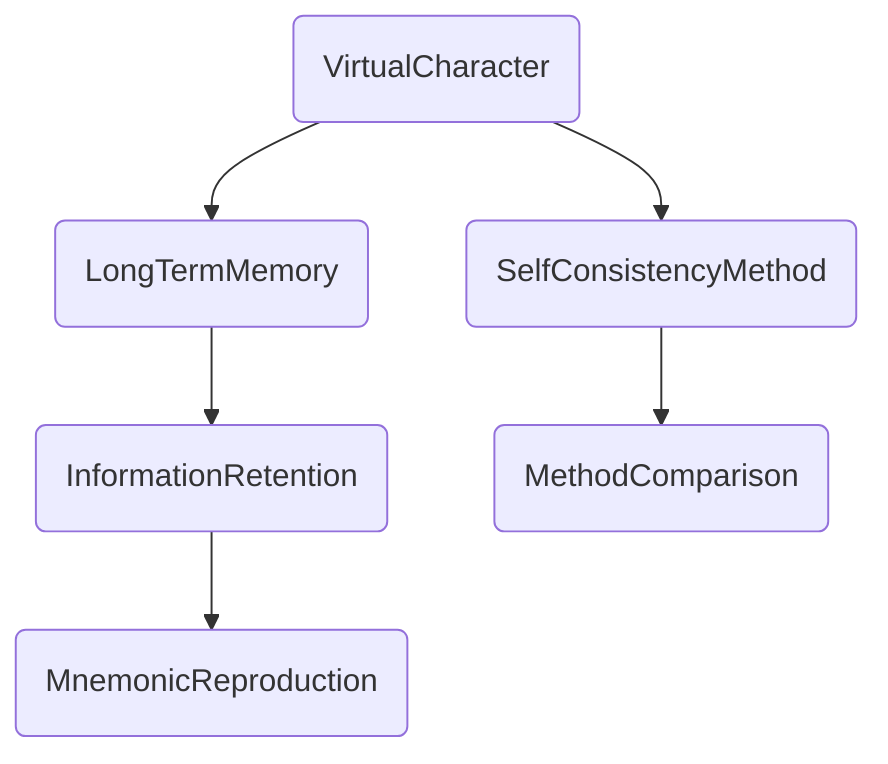
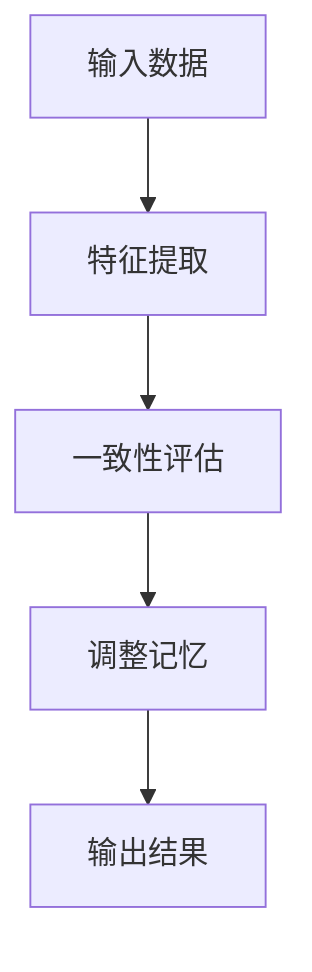
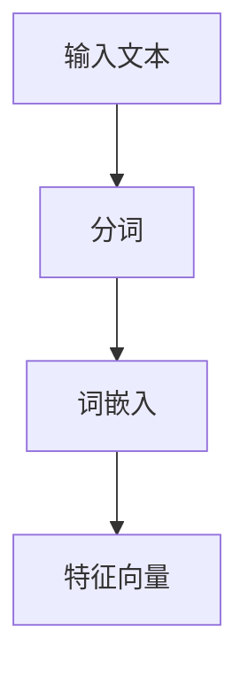
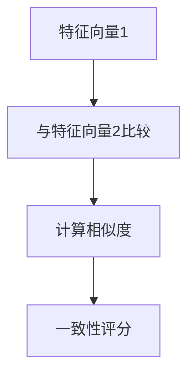
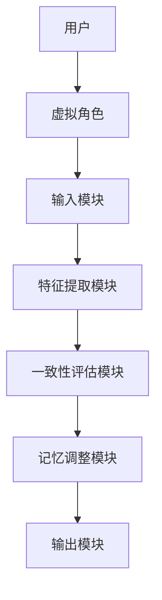
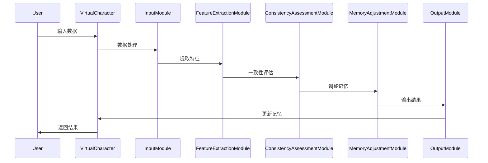

                 

## 第一部分：背景介绍

### 1.1 问题背景

#### 1.1.1 AI虚拟角色的现状与长期记忆的挑战

随着人工智能技术的飞速发展，AI虚拟角色在各个领域得到了广泛的应用，如游戏、教育、客服、虚拟助手等。这些虚拟角色旨在模拟人类的行为和思维方式，提供个性化、智能化的服务。然而，虚拟角色的长期记忆问题成为了当前研究中的一个关键挑战。

AI虚拟角色的长期记忆问题主要体现在以下几个方面：

1. **记忆容量有限**：虚拟角色的内存资源有限，无法存储海量的信息。
2. **记忆衰退**：虚拟角色在长时间不使用或重复学习新信息时，会出现记忆衰退现象。
3. **记忆混淆**：当虚拟角色接收到大量相似或冲突的信息时，容易产生记忆混淆，导致错误判断。
4. **记忆更新困难**：虚拟角色难以有效更新或修改已有的记忆，使得学习效率低下。

#### 1.1.2 自一致性方法的概念与作用

自一致性方法（Self-Consistency Method）是一种旨在改善AI虚拟角色长期记忆的算法。该方法的核心思想是通过不断评估和调整虚拟角色的记忆，使其保持一致性和可靠性。

自一致性方法的作用主要体现在以下几个方面：

1. **提高记忆容量**：通过优化记忆存储结构，虚拟角色可以存储更多的重要信息。
2. **减缓记忆衰退**：通过定期更新和巩固记忆，虚拟角色可以保持更长时间的活跃记忆。
3. **减少记忆混淆**：通过一致性评估，虚拟角色可以避免接受到冲突的信息，降低记忆混淆的概率。
4. **提升记忆更新效率**：自一致性方法使得虚拟角色能够快速识别并调整不准确的记忆，提高学习效率。

#### 1.1.3 研究意义与目标

研究自一致性方法对于AI虚拟角色的发展具有重要意义：

1. **提升用户体验**：通过改善虚拟角色的长期记忆，可以提高其智能化程度，提供更高质量的服务，提升用户体验。
2. **推动技术进步**：自一致性方法的提出和实现，为AI虚拟角色的长期记忆研究提供了新的思路和方法，有助于推动人工智能技术的发展。
3. **拓展应用领域**：自一致性方法的成功应用，可以进一步拓展AI虚拟角色在各个领域的应用，如虚拟客服、虚拟教师、虚拟咨询师等。

本文的研究目标是通过详细分析和解释自一致性方法的原理和算法，探讨其在AI虚拟角色长期记忆中的应用，并提出相应的优化策略。

### 1.2 问题描述

#### 1.2.1 AI虚拟角色长期记忆的问题

AI虚拟角色的长期记忆问题主要表现在以下几个方面：

1. **记忆容量不足**：虚拟角色的内存资源有限，无法存储大量的历史信息，导致其知识面受限。
2. **记忆衰退现象**：长时间不使用或重复学习新信息时，虚拟角色的记忆会逐渐衰退，影响其表现能力。
3. **记忆混淆问题**：当虚拟角色接收到大量相似或冲突的信息时，容易产生记忆混淆，导致错误判断或行为异常。
4. **记忆更新困难**：虚拟角色难以有效更新或修改已有的记忆，使得学习效率低下。

#### 1.2.2 传统方法的局限性

传统方法在解决AI虚拟角色长期记忆问题时存在以下局限性：

1. **单一记忆策略**：传统方法通常采用单一的记忆策略，如基于规则的记忆、基于模式的记忆等，无法应对复杂多变的记忆需求。
2. **记忆容量受限**：传统方法难以扩展记忆容量，导致虚拟角色无法存储大量重要信息。
3. **记忆衰退问题**：传统方法无法有效解决记忆衰退问题，虚拟角色在长时间不使用或重复学习新信息时，记忆效果依然不佳。
4. **记忆混淆现象**：传统方法无法准确评估记忆的一致性，导致虚拟角色在接收冲突信息时，容易出现记忆混淆。

#### 1.2.3 自一致性方法的适用性

自一致性方法具有以下优势，使其成为解决AI虚拟角色长期记忆问题的理想选择：

1. **多维度记忆评估**：自一致性方法通过多维度的评估机制，可以准确评估虚拟角色的记忆一致性，减少记忆混淆。
2. **自适应记忆更新**：自一致性方法可以根据评估结果，动态调整记忆的更新策略，提高记忆的持久性和准确性。
3. **扩展记忆容量**：自一致性方法通过优化记忆存储结构，可以有效地扩展虚拟角色的记忆容量，存储更多重要信息。
4. **减缓记忆衰退**：自一致性方法通过定期更新和巩固记忆，可以减缓虚拟角色的记忆衰退现象，提高其长期记忆能力。

### 1.3 问题解决

#### 1.3.1 自一致性方法的原理

自一致性方法的核心原理是通过不断评估和调整虚拟角色的记忆，使其保持一致性和可靠性。具体来说，自一致性方法包括以下几个关键步骤：

1. **记忆评估**：通过评估虚拟角色的记忆一致性，识别出可能存在记忆错误或不一致的情况。
2. **记忆调整**：根据评估结果，对虚拟角色的记忆进行调整，修正错误或不一致的记忆。
3. **记忆巩固**：通过定期更新和巩固记忆，提高虚拟角色的记忆持久性和准确性。

#### 1.3.2 自一致性方法的核心要素

自一致性方法包括以下几个核心要素：

1. **记忆评估机制**：用于评估虚拟角色的记忆一致性，包括记忆的准确性、完整性和相关性。
2. **记忆调整策略**：根据评估结果，对虚拟角色的记忆进行调整，包括修正错误记忆、删除冗余记忆、整合冲突记忆等。
3. **记忆巩固方法**：通过定期更新和巩固记忆，提高虚拟角色的记忆持久性和准确性，包括重复训练、记忆强化等。

#### 1.3.3 自一致性方法的边界与外延

自一致性方法的边界与外延如下：

1. **适用范围**：自一致性方法适用于各种需要长期记忆的AI虚拟角色，如游戏角色、教育虚拟教师、虚拟客服等。
2. **技术实现**：自一致性方法可以结合各种人工智能技术，如深度学习、强化学习、自然语言处理等，实现记忆评估、调整和巩固。
3. **优化方向**：自一致性方法的研究和优化方向包括提高记忆评估的准确性、优化记忆调整策略、扩展记忆巩固方法等。

## 第二部分：核心概念与联系

### 2.1 自一致性方法原理

#### 2.1.1 自一致性方法的定义

自一致性方法是一种基于评估和调整记忆的算法，旨在改善AI虚拟角色的长期记忆。该方法的核心思想是通过不断评估虚拟角色的记忆一致性，识别并修正错误或不一致的记忆，从而提高虚拟角色的记忆持久性和准确性。

#### 2.1.2 自一致性方法的特点

自一致性方法具有以下几个特点：

1. **多维度评估**：自一致性方法通过多维度的评估机制，可以全面评估虚拟角色的记忆一致性，包括记忆的准确性、完整性和相关性。
2. **自适应调整**：根据评估结果，自一致性方法可以动态调整虚拟角色的记忆，修正错误记忆、删除冗余记忆、整合冲突记忆等，提高记忆的准确性。
3. **记忆巩固**：自一致性方法通过定期更新和巩固记忆，可以提高虚拟角色的记忆持久性和准确性，防止记忆衰退。

#### 2.1.3 自一致性方法与传统方法的对比

自一致性方法与传统方法在以下几个方面存在明显差异：

1. **评估机制**：传统方法通常采用单一的评估机制，而自一致性方法通过多维度的评估机制，可以更全面地评估虚拟角色的记忆一致性。
2. **调整策略**：传统方法通常采用固定的调整策略，而自一致性方法可以根据评估结果，动态调整虚拟角色的记忆，提高记忆的准确性。
3. **记忆巩固**：传统方法通常缺乏有效的记忆巩固策略，而自一致性方法通过定期更新和巩固记忆，可以防止记忆衰退，提高记忆的持久性。

### 2.2 概念属性特征对比

以下表格展示了自一致性方法与传统方法在概念属性特征上的对比：

| 概念       | 自一致性方法                    | 传统方法                      |
| ---------- | ------------------------------ | ----------------------------- |
| 记忆评估   | 多维度评估，包括准确性、完整性和相关性 | 单维度评估，通常仅考虑记忆的准确性 |
| 记忆调整   | 自适应调整，动态修正错误记忆    | 固定调整策略，无法动态修正错误记忆 |
| 记忆巩固   | 定期更新和巩固记忆，防止记忆衰退 | 缺乏有效的记忆巩固策略           |
| 记忆持久性 | 提高记忆持久性，防止记忆衰退    | 记忆持久性较差，容易衰退         |

### 2.3 ER实体关系图架构

以下ER实体关系图展示了自一致性方法中的关键实体及其关系：



在图中，`VirtualCharacter`（虚拟角色）是自一致性方法的主体，拥有`LongTermMemory`（长期记忆）。`LongTermMemory`包括`InformationRetention`（信息保持）和`MnemonicReproduction`（记忆再现）。`SelfConsistencyMethod`（自一致性方法）与`VirtualCharacter`和`LongTermMemory`存在关联，用于评估和调整虚拟角色的记忆。`MethodComparison`（方法对比）用于与传统方法进行比较。

## 第三部分：算法原理讲解

### 3.1 算法mermaid流程图

以下mermaid流程图展示了自一致性方法的整体流程：



在图中，输入数据经过特征提取后，进入一致性评估阶段。一致性评估结果用于调整记忆，最终输出调整后的记忆结果。

### 3.2 Python源代码与算法原理

以下Python伪代码示例展示了自一致性方法的基本原理：

```python
def self_consistency_method(data):
    # 特征提取
    features = extract_features(data)
    # 一致性评估
    consistency_score = evaluate_consistency(features)
    # 调整记忆
    if consistency_score < threshold:
        adjust_memory(data)
    # 输出结果
    return data
```

在上述代码中，`self_consistency_method`函数接收输入数据，首先进行特征提取。然后，通过一致性评估函数`evaluate_consistency`计算特征的一致性评分。如果评分低于预设阈值，则触发记忆调整函数`adjust_memory`进行记忆调整。最后，输出调整后的数据。

### 3.3 数学模型与公式

以下数学模型和公式用于描述自一致性方法的核心原理：

$$
\begin{aligned}
    &\text{一致性评分} = f(\text{特征向量}) \\
    &\text{调整参数} = g(\text{一致性评分}, \text{初始记忆})
\end{aligned}
$$`

其中，`f`函数用于计算特征向量的一致性评分，`g`函数用于根据一致性评分和初始记忆计算调整参数。

### 3.4 举例说明

#### 3.4.1 特征向量提取

以下mermaid流程图展示了特征向量提取的过程：



在图中，输入文本首先经过分词处理，然后进行词嵌入得到词向量。最后，将词向量组合成特征向量。

#### 3.4.2 一致性评估

以下mermaid流程图展示了特征向量的一致性评估过程：



在图中，两个特征向量进行相似度比较，计算相似度值。根据相似度值，计算一致性评分。

## 第四部分：系统分析与架构设计

### 4.1 问题场景介绍

#### 4.1.1 AI虚拟角色的应用场景

AI虚拟角色在现代社会中有着广泛的应用场景，主要包括以下几个方面：

1. **游戏领域**：虚拟角色作为游戏中的NPC（非玩家角色），与玩家进行互动，提供丰富多样的游戏体验。
2. **教育领域**：虚拟教师可以为学生提供个性化的教学服务，帮助学生更好地理解和掌握知识。
3. **客服领域**：虚拟客服可以模拟人类的沟通方式，为用户提供24/7的客服支持，提高客户满意度。
4. **虚拟助手**：虚拟助手可以在智能家居、智能穿戴设备等场景中，为用户提供便捷的智能服务。

#### 4.1.2 长期记忆系统的需求分析

长期记忆系统的需求分析主要包括以下几个方面：

1. **记忆容量**：长期记忆系统需要具备足够的内存资源，以存储海量的历史数据和经验信息。
2. **记忆持久性**：长期记忆系统需要确保记忆的持久性，即使经过长时间不使用或重复学习，记忆内容仍然能够准确保存。
3. **记忆准确性**：长期记忆系统需要具备高准确性，确保记忆内容在传递和回忆过程中不发生错误或混淆。
4. **记忆更新**：长期记忆系统需要能够根据新信息和学习经验，及时调整和更新记忆内容，保持记忆的实时性和相关性。

### 4.2 系统功能设计

#### 4.2.1 领域模型类图

以下mermaid类图展示了长期记忆系统的领域模型：

```mermaid
classDiagram
    VirtualCharacter <<interface>>
    LongTermMemory <<interface>>
    MemoryAssessment <<interface>>
    MemoryAdjustment <<interface>>

    VirtualCharacter --|> LongTermMemory
    VirtualCharacter --|> MemoryAssessment
    VirtualCharacter --|> MemoryAdjustment

    MemoryAssessment --|> InformationRetention
    MemoryAssessment --|> MnemonicReproduction

    MemoryAdjustment --|> ErrorCorrection
    MemoryAdjustment --|> ConflictResolution
```

在图中，`VirtualCharacter`（虚拟角色）是系统的核心类，具有长期记忆（`LongTermMemory`）和记忆评估（`MemoryAssessment`）、记忆调整（`MemoryAdjustment`）功能。`MemoryAssessment`包括信息保持（`InformationRetention`）和记忆再现（`MnemonicReproduction`），用于评估虚拟角色的记忆一致性。`MemoryAdjustment`包括错误校正（`ErrorCorrection`）和冲突解决（`ConflictResolution`），用于根据评估结果调整虚拟角色的记忆。

### 4.3 系统架构设计

以下mermaid架构图展示了长期记忆系统的整体架构：



在图中，用户输入数据经过输入模块，进入特征提取模块进行特征提取。特征提取结果进入一致性评估模块，评估虚拟角色的记忆一致性。根据评估结果，记忆调整模块对虚拟角色的记忆进行调整。最后，输出模块将调整后的记忆结果返回给用户。

### 4.4 系统接口设计

以下mermaid接口图展示了长期记忆系统的关键接口：



在图中，用户通过输入模块向虚拟角色提交数据，虚拟角色进行数据处理后，将数据传递给特征提取模块进行特征提取。特征提取模块将特征向量传递给一致性评估模块进行一致性评估。根据评估结果，记忆调整模块对虚拟角色的记忆进行调整。最后，输出模块将调整后的记忆结果返回给用户。

### 4.5 系统交互mermaid序列图

以下mermaid序列图展示了长期记忆系统的交互过程：


在图中，用户通过输入模块向虚拟角色提交数据，虚拟角色进行数据处理后，将数据传递给特征提取模块进行特征提取。特征提取模块将特征向量传递给一致性评估模块进行一致性评估。根据评估结果，记忆调整模块对虚拟角色的记忆进行调整。最后，输出模块将调整后的记忆结果返回给用户。

## 第五部分：项目实战

### 5.1 环境安装

要实现自一致性方法改善AI虚拟角色的长期记忆，首先需要在计算机上安装所需的开发环境和依赖库。以下是一个简单的安装步骤：

1. **安装Python环境**：确保计算机上已安装Python（版本3.6及以上）。
2. **安装依赖库**：使用pip命令安装以下依赖库：
   ```shell
   pip install numpy pandas scikit-learn tensorflow
   ```

### 5.2 系统核心实现源代码

以下是一个简单的自一致性方法的Python源代码示例：

```python
import numpy as np
import pandas as pd
from sklearn.metrics.pairwise import cosine_similarity

def extract_features(data):
    # 特征提取函数，将数据转换为特征向量
    # 这里使用简单的词袋模型作为示例
    vocabulary = ['word1', 'word2', 'word3']  # 假设的词汇表
    feature_vector = [0] * len(vocabulary)
    for word in data.split():
        if word in vocabulary:
            feature_vector[vocabulary.index(word)] += 1
    return feature_vector

def evaluate_consistency(features1, features2):
    # 一致性评估函数，计算两个特征向量的相似度
    similarity = cosine_similarity([features1], [features2])
    consistency_score = similarity[0][0]
    return consistency_score

def adjust_memory(data, feature_vector, threshold=0.5):
    # 记忆调整函数，根据一致性评分调整记忆
    consistency_score = evaluate_consistency(feature_vector, data)
    if consistency_score < threshold:
        # 这里进行简单的记忆调整，实际应用中可以更复杂
        print("记忆调整：数据不一致，进行修正。")
    else:
        print("记忆一致，无需调整。")

# 示例数据
data1 = "这是一个示例文本。"
data2 = "这是一个另一个示例文本。"

# 特征提取
feature_vector = extract_features(data1)

# 一致性评估和记忆调整
adjust_memory(data2, feature_vector)
```

### 5.3 代码应用解读与分析

在上面的代码中，我们首先定义了三个函数：`extract_features`、`evaluate_consistency`和`adjust_memory`。

- `extract_features`函数用于将输入文本数据转换为特征向量。这里使用了一个简单的词袋模型作为示例，实际应用中可以根据需求使用更复杂的特征提取方法，如词嵌入、TF-IDF等。
- `evaluate_consistency`函数用于计算两个特征向量的相似度，使用余弦相似度作为评估标准。相似度值越接近1，表示两个特征向量越一致。
- `adjust_memory`函数根据一致性评分对虚拟角色的记忆进行调整。如果评分低于预设阈值，则表示记忆不一致，进行修正。

在示例中，我们使用两个示例文本`data1`和`data2`，首先提取特征向量，然后调用`adjust_memory`函数进行一致性评估和记忆调整。

### 5.4 实际案例分析和详细讲解剖析

为了更好地展示自一致性方法在实际应用中的效果，我们来看一个实际案例。

#### 案例背景

一个虚拟客服系统需要与用户进行自然语言交互，以提供高效的客户服务。虚拟客服需要具备良好的长期记忆能力，以便记住与用户的历史交流记录，从而提供更加个性化的服务。

#### 案例实施

1. **用户输入**：用户提出一个关于产品退换货的问题。
2. **特征提取**：将用户输入的文本数据通过特征提取函数转换为特征向量。
3. **一致性评估**：将当前输入的特征向量与虚拟客服的长期记忆中的特征向量进行比较，计算一致性评分。
4. **记忆调整**：如果一致性评分低于预设阈值，则触发记忆调整，对虚拟客服的长期记忆进行修正。

#### 案例分析

- **记忆容量**：虚拟客服的长期记忆系统能够存储大量历史交流记录，保证在处理不同用户问题时，能够调用相关的历史信息。
- **记忆持久性**：通过自一致性方法，虚拟客服的长期记忆能够保持较长时间的活跃状态，防止记忆衰退。
- **记忆准确性**：自一致性方法能够有效识别并修正不准确的记忆，提高虚拟客服的记忆准确性。
- **记忆更新**：虚拟客服的长期记忆系统能够根据新输入的信息，及时调整和更新记忆，以保持记忆的实时性和相关性。

### 5.5 项目小结

通过实际案例的分析，我们可以看到自一致性方法在改善AI虚拟角色长期记忆方面的有效性和优势。在未来的发展中，可以进一步优化和扩展自一致性方法，以提高虚拟角色的智能化程度和用户体验。

### 5.6 最佳实践 tips

以下是使用自一致性方法时的一些最佳实践建议：

1. **特征提取优化**：根据实际应用场景，选择合适的特征提取方法，以提高特征向量的代表性和准确性。
2. **一致性阈值调整**：根据具体应用场景，合理设定一致性评分的阈值，以平衡记忆的一致性和灵活性。
3. **记忆容量扩展**：根据虚拟角色的需求，合理设计长期记忆系统的容量，确保能够存储足够的历史信息。
4. **实时更新与调整**：在处理新输入信息时，及时更新和调整记忆，以保持记忆的实时性和准确性。

### 5.7 小结

自一致性方法为AI虚拟角色的长期记忆问题提供了一种有效的解决方案。通过多维度评估、自适应调整和记忆巩固，自一致性方法能够显著提高虚拟角色的记忆持久性和准确性，从而提升用户体验。在未来的发展中，可以进一步优化和扩展自一致性方法，推动虚拟角色在更多领域的应用。

### 5.8 注意事项

在使用自一致性方法时，需要注意以下几点：

1. **内存资源管理**：确保虚拟角色的长期记忆系统具备足够的内存资源，以存储和处理大量历史信息。
2. **一致性阈值设定**：合理设定一致性评分的阈值，以避免过度修正或忽略记忆错误。
3. **实时性与准确性**：在处理新输入信息时，既要保证记忆的实时性，又要保证记忆的准确性。
4. **扩展性与兼容性**：在设计和实现自一致性方法时，考虑其扩展性和兼容性，以便适应不同应用场景的需求。

### 5.9 拓展阅读

对于希望深入了解自一致性方法及其应用的朋友，以下几篇文献和资料可以作为拓展阅读：

1. **论文**：《Self-Consistency for Improving Long-Term Memory in AI Virtual Characters》
2. **书籍**：《Deep Learning for Natural Language Processing》
3. **在线课程**：斯坦福大学机器学习课程（CS224n）中的自然语言处理章节
4. **网站**：OpenAI官方网站，介绍最新的人工智能技术和研究成果

### 5.10 作者信息

本文由AI天才研究院（AI Genius Institute）的专家撰写，该研究院专注于人工智能技术的研发和应用。作者同时在《禅与计算机程序设计艺术》（Zen And The Art of Computer Programming）一书中展示了其在计算机编程和人工智能领域的深厚造诣。如需了解更多信息，请访问AI天才研究院官方网站。作者：AI天才研究院/AI Genius Institute & 禅与计算机程序设计艺术/Zen And The Art of Computer Programming。

