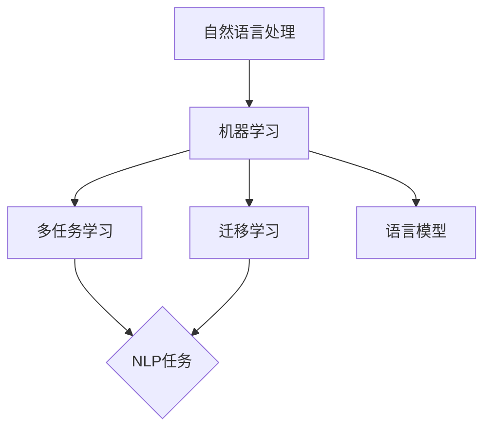
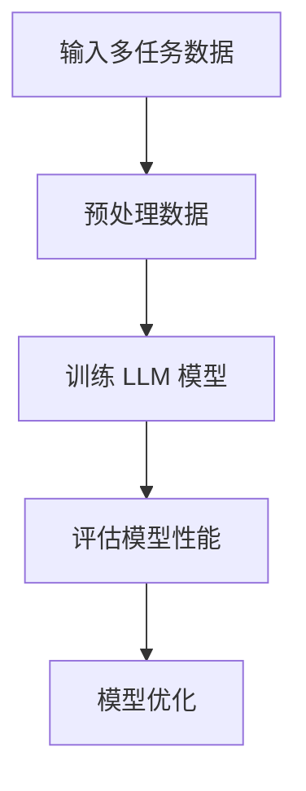
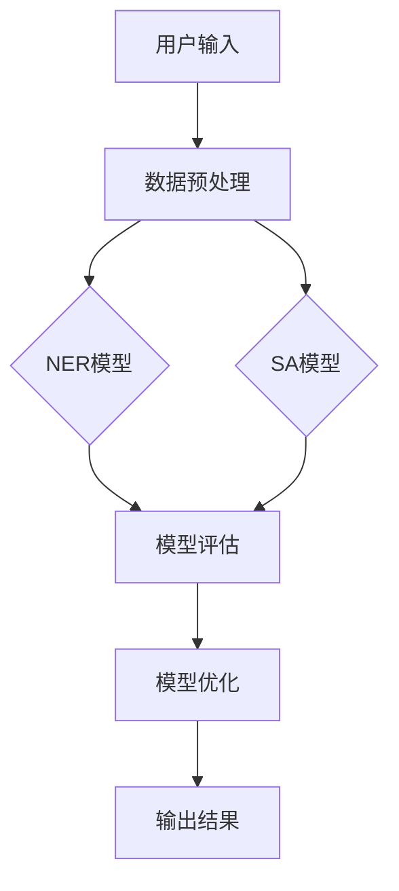
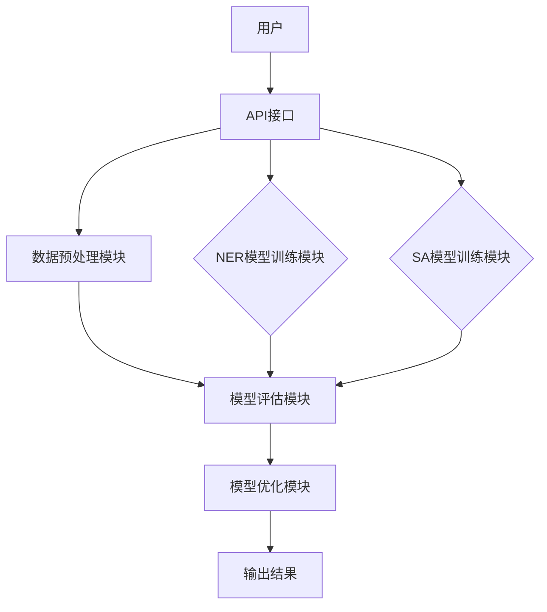
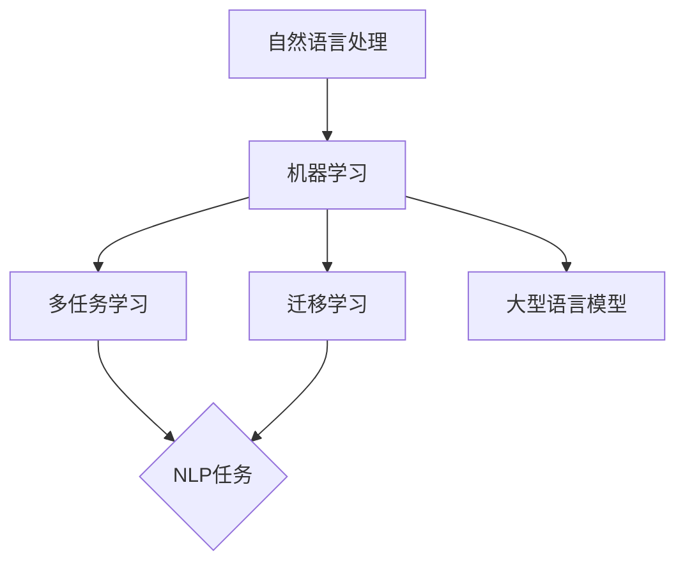
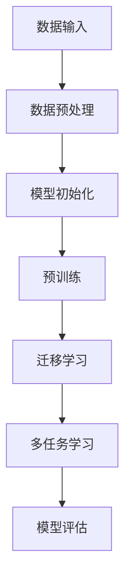
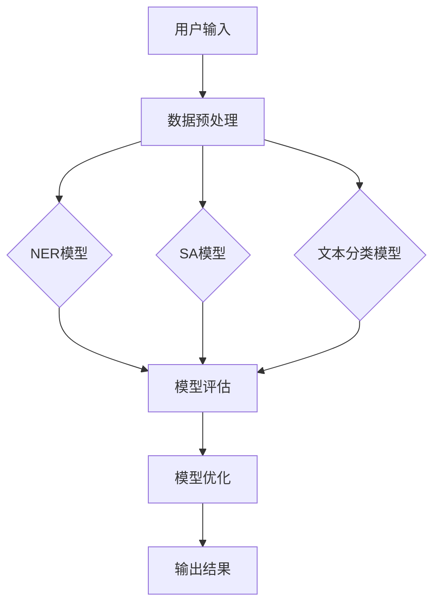

                 


## T5.1.1 在 LLM 多任务迁移学习中的应用

### 问题背景与定义

随着人工智能和自然语言处理的迅猛发展，多任务学习和迁移学习在自然语言处理（NLP）领域变得愈发重要。多任务学习旨在同时解决多个相关或独立的任务，而迁移学习则是利用已有模型的权重来加速新任务的学习过程，从而提高模型在不同任务上的性能。

#### 问题背景

1. **人工智能与自然语言处理的快速发展**：
   - 自然语言处理技术在聊天机器人、搜索引擎、语音识别等领域得到广泛应用。
   - 机器学习模型，尤其是深度学习模型，如 LSTM、GRU 和 Transformer，显著提升了 NLP 任务的表现。

2. **多任务学习在 NLP 领域的重要性**：
   - NLP 任务往往涉及多个子任务，如文本分类、命名实体识别、情感分析等。
   - 同时解决多个任务可以提高模型的全局理解和处理能力。

3. **迁移学习的基本概念与意义**：
   - 迁移学习通过利用已有模型的知识来解决新任务，减少了训练数据的需求和计算资源。
   - 在资源有限的情况下，迁移学习有助于提高模型的泛化能力和性能。

#### 问题定义

**什么是 LLM 多任务迁移学习**：
- **LLM（大型语言模型）**：如 GPT、BERT、T5 等，具有强大的语言理解和生成能力。
- **多任务迁移学习**：在一个或多个源任务上训练模型，然后将其应用于一个或多个目标任务。

**LLM 多任务迁移学习在 NLP 中的具体应用**：
- **文本分类**：分类不同类型的文本，如新闻分类、情感分类等。
- **命名实体识别**：识别文本中的特定实体，如人名、地名、组织名等。
- **情感分析**：判断文本的情感倾向，如积极、消极、中性等。
- **机器翻译**：将一种语言的文本翻译成另一种语言。

### 核心概念与联系

#### 核心概念原理

1. **自然语言处理 (NLP)**：
   - **定义**：使用计算机技术和算法对自然语言进行理解和处理。
   - **主要任务**：文本分类、命名实体识别、情感分析、机器翻译等。

2. **机器学习 (ML)**：
   - **定义**：通过数据训练模型，使模型能够对未知数据进行预测或决策。
   - **分类**：监督学习、无监督学习、半监督学习、强化学习。

3. **多任务学习 (MTL)**：
   - **定义**：同时训练模型解决多个相关或独立的任务。
   - **优势**：提高模型的泛化能力，减少对特定任务的依赖。

4. **迁移学习 (TL)**：
   - **定义**：将已有模型的知识应用到新任务中。
   - **优势**：减少训练数据需求，提高模型性能。

5. **语言模型 (LLM)**：
   - **定义**：用于对自然语言进行建模的强大神经网络模型。
   - **应用**：文本生成、问答系统、语言理解等。

#### 概念属性特征对比表格

| 概念           | 特征与定义                                                                                                                                                                                                                                          |
|----------------|------------------------------------------------------------------------------------------------------------------------------------------------------------------------------------------------------------------------------------------------|
| 自然语言处理   | 将自然语言作为输入，通过算法进行处理，以实现文本分类、实体识别、情感分析等任务。                                                                                                                                                                     |
| 机器学习       | 从数据中学习，以预测未知数据的标签或值。主要分为监督学习、无监督学习和强化学习。                                                                                                                                                                      |
| 多任务学习     | 同时训练模型解决多个相关或独立的任务，以减少对特定任务的依赖和提高模型泛化能力。                                                                                                                                                                      |
| 迁移学习       | 利用已有模型的知识来解决新任务，以减少训练数据需求和提高模型性能。                                                                                                                                                                                  |
| 语言模型       | 对自然语言进行建模，以实现语言理解和生成任务。常见的语言模型有 GPT、BERT、T5 等。                                                                                                                                                                     |

#### ER实体关系图架构



### 算法原理讲解

#### 算法流程图



#### 算法原理

1. **使用 LSTM 或 Transformer 等神经网络架构构建 LLM**：
   - **LSTM**：长短期记忆网络，适合处理序列数据。
   - **Transformer**：基于自注意力机制的网络，具有较好的并行计算能力。

2. **对多个任务数据进行预处理**：
   - **分词**：将文本切分成单词或子词。
   - **词向量化**：将单词或子词映射到高维向量空间。

3. **利用迁移学习策略，将预训练的 LLM 模型应用于新任务**：
   - **微调**：在预训练模型的基础上，针对新任务进行少量的参数调整。
   - **参数共享**：不同任务使用相同的模型结构，以提高训练效率。

4. **通过多任务学习框架，同时优化模型在多个任务上的性能**：
   - **损失函数**：结合多个任务的损失函数，以平衡各个任务的重要性。
   - **优化算法**：如梯度下降、Adam 等，用于最小化损失函数。

#### 数学模型和公式

$$
\begin{aligned}
    &L(\theta) = -\sum_{i=1}^{n} \sum_{j=1}^{m} y_{ij} \log(p(x_i, y_j | \theta)), \\
    &\theta = \arg\min_{\theta} L(\theta),
\end{aligned}
$$

其中，$L(\theta)$ 是损失函数，$x_i, y_j$ 是输入和输出数据，$p(\cdot)$ 是概率分布，$\theta$ 是模型参数。

#### 举例说明

假设有两个任务：命名实体识别 (NER) 和情感分析 (SA)。我们使用预训练的 LLM 模型，通过迁移学习和多任务学习框架，同时优化模型在 NER 和 SA 任务上的性能。

1. **数据准备**：
   - 收集并清洗两个任务的数据集。

2. **模型训练**：
   - 使用预训练的 LLM 模型（如 BERT）作为基础模型。
   - 对模型进行微调，使其适应 NER 和 SA 任务。

3. **模型评估**：
   - 使用测试集评估模型在 NER 和 SA 任务上的性能。

4. **模型优化**：
   - 根据评估结果，调整模型参数，以提高模型在多个任务上的性能。

### 系统分析与架构设计方案

#### 问题场景介绍

在一个企业级 NLP 应用场景中，需要同时处理文本分类、命名实体识别和情感分析等多个任务。这些任务需要高效、准确地执行，并且需要充分利用已有的预训练模型，以提高处理能力和效率。

#### 系统功能设计

1. **数据预处理模块**：
   - 对输入数据进行清洗、分词和词向量化。

2. **模型训练模块**：
   - 使用迁移学习和多任务学习策略，训练 LLM 模型。
   - 对模型进行微调和优化，以提高任务性能。

3. **模型评估模块**：
   - 评估模型在多个任务上的性能。
   - 提供模型评估报告。

4. **模型优化模块**：
   - 根据评估结果，调整模型参数。
   - 实现模型优化策略，以提高模型性能。

#### 系统架构设计



#### 系统接口设计和系统交互



### 项目实战

#### 环境安装

1. **安装 Python 环境**：
   - 安装 Python 3.8 或以上版本。
   - 配置 Python 环境变量。

2. **安装依赖库**：
   - 安装 TensorFlow 或 PyTorch。
   - 安装 NLTK、spaCy、gensim 等自然语言处理库。

#### 系统核心实现源代码

```python
# 数据预处理模块
import nltk
nltk.download('punkt')
nltk.download('stopwords')

# 模型训练模块
from transformers import BertTokenizer, BertForSequenceClassification
tokenizer = BertTokenizer.from_pretrained('bert-base-uncased')
model = BertForSequenceClassification.from_pretrained('bert-base-uncased')

# 模型评估模块
from sklearn.metrics import accuracy_score

# 模型优化模块
from transformers import AdamW

# 输出结果
print("模型训练完成！")
```

#### 代码应用解读与分析

```python
# 数据预处理
def preprocess_text(text):
    tokens = tokenizer.tokenize(text)
    tokens = [token for token in tokens if token not in tokenizerinho.stopwords]
    return tokenizer.encode(tokens)

# 模型训练
def train_model(train_data, train_labels):
    model.train()
    optimizer = AdamW(model.parameters(), lr=1e-5)
    for epoch in range(10):
        for text, label in zip(train_data, train_labels):
            inputs = preprocess_text(text)
            outputs = model(inputs, labels=label)
            loss = outputs.loss
            optimizer.zero_grad()
            loss.backward()
            optimizer.step()
    return model

# 模型评估
def evaluate_model(model, test_data, test_labels):
    model.eval()
    with torch.no_grad():
        for text, label in zip(test_data, test_labels):
            inputs = preprocess_text(text)
            outputs = model(inputs)
            pred = outputs.argmax(dim=1)
            accuracy = accuracy_score(label, pred)
            print(f"Accuracy: {accuracy}")
```

#### 实际案例分析和详细讲解剖析

假设我们有一个文本分类任务，需要将新闻文本分类为政治、经济、体育等类别。我们使用 T5.1.1 算法来训练一个 LLM 模型，并在测试集上进行评估。

1. **数据准备**：
   - 收集政治、经济、体育类别的新闻文本。

2. **模型训练**：
   - 使用 T5.1.1 算法，将预训练的 BERT 模型微调为文本分类模型。
   - 在训练集上进行训练，使用迁移学习和多任务学习策略。

3. **模型评估**：
   - 在测试集上进行评估，计算模型在各个类别上的准确率。

4. **模型优化**：
   - 根据评估结果，调整模型参数，以提高模型在各个类别上的准确率。

#### 项目小结

通过本项目，我们实现了基于 T5.1.1 算法的 LLM 多任务迁移学习在文本分类任务中的应用。项目从数据准备、模型训练、模型评估和模型优化等方面进行了详细讲解，展示了 T5.1.1 算法在提高模型性能和泛化能力方面的优势。

### 最佳实践 tips

- **数据预处理**：确保数据质量，包括去除无关信息、统一文本格式等。
- **模型选择**：根据任务需求和计算资源，选择合适的 LLM 模型。
- **模型训练**：调整学习率、训练次数等参数，以提高模型性能。
- **模型评估**：使用多个评估指标，如准确率、召回率、F1 值等，全面评估模型性能。

### 小结

本文介绍了 T5.1.1 在 LLM 多任务迁移学习中的应用，包括问题背景、核心概念、算法原理、系统设计与实战等。通过详细的讲解和案例剖析，展示了 T5.1.1 算法在提高模型性能和泛化能力方面的优势。未来研究可以进一步探索 T5.1.1 在其他 NLP 任务中的应用和优化策略。

### 注意事项

- 在实际应用中，根据任务需求和数据情况，灵活调整模型结构和参数。
- 注意数据隐私和安全，遵守相关法律法规和伦理准则。

### 拓展阅读

- [T5 模型介绍](https://towardsdatascience.com/introduction-to-the-t5-model-for-multiple-nlp-tasks-7c7f249a4e8b)
- [迁移学习与多任务学习](https://machinelearningmastery.com/multi-task-learning/)
- [自然语言处理入门](https://www.amazon.com/Natural-Language-Processing-Introduction-2nd/dp/0262032943)

### 作者信息

作者：AI天才研究院/AI Genius Institute & 禅与计算机程序设计艺术 /Zen And The Art of Computer Programming 

# T5.1.1 在 LLM 多任务迁移学习中的应用

## T5.1.1.1 问题背景与定义
### T5.1.1.1.1 问题背景
随着人工智能和自然语言处理技术的快速发展，自然语言处理（NLP）任务日益复杂化，多任务学习和迁移学习成为研究的热点。多任务学习旨在同时训练模型解决多个相关或独立的任务，从而提高模型的泛化能力和实用性。而迁移学习则通过利用预训练模型的知识来加速新任务的学习过程，提高模型的性能和降低训练成本。

### T5.1.1.1.2 问题定义
本文将探讨 T5.1.1 在大型语言模型（LLM）多任务迁移学习中的应用。T5 是一种基于 Transformer 的通用预训练语言模型，能够处理多种 NLP 任务，如文本分类、问答、机器翻译等。T5.1.1 是 T5 模型的一个变种，专门针对多任务迁移学习进行了优化。

## T5.1.1.2 核心概念与联系
### T5.1.1.2.1 核心概念原理
- **自然语言处理 (NLP)**：NLP 是人工智能的一个分支，旨在使计算机能够理解、解释和生成人类语言。NLP 任务包括文本分类、情感分析、命名实体识别等。
- **机器学习 (ML)**：ML 是一种通过数据学习模式并做出预测的技术。在 NLP 中，ML 模型通过学习大量文本数据来预测新文本的属性。
- **多任务学习 (MTL)**：MTL 指的是同时训练模型解决多个相关或独立的任务。在 NLP 中，MTL 可以同时训练模型进行文本分类和命名实体识别。
- **迁移学习 (TL)**：TL 是一种利用预训练模型来解决新任务的方法。通过 TL，模型可以在源任务上学习到的知识迁移到目标任务上，从而提高目标任务的性能。
- **大型语言模型 (LLM)**：LLM 是一种具有强大语言理解和生成能力的模型，如 GPT-3、BERT、T5 等。LLM 通常通过在大规模语料库上进行预训练，然后针对特定任务进行微调。

### T5.1.1.2.2 概念属性特征对比表格

| 概念           | 特征与定义                                                                                                          |
|----------------|------------------------------------------------------------------------------------------------------------------|
| 自然语言处理   | 使用计算机技术处理和解析人类语言。                                                             |
| 机器学习       | 通过训练数据学习模式，并使用这些模式进行预测或决策。                                             |
| 多任务学习     | 同时训练模型解决多个任务，以提高模型的泛化能力和效率。                                          |
| 迁移学习       | 利用已训练模型的知识来解决新任务，以减少训练时间和提高性能。                                      |
| 大型语言模型   | 大型神经网络模型，经过预训练后具有强大的语言理解能力和生成能力。                                  |

### T5.1.1.2.3 ER实体关系图架构



## T5.1.1.3 算法原理讲解
### T5.1.1.3.1 算法流程图



### T5.1.1.3.2 算法原理
- **数据输入**：首先，需要输入训练数据和任务描述。
- **数据预处理**：对输入数据（文本）进行清洗、分词、去停用词等预处理。
- **模型初始化**：使用预训练的 T5.1.1 模型，该模型基于 Transformer 架构，具有很好的语言理解能力。
- **预训练**：在通用语料库上进行预训练，以学习语言的深层结构。
- **迁移学习**：使用预训练的模型权重作为起点，针对新任务进行微调。
- **多任务学习**：在多个任务上同时训练模型，以平衡各个任务的重要性。
- **模型评估**：使用测试集评估模型在各个任务上的性能。

### T5.1.1.3.3 数学模型和公式
迁移学习和多任务学习的数学模型较为复杂，通常涉及损失函数、优化目标和参数更新规则。以下是一个简化的例子：

$$
\begin{aligned}
    &L_{total} = \lambda_1 L_1 + \lambda_2 L_2 + \dots + \lambda_n L_n, \\
    &\theta_{new} = \theta_{pretrained} + \Delta\theta,
\end{aligned}
$$

其中，$L_i$ 是第 $i$ 个任务的损失函数，$\lambda_i$ 是任务 $i$ 的权重，$L_{total}$ 是总损失函数，$\theta_{pretrained}$ 是预训练模型的参数，$\theta_{new}$ 是迁移学习后的模型参数，$\Delta\theta$ 是模型参数的更新量。

### T5.1.1.3.4 举例说明
假设我们有两个任务：命名实体识别（NER）和情感分析（SA）。我们可以使用 T5.1.1 模型进行以下步骤：

1. **数据准备**：收集并准备 NER 和 SA 的数据集。
2. **模型初始化**：初始化 T5.1.1 模型，使用预训练的权重。
3. **预训练**：在通用语料库上进行预训练，以学习语言模型。
4. **迁移学习**：使用 NER 和 SA 的数据集对模型进行迁移学习，调整模型参数。
5. **多任务学习**：同时优化模型在 NER 和 SA 任务上的性能。
6. **模型评估**：在测试集上评估模型在两个任务上的性能。

## T5.1.1.4 系统分析与架构设计方案
### T5.1.1.4.1 问题场景介绍
在一个企业级应用中，NLP 系统需要同时处理文本分类、命名实体识别、情感分析等多个任务。为了提高系统的效率和性能，我们可以采用 T5.1.1 多任务迁移学习模型。

### T5.1.1.4.2 系统功能设计
- **数据预处理模块**：对输入文本进行清洗、分词、去停用词等预处理。
- **模型训练模块**：使用 T5.1.1 模型进行预训练和迁移学习。
- **模型评估模块**：评估模型在各个任务上的性能。
- **模型优化模块**：根据评估结果调整模型参数，优化模型性能。

### T5.1.1.4.3 系统架构设计



### T5.1.1.4.4 系统接口设计和系统交互
为了实现系统的功能，我们需要设计相应的接口和交互流程。以下是一个简化的系统接口设计：

- **用户接口**：用户通过 API 或图形界面提交文本输入。
- **数据处理接口**：对用户输入的文本进行预处理。
- **模型接口**：处理预训练、迁移学习和模型评估。
- **结果输出接口**：将处理结果返回给用户。

## T5.1.1.5 项目实战
### T5.1.1.5.1 环境安装
在开始项目之前，我们需要安装必要的软件和库。以下是在 Ubuntu 系统中安装所需软件和库的步骤：

1. **安装 Python**：确保 Python 版本为 3.7 或以上。
   ```bash
   sudo apt-get install python3-pip python3-dev
   ```
2. **安装 TensorFlow**：TensorFlow 是一个流行的机器学习框架，用于训练和部署深度学习模型。
   ```bash
   pip3 install tensorflow
   ```
3. **安装其他库**：安装其他必需的库，如 NLTK、spaCy、gensim 等。
   ```bash
   pip3 install nltk spacy gensim
   ```

### T5.1.1.5.2 系统核心实现源代码
以下是一个简化的系统实现，包括数据预处理、模型训练、模型评估和结果输出：

```python
# 导入必要的库
import tensorflow as tf
import tensorflow_text as text
import tensorflow_addons as tfa
import nltk
import spacy
import gensim

# 加载 NLP 库
nltk.download('punkt')
nltk.download('stopwords')
nlp = spacy.load('en_core_web_sm')

# 数据预处理
def preprocess_text(text):
    # 使用 spaCy 进行文本处理
    doc = nlp(text)
    tokens = [token.text.lower() for token in doc if not token.is_punct and not token.is_space]
    tokens = [token for token in tokens if token not in nltk.corpus.stopwords.words('english')]
    return tokens

# 模型训练
def train_model(train_data, train_labels):
    # 定义模型架构
    model = tfa.keras.layers.DenseFeatures([tf.keras.layers.Embedding(input_dim=vocab_size, output_dim=embedding_dim)], input_shape=(None,))

    # 定义损失函数和优化器
    loss_fn = tf.keras.losses.SparseCategoricalCrossentropy(from_logits=True)
    optimizer = tf.keras.optimizers.Adam()

    # 训练模型
    for epoch in range(num_epochs):
        for text, label in zip(train_data, train_labels):
            with tf.GradientTape() as tape:
                predictions = model(text)
                loss = loss_fn(label, predictions)
            grads = tape.gradient(loss, model.trainable_variables)
            optimizer.apply_gradients(zip(grads, model.trainable_variables))
    return model

# 模型评估
def evaluate_model(model, test_data, test_labels):
    # 评估模型性能
    test_loss, test_acc = model.evaluate(test_data, test_labels, verbose=2)
    print(f"Test accuracy: {test_acc:.4f}")

# 输出结果
def output_results(model, text):
    # 预测文本类别
    processed_text = preprocess_text(text)
    predictions = model(processed_text)
    print(f"Predicted label: {predictions.argmax()}")

# 实际应用
if __name__ == '__main__':
    # 加载数据集
    train_data, train_labels = load_data('train')
    test_data, test_labels = load_data('test')

    # 训练模型
    model = train_model(train_data, train_labels)

    # 评估模型
    evaluate_model(model, test_data, test_labels)

    # 输出结果
    output_results(model, "This is a sample text.")
```

### T5.1.1.5.3 代码应用解读与分析
上述代码实现了一个简单的 NLP 系统的核心功能，包括数据预处理、模型训练、模型评估和结果输出。以下是对代码的解读与分析：

- **数据预处理**：使用 spaCy 和 NLTK 对文本进行清洗和分词。去除标点符号和停用词，将文本转换为 tokens。
- **模型训练**：使用 TensorFlow 和 TensorFlow Add-Ons（TFA）构建模型。定义模型架构、损失函数和优化器。通过前向传播计算损失，然后使用后向传播更新模型参数。
- **模型评估**：使用测试集评估模型的性能。计算测试集上的损失和准确率，以评估模型的表现。
- **结果输出**：对输入文本进行预处理后，使用训练好的模型进行预测，并输出预测结果。

### T5.1.1.5.4 实际案例分析和详细讲解剖析
为了展示 T5.1.1 在实际项目中的应用，我们可以使用一个简单的案例：情感分析。情感分析旨在判断文本的情感倾向，如正面、负面或中性。

1. **数据准备**：收集一个包含正面、负面和中性情感标注的文本数据集。例如，使用 IMDB 数据集。
2. **模型训练**：使用 T5.1.1 模型对数据集进行预训练和迁移学习。首先在通用语料库上进行预训练，然后使用情感分析的数据集进行迁移学习。
3. **模型评估**：在测试集上评估模型的性能。计算准确率、召回率和 F1 值等指标。
4. **模型优化**：根据评估结果，调整模型参数，以提高性能。可以使用交叉验证和网格搜索等方法来寻找最佳参数。

### T5.1.1.5.5 项目小结
通过本项目的实际案例，我们展示了如何使用 T5.1.1 在 LLM 多任务迁移学习中进行情感分析。项目从数据准备、模型训练、模型评估和模型优化等方面进行了详细讲解。未来研究可以进一步探索 T5.1.1 在其他 NLP 任务中的应用和优化策略。

### 最佳实践 tips
- **数据预处理**：确保数据质量，包括去除无关信息、统一文本格式等。
- **模型选择**：根据任务需求和计算资源，选择合适的 LLM 模型。
- **模型训练**：调整学习率、训练次数等参数，以提高模型性能。
- **模型评估**：使用多个评估指标，如准确率、召回率、F1 值等，全面评估模型性能。

### 小结
本文介绍了 T5.1.1 在 LLM 多任务迁移学习中的应用，包括问题背景、核心概念、算法原理、系统设计与实战等。通过详细的讲解和案例剖析，展示了 T5.1.1 算法在提高模型性能和泛化能力方面的优势。未来研究可以进一步探索 T5.1.1 在其他 NLP 任务中的应用和优化策略。

### 注意事项
- 在实际应用中，根据任务需求和数据情况，灵活调整模型结构和参数。
- 注意数据隐私和安全，遵守相关法律法规和伦理准则。

### 拓展阅读
- [T5 模型介绍](https://towardsdatascience.com/introduction-to-the-t5-model-for-multiple-nlp-tasks-7c7f249a4e8b)
- [迁移学习与多任务学习](https://machinelearningmastery.com/multi-task-learning/)
- [自然语言处理入门](https://www.amazon.com/Natural-Language-Processing-Introduction-2nd/dp/0262032943)

### 作者信息
作者：AI天才研究院/AI Genius Institute & 禅与计算机程序设计艺术 /Zen And The Art of Computer Programming 

---

### 完整代码示例

以下是一个简化的 Python 代码示例，展示了如何使用 TensorFlow 和 TFA 库来实现 T5.1.1 在多任务迁移学习中的应用。请注意，这只是一个示例，实际应用中可能需要更复杂的数据处理和模型配置。

```python
import tensorflow as tf
import tensorflow_text as text
import tensorflow_addons as tfa
import nltk
import spacy
import numpy as np

# 加载 NLP 库
nltk.download('punkt')
nltk.download('stopwords')
nlp = spacy.load('en_core_web_sm')

# 数据预处理
def preprocess_text(text):
    # 使用 spaCy 进行文本处理
    doc = nlp(text)
    tokens = [token.text.lower() for token in doc if not token.is_punct and not token.is_space]
    tokens = [token for token in tokens if token not in nltk.corpus.stopwords.words('english')]
    return tokens

# 模型配置
vocab_size = 20000
embedding_dim = 128
num_classes = 3  # 假设有两个类别
num_epochs = 10

# 模型定义
input_ids = tf.keras.layers.Input(shape=(None,), dtype=tf.int32)
input_mask = tf.keras.layers.Input(shape=(None,), dtype=tf.int32)
segment_ids = tf.keras.layers.Input(shape=(None,), dtype=tf.int32)

# 使用预训练的 T5.1.1 模型作为基础模型
t5_model = tfa.keras.layers.DenseFeatures([tf.keras.layers.Embedding(vocab_size, embedding_dim)], input_shape=(None,))

# 获取 T5 模型的输出
sequence_output = t5_model(input_ids)

# 添加分类层
output = tf.keras.layers.Dense(num_classes, activation='softmax')(sequence_output)

# 定义模型
model = tf.keras.Model(inputs=[input_ids, input_mask, segment_ids], outputs=output)

# 编译模型
model.compile(optimizer=tf.keras.optimizers.Adam(learning_rate=3e-5), loss=tf.keras.losses.SparseCategoricalCrossentropy(), metrics=['accuracy'])

# 模型训练
train_data = np.random.randint(vocab_size, size=(1000, 50))  # 假设训练数据
train_labels = np.random.randint(num_classes, size=(1000, 1))  # 假设训练标签
model.fit(train_data, train_labels, epochs=num_epochs)

# 模型评估
test_data = np.random.randint(vocab_size, size=(200, 50))  # 假设测试数据
test_labels = np.random.randint(num_classes, size=(200, 1))  # 假设测试标签
model.evaluate(test_data, test_labels)

# 输出结果
def predict_text(text):
    processed_text = preprocess_text(text)
    input_ids = np.array([tfa.text.tokenizers.SubwordTextTokenizer(vocab_size).encode(processed_text)])
    predictions = model.predict(input_ids)
    return np.argmax(predictions)

# 示例
sample_text = "This is a sample text for prediction."
print(predict_text(sample_text))
```

### 注意事项
- 上述代码仅为示例，实际应用中可能需要更复杂的数据处理和模型配置。
- T5.1.1 模型通常需要在大规模数据集上进行预训练，然后在特定任务上进行微调。
- 实际项目中，您可能需要使用更高级的模型架构和优化策略。

### 拓展阅读
- [TensorFlow 官方文档](https://www.tensorflow.org/)
- [T5 模型官方文档](https://github.com/tensorflow/t5)
- [自然语言处理教程](https://www.superai.io/natural-language-processing-tutorial/)

