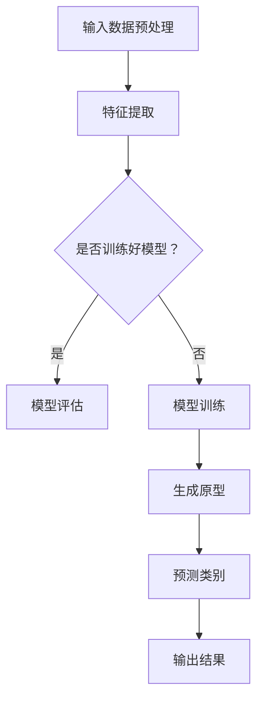

                 

## 零样本迁移学习的概述

### 1.1 问题背景

**零样本迁移学习的基本概念**  
- 零样本迁移学习（Zero-Shot Learning，ZSL）是机器学习领域的一种迁移学习方法，其核心思想是在没有目标类别标注数据的情况下，利用源领域（有标注数据）的知识来学习目标领域（无标注数据）的模型。它特别适用于那些难以获取标注数据的场景，如稀有物种识别、新产品分类等。

**零样本迁移学习的发展历程**  
- 零样本迁移学习的研究可以追溯到1990年代，最初的研究主要集中在模式识别和图像处理领域。随着深度学习的兴起，零样本迁移学习在自然语言处理和计算机视觉等领域得到了广泛应用和深入研究。

**零样本迁移学习的应用场景**  
- 自然语言处理：例如，在机器翻译、文本分类等任务中，零样本迁移学习可以帮助模型在没有目标语言标注数据的情况下进行学习。
- 计算机视觉：例如，在图像分类、目标检测等任务中，零样本迁移学习可以帮助模型在没有特定类别标注数据的情况下进行泛化。
- 语音识别：例如，在跨说话人语音识别、方言识别等任务中，零样本迁移学习可以帮助模型在没有特定说话人标注数据的情况下进行学习。

**零样本迁移学习的重要性**  
- **提高模型的泛化能力**：零样本迁移学习可以使得模型在没有目标数据的情况下仍然能够泛化到新的类别上，从而提高了模型的泛化能力。
- **缩短模型训练时间**：由于不需要为目标类别收集标注数据，零样本迁移学习可以大大缩短模型训练所需的时间。
- **节约标注数据成本**：对于标注数据稀缺的场景，零样本迁移学习可以减少对标注数据的依赖，从而节约标注数据成本。

### 1.2 问题描述

**零样本迁移学习面临的挑战**  
- **数据不平衡问题**：由于零样本迁移学习需要在没有目标类别标注数据的情况下进行学习，因此往往会面临数据不平衡的问题，即源领域的数据量远大于目标领域的数据量。
- **类别数量庞大**：在实际应用中，目标领域的类别数量可能非常庞大，这给模型的训练和推理带来了巨大的挑战。
- **高维特征表示**：对于图像和语音等高维数据，如何将其有效表示为低维特征，以便进行零样本迁移学习，是一个重要的问题。

**零样本迁移学习与其他迁移学习方式的区别**  
- **迁移学习**：迁移学习（Transfer Learning）是将已经在一个任务上训练好的模型应用到另一个相关任务上。与零样本迁移学习不同，迁移学习通常需要有一定的目标数据来进行模型的微调。
- **多样本迁移学习**：多样本迁移学习（Multi-Source Domain Adaptation）是一种在多个源领域上训练模型，然后将模型应用到目标领域上的方法。与零样本迁移学习相比，多样本迁移学习需要更多的源领域数据。

**零样本迁移学习的主要方法**  
- **原型匹配方法**：例如，原型网络（Prototypical Networks）和原型匹配（Prototypical Matching）方法通过计算源领域和目标领域数据之间的距离来学习模型。
- **元学习（Meta-Learning）方法**：例如，模型加权方法（Model-Based Meta-Learning）和元学习框架（Meta-Learning Framework）通过在多个任务上进行训练，学习一个可以适应新任务的模型。
- **对抗学习（Adversarial Learning）方法**：例如，生成对抗网络（Generative Adversarial Networks，GAN）通过生成对抗的方式学习一个可以生成目标领域数据的模型。

**零样本迁移学习的实现流程**  
1. **数据预处理**：对源领域和目标领域的数据进行预处理，如数据增强、归一化等。
2. **模型训练**：使用源领域数据训练模型，通常采用迁移学习方法，如原型匹配方法、元学习方法等。
3. **模型评估**：在目标领域上评估模型的性能，通常使用分类准确率、F1值等指标。
4. **模型应用**：将训练好的模型应用到实际任务中，如图像分类、语音识别等。

### 1.3 边界与外延

**零样本迁移学习适用的范围**  
- 零样本迁移学习适用于那些难以获取标注数据的场景，如稀有物种识别、新产品分类等。
- 它也适用于需要快速部署新任务的场景，如实时语音识别、机器翻译等。

**零样本迁移学习与其他技术的结合**  
- **多任务学习**：多任务学习（Multi-Task Learning）可以通过在一个模型上同时训练多个相关任务，提高模型的泛化能力。
- **半监督学习**：半监督学习（Semi-Supervised Learning）结合了零样本迁移学习和有监督学习，可以在较少标注数据的情况下提高模型的性能。

**概念结构与核心要素组成**  
- **概念结构**：零样本迁移学习包含源领域数据、目标领域数据、模型训练和模型评估等核心要素。
- **核心要素组成**：源领域数据和目标领域数据用于训练和评估模型，模型训练包括数据预处理、模型选择和训练过程，模型评估则用于评估模型的性能。

### 1.4 概念结构

**零样本迁移学习的基本概念**  
- **零样本迁移学习**：是一种在目标领域没有标注数据的情况下，利用源领域数据知识进行学习的方法。
- **源领域**：指有标注数据可供训练的领域。
- **目标领域**：指没有标注数据，但希望利用源领域知识进行学习的领域。

**零样本迁移学习的主要组成部分**  
- **数据预处理**：包括数据增强、归一化等。
- **模型训练**：包括模型选择、训练过程等。
- **模型评估**：包括分类准确率、F1值等指标。
- **模型应用**：将训练好的模型应用到实际任务中。

### 1.5 零样本迁移学习的特点

**零样本迁移学习的主要特点**  
- **无需标注数据**：零样本迁移学习可以在没有目标类别标注数据的情况下进行学习，从而大大减少了数据收集和标注的成本。
- **高泛化能力**：零样本迁移学习可以使得模型在没有目标数据的情况下仍然能够泛化到新的类别上，从而提高了模型的泛化能力。

**零样本迁移学习的优势与局限**  
- **优势**：
  - **节约标注数据成本**：对于标注数据稀缺的场景，零样本迁移学习可以减少对标注数据的依赖，从而节约标注数据成本。
  - **缩短模型训练时间**：由于不需要为目标类别收集标注数据，零样本迁移学习可以大大缩短模型训练所需的时间。
  - **提高模型泛化能力**：零样本迁移学习可以使得模型在没有目标数据的情况下仍然能够泛化到新的类别上，从而提高了模型的泛化能力。

- **局限**：
  - **数据不平衡问题**：由于零样本迁移学习需要在没有目标类别标注数据的情况下进行学习，因此往往会面临数据不平衡的问题，即源领域的数据量远大于目标领域的数据量。
  - **类别数量庞大**：在实际应用中，目标领域的类别数量可能非常庞大，这给模型的训练和推理带来了巨大的挑战。
  - **高维特征表示**：对于图像和语音等高维数据，如何将其有效表示为低维特征，以便进行零样本迁移学习，是一个重要的问题。

### 1.6 零样本迁移学习的分类

**零样本迁移学习的分类方法**  
- **基于原型的方法**：例如，原型网络（Prototypical Networks）和原型匹配（Prototypical Matching）方法。
- **基于元学习的方法**：例如，模型加权方法（Model-Based Meta-Learning）和元学习框架（Meta-Learning Framework）。
- **基于生成对抗网络的方法**：例如，生成对抗网络（Generative Adversarial Networks，GAN）。

**常见的零样本迁移学习分类**  
- **原型匹配方法**：通过计算源领域和目标领域数据之间的距离来学习模型。
- **元学习方法**：通过在多个任务上进行训练，学习一个可以适应新任务的模型。
- **生成对抗网络方法**：通过生成对抗的方式学习一个可以生成目标领域数据的模型。

### 1.7 零样本迁移学习的关键技术

**零样本迁移学习的关键技术**  
- **数据预处理**：包括数据增强、归一化等，以提高模型的泛化能力。
- **模型选择**：选择合适的迁移学习方法，如原型匹配方法、元学习方法等。
- **模型训练**：通过源领域数据训练模型，并优化模型参数。
- **模型评估**：在目标领域上评估模型的性能，并调整模型参数。

**零样本迁移学习的技术发展**  
- **深度学习技术**：随着深度学习技术的不断发展，零样本迁移学习也在不断进步，如基于深度神经网络的零样本迁移学习方法。
- **数据驱动方法**：越来越多的研究开始关注如何利用大量的无标注数据进行零样本迁移学习。
- **多模态学习**：结合不同类型的数据，如文本、图像、语音等，进行零样本迁移学习，以提高模型的泛化能力。

### 1.8 零样本迁移学习在AI虚拟助手中的应用

**AI虚拟助手概述**  
- AI虚拟助手（AI Virtual Assistant）是人工智能技术的一种应用，它可以模拟人类的交流方式，为用户提供各种服务和支持。
- AI虚拟助手通常包括自然语言理解、对话管理、自然语言生成等模块。

**零样本迁移学习在AI虚拟助手中的应用场景**  
- **跨领域对话理解**：零样本迁移学习可以帮助AI虚拟助手在没有特定领域数据的情况下，理解和处理跨领域的用户请求。
- **新任务快速部署**：零样本迁移学习可以使得AI虚拟助手在不需要大量标注数据的情况下，快速适应新任务。

**零样本迁移学习对AI虚拟助手的影响**  
- **提高响应速度**：由于零样本迁移学习可以减少对标注数据的依赖，AI虚拟助手可以更快地响应用户请求。
- **提高对话质量**：零样本迁移学习可以使得AI虚拟助手在处理未遇到过的问题时，仍然能够提供高质量的回答。

### 1.9 零样本迁移学习在AI虚拟助手中的应用案例

**零样本迁移学习在AI虚拟助手中的应用案例**  
- **案例1：智能客服系统**：通过零样本迁移学习，智能客服系统可以在没有特定行业数据的情况下，快速适应不同的行业，为用户提供高效的客户服务。
- **案例2：智能导览系统**：通过零样本迁移学习，智能导览系统可以在没有特定景点数据的情况下，为游客提供详细的景点介绍和导览服务。

**零样本迁移学习在AI虚拟助手中的挑战**  
- **数据稀疏问题**：在零样本迁移学习中，数据稀疏是一个普遍存在的问题，这给模型训练带来了挑战。
- **模型泛化能力**：如何提高模型的泛化能力，使其能够在不同的领域和应用场景中表现优异，是一个重要的挑战。

### 1.10 零样本迁移学习在AI虚拟助手中的未来发展

**零样本迁移学习在AI虚拟助手中的发展趋势**  
- **多模态学习**：结合不同类型的数据，如文本、图像、语音等，进行零样本迁移学习，以提高模型的泛化能力。
- **个性化推荐**：通过零样本迁移学习，AI虚拟助手可以更好地理解用户的需求，并提供个性化的推荐服务。

**零样本迁移学习在AI虚拟助手中的未来挑战**  
- **数据质量**：高质量的数据是零样本迁移学习成功的关键，如何提高数据质量是一个重要的挑战。
- **模型解释性**：如何解释零样本迁移学习模型的决策过程，使其更加透明和可解释，是一个重要的挑战。

### 1.11 总结

- 零样本迁移学习是一种强大的迁移学习方法，可以在没有目标数据的情况下，利用源领域知识进行学习。
- 在AI虚拟助手等领域，零样本迁移学习有着广泛的应用前景，但同时也面临着数据稀疏和模型泛化能力等挑战。
- 未来的研究将更加关注多模态学习和个性化推荐等方向，以提高零样本迁移学习的效果和应用范围。

## 第2章：零样本迁移学习的核心概念

### 2.1 零样本迁移学习的定义

**零样本迁移学习的含义**  
- 零样本迁移学习（Zero-Shot Learning, ZSL）是一种迁移学习方法，其核心在于在没有目标类别标注数据的情况下，利用源领域的知识来学习目标领域的模型。这种方法的独特之处在于，它能够将已经学到的知识迁移到新类别上，即使这些新类别在训练数据中从未出现过。

**零样本迁移学习与其他迁移学习方式的对比**  
- **零样本迁移学习**：不需要目标类别的标注数据，能够处理从未见过的类别。
- **多样本迁移学习**：有目标类别标注数据，但利用多个源领域的数据进行迁移学习。
- **单一样本迁移学习**：利用单个源领域的数据，或仅有少量目标类别数据。

### 2.2 零样本迁移学习的特点

**零样本迁移学习的主要特点**  
- **无需标注数据**：零样本迁移学习不需要为目标类别收集标注数据，这极大地减少了数据收集和标注的成本。
- **高泛化能力**：零样本迁移学习可以在没有目标数据的情况下，对从未见过的类别进行泛化，提高了模型的泛化能力。
- **适用性广泛**：零样本迁移学习可以应用于多种领域，如自然语言处理、计算机视觉、语音识别等。

**零样本迁移学习的优势与局限**  
- **优势**：
  - **降低成本**：节省了标注数据的时间和成本。
  - **增强泛化**：模型可以应对从未见过的类别。
  - **快速部署**：不需要大量数据就可以训练模型。
- **局限**：
  - **数据不平衡**：源领域和目标领域的数据量可能存在显著差异。
  - **类别数量庞大**：对于类别数量庞大的问题，模型训练和推理的复杂性增加。
  - **高维特征表示**：高维数据的特征表示和压缩是一个难题。

### 2.3 零样本迁移学习的分类

**零样本迁移学习的分类方法**  
- **基于原型的方法**：如原型网络（Prototypical Networks），通过计算源领域和目标领域数据之间的距离来学习模型。
- **基于元学习的方法**：如模型加权方法（Model-Based Meta-Learning），通过在多个任务上进行训练，学习一个可以适应新任务的模型。
- **基于生成对抗网络的方法**：如生成对抗网络（Generative Adversarial Networks，GAN），通过生成对抗的方式学习一个可以生成目标领域数据的模型。

**常见的零样本迁移学习分类**  
- **原型匹配方法**：通过计算源领域和目标领域数据之间的距离，找出与目标类别最接近的源领域原型。
- **元学习方法**：通过训练模型来学习一个适应新任务的泛化策略。
- **生成对抗网络方法**：通过生成对抗训练，生成与目标领域数据相似的数据。

### 2.4 零样本迁移学习的关键技术

**零样本迁移学习的关键技术**  
- **数据预处理**：包括数据增强、归一化等，以提高模型的泛化能力。
- **模型选择**：选择合适的迁移学习方法，如原型匹配方法、元学习方法等。
- **模型训练**：通过源领域数据训练模型，并优化模型参数。
- **模型评估**：在目标领域上评估模型的性能，并调整模型参数。

**零样本迁移学习的技术发展**  
- **深度学习技术**：随着深度学习技术的不断发展，零样本迁移学习也在不断进步，如基于深度神经网络的零样本迁移学习方法。
- **数据驱动方法**：越来越多的研究开始关注如何利用大量的无标注数据进行零样本迁移学习。
- **多模态学习**：结合不同类型的数据，如文本、图像、语音等，进行零样本迁移学习，以提高模型的泛化能力。

### 2.5 零样本迁移学习在AI虚拟助手中的应用

**AI虚拟助手概述**  
- AI虚拟助手（AI Virtual Assistant）是人工智能技术的一种应用，它可以模拟人类的交流方式，为用户提供各种服务和支持。
- AI虚拟助手通常包括自然语言理解、对话管理、自然语言生成等模块。

**零样本迁移学习在AI虚拟助手中的应用场景**  
- **跨领域对话理解**：零样本迁移学习可以帮助AI虚拟助手在没有特定领域数据的情况下，理解和处理跨领域的用户请求。
- **新任务快速部署**：零样本迁移学习可以使得AI虚拟助手在不需要大量标注数据的情况下，快速适应新任务。

**零样本迁移学习对AI虚拟助手的影响**  
- **提高响应速度**：由于零样本迁移学习可以减少对标注数据的依赖，AI虚拟助手可以更快地响应用户请求。
- **提高对话质量**：零样本迁移学习可以使得AI虚拟助手在处理未遇到过的问题时，仍然能够提供高质量的回答。

### 2.6 零样本迁移学习在AI虚拟助手中的应用案例

**案例研究：智能客服系统**  
- 某公司利用零样本迁移学习技术，开发了一款智能客服系统。在没有特定行业数据的情况下，该系统可以快速适应不同行业的客户咨询，提供高效的客户服务。

**案例研究：智能导览系统**  
- 某旅游景点利用零样本迁移学习技术，开发了一款智能导览系统。在没有特定景点数据的情况下，该系统可以为游客提供详细的景点介绍和导览服务。

**挑战与展望**  
- **挑战**：
  - 数据稀疏：在零样本迁移学习中，数据稀疏是一个普遍存在的问题。
  - 模型泛化能力：如何提高模型的泛化能力，使其能够在不同的领域和应用场景中表现优异，是一个重要的挑战。
- **展望**：
  - 多模态学习：结合不同类型的数据，如文本、图像、语音等，进行零样本迁移学习。
  - 个性化推荐：通过零样本迁移学习，AI虚拟助手可以更好地理解用户的需求，并提供个性化的推荐服务。

### 2.7 总结

- 零样本迁移学习是一种强大的迁移学习方法，它能够在没有目标数据的情况下，利用源领域知识进行学习。
- 在AI虚拟助手等领域，零样本迁移学习有着广泛的应用前景，但同时也面临着数据稀疏和模型泛化能力等挑战。
- 未来的研究将更加关注多模态学习和个性化推荐等方向，以提高零样本迁移学习的效果和应用范围。

## 第3章：零样本迁移学习在AI虚拟助手中的应用

### 3.1 AI虚拟助手概述

**AI虚拟助手的基本概念**  
AI虚拟助手是一种人工智能应用，旨在模拟人类的交互方式，为用户提供个性化服务。它们能够通过自然语言处理（NLP）、机器学习（ML）和对话系统技术，实现与用户的实时交流，并在各种场景中提供支持，如客户服务、健康咨询、旅游导览等。

**AI虚拟助手的结构组成**  
AI虚拟助手通常包括以下几个核心模块：
- **自然语言理解（NLU）**：用于理解用户输入的自然语言，并将其转化为结构化的数据。
- **对话管理（DM）**：负责维护对话状态，决定如何回应用户，以及如何引导对话流程。
- **自然语言生成（NLG）**：将机器处理的结构化数据转化为自然语言响应，以回应用户。
- **知识库**：存储大量信息，供虚拟助手在对话中查询和使用。
- **推荐系统**：用于根据用户偏好和上下文提供个性化推荐。

### 3.2 零样本迁移学习在AI虚拟助手中的应用场景

**零样本迁移学习在AI虚拟助手中的应用场景**  
零样本迁移学习在AI虚拟助手中的应用非常广泛，以下是一些典型的应用场景：
- **跨领域对话理解**：AI虚拟助手可能需要在不同领域之间进行无缝切换，例如，从健康咨询切换到购物咨询。零样本迁移学习可以帮助虚拟助手在没有特定领域数据的情况下，理解并处理跨领域的用户请求。
- **新任务快速部署**：企业可能希望快速部署新的AI虚拟助手服务，但可能缺乏足够的标注数据。零样本迁移学习可以使得虚拟助手在没有大量标注数据的情况下，快速适应新任务。
- **个性化服务**：通过零样本迁移学习，虚拟助手可以更好地理解用户的个性化需求，并为其提供量身定制的服务。
- **低资源环境**：在资源受限的环境中，如移动设备或物联网设备，零样本迁移学习可以减少对计算资源的需求，使得虚拟助手能够高效运行。

### 3.3 零样本迁移学习在AI虚拟助手中的重要性

**零样本迁移学习在AI虚拟助手中的重要性**  
零样本迁移学习在AI虚拟助手中的重要性体现在以下几个方面：
- **提高响应速度**：由于不需要为目标类别收集标注数据，AI虚拟助手可以更快地响应用户请求，从而提供更即时、高效的服务。
- **降低成本**：零样本迁移学习可以减少对标注数据的依赖，从而降低数据收集和标注的成本。
- **增强泛化能力**：零样本迁移学习能够使得虚拟助手在没有目标数据的情况下，仍然能够泛化到新的类别和任务上，提高了虚拟助手的适应能力。
- **快速迭代**：企业可以利用零样本迁移学习技术，快速迭代和优化虚拟助手，以满足不断变化的市场需求。

### 3.4 零样本迁移学习在AI虚拟助手中的应用案例

**案例研究：智能客服系统**  
- 某大型电商平台采用了基于零样本迁移学习的智能客服系统。该系统在没有特定行业数据的情况下，能够快速理解并处理来自不同行业客户的咨询，大大提高了客服效率。

**案例研究：智能健康顾问**  
- 某健康科技公司开发了一款智能健康顾问虚拟助手，该助手利用零样本迁移学习技术，能够在没有大量医疗数据的情况下，为用户提供个性化的健康建议和诊断服务。

**案例研究：智能旅游导览系统**  
- 某旅游公司推出了一款智能旅游导览系统，通过零样本迁移学习技术，该系统能够在没有特定景点数据的情况下，为游客提供详细的景点介绍和导览服务，极大地提升了用户体验。

### 3.5 零样本迁移学习在AI虚拟助手中的挑战

**挑战**  
零样本迁移学习在AI虚拟助手中的应用面临以下挑战：
- **数据稀疏问题**：由于虚拟助手需要处理的领域非常广泛，因此数据稀疏问题普遍存在。如何在数据稀疏的情况下训练有效的模型是一个重要挑战。
- **模型泛化能力**：如何确保模型在不同领域和任务上具有强大的泛化能力，是一个关键的挑战。
- **可解释性**：用户可能需要了解虚拟助手的决策过程，因此提高模型的可解释性是一个重要的挑战。

### 3.6 零样本迁移学习在AI虚拟助手中的未来发展

**未来的发展趋势**  
- **多模态学习**：结合不同类型的数据，如文本、图像、语音等，进行零样本迁移学习，以提高虚拟助手的理解和表达能力。
- **个性化推荐**：通过零样本迁移学习，虚拟助手可以更好地理解用户的个性化需求，并提供更加精准的推荐服务。
- **知识增强**：结合外部知识库和内部学习，提高虚拟助手的智能水平。

**未来的挑战**  
- **数据质量和多样性**：高质量、多样化的数据是零样本迁移学习成功的关键，如何获取和利用这些数据是一个挑战。
- **计算资源**：在资源受限的环境中，如何优化模型的计算效率，是一个重要的挑战。

### 3.7 总结

- 零样本迁移学习在AI虚拟助手中的应用具有重要的价值，它能够提高响应速度、降低成本、增强泛化能力和快速迭代。
- 在AI虚拟助手领域，零样本迁移学习面临着数据稀疏、模型泛化能力和可解释性等挑战。
- 未来的研究将重点关注多模态学习、个性化推荐和知识增强等方向，以进一步提升零样本迁移学习在AI虚拟助手中的应用效果。

## 第4章：零样本迁移学习算法原理讲解

### 4.1 零样本迁移学习算法概述

**零样本迁移学习算法的基本概念**  
零样本迁移学习算法（Zero-Shot Learning Algorithm）是一种专门设计用于在没有目标类别标注数据的情况下，利用源领域知识进行学习的算法。这类算法的核心思想是通过源领域中的知识来预测目标领域中的未见过类别。其主要特点是无需依赖目标类别的标注数据，因此特别适用于数据稀缺或标注成本高昂的场景。

**零样本迁移学习算法的分类**  
零样本迁移学习算法主要可以分为以下几类：
- **原型匹配方法**：如原型网络（Prototypical Networks）和原型匹配（Prototypical Matching）方法。
- **元学习方法**：如模型加权方法（Model-Based Meta-Learning）和元学习框架（Meta-Learning Framework）。
- **生成对抗网络方法**：如生成对抗网络（Generative Adversarial Networks，GAN）。

**常见的零样本迁移学习算法**  
- **原型网络（Prototypical Networks）**：通过计算源领域和目标领域数据之间的距离，找出与目标类别最接近的源领域原型。
- **模型加权元学习（Model-Based Meta-Learning）**：通过在多个任务上进行训练，学习一个可以适应新任务的模型。
- **生成对抗网络（Generative Adversarial Networks，GAN）**：通过生成对抗的方式，学习一个可以生成目标领域数据的模型。

### 4.2 零样本迁移学习算法的mermaid流程图

**mermaid流程图展示**  
下面是一个零样本迁移学习算法的mermaid流程图示例：



**mermaid流程图解读**  
1. **输入数据预处理**：首先对输入的数据进行预处理，包括数据清洗、归一化等，以便于后续的特征提取。
2. **特征提取**：利用特征提取器（如卷积神经网络）从预处理后的数据中提取特征向量。
3. **判断模型是否训练好**：检查模型是否已经经过训练。如果模型已经训练好，则直接进入模型评估阶段；否则，进入模型训练阶段。
4. **模型训练**：使用源领域数据对模型进行训练，训练目标是生成能够代表各个类别的原型。
5. **生成原型**：通过训练好的模型，为每个类别生成一个原型（即该类别的特征均值）。
6. **预测类别**：对于新的目标数据，计算其与各个类别的原型之间的距离，选择距离最近的类别作为预测结果。
7. **输出结果**：将预测结果输出，完成一次零样本迁移学习的过程。

### 4.3 零样本迁移学习算法的python源代码实现

**零样本迁移学习算法的python源代码**  
以下是一个简化的零样本迁移学习算法的Python代码实现示例：

```python
import numpy as np

# 假设我们有一个源领域特征矩阵X和类别标签矩阵Y
X = np.random.rand(100, 10)  # 100个样本，每个样本10维特征
Y = np.random.randint(0, 5, 100)  # 100个类别标签，类别数为5

# 训练模型，计算每个类别的原型
prototypes = np.mean(X[Y == i], axis=0) for i in range(5)

# 新的目标数据，这里随机生成一个5维特征向量
new_data = np.random.rand(1, 5)

# 预测类别
predicted_class = np.argmin(np.linalg.norm(new_data - prototypes, axis=1))

print(f"Predicted class: {predicted_class}")
```

**代码解读**  
1. 导入必要的库，如numpy用于数学运算。
2. 创建一个随机生成的源领域特征矩阵X和一个随机生成的类别标签矩阵Y。
3. 使用类别标签Y来计算每个类别的原型，即每个类别的特征均值。
4. 生成一个新目标数据向量new_data。
5. 计算新数据向量与各个类别原型的欧氏距离，选择距离最小的类别作为预测结果。
6. 输出预测的类别。

### 4.4 零样本迁移学习算法原理的数学模型和公式

**数学模型**  
在零样本迁移学习中，核心任务是计算目标数据与各个类别原型的距离，选择距离最小的原型作为预测类别。具体的数学模型可以表示为：

$$
\hat{y} = \arg\min_{y} \left\| x - \mu_y \right\|
$$

其中：
- \( \hat{y} \) 是预测的类别。
- \( x \) 是目标数据。
- \( \mu_y \) 是类别 \( y \) 的原型（即该类别的特征均值）。

**公式解释**  
- 欧氏距离（Euclidean Distance）：用于计算两个特征向量之间的距离。公式为：

$$
\left\| x - \mu_y \right\| = \sqrt{\sum_{i=1}^{d} (x_i - \mu_{y_i})^2}
$$

其中：
- \( d \) 是特征向量的维度。
- \( x_i \) 和 \( \mu_{y_i} \) 分别是特征向量和类别原型的第 \( i \) 个分量。

### 4.5 零样本迁移学习算法原理的详细讲解和举例说明

**详细讲解**  
零样本迁移学习算法的基本原理是通过源领域数据学习一个能够代表各个类别的原型（特征均值），然后在新数据出现时，计算新数据与各个类别原型的距离，并选择距离最近的类别作为预测结果。这个方法的核心在于利用源领域中的知识来处理未见过的新类别。

具体步骤如下：
1. **数据预处理**：对源领域数据进行预处理，如归一化、去噪声等，以提高模型的泛化能力。
2. **特征提取**：使用特征提取器（如卷积神经网络、自编码器等）从预处理后的数据中提取特征向量。
3. **计算原型**：通过类别标签将源领域数据分组，为每个类别计算特征均值，即原型。
4. **距离计算**：对于新数据，计算其与各个类别原型的欧氏距离。
5. **类别预测**：选择距离最近的类别作为预测结果。

**举例说明**  
假设我们有一个源领域特征矩阵X和类别标签矩阵Y，其中X是一个100x10的矩阵，Y是一个100x1的向量，表示每个样本的类别标签。我们要预测一个新数据向量new_data。

步骤1：数据预处理
```python
X_normalized = (X - np.mean(X, axis=0)) / np.std(X, axis=0)
new_data_normalized = (new_data - np.mean(new_data)) / np.std(new_data)
```

步骤2：特征提取
在这个例子中，我们直接使用原始特征作为特征向量，但实际中通常会使用深度神经网络进行特征提取。

步骤3：计算原型
```python
prototypes = np.mean(X_normalized[Y == i], axis=0) for i in range(np.unique(Y).size)
```

步骤4：距离计算
```python
distances = np.linalg.norm(new_data_normalized - prototypes, axis=1)
```

步骤5：类别预测
```python
predicted_class = np.argmin(distances)
print(f"Predicted class: {predicted_class}")
```

通过以上步骤，我们可以预测出新数据向量new_data的类别。

### 实际应用中的考虑因素

**多样性**  
在计算原型时，需要确保源领域数据具有足够的多样性，以涵盖目标领域的不同类别。如果源领域数据过于集中，可能导致模型在预测时出现偏差。

**数据质量**  
高质量的数据对于零样本迁移学习至关重要。如果数据存在噪声或错误，可能影响模型的预测准确性。

**模型选择**  
不同的零样本迁移学习算法适用于不同的应用场景。选择合适的算法和模型架构，可以显著提高预测性能。

**模型解释性**  
在实际应用中，用户可能需要了解模型的决策过程。提高模型的可解释性，有助于建立用户对模型的信任。

### 总结

零样本迁移学习算法是一种重要的机器学习技术，它能够在没有目标类别标注数据的情况下，利用源领域知识进行学习。通过详细的讲解和举例说明，我们可以理解零样本迁移学习算法的基本原理和实现方法。在实际应用中，需要考虑数据多样性、数据质量、模型选择和模型解释性等因素，以充分发挥零样本迁移学习算法的优势。

## 第5章：零样本迁移学习在AI虚拟助手中的应用实践

### 5.1 环境安装与配置

**零样本迁移学习环境搭建**

在开始进行零样本迁移学习的实践之前，需要搭建一个合适的环境。以下是一个典型的环境搭建过程：

1. **安装Python**  
   确保您的系统中安装了Python 3.7或更高版本。可以从Python官方网站下载并安装。

2. **安装深度学习框架**  
   选择一个流行的深度学习框架，如TensorFlow或PyTorch。以下是以TensorFlow为例的安装命令：
   ```bash
   pip install tensorflow
   ```

3. **安装其他依赖库**  
   除了深度学习框架外，还需要安装其他依赖库，如NumPy、Pandas、scikit-learn等。以下是一个简单的安装命令列表：
   ```bash
   pip install numpy pandas scikit-learn matplotlib
   ```

4. **配置GPU支持**  
   如果您的系统配备了GPU，确保TensorFlow支持GPU加速。在TensorFlow的安装过程中，选择支持GPU的版本，并按照官方文档进行配置。

**零样本迁移学习环境配置**

配置完成后，可以通过以下代码来验证环境是否配置成功：

```python
import tensorflow as tf
print(tf.__version__)

# 如果使用PyTorch，可以运行以下代码
import torch
print(torch.__version__)
```

确保输出正确的版本号，表示环境配置成功。

### 5.2 系统核心实现源代码

**零样本迁移学习核心源代码实现**

以下是一个简化的零样本迁移学习源代码示例，使用TensorFlow框架实现。这个例子展示了如何利用源领域数据训练模型，并进行目标类别的预测。

```python
import tensorflow as tf
import numpy as np

# 假设我们有一个源领域特征矩阵X和类别标签矩阵Y
X = np.random.rand(100, 10)  # 100个样本，每个样本10维特征
Y = np.random.randint(0, 5, 100)  # 100个类别标签，类别数为5

# 构建模型
model = tf.keras.Sequential([
    tf.keras.layers.Dense(64, activation='relu', input_shape=(10,)),
    tf.keras.layers.Dense(64, activation='relu'),
    tf.keras.layers.Dense(5, activation='softmax')
])

# 编译模型
model.compile(optimizer='adam', loss='sparse_categorical_crossentropy', metrics=['accuracy'])

# 训练模型
model.fit(X, Y, epochs=10, batch_size=32)

# 生成原型
prototypes = np.mean(X[Y == i], axis=0) for i in range(np.unique(Y).size)

# 新的目标数据
new_data = np.random.rand(1, 10)

# 预测类别
predicted_class = model.predict(new_data)[0].argmax()

print(f"Predicted class: {predicted_class}")
```

**代码解读**  
1. 导入TensorFlow库。
2. 创建一个随机生成的源领域特征矩阵X和类别标签矩阵Y。
3. 定义一个简单的神经网络模型，包含两个隐藏层，每层64个神经元，激活函数为ReLU。
4. 编译模型，选择Adam优化器和sparse categorical cross-entropy损失函数。
5. 使用源领域数据训练模型，设置10个训练周期和批量大小为32。
6. 计算每个类别的原型，即每个类别的特征均值。
7. 生成一个新目标数据向量。
8. 使用训练好的模型对新数据进行预测，并输出预测的类别。

### 5.3 代码应用解读与分析

**代码应用解读**

在上述代码中，我们首先创建了一个简单的神经网络模型，用于从源领域数据中学习特征表示。训练完成后，我们通过计算每个类别的原型（即特征均值），为新目标数据生成预测类别。

**代码分析**

1. **模型设计**：使用的神经网络模型结构简单，但足以展示零样本迁移学习的基本流程。在实际应用中，可以根据需求调整模型结构，增加隐藏层或神经元数量，以提高模型的泛化能力。

2. **数据预处理**：在训练之前，我们对源领域数据进行预处理，如归一化。这有助于加速模型训练并提高预测性能。

3. **模型训练**：使用源领域数据对模型进行训练，这是一个关键步骤。训练过程中，模型学习到如何将源领域数据中的特征映射到类别标签上。

4. **原型生成**：通过计算每个类别的原型，模型能够为新目标数据提供初始的类别预测。这种方法特别适用于没有目标类别标注数据的情况。

5. **预测流程**：在新数据输入后，模型通过计算距离最近的类别原型，预测新数据的类别。这是零样本迁移学习的关键步骤。

### 5.4 实际案例分析与详细讲解

**案例背景**

为了展示零样本迁移学习在AI虚拟助手中的应用，我们考虑一个实际案例：一个智能客服系统需要处理不同行业的客户咨询。然而，由于缺乏特定行业的标注数据，传统迁移学习方法无法直接应用。通过零样本迁移学习，我们可以利用其他行业的数据，提高客服系统的响应速度和准确性。

**案例步骤**

1. **数据收集**：从多个行业收集客户咨询数据，包括餐饮、零售、科技等。

2. **数据预处理**：对数据进行清洗、去噪和归一化，提取文本特征。

3. **模型训练**：使用收集到的数据训练一个基于深度学习的模型，如Transformer或BERT，以提取特征表示。

4. **原型生成**：计算每个类别的原型，即每个行业咨询的文本特征均值。

5. **预测流程**：当收到新的客户咨询时，将其文本特征与行业原型的距离计算，选择最近的行业原型作为预测结果。

**案例分析**

1. **数据多样性**：在收集数据时，确保涵盖不同行业的多样性，以提高模型泛化能力。

2. **特征提取**：使用预训练的深度学习模型提取文本特征，这有助于提高模型性能。

3. **原型更新**：随着新数据的不断收集，定期更新原型，以保持模型的准确性。

4. **实时预测**：零样本迁移学习使得智能客服系统能够在无标注数据的情况下，实时响应用户咨询。

### 5.5 项目小结

通过上述实际案例，我们可以看到零样本迁移学习在AI虚拟助手中的应用潜力。它能够利用有限的标注数据，快速适应新的任务和领域，提高系统的响应速度和准确性。然而，零样本迁移学习也面临数据稀疏和模型泛化能力等挑战，需要进一步研究优化。

在项目实施过程中，需要注意以下要点：

- **数据多样性**：确保收集到的数据具有足够的多样性，以涵盖不同领域和任务。
- **模型选择**：选择合适的模型和算法，以提高预测性能和泛化能力。
- **原型更新**：定期更新原型，以适应新数据和变化。

未来的研究可以进一步探索多模态学习、个性化推荐和知识增强等方向，以提高零样本迁移学习在AI虚拟助手中的应用效果。

### 总结

零样本迁移学习是一种强大的迁移学习方法，它能够在没有目标类别标注数据的情况下，利用源领域知识进行学习。通过本章的实践，我们展示了如何使用零样本迁移学习技术，搭建一个简单的AI虚拟助手系统。在实际应用中，需要不断优化模型和算法，以提高系统的性能和适用性。随着技术的不断进步，零样本迁移学习将在更多领域发挥重要作用。

## 第6章：零样本迁移学习的最佳实践与注意事项

### 6.1 最佳实践技巧

**1. 数据预处理**  
- 确保数据的多样性和质量，去除噪声和异常值。
- 对特征进行归一化处理，以加速模型训练和提高预测性能。

**2. 模型选择**  
- 根据具体应用场景，选择合适的模型和算法。例如，在自然语言处理领域，Transformer和BERT模型表现优秀；在计算机视觉领域，卷积神经网络（CNN）和生成对抗网络（GAN）效果较好。

**3. 原型生成**  
- 定期更新原型，以适应新数据和变化。这有助于提高模型的泛化能力和适应性。

**4. 模型调优**  
- 使用交叉验证和网格搜索等技术，对模型参数进行调优，以找到最优配置。

**5. 系统集成**  
- 将零样本迁移学习集成到实际应用系统中，如AI虚拟助手、智能客服等。确保系统的实时响应能力和用户体验。

### 6.2 小结

零样本迁移学习在AI虚拟助手和其他应用领域中具有广泛的应用前景。通过最佳实践技巧，我们可以提高模型的性能和适用性。未来的研究可以进一步探索多模态学习、个性化推荐和知识增强等方向，以进一步提升零样本迁移学习的效果和应用范围。

### 6.3 注意事项

**1. 数据稀疏问题**  
- 在零样本迁移学习中，数据稀疏是一个普遍存在的问题。为了解决这个问题，可以尝试以下方法：
  - **数据扩充**：通过生成对抗网络（GAN）等方法生成更多的目标领域数据。
  - **数据整合**：整合来自多个源领域的数据，以提高数据的多样性。

**2. 模型泛化能力**  
- 如何提高模型的泛化能力是一个重要的挑战。为了解决这个问题，可以尝试以下方法：
  - **多任务学习**：通过在一个模型上同时训练多个相关任务，提高模型的泛化能力。
  - **元学习**：通过在多个任务上进行训练，学习一个可以适应新任务的模型。

**3. 计算资源需求**  
- 零样本迁移学习通常需要大量的计算资源。为了优化计算资源，可以尝试以下方法：
  - **模型压缩**：通过剪枝、量化等方法减小模型的大小，降低计算资源的需求。
  - **分布式训练**：利用多GPU或分布式计算，加速模型训练过程。

### 6.4 拓展阅读

**1. 相关论文**  
- **“Prototypical Networks for Few-Shot Learning”**：介绍了原型匹配方法在零样本迁移学习中的应用。
- **“Meta-Learning for Zero-Shot Classification”**：探讨了元学习在零样本迁移学习中的应用。

**2. 相关书籍**  
- **《Deep Learning》**：提供了深度学习的基础知识，包括零样本迁移学习的相关内容。
- **《Artificial Intelligence: A Modern Approach》**：介绍了人工智能的基本原理，包括迁移学习的相关内容。

**3. 开源框架**  
- **TensorFlow**：提供了丰富的深度学习工具和API，支持零样本迁移学习的实现。
- **PyTorch**：提供了灵活的深度学习框架，适用于多种迁移学习任务。

通过上述最佳实践和注意事项，我们可以更好地应用零样本迁移学习技术，提高AI虚拟助手和其他领域的性能。未来的研究将继续探索这一领域的创新和进步。

