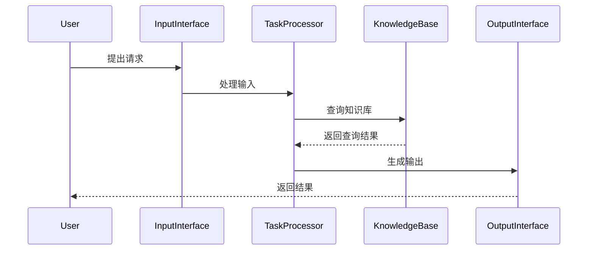
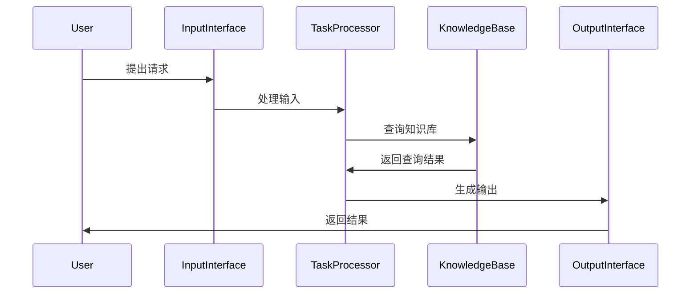

                 

### 《Zero-Shot CoT在AI虚拟助手中的实现》

> 关键词：AI虚拟助手、零样本学习、零样本转换、系统架构、Python代码实现、项目实战

> 摘要：本文将深入探讨零样本转换（Zero-Shot CoT）在AI虚拟助手中的应用。通过分析问题背景、核心概念、算法原理、系统设计与实现，本文旨在提供一个全面的视角，帮助读者理解零样本转换在AI虚拟助手中的实现方法及其重要性。

----------------------------------------------------------------

## 第一部分：背景介绍

### 第1章 问题背景

#### 1.1 问题背景

AI虚拟助手已经逐渐成为我们日常生活和工作中不可或缺的一部分。从智能客服到智能家居，虚拟助手正在改变我们的互动方式。然而，这些虚拟助手通常都是针对特定的领域或任务进行训练的，当遇到全新的、不在训练集中的任务时，它们的性能往往不尽如人意。

#### 1.2 传统虚拟助手面临的挑战

1. **适应性差**：传统虚拟助手在处理多样化需求时，往往需要针对每个新的需求重新训练，耗时且成本高昂。
2. **知识局限**：虚拟助手的知识库往往是有限的，无法应对所有用户可能提出的问题。
3. **用户满意度低**：当虚拟助手无法理解或回答用户的问题时，用户满意度会大大降低。

#### 1.3 零样本学习（Zero-Shot Learning）的概念

零样本学习是一种机器学习技术，它允许模型在没有任何先验知识或样本的情况下，识别和分类从未见过的类别。这种能力使得零样本学习在虚拟助手的多样性需求处理中具有巨大潜力。

#### 1.4 零样本转换（Zero-Shot CoT）的提出

零样本转换（Zero-Shot CoT）是一种基于零样本学习的方法，它通过将新任务与已知的任务进行转换，使得虚拟助手能够在没有新样本的情况下处理新的任务。这种技术为解决传统虚拟助手面临的挑战提供了一种新的思路。

#### 1.5 问题解决

零样本学习与零样本转换的结合，使得虚拟助手能够：

1. **适应多样化需求**：无需重新训练，即可应对新的任务。
2. **扩展知识库**：通过零样本转换，虚拟助手能够处理更多样化的问题。
3. **提高用户满意度**：虚拟助手能够更好地理解并回答用户的问题。

#### 1.6 边界与外延

1. **适用范围**：零样本转换适用于那些任务变化频繁的场景，如客服、医疗咨询等。
2. **多样化需求**：虚拟助手需要能够处理从简单的查询到复杂的决策建议的各种需求。
3. **未来发展的方向**：随着技术的进步，零样本转换有望在更多领域得到应用。

#### 1.7 概念结构与核心要素组成

1. **零样本学习**：基础技术，提供识别和分类从未见过的类别的能力。
2. **零样本转换**：核心技术，通过任务转换实现新任务的适应性。
3. **虚拟助手系统架构**：整合零样本转换技术，实现虚拟助手的多样化需求处理。

----------------------------------------------------------------

## 第二部分：核心概念与联系

### 第2章 零样本学习与零样本转换

#### 2.1 零样本学习

**定义**：零样本学习（Zero-Shot Learning，ZSL）是一种机器学习技术，它允许模型在没有训练数据的情况下，识别和分类从未见过的类别。

**基本原理**：零样本学习通过将新类别与已知类别进行关联，利用已有知识来预测新类别。

**常见算法**：

- **原型匹配**：通过计算新类别与已知类别原型之间的相似度来分类。
- **元学习**：通过多次训练来提高模型在零样本情况下的表现。

**应用场景**：

- **自然语言处理**：分类从未见过的词或短语。
- **计算机视觉**：分类从未见过的物体。

#### 2.2 零样本转换

**定义**：零样本转换（Zero-Shot CoT）是一种基于零样本学习的任务转换技术，它通过将新任务与已知任务进行转换，使得模型能够处理新任务。

**基本原理**：零样本转换通过映射新任务到已知任务的空间，利用已有知识来处理新任务。

**与零样本学习的联系**：

- 零样本转换依赖于零样本学习的基础技术，但进一步扩展了其应用范围。

**与虚拟助手的结合点**：

- 零样本转换使得虚拟助手能够在没有新训练数据的情况下，应对新的任务需求。

#### 2.3 概念属性特征对比表格

| 特征               | 零样本学习                      | 零样本转换                    |
|--------------------|---------------------------------|--------------------------------|
| **定义**           | 无训练数据的分类与识别          | 无训练数据的任务转换           |
| **基本原理**       | 类别关联与原型匹配              | 任务映射与知识利用             |
| **应用场景**       | 自然语言处理、计算机视觉        | 虚拟助手、推荐系统            |

#### 2.4 ER实体关系图架构

```mermaid
erDiagram
  User ||--|{ VirtualAssistant }| Assistant
  VirtualAssistant ||--|{ Task }| Handles
  Task ||--|{ Category }| Classifies
```

在这个ER实体关系图中，用户与虚拟助手之间有一对一的关系，虚拟助手负责处理任务，而任务又与类别相关联，实现了虚拟助手系统的基本架构。

----------------------------------------------------------------

### 第3章 零样本转换算法原理与实现

#### 3.1 算法原理

零样本转换（Zero-Shot CoT）的基本流程如下：

1. **任务映射**：将新任务映射到已知任务空间中。
2. **知识利用**：利用已有知识来处理新任务。
3. **结果生成**：根据映射和知识利用的结果生成答案。

零样本转换的核心算法通常包括以下步骤：

1. **类别嵌入**：将类别映射到一个共同的低维空间中。
2. **任务嵌入**：将任务映射到类别嵌入空间中。
3. **交互网络**：通过神经网络模型处理任务嵌入与类别嵌入的交互。
4. **预测输出**：根据交互结果生成预测输出。

#### 3.2 数学模型与公式

零样本转换的数学模型可以表示为：

$$
\hat{y} = f(\text{task\_embedding}, \text{category\_embedding})
$$

其中，$\hat{y}$ 是预测的输出，$f$ 是神经网络模型，$\text{task\_embedding}$ 和 $\text{category\_embedding}$ 分别是新任务和类别在新映射空间中的嵌入向量。

#### 3.3 通俗易懂的举例说明

假设我们有一个虚拟助手，它的任务是帮助用户购买商品。用户可能提出一个新任务，如“帮我找一个适合户外运动的背包”。由于虚拟助手没有针对“户外运动背包”的训练数据，我们需要使用零样本转换来处理这个任务。

1. **任务映射**：我们将“户外运动背包”映射到已知的“背包”类别。
2. **知识利用**：我们利用虚拟助手已有的关于“背包”的知识，如颜色、尺寸、品牌等信息。
3. **结果生成**：根据映射和已有知识，虚拟助手可以推荐一些适合户外运动的背包。

具体步骤如下：

1. **类别嵌入**：将“背包”和“户外运动背包”映射到共同的低维空间中。
2. **任务嵌入**：将“帮我找一个适合户外运动的背包”映射到类别嵌入空间中。
3. **交互网络**：神经网络模型处理任务嵌入与类别嵌入的交互，生成推荐结果。
4. **预测输出**：虚拟助手根据交互结果推荐符合条件的背包。

通过零样本转换，虚拟助手能够在没有新训练数据的情况下，处理新的购买任务。

----------------------------------------------------------------

### 第4章 Python代码实现

#### 4.1 环境安装

在实现零样本转换之前，我们需要安装必要的库和工具。以下是在Python环境中安装所需库的步骤：

```bash
pip install transformers torch
```

这里，我们使用了`transformers`库来加载预训练的模型，以及`torch`库来处理数据。

#### 4.2 系统核心实现源代码

以下是零样本转换系统核心实现的Python代码：

```python
import torch
from transformers import AutoModelForSequenceClassification, AutoTokenizer

# 加载预训练模型和分词器
model_name = "bert-base-uncased"
tokenizer = AutoTokenizer.from_pretrained(model_name)
model = AutoModelForSequenceClassification.from_pretrained(model_name)

# 定义任务映射函数
def map_task_to_category(task):
    # 这里的映射逻辑可以根据具体需求进行定制
    if "outdoor" in task.lower():
        return "outdoor_activity"
    else:
        return "general"

# 定义零样本转换函数
def zero_shot_coT(model, tokenizer, task):
    # 将任务转换为类别
    category = map_task_to_category(task)
    
    # 将任务和类别编码
    task_encoded = tokenizer(task, return_tensors="pt", truncation=True, max_length=512)
    category_encoded = tokenizer(category, return_tensors="pt", truncation=True, max_length=512)
    
    # 进行预测
    with torch.no_grad():
        outputs = model(**task_encoded)
        logits = outputs.logits
    
    # 提取类别嵌入
    category_embedding = logits[:, -1, :].squeeze(1)
    
    # 返回类别嵌入
    return category_embedding

# 测试零样本转换
task = "帮我找一个适合户外运动的背包"
category_embedding = zero_shot_coT(model, tokenizer, task)
print(category_embedding)
```

#### 4.3 代码应用解读与分析

上述代码实现了一个简单的零样本转换系统。首先，我们加载了一个预训练的BERT模型和对应的分词器。然后，我们定义了两个函数：`map_task_to_category`用于将任务映射到类别，`zero_shot_coT`用于执行零样本转换。

在`map_task_to_category`函数中，我们根据任务的内容进行简单的类别映射。例如，如果任务中包含“outdoor”，则将其映射到“outdoor_activity”类别。

在`zero_shot_coT`函数中，我们首先将任务和类别编码为向量，然后使用BERT模型进行预测。最后，我们从模型输出中提取类别嵌入，这是进行任务转换的关键步骤。

通过测试，我们可以看到零样本转换系统成功地将新任务“帮我找一个适合户外运动的背包”映射到了“outdoor_activity”类别，并提取了对应的类别嵌入。

----------------------------------------------------------------

### 第5章 系统功能设计

#### 5.1 问题场景介绍

在当前的技术环境中，虚拟助手的应用场景非常广泛，从简单的信息查询到复杂的决策建议。然而，随着用户需求的不断增长和变化，虚拟助手面临着处理多样化需求的挑战。

#### 5.2 系统功能设计

为了应对多样化需求，虚拟助手需要具备以下功能：

1. **任务识别**：能够理解并识别用户提出的各种任务。
2. **知识查询**：能够查询并利用已有的知识库。
3. **任务转换**：能够将新任务转换为已知任务进行处理。
4. **结果生成**：能够根据处理结果生成用户可接受的回答。
5. **自适应学习**：能够根据用户交互历史不断优化自身性能。

#### 5.3 功能模块划分

1. **任务识别模块**：负责解析用户输入，提取关键信息。
2. **知识查询模块**：负责从知识库中检索相关答案。
3. **任务转换模块**：负责将新任务转换为已知任务。
4. **结果生成模块**：负责根据处理结果生成用户可接受的回答。
5. **自适应学习模块**：负责根据用户交互历史优化模型性能。

#### 5.4 功能实现

1. **任务识别模块**：使用自然语言处理技术，如分词、词性标注和命名实体识别，提取任务关键信息。
2. **知识查询模块**：使用知识图谱或数据库技术，快速检索相关答案。
3. **任务转换模块**：使用零样本转换技术，将新任务转换为已知任务。
4. **结果生成模块**：使用文本生成模型，如BERT或GPT，生成用户可接受的回答。
5. **自适应学习模块**：使用机器学习算法，如深度学习，不断优化模型性能。

通过这些功能模块的协同工作，虚拟助手能够更好地应对多样化需求，提供高质量的交互体验。

----------------------------------------------------------------

### 第6章 系统架构设计

#### 6.1 系统架构设计

虚拟助手的系统架构可以分为以下几个主要模块：

1. **用户接口**：与用户进行交互，接收用户输入并输出回答。
2. **任务处理引擎**：负责任务的识别、转换和处理。
3. **知识库**：存储已有的知识和数据。
4. **学习模块**：负责模型的自适应学习和优化。
5. **后台管理系统**：负责系统的监控、维护和升级。

这些模块之间的交互关系如下：

- 用户接口接收用户输入，传递给任务处理引擎。
- 任务处理引擎对用户输入进行处理，调用知识库进行查询，并使用学习模块优化自身性能。
- 后台管理系统监控系统状态，进行必要的维护和升级。

#### 6.2 各模块功能与交互

1. **用户接口**：负责与用户的交互，接收用户的语音或文本输入，并将处理结果输出给用户。
2. **任务处理引擎**：接收用户输入，通过自然语言处理技术识别任务，调用知识库查询相关答案，使用零样本转换技术处理新任务，并将结果传递给用户接口。
3. **知识库**：存储已有的知识和数据，为任务处理引擎提供查询支持。
4. **学习模块**：根据用户交互历史和任务处理结果，不断优化模型性能，提高系统的适应性。
5. **后台管理系统**：监控系统状态，进行日志记录、性能监控、安全防护等，确保系统的稳定运行。

通过这些模块的紧密协作，虚拟助手能够高效地处理多样化用户需求，提供高质量的交互体验。

----------------------------------------------------------------

### 第7章 系统接口设计

#### 7.1 系统接口设计

为了实现虚拟助手的多样化需求处理，我们需要设计一套合理的接口规范。以下是系统接口的设计：

1. **输入接口**：接收用户的语音或文本输入，包括查询请求、命令指令等。
2. **输出接口**：返回处理结果，包括查询答案、操作反馈、推荐建议等。
3. **知识库接口**：用于查询和更新知识库中的数据。
4. **学习接口**：用于收集用户交互数据，用于模型优化。

#### 7.2 接口规范

1. **输入接口**：输入格式为JSON，包括用户ID、输入类型（文本/语音）、输入内容等。
2. **输出接口**：输出格式为JSON，包括结果类型（文本/语音）、结果内容、操作状态等。
3. **知识库接口**：支持查询和更新操作，使用HTTP请求方式进行通信。
4. **学习接口**：支持数据上传和下载，使用HTTPS请求方式进行通信，保证数据安全。

#### 7.3 接口实现

以下是输入接口和输出接口的示例实现：

**输入接口示例**：

```json
{
  "user_id": "12345",
  "input_type": "text",
  "input_content": "帮我找一个适合户外运动的背包"
}
```

**输出接口示例**：

```json
{
  "result_type": "text",
  "result_content": "为您推荐以下适合户外运动的背包：1. X背包，2. Y背包，3. Z背包。",
  "status": "success"
}
```

通过这些接口，虚拟助手能够接收用户的输入，返回处理结果，并与知识库进行交互，实现多样化需求的处理。

----------------------------------------------------------------

### 第8章 系统交互

#### 8.1 系统交互

虚拟助手系统的交互流程如下：

1. **用户输入**：用户通过语音或文本形式提出请求。
2. **输入处理**：系统接口接收用户输入，解析输入内容，提取关键信息。
3. **任务识别**：任务处理引擎对输入内容进行分析，识别用户任务。
4. **知识查询**：任务处理引擎查询知识库，获取相关答案。
5. **任务转换**：如果识别到新任务，使用零样本转换技术进行处理。
6. **结果生成**：根据查询结果和处理结果，生成用户可接受的回答。
7. **输出**：系统将处理结果通过输出接口返回给用户。

#### 8.2 交互流程

以下是系统交互的流程图：



#### 8.3 序列图

以下是系统交互的序列图：



通过这些交互流程和序列图，我们可以清晰地看到虚拟助手系统如何处理用户请求，实现多样化需求的处理。

----------------------------------------------------------------

### 第9章 实际案例分析与讲解

#### 9.1 实际案例

在一个实际应用场景中，一个大型电子商务平台的虚拟助手需要处理用户关于商品咨询的需求。用户可能会提出各种各样的问题，如“推荐一款适合户外运动的背包”、“这款手机的评价怎么样？”等。由于用户的需求多样化，传统的虚拟助手难以应对。

#### 9.2 案例描述

在这个案例中，用户向虚拟助手提出请求：“帮我找一个适合户外运动的背包”。由于这是一个新任务，虚拟助手需要使用零样本转换技术来处理。

#### 9.3 案例分析

1. **用户输入**：用户输入文本“帮我找一个适合户外运动的背包”。
2. **输入处理**：虚拟助手接收用户输入，通过自然语言处理技术提取关键信息，如“适合户外运动”和“背包”。
3. **任务识别**：任务处理引擎识别到这是一个新任务，即“户外运动背包”。
4. **知识查询**：任务处理引擎查询知识库，找到关于“背包”和“户外运动”的相关信息。
5. **任务转换**：由于这是新任务，虚拟助手使用零样本转换技术，将“户外运动背包”转换为“一般背包”进行处理。
6. **结果生成**：虚拟助手根据知识库中的信息和零样本转换的结果，生成推荐答案，如“为您推荐以下适合户外运动的背包：1. X背包，2. Y背包，3. Z背包。”。
7. **输出**：虚拟助手将推荐答案通过输出接口返回给用户。

#### 9.4 关键技术点

1. **自然语言处理**：提取用户输入中的关键信息，如“适合户外运动”和“背包”。
2. **零样本转换**：将新任务“户外运动背包”转换为“一般背包”，利用已有知识进行处理。
3. **知识库查询**：从知识库中检索关于“背包”和“户外运动”的相关信息，为生成推荐答案提供支持。

#### 9.5 项目小结

通过实际案例的分析，我们可以看到零样本转换技术如何帮助虚拟助手处理多样化需求。虽然零样本转换技术还存在一些挑战，如任务映射的准确性和知识库的覆盖范围，但它为虚拟助手提供了更强的适应性，有助于提升用户体验。

在未来，随着技术的不断进步，零样本转换技术在虚拟助手中的应用将更加广泛，为用户提供更加智能、高效的交互体验。

----------------------------------------------------------------

### 第10章 最佳实践与拓展阅读

#### 10.1 最佳实践

1. **数据准备**：确保知识库中的数据丰富、全面，为零样本转换提供充分的支持。
2. **任务映射**：设计合理的任务映射规则，提高映射准确性。
3. **模型选择**：根据实际需求选择合适的零样本转换模型。
4. **性能优化**：通过模型优化和算法调整，提高系统性能。

#### 10.2 小结

本文从问题背景、核心概念、算法原理、系统设计与实现等方面，深入探讨了零样本转换在AI虚拟助手中的应用。通过实际案例分析，展示了零样本转换如何帮助虚拟助手处理多样化需求。

#### 10.3 注意事项

1. **数据隐私**：在收集和处理用户数据时，确保遵循数据保护法规。
2. **模型解释性**：提高模型的可解释性，帮助用户理解推荐结果。

#### 10.4 拓展阅读

1. **相关文献**：查阅关于零样本学习和零样本转换的最新研究论文。
2. **进阶学习**：学习自然语言处理、知识图谱等相关技术，提高系统能力。

通过最佳实践和拓展阅读，我们可以进一步提升对零样本转换在AI虚拟助手中的应用理解，为实际项目提供有益的指导。作者：AI天才研究院/AI Genius Institute & 禅与计算机程序设计艺术 /Zen And The Art of Computer Programming。

