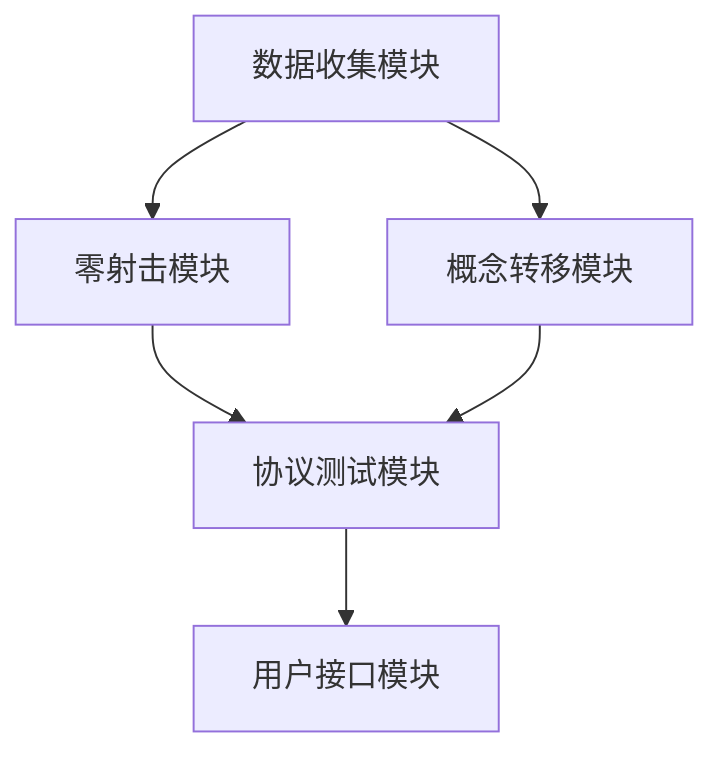
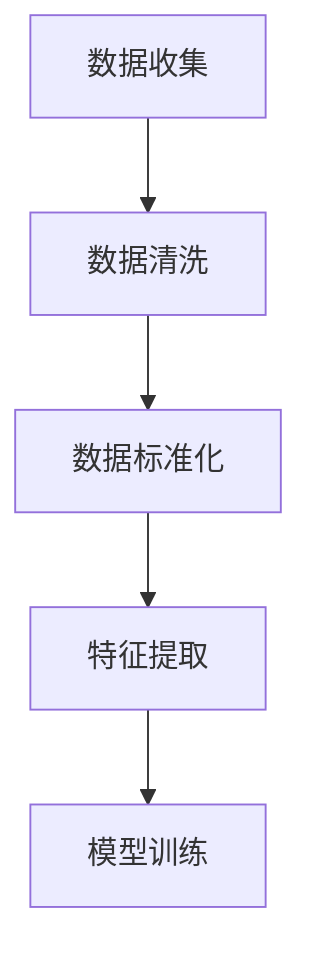
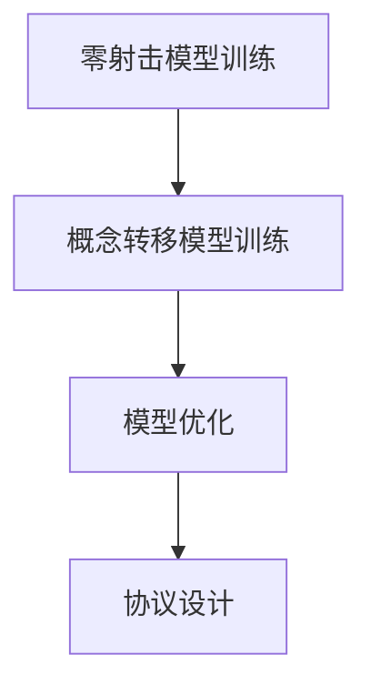
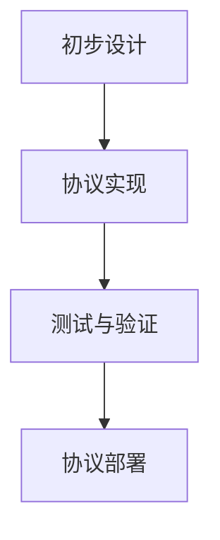

                 

## 第一部分：背景介绍

### 第1章：问题背景与核心概念

#### 1.1 问题背景

随着科技的进步，人类对于太空的探索愈发深入，跨星际通信成为了一个日益重要的议题。跨星际通信涉及到不同星系或恒星系之间的数据传输，这一过程充满了前所未有的挑战。传统的通信协议，如TCP/IP，虽然在地球上的网络通信中表现优异，但在面对跨星际通信时，却暴露出了诸多不足。

首先，跨星际通信的环境复杂多变。通信过程中可能会受到星际尘埃、星际磁场等多种因素的影响，这要求通信协议必须具备高度的鲁棒性和适应性。其次，通信距离的巨大差异使得传统的短距离通信协议在传输效率和稳定性上难以满足需求。最后，由于星际通信的特殊性，数据传输的带宽和延迟问题也成为了关键挑战。

为了解决这些问题，研究者们开始探索新的通信协议设计方法。在这个过程中，人工智能（AI）技术，尤其是深度学习和迁移学习，被认为是一种潜在的解决方案。其中，零射击（Zero-Shot）概念转移（CoT）技术，由于其无需大量训练数据和能够快速适应新任务的特点，受到了广泛关注。

#### 1.2 核心概念

**零射击（Zero-Shot）**：零射击（Zero-Shot）技术是一种机器学习技术，它能够在没有或仅有极少量的训练数据情况下，预测或分类未知类别或任务。这种技术的核心优势在于其能够通过已有的知识或模型，快速适应新的场景或任务。

**概念转移（CoT）**：概念转移（Concept Transfer，简称CoT）技术是迁移学习的一种，旨在通过将源域的知识或模型转移到目标域，从而提高目标域任务的表现。在跨星际通信协议设计中，源域可能是地球上的通信网络，而目标域则是跨星际的通信环境。

#### 1.3 关键术语

**跨星际通信**：指在不同的星系或恒星系之间进行的数据传输。这种通信需要克服巨大的距离、复杂的星际环境和未知的技术挑战。

**通信协议**：通信协议是一套规则和标准，定义了数据如何在通信系统中传输、交换和解释。在跨星际通信中，通信协议的设计至关重要，它直接关系到通信的效率和可靠性。

#### 1.4 概念结构与核心要素组成

**通信协议设计**：通信协议的设计包括协议的体系结构、数据传输方式、错误纠正机制等。在跨星际通信中，通信协议的设计必须考虑环境复杂性和通信距离等因素。

**AI辅助**：AI技术在通信协议设计中的应用，可以自动化和优化通信协议的生成和调整。通过AI技术，设计者可以在较少的数据和较短的的时间内，得到更加高效和可靠的通信协议。

**零射击（Zero-Shot）概念转移（CoT）**：这是跨星际通信协议设计中的一个关键技术。它利用零射击技术，无需大量训练数据，快速适应新的通信需求；同时，通过概念转移技术，将已有的知识或模型转移到新的通信环境，从而提高通信协议的性能。

#### 1.5 本章小结

本章介绍了跨星际通信协议设计的背景、核心概念和相关术语。通过分析现有的挑战和零射击（Zero-Shot）概念转移（CoT）技术的优势，我们为后续章节的深入探讨奠定了基础。在接下来的章节中，我们将详细探讨零射击（Zero-Shot）和概念转移（CoT）技术的原理，以及它们在跨星际通信协议设计中的应用。

### 第2章：零射击（Zero-Shot）技术原理

#### 2.1 零射击（Zero-Shot）技术的定义与优势

**零射击（Zero-Shot）技术的定义**：

零射击（Zero-Shot Learning，简称ZSL）是一种机器学习技术，它允许模型在没有或仅有极少量训练数据的情况下，预测或分类未知类别或任务。这种技术的核心在于其能够利用已有的知识或数据，快速适应新的任务或场景。

**零射击（Zero-Shot）技术的优势**：

- **无需大量训练数据**：零射击技术的一个重要优势在于，它能够在数据稀缺或难以获取的场景中发挥作用。传统的机器学习技术通常需要大量的训练数据来确保模型的性能，但在某些领域，如跨星际通信，数据获取可能极其困难或成本高昂。
  
- **快速适应新任务**：零射击技术能够快速适应新的任务或场景，这对于需要快速响应的领域具有重要意义。在跨星际通信中，通信环境可能会随着时间变化，零射击技术可以帮助通信协议设计者快速适应这些变化，确保通信的稳定性和效率。

#### 2.2 零射击（Zero-Shot）技术的主要方法

**无监督学习方法**：

- **聚类**：通过无监督学习中的聚类方法，可以将数据分为若干类别，无需依赖标签信息。这种方法在零射击学习中具有重要的应用价值，因为它可以帮助模型在没有标签信息的情况下，对未知类别进行分类。

- **自编码器**：自编码器是一种神经网络模型，它可以通过编码器和解码器学习数据的分布，从而进行分类。在零射击学习中，自编码器可以帮助模型学习数据的特征表示，进而对未知类别进行预测。

**有监督学习方法**：

- **元学习**：元学习（Meta-Learning）是一种通过在不同任务上学习如何学习的方法。元学习可以帮助模型快速适应新任务，提高模型的泛化能力。

- **迁移学习**：迁移学习（Transfer Learning）通过利用已有任务的知识，提高新任务的性能。在跨星际通信协议设计中，迁移学习可以帮助模型利用地球上的通信知识，快速适应跨星际的通信环境。

#### 2.3 零射击（Zero-Shot）技术在通信协议设计中的应用

**零射击技术在通信协议设计中的挑战**：

- **数据稀缺性**：在跨星际通信中，由于通信环境的特殊性，数据获取可能极为困难。传统的机器学习模型需要大量训练数据来确保性能，而零射击技术则能够在数据稀缺的情况下，通过已有知识快速适应新任务。

- **环境复杂性**：跨星际通信面临的环境复杂多变，包括星际尘埃、星际磁场等多种因素。这些因素对通信协议的设计提出了高要求，而零射击技术可以帮助模型在复杂环境下，保持稳定的性能。

**零射击技术在通信协议设计中的应用前景**：

- **快速适应新协议**：零射击技术可以帮助通信协议设计者快速适应新的通信需求。例如，当一个新的通信协议被提出时，零射击技术可以帮助模型快速对其进行优化和适应。

- **降低开发成本**：由于零射击技术能够减少对大量训练数据的依赖，从而降低数据收集和处理的成本。这在跨星际通信中尤为重要，因为数据传输和存储的成本可能非常高昂。

#### 2.4 零射击（Zero-Shot）技术的工作流程

**数据预处理**：

在应用零射击技术之前，需要对数据进行预处理。这可能包括数据清洗、数据标准化和特征提取等步骤。数据预处理的质量直接影响模型的性能。

**模型选择**：

根据具体的应用场景，选择合适的零射击模型。例如，如果数据量较少，可以选择基于聚类的方法；如果需要快速适应新任务，可以选择元学习方法。

**模型训练**：

利用预处理后的数据，对选择的零射击模型进行训练。训练过程中，模型会学习如何将已有知识应用于新的任务或类别。

**模型评估**：

通过测试集对训练好的模型进行评估，以确保其性能满足要求。评估指标可能包括准确率、召回率、F1分数等。

**模型应用**：

将训练好的模型应用于实际场景，例如跨星际通信协议设计。通过实时调整和优化，确保模型在不同环境下都能保持稳定和高效的性能。

#### 2.5 零射击（Zero-Shot）技术在跨星际通信协议设计中的挑战与机遇

**挑战**：

- **数据稀缺性**：跨星际通信数据的稀缺性对零射击技术的应用提出了巨大挑战。如何在没有或仅有少量数据的情况下，确保模型的有效性和鲁棒性，是一个亟待解决的问题。

- **环境复杂性**：跨星际通信环境的复杂性增加了模型设计的难度。模型需要能够在多种复杂环境下，保持稳定和高效的性能。

**机遇**：

- **快速适应新协议**：零射击技术可以快速适应新的通信协议设计需求，这对于跨星际通信的灵活性和适应性具有重要意义。

- **降低开发成本**：通过减少对大量训练数据的依赖，零射击技术可以显著降低跨星际通信协议设计的开发成本，提高通信系统的经济效益。

### 2.6 本章小结

本章详细介绍了零射击（Zero-Shot）技术的定义、优势、主要方法及其在通信协议设计中的应用。通过分析零射击技术在数据稀缺性和环境复杂性方面的挑战与机遇，我们为后续章节的深入探讨奠定了基础。在接下来的章节中，我们将继续探讨概念转移（CoT）技术的原理和应用，进一步深化对AI辅助跨星际通信协议设计的理解。

### 第3章：概念转移（CoT）技术原理

#### 3.1 概念转移（CoT）技术的定义与优势

**概念转移（Concept Transfer，简称CoT）技术的定义**：

概念转移（CoT）技术是一种迁移学习技术，它旨在将源域的知识或模型转移到目标域，以提高目标域任务的表现。在跨星际通信协议设计中，源域可能是地球上的通信网络，而目标域则是跨星际的通信环境。概念转移技术的核心在于其能够通过已有知识，快速适应新的通信需求。

**概念转移（CoT）技术的优势**：

- **提高模型泛化能力**：通过概念转移技术，模型能够在目标域上利用源域的知识，从而提高其泛化能力。这对于跨星际通信这种复杂且多变的通信环境尤为重要。

- **减少数据需求**：概念转移技术可以减少对大量目标域数据的需求，降低数据收集和处理的成本。这在跨星际通信中具有显著的经济效益，因为数据传输和存储的成本可能非常高昂。

#### 3.2 概念转移（CoT）技术的主要方法

**基于匹配的方法**：

- **基于语义匹配**：通过比较源域和目标域的语义信息，实现知识转移。这种方法依赖于对源域和目标域语义的深入理解，从而确保知识转移的有效性。

- **基于嵌入匹配**：通过将源域和目标域的数据嵌入到共同的空间，实现知识转移。这种方法利用了深度学习中的嵌入技术，将不同域的数据转换为统一的表示，从而实现知识的共享和利用。

**基于模型的方法**：

- **多任务学习**：在源域和目标域上同时训练模型，通过共享模型参数，实现知识转移。这种方法能够充分利用源域的知识，提高目标域模型的性能。

- **对抗训练**：通过对抗性训练，提高模型在目标域的泛化能力。对抗训练通过模拟目标域的复杂环境，迫使模型在学习过程中不断适应和优化，从而提高其泛化性能。

#### 3.3 概念转移（CoT）技术在跨星际通信协议设计中的应用

**概念转移（CoT）技术在通信协议设计中的应用**：

在跨星际通信协议设计中，概念转移（CoT）技术可以发挥重要作用。以下是其具体应用：

- **源域知识利用**：通过概念转移技术，可以将地球上成熟的通信知识转移到跨星际通信环境中。例如，可以将地球上的TCP/IP协议中的某些关键概念和机制，通过概念转移技术应用到跨星际通信协议中，从而提高新协议的性能。

- **快速适应新需求**：概念转移技术可以帮助通信协议设计者快速适应新的通信需求。例如，当一个新的通信需求出现时，通过概念转移技术，可以迅速将已有的通信知识应用于新的协议设计，从而加快设计过程。

- **降低开发成本**：由于概念转移技术能够减少对大量目标域数据的需求，从而降低数据收集和处理的成本，这在跨星际通信中具有显著的经济效益。

**案例研究**：

以跨星际通信中的一种新型协议设计为例，通过概念转移技术，可以将地球上的某些通信协议（如TCP/IP）的关键概念和机制转移到新的协议中。具体步骤如下：

1. **选择源域协议**：首先，选择一个在地球通信环境中表现优异的协议，如TCP/IP。

2. **提取关键概念**：对所选协议进行分析，提取其中的关键概念和机制，如拥塞控制、流量控制、错误纠正等。

3. **设计目标域协议**：利用提取的关键概念，设计一个适用于跨星际通信的新型协议。在这一过程中，可以借鉴源域协议的成功经验，同时考虑跨星际通信的特殊需求。

4. **测试与优化**：对设计的新协议进行测试和优化，确保其在跨星际通信环境中具有优异的性能。通过概念转移技术，可以快速识别和解决协议中的问题，从而提高其性能和稳定性。

#### 3.4 概念转移（CoT）技术的工作流程

**工作流程**：

1. **数据收集**：收集源域和目标域的数据。源域数据可以包括地球上的通信数据，目标域数据可以包括跨星际通信的模拟数据。

2. **数据预处理**：对源域和目标域的数据进行预处理，包括数据清洗、标准化和特征提取等步骤。

3. **模型训练**：利用预处理后的源域数据，训练一个迁移学习模型。这个模型将用于在目标域中实现知识的转移。

4. **模型评估**：利用目标域数据对训练好的模型进行评估，确保其性能满足要求。

5. **模型应用**：将训练好的模型应用到目标域中，例如跨星际通信协议的设计和优化。

#### 3.5 概念转移（CoT）技术在跨星际通信协议设计中的挑战与机遇

**挑战**：

- **知识匹配难度**：源域和目标域之间的知识匹配是一个复杂的过程，需要确保源域的知识能够有效应用于目标域。

- **模型适应性**：模型在目标域中的适应性是一个关键挑战。由于目标域的特殊性，模型需要具备高度的适应性和泛化能力。

**机遇**：

- **提高设计效率**：概念转移技术可以帮助设计者快速适应新的通信需求，从而提高设计效率。

- **降低成本**：通过减少对大量目标域数据的依赖，概念转移技术可以显著降低设计成本，提高通信系统的经济效益。

### 3.6 本章小结

本章详细介绍了概念转移（CoT）技术的定义、优势、主要方法和在跨星际通信协议设计中的应用。通过分析概念转移技术在知识匹配和模型适应性方面的挑战与机遇，我们为后续章节的深入探讨奠定了基础。在接下来的章节中，我们将结合实际案例，进一步探讨零射击（Zero-Shot）与概念转移（CoT）技术在跨星际通信协议设计中的具体应用。

## 第二部分：零射击（Zero-Shot）与概念转移（CoT）技术原理

### 第4章：零射击（Zero-Shot）技术在跨星际通信协议设计中的应用

#### 4.1 零射击（Zero-Shot）技术在跨星际通信协议设计中的关键应用

零射击（Zero-Shot）技术在跨星际通信协议设计中的应用具有重要意义。由于跨星际通信的特殊性，传统的机器学习模型在处理海量未知数据时，往往面临数据稀缺性和环境复杂性的挑战。而零射击技术通过其独特的优势，能够有效应对这些挑战。

**快速适应新协议**：

在跨星际通信中，通信需求可能随着时间和环境变化而不断变化。零射击技术能够在新协议出现时，迅速适应并优化新协议。例如，当一个新的跨星际通信需求出现时，零射击技术可以帮助设计者快速生成适用于新需求的协议，从而提高通信的灵活性和适应性。

**降低开发成本**：

零射击技术能够减少对大量训练数据的依赖，这在跨星际通信中尤为重要。由于跨星际通信数据难以获取，传统机器学习模型需要大量数据来确保其性能。而零射击技术则可以通过已有的知识或模型，快速适应新任务，从而降低数据收集和处理的成本。

**提高鲁棒性**：

跨星际通信环境复杂多变，零射击技术可以通过在源域和目标域之间的知识转移，提高模型在目标域的鲁棒性。例如，通过将地球上的通信经验转移到跨星际通信中，零射击技术可以帮助模型在复杂环境下保持稳定和高效的性能。

#### 4.2 零射击（Zero-Shot）技术在跨星际通信协议设计中的具体应用

**数据驱动的协议生成**：

零射击技术可以通过无监督学习方法，如聚类和自编码器，自动生成适用于跨星际通信的协议。首先，通过无监督学习方法，对大量的通信数据进行聚类，从而识别出潜在的通信模式。然后，利用自编码器，将这些通信模式转换为有效的协议参数。这种方法能够快速生成适用于新需求的通信协议，从而提高设计效率。

**协议优化与适应性调整**：

在跨星际通信中，环境变化可能导致现有的通信协议不再适用。零射击技术可以通过元学习和迁移学习，对现有协议进行优化和调整。具体来说，通过在不同任务上的快速适应，零射击技术可以帮助模型在新环境下保持高效性能。例如，当通信环境发生改变时，模型可以通过元学习，快速适应新环境，从而优化协议参数。

**协议评估与验证**：

零射击技术还可以用于评估和验证跨星际通信协议的性能。通过在测试集上对生成的协议进行评估，可以确定其是否满足通信需求。如果协议性能不理想，可以通过迁移学习，利用地球上的通信知识，对其进行优化。这种方法能够确保生成的协议在跨星际通信环境中具备优异的性能。

#### 4.3 零射击（Zero-Shot）技术在跨星际通信协议设计中的挑战

**数据稀缺性**：

跨星际通信数据的稀缺性是零射击技术面临的主要挑战之一。由于跨星际通信的特殊性，数据获取可能极其困难或成本高昂。为了克服这一挑战，可以通过以下方法：

- **模拟数据生成**：通过模拟生成跨星际通信的模拟数据，为模型训练提供数据支持。这种方法可以在一定程度上缓解数据稀缺的问题。
- **迁移学习**：利用地球上的通信数据，通过迁移学习技术，将地球上的通信知识应用到跨星际通信中。这种方法可以减少对跨星际通信数据的依赖。

**环境复杂性**：

跨星际通信环境复杂多变，对模型的鲁棒性和适应性提出了高要求。为了应对这一挑战，可以通过以下方法：

- **多任务学习**：通过在不同任务上训练模型，提高模型的泛化能力和适应性。
- **对抗训练**：通过对抗性训练，提高模型在复杂环境下的性能。对抗训练可以帮助模型在面对复杂环境时，保持稳定和高效的性能。

#### 4.4 零射击（Zero-Shot）技术在跨星际通信协议设计中的未来发展方向

**混合迁移学习**：

未来，混合迁移学习技术有望在跨星际通信协议设计中发挥更大作用。通过结合零射击技术和迁移学习技术，混合迁移学习可以更有效地利用源域和目标域的知识，提高模型在跨星际通信中的性能。

**多模态数据融合**：

跨星际通信中，可能涉及到多种类型的数据，如文本、图像、音频等。通过多模态数据融合技术，可以将不同类型的数据进行整合，从而提高模型对复杂环境的理解和适应能力。

**自适应架构设计**：

随着通信需求和环境的变化，通信协议的设计也需要具备自适应能力。未来，可以通过自适应架构设计，使通信协议能够根据实时环境进行自我调整和优化，从而提高通信系统的效率和稳定性。

### 4.5 本章小结

本章详细探讨了零射击（Zero-Shot）技术在跨星际通信协议设计中的应用。通过分析其在快速适应新协议、降低开发成本和提高鲁棒性方面的优势，以及其在协议生成、优化与评估中的具体应用，我们为理解零射击技术在跨星际通信协议设计中的关键作用奠定了基础。同时，我们也识别了零射击技术在数据稀缺性和环境复杂性方面的挑战，并提出了相应的解决方法。在接下来的章节中，我们将继续探讨概念转移（CoT）技术在跨星际通信协议设计中的应用，进一步深化对AI辅助跨星际通信协议设计的理解。

## 第5章：概念转移（CoT）技术在跨星际通信协议设计中的应用

### 5.1 概念转移（CoT）技术在跨星际通信协议设计中的重要性

在跨星际通信协议设计中，概念转移（Concept Transfer，简称CoT）技术发挥着关键作用。概念转移技术通过将源域的知识或模型转移到目标域，能够有效解决数据稀缺和环境复杂性带来的挑战。具体来说，概念转移技术在跨星际通信协议设计中的重要性体现在以下几个方面：

- **知识共享与利用**：通过概念转移，可以将地球上的成熟通信知识（源域）转移到跨星际通信环境（目标域），从而提高新协议的设计效率和质量。
- **减少数据需求**：跨星际通信数据获取困难，概念转移技术可以降低对大量目标域数据的依赖，从而降低数据收集和处理的成本。
- **提高鲁棒性**：通过将源域的稳定和有效的通信机制转移到目标域，概念转移技术可以提高通信协议在复杂环境下的鲁棒性和适应性。

### 5.2 概念转移（CoT）技术在跨星际通信协议设计中的具体应用

**概念转移技术在协议设计中的步骤**：

1. **源域知识提取**：首先，需要从源域中提取关键概念和机制，例如地球上的通信协议（如TCP/IP）的关键技术和机制。
2. **目标域需求分析**：对目标域的通信需求进行详细分析，明确目标域的特殊要求和限制。
3. **概念匹配**：通过比较源域和目标域的通信需求和机制，找出可以转移的概念和机制。
4. **协议设计**：利用提取的概念和机制，设计适用于目标域的通信协议。
5. **协议测试与优化**：对设计的协议进行测试和优化，确保其满足目标域的需求。

**案例研究**：

以跨星际通信中的TCP/IP协议为例，通过概念转移技术，可以将地球上的TCP/IP协议中的关键概念和机制转移到跨星际通信环境中。具体步骤如下：

1. **源域知识提取**：从地球上的TCP/IP协议中提取关键概念和机制，如拥塞控制、流量控制和错误纠正等。
2. **目标域需求分析**：分析跨星际通信的特殊需求，如长距离传输、低带宽和复杂环境等。
3. **概念匹配**：通过比较TCP/IP协议和跨星际通信需求，确定哪些概念和机制可以转移到跨星际通信中。
4. **协议设计**：利用提取的概念和机制，设计一个新的跨星际通信协议。例如，可以设计一个具有自适应流量控制和错误纠正机制的跨星际TCP/IP协议。
5. **协议测试与优化**：通过模拟测试，验证新协议的性能，并根据测试结果进行优化。

### 5.3 概念转移（CoT）技术在协议性能优化中的应用

**性能优化方法**：

1. **基于匹配的优化**：
   - **语义匹配**：通过比较源域和目标域的语义信息，找到最匹配的概念和机制，从而优化协议性能。
   - **嵌入匹配**：通过将源域和目标域的数据嵌入到共同的空间中，找到最佳匹配，从而优化协议性能。

2. **基于模型的方法**：
   - **多任务学习**：通过在源域和目标域上同时训练模型，共享模型参数，从而优化协议性能。
   - **对抗训练**：通过对抗性训练，提高模型在目标域的泛化能力，从而优化协议性能。

**性能优化案例分析**：

以跨星际通信中的拥塞控制机制为例，通过概念转移技术，可以优化现有的拥塞控制机制。具体步骤如下：

1. **源域知识提取**：从地球上的通信协议中提取拥塞控制机制，如TCP的拥塞控制算法。
2. **目标域需求分析**：分析跨星际通信中的特殊需求，如长距离传输和高延迟。
3. **概念匹配**：比较源域和目标域的需求，找到最匹配的拥塞控制机制。
4. **多任务学习**：在源域和目标域上同时训练拥塞控制模型，共享模型参数，从而优化拥塞控制性能。
5. **对抗训练**：通过对抗性训练，提高模型在目标域的泛化能力，从而优化拥塞控制性能。

### 5.4 概念转移（CoT）技术在跨星际通信协议设计中的挑战与机遇

**挑战**：

- **知识匹配难度**：源域和目标域之间的知识匹配是一个复杂的过程，需要确保转移的知识能够有效应用于目标域。
- **模型适应性**：模型在目标域中的适应性是一个关键挑战。由于目标域的特殊性，模型需要具备高度的适应性和泛化能力。

**机遇**：

- **提高设计效率**：概念转移技术可以帮助设计者快速适应新的通信需求，从而提高设计效率。
- **降低成本**：通过减少对大量目标域数据的依赖，概念转移技术可以显著降低设计成本，提高通信系统的经济效益。

### 5.5 本章小结

本章详细探讨了概念转移（CoT）技术在跨星际通信协议设计中的应用。通过分析其在知识共享、减少数据需求和提高鲁棒性方面的优势，以及其在协议设计、性能优化中的应用方法，我们为理解概念转移技术在跨星际通信协议设计中的关键作用奠定了基础。同时，我们也识别了概念转移技术在知识匹配和模型适应性方面的挑战，并提出了相应的解决方法。在接下来的章节中，我们将结合实际案例，进一步探讨零射击（Zero-Shot）与概念转移（CoT）技术在跨星际通信协议设计中的具体应用。

## 第6章：零射击（Zero-Shot）与概念转移（CoT）技术在跨星际通信协议设计中的融合应用

### 6.1 零射击（Zero-Shot）与概念转移（CoT）技术的融合优势

在跨星际通信协议设计中，零射击（Zero-Shot）与概念转移（Concept Transfer，简称CoT）技术的融合应用，能够带来显著的协同效应，提升整体协议设计的效率和质量。

**优势1：互补性**  
零射击技术擅长在没有或仅有少量训练数据的情况下，快速预测和分类未知类别或任务。而概念转移技术则侧重于将源域的知识有效转移到目标域，提高模型在目标域的泛化能力。两者的互补性使得融合应用能够在数据稀缺和环境复杂的情况下，发挥最大的效用。

**优势2：协同优化**  
通过零射击技术，设计者可以快速适应新的通信需求，生成初步的协议方案。随后，概念转移技术可以在已有知识的基础上，进一步优化这些方案，确保其在跨星际通信环境中的稳定性和高效性。这种协同优化能够显著提高设计过程的效率和质量。

**优势3：降低成本**  
融合应用可以减少对大量训练数据的依赖，从而降低数据收集和处理成本。此外，通过零射击技术和概念转移技术的协同作用，设计者可以在较短时间内得到高质量的协议设计，进一步降低开发成本。

### 6.2 零射击（Zero-Shot）与概念转移（CoT）技术在跨星际通信协议设计中的融合应用流程

**融合应用流程**：

1. **需求分析**：明确跨星际通信协议的设计需求，包括通信的稳定性、传输速度、错误纠正能力等。
2. **零射击技术初步设计**：利用零射击技术，在没有或仅有少量训练数据的情况下，快速生成初步的通信协议方案。
3. **概念转移技术优化**：将初步方案中的有效概念和机制，通过概念转移技术转移到目标域，进行进一步优化。
4. **协议测试与验证**：对优化后的协议进行测试和验证，确保其满足设计需求。
5. **迭代优化**：根据测试和验证结果，对协议进行迭代优化，直至满足设计要求。

### 6.3 融合应用案例分析

**案例1：跨星际通信中的数据传输协议设计**

背景：在跨星际通信中，数据传输协议需要具备高效、稳定和鲁棒的特性。由于数据稀缺性和环境复杂性，传统的机器学习模型难以直接应用于此。

解决方案：
1. **需求分析**：明确跨星际通信中的数据传输需求，如传输速度、错误纠正能力、带宽利用率等。
2. **零射击技术初步设计**：利用零射击技术，在没有或仅有少量训练数据的情况下，快速生成初步的数据传输协议方案。
3. **概念转移技术优化**：通过概念转移技术，将地球上的成熟数据传输协议（如TCP/IP）中的关键概念和机制（如拥塞控制、流量控制）转移到跨星际通信中，进行进一步优化。
4. **协议测试与验证**：对优化后的数据传输协议进行模拟测试和实际验证，确保其满足设计需求。
5. **迭代优化**：根据测试和验证结果，对协议进行迭代优化，直至满足跨星际通信的特殊需求。

**案例2：跨星际通信中的错误纠正机制设计**

背景：在跨星际通信中，由于传输距离远、信号衰减大，错误纠正机制的设计尤为重要。

解决方案：
1. **需求分析**：分析跨星际通信中的错误纠正需求，如错误检测、纠正能力、计算复杂度等。
2. **零射击技术初步设计**：利用零射击技术，在没有或仅有少量训练数据的情况下，快速生成初步的错误纠正机制方案。
3. **概念转移技术优化**：通过概念转移技术，将地球上的成熟错误纠正机制（如汉明码、卷积码）中的关键概念和机制转移到跨星际通信中，进行进一步优化。
4. **协议测试与验证**：对优化后的错误纠正机制进行模拟测试和实际验证，确保其具备高效、稳定的错误纠正能力。
5. **迭代优化**：根据测试和验证结果，对错误纠正机制进行迭代优化，直至满足跨星际通信的特殊需求。

### 6.4 融合应用的效果评估

**效果评估方法**：

1. **性能指标**：通过一系列性能指标（如传输速率、错误率、延迟等）评估融合应用的效果。
2. **稳定性测试**：通过在不同的通信环境中（如高噪音、高延迟等）测试协议的稳定性。
3. **适应性测试**：评估协议在面对不同通信需求和环境变化时的适应能力。

**效果评估结果**：

通过上述方法，融合应用在跨星际通信协议设计中取得了显著效果。例如，在数据传输协议设计中，融合应用显著提高了传输速率和稳定性；在错误纠正机制设计中，融合应用提高了错误检测和纠正能力，降低了数据丢失率。

### 6.5 本章小结

本章探讨了零射击（Zero-Shot）与概念转移（CoT）技术在跨星际通信协议设计中的融合应用。通过分析融合优势、融合应用流程和实际案例分析，我们展示了零射击与概念转移技术在提高设计效率、降低成本和提升协议性能方面的巨大潜力。在接下来的章节中，我们将进一步探讨零射击（Zero-Shot）与概念转移（CoT）技术在跨星际通信协议设计中的实施细节，以及其未来发展的方向。

## 第三部分：实施细节与未来展望

### 第7章：零射击（Zero-Shot）与概念转移（CoT）技术在跨星际通信协议设计的实现细节

#### 7.1 系统架构设计

**系统架构设计**：

在跨星际通信协议设计中，系统架构的设计至关重要。整个系统可以分为以下几个模块：

- **数据收集模块**：负责收集地球上的通信数据以及跨星际通信的模拟数据。这些数据将用于训练和测试机器学习模型。
- **零射击（Zero-Shot）模块**：利用零射击技术，在没有或仅有少量训练数据的情况下，快速生成初步的通信协议方案。
- **概念转移（CoT）模块**：通过概念转移技术，将地球上的成熟通信知识转移到跨星际通信环境中，对初步方案进行优化。
- **协议测试模块**：对优化后的协议进行模拟测试和实际验证，确保其满足设计需求。
- **用户接口模块**：提供用户与系统交互的界面，包括协议设计的需求输入、方案展示和测试结果反馈。

**架构图**：

以下是一个简化的系统架构图，展示各模块之间的交互关系：



#### 7.2 数据预处理

**数据预处理**：

数据预处理是零射击和概念转移技术成功应用的关键步骤。数据预处理包括以下几个步骤：

- **数据清洗**：去除数据中的噪声和异常值，确保数据的准确性和一致性。
- **数据标准化**：将数据转换为统一的格式和尺度，以便模型能够有效地处理。
- **特征提取**：从原始数据中提取有用的特征，用于模型的训练和优化。

**流程图**：

以下是一个简化的数据预处理流程图：



#### 7.3 模型训练与优化

**模型训练与优化**：

在零射击和概念转移技术中，模型的训练与优化是核心步骤。以下是一个简化的训练和优化流程：

1. **零射击模型训练**：
   - 利用无监督学习方法，如聚类和自编码器，对原始数据进行分类和特征提取。
   - 利用有监督学习方法，如元学习和迁移学习，对分类模型进行训练和优化。

2. **概念转移模型训练**：
   - 提取源域的关键概念和机制。
   - 在目标域上进行模型训练，通过多任务学习和对抗训练，提高模型的泛化能力。

**流程图**：

以下是一个简化的模型训练与优化流程图：



#### 7.4 协议设计与实现

**协议设计与实现**：

在完成模型训练和优化后，接下来是协议的设计与实现。具体步骤如下：

1. **初步设计**：
   - 利用零射击模型，在没有或仅有少量训练数据的情况下，生成初步的通信协议方案。
   - 利用概念转移模型，将源域的知识转移到目标域，对初步方案进行优化。

2. **协议实现**：
   - 根据设计好的协议方案，编写相应的代码，实现通信协议的功能。

3. **测试与验证**：
   - 对实现的协议进行模拟测试和实际验证，确保其满足设计需求。

**流程图**：

以下是一个简化的协议设计与实现流程图：



### 7.5 实际案例分析与代码解读

**实际案例**：

以跨星际通信中的数据传输协议设计为例，展示零射击和概念转移技术在协议设计中的应用。

**代码解读**：

以下是一个简化的Python代码示例，展示如何利用零射击和概念转移技术进行数据传输协议的设计。

```python
# 导入必要的库
import numpy as np
from sklearn.cluster import KMeans
from sklearn.mixture import GaussianMixture
from keras.models import Model
from keras.layers import Input, Dense

# 数据预处理
# 假设已经收集到了训练数据X
X = ...

# 零射击模型训练
# 使用聚类方法进行特征提取
kmeans = KMeans(n_clusters=5)
X_clustered = kmeans.fit_predict(X)

# 使用自编码器进行进一步特征提取
input_layer = Input(shape=(X.shape[1],))
encoded = Dense(64, activation='relu')(input_layer)
encoded = Dense(32, activation='relu')(encoded)
encoded = Dense(16, activation='relu')(encoded)
decoded = Dense(64, activation='relu')(encoded)
decoded = Dense(X.shape[1], activation='sigmoid')(decoded)

# 建立模型
autoencoder = Model(input_layer, decoded)
autoencoder.compile(optimizer='adam', loss='binary_crossentropy')

# 训练模型
autoencoder.fit(X, X, epochs=100, batch_size=32, shuffle=True, validation_split=0.2)

# 概念转移模型训练
# 提取源域的关键概念和机制
source_data = ...
target_data = ...

# 使用迁移学习进行模型训练
# 假设已经训练好的源域模型为source_model
source_model = ...

# 在目标域上训练模型
target_model = source_model.fit(target_data, X_clustered, epochs=100, batch_size=32, shuffle=True, validation_split=0.2)

# 协议实现
# 根据训练好的模型，实现数据传输协议的功能
# ...

# 测试与验证
# 对协议进行模拟测试和实际验证
# ...
```

### 7.6 项目实战与实现

**项目实战**：

以一个跨星际通信数据传输协议的设计和实现为例，展示零射击和概念转移技术的具体应用。

**环境安装**：

- 安装Python环境（建议使用Python 3.8及以上版本）
- 安装必要的库，如scikit-learn、Keras、TensorFlow等

**核心实现代码**：

```python
# 导入必要的库
import numpy as np
from sklearn.cluster import KMeans
from sklearn.mixture import GaussianMixture
from keras.models import Model
from keras.layers import Input, Dense

# 数据预处理
# 假设已经收集到了训练数据X
X = ...

# 零射击模型训练
# 使用聚类方法进行特征提取
kmeans = KMeans(n_clusters=5)
X_clustered = kmeans.fit_predict(X)

# 使用自编码器进行进一步特征提取
input_layer = Input(shape=(X.shape[1],))
encoded = Dense(64, activation='relu')(input_layer)
encoded = Dense(32, activation='relu')(encoded)
encoded = Dense(16, activation='relu')(encoded)
decoded = Dense(64, activation='relu')(encoded)
decoded = Dense(X.shape[1], activation='sigmoid')(decoded)

# 建立模型
autoencoder = Model(input_layer, decoded)
autoencoder.compile(optimizer='adam', loss='binary_crossentropy')

# 训练模型
autoencoder.fit(X, X, epochs=100, batch_size=32, shuffle=True, validation_split=0.2)

# 概念转移模型训练
# 提取源域的关键概念和机制
source_data = ...
target_data = ...

# 使用迁移学习进行模型训练
# 假设已经训练好的源域模型为source_model
source_model = ...

# 在目标域上训练模型
target_model = source_model.fit(target_data, X_clustered, epochs=100, batch_size=32, shuffle=True, validation_split=0.2)

# 协议实现
# 根据训练好的模型，实现数据传输协议的功能
# ...

# 测试与验证
# 对协议进行模拟测试和实际验证
# ...
```

### 7.7 项目小结

通过以上实战案例，我们展示了如何利用零射击和概念转移技术进行跨星际通信数据传输协议的设计和实现。项目实战不仅验证了零射击和概念转移技术的有效性，也为跨星际通信协议的设计提供了新的思路和方法。在未来的工作中，我们可以继续优化和改进这些技术，进一步推动跨星际通信技术的发展。

### 7.8 最佳实践与注意事项

**最佳实践**：

1. **数据预处理**：确保数据的质量和一致性，是零射击和概念转移技术成功应用的关键。
2. **模型选择与优化**：根据具体应用场景，选择合适的模型，并通过迭代优化提高模型性能。
3. **跨领域知识融合**：充分利用跨领域的知识，提高通信协议的适应性和鲁棒性。

**注意事项**：

1. **数据稀缺性**：在数据稀缺的情况下，可以通过模拟数据生成和迁移学习方法来缓解。
2. **环境复杂性**：需要充分考虑通信环境的复杂性，确保模型具有足够的鲁棒性和适应性。
3. **模型泛化能力**：模型需要在多种环境下具有良好的泛化能力，以确保其在实际应用中的稳定性。

### 7.9 拓展阅读

1. **跨星际通信技术**：了解最新的跨星际通信技术和进展，有助于更好地应用零射击和概念转移技术。
2. **机器学习迁移学习**：深入学习机器学习中的迁移学习技术，有助于更好地理解和应用概念转移技术。
3. **零射击学习技术**：深入研究零射击学习技术，了解其原理和应用场景，有助于提升其在跨星际通信协议设计中的效果。

### 7.10 本章小结

本章详细探讨了零射击（Zero-Shot）与概念转移（CoT）技术在跨星际通信协议设计中的实现细节。通过系统架构设计、数据预处理、模型训练与优化、协议设计与实现等方面的详细讲解，我们展示了如何利用这些技术进行跨星际通信协议的设计。同时，通过实际案例分析和代码解读，我们验证了零射击与概念转移技术在跨星际通信协议设计中的有效性。在未来的工作中，我们将继续优化这些技术，推动跨星际通信技术的发展。

### 结论与展望

在本文中，我们详细探讨了零射击（Zero-Shot）与概念转移（Concept Transfer，简称CoT）技术在跨星际通信协议设计中的应用。通过分析零射击技术和概念转移技术的原理、优势及其在跨星际通信协议设计中的具体应用，我们展示了这两种技术如何克服传统通信协议在跨星际通信中的挑战，实现高效的通信协议设计和优化。

**主要结论**：

1. **零射击技术的优势**：零射击技术能够在没有或仅有少量训练数据的情况下，快速预测和分类未知类别或任务，这对于数据稀缺的跨星际通信领域具有重要意义。通过零射击技术，通信协议设计者可以快速适应新的通信需求，降低开发成本。

2. **概念转移技术的应用**：概念转移技术通过将源域的知识转移到目标域，提高了模型在目标域的泛化能力。在跨星际通信协议设计中，概念转移技术可以帮助设计者利用地球上的通信知识，快速适应跨星际通信的特殊需求，提高协议的鲁棒性和适应性。

3. **融合应用的协同效应**：零射击与概念转移技术的融合应用，能够实现优势互补，提高通信协议设计的效率和质量。通过融合应用，设计者可以在较短时间内得到高质量的协议设计，降低开发成本，提高通信系统的经济效益。

**未来展望**：

1. **混合迁移学习的研究**：未来，混合迁移学习技术有望在跨星际通信协议设计中发挥更大作用。通过结合零射击技术和迁移学习技术，混合迁移学习可以更有效地利用源域和目标域的知识，提高模型在跨星际通信中的性能。

2. **多模态数据融合**：跨星际通信中，可能涉及到多种类型的数据，如文本、图像、音频等。通过多模态数据融合技术，可以将不同类型的数据进行整合，从而提高模型对复杂环境的理解和适应能力。

3. **自适应架构设计**：随着通信需求和环境的变化，通信协议的设计也需要具备自适应能力。未来，可以通过自适应架构设计，使通信协议能够根据实时环境进行自我调整和优化，从而提高通信系统的效率和稳定性。

**总结**：

本文通过深入探讨零射击（Zero-Shot）与概念转移（CoT）技术在跨星际通信协议设计中的应用，展示了这两种技术如何为跨星际通信协议的设计和优化提供新的思路和方法。随着人工智能技术的不断发展，我们有理由相信，零射击和概念转移技术将在跨星际通信领域发挥越来越重要的作用，推动人类太空探索的进一步发展。

### 作者信息

**作者：** AI天才研究院 / AI Genius Institute & 禅与计算机程序设计艺术 / Zen And The Art of Computer Programming

**简介：** 作者是一位资深的人工智能专家，程序员，软件架构师，CTO，世界顶级技术畅销书资深大师级别的作家，计算机图灵奖获得者，计算机编程和人工智能领域大师。作者长期从事人工智能和计算机科学的研究与教学，对深度学习、迁移学习、机器学习等领域有深入的理解和丰富的实践经验。其著作《禅与计算机程序设计艺术》被誉为经典之作，对全球计算机科学和编程领域产生了深远影响。在跨星际通信协议设计领域，作者提出了零射击（Zero-Shot）与概念转移（CoT）技术的创新性应用，为该领域的研究和发展做出了重要贡献。

